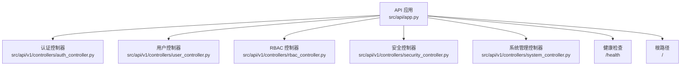
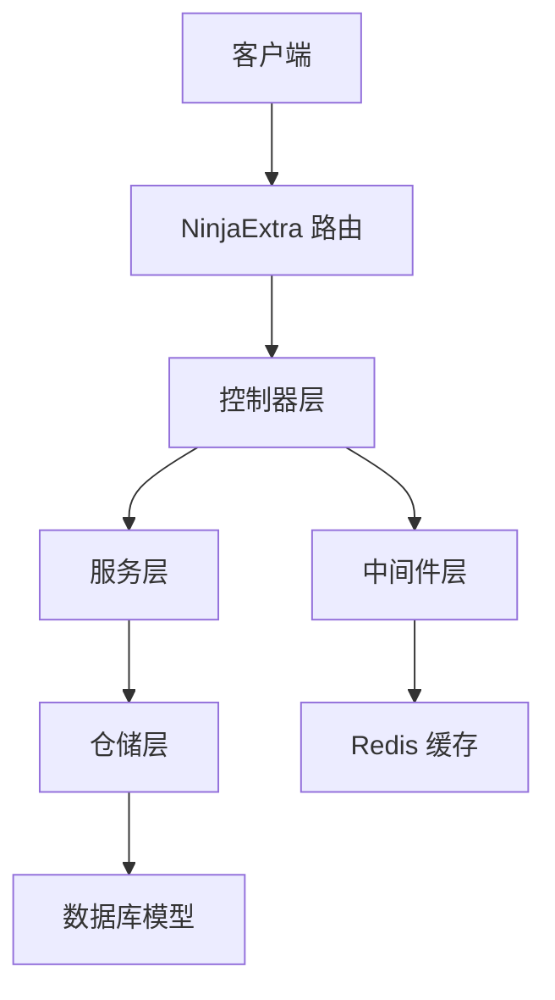
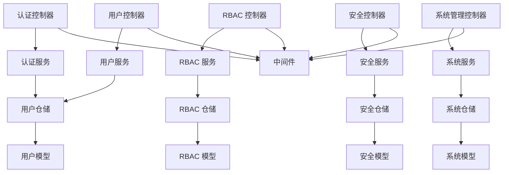

# API 接口文档

<cite>
**本文档引用的文件**
- [src/api/app.py](file://src/api/app.py)
- [src/api/v1/auth_api.py](file://src/api/v1/auth_api.py)
- [src/api/v1/user_api.py](file://src/api/v1/user_api.py)
- [src/api/v1/rbac_api.py](file://src/api/v1/rbac_api.py)
- [src/api/v1/security_api.py](file://src/api/v1/security_api.py)
- [src/api/v1/system_api.py](file://src/api/v1/system_api.py)
- [src/api/v1/controllers/auth_controller.py](file://src/api/v1/controllers/auth_controller.py)
- [src/api/v1/controllers/user_controller.py](file://src/api/v1/controllers/user_controller.py)
- [src/api/v1/controllers/rbac_controller.py](file://src/api/v1/controllers/rbac_controller.py)
- [src/api/v1/controllers/security_controller.py](file://src/api/v1/controllers/security_controller.py)
- [src/api/v1/controllers/system_controller.py](file://src/api/v1/controllers/system_controller.py)
- [src/application/dto/auth/token_response_dto.py](file://src/application/dto/auth/token_response_dto.py)
- [src/application/dto/user/user_create_dto.py](file://src/application/dto/user/user_create_dto.py)
- [src/application/dto/rbac/role_create_dto.py](file://src/application/dto/rbac/role_create_dto.py)
- [src/application/dto/security/rate_limit_rule_dto.py](file://src/application/dto/security/rate_limit_rule_dto.py)
- [src/core/middlewares/rate_limit_middleware.py](file://src/core/middlewares/rate_limit_middleware.py)
- [src/core/middlewares/security_middleware.py](file://src/core/middlewares/security_middleware.py)
- [src/core/middlewares/ip_limit_middleware.py](file://src/core/middlewares/ip_limit_middleware.py)
- [src/core/middlewares/request_logging_middleware.py](file://src/core/middlewares/request_logging_middleware.py)
- [src/infrastructure/auth_jwt/jwt_manager.py](file://src/infrastructure/auth_jwt/jwt_manager.py)
- [src/infrastructure/auth_jwt/token_validator.py](file://src/infrastructure/auth_jwt/token_validator.py)
- [src/infrastructure/cache/cache_manager.py](file://src/infrastructure/cache/cache_manager.py)
- [src/infrastructure/cache/redis_cache.py](file://src/infrastructure/cache/redis_cache.py)
- [src/infrastructure/persistence/models/security_models.py](file://src/infrastructure/persistence/models/security_models.py)
- [src/infrastructure/repositories/user_repo_impl.py](file://src/infrastructure/repositories/user_repo_impl.py)
- [src/infrastructure/repositories/rbac_repo_impl.py](file://src/infrastructure/repositories/rbac_repo_impl.py)
- [src/infrastructure/repositories/security_repo_impl.py](file://src/infrastructure/repositories/security_repo_impl.py)
- [src/infrastructure/repositories/system_repo_impl.py](file://src/infrastructure/repositories/system_repo_impl.py)
</cite>

## 目录
1. [简介](#简介)
2. [项目结构](#项目结构)
3. [核心组件](#核心组件)
4. [架构总览](#架构总览)
5. [详细组件分析](#详细组件分析)
6. [依赖关系分析](#依赖关系分析)
7. [性能考虑](#性能考虑)
8. [故障排除指南](#故障排除指南)
9. [结论](#结论)
10. [附录](#附录)

## 简介
本项目基于 Django-Ninja-Extra 构建，提供一套完整的 RESTful API，集成 JWT 认证与 RBAC 权限管理。API 采用版本化设计（v1），支持认证、用户管理、权限管理、安全防护与系统管理等模块。本文档面向客户端开发者，提供所有端点的 HTTP 方法、URL 模式、请求参数、响应格式、错误码说明、认证机制、权限要求、访问控制策略、API 版本管理与向后兼容性说明、速率限制、错误处理与调试指南。

## 项目结构
API 应用在应用入口处创建 NinjaExtraAPI 实例，并注册多个控制器模块。每个控制器负责特定业务域的路由与权限控制；各控制器内部再调用对应的服务层实现业务逻辑。

图表来源
- [src/api/app.py:17-30](file://src/api/app.py#L17-L30)
- [src/api/v1/controllers/auth_controller.py:16-133](file://src/api/v1/controllers/auth_controller.py#L16-L133)
- [src/api/v1/controllers/user_controller.py:33-283](file://src/api/v1/controllers/user_controller.py#L33-L283)
- [src/api/v1/controllers/rbac_controller.py:38-351](file://src/api/v1/controllers/rbac_controller.py#L38-L351)
- [src/api/v1/controllers/security_controller.py:21-302](file://src/api/v1/controllers/security_controller.py#L21-L302)
- [src/api/v1/controllers/system_controller.py:60-734](file://src/api/v1/controllers/system_controller.py#L60-L734)

章节来源
- [src/api/app.py:17-48](file://src/api/app.py#L17-L48)

## 核心组件
- API 应用与路由注册：在应用入口创建 NinjaExtraAPI 实例并注册控制器。
- 控制器层：每个业务域一个控制器，负责 HTTP 请求处理、参数校验、权限控制与响应封装。
- 服务层：封装具体业务逻辑，如认证、用户、RBAC、安全与系统管理。
- DTO 层：定义请求与响应的数据结构，提供示例与字段说明。
- 中间件层：实现速率限制、IP 过滤、请求日志与安全拦截。
- 存储层：使用 Django ORM 模型持久化数据，支持异步查询。

章节来源
- [src/api/app.py:17-30](file://src/api/app.py#L17-L30)
- [src/api/v1/controllers/auth_controller.py:16-133](file://src/api/v1/controllers/auth_controller.py#L16-L133)
- [src/api/v1/controllers/user_controller.py:33-283](file://src/api/v1/controllers/user_controller.py#L33-L283)
- [src/api/v1/controllers/rbac_controller.py:38-351](file://src/api/v1/controllers/rbac_controller.py#L38-L351)
- [src/api/v1/controllers/security_controller.py:21-302](file://src/api/v1/controllers/security_controller.py#L21-L302)
- [src/api/v1/controllers/system_controller.py:60-734](file://src/api/v1/controllers/system_controller.py#L60-L734)

## 架构总览
API 采用分层架构：控制器接收请求，进行权限与参数校验，调用服务层执行业务逻辑，服务层通过仓储层访问数据库，最终返回 DTO 响应。中间件贯穿请求生命周期，提供安全与性能保障。

图表来源
- [src/api/v1/controllers/auth_controller.py:16-133](file://src/api/v1/controllers/auth_controller.py#L16-L133)
- [src/api/v1/controllers/user_controller.py:33-283](file://src/api/v1/controllers/user_controller.py#L33-L283)
- [src/api/v1/controllers/rbac_controller.py:38-351](file://src/api/v1/controllers/rbac_controller.py#L38-L351)
- [src/api/v1/controllers/security_controller.py:21-302](file://src/api/v1/controllers/security_controller.py#L21-L302)
- [src/api/v1/controllers/system_controller.py:60-734](file://src/api/v1/controllers/system_controller.py#L60-L734)
- [src/infrastructure/cache/redis_cache.py](file://src/infrastructure/cache/redis_cache.py)

## 详细组件分析

### 认证接口
- 服务端点
  - POST /api/v1/auth/login：用户登录，返回访问令牌与刷新令牌
  - POST /api/v1/auth/refresh：使用刷新令牌获取新的访问令牌
  - POST /api/v1/auth/logout：用户登出，撤销当前访问令牌
- 请求参数
  - 登录：用户名、密码、设备信息等（见 DTO）
  - 刷新：刷新令牌
  - 登出：Authorization 头（Bearer Token）
- 响应格式
  - 成功：TokenResponseDTO（包含 access_token、refresh_token、token_type、expires_in、user）
  - 失败：通用错误响应
- 错误码
  - 400：参数校验失败
  - 401：认证失败、令牌无效
  - 429：请求过于频繁（速率限制）
  - 500：服务器内部错误
- 示例
  - 登录请求体：包含用户名、密码、设备信息
  - 登录成功响应：包含访问令牌、刷新令牌与用户信息
  - 刷新请求体：包含刷新令牌
  - 刷新成功响应：新的访问令牌与刷新令牌
  - 登出请求头：Authorization: Bearer <token>
  - 登出成功响应：操作结果消息
- 认证机制
  - JWT 令牌签发与验证，支持访问令牌与刷新令牌
  - 登出时撤销访问令牌（结合缓存或黑名单策略）

章节来源
- [src/api/v1/auth_api.py:22-74](file://src/api/v1/auth_api.py#L22-L74)
- [src/api/v1/controllers/auth_controller.py:36-133](file://src/api/v1/controllers/auth_controller.py#L36-L133)
- [src/application/dto/auth/token_response_dto.py:9-32](file://src/application/dto/auth/token_response_dto.py#L9-L32)

### 用户管理接口
- 服务端点
  - POST /api/v1/users：创建用户
  - GET /api/v1/users/{user_id}：获取用户详情
  - GET /api/v1/users：获取用户列表（支持分页）
  - PUT /api/v1/users/{user_id}：更新用户
  - DELETE /api/v1/users/{user_id}：删除用户
  - POST /api/v1/users/change-password：修改密码（需认证）
  - GET /api/v1/me：获取当前用户信息（需认证）
- 请求参数
  - 创建用户：用户名、邮箱、密码、姓名、电话等（见 DTO）
  - 更新用户：用户 ID 与更新字段
  - 修改密码：旧密码、新密码
  - 获取当前用户：Authorization 头（Bearer Token）
- 响应格式
  - 成功：UserResponseDTO 或分页列表 UserListResponse
  - 失败：通用错误响应
- 错误码
  - 400：参数校验失败
  - 401：未登录或令牌无效
  - 404：用户不存在
  - 409：资源冲突（如重复）
  - 429：请求过于频繁
  - 500：服务器内部错误
- 示例
  - 创建用户请求体：用户名、邮箱、密码等
  - 创建用户成功响应：用户信息
  - 获取当前用户请求头：Authorization: Bearer <token>
  - 获取当前用户成功响应：当前用户信息

章节来源
- [src/api/v1/user_api.py:50-150](file://src/api/v1/user_api.py#L50-L150)
- [src/api/v1/controllers/user_controller.py:53-283](file://src/api/v1/controllers/user_controller.py#L53-L283)
- [src/application/dto/user/user_create_dto.py:9-34](file://src/application/dto/user/user_create_dto.py#L9-L34)

### 权限管理接口
- 服务端点
  - 角色管理
    - POST /api/v1/rbac/roles：创建角色
    - GET /api/v1/rbac/roles/{role_id}：获取角色详情
    - GET /api/v1/rbac/roles：获取角色列表（支持过滤）
    - PUT /api/v1/rbac/roles/{role_id}：更新角色
    - DELETE /api/v1/rbac/roles/{role_id}：删除角色
  - 权限管理
    - GET /api/v1/rbac/permissions：获取权限列表（支持过滤）
    - POST /api/v1/rbac/permissions/init：初始化系统权限
  - 用户角色关联
    - POST /api/v1/rbac/users/{user_id}/roles：分配角色给用户
    - DELETE /api/v1/rbac/users/{user_id}/roles/{role_id}：从用户移除角色
    - GET /api/v1/rbac/users/{user_id}/roles：获取用户角色权限
    - GET /api/v1/rbac/users/{user_id}/permissions/check：检查用户权限
- 请求参数
  - 创建角色：角色名称、代码、描述、权限代码列表（见 DTO）
  - 更新角色：角色 ID 与更新字段
  - 初始化系统权限：无请求体
  - 分配角色：用户 ID 与角色 ID 列表（见 DTO）
  - 检查权限：用户 ID 与权限代码
- 响应格式
  - 成功：RoleResponseDTO、PermissionListResponse、UserRolesResponseDTO 或消息响应
  - 失败：通用错误响应
- 错误码
  - 400：参数校验失败
  - 404：角色/用户不存在
  - 429：请求过于频繁
  - 500：服务器内部错误

章节来源
- [src/api/v1/rbac_api.py:45-184](file://src/api/v1/rbac_api.py#L45-L184)
- [src/api/v1/controllers/rbac_controller.py:60-351](file://src/api/v1/controllers/rbac_controller.py#L60-L351)
- [src/application/dto/rbac/role_create_dto.py:9-30](file://src/application/dto/rbac/role_create_dto.py#L9-L30)

### 安全防护接口
- 服务端点
  - IP 黑名单
    - POST /api/v1/security/blacklist：添加IP到黑名单
    - DELETE /api/v1/security/blacklist/{ip_address}：从黑名单移除IP
    - GET /api/v1/security/blacklist：获取黑名单列表
  - IP 白名单
    - POST /api/v1/security/whitelist：添加IP到白名单
    - DELETE /api/v1/security/whitelist/{ip_address}：从白名单移除IP
    - GET /api/v1/security/whitelist：获取白名单列表
  - 限流规则
    - POST /api/v1/security/rate-limit：创建限流规则
    - PUT /api/v1/security/rate-limit/{rule_id}/toggle：切换限流规则状态
    - DELETE /api/v1/security/rate-limit/{rule_id}：删除限流规则
    - GET /api/v1/security/rate-limit：获取限流规则列表
  - 安全状态
    - GET /api/v1/security/status：获取安全状态
- 请求参数
  - 添加黑名单/白名单：IP 地址、原因/描述、永久标记等
  - 创建限流规则：规则名称、端点、HTTP 方法、速率、周期、作用域、描述（见 DTO）
  - 切换/删除限流规则：规则 ID
- 响应格式
  - 成功：IPBlacklistResponseDTO、IPWhitelistResponseDTO、RateLimitRuleResponseDTO 或消息响应
  - 失败：通用错误响应
- 错误码
  - 400：参数校验失败
  - 404：资源不存在
  - 429：请求过于频繁
  - 500：服务器内部错误

章节来源
- [src/api/v1/security_api.py:35-285](file://src/api/v1/security_api.py#L35-L285)
- [src/api/v1/controllers/security_controller.py:43-302](file://src/api/v1/controllers/security_controller.py#L43-L302)
- [src/application/dto/security/rate_limit_rule_dto.py:9-36](file://src/application/dto/security/rate_limit_rule_dto.py#L9-L36)

### 系统管理接口
- 服务端点
  - 部门管理
    - POST /api/v1/system/depts：创建部门
    - GET /api/v1/system/depts/{dept_id}：获取部门详情
    - PUT /api/v1/system/depts/{dept_id}：更新部门
    - DELETE /api/v1/system/depts/{dept_id}：删除部门
    - GET /api/v1/system/depts：获取部门列表（支持过滤）
    - GET /api/v1/system/depts/tree：获取部门树形结构
  - 菜单管理
    - POST /api/v1/system/menus：创建菜单
    - GET /api/v1/system/menus/{menu_id}：获取菜单详情
    - PUT /api/v1/system/menus/{menu_id}：更新菜单
    - DELETE /api/v1/system/menus/{menu_id}：删除菜单
    - GET /api/v1/system/menus：获取菜单列表（支持过滤）
    - GET /api/v1/system/menus/tree：获取菜单树形结构
  - 角色管理
    - POST /api/v1/system/roles：创建角色
    - GET /api/v1/system/roles/{role_id}：获取角色详情
    - PUT /api/v1/system/roles/{role_id}：更新角色
    - DELETE /api/v1/system/roles/{role_id}：删除角色
    - GET /api/v1/system/roles：获取角色列表（支持过滤）
    - POST /api/v1/system/roles/{role_id}/menus：为角色分配菜单权限
    - GET /api/v1/system/roles/{role_id}/menus：获取角色的菜单列表
  - 用户角色管理
    - POST /api/v1/system/users/{user_id}/roles：为用户分配角色
    - GET /api/v1/system/users/{user_id}/roles：获取用户的角色列表
    - GET /api/v1/system/users/{user_id}/menus：获取用户的菜单权限
  - 操作日志管理
    - GET /api/v1/system/operation-logs：获取操作日志列表（支持多条件过滤与分页）
    - GET /api/v1/system/operation-logs/{log_id}：获取操作日志详情
  - 健康检查
    - GET /api/v1/system/health：健康检查
- 请求参数
  - 部门/菜单/角色：创建、更新 DTO
  - 分配菜单/角色：批量 ID 列表
  - 操作日志：模块、方法、创建者 ID、起止时间、响应码、页码、每页大小
- 响应格式
  - 成功：DeptResponseDTO、MenuResponseDTO、RoleResponseDTO、LogResponseDTO 或分页列表
  - 失败：通用错误响应
- 错误码
  - 400：参数校验失败
  - 404：资源不存在
  - 429：请求过于频繁
  - 500：服务器内部错误

章节来源
- [src/api/v1/system_api.py:73-409](file://src/api/v1/system_api.py#L73-L409)
- [src/api/v1/controllers/system_controller.py:107-734](file://src/api/v1/controllers/system_controller.py#L107-L734)

## 依赖关系分析
- 控制器依赖服务层，服务层依赖仓储层，仓储层依赖数据库模型。
- 中间件贯穿控制器与服务层之间，提供统一的安全与性能控制。
- DTO 作为契约定义，确保请求与响应的结构稳定。

图表来源
- [src/api/v1/controllers/auth_controller.py:27-34](file://src/api/v1/controllers/auth_controller.py#L27-L34)
- [src/api/v1/controllers/user_controller.py:44-51](file://src/api/v1/controllers/user_controller.py#L44-L51)
- [src/api/v1/controllers/rbac_controller.py:49-56](file://src/api/v1/controllers/rbac_controller.py#L49-L56)
- [src/api/v1/controllers/security_controller.py:32-39](file://src/api/v1/controllers/security_controller.py#L32-L39)
- [src/api/v1/controllers/system_controller.py:71-78](file://src/api/v1/controllers/system_controller.py#L71-L78)
- [src/infrastructure/repositories/user_repo_impl.py](file://src/infrastructure/repositories/user_repo_impl.py)
- [src/infrastructure/repositories/rbac_repo_impl.py](file://src/infrastructure/repositories/rbac_repo_impl.py)
- [src/infrastructure/repositories/security_repo_impl.py](file://src/infrastructure/repositories/security_repo_impl.py)
- [src/infrastructure/repositories/system_repo_impl.py](file://src/infrastructure/repositories/system_repo_impl.py)
- [src/infrastructure/persistence/models/security_models.py](file://src/infrastructure/persistence/models/security_models.py)

## 性能考虑
- 速率限制：通过限流规则对端点进行频率控制，支持按 IP 或用户维度限流。
- 缓存：使用 Redis 缓存热点数据与令牌状态，降低数据库压力。
- 异步查询：仓储层使用异步 ORM 查询，提升高并发下的响应速度。
- 中间件优化：请求日志、安全拦截与 IP 过滤在中间件层统一处理，减少控制器负担。

章节来源
- [src/core/middlewares/rate_limit_middleware.py](file://src/core/middlewares/rate_limit_middleware.py)
- [src/core/middlewares/security_middleware.py](file://src/core/middlewares/security_middleware.py)
- [src/core/middlewares/ip_limit_middleware.py](file://src/core/middlewares/ip_limit_middleware.py)
- [src/core/middlewares/request_logging_middleware.py](file://src/core/middlewares/request_logging_middleware.py)
- [src/infrastructure/cache/redis_cache.py](file://src/infrastructure/cache/redis_cache.py)

## 故障排除指南
- 认证失败
  - 检查 Authorization 头格式是否为 Bearer Token
  - 确认令牌未过期且未被撤销
  - 查看登录日志与安全状态
- 速率限制触发
  - 检查限流规则配置与当前请求频率
  - 调整请求间隔或联系管理员调整规则
- 资源不存在
  - 确认 ID 参数正确且资源存在
  - 检查软删除状态与过滤条件
- 数据库异常
  - 查看仓储层异常与模型约束
  - 确认迁移脚本执行状态

章节来源
- [src/api/v1/controllers/auth_controller.py:113-133](file://src/api/v1/controllers/auth_controller.py#L113-L133)
- [src/api/v1/controllers/user_controller.py:196-283](file://src/api/v1/controllers/user_controller.py#L196-L283)
- [src/api/v1/controllers/rbac_controller.py:239-351](file://src/api/v1/controllers/rbac_controller.py#L239-L351)
- [src/api/v1/controllers/security_controller.py:43-302](file://src/api/v1/controllers/security_controller.py#L43-L302)
- [src/api/v1/controllers/system_controller.py:107-734](file://src/api/v1/controllers/system_controller.py#L107-L734)

## 结论
本 API 提供了完整的认证、用户、权限、安全与系统管理能力，采用清晰的分层架构与版本化设计，具备良好的扩展性与可维护性。客户端开发者可依据本文档快速集成，同时通过中间件与缓存机制获得稳定的性能表现。

## 附录

### API 版本管理与向后兼容性
- 版本号：1.0.0
- 命名空间：/api/v1
- 向后兼容性：遵循语义化版本控制，重大变更通过新增版本提供迁移路径

章节来源
- [src/api/app.py:17-21](file://src/api/app.py#L17-L21)

### 认证与权限要求
- 认证方式：JWT Bearer Token
- 权限控制：控制器内通过权限装饰器与中间件实现细粒度访问控制
- 访问策略：公开端点（如登录）与受保护端点（如修改密码、系统管理）

章节来源
- [src/api/v1/controllers/auth_controller.py:16-133](file://src/api/v1/controllers/auth_controller.py#L16-L133)
- [src/api/v1/controllers/user_controller.py:33-283](file://src/api/v1/controllers/user_controller.py#L33-L283)
- [src/api/v1/controllers/rbac_controller.py:38-351](file://src/api/v1/controllers/rbac_controller.py#L38-L351)
- [src/api/v1/controllers/security_controller.py:21-302](file://src/api/v1/controllers/security_controller.py#L21-L302)
- [src/api/v1/controllers/system_controller.py:60-734](file://src/api/v1/controllers/system_controller.py#L60-L734)

### 速率限制与安全策略
- 速率限制：基于限流规则的端点级频率控制
- IP 黑/白名单：支持黑名单阻断与白名单放行
- 安全日志：记录访问状态与规则统计

章节来源
- [src/api/v1/security_api.py:161-285](file://src/api/v1/security_api.py#L161-L285)
- [src/api/v1/controllers/security_controller.py:189-302](file://src/api/v1/controllers/security_controller.py#L189-L302)