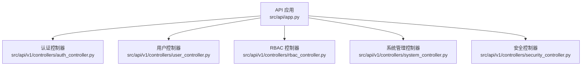
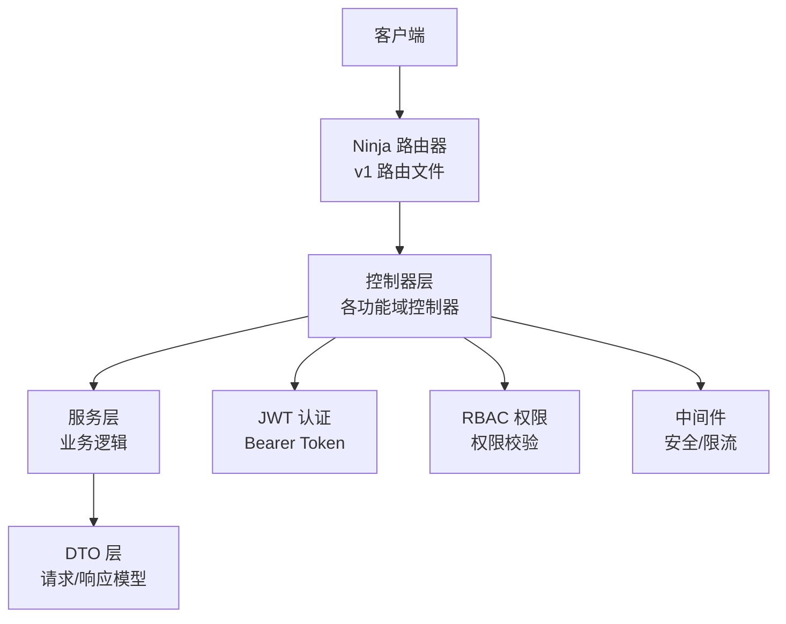
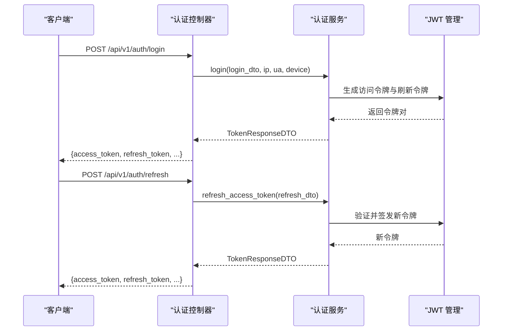
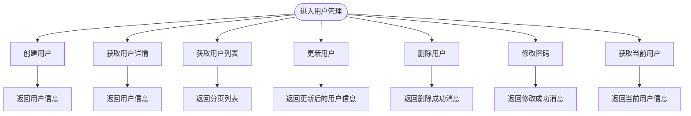
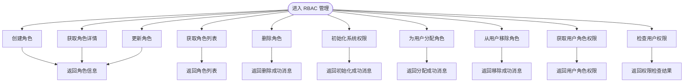
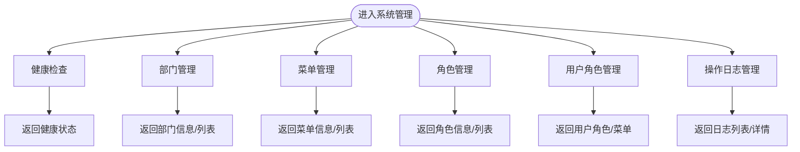
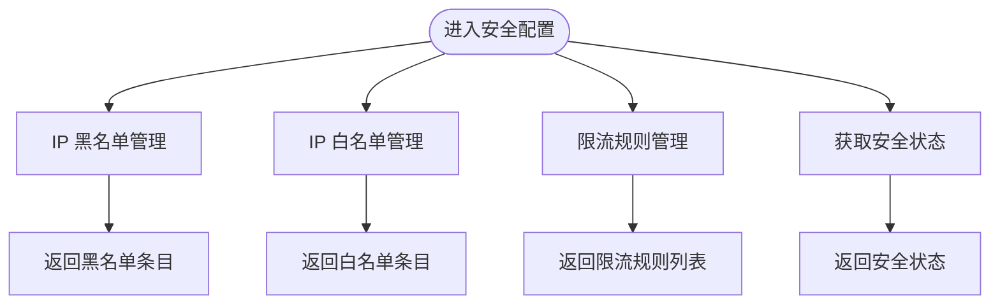
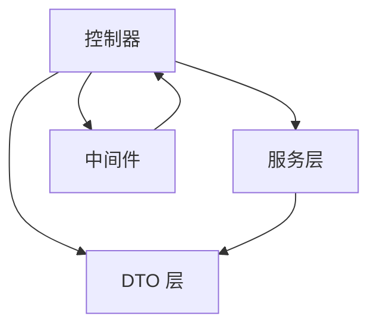

# API 接口文档

<cite>
**本文档引用的文件**
- [src/api/app.py](file://src/api/app.py)
- [src/api/v1/auth_api.py](file://src/api/v1/auth_api.py)
- [src/api/v1/user_api.py](file://src/api/v1/user_api.py)
- [src/api/v1/rbac_api.py](file://src/api/v1/rbac_api.py)
- [src/api/v1/system_api.py](file://src/api/v1/system_api.py)
- [src/api/v1/security_api.py](file://src/api/v1/security_api.py)
- [src/api/v1/controllers/auth_controller.py](file://src/api/v1/controllers/auth_controller.py)
- [src/api/v1/controllers/user_controller.py](file://src/api/v1/controllers/user_controller.py)
- [src/api/v1/controllers/rbac_controller.py](file://src/api/v1/controllers/rbac_controller.py)
- [src/api/v1/controllers/system_controller.py](file://src/api/v1/controllers/system_controller.py)
- [src/api/v1/controllers/security_controller.py](file://src/api/v1/controllers/security_controller.py)
- [src/application/dto/auth/token_response_dto.py](file://src/application/dto/auth/token_response_dto.py)
- [src/application/dto/user/user_create_dto.py](file://src/application/dto/user/user_create_dto.py)
- [src/application/dto/rbac/role_create_dto.py](file://src/application/dto/rbac/role_create_dto.py)
- [src/core/middlewares/rate_limit_middleware.py](file://src/core/middlewares/rate_limit_middleware.py)
- [src/core/middlewares/security_middleware.py](file://src/core/middlewares/security_middleware.py)
</cite>

## 目录
1. [简介](#简介)
2. [项目结构](#项目结构)
3. [核心组件](#核心组件)
4. [架构总览](#架构总览)
5. [详细组件分析](#详细组件分析)
6. [依赖分析](#依赖分析)
7. [性能考虑](#性能考虑)
8. [故障排除指南](#故障排除指南)
9. [结论](#结论)
10. [附录](#附录)

## 简介
本项目基于 Django-Ninja-Extra 构建，提供一套完整的 RESTful API 服务，集成 JWT 认证与 RBAC 权限管理。API 采用版本化设计（v1），支持认证、用户管理、RBAC 权限管理、系统管理（部门、菜单、角色、操作日志）以及安全配置（IP 黑/白名单、限流规则）。本文档面向开发者与测试人员，提供每个接口的完整规范、认证方式、请求/响应示例、状态码说明、最佳实践与故障排除建议。

## 项目结构
API 应用在应用入口处集中注册控制器，按功能模块拆分为认证、用户、RBAC、系统管理、安全五个领域控制器，每个控制器对应一组路由与业务服务。

**图表来源**
- [src/api/app.py:78-84](file://src/api/app.py#L78-L84)
- [src/api/v1/controllers/auth_controller.py:16](file://src/api/v1/controllers/auth_controller.py#L16)
- [src/api/v1/controllers/user_controller.py:33](file://src/api/v1/controllers/user_controller.py#L33)
- [src/api/v1/controllers/rbac_controller.py:38](file://src/api/v1/controllers/rbac_controller.py#L38)
- [src/api/v1/controllers/system_controller.py:60](file://src/api/v1/controllers/system_controller.py#L60)
- [src/api/v1/controllers/security_controller.py:21](file://src/api/v1/controllers/security_controller.py#L21)

**章节来源**
- [src/api/app.py:70-102](file://src/api/app.py#L70-L102)

## 核心组件
- API 应用与版本化：应用实例在入口文件中创建并注册控制器，统一暴露 v1 版本接口。
- 控制器层：每个功能域控制器负责路由映射、参数校验与调用服务层。
- DTO 层：定义请求/响应的数据结构与示例，确保前后端契约一致。
- 中间件层：提供安全头注入、限流控制等横切能力。

**章节来源**
- [src/api/app.py:60-84](file://src/api/app.py#L60-L84)
- [src/api/v1/controllers/auth_controller.py:16-35](file://src/api/v1/controllers/auth_controller.py#L16-L35)
- [src/api/v1/controllers/user_controller.py:33-52](file://src/api/v1/controllers/user_controller.py#L33-L52)
- [src/api/v1/controllers/rbac_controller.py:38-57](file://src/api/v1/controllers/rbac_controller.py#L38-L57)
- [src/api/v1/controllers/system_controller.py:60-79](file://src/api/v1/controllers/system_controller.py#L60-L79)
- [src/api/v1/controllers/security_controller.py:21-40](file://src/api/v1/controllers/security_controller.py#L21-L40)

## 架构总览
API 采用分层架构：控制器接收请求、服务层执行业务逻辑、DTO 进行数据契约约束、中间件提供横切关注点（安全、限流）。认证采用 Bearer Token，权限控制通过 RBAC 实现。

**图表来源**
- [src/api/v1/auth_api.py:13](file://src/api/v1/auth_api.py#L13)
- [src/api/v1/user_api.py:18](file://src/api/v1/user_api.py#L18)
- [src/api/v1/rbac_api.py:19](file://src/api/v1/rbac_api.py#L19)
- [src/api/v1/system_api.py:27](file://src/api/v1/system_api.py#L27)
- [src/api/v1/security_api.py:23](file://src/api/v1/security_api.py#L23)
- [src/core/middlewares/security_middleware.py:14](file://src/core/middlewares/security_middleware.py#L14)
- [src/core/middlewares/rate_limit_middleware.py:15](file://src/core/middlewares/rate_limit_middleware.py#L15)

## 详细组件分析

### 认证 API
- 基础路径：/api/v1/auth
- 版本：v1
- 认证：支持 Bearer Token；部分接口允许匿名访问（如登录）
- 关键接口：
  - POST /login：用户名/密码登录，返回访问令牌与刷新令牌
  - POST /refresh：使用刷新令牌获取新的访问令牌
  - POST /logout：撤销当前访问令牌

请求示例（登录）
- 方法：POST
- 路径：/api/v1/auth/login
- 请求头：Content-Type: application/json
- 请求体（JSON Schema 示例）：包含用户名、密码、设备信息等字段
- 成功响应：包含 access_token、refresh_token、token_type、expires_in、user 等字段
- 失败响应：错误码与错误信息

请求示例（刷新令牌）
- 方法：POST
- 路径：/api/v1/auth/refresh
- 请求体：包含刷新令牌
- 成功响应：新的访问令牌与刷新令牌
- 失败响应：错误码与错误信息

请求示例（登出）
- 方法：POST
- 路径：/api/v1/auth/logout
- 请求头：Authorization: Bearer <token>
- 成功响应：操作成功消息
- 失败响应：错误码与错误信息

认证流程序列图

**图表来源**
- [src/api/v1/controllers/auth_controller.py:36-105](file://src/api/v1/controllers/auth_controller.py#L36-L105)
- [src/application/dto/auth/token_response_dto.py:9-32](file://src/application/dto/auth/token_response_dto.py#L9-L32)

**章节来源**
- [src/api/v1/auth_api.py:22-74](file://src/api/v1/auth_api.py#L22-L74)
- [src/api/v1/controllers/auth_controller.py:36-133](file://src/api/v1/controllers/auth_controller.py#L36-L133)
- [src/application/dto/auth/token_response_dto.py:9-32](file://src/application/dto/auth/token_response_dto.py#L9-L32)

### 用户管理 API
- 基础路径：/api/v1/users
- 版本：v1
- 认证：除创建用户外，其他接口需 Bearer Token
- 关键接口：
  - POST /users：创建用户
  - GET /users/{user_id}：获取用户详情
  - GET /users：获取用户列表（分页）
  - PUT /users/{user_id}：更新用户
  - DELETE /users/{user_id}：删除用户
  - POST /users/change-password：修改密码（需认证）
  - GET /me：获取当前用户信息（需认证）

请求示例（创建用户）
- 方法：POST
- 路径：/api/v1/users
- 请求体：包含用户名、邮箱、密码、姓名、电话等字段
- 成功响应：用户信息 DTO
- 失败响应：错误码与错误信息

请求示例（获取当前用户）
- 方法：GET
- 路径：/api/v1/me
- 请求头：Authorization: Bearer <token>
- 成功响应：用户信息 DTO
- 失败响应：错误码与错误信息

用户管理流程图

**图表来源**
- [src/api/v1/user_api.py:50-150](file://src/api/v1/user_api.py#L50-L150)
- [src/api/v1/controllers/user_controller.py:53-283](file://src/api/v1/controllers/user_controller.py#L53-L283)

**章节来源**
- [src/api/v1/user_api.py:50-150](file://src/api/v1/user_api.py#L50-L150)
- [src/api/v1/controllers/user_controller.py:53-283](file://src/api/v1/controllers/user_controller.py#L53-L283)
- [src/application/dto/user/user_create_dto.py:9-34](file://src/application/dto/user/user_create_dto.py#L9-L34)

### RBAC 管理 API
- 基础路径：/api/v1/rbac
- 版本：v1
- 认证：匿名可访问（部分管理接口可能需要更高权限）
- 关键接口：
  - 角色管理：POST/GET/PUT/DELETE /roles
  - 权限管理：GET /permissions、POST /permissions/init
  - 用户角色关联：POST/DELETE /users/{user_id}/roles、GET /users/{user_id}/roles、GET /users/{user_id}/permissions/check

请求示例（创建角色）
- 方法：POST
- 路径：/api/v1/rbac/roles
- 请求体：包含角色名称、代码、描述、权限代码列表
- 成功响应：角色信息 DTO
- 失败响应：错误码与错误信息

请求示例（初始化系统权限）
- 方法：POST
- 路径：/api/v1/rbac/permissions/init
- 成功响应：初始化成功消息
- 失败响应：错误码与错误信息

RBAC 管理流程图

**图表来源**
- [src/api/v1/rbac_api.py:45-184](file://src/api/v1/rbac_api.py#L45-L184)
- [src/api/v1/controllers/rbac_controller.py:60-351](file://src/api/v1/controllers/rbac_controller.py#L60-L351)

**章节来源**
- [src/api/v1/rbac_api.py:45-184](file://src/api/v1/rbac_api.py#L45-L184)
- [src/api/v1/controllers/rbac_controller.py:60-351](file://src/api/v1/controllers/rbac_controller.py#L60-L351)
- [src/application/dto/rbac/role_create_dto.py:9-30](file://src/application/dto/rbac/role_create_dto.py#L9-L30)

### 系统管理 API
- 基础路径：/api/v1/system
- 版本：v1
- 认证：匿名可访问（健康检查等）
- 关键接口：
  - 部门管理：POST/GET/PUT/DELETE /depts、GET /depts/tree
  - 菜单管理：POST/GET/PUT/DELETE /menus、GET /menus/tree
  - 角色管理：POST/GET/PUT/DELETE /roles、POST /roles/{role_id}/menus、GET /roles/{role_id}/menus
  - 用户角色管理：POST /users/{user_id}/roles、GET /users/{user_id}/roles、GET /users/{user_id}/menus
  - 操作日志：GET /operation-logs、GET /operation-logs/{log_id}

系统管理流程图

**图表来源**
- [src/api/v1/system_api.py:73-409](file://src/api/v1/system_api.py#L73-L409)
- [src/api/v1/controllers/system_controller.py:107-734](file://src/api/v1/controllers/system_controller.py#L107-L734)

**章节来源**
- [src/api/v1/system_api.py:73-409](file://src/api/v1/system_api.py#L73-L409)
- [src/api/v1/controllers/system_controller.py:107-734](file://src/api/v1/controllers/system_controller.py#L107-L734)

### 安全配置 API
- 基础路径：/api/v1/security
- 版本：v1
- 认证：匿名可访问
- 关键接口：
  - IP 黑名单：POST/DELETE/GET /blacklist
  - IP 白名单：POST/DELETE/GET /whitelist
  - 限流规则：POST/PUT/DELETE/GET /rate-limit
  - 安全状态：GET /security/status

安全配置流程图

**图表来源**
- [src/api/v1/security_api.py:35-285](file://src/api/v1/security_api.py#L35-L285)
- [src/api/v1/controllers/security_controller.py:43-302](file://src/api/v1/controllers/security_controller.py#L43-L302)

**章节来源**
- [src/api/v1/security_api.py:35-285](file://src/api/v1/security_api.py#L35-L285)
- [src/api/v1/controllers/security_controller.py:43-302](file://src/api/v1/controllers/security_controller.py#L43-L302)

## 依赖分析
- 控制器依赖服务层：控制器通过依赖注入或直接实例化服务类，实现业务逻辑解耦。
- DTO 作为契约：所有接口的请求/响应均通过 DTO 明确字段与示例，避免前后端不一致。
- 中间件提供横切能力：安全中间件统一注入安全响应头；限流中间件进行基础频率限制。

**图表来源**
- [src/api/v1/controllers/auth_controller.py:27-34](file://src/api/v1/controllers/auth_controller.py#L27-L34)
- [src/api/v1/controllers/user_controller.py:44-51](file://src/api/v1/controllers/user_controller.py#L44-L51)
- [src/api/v1/controllers/rbac_controller.py:49-56](file://src/api/v1/controllers/rbac_controller.py#L49-L56)
- [src/api/v1/controllers/system_controller.py:71-78](file://src/api/v1/controllers/system_controller.py#L71-L78)
- [src/api/v1/controllers/security_controller.py:32-39](file://src/api/v1/controllers/security_controller.py#L32-L39)

**章节来源**
- [src/api/v1/controllers/auth_controller.py:27-34](file://src/api/v1/controllers/auth_controller.py#L27-L34)
- [src/api/v1/controllers/user_controller.py:44-51](file://src/api/v1/controllers/user_controller.py#L44-L51)
- [src/api/v1/controllers/rbac_controller.py:49-56](file://src/api/v1/controllers/rbac_controller.py#L49-L56)
- [src/api/v1/controllers/system_controller.py:71-78](file://src/api/v1/controllers/system_controller.py#L71-L78)
- [src/api/v1/controllers/security_controller.py:32-39](file://src/api/v1/controllers/security_controller.py#L32-L39)

## 性能考虑
- 限流策略：内置基础限流中间件，默认每分钟 100 次请求（可配置），超过阈值返回 429。
- 缓存利用：建议在生产环境使用 Redis 缓存存储限流计数与令牌缓存，提升性能与一致性。
- 分页查询：用户列表、日志列表等接口支持分页参数，建议前端合理设置 page_size。
- 响应头安全：安全中间件在生产环境注入安全响应头，减少 XSS、点击劫持等风险。
- 异步处理：登录、刷新等认证流程使用异步服务，降低阻塞。

**章节来源**
- [src/core/middlewares/rate_limit_middleware.py:15-112](file://src/core/middlewares/rate_limit_middleware.py#L15-L112)
- [src/core/middlewares/security_middleware.py:14-54](file://src/core/middlewares/security_middleware.py#L14-L54)

## 故障排除指南
- 认证失败：检查 Authorization 头是否为 Bearer Token，确认令牌未过期且有效。
- 权限不足：RBAC 接口需具备相应角色/权限，检查用户角色与权限分配。
- 资源不存在：用户、角色、菜单、日志等资源不存在时返回明确错误信息。
- 请求过于频繁：触发限流中间件，等待冷却或调整调用频率。
- 数据验证错误：请求体不符合 DTO 字段约束（长度、格式等），修正后重试。

**章节来源**
- [src/api/v1/user_api.py:63-112](file://src/api/v1/user_api.py#L63-L112)
- [src/api/v1/rbac_api.py:58-103](file://src/api/v1/rbac_api.py#L58-L103)
- [src/api/v1/system_api.py:87-122](file://src/api/v1/system_api.py#L87-L122)
- [src/core/middlewares/rate_limit_middleware.py:58-66](file://src/core/middlewares/rate_limit_middleware.py#L58-L66)

## 结论
本 API 提供了完善的认证、用户、RBAC、系统管理与安全配置能力，采用清晰的分层架构与 DTO 契约，便于维护与扩展。建议在生产环境中启用 Redis 缓存、完善限流规则、加强日志审计，并持续优化分页与批量接口性能。

## 附录

### API 版本管理与兼容性
- 版本策略：所有接口位于 /api/v1 路径，未来升级通过新增版本路径保持向后兼容。
- 兼容性考虑：新增字段采用可选，避免破坏现有客户端；变更字段需在新版本中声明。

**章节来源**
- [src/api/app.py:71-75](file://src/api/app.py#L71-L75)

### 认证机制与权限要求
- Bearer Token：所有受保护接口需在 Authorization 头中携带 Bearer Token。
- 权限控制：RBAC 控制器与用户控制器中对特定接口标注权限要求（如 IsAuthenticated）。

**章节来源**
- [src/api/v1/user_api.py:36-47](file://src/api/v1/user_api.py#L36-L47)
- [src/api/v1/controllers/user_controller.py:232-233](file://src/api/v1/controllers/user_controller.py#L232-L233)

### 请求与响应示例
- 登录成功响应示例：包含 access_token、refresh_token、token_type、expires_in、user 等字段。
- 创建用户成功响应示例：返回创建后的用户信息 DTO。
- 创建角色成功响应示例：返回角色信息 DTO（包含名称、代码、权限列表等）。

**章节来源**
- [src/application/dto/auth/token_response_dto.py:18-27](file://src/application/dto/auth/token_response_dto.py#L18-L27)
- [src/application/dto/user/user_create_dto.py:19-29](file://src/application/dto/user/user_create_dto.py#L19-L29)
- [src/application/dto/rbac/role_create_dto.py:17-25](file://src/application/dto/rbac/role_create_dto.py#L17-L25)

### API 使用最佳实践
- 统一使用 Bearer Token 进行鉴权，妥善保管 refresh_token。
- 对敏感操作（修改密码、删除用户、分配角色）增加二次确认与审计日志。
- 合理设置分页参数，避免一次性拉取过多数据。
- 在高并发场景下启用 Redis 缓存与更细粒度的限流规则。

**章节来源**
- [src/core/middlewares/security_middleware.py:47-51](file://src/core/middlewares/security_middleware.py#L47-L51)
- [src/core/middlewares/rate_limit_middleware.py:38-39](file://src/core/middlewares/rate_limit_middleware.py#L38-L39)

### 常见使用场景
- 管理员登录后为用户分配角色并检查权限。
- 系统初始化时创建默认角色与权限，再批量分配给用户。
- 安全运维人员通过 IP 黑/白名单与限流规则保护 API。

**章节来源**
- [src/api/v1/rbac_api.py:121-128](file://src/api/v1/rbac_api.py#L121-L128)
- [src/api/v1/security_api.py:35-94](file://src/api/v1/security_api.py#L35-L94)