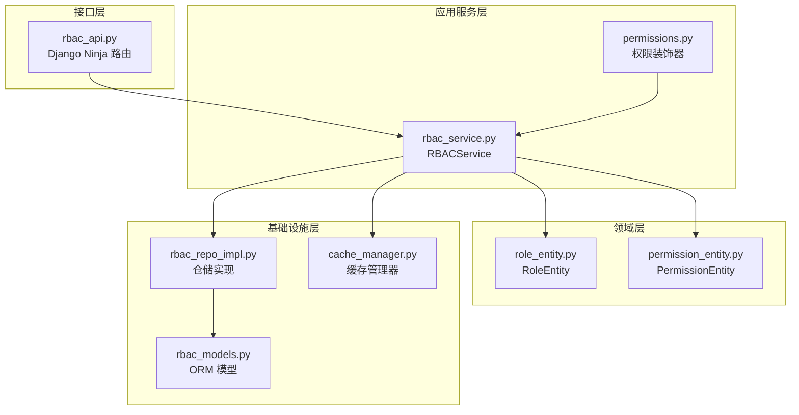
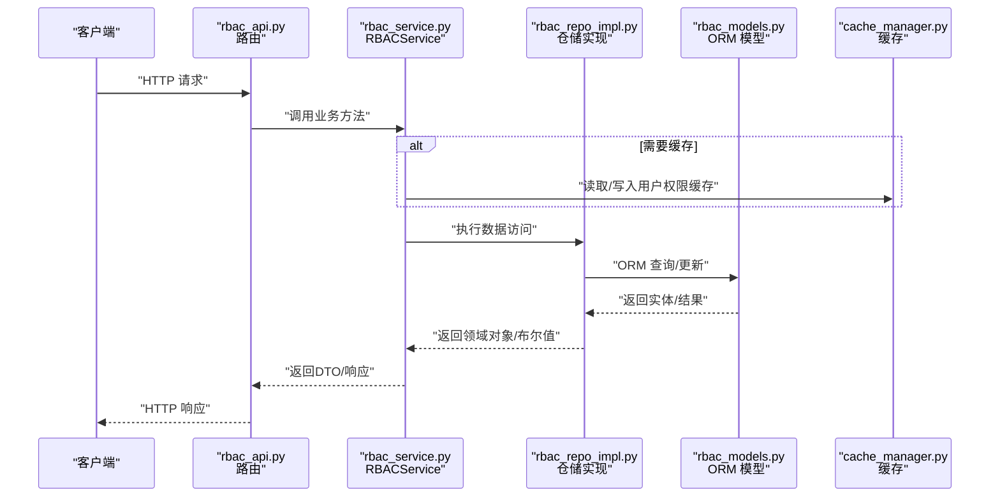
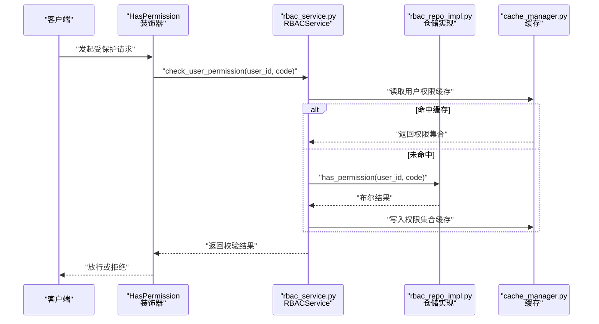
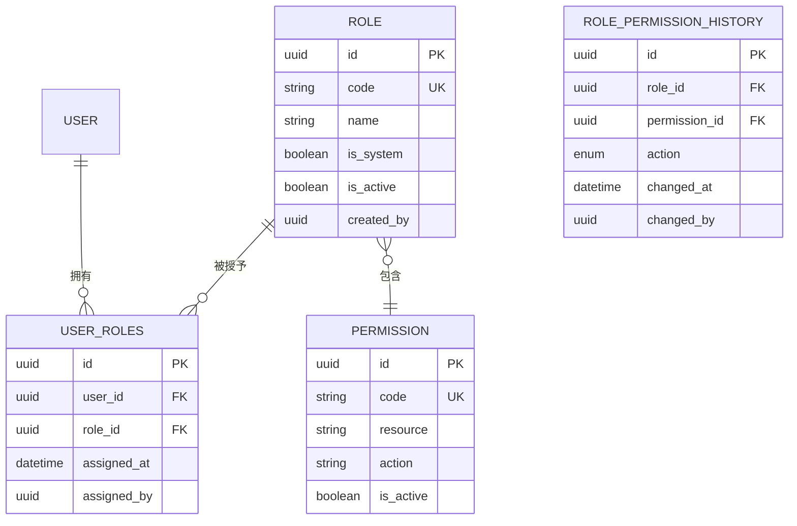
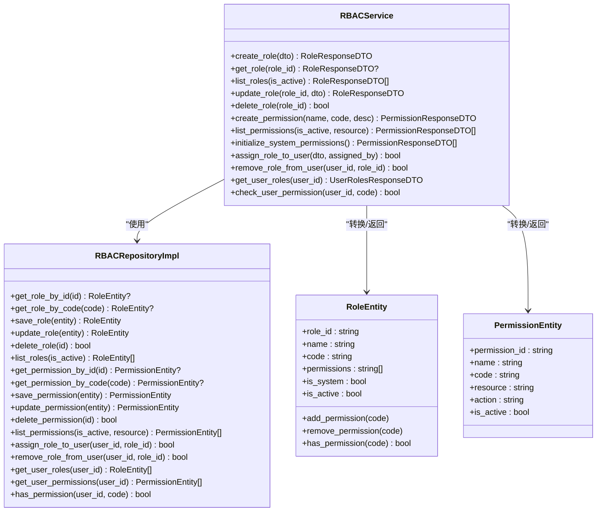
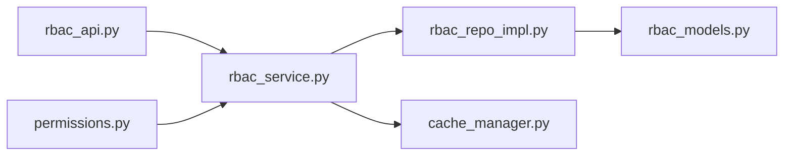

# RBAC 权限管理 API

<cite>
**本文引用的文件**
- [rbac_api.py](file://src/api/v1/rbac_api.py)
- [rbac_service.py](file://src/application/services/rbac_service.py)
- [rbac_repo_impl.py](file://src/infrastructure/repositories/rbac_repo_impl.py)
- [rbac_models.py](file://src/infrastructure/persistence/models/rbac_models.py)
- [role_entity.py](file://src/domain/rbac/entities/role_entity.py)
- [permission_entity.py](file://src/domain/rbac/entities/permission_entity.py)
- [role_create_dto.py](file://src/application/dto/rbac/role_create_dto.py)
- [role_update_dto.py](file://src/application/dto/rbac/role_update_dto.py)
- [assign_role_dto.py](file://src/application/dto/rbac/assign_role_dto.py)
- [user_roles_response_dto.py](file://src/application/dto/rbac/user_roles_response_dto.py)
- [cache_manager.py](file://src/infrastructure/cache/cache_manager.py)
- [permissions.py](file://src/api/common/permissions.py)
- [permission_denied_error.py](file://src/core/exceptions/permission_denied_error.py)
- [rbac.sql](file://sql/rbac.sql)
</cite>

## 目录
1. [简介](#简介)
2. [项目结构](#项目结构)
3. [核心组件](#核心组件)
4. [架构总览](#架构总览)
5. [详细组件分析](#详细组件分析)
6. [依赖分析](#依赖分析)
7. [性能考量](#性能考量)
8. [故障排查指南](#故障排查指南)
9. [结论](#结论)
10. [附录](#附录)

## 简介
本文件面向 RBAC 权限管理 API 的使用者与维护者，系统性梳理角色管理、权限管理、用户角色关联等接口的完整规范；详述角色 CRUD、权限查询与初始化、用户角色分配与校验流程；给出权限数据模型、权限验证机制与继承规则；并提供最佳实践、安全考虑、错误处理与性能优化建议。

## 项目结构
RBAC 功能采用“接口层-应用服务层-领域层-基础设施层”的分层架构：
- 接口层：Django Ninja 路由与控制器，负责 HTTP 请求/响应与参数校验
- 应用服务层：RBACService，封装业务逻辑与缓存交互
- 领域层：RoleEntity、PermissionEntity，定义角色与权限的领域模型
- 基础设施层：ORM 模型、仓储实现、缓存管理器

图表来源
- [rbac_api.py:1-184](file://src/api/v1/rbac_api.py#L1-L184)
- [rbac_service.py:1-286](file://src/application/services/rbac_service.py#L1-L286)
- [rbac_repo_impl.py:1-253](file://src/infrastructure/repositories/rbac_repo_impl.py#L1-L253)
- [rbac_models.py:1-148](file://src/infrastructure/persistence/models/rbac_models.py#L1-L148)
- [role_entity.py:1-80](file://src/domain/rbac/entities/role_entity.py#L1-L80)
- [permission_entity.py:1-85](file://src/domain/rbac/entities/permission_entity.py#L1-L85)
- [permissions.py:1-245](file://src/api/common/permissions.py#L1-L245)
- [cache_manager.py:1-149](file://src/infrastructure/cache/cache_manager.py#L1-L149)

章节来源
- [rbac_api.py:1-184](file://src/api/v1/rbac_api.py#L1-L184)
- [rbac_service.py:1-286](file://src/application/services/rbac_service.py#L1-L286)
- [rbac_repo_impl.py:1-253](file://src/infrastructure/repositories/rbac_repo_impl.py#L1-L253)
- [rbac_models.py:1-148](file://src/infrastructure/persistence/models/rbac_models.py#L1-L148)
- [permissions.py:1-245](file://src/api/common/permissions.py#L1-L245)
- [cache_manager.py:1-149](file://src/infrastructure/cache/cache_manager.py#L1-L149)

## 核心组件
- 角色管理：创建、查询、更新、删除、列表
- 权限管理：查询、初始化系统权限
- 用户角色关联：分配角色、移除角色、查询用户角色与权限、检查用户权限
- 权限验证：基于 Token 的认证与权限检查装饰器
- 缓存策略：用户权限与角色缓存，降低权限校验开销

章节来源
- [rbac_api.py:45-184](file://src/api/v1/rbac_api.py#L45-L184)
- [rbac_service.py:33-286](file://src/application/services/rbac_service.py#L33-L286)
- [rbac_repo_impl.py:50-248](file://src/infrastructure/repositories/rbac_repo_impl.py#L50-L248)
- [permissions.py:14-245](file://src/api/common/permissions.py#L14-L245)
- [cache_manager.py:16-149](file://src/infrastructure/cache/cache_manager.py#L16-L149)

## 架构总览
下图展示 RBAC API 的调用链路与数据流：

图表来源
- [rbac_api.py:45-184](file://src/api/v1/rbac_api.py#L45-L184)
- [rbac_service.py:33-286](file://src/application/services/rbac_service.py#L33-L286)
- [rbac_repo_impl.py:50-248](file://src/infrastructure/repositories/rbac_repo_impl.py#L50-L248)
- [rbac_models.py:13-148](file://src/infrastructure/persistence/models/rbac_models.py#L13-L148)
- [cache_manager.py:16-149](file://src/infrastructure/cache/cache_manager.py#L16-L149)

## 详细组件分析

### 角色管理接口
- 创建角色
  - 方法：POST /roles
  - 输入：RoleCreateDTO（名称、代码、描述、权限代码列表）
  - 行为：校验代码唯一性，创建角色，批量关联权限
  - 返回：RoleResponseDTO
- 获取角色详情
  - 方法：GET /roles/{role_id}
  - 行为：按 ID 查询角色
  - 返回：RoleResponseDTO 或抛出错误
- 获取角色列表
  - 方法：GET /roles
  - 参数：is_active（可选）
  - 行为：筛选角色并返回总数
  - 返回：RoleListResponse
- 更新角色
  - 方法：PUT /roles/{role_id}
  - 输入：RoleUpdateDTO（名称、描述、权限代码列表）
  - 行为：禁止修改系统角色；更新字段与权限集合
  - 返回：RoleResponseDTO
- 删除角色
  - 方法：DELETE /roles/{role_id}
  - 行为：禁止删除系统角色；删除角色
  - 返回：MessageResponse

章节来源
- [rbac_api.py:45-104](file://src/api/v1/rbac_api.py#L45-L104)
- [rbac_service.py:33-106](file://src/application/services/rbac_service.py#L33-L106)
- [rbac_repo_impl.py:50-98](file://src/infrastructure/repositories/rbac_repo_impl.py#L50-L98)
- [role_create_dto.py:9-30](file://src/application/dto/rbac/role_create_dto.py#L9-L30)
- [role_update_dto.py:9-28](file://src/application/dto/rbac/role_update_dto.py#L9-L28)

### 权限管理接口
- 获取权限列表
  - 方法：GET /permissions
  - 参数：is_active（可选）、resource（可选）
  - 行为：按条件筛选权限
  - 返回：PermissionListResponse
- 初始化系统权限
  - 方法：POST /permissions/init
  - 行为：遍历预定义权限，未存在则创建
  - 返回：MessageResponse

章节来源
- [rbac_api.py:109-128](file://src/api/v1/rbac_api.py#L109-L128)
- [rbac_service.py:145-167](file://src/application/services/rbac_service.py#L145-L167)
- [permission_entity.py:64-85](file://src/domain/rbac/entities/permission_entity.py#L64-L85)

### 用户角色关联接口
- 分配角色给用户
  - 方法：POST /users/{user_id}/roles
  - 输入：AssignRoleDTO（user_id、role_id）
  - 行为：校验用户与角色存在性及状态；去重；创建关联；清理缓存
  - 返回：MessageResponse
- 从用户移除角色
  - 方法：DELETE /users/{user_id}/roles/{role_id}
  - 行为：删除关联；清理缓存
  - 返回：MessageResponse
- 获取用户角色与权限
  - 方法：GET /users/{user_id}/roles
  - 行为：聚合用户角色与权限代码
  - 返回：UserRolesResponseDTO
- 检查用户权限
  - 方法：GET /users/{user_id}/permissions/check
  - 参数：permission_code
  - 行为：异步校验用户是否拥有某权限（含缓存命中路径）

章节来源
- [rbac_api.py:134-183](file://src/api/v1/rbac_api.py#L134-L183)
- [rbac_service.py:171-251](file://src/application/services/rbac_service.py#L171-L251)
- [rbac_repo_impl.py:186-248](file://src/infrastructure/repositories/rbac_repo_impl.py#L186-L248)
- [assign_role_dto.py:9-21](file://src/application/dto/rbac/assign_role_dto.py#L9-L21)
- [user_roles_response_dto.py:11-17](file://src/application/dto/rbac/user_roles_response_dto.py#L11-L17)

### 权限验证机制与继承规则
- 认证：Bearer Token 解析与注入 user_id、payload
- 权限检查：
  - HasPermission：要求精确权限码
  - HasAnyPermission：任一权限满足即可
  - IsAdminUser：基于 JWT payload 中 roles 含 admin
- 权限继承：用户通过角色间接获得权限，系统按“用户-角色-权限”链路计算有效权限集

图表来源
- [permissions.py:47-121](file://src/api/common/permissions.py#L47-L121)
- [rbac_service.py:233-251](file://src/application/services/rbac_service.py#L233-L251)
- [rbac_repo_impl.py:230-248](file://src/infrastructure/repositories/rbac_repo_impl.py#L230-L248)
- [cache_manager.py:108-122](file://src/infrastructure/cache/cache_manager.py#L108-L122)

章节来源
- [permissions.py:14-245](file://src/api/common/permissions.py#L14-L245)
- [rbac_service.py:233-251](file://src/application/services/rbac_service.py#L233-L251)
- [rbac_repo_impl.py:230-248](file://src/infrastructure/repositories/rbac_repo_impl.py#L230-L248)
- [cache_manager.py:108-122](file://src/infrastructure/cache/cache_manager.py#L108-L122)

### 数据模型与关系
- 角色（Role）：唯一 code，多对多关联权限，可被系统角色标记
- 权限（Permission）：唯一 code，带 resource/action 分类
- 用户角色关联（UserRole）：用户与角色的多对多关系，唯一约束避免重复分配
- 角色权限历史（RolePermissionHistory）：记录角色权限变更

图表来源
- [rbac_models.py:13-148](file://src/infrastructure/persistence/models/rbac_models.py#L13-L148)

章节来源
- [rbac_models.py:13-148](file://src/infrastructure/persistence/models/rbac_models.py#L13-L148)
- [rbac.sql:180-232](file://sql/rbac.sql#L180-L232)

### 类与职责（代码级）

图表来源
- [rbac_service.py:22-286](file://src/application/services/rbac_service.py#L22-L286)
- [rbac_repo_impl.py:15-253](file://src/infrastructure/repositories/rbac_repo_impl.py#L15-L253)
- [role_entity.py:11-80](file://src/domain/rbac/entities/role_entity.py#L11-L80)
- [permission_entity.py:11-85](file://src/domain/rbac/entities/permission_entity.py#L11-L85)

## 依赖分析
- 控制器到服务：rbac_api.py 依赖 rbac_service
- 服务到仓储：rbac_service 依赖 rbac_repo_impl
- 仓储到模型：rbac_repo_impl 使用 rbac_models
- 服务到缓存：rbac_service 使用 cache_manager
- 权限装饰器到服务：HasPermission/HasAnyPermission 在异步阶段调用 rbac_service

图表来源
- [rbac_api.py:17](file://src/api/v1/rbac_api.py#L17)
- [rbac_service.py:19](file://src/application/services/rbac_service.py#L19)
- [rbac_repo_impl.py:12](file://src/infrastructure/repositories/rbac_repo_impl.py#L12)
- [rbac_models.py:10](file://src/infrastructure/persistence/models/rbac_models.py#L10)
- [cache_manager.py:11](file://src/infrastructure/cache/cache_manager.py#L11)
- [permissions.py:11](file://src/api/common/permissions.py#L11)

章节来源
- [rbac_api.py:17](file://src/api/v1/rbac_api.py#L17)
- [rbac_service.py:19](file://src/application/services/rbac_service.py#L19)
- [rbac_repo_impl.py:12](file://src/infrastructure/repositories/rbac_repo_impl.py#L12)
- [rbac_models.py:10](file://src/infrastructure/persistence/models/rbac_models.py#L10)
- [cache_manager.py:11](file://src/infrastructure/cache/cache_manager.py#L11)
- [permissions.py:11](file://src/api/common/permissions.py#L11)

## 性能考量
- 缓存策略
  - 用户权限缓存：按用户维度缓存权限集合，默认有效期较短，降低频繁查询成本
  - 用户角色缓存：按用户维度缓存角色列表，配合权限缓存使用
  - 缓存键前缀与分组：统一命名空间，便于管理
- 数据库索引
  - 角色与权限表均建立唯一索引与常用过滤字段索引，提升查询效率
- 批量操作
  - 角色创建/更新时一次性加载所需权限，减少多次往返
- 异步权限检查
  - 在装饰器层延迟到异步阶段执行，结合缓存避免阻塞

章节来源
- [cache_manager.py:108-137](file://src/infrastructure/cache/cache_manager.py#L108-L137)
- [rbac_models.py:34-37](file://src/infrastructure/persistence/models/rbac_models.py#L34-L37)
- [rbac_models.py:107-110](file://src/infrastructure/persistence/models/rbac_models.py#L107-L110)
- [rbac_service.py:233-251](file://src/application/services/rbac_service.py#L233-L251)

## 故障排查指南
- 常见错误与处理
  - 角色/权限不存在：接口层抛出参数错误；服务层捕获并转为明确错误信息
  - 系统角色不可修改/删除：服务层显式拦截
  - 用户已拥有角色：分配时去重并报错
  - 用户无此角色：移除时返回失败
  - 权限不足：装饰器触发 PermissionDeniedError
- 建议排查步骤
  - 确认 Token 有效性与用户身份注入
  - 检查用户是否被赋予对应角色
  - 核对权限代码格式与资源/动作映射
  - 清理用户权限/角色缓存后重试
- 相关异常类
  - PermissionDeniedError：权限不足

章节来源
- [rbac_api.py:54-103](file://src/api/v1/rbac_api.py#L54-L103)
- [rbac_service.py:78-106](file://src/application/services/rbac_service.py#L78-L106)
- [rbac_service.py:174-193](file://src/application/services/rbac_service.py#L174-L193)
- [rbac_service.py:209-217](file://src/application/services/rbac_service.py#L209-L217)
- [permission_denied_error.py:9-26](file://src/core/exceptions/permission_denied_error.py#L9-L26)

## 结论
本 RBAC API 以清晰的分层设计实现了角色、权限与用户关系的全生命周期管理；通过装饰器与缓存机制兼顾了易用性与性能；建议在生产环境中结合 Token 安全策略、最小权限原则与定期审计，持续完善权限体系。

## 附录

### 接口一览与要点
- 角色管理
  - POST /roles：创建角色（需权限：role:create）
  - GET /roles/{role_id}：获取角色详情
  - GET /roles：获取角色列表（支持按 is_active 过滤）
  - PUT /roles/{role_id}：更新角色（需权限：role:update）
  - DELETE /roles/{role_id}：删除角色（需权限：role:delete）
- 权限管理
  - GET /permissions：获取权限列表（支持按 is_active、resource 过滤）
  - POST /permissions/init：初始化系统权限（需权限：permission:manage）
- 用户角色关联
  - POST /users/{user_id}/roles：分配角色（需权限：role:update）
  - DELETE /users/{user_id}/roles/{role_id}：移除角色
  - GET /users/{user_id}/roles：获取用户角色与权限
  - GET /users/{user_id}/permissions/check：检查用户权限

章节来源
- [rbac_api.py:45-184](file://src/api/v1/rbac_api.py#L45-L184)

### 权限数据模型要点
- 角色
  - 唯一 code，名称，描述，系统标识，激活状态
  - 多对多：关联权限
- 权限
  - 唯一 code，名称，资源（resource），动作（action），描述，激活状态
- 用户角色
  - 用户与角色的多对多关系，唯一约束防止重复
- 历史记录
  - 记录角色权限变更（添加/移除）与变更人

章节来源
- [rbac_models.py:13-148](file://src/infrastructure/persistence/models/rbac_models.py#L13-L148)

### 最佳实践与安全考虑
- 最小权限原则：仅授予完成任务所需的最小权限集合
- 审计与追踪：启用权限变更历史，记录变更人与时间
- Token 安全：严格校验签名与过期时间，限制刷新频率
- 缓存一致性：角色/权限变更后及时清理用户相关缓存
- 输入校验：前端与后端双重校验，避免非法字符与越权参数

[本节为通用指导，无需特定文件引用]