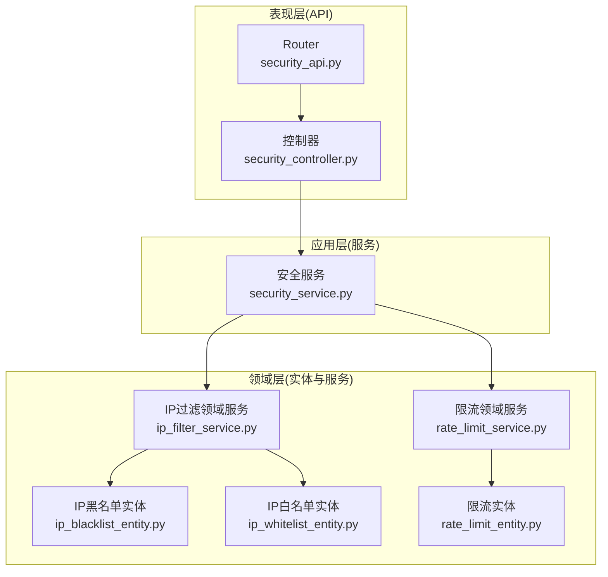
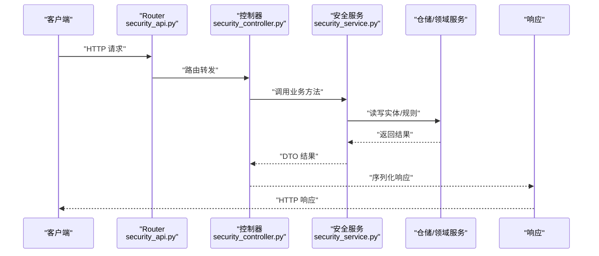
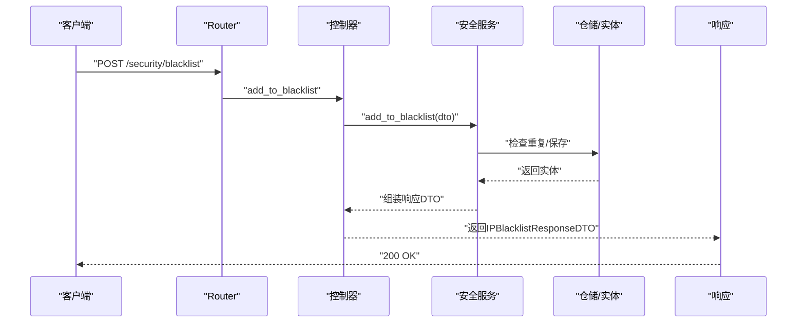
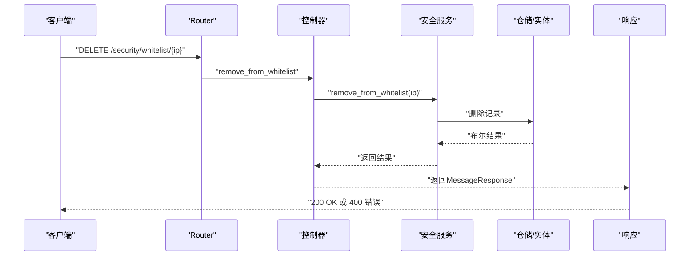
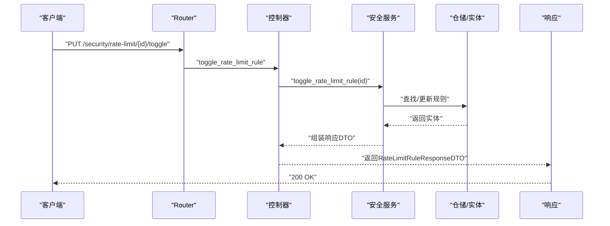
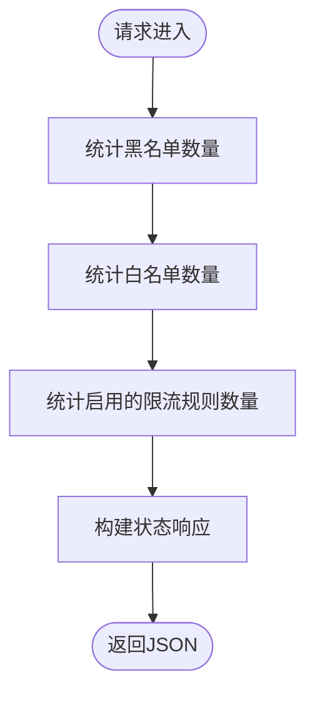
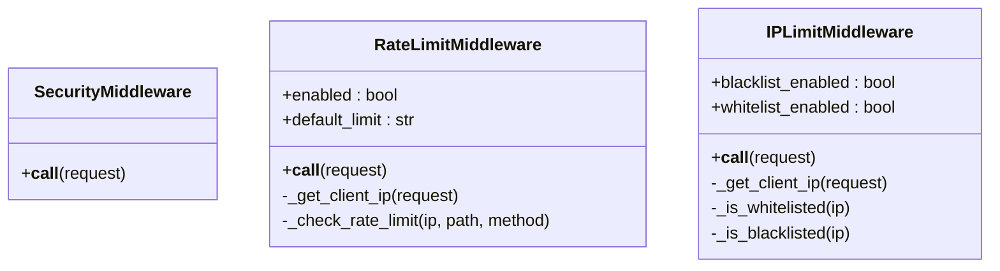
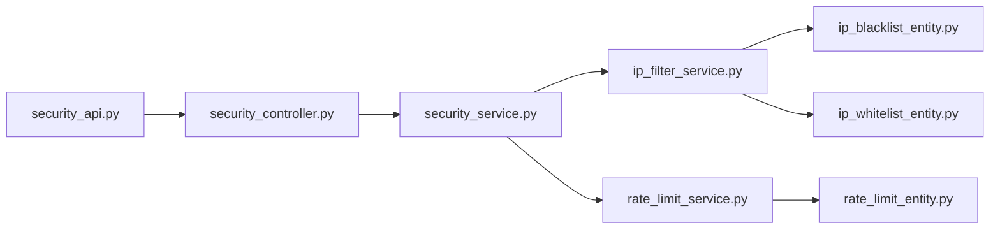

# 安全配置 API

<cite>
**本文档引用的文件**
- [security_api.py](file://src/api/v1/security_api.py)
- [security_controller.py](file://src/api/v1/controllers/security_controller.py)
- [security_service.py](file://src/application/services/security_service.py)
- [ip_filter_service.py](file://src/domain/security/services/ip_filter_service.py)
- [rate_limit_service.py](file://src/domain/security/services/rate_limit_service.py)
- [security_middleware.py](file://src/core/middlewares/security_middleware.py)
- [rate_limit_middleware.py](file://src/core/middlewares/rate_limit_middleware.py)
- [ip_limit_middleware.py](file://src/core/middlewares/ip_limit_middleware.py)
- [ip_blacklist_dto.py](file://src/application/dto/security/ip_blacklist_dto.py)
- [ip_whitelist_dto.py](file://src/application/dto/security/ip_whitelist_dto.py)
- [rate_limit_rule_dto.py](file://src/application/dto/security/rate_limit_rule_dto.py)
- [rate_limit_status_dto.py](file://src/application/dto/security/rate_limit_status_dto.py)
- [ip_blacklist_entity.py](file://src/domain/security/entities/ip_blacklist_entity.py)
- [ip_whitelist_entity.py](file://src/domain/security/entities/ip_whitelist_entity.py)
- [rate_limit_entity.py](file://src/domain/security/entities/rate_limit_entity.py)
</cite>

## 目录
1. [简介](#简介)
2. [项目结构](#项目结构)
3. [核心组件](#核心组件)
4. [架构总览](#架构总览)
5. [详细组件分析](#详细组件分析)
6. [依赖关系分析](#依赖关系分析)
7. [性能考量](#性能考量)
8. [故障排除指南](#故障排除指南)
9. [结论](#结论)
10. [附录](#附录)

## 简介
本文件系统性梳理并规范安全配置 API 的设计与实现，覆盖以下能力：
- IP 黑名单管理：添加、删除、查询
- IP 白名单管理：添加、删除、查询
- 请求限流配置：创建、启用/禁用、删除、查询
- 限流状态查询：当前限流状态、统计信息
- 安全中间件工作机制与配置项
- 最佳实践与安全考虑
- 错误处理与常见问题
- 安全监控与告警机制

## 项目结构
安全相关功能采用分层架构组织，主要分为三层：
- 表现层（API 层）：提供 REST 接口，负责参数校验与响应封装
- 应用层（服务层）：编排业务流程，协调仓储与领域服务
- 领域层（实体与服务）：定义安全实体与核心业务逻辑（IP 过滤、限流）

图表来源
- [security_api.py:1-285](file://src/api/v1/security_api.py#L1-L285)
- [security_controller.py:1-302](file://src/api/v1/controllers/security_controller.py#L1-L302)
- [security_service.py:1-225](file://src/application/services/security_service.py#L1-L225)
- [ip_filter_service.py:1-149](file://src/domain/security/services/ip_filter_service.py#L1-L149)
- [rate_limit_service.py:1-126](file://src/domain/security/services/rate_limit_service.py#L1-L126)
- [ip_blacklist_entity.py:1-53](file://src/domain/security/entities/ip_blacklist_entity.py#L1-L53)
- [ip_whitelist_entity.py:1-47](file://src/domain/security/entities/ip_whitelist_entity.py#L1-L47)
- [rate_limit_entity.py:1-106](file://src/domain/security/entities/rate_limit_entity.py#L1-L106)

章节来源
- [security_api.py:1-285](file://src/api/v1/security_api.py#L1-L285)
- [security_controller.py:1-302](file://src/api/v1/controllers/security_controller.py#L1-L302)
- [security_service.py:1-225](file://src/application/services/security_service.py#L1-L225)

## 核心组件
- 安全 API 路由器：定义黑名单、白名单、限流规则及安全状态查询接口
- 安全控制器：基于装饰器的 API 控制器，统一处理请求与响应
- 安全服务：封装业务逻辑，协调仓储与领域服务
- IP 过滤领域服务：内存级 IP 黑/白名单过滤与状态管理
- 限流领域服务：内存级限流规则与计数记录管理
- 安全中间件：统一添加安全响应头
- 限流中间件：基于缓存的简单限流
- IP 限制中间件：基于数据库的 IP 黑/白名单拦截

章节来源
- [security_api.py:23-285](file://src/api/v1/security_api.py#L23-L285)
- [security_controller.py:21-302](file://src/api/v1/controllers/security_controller.py#L21-L302)
- [security_service.py:24-225](file://src/application/services/security_service.py#L24-L225)
- [ip_filter_service.py:12-149](file://src/domain/security/services/ip_filter_service.py#L12-L149)
- [rate_limit_service.py:11-126](file://src/domain/security/services/rate_limit_service.py#L11-L126)
- [security_middleware.py:14-54](file://src/core/middlewares/security_middleware.py#L14-L54)
- [rate_limit_middleware.py:15-112](file://src/core/middlewares/rate_limit_middleware.py#L15-L112)
- [ip_limit_middleware.py:15-130](file://src/core/middlewares/ip_limit_middleware.py#L15-L130)

## 架构总览
安全配置 API 的调用链路如下：

图表来源
- [security_api.py:35-285](file://src/api/v1/security_api.py#L35-L285)
- [security_controller.py:43-302](file://src/api/v1/controllers/security_controller.py#L43-L302)
- [security_service.py:35-225](file://src/application/services/security_service.py#L35-L225)

## 详细组件分析

### IP 黑名单管理
- 接口概览
  - POST /security/blacklist：添加 IP 到黑名单
  - DELETE /security/blacklist/{ip_address}：从黑名单移除
  - GET /security/blacklist：获取黑名单列表
- 关键行为
  - 防重复添加：若 IP 已在黑名单且有效，则抛出错误
  - 删除校验：若 IP 不在黑名单，抛出错误
  - 查询：返回所有黑名单条目（含有效期与原因）
- 数据模型
  - 输入 DTO：IPBlacklistDTO（ip_address, reason, is_permanent, expires_at）
  - 实体：IPBlacklistEntity（包含有效性判断与解封操作）
- 中间件联动
  - IP 限制中间件根据数据库中的黑名单进行拦截

图表来源
- [security_api.py:35-60](file://src/api/v1/security_api.py#L35-L60)
- [security_controller.py:49-68](file://src/api/v1/controllers/security_controller.py#L49-L68)
- [security_service.py:35-53](file://src/application/services/security_service.py#L35-L53)
- [ip_blacklist_dto.py:11-27](file://src/application/dto/security/ip_blacklist_dto.py#L11-L27)
- [ip_blacklist_entity.py:11-53](file://src/domain/security/entities/ip_blacklist_entity.py#L11-L53)

章节来源
- [security_api.py:35-94](file://src/api/v1/security_api.py#L35-L94)
- [security_controller.py:49-112](file://src/api/v1/controllers/security_controller.py#L49-L112)
- [security_service.py:35-69](file://src/application/services/security_service.py#L35-L69)
- [ip_blacklist_dto.py:11-27](file://src/application/dto/security/ip_blacklist_dto.py#L11-L27)
- [ip_blacklist_entity.py:11-53](file://src/domain/security/entities/ip_blacklist_entity.py#L11-L53)
- [ip_limit_middleware.py:109-130](file://src/core/middlewares/ip_limit_middleware.py#L109-L130)

### IP 白名单管理
- 接口概览
  - POST /security/whitelist：添加 IP 到白名单
  - DELETE /security/whitelist/{ip_address}：从白名单移除
  - GET /security/whitelist：获取白名单列表
- 关键行为
  - 防重复添加：若 IP 已在白名单且有效，则抛出错误
  - 删除校验：若 IP 不在白名单，抛出错误
  - 查询：返回所有白名单条目（含描述与状态）
- 数据模型
  - 输入 DTO：IPWhitelistDTO（ip_address, description）
  - 实体：IPWhitelistEntity（包含激活/停用操作）
- 中间件联动
  - IP 限制中间件根据数据库中的白名单进行放行

图表来源
- [security_api.py:125-136](file://src/api/v1/security_api.py#L125-L136)
- [security_controller.py:149-167](file://src/api/v1/controllers/security_controller.py#L149-L167)
- [security_service.py:92-94](file://src/application/services/security_service.py#L92-L94)
- [ip_whitelist_dto.py:9-21](file://src/application/dto/security/ip_whitelist_dto.py#L9-L21)
- [ip_whitelist_entity.py:11-47](file://src/domain/security/entities/ip_whitelist_entity.py#L11-L47)
- [ip_limit_middleware.py:95-107](file://src/core/middlewares/ip_limit_middleware.py#L95-L107)

章节来源
- [security_api.py:100-155](file://src/api/v1/security_api.py#L100-L155)
- [security_controller.py:122-184](file://src/api/v1/controllers/security_controller.py#L122-L184)
- [security_service.py:73-99](file://src/application/services/security_service.py#L73-L99)
- [ip_whitelist_dto.py:9-21](file://src/application/dto/security/ip_whitelist_dto.py#L9-L21)
- [ip_whitelist_entity.py:11-47](file://src/domain/security/entities/ip_whitelist_entity.py#L11-L47)
- [ip_limit_middleware.py:95-107](file://src/core/middlewares/ip_limit_middleware.py#L95-L107)

### 请求限流配置
- 接口概览
  - POST /security/rate-limit：创建限流规则
  - PUT /security/rate-limit/{rule_id}/toggle：切换规则启用状态
  - DELETE /security/rate-limit/{rule_id}：删除限流规则
  - GET /security/rate-limit：获取限流规则列表
- 关键行为
  - 防重复创建：同一端点+方法的规则已存在则抛错
  - 切换状态：对规则进行启用/禁用切换
  - 删除校验：若规则不存在，抛出错误
  - 查询：返回所有限流规则（含名称、端点、方法、速率、周期、作用域、描述）
- 数据模型
  - 输入 DTO：RateLimitRuleDTO（name, endpoint, method, rate, period, scope, description）
  - 实体：RateLimitEntity（包含激活/停用、计算速率字符串）
- 中间件联动
  - 限流中间件基于配置与缓存执行简单限流
  - 领域服务提供更细粒度的限流状态查询

图表来源
- [security_api.py:198-223](file://src/api/v1/security_api.py#L198-L223)
- [security_controller.py:222-238](file://src/api/v1/controllers/security_controller.py#L222-L238)
- [security_service.py:124-134](file://src/application/services/security_service.py#L124-L134)
- [rate_limit_rule_dto.py:9-36](file://src/application/dto/security/rate_limit_rule_dto.py#L9-L36)
- [rate_limit_entity.py:11-106](file://src/domain/security/entities/rate_limit_entity.py#L11-L106)

章节来源
- [security_api.py:161-261](file://src/api/v1/security_api.py#L161-L261)
- [security_controller.py:195-282](file://src/api/v1/controllers/security_controller.py#L195-L282)
- [security_service.py:103-143](file://src/application/services/security_service.py#L103-L143)
- [rate_limit_rule_dto.py:9-36](file://src/application/dto/security/rate_limit_rule_dto.py#L9-L36)
- [rate_limit_entity.py:11-106](file://src/domain/security/entities/rate_limit_entity.py#L11-L106)

### 限流状态查询
- 接口概览
  - GET /security/status：获取安全状态（黑/白名单与限流规则数量）
- 关键行为
  - 统计黑名单、白名单与启用的限流规则数量
  - 返回布尔开关与计数信息
- 领域服务支持
  - 提供更细粒度的限流状态查询（剩余次数、重置时间等）

图表来源
- [security_api.py:267-284](file://src/api/v1/security_api.py#L267-L284)
- [security_controller.py:291-301](file://src/api/v1/controllers/security_controller.py#L291-L301)
- [security_service.py:169-182](file://src/application/services/security_service.py#L169-L182)

章节来源
- [security_api.py:267-284](file://src/api/v1/security_api.py#L267-L284)
- [security_controller.py:291-301](file://src/api/v1/controllers/security_controller.py#L291-L301)
- [security_service.py:169-182](file://src/application/services/security_service.py#L169-L182)

### 安全中间件工作机制与配置
- 安全中间件（SecurityMiddleware）
  - 在生产环境自动添加安全响应头（X-Content-Type-Options、X-Frame-Options、X-XSS-Protection、Strict-Transport-Security）
- 限流中间件（RateLimitMiddleware）
  - 基于缓存的简单限流，默认每分钟 100 次
  - 可通过设置控制开关与默认限流规则
- IP 限制中间件（IPLimitMiddleware）
  - 支持白名单/黑名单模式
  - 通过数据库中的白名单/黑名单进行拦截或放行
  - 支持永久封禁与临时封禁

图表来源
- [security_middleware.py:14-54](file://src/core/middlewares/security_middleware.py#L14-L54)
- [rate_limit_middleware.py:15-112](file://src/core/middlewares/rate_limit_middleware.py#L15-L112)
- [ip_limit_middleware.py:15-130](file://src/core/middlewares/ip_limit_middleware.py#L15-L130)

章节来源
- [security_middleware.py:14-54](file://src/core/middlewares/security_middleware.py#L14-L54)
- [rate_limit_middleware.py:15-112](file://src/core/middlewares/rate_limit_middleware.py#L15-L112)
- [ip_limit_middleware.py:15-130](file://src/core/middlewares/ip_limit_middleware.py#L15-L130)

## 依赖关系分析
- API 层依赖控制器层，控制器层依赖应用服务层
- 应用服务层依赖仓储/领域服务层
- 领域服务层依赖实体层
- 中间件层独立运行于 Django WSGI 流程中

图表来源
- [security_api.py:1-285](file://src/api/v1/security_api.py#L1-L285)
- [security_controller.py:1-302](file://src/api/v1/controllers/security_controller.py#L1-L302)
- [security_service.py:1-225](file://src/application/services/security_service.py#L1-L225)
- [ip_filter_service.py:1-149](file://src/domain/security/services/ip_filter_service.py#L1-L149)
- [rate_limit_service.py:1-126](file://src/domain/security/services/rate_limit_service.py#L1-L126)
- [ip_blacklist_entity.py:1-53](file://src/domain/security/entities/ip_blacklist_entity.py#L1-L53)
- [ip_whitelist_entity.py:1-47](file://src/domain/security/entities/ip_whitelist_entity.py#L1-L47)
- [rate_limit_entity.py:1-106](file://src/domain/security/entities/rate_limit_entity.py#L1-L106)

章节来源
- [security_api.py:1-285](file://src/api/v1/security_api.py#L1-L285)
- [security_controller.py:1-302](file://src/api/v1/controllers/security_controller.py#L1-L302)
- [security_service.py:1-225](file://src/application/services/security_service.py#L1-L225)

## 性能考量
- 内存级缓存
  - IP 过滤与限流规则存储于内存字典，适合小规模场景；大规模部署建议使用持久化存储与分布式缓存
- 数据库访问
  - IP 黑/白名单与限流规则的 CRUD 操作直接访问数据库，注意索引优化与批量操作
- 中间件开销
  - 限流中间件基于缓存，避免频繁数据库访问；IP 限制中间件每次请求都会查询数据库，建议配合缓存或 CDN
- 并发与一致性
  - 当前实现未引入分布式锁，高并发场景建议引入 Redis 分布式锁或数据库事务

## 故障排除指南
- 常见错误与处理
  - IP 已在黑名单/白名单中：添加时抛出错误，需先移除再添加或调整有效期
  - IP 不在黑名单/白名单中：删除时抛出错误，确认 IP 是否正确
  - 限流规则已存在：创建时抛出错误，需修改端点或方法组合
  - 限流规则不存在：切换/删除时抛出错误，确认规则 ID
- 日志与监控
  - 限流中间件在触发限流时会记录警告日志
  - IP 限制中间件在拦截请求时会记录警告日志
  - 建议接入统一日志系统与告警平台（如 Prometheus + Alertmanager、Sentry 等）
- 建议的告警维度
  - 限流触发次数与占比
  - 黑名单/白名单变更事件
  - 异常 IP 访问模式

章节来源
- [security_api.py:43-44](file://src/api/v1/security_api.py#L43-L44)
- [security_api.py:72-73](file://src/api/v1/security_api.py#L72-L73)
- [security_api.py:171-172](file://src/api/v1/security_api.py#L171-L172)
- [security_api.py:233-234](file://src/api/v1/security_api.py#L233-L234)
- [rate_limit_middleware.py:58-66](file://src/core/middlewares/rate_limit_middleware.py#L58-L66)
- [ip_limit_middleware.py:56-74](file://src/core/middlewares/ip_limit_middleware.py#L56-L74)

## 结论
本安全配置 API 提供了完整的 IP 黑/白名单与请求限流能力，并通过中间件与领域服务实现多层防护。建议在生产环境中结合缓存、分布式锁与完善的监控告警体系，确保系统的安全性与稳定性。

## 附录

### 接口规范摘要
- IP 黑名单
  - POST /security/blacklist：输入 IPBlacklistDTO，输出 IPBlacklistResponseDTO
  - DELETE /security/blacklist/{ip_address}：无输入，输出 MessageResponse
  - GET /security/blacklist：输出列表 IPBlacklistResponseDTO
- IP 白名单
  - POST /security/whitelist：输入 IPWhitelistDTO，输出 IPWhitelistResponseDTO
  - DELETE /security/whitelist/{ip_address}：无输入，输出 MessageResponse
  - GET /security/whitelist：输出列表 IPWhitelistResponseDTO
- 限流规则
  - POST /security/rate-limit：输入 RateLimitRuleDTO，输出 RateLimitRuleResponseDTO
  - PUT /security/rate-limit/{rule_id}/toggle：输出 RateLimitRuleResponseDTO
  - DELETE /security/rate-limit/{rule_id}：输出 MessageResponse
  - GET /security/rate-limit：输出列表 RateLimitRuleResponseDTO
- 安全状态
  - GET /security/status：输出状态对象（包含开关与计数）

章节来源
- [security_api.py:35-284](file://src/api/v1/security_api.py#L35-L284)
- [security_controller.py:49-301](file://src/api/v1/controllers/security_controller.py#L49-L301)