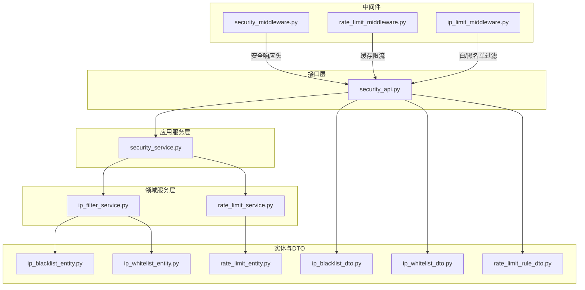
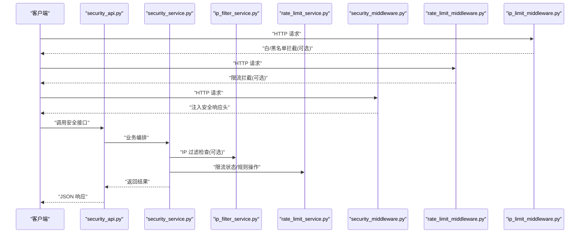
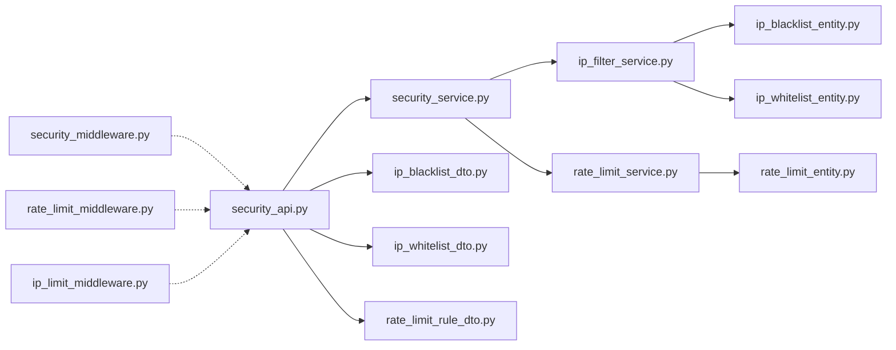
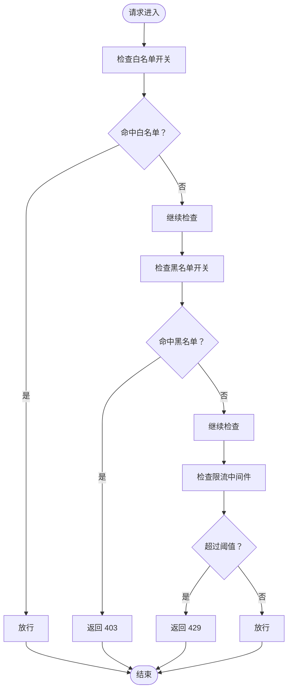

# 安全防护接口

<cite>
**本文引用的文件**
- [security_api.py](file://src/api/v1/security_api.py)
- [security_service.py](file://src/application/services/security_service.py)
- [ip_filter_service.py](file://src/domain/security/services/ip_filter_service.py)
- [rate_limit_service.py](file://src/domain/security/services/rate_limit_service.py)
- [security_middleware.py](file://src/core/middlewares/security_middleware.py)
- [rate_limit_middleware.py](file://src/core/middlewares/rate_limit_middleware.py)
- [ip_limit_middleware.py](file://src/core/middlewares/ip_limit_middleware.py)
- [ip_blacklist_entity.py](file://src/domain/security/entities/ip_blacklist_entity.py)
- [ip_whitelist_entity.py](file://src/domain/security/entities/ip_whitelist_entity.py)
- [rate_limit_entity.py](file://src/domain/security/entities/rate_limit_entity.py)
- [ip_blacklist_dto.py](file://src/application/dto/security/ip_blacklist_dto.py)
- [ip_whitelist_dto.py](file://src/application/dto/security/ip_whitelist_dto.py)
- [rate_limit_rule_dto.py](file://src/application/dto/security/rate_limit_rule_dto.py)
- [ip_blocked_error.py](file://src/core/exceptions/ip_blocked_error.py)
- [rate_limit_error.py](file://src/core/exceptions/rate_limit_error.py)
</cite>

## 目录
1. [简介](#简介)
2. [项目结构](#项目结构)
3. [核心组件](#核心组件)
4. [架构总览](#架构总览)
5. [详细组件分析](#详细组件分析)
6. [依赖分析](#依赖分析)
7. [性能考虑](#性能考虑)
8. [故障排查指南](#故障排查指南)
9. [结论](#结论)
10. [附录](#附录)

## 简介
本文件面向安全防护接口组，系统化梳理并说明以下能力与接口：
- IP 黑名单管理：新增、移除、查询黑名单
- IP 白名单管理：新增、移除、查询白名单
- 请求限流规则配置：创建、启停、删除、查询限流规则
- 安全状态查询：统计黑白名单与限流规则数量
- 安全中间件：统一安全响应头注入
- IP 过滤中间件：基于白名单/黑名单的访问控制
- 限流中间件：基于 Redis 缓存的请求频率限制
- 领域服务：内存态的 IP 过滤与限流规则执行
- 实体与 DTO：数据结构与约束校验
- 异常与错误码：统一错误语义

目标是帮助开发者与运维人员快速理解接口行为、配置参数、生效机制、监控指标与最佳实践。

## 项目结构
围绕安全主题，代码按“接口层 → 应用服务 → 领域服务 → 实体/仓储/中间件”的分层组织，形成清晰的职责边界与可测试性。

图表来源
- [security_api.py:1-285](file://src/api/v1/security_api.py#L1-L285)
- [security_service.py:1-225](file://src/application/services/security_service.py#L1-L225)
- [ip_filter_service.py:1-149](file://src/domain/security/services/ip_filter_service.py#L1-L149)
- [rate_limit_service.py:1-126](file://src/domain/security/services/rate_limit_service.py#L1-L126)
- [security_middleware.py:1-54](file://src/core/middlewares/security_middleware.py#L1-L54)
- [rate_limit_middleware.py:1-112](file://src/core/middlewares/rate_limit_middleware.py#L1-L112)
- [ip_limit_middleware.py:1-130](file://src/core/middlewares/ip_limit_middleware.py#L1-L130)
- [ip_blacklist_entity.py:1-53](file://src/domain/security/entities/ip_blacklist_entity.py#L1-L53)
- [ip_whitelist_entity.py:1-47](file://src/domain/security/entities/ip_whitelist_entity.py#L1-L47)
- [rate_limit_entity.py:1-106](file://src/domain/security/entities/rate_limit_entity.py#L1-L106)
- [ip_blacklist_dto.py:1-27](file://src/application/dto/security/ip_blacklist_dto.py#L1-L27)
- [ip_whitelist_dto.py:1-21](file://src/application/dto/security/ip_whitelist_dto.py#L1-L21)
- [rate_limit_rule_dto.py:1-36](file://src/application/dto/security/rate_limit_rule_dto.py#L1-L36)

章节来源
- [security_api.py:1-285](file://src/api/v1/security_api.py#L1-L285)
- [security_service.py:1-225](file://src/application/services/security_service.py#L1-L225)

## 核心组件
- 接口路由：提供黑名单、白名单、限流规则的增删改查与安全状态查询
- 应用服务：封装业务规则，协调领域服务与仓储
- 领域服务：内存态的 IP 过滤与限流规则执行
- 中间件：统一安全响应头、基于缓存的限流、基于白/黑名单的访问控制
- 实体与 DTO：定义数据结构、约束与序列化
- 异常：统一错误码与语义

章节来源
- [security_api.py:23-285](file://src/api/v1/security_api.py#L23-L285)
- [security_service.py:24-225](file://src/application/services/security_service.py#L24-L225)
- [ip_filter_service.py:12-149](file://src/domain/security/services/ip_filter_service.py#L12-L149)
- [rate_limit_service.py:11-126](file://src/domain/security/services/rate_limit_service.py#L11-L126)
- [security_middleware.py:14-54](file://src/core/middlewares/security_middleware.py#L14-L54)
- [rate_limit_middleware.py:15-112](file://src/core/middlewares/rate_limit_middleware.py#L15-L112)
- [ip_limit_middleware.py:15-130](file://src/core/middlewares/ip_limit_middleware.py#L15-L130)
- [ip_blacklist_entity.py:11-53](file://src/domain/security/entities/ip_blacklist_entity.py#L11-L53)
- [ip_whitelist_entity.py:11-47](file://src/domain/security/entities/ip_whitelist_entity.py#L11-L47)
- [rate_limit_entity.py:11-106](file://src/domain/security/entities/rate_limit_entity.py#L11-L106)
- [ip_blacklist_dto.py:11-27](file://src/application/dto/security/ip_blacklist_dto.py#L11-L27)
- [ip_whitelist_dto.py:9-21](file://src/application/dto/security/ip_whitelist_dto.py#L9-L21)
- [rate_limit_rule_dto.py:9-36](file://src/application/dto/security/rate_limit_rule_dto.py#L9-L36)
- [ip_blocked_error.py:9-26](file://src/core/exceptions/ip_blocked_error.py#L9-L26)
- [rate_limit_error.py:9-26](file://src/core/exceptions/rate_limit_error.py#L9-L26)

## 架构总览
安全能力由“接口层 + 应用服务 + 领域服务 + 中间件 + 实体/DTO”协同实现，接口层负责对外暴露 REST API；应用服务负责编排业务；领域服务负责核心算法与状态；中间件负责运行时拦截与防护；实体/DTO 负责数据建模与约束。

图表来源
- [security_api.py:23-285](file://src/api/v1/security_api.py#L23-L285)
- [security_service.py:24-225](file://src/application/services/security_service.py#L24-L225)
- [ip_filter_service.py:12-149](file://src/domain/security/services/ip_filter_service.py#L12-L149)
- [rate_limit_service.py:11-126](file://src/domain/security/services/rate_limit_service.py#L11-L126)
- [security_middleware.py:14-54](file://src/core/middlewares/security_middleware.py#L14-L54)
- [rate_limit_middleware.py:15-112](file://src/core/middlewares/rate_limit_middleware.py#L15-L112)
- [ip_limit_middleware.py:15-130](file://src/core/middlewares/ip_limit_middleware.py#L15-L130)

## 详细组件分析

### 接口层：安全 API
- 路由标签：安全
- 主要接口：
  - 黑名单：POST/DELETE/GET
  - 白名单：POST/DELETE/GET
  - 限流规则：POST/PUT/DELETE/GET
  - 安全状态：GET

参数与行为要点：
- 黑名单/白名单：均支持唯一性校验，重复添加会抛出错误
- 限流规则：按“方法+端点”维度去重；支持启停切换
- 安全状态：返回黑白名单与活动限流规则数量

章节来源
- [security_api.py:35-284](file://src/api/v1/security_api.py#L35-L284)

### 应用服务：SecurityService
- 职责：封装业务规则，协调仓储与领域服务
- 关键能力：
  - 黑名单/白名单：新增、移除、查询、列表
  - 限流规则：创建、启停、删除、列表、限流状态查询
  - 安全状态：统计黑白名单与活动限流规则数量

复杂度与性能：
- 列表查询为 O(n)，建议配合分页与缓存
- 限流状态查询依赖仓储的“规则+记录”组合，注意窗口重置与并发一致性

章节来源
- [security_service.py:35-182](file://src/application/services/security_service.py#L35-L182)

### 领域服务：IPFilterDomainService
- 职责：内存态的 IP 黑/白名单过滤
- 过滤策略：
  - 白名单优先：仅允许白名单命中
  - 黑名单检查：在未启用白名单时，拒绝黑名单命中
  - 默认允许：若未启用黑白名单，则放行
- 状态：可查询黑白名单开关与数量

复杂度与性能：
- 字典查找 O(1)，适合高并发场景
- 注意：内存态不持久化，重启后失效；持久化由仓储层负责

章节来源
- [ip_filter_service.py:18-149](file://src/domain/security/services/ip_filter_service.py#L18-L149)

### 领域服务：RateLimitDomainService
- 职责：内存态的限流规则与计数器
- 算法：滑动窗口计数（基于规则速率与周期）
- 关键点：
  - 规则键：method:endpoint
  - 记录键：key:method:endpoint
  - 过期重置：记录过期自动重置
  - 允许判断：count < rate

复杂度与性能：
- 查找与计数 O(1)
- 并发：需结合分布式缓存或数据库锁保证一致性

章节来源
- [rate_limit_service.py:21-126](file://src/domain/security/services/rate_limit_service.py#L21-L126)

### 中间件：SecurityMiddleware
- 职责：统一注入安全响应头（生产环境）
- 注入头：X-Content-Type-Options、X-Frame-Options、X-XSS-Protection、Strict-Transport-Security

章节来源
- [security_middleware.py:33-53](file://src/core/middlewares/security_middleware.py#L33-L53)

### 中间件：RateLimitMiddleware
- 职责：基于缓存的请求频率限制
- 策略：每分钟固定阈值（示例），键格式为“rate_limit:{ip}:{method}:{path}”
- 行为：超过阈值返回 429，并记录警告日志
- 配置：通过设置项控制开关与默认规则

章节来源
- [rate_limit_middleware.py:41-112](file://src/core/middlewares/rate_limit_middleware.py#L41-L112)

### 中间件：IPLimitMiddleware
- 职责：基于白/黑名单的访问控制
- 策略：
  - 白名单模式：仅允许白名单命中
  - 黑名单模式：拒绝黑名单命中
- 行为：命中则返回 403，并记录警告日志
- 配置：通过设置项控制黑白名单开关

章节来源
- [ip_limit_middleware.py:41-130](file://src/core/middlewares/ip_limit_middleware.py#L41-L130)

### 实体与 DTO
- IPBlacklistEntity：封禁原因、永久/临时封禁、有效期、创建者
- IPWhitelistEntity：描述、启用状态、创建者
- RateLimitEntity：规则名、端点、方法、速率、周期、作用域、启用状态
- DTO：对输入进行约束与示例化

章节来源
- [ip_blacklist_entity.py:11-53](file://src/domain/security/entities/ip_blacklist_entity.py#L11-L53)
- [ip_whitelist_entity.py:11-47](file://src/domain/security/entities/ip_whitelist_entity.py#L11-L47)
- [rate_limit_entity.py:11-106](file://src/domain/security/entities/rate_limit_entity.py#L11-L106)
- [ip_blacklist_dto.py:11-27](file://src/application/dto/security/ip_blacklist_dto.py#L11-L27)
- [ip_whitelist_dto.py:9-21](file://src/application/dto/security/ip_whitelist_dto.py#L9-L21)
- [rate_limit_rule_dto.py:9-36](file://src/application/dto/security/rate_limit_rule_dto.py#L9-L36)

### 异常与错误码
- IPBlockedError：IP 被封禁（错误码：IP_BLOCKED）
- RateLimitError：请求过于频繁（错误码：RATE_LIMIT_ERROR）

章节来源
- [ip_blocked_error.py:9-26](file://src/core/exceptions/ip_blocked_error.py#L9-L26)
- [rate_limit_error.py:9-26](file://src/core/exceptions/rate_limit_error.py#L9-L26)

## 依赖分析
- 接口层依赖应用服务与 DTO
- 应用服务依赖仓储与领域服务
- 领域服务依赖实体
- 中间件独立运行，与接口层解耦
- 异常作为统一错误语义

图表来源
- [security_api.py:1-285](file://src/api/v1/security_api.py#L1-L285)
- [security_service.py:1-225](file://src/application/services/security_service.py#L1-L225)
- [ip_filter_service.py:1-149](file://src/domain/security/services/ip_filter_service.py#L1-L149)
- [rate_limit_service.py:1-126](file://src/domain/security/services/rate_limit_service.py#L1-L126)
- [ip_blacklist_entity.py:1-53](file://src/domain/security/entities/ip_blacklist_entity.py#L1-L53)
- [ip_whitelist_entity.py:1-47](file://src/domain/security/entities/ip_whitelist_entity.py#L1-L47)
- [rate_limit_entity.py:1-106](file://src/domain/security/entities/rate_limit_entity.py#L1-L106)
- [ip_blacklist_dto.py:1-27](file://src/application/dto/security/ip_blacklist_dto.py#L1-L27)
- [ip_whitelist_dto.py:1-21](file://src/application/dto/security/ip_whitelist_dto.py#L1-L21)
- [rate_limit_rule_dto.py:1-36](file://src/application/dto/security/rate_limit_rule_dto.py#L1-L36)
- [security_middleware.py:1-54](file://src/core/middlewares/security_middleware.py#L1-L54)
- [rate_limit_middleware.py:1-112](file://src/core/middlewares/rate_limit_middleware.py#L1-L112)
- [ip_limit_middleware.py:1-130](file://src/core/middlewares/ip_limit_middleware.py#L1-L130)

## 性能考虑
- 中间件限流
  - 当前中间件使用本地缓存，适合单实例；多实例部署需采用共享缓存（如 Redis）以避免绕过
  - 建议将阈值与周期参数化，便于动态调整
- 内存态过滤
  - IP 黑/白名单在内存态，适合小规模静态名单；大规模名单建议持久化并配合缓存预热
- 限流算法
  - 领域服务采用滑动窗口计数，O(1) 查询与更新；多实例需分布式锁或原子计数
- 监控指标
  - 建议采集：拦截次数、限流触发次数、封禁事件数、规则命中率
  - 日志：限流与封禁的详细上下文（IP、端点、方法、时间戳）

[本节为通用性能建议，无需特定文件引用]

## 故障排查指南
- 黑名单/白名单接口报错
  - 现象：重复添加抛出错误
  - 排查：确认是否已存在；检查唯一性约束
- 限流规则接口报错
  - 现象：同端点同方法重复创建
  - 排查：先删除旧规则再创建；或使用启停接口切换
- 中间件拦截
  - 白名单模式：非白名单 IP 403
  - 黑名单模式：黑名单 IP 403
  - 限流中间件：超过阈值 429
  - 排查：查看日志与缓存键；核对配置开关
- 安全响应头缺失
  - 现象：生产环境缺少安全头
  - 排查：确认中间件已注册且生产环境未关闭

章节来源
- [security_api.py:42-74](file://src/api/v1/security_api.py#L42-L74)
- [security_api.py:168-173](file://src/api/v1/security_api.py#L168-L173)
- [rate_limit_middleware.py:58-66](file://src/core/middlewares/rate_limit_middleware.py#L58-L66)
- [ip_limit_middleware.py:55-76](file://src/core/middlewares/ip_limit_middleware.py#L55-L76)
- [security_middleware.py:47-51](file://src/core/middlewares/security_middleware.py#L47-L51)

## 结论
本安全防护接口组提供了完善的 IP 黑/白名单与请求限流能力，配合中间件实现运行时拦截与统一安全头注入。建议在多实例部署场景下引入共享缓存与分布式锁，完善监控与审计日志，确保在高并发与复杂攻击场景下的稳定性与合规性。

[本节为总结性内容，无需特定文件引用]

## 附录

### 安全接口一览（摘要）
- 黑名单
  - 新增：POST /api/v1/security/blacklist
  - 移除：DELETE /api/v1/security/blacklist/{ip_address}
  - 列表：GET /api/v1/security/blacklist
- 白名单
  - 新增：POST /api/v1/security/whitelist
  - 移除：DELETE /api/v1/security/whitelist/{ip_address}
  - 列表：GET /api/v1/security/whitelist
- 限流规则
  - 新增：POST /api/v1/security/rate-limit
  - 启停：PUT /api/v1/security/rate-limit/{rule_id}/toggle
  - 删除：DELETE /api/v1/security/rate-limit/{rule_id}
  - 列表：GET /api/v1/security/rate-limit
- 安全状态
  - GET /api/v1/security/status

章节来源
- [security_api.py:35-284](file://src/api/v1/security_api.py#L35-L284)

### 配置参数与生效机制
- 中间件配置
  - 白名单开关：IP_WHITELIST_ENABLED
  - 黑名单开关：IP_BLACKLIST_ENABLED
  - 限流开关：RATE_LIMIT_ENABLED
  - 默认限流：RATE_LIMIT_DEFAULT
- 生效机制
  - 中间件在请求进入时按顺序执行，满足任一拦截条件即返回
  - 安全响应头仅在生产环境注入

章节来源
- [ip_limit_middleware.py:38-40](file://src/core/middlewares/ip_limit_middleware.py#L38-L40)
- [rate_limit_middleware.py:38-40](file://src/core/middlewares/rate_limit_middleware.py#L38-L40)
- [security_middleware.py:47-51](file://src/core/middlewares/security_middleware.py#L47-L51)

### 监控指标建议
- 黑名单/白名单
  - 新增/移除次数、当前有效条目数
- 限流规则
  - 规则命中次数、触发限流次数、剩余配额
- 中间件
  - 白名单拦截次数、黑名单拦截次数、限流拦截次数

[本节为通用监控建议，无需特定文件引用]

### 安全中间件工作原理与拦截规则

图表来源
- [ip_limit_middleware.py:41-76](file://src/core/middlewares/ip_limit_middleware.py#L41-L76)
- [rate_limit_middleware.py:41-68](file://src/core/middlewares/rate_limit_middleware.py#L41-L68)

### 限流算法与缓存策略
- 算法：滑动窗口计数（规则速率与周期）
- 缓存：中间件使用本地缓存；建议改为 Redis 以支持多实例
- 窗口重置：记录过期自动重置
- 并发：建议引入原子计数或分布式锁

章节来源
- [rate_limit_service.py:50-105](file://src/domain/security/services/rate_limit_service.py#L50-L105)
- [rate_limit_middleware.py:99-111](file://src/core/middlewares/rate_limit_middleware.py#L99-L111)

### 最佳实践
- 白名单优先：在需要严格准入的场景启用白名单模式
- 临时封禁：优先使用临时封禁而非永久封禁，便于快速恢复
- 分层限流：接口层规则 + 中间件限流 + 业务层细粒度限流
- 监控告警：建立阈值告警与异常流量检测
- 审计日志：记录所有封禁与限流事件，满足合规要求

[本节为通用最佳实践，无需特定文件引用]