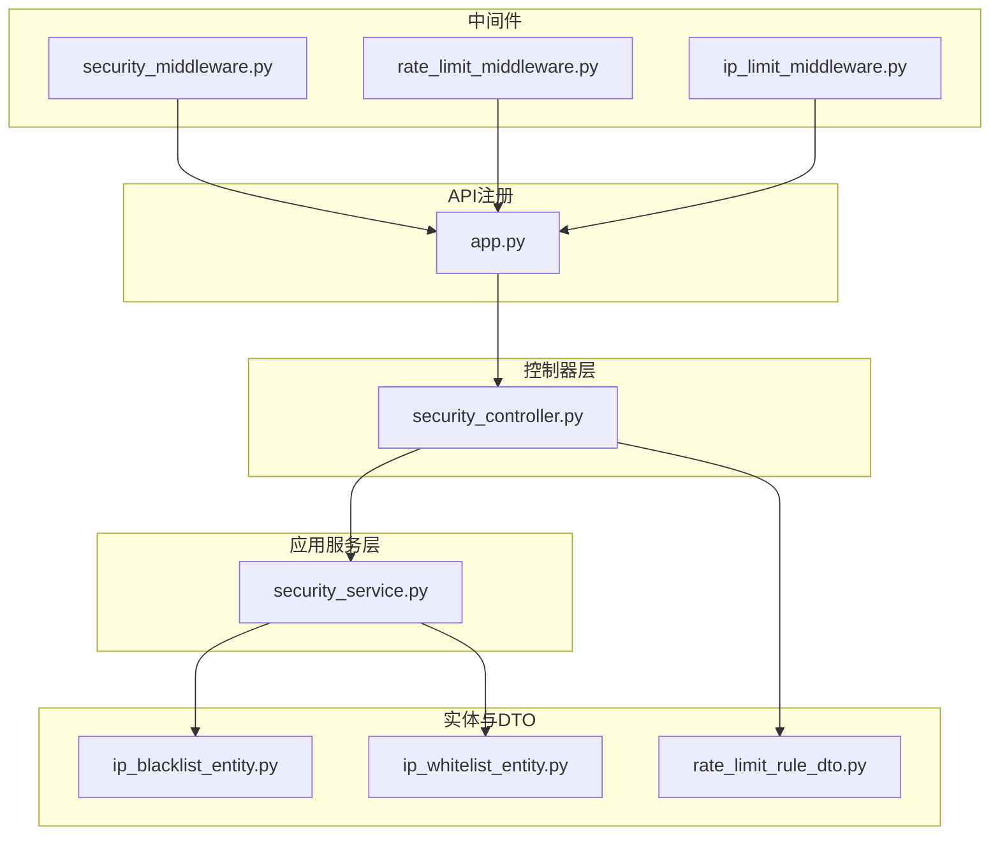
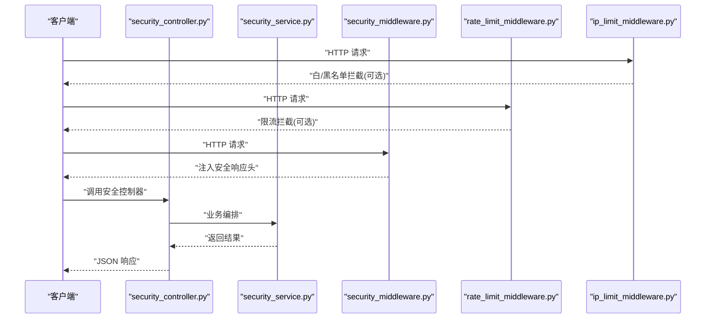
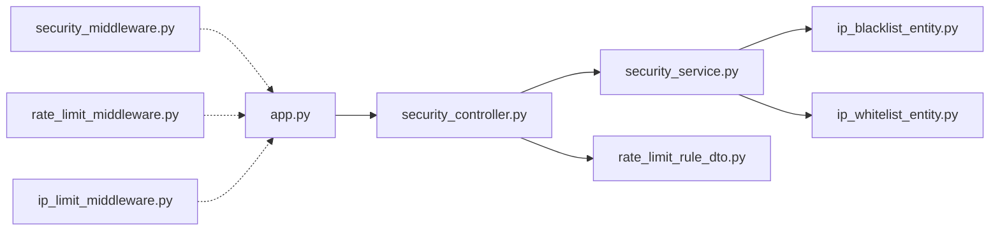

# 安全防护接口

<cite>
**本文引用的文件**
- [security_controller.py](file://src/api/v1/controllers/security_controller.py)
- [app.py](file://src/api/app.py)
- [security_service.py](file://src/application/services/security_service.py)
- [security_middleware.py](file://src/core/middlewares/security_middleware.py)
- [rate_limit_middleware.py](file://src/core/middlewares/rate_limit_middleware.py)
- [ip_limit_middleware.py](file://src/core/middlewares/ip_limit_middleware.py)
- [ip_blacklist_entity.py](file://src/domain/security/entities/ip_blacklist_entity.py)
- [ip_whitelist_entity.py](file://src/domain/security/entities/ip_whitelist_entity.py)
- [rate_limit_rule_dto.py](file://src/application/dto/security/rate_limit_rule_dto.py)
- [security_api.py](file://src/api/v1/security_api.py)
</cite>

## 更新摘要
**所做更改**
- 更新了安全防护系统从独立API文件迁移到控制器架构的说明
- 新增了控制器模式下的安全接口文档
- 更新了架构图以反映新的控制器组织方式
- 补充了依赖注入和控制器初始化的相关说明
- 更新了中间件与控制器的集成方式

## 目录
1. [简介](#简介)
2. [项目结构](#项目结构)
3. [核心组件](#核心组件)
4. [架构总览](#架构总览)
5. [详细组件分析](#详细组件分析)
6. [依赖分析](#依赖分析)
7. [性能考虑](#性能考虑)
8. [故障排查指南](#故障排查指南)
9. [结论](#结论)
10. [附录](#附录)

## 简介
本文件面向安全防护接口组，系统化梳理并说明以下能力与接口：
- IP 黑名单管理：新增、移除、查询黑名单
- IP 白名单管理：新增、移除、查询白名单
- 请求限流规则配置：创建、启停、删除、查询限流规则
- 安全状态查询：统计黑白名单与限流规则数量
- 安全中间件：统一安全响应头注入
- IP 过滤中间件：基于白名单/黑名单的访问控制
- 限流中间件：基于 Redis 缓存的请求频率限制
- 应用服务：封装业务规则，协调领域服务与仓储
- 实体与 DTO：数据结构与约束校验
- 异常与错误码：统一错误语义

**更新** 安全防护系统现已迁移到基于 Django-Ninja-Extra 的控制器架构，提供更好的组织结构和依赖注入支持。

目标是帮助开发者与运维人员快速理解接口行为、配置参数、生效机制、监控指标与最佳实践。

## 项目结构
围绕安全主题，代码按"控制器层 → 应用服务层 → 领域服务 → 实体/仓储/中间件"的分层组织，形成清晰的职责边界与可测试性。新的控制器架构提供了更好的模块化和依赖注入支持。

**图表来源**
- [security_controller.py:1-244](file://src/api/v1/controllers/security_controller.py#L1-L244)
- [security_service.py:1-203](file://src/application/services/security_service.py#L1-L203)
- [app.py:1-29](file://src/api/app.py#L1-L29)
- [security_middleware.py:1-54](file://src/core/middlewares/security_middleware.py#L1-L54)
- [rate_limit_middleware.py:1-103](file://src/core/middlewares/rate_limit_middleware.py#L1-L103)
- [ip_limit_middleware.py:1-115](file://src/core/middlewares/ip_limit_middleware.py#L1-L115)

**章节来源**
- [security_controller.py:1-244](file://src/api/v1/controllers/security_controller.py#L1-L244)
- [app.py:1-29](file://src/api/app.py#L1-L29)

## 核心组件
- **控制器层**：提供基于装饰器的安全管理API，遵循SOLID原则，支持依赖注入
- **应用服务**：封装业务规则，协调仓储与领域服务
- **实体与 DTO**：定义数据结构、约束与序列化
- **中间件**：统一安全响应头、基于缓存的限流、基于白/黑名单的访问控制
- **异常**：统一错误码与语义

**更新** 控制器架构提供了更好的单一职责分离和依赖倒置原则实现。

**章节来源**
- [security_controller.py:21-40](file://src/api/v1/controllers/security_controller.py#L21-L40)
- [security_service.py:24-32](file://src/application/services/security_service.py#L24-L32)
- [ip_blacklist_entity.py:11-53](file://src/domain/security/entities/ip_blacklist_entity.py#L11-L53)
- [ip_whitelist_entity.py:11-47](file://src/domain/security/entities/ip_whitelist_entity.py#L11-L47)
- [rate_limit_rule_dto.py:9-36](file://src/application/dto/security/rate_limit_rule_dto.py#L9-L36)

## 架构总览
安全能力由"控制器层 + 应用服务 + 实体/DTO + 中间件"协同实现，控制器层负责对外暴露REST API；应用服务负责编排业务；实体/DTO负责数据建模与约束；中间件负责运行时拦截与防护。

**图表来源**
- [security_controller.py:43-243](file://src/api/v1/controllers/security_controller.py#L43-L243)
- [security_service.py:35-203](file://src/application/services/security_service.py#L35-L203)
- [security_middleware.py:33-53](file://src/core/middlewares/security_middleware.py#L33-L53)
- [rate_limit_middleware.py:41-102](file://src/core/middlewares/rate_limit_middleware.py#L41-L102)
- [ip_limit_middleware.py:41-64](file://src/core/middlewares/ip_limit_middleware.py#L41-L64)

## 详细组件分析

### 控制器层：安全控制器
- **装饰器驱动**：使用@api_controller和@http_*装饰器定义API端点
- **依赖注入**：支持通过构造函数注入SecurityService实例
- **SOLID原则**：
  - 单一职责：只处理安全相关的HTTP请求
  - 依赖倒置：通过构造函数注入SecurityService
- **主要接口**：
  - 黑名单管理：POST/DELETE/GET
  - 白名单管理：POST/DELETE/GET  
  - 限流规则管理：POST/PUT/DELETE/GET
  - 安全状态查询：GET

**更新** 控制器架构提供了更好的API组织和依赖管理。

**章节来源**
- [security_controller.py:21-40](file://src/api/v1/controllers/security_controller.py#L21-L40)
- [security_controller.py:43-243](file://src/api/v1/controllers/security_controller.py#L43-L243)

### 应用服务：SecurityService
- **职责**：封装业务规则，协调仓储与领域服务
- **关键能力**：
  - 黑名单/白名单：新增、移除、查询、列表
  - 限流规则：创建、启停、删除、列表、限流状态查询
  - 安全状态：统计黑白名单与活动限流规则数量
- **仓储集成**：通过SecurityRepositoryImpl处理数据持久化

**更新** 服务层保持不变，继续提供完整的业务逻辑支持。

**章节来源**
- [security_service.py:24-203](file://src/application/services/security_service.py#L24-L203)

### 中间件：安全中间件
- **职责**：统一注入安全响应头（生产环境）
- **注入头**：X-Content-Type-Options、X-Frame-Options、X-XSS-Protection、Strict-Transport-Security
- **配置**：仅在非DEBUG模式下生效

**更新** 中间件架构保持不变，继续提供统一的安全头注入。

**章节来源**
- [security_middleware.py:14-54](file://src/core/middlewares/security_middleware.py#L14-L54)

### 中间件：限流中间件
- **职责**：基于缓存的请求频率限制
- **策略**：每分钟固定阈值（示例），键格式为"rate_limit:{ip}:{method}:{path}"
- **行为**：超过阈值返回429，并记录警告日志
- **配置**：通过设置项控制开关与默认规则

**更新** 中间件架构保持不变，继续提供基础的限流保护。

**章节来源**
- [rate_limit_middleware.py:15-103](file://src/core/middlewares/rate_limit_middleware.py#L15-L103)

### 中间件：IP过滤中间件
- **职责**：基于白/黑名单的访问控制
- **策略**：
  - 白名单模式：仅允许白名单命中
  - 黑名单模式：拒绝黑名单命中
- **行为**：命中则返回403，并记录警告日志
- **配置**：通过设置项控制黑白名单开关

**更新** 中间件架构保持不变，继续提供基础的IP访问控制。

**章节来源**
- [ip_limit_middleware.py:15-115](file://src/core/middlewares/ip_limit_middleware.py#L15-L115)

### 实体与 DTO
- **IPBlacklistEntity**：封禁原因、永久/临时封禁、有效期、创建者
- **IPWhitelistEntity**：描述、启用状态、创建者
- **RateLimitRuleDTO**：规则名称、端点、方法、速率、周期、作用域、描述

**更新** 数据结构保持不变，继续提供完整的数据建模支持。

**章节来源**
- [ip_blacklist_entity.py:11-53](file://src/domain/security/entities/ip_blacklist_entity.py#L11-L53)
- [ip_whitelist_entity.py:11-47](file://src/domain/security/entities/ip_whitelist_entity.py#L11-L47)
- [rate_limit_rule_dto.py:9-36](file://src/application/dto/security/rate_limit_rule_dto.py#L9-L36)

## 依赖分析
- 控制器层依赖应用服务与DTO
- 应用服务依赖仓储与实体
- 中间件独立运行，与控制器层解耦
- API应用实例负责控制器注册

**更新** 新的依赖关系反映了控制器架构的模块化设计。

**图表来源**
- [security_controller.py:10-18](file://src/api/v1/controllers/security_controller.py#L10-L18)
- [security_service.py:8-21](file://src/application/services/security_service.py#L8-L21)
- [app.py:8-16](file://src/api/app.py#L8-L16)
- [security_middleware.py:1-54](file://src/core/middlewares/security_middleware.py#L1-L54)
- [rate_limit_middleware.py:1-103](file://src/core/middlewares/rate_limit_middleware.py#L1-L103)
- [ip_limit_middleware.py:1-115](file://src/core/middlewares/ip_limit_middleware.py#L1-L115)

## 性能考虑
- **控制器架构优势**
  - 更好的依赖注入支持，便于单元测试和Mock
  - 清晰的职责分离，提高代码可维护性
  - 统一的装饰器语法，减少样板代码
- **中间件限流**
  - 当前中间件使用本地缓存，适合单实例；多实例部署需采用共享缓存（如Redis）以避免绕过
  - 建议将阈值与周期参数化，便于动态调整
- **监控指标**
  - 建议采集：拦截次数、限流触发次数、封禁事件数、规则命中率
  - 日志：限流与封禁的详细上下文（IP、端点、方法、时间戳）

**更新** 控制器架构提供了更好的性能优化基础。

## 故障排查指南
- **控制器相关问题**
  - 现象：依赖注入失败
  - 排查：确认控制器构造函数参数正确；检查SecurityService实例化
- **API路由问题**
  - 现象：控制器端点无法访问
  - 排查：确认app.py中已注册SecurityController；检查装饰器语法
- **中间件拦截**
  - 白名单模式：非白名单IP 403
  - 黑名单模式：黑名单IP 403
  - 限流中间件：超过阈值 429
  - 排查：查看日志与缓存键；核对配置开关
- **安全响应头缺失**
  - 现象：生产环境缺少安全头
  - 排查：确认中间件已注册且生产环境未关闭

**更新** 新增了控制器架构特有的故障排查指导。

**章节来源**
- [security_controller.py:32-39](file://src/api/v1/controllers/security_controller.py#L32-L39)
- [app.py:15-16](file://src/api/app.py#L15-L16)
- [rate_limit_middleware.py:51-60](file://src/core/middlewares/rate_limit_middleware.py#L51-L60)
- [ip_limit_middleware.py:54-62](file://src/core/middlewares/ip_limit_middleware.py#L54-L62)
- [security_middleware.py:47-51](file://src/core/middlewares/security_middleware.py#L47-L51)

## 结论
本安全防护接口组通过迁移至控制器架构，提供了更完善的IP黑/白名单与请求限流能力。新的控制器架构遵循SOLID原则，支持依赖注入，提供更好的模块化和可测试性。配合中间件实现运行时拦截与统一安全头注入。建议在多实例部署场景下引入共享缓存与分布式锁，完善监控与审计日志，确保在高并发与复杂攻击场景下的稳定性与合规性。

**更新** 控制器架构的迁移显著提升了系统的可维护性和扩展性。

## 附录

### 安全接口一览（摘要）
- **黑名单**
  - 新增：POST /api/v1/security/blacklist
  - 移除：DELETE /api/v1/security/blacklist/{ip_address}
  - 列表：GET /api/v1/security/blacklist
- **白名单**
  - 新增：POST /api/v1/security/whitelist
  - 移除：DELETE /api/v1/security/whitelist/{ip_address}
  - 列表：GET /api/v1/security/whitelist
- **限流规则**
  - 新增：POST /api/v1/security/rate-limit
  - 启停：PUT /api/v1/security/rate-limit/{rule_id}/toggle
  - 删除：DELETE /api/v1/security/rate-limit/{rule_id}
  - 列表：GET /api/v1/security/rate-limit
- **安全状态**
  - GET /api/v1/security/status

**更新** 接口路径保持不变，继续使用/v1版本前缀。

**章节来源**
- [security_controller.py:43-243](file://src/api/v1/controllers/security_controller.py#L43-L243)

### 配置参数与生效机制
- **中间件配置**
  - 白名单开关：IP_WHITELIST_ENABLED
  - 黑名单开关：IP_BLACKLIST_ENABLED
  - 限流开关：RATE_LIMIT_ENABLED
  - 默认限流：RATE_LIMIT_DEFAULT
- **控制器配置**
  - 路由前缀：/v1
  - 权限：AllowAny（可根据需要修改）
  - 依赖注入：支持构造函数注入
- **生效机制**
  - 中间件在请求进入时按顺序执行，满足任一拦截条件即返回
  - 安全响应头仅在生产环境注入

**更新** 新增了控制器特有的配置选项。

**章节来源**
- [security_controller.py:21-39](file://src/api/v1/controllers/security_controller.py#L21-L39)
- [ip_limit_middleware.py:38-39](file://src/core/middlewares/ip_limit_middleware.py#L38-L39)
- [rate_limit_middleware.py:38-39](file://src/core/middlewares/rate_limit_middleware.py#L38-L39)
- [security_middleware.py:47-51](file://src/core/middlewares/security_middleware.py#L47-L51)

### 监控指标建议
- **黑名单/白名单**
  - 新增/移除次数、当前有效条目数
- **限流规则**
  - 规则命中次数、触发限流次数、剩余配额
- **中间件**
  - 白名单拦截次数、黑名单拦截次数、限流拦截次数
- **控制器**
  - API调用次数、响应时间、错误率

**更新** 新增了控制器层的监控指标建议。

### 安全中间件工作原理与拦截规则

**图表来源**
- [ip_limit_middleware.py:41-64](file://src/core/middlewares/ip_limit_middleware.py#L41-L64)
- [rate_limit_middleware.py:41-62](file://src/core/middlewares/rate_limit_middleware.py#L41-L62)

### 限流算法与缓存策略
- **算法**：滑动窗口计数（规则速率与周期）
- **缓存**：中间件使用本地缓存；建议改为Redis以支持多实例
- **窗口重置**：记录过期自动重置
- **并发**：建议引入原子计数或分布式锁

**更新** 限流策略保持不变，继续提供基础的限流保护。

**章节来源**
- [rate_limit_middleware.py:78-102](file://src/core/middlewares/rate_limit_middleware.py#L78-L102)

### 最佳实践
- **白名单优先**：在需要严格准入的场景启用白名单模式
- **临时封禁**：优先使用临时封禁而非永久封禁，便于快速恢复
- **分层限流**：接口层规则 + 中间件限流 + 业务层细粒度限流
- **监控告警**：建立阈值告警与异常流量检测
- **审计日志**：记录所有封禁与限流事件，满足合规要求
- **控制器架构**：利用依赖注入进行单元测试，遵循SOLID原则

**更新** 新增了控制器架构的最佳实践指导。