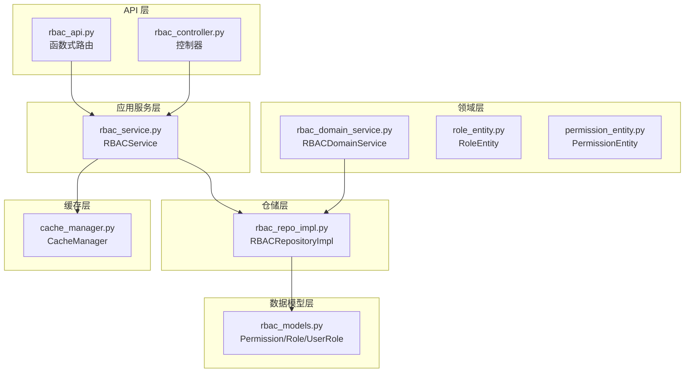
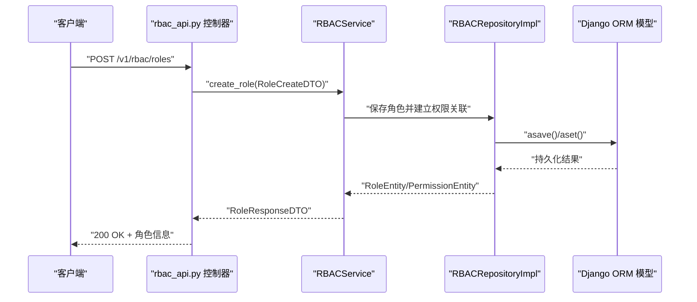
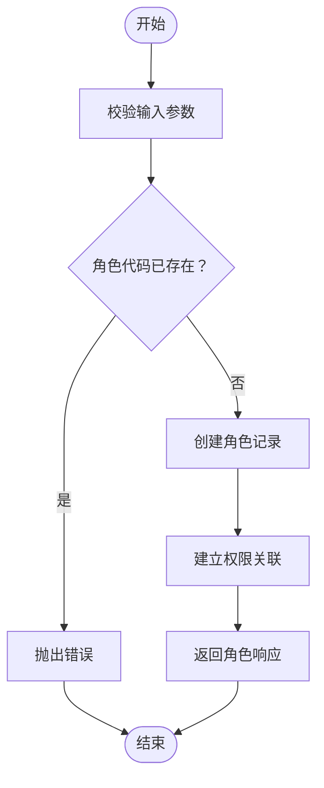
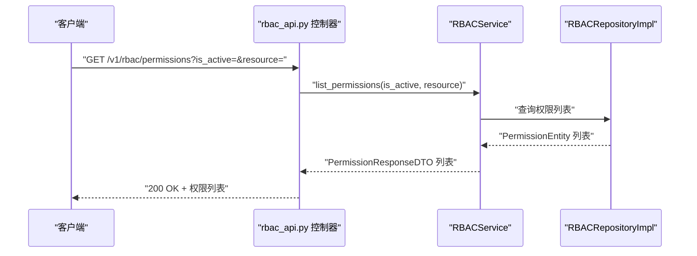
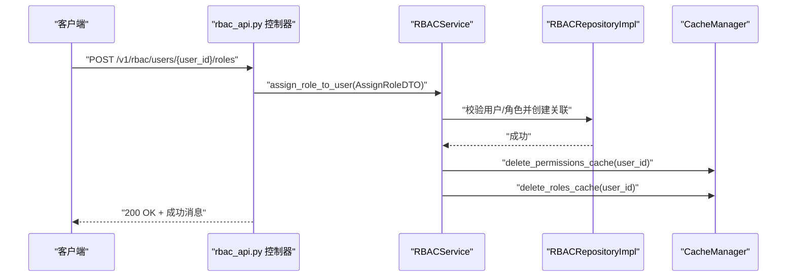
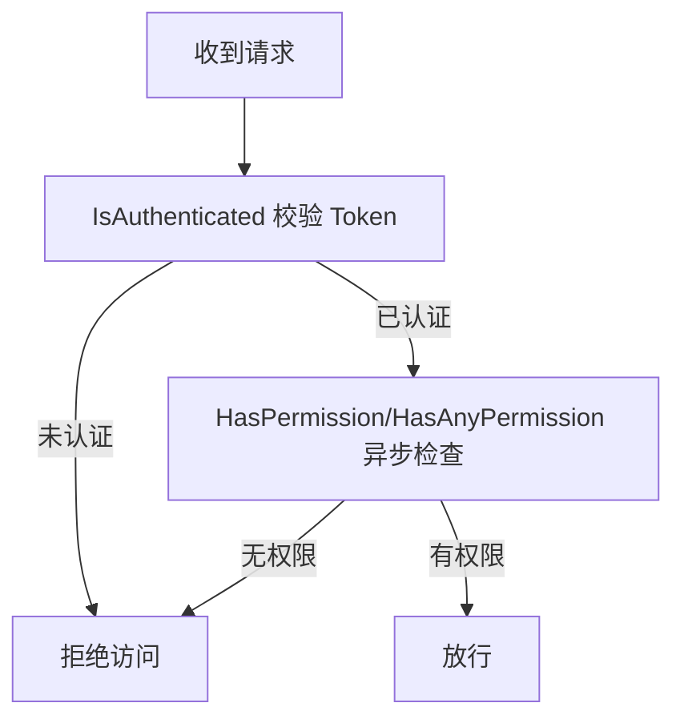
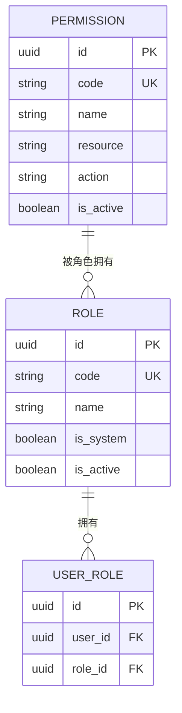
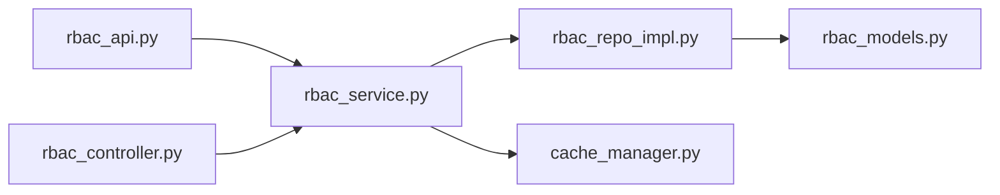

# 权限管理接口

<cite>
**本文引用的文件**
- [rbac_api.py](file://src/api/v1/rbac_api.py)
- [rbac_controller.py](file://src/api/v1/controllers/rbac_controller.py)
- [rbac_service.py](file://src/application/services/rbac_service.py)
- [rbac_domain_service.py](file://src/domain/rbac/services/rbac_domain_service.py)
- [rbac_repo_impl.py](file://src/infrastructure/repositories/rbac_repo_impl.py)
- [rbac_models.py](file://src/infrastructure/persistence/models/rbac_models.py)
- [role_create_dto.py](file://src/application/dto/rbac/role_create_dto.py)
- [role_update_dto.py](file://src/application/dto/rbac/role_update_dto.py)
- [assign_role_dto.py](file://src/application/dto/rbac/assign_role_dto.py)
- [user_roles_response_dto.py](file://src/application/dto/rbac/user_roles_response_dto.py)
- [role_entity.py](file://src/domain/rbac/entities/role_entity.py)
- [permission_entity.py](file://src/domain/rbac/entities/permission_entity.py)
- [cache_manager.py](file://src/infrastructure/cache/cache_manager.py)
- [permissions.py](file://src/api/common/permissions.py)
- [security_middleware.py](file://src/core/middlewares/security_middleware.py)
- [test_rbac_api.py](file://tests/test_api/test_rbac_api.py)
- [rbac.sql](file://sql/rbac.sql)
</cite>

## 目录
1. [简介](#简介)
2. [项目结构](#项目结构)
3. [核心组件](#核心组件)
4. [架构总览](#架构总览)
5. [详细组件分析](#详细组件分析)
6. [依赖分析](#依赖分析)
7. [性能考量](#性能考量)
8. [故障排查指南](#故障排查指南)
9. [结论](#结论)
10. [附录](#附录)

## 简介
本文件为 RBAC 权限管理接口的专业 API 文档，覆盖角色管理、权限分配、用户角色绑定等核心权限功能。内容包括：
- 角色 CRUD 操作、权限查询、用户角色列表等接口的完整规范
- RBAC 架构设计原理、角色层级关系与权限继承机制
- 权限检查流程、访问控制决策与权限缓存策略的技术实现
- 权限模型的数据结构、关系映射与约束规则
- 批量权限操作、权限树形结构与动态权限验证的实现细节
- 权限管理的最佳实践与安全考虑

## 项目结构
RBAC 子系统采用分层架构：API 层负责路由与请求封装；应用服务层承载业务逻辑；领域服务与仓储层分别抽象业务规则与数据持久化；模型层定义数据库表结构；缓存层提供权限与角色缓存能力。

图表来源
- [rbac_api.py:1-184](file://src/api/v1/rbac_api.py#L1-L184)
- [rbac_controller.py:1-351](file://src/api/v1/controllers/rbac_controller.py#L1-L351)
- [rbac_service.py:1-319](file://src/application/services/rbac_service.py#L1-L319)
- [rbac_domain_service.py:1-144](file://src/domain/rbac/services/rbac_domain_service.py#L1-L144)
- [rbac_repo_impl.py:1-251](file://src/infrastructure/repositories/rbac_repo_impl.py#L1-L251)
- [rbac_models.py:1-148](file://src/infrastructure/persistence/models/rbac_models.py#L1-L148)
- [cache_manager.py:1-149](file://src/infrastructure/cache/cache_manager.py#L1-L149)

章节来源
- [rbac_api.py:1-184](file://src/api/v1/rbac_api.py#L1-L184)
- [rbac_controller.py:1-351](file://src/api/v1/controllers/rbac_controller.py#L1-L351)
- [rbac_service.py:1-319](file://src/application/services/rbac_service.py#L1-L319)
- [rbac_domain_service.py:1-144](file://src/domain/rbac/services/rbac_domain_service.py#L1-L144)
- [rbac_repo_impl.py:1-251](file://src/infrastructure/repositories/rbac_repo_impl.py#L1-L251)
- [rbac_models.py:1-148](file://src/infrastructure/persistence/models/rbac_models.py#L1-L148)
- [cache_manager.py:1-149](file://src/infrastructure/cache/cache_manager.py#L1-L149)

## 核心组件
- API 路由与控制器
  - 函数式路由与控制器均提供角色管理、权限管理、用户角色关联与权限检查接口，二者职责一致，分别面向不同开发风格。
- 应用服务层
  - RBACService：封装角色 CRUD、权限初始化、用户角色分配与权限检查等业务逻辑，并集成缓存管理。
- 领域服务与实体
  - RBACDomainService：以领域驱动方式封装角色与权限的业务规则。
  - RoleEntity、PermissionEntity：定义角色与权限的领域实体，包含权限代码解析、激活/停用等行为。
- 仓储层
  - RBACRepositoryImpl：实现角色、权限与用户角色关联的数据库操作，支持权限集合计算与权限校验。
- 数据模型
  - Permission、Role、UserRole：Django ORM 模型，定义权限、角色与用户角色关联的表结构与索引。
- 缓存管理
  - CacheManager：提供用户权限与角色缓存的统一接口，支持读取、写入与失效。

章节来源
- [rbac_api.py:45-184](file://src/api/v1/rbac_api.py#L45-L184)
- [rbac_controller.py:60-351](file://src/api/v1/controllers/rbac_controller.py#L60-L351)
- [rbac_service.py:33-319](file://src/application/services/rbac_service.py#L33-L319)
- [rbac_domain_service.py:22-144](file://src/domain/rbac/services/rbac_domain_service.py#L22-L144)
- [rbac_repo_impl.py:50-247](file://src/infrastructure/repositories/rbac_repo_impl.py#L50-L247)
- [rbac_models.py:13-148](file://src/infrastructure/persistence/models/rbac_models.py#L13-L148)
- [cache_manager.py:16-149](file://src/infrastructure/cache/cache_manager.py#L16-L149)

## 架构总览
RBAC 接口遵循分层解耦与单一职责原则，请求从 API 层进入，经应用服务层处理业务逻辑，仓储层完成数据持久化，缓存层优化权限查询性能。

图表来源
- [rbac_api.py:45-56](file://src/api/v1/rbac_api.py#L45-L56)
- [rbac_service.py:33-56](file://src/application/services/rbac_service.py#L33-L56)
- [rbac_repo_impl.py:66-88](file://src/infrastructure/repositories/rbac_repo_impl.py#L66-L88)
- [rbac_models.py:43-77](file://src/infrastructure/persistence/models/rbac_models.py#L43-L77)

## 详细组件分析

### 角色管理接口
- 创建角色
  - 路径：POST /v1/rbac/roles
  - 输入：RoleCreateDTO（名称、代码、描述、权限代码列表）
  - 行为：校验角色代码唯一性，创建角色并建立权限关联
  - 输出：RoleResponseDTO
- 获取角色详情
  - 路径：GET /v1/rbac/roles/{role_id}
  - 行为：按 ID 查询角色，不存在则抛错
- 获取角色列表
  - 路径：GET /v1/rbac/roles
  - 参数：is_active（可选）
  - 行为：按激活状态过滤角色
- 更新角色
  - 路径：PUT /v1/rbac/roles/{role_id}
  - 输入：RoleUpdateDTO（名称、描述、权限代码列表）
  - 行为：系统角色不可修改，更新后重建权限关联
- 删除角色
  - 路径：DELETE /v1/rbac/roles/{role_id}
  - 行为：系统角色不可删除，删除后返回成功消息

图表来源
- [rbac_api.py:45-56](file://src/api/v1/rbac_api.py#L45-L56)
- [rbac_service.py:33-56](file://src/application/services/rbac_service.py#L33-L56)
- [rbac_repo_impl.py:66-88](file://src/infrastructure/repositories/rbac_repo_impl.py#L66-L88)

章节来源
- [rbac_api.py:45-104](file://src/api/v1/rbac_api.py#L45-L104)
- [rbac_controller.py:60-186](file://src/api/v1/controllers/rbac_controller.py#L60-L186)
- [rbac_service.py:33-107](file://src/application/services/rbac_service.py#L33-L107)
- [rbac_repo_impl.py:66-98](file://src/infrastructure/repositories/rbac_repo_impl.py#L66-L98)

### 权限管理接口
- 获取权限列表
  - 路径：GET /v1/rbac/permissions
  - 参数：is_active、resource（可选）
  - 行为：按激活状态与资源类型过滤权限
- 初始化系统权限
  - 路径：POST /v1/rbac/permissions/init
  - 行为：基于预定义系统权限创建缺失的权限条目

图表来源
- [rbac_api.py:109-128](file://src/api/v1/rbac_api.py#L109-L128)
- [rbac_service.py:145-167](file://src/application/services/rbac_service.py#L145-L167)
- [rbac_repo_impl.py:172-183](file://src/infrastructure/repositories/rbac_repo_impl.py#L172-L183)

章节来源
- [rbac_api.py:109-128](file://src/api/v1/rbac_api.py#L109-L128)
- [rbac_controller.py:189-236](file://src/api/v1/controllers/rbac_controller.py#L189-L236)
- [rbac_service.py:145-167](file://src/application/services/rbac_service.py#L145-L167)
- [rbac_repo_impl.py:172-183](file://src/infrastructure/repositories/rbac_repo_impl.py#L172-L183)

### 用户角色关联接口
- 分配角色给用户
  - 路径：POST /v1/rbac/users/{user_id}/roles
  - 输入：AssignRoleDTO（user_id、role_id）
  - 行为：校验用户与角色存在性及激活状态，避免重复分配，分配后清理用户权限与角色缓存
- 从用户移除角色
  - 路径：DELETE /v1/rbac/users/{user_id}/roles/{role_id}
  - 行为：移除用户角色关联，清理缓存
- 获取用户角色与权限
  - 路径：GET /v1/rbac/users/{user_id}/roles
  - 行为：返回用户角色列表与权限代码列表
- 检查用户权限
  - 路径：GET /v1/rbac/users/{user_id}/permissions/check?permission_code=...
  - 行为：返回用户是否拥有指定权限的布尔值

图表来源
- [rbac_api.py:134-146](file://src/api/v1/rbac_api.py#L134-L146)
- [rbac_service.py:171-205](file://src/application/services/rbac_service.py#L171-L205)
- [rbac_repo_impl.py:186-194](file://src/infrastructure/repositories/rbac_repo_impl.py#L186-L194)
- [cache_manager.py:119-137](file://src/infrastructure/cache/cache_manager.py#L119-L137)

章节来源
- [rbac_api.py:134-184](file://src/api/v1/rbac_api.py#L134-L184)
- [rbac_controller.py:239-351](file://src/api/v1/controllers/rbac_controller.py#L239-L351)
- [rbac_service.py:171-251](file://src/application/services/rbac_service.py#L171-L251)
- [rbac_repo_impl.py:186-247](file://src/infrastructure/repositories/rbac_repo_impl.py#L186-L247)
- [cache_manager.py:108-137](file://src/infrastructure/cache/cache_manager.py#L108-L137)

### 权限检查流程与访问控制决策
- 中间件与权限类
  - SecurityMiddleware：生产环境添加安全响应头
  - IsAuthenticated：校验 Bearer Token 并注入用户信息
  - HasPermission/HasAnyPermission：异步检查用户是否拥有指定权限
- 决策流程
  - 首先执行认证，再执行权限异步检查，最终决定是否放行

图表来源
- [security_middleware.py:33-53](file://src/core/middlewares/security_middleware.py#L33-L53)
- [permissions.py:14-121](file://src/api/common/permissions.py#L14-L121)
- [permissions.py:123-195](file://src/api/common/permissions.py#L123-L195)

章节来源
- [security_middleware.py:14-54](file://src/core/middlewares/security_middleware.py#L14-L54)
- [permissions.py:14-245](file://src/api/common/permissions.py#L14-L245)

### 权限缓存策略
- 缓存键命名
  - 前缀：hello_api，分组：rbac
  - 用户权限缓存键：permissions:{user_id}
  - 用户角色缓存键：roles:{user_id}
- 缓存生命周期
  - 权限缓存：默认 600 秒
  - 角色缓存：默认 600 秒
- 触发失效
  - 分配/移除角色后主动删除对应用户权限与角色缓存，保证一致性

章节来源
- [cache_manager.py:16-149](file://src/infrastructure/cache/cache_manager.py#L16-L149)
- [rbac_service.py:201-204](file://src/application/services/rbac_service.py#L201-L204)
- [rbac_service.py:212-215](file://src/application/services/rbac_service.py#L212-L215)

### 数据模型与关系映射
- 角色与权限
  - 多对多关系：Role.permissions
- 用户与角色
  - 多对多关系：User.user_roles ↔ Role.user_roles
- 约束与索引
  - 角色与权限代码唯一
  - 关键字段建立索引（如 code、resource）

图表来源
- [rbac_models.py:13-114](file://src/infrastructure/persistence/models/rbac_models.py#L13-L114)

章节来源
- [rbac_models.py:13-148](file://src/infrastructure/persistence/models/rbac_models.py#L13-L148)

### 权限模型与实体
- PermissionEntity
  - 字段：permission_id、name、code、resource、action、is_active
  - 行为：自动从 code 解析 resource 与 action，支持激活/停用
- RoleEntity
  - 字段：role_id、name、code、permissions、is_system、is_active
  - 行为：增删权限、激活/停用、序列化为字典

章节来源
- [permission_entity.py:11-85](file://src/domain/rbac/entities/permission_entity.py#L11-L85)
- [role_entity.py:11-80](file://src/domain/rbac/entities/role_entity.py#L11-L80)

### DTO 定义
- RoleCreateDTO：创建角色时的输入校验与示例
- RoleUpdateDTO：更新角色时的输入校验
- AssignRoleDTO：分配角色时的输入校验
- UserRolesResponseDTO：用户角色与权限列表的输出结构

章节来源
- [role_create_dto.py:9-30](file://src/application/dto/rbac/role_create_dto.py#L9-L30)
- [role_update_dto.py:9-28](file://src/application/dto/rbac/role_update_dto.py#L9-L28)
- [assign_role_dto.py:9-21](file://src/application/dto/rbac/assign_role_dto.py#L9-L21)
- [user_roles_response_dto.py:11-17](file://src/application/dto/rbac/user_roles_response_dto.py#L11-L17)

## 依赖分析
- 组件耦合
  - API 层依赖应用服务层；应用服务层依赖仓储层；仓储层依赖数据模型层；应用服务层依赖缓存管理器。
- 外部依赖
  - Django ORM、Django 缓存框架、Ninja/NinjaExtra 框架
- 循环依赖
  - 通过分层与接口隔离避免循环依赖

图表来源
- [rbac_api.py:17](file://src/api/v1/rbac_api.py#L17)
- [rbac_controller.py:21](file://src/api/v1/controllers/rbac_controller.py#L21)
- [rbac_service.py:19](file://src/application/services/rbac_service.py#L19)
- [rbac_repo_impl.py:11](file://src/infrastructure/repositories/rbac_repo_impl.py#L11)
- [rbac_models.py:10](file://src/infrastructure/persistence/models/rbac_models.py#L10)
- [cache_manager.py:11](file://src/infrastructure/cache/cache_manager.py#L11)

章节来源
- [rbac_api.py:1-184](file://src/api/v1/rbac_api.py#L1-L184)
- [rbac_controller.py:1-351](file://src/api/v1/controllers/rbac_controller.py#L1-L351)
- [rbac_service.py:1-319](file://src/application/services/rbac_service.py#L1-L319)
- [rbac_repo_impl.py:1-251](file://src/infrastructure/repositories/rbac_repo_impl.py#L1-L251)
- [rbac_models.py:1-148](file://src/infrastructure/persistence/models/rbac_models.py#L1-L148)
- [cache_manager.py:1-149](file://src/infrastructure/cache/cache_manager.py#L1-L149)

## 性能考量
- 缓存命中率
  - 权限检查优先从缓存读取，减少数据库查询压力
- 批量权限计算
  - 通过角色集合合并去重，降低重复权限查询成本
- 索引优化
  - 对权限 code、resource 等关键字段建立索引，提升查询效率
- 异步操作
  - 使用 async ORM 方法，提高并发场景下的吞吐量

## 故障排查指南
- 常见错误与处理
  - 角色/权限不存在：返回相应错误信息
  - 系统角色不可修改/删除：提示不可操作
  - 用户已拥有角色：避免重复分配
  - 用户无此角色：移除失败时提示
- 测试覆盖
  - 角色 CRUD、权限列表、权限初始化、用户角色分配/移除、用户权限检查等均有测试用例覆盖

章节来源
- [rbac_service.py:74-106](file://src/application/services/rbac_service.py#L74-L106)
- [rbac_service.py:171-217](file://src/application/services/rbac_service.py#L171-L217)
- [test_rbac_api.py:23-238](file://tests/test_api/test_rbac_api.py#L23-L238)

## 结论
本 RBAC 子系统通过清晰的分层架构与完善的缓存策略，实现了高效、可扩展的角色与权限管理能力。接口设计遵循 REST 规范，权限检查支持异步与缓存，满足生产环境的高可用需求。建议在生产环境中结合安全中间件与细粒度权限注解，进一步强化访问控制与审计能力。

## 附录
- SQL 示例
  - 可参考 sql/rbac.sql 中的表结构与索引定义，用于数据库初始化与迁移

章节来源
- [rbac.sql:18-148](file://sql/rbac.sql#L18-L148)