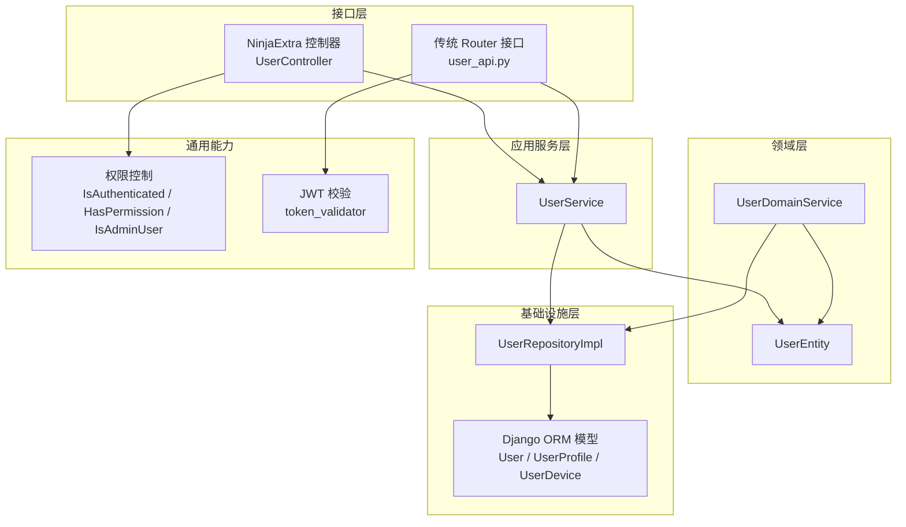
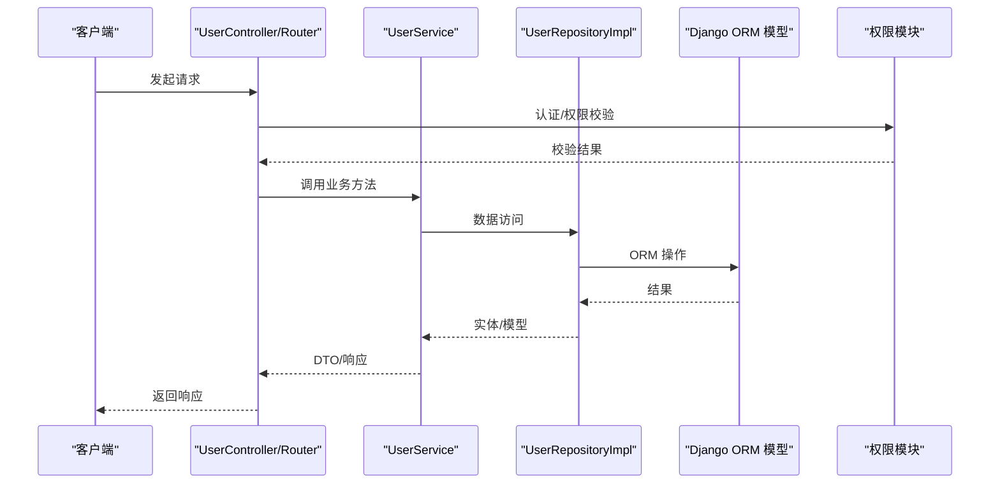
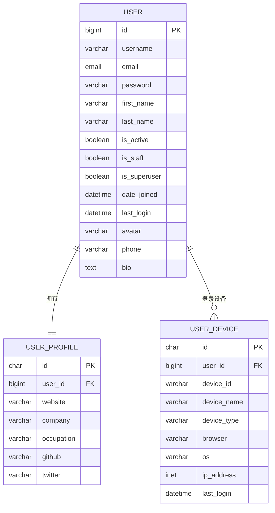
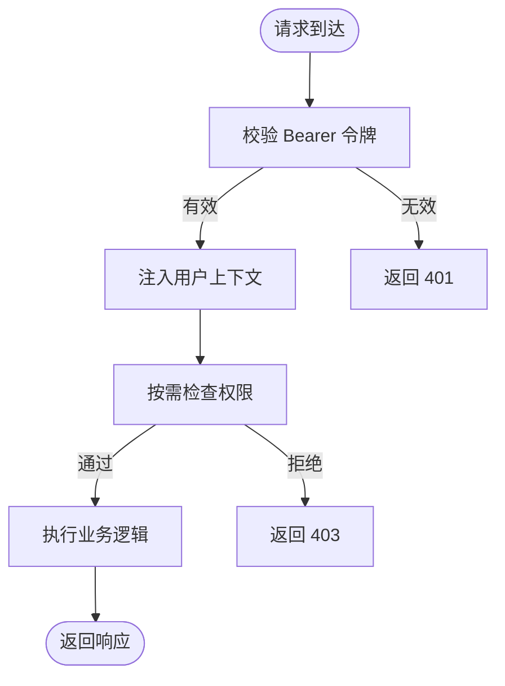
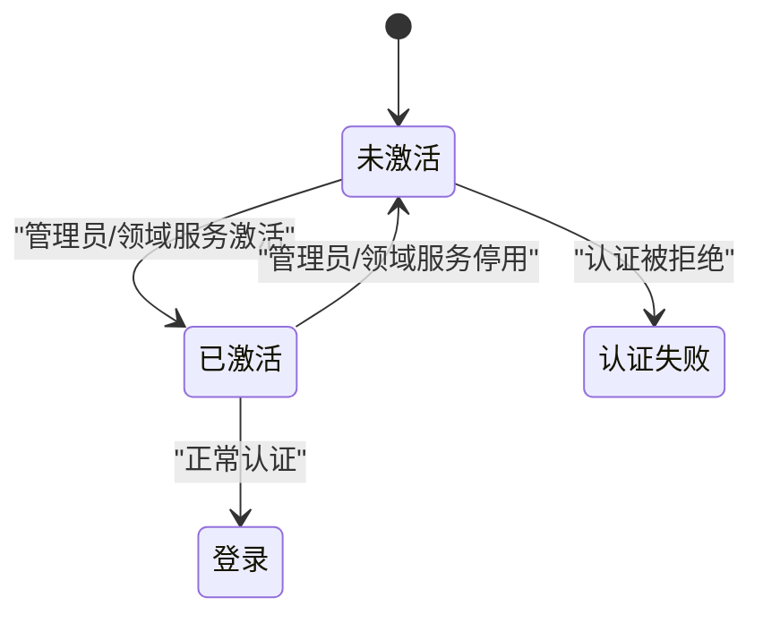
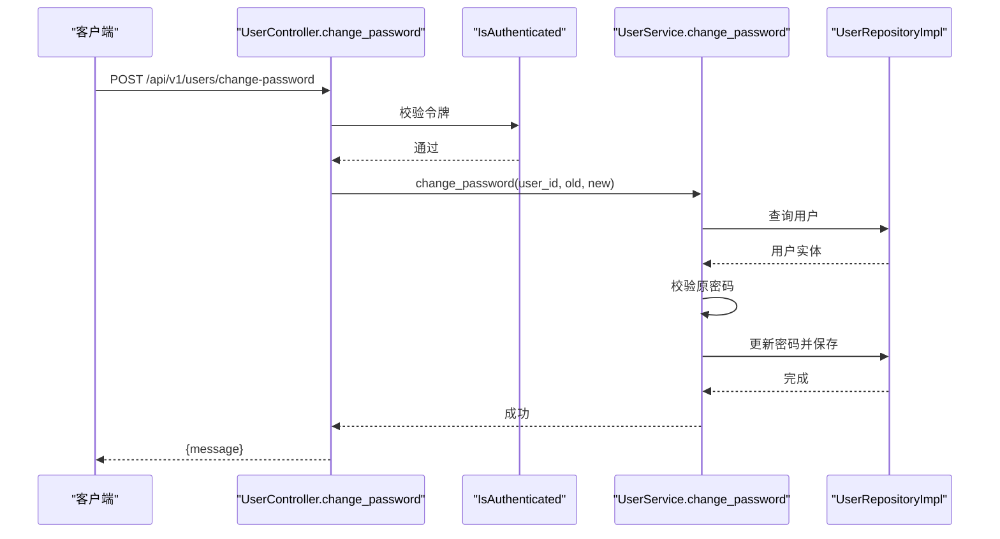
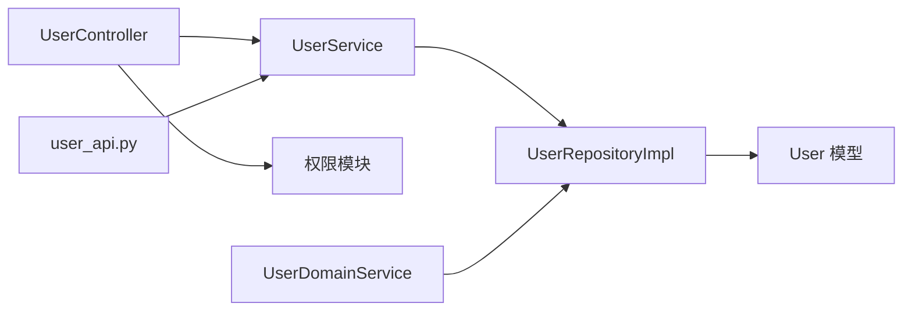

# 用户管理 API

<cite>
**本文引用的文件**
- [src/api/app.py](file://src/api/app.py)
- [src/api/v1/user_api.py](file://src/api/v1/user_api.py)
- [src/api/v1/controllers/user_controller.py](file://src/api/v1/controllers/user_controller.py)
- [src/application/dto/user/user_create_dto.py](file://src/application/dto/user/user_create_dto.py)
- [src/application/dto/user/user_update_dto.py](file://src/application/dto/user/user_update_dto.py)
- [src/application/dto/user/change_password_dto.py](file://src/application/dto/user/change_password_dto.py)
- [src/application/dto/user/user_response_dto.py](file://src/application/dto/user/user_response_dto.py)
- [src/application/services/user_service.py](file://src/application/services/user_service.py)
- [src/domain/user/entities/user_entity.py](file://src/domain/user/entities/user_entity.py)
- [src/domain/user/services/user_domain_service.py](file://src/domain/user/services/user_domain_service.py)
- [src/infrastructure/repositories/user_repo_impl.py](file://src/infrastructure/repositories/user_repo_impl.py)
- [src/infrastructure/persistence/models/user_models.py](file://src/infrastructure/persistence/models/user_models.py)
- [src/api/common/permissions.py](file://src/api/common/permissions.py)
- [src/core/exceptions/user_inactive_error.py](file://src/core/exceptions/user_inactive_error.py)
</cite>

## 目录
1. [简介](#简介)
2. [项目结构](#项目结构)
3. [核心组件](#核心组件)
4. [架构总览](#架构总览)
5. [详细组件分析](#详细组件分析)
6. [依赖分析](#依赖分析)
7. [性能考量](#性能考量)
8. [故障排查指南](#故障排查指南)
9. [结论](#结论)
10. [附录](#附录)

## 简介
本文件面向“用户管理 API”的使用者与维护者，系统性梳理用户 CRUD 操作及相关能力（创建、查询、更新、删除、修改密码、获取当前用户信息）的接口规范、数据模型、权限控制、错误处理与最佳实践。文档同时解释用户状态管理与激活流程，帮助读者快速理解并正确使用该模块。

## 项目结构
用户管理 API 采用分层架构：控制器层负责路由与鉴权装饰器；应用服务层封装业务逻辑；领域层定义实体与业务规则；基础设施层负责数据持久化与模型映射；通用权限模块提供认证与授权能力。

图表来源
- [src/api/v1/controllers/user_controller.py:33-283](file://src/api/v1/controllers/user_controller.py#L33-L283)
- [src/api/v1/user_api.py:1-150](file://src/api/v1/user_api.py#L1-L150)
- [src/application/services/user_service.py:15-172](file://src/application/services/user_service.py#L15-L172)
- [src/domain/user/entities/user_entity.py:11-120](file://src/domain/user/entities/user_entity.py#L11-L120)
- [src/domain/user/services/user_domain_service.py:10-117](file://src/domain/user/services/user_domain_service.py#L10-L117)
- [src/infrastructure/repositories/user_repo_impl.py:13-138](file://src/infrastructure/repositories/user_repo_impl.py#L13-L138)
- [src/infrastructure/persistence/models/user_models.py:12-147](file://src/infrastructure/persistence/models/user_models.py#L12-L147)
- [src/api/common/permissions.py:14-245](file://src/api/common/permissions.py#L14-L245)

章节来源
- [src/api/app.py:8-31](file://src/api/app.py#L8-L31)
- [src/api/v1/user_api.py:1-150](file://src/api/v1/user_api.py#L1-L150)
- [src/api/v1/controllers/user_controller.py:33-283](file://src/api/v1/controllers/user_controller.py#L33-L283)

## 核心组件
- 控制器层
  - UserController：基于 NinjaExtra 的控制器，统一暴露用户相关接口，部分接口配置了认证与权限装饰器。
  - user_api.py：基于传统 Router 的用户接口，提供创建、查询、更新、删除、修改密码、获取当前用户等接口。
- 应用服务层
  - UserService：封装用户业务逻辑，包括创建、查询、更新、删除、密码修改、认证、分页列表等；集成缓存与仓储。
- 领域层
  - UserEntity：DDD 实体，包含用户状态（激活/员工/超级管理员）、个人信息、业务方法（激活/停用、授予权限等）。
  - UserDomainService：跨实体的业务编排，如创建用户、更新资料、修改密码、激活/停用用户等。
- 基础设施层
  - UserRepositoryImpl：用户数据访问实现，负责与 Django ORM 模型交互。
  - User 模型：继承自 AbstractUser，扩展头像、手机、部门关联等字段，并提供索引与元信息。
- 权限控制
  - IsAuthenticated：校验 JWT 并注入用户上下文。
  - HasPermission / HasAnyPermission：基于 RBAC 的权限校验（异步）。
  - IsAdminUser：管理员角色校验。

章节来源
- [src/api/v1/controllers/user_controller.py:33-283](file://src/api/v1/controllers/user_controller.py#L33-L283)
- [src/api/v1/user_api.py:50-150](file://src/api/v1/user_api.py#L50-L150)
- [src/application/services/user_service.py:15-172](file://src/application/services/user_service.py#L15-L172)
- [src/domain/user/entities/user_entity.py:11-120](file://src/domain/user/entities/user_entity.py#L11-L120)
- [src/domain/user/services/user_domain_service.py:19-117](file://src/domain/user/services/user_domain_service.py#L19-L117)
- [src/infrastructure/repositories/user_repo_impl.py:13-138](file://src/infrastructure/repositories/user_repo_impl.py#L13-L138)
- [src/infrastructure/persistence/models/user_models.py:12-147](file://src/infrastructure/persistence/models/user_models.py#L12-L147)
- [src/api/common/permissions.py:14-245](file://src/api/common/permissions.py#L14-L245)

## 架构总览
用户管理 API 的调用链路如下：客户端请求经由控制器层进入，应用服务层处理业务逻辑并调用仓储层，仓储层与 Django ORM 模型交互完成数据持久化；权限模块在控制器层进行认证与授权校验。

图表来源
- [src/api/v1/controllers/user_controller.py:53-283](file://src/api/v1/controllers/user_controller.py#L53-L283)
- [src/api/v1/user_api.py:50-150](file://src/api/v1/user_api.py#L50-L150)
- [src/application/services/user_service.py:28-172](file://src/application/services/user_service.py#L28-L172)
- [src/infrastructure/repositories/user_repo_impl.py:72-138](file://src/infrastructure/repositories/user_repo_impl.py#L72-L138)
- [src/api/common/permissions.py:14-245](file://src/api/common/permissions.py#L14-L245)

## 详细组件分析

### 接口规范与数据模型

- 接口总览
  - 创建用户：POST /api/v1/users
  - 获取用户详情：GET /api/v1/users/{user_id}
  - 获取用户列表：GET /api/v1/users?page&pageSize
  - 更新用户：PUT /api/v1/users/{user_id}
  - 删除用户：DELETE /api/v1/users/{user_id}
  - 修改密码：POST /api/v1/users/change-password
  - 获取当前用户信息：GET /api/v1/me

- 请求与响应数据模型
  - 创建用户：UserCreateDTO
    - 字段：username、email、password、first_name、last_name、phone
    - 校验：用户名长度、邮箱格式、密码长度
  - 更新用户：UserUpdateDTO
    - 字段：first_name、last_name、phone、avatar、bio
  - 修改密码：ChangePasswordDTO
    - 字段：old_password、new_password
  - 用户响应：UserResponseDTO
    - 字段：user_id、username、email、first_name、last_name、is_active、is_staff、is_superuser、avatar、phone、bio、date_joined、last_login

- 认证与权限
  - 修改密码与获取当前用户信息需认证（Bearer Token）
  - 控制器层通过 IsAuthenticated 装饰器实现
  - 权限模块提供更细粒度的 RBAC 校验（HasPermission/HasAnyPermission）

- 状态码与错误处理
  - 成功：200/201
  - 未认证/令牌无效：401
  - 资源不存在：404
  - 业务错误（如用户名/邮箱已存在、原密码不正确、用户未激活等）：400
  - 服务器内部错误：500

章节来源
- [src/api/v1/user_api.py:50-150](file://src/api/v1/user_api.py#L50-L150)
- [src/api/v1/controllers/user_controller.py:53-283](file://src/api/v1/controllers/user_controller.py#L53-L283)
- [src/application/dto/user/user_create_dto.py:9-34](file://src/application/dto/user/user_create_dto.py#L9-L34)
- [src/application/dto/user/user_update_dto.py:9-32](file://src/application/dto/user/user_update_dto.py#L9-L32)
- [src/application/dto/user/change_password_dto.py:9-23](file://src/application/dto/user/change_password_dto.py#L9-L23)
- [src/application/dto/user/user_response_dto.py:11-30](file://src/application/dto/user/user_response_dto.py#L11-L30)
- [src/api/common/permissions.py:14-245](file://src/api/common/permissions.py#L14-L245)

### 用户数据模型说明
- 用户基础信息
  - user_id：唯一标识
  - username、email、first_name、last_name、phone、avatar、bio
- 认证与状态
  - is_active：是否激活
  - is_staff：是否员工
  - is_superuser：是否超级管理员
  - date_joined、last_login
- Django ORM 模型
  - User：继承 AbstractUser，扩展头像、手机号、部门关联、创建者/修改者等
  - UserProfile：一对一扩展档案信息
  - UserDevice：记录登录设备与 IP

图表来源
- [src/infrastructure/persistence/models/user_models.py:12-147](file://src/infrastructure/persistence/models/user_models.py#L12-L147)

章节来源
- [src/infrastructure/persistence/models/user_models.py:12-147](file://src/infrastructure/persistence/models/user_models.py#L12-L147)
- [src/application/dto/user/user_response_dto.py:11-30](file://src/application/dto/user/user_response_dto.py#L11-L30)

### 权限控制机制
- 认证
  - 通过 Authorization: Bearer <token> 传递令牌
  - IsAuthenticated 校验令牌有效性并将用户信息注入请求上下文
- 授权
  - HasPermission/HasAnyPermission 支持基于 RBAC 的细粒度权限校验（异步）
  - IsAdminUser 校验用户角色是否包含 admin
- 使用建议
  - 对敏感操作（如删除用户、批量查询）建议启用 HasPermission 或 IsAdminUser
  - 对公开接口可使用 AllowAny

图表来源
- [src/api/common/permissions.py:14-245](file://src/api/common/permissions.py#L14-L245)

章节来源
- [src/api/common/permissions.py:14-245](file://src/api/common/permissions.py#L14-L245)

### 用户状态管理与激活流程
- 用户状态
  - is_active：控制用户是否可登录
  - is_staff / is_superuser：控制后台与超级权限
- 激活/停用
  - 领域服务提供 activate_user/deactivate_user
  - 应用服务在认证时检查 is_active 并抛出相应错误
- 流程示意

图表来源
- [src/domain/user/entities/user_entity.py:71-98](file://src/domain/user/entities/user_entity.py#L71-L98)
- [src/domain/user/services/user_domain_service.py:66-83](file://src/domain/user/services/user_domain_service.py#L66-L83)
- [src/application/services/user_service.py:131-149](file://src/application/services/user_service.py#L131-L149)
- [src/core/exceptions/user_inactive_error.py:9-26](file://src/core/exceptions/user_inactive_error.py#L9-L26)

章节来源
- [src/domain/user/entities/user_entity.py:71-98](file://src/domain/user/entities/user_entity.py#L71-L98)
- [src/domain/user/services/user_domain_service.py:66-83](file://src/domain/user/services/user_domain_service.py#L66-L83)
- [src/application/services/user_service.py:131-149](file://src/application/services/user_service.py#L131-L149)
- [src/core/exceptions/user_inactive_error.py:9-26](file://src/core/exceptions/user_inactive_error.py#L9-L26)

### 接口调用序列示例

#### 修改密码流程

图表来源
- [src/api/v1/controllers/user_controller.py:197-225](file://src/api/v1/controllers/user_controller.py#L197-L225)
- [src/application/services/user_service.py:118-129](file://src/application/services/user_service.py#L118-L129)
- [src/infrastructure/repositories/user_repo_impl.py:72-106](file://src/infrastructure/repositories/user_repo_impl.py#L72-L106)
- [src/api/common/permissions.py:14-44](file://src/api/common/permissions.py#L14-L44)

章节来源
- [src/api/v1/controllers/user_controller.py:197-225](file://src/api/v1/controllers/user_controller.py#L197-L225)
- [src/application/services/user_service.py:118-129](file://src/application/services/user_service.py#L118-L129)
- [src/infrastructure/repositories/user_repo_impl.py:72-106](file://src/infrastructure/repositories/user_repo_impl.py#L72-L106)
- [src/api/common/permissions.py:14-44](file://src/api/common/permissions.py#L14-L44)

## 依赖分析
- 控制器到服务
  - UserController 与 user_api.py 均依赖 UserService
- 服务到仓储
  - UserService 依赖 UserRepositoryImpl
- 仓储到模型
  - UserRepositoryImpl 依赖 Django ORM User 模型
- 权限到校验
  - 控制器通过 IsAuthenticated/HasPermission 等装饰器进行权限控制
- 领域到仓储
  - UserDomainService 通过 UserRepositoryInterface 与仓储交互

图表来源
- [src/api/v1/controllers/user_controller.py:44-51](file://src/api/v1/controllers/user_controller.py#L44-L51)
- [src/api/v1/user_api.py:15-16](file://src/api/v1/user_api.py#L15-L16)
- [src/application/services/user_service.py:21-22](file://src/application/services/user_service.py#L21-L22)
- [src/infrastructure/repositories/user_repo_impl.py:13-138](file://src/infrastructure/repositories/user_repo_impl.py#L13-L138)
- [src/api/common/permissions.py:14-245](file://src/api/common/permissions.py#L14-L245)
- [src/domain/user/services/user_domain_service.py:16-17](file://src/domain/user/services/user_domain_service.py#L16-L17)

章节来源
- [src/api/v1/controllers/user_controller.py:44-51](file://src/api/v1/controllers/user_controller.py#L44-L51)
- [src/api/v1/user_api.py:15-16](file://src/api/v1/user_api.py#L15-L16)
- [src/application/services/user_service.py:21-22](file://src/application/services/user_service.py#L21-L22)
- [src/infrastructure/repositories/user_repo_impl.py:13-138](file://src/infrastructure/repositories/user_repo_impl.py#L13-L138)
- [src/api/common/permissions.py:14-245](file://src/api/common/permissions.py#L14-L245)
- [src/domain/user/services/user_domain_service.py:16-17](file://src/domain/user/services/user_domain_service.py#L16-L17)

## 性能考量
- 缓存策略
  - UserService 在查询用户详情时使用缓存管理器缓存用户信息，减少数据库压力
- 分页与限制
  - 列表接口支持分页，最大每页 100 条，避免一次性返回大量数据
- 数据库索引
  - User 模型对 username、email、phone 建立索引，提升查询效率
- 密码存储
  - 使用哈希算法存储密码，避免明文存储

章节来源
- [src/application/services/user_service.py:52-66](file://src/application/services/user_service.py#L52-L66)
- [src/api/v1/user_api.py:75-87](file://src/api/v1/user_api.py#L75-L87)
- [src/infrastructure/persistence/models/user_models.py:76-80](file://src/infrastructure/persistence/models/user_models.py#L76-L80)

## 故障排查指南
- 400 错误
  - 用户名/邮箱已存在：创建用户时重复
  - 原密码不正确：修改密码时旧密码校验失败
  - 用户未激活：认证时触发
- 401 错误
  - 未携带有效 Bearer 令牌或令牌无效
- 404 错误
  - 查询用户详情或删除用户时资源不存在
- 403 错误
  - 无权限执行操作（RBAC 权限不足）
- 建议排查步骤
  - 确认 Authorization 头格式与令牌有效性
  - 检查用户状态（is_active）
  - 核对权限范围与角色
  - 查看服务端日志定位异常

章节来源
- [src/application/services/user_service.py:30-36](file://src/application/services/user_service.py#L30-L36)
- [src/application/services/user_service.py:118-125](file://src/application/services/user_service.py#L118-L125)
- [src/application/services/user_service.py:137-139](file://src/application/services/user_service.py#L137-L139)
- [src/api/common/permissions.py:14-44](file://src/api/common/permissions.py#L14-L44)
- [src/core/exceptions/user_inactive_error.py:9-26](file://src/core/exceptions/user_inactive_error.py#L9-L26)

## 结论
本用户管理 API 提供了完善的用户 CRUD 能力与安全的权限控制，结合缓存与索引优化具备良好的性能表现。通过明确的数据模型、清晰的调用链路与完善的错误处理，能够满足大多数用户管理场景的需求。建议在生产环境中配合严格的 RBAC 权限配置与审计日志，持续保障系统安全与稳定。

## 附录

### 最佳实践
- 输入验证
  - 使用 DTO 校验字段长度、格式与必填项
- 安全考虑
  - 严格使用 Bearer 令牌，避免明文密码传输
  - 启用 HTTPS 与安全中间件
- 日志与监控
  - 记录关键操作与异常事件，便于追踪与审计
- 数据一致性
  - 删除用户后清理相关缓存（权限、角色、用户信息）
- 用户体验
  - 提供明确的错误提示与重试策略

### 接口清单与要点
- 创建用户
  - 路径：POST /api/v1/users
  - 鉴权：无需（公开）
  - 校验：用户名/邮箱唯一性
- 获取用户详情
  - 路径：GET /api/v1/users/{user_id}
  - 鉴权：无需
- 获取用户列表
  - 路径：GET /api/v1/users?page&pageSize
  - 鉴权：无需
  - 限制：page>=1，page_size>=1 且 <=100
- 更新用户
  - 路径：PUT /api/v1/users/{user_id}
  - 鉴权：无需
- 删除用户
  - 路径：DELETE /api/v1/users/{user_id}
  - 鉴权：无需
  - 行为：软删除并清理缓存
- 修改密码
  - 路径：POST /api/v1/users/change-password
  - 鉴权：IsAuthenticated
  - 校验：原密码正确
- 获取当前用户信息
  - 路径：GET /api/v1/me
  - 鉴权：IsAuthenticated

章节来源
- [src/api/v1/user_api.py:50-150](file://src/api/v1/user_api.py#L50-L150)
- [src/api/v1/controllers/user_controller.py:53-283](file://src/api/v1/controllers/user_controller.py#L53-L283)
- [src/api/common/permissions.py:14-44](file://src/api/common/permissions.py#L14-L44)