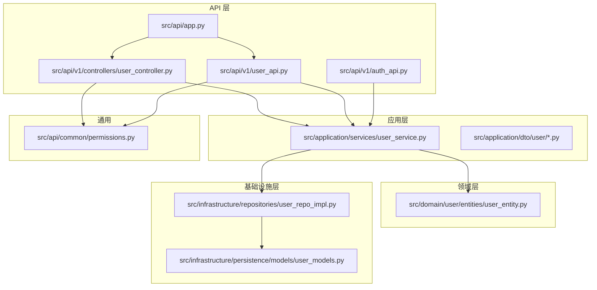
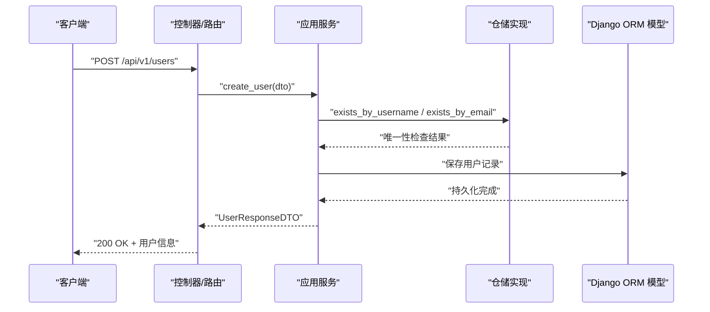
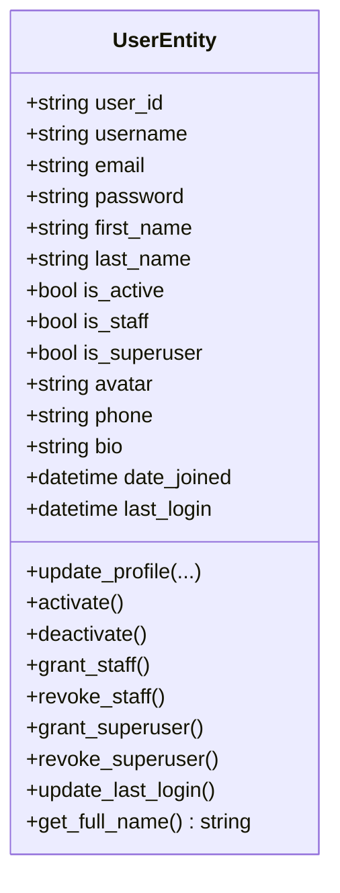
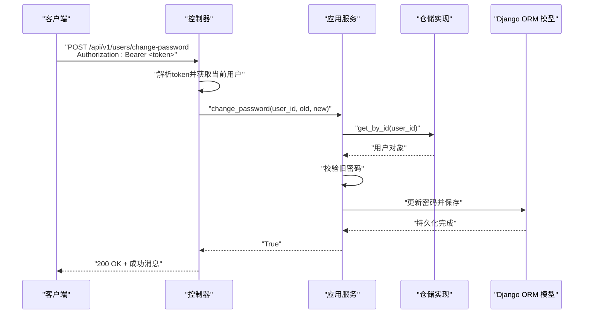
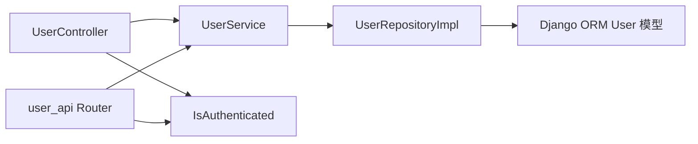

# 用户管理接口

<cite>
**本文引用的文件**
- [src/api/app.py](file://src/api/app.py)
- [src/api/v1/user_api.py](file://src/api/v1/user_api.py)
- [src/api/v1/controllers/user_controller.py](file://src/api/v1/controllers/user_controller.py)
- [src/api/v1/auth_api.py](file://src/api/v1/auth_api.py)
- [src/application/dto/user/user_create_dto.py](file://src/application/dto/user/user_create_dto.py)
- [src/application/dto/user/user_update_dto.py](file://src/application/dto/user/user_update_dto.py)
- [src/application/dto/user/user_response_dto.py](file://src/application/dto/user/user_response_dto.py)
- [src/application/dto/user/change_password_dto.py](file://src/application/dto/user/change_password_dto.py)
- [src/application/dto/user/user_login_dto.py](file://src/application/dto/user/user_login_dto.py)
- [src/application/services/user_service.py](file://src/application/services/user_service.py)
- [src/infrastructure/repositories/user_repo_impl.py](file://src/infrastructure/repositories/user_repo_impl.py)
- [src/infrastructure/persistence/models/user_models.py](file://src/infrastructure/persistence/models/user_models.py)
- [src/domain/user/entities/user_entity.py](file://src/domain/user/entities/user_entity.py)
- [src/api/common/permissions.py](file://src/api/common/permissions.py)
- [tests/test_api/test_user_api.py](file://tests/test_api/test_user_api.py)
</cite>

## 目录
1. [简介](#简介)
2. [项目结构](#项目结构)
3. [核心组件](#核心组件)
4. [架构总览](#架构总览)
5. [详细组件分析](#详细组件分析)
6. [依赖分析](#依赖分析)
7. [性能考虑](#性能考虑)
8. [故障排查指南](#故障排查指南)
9. [结论](#结论)
10. [附录](#附录)

## 简介
本文件为“用户管理接口”的全面 API 文档，覆盖用户注册、登录、信息更新、密码修改、用户查询与删除等全部用户相关功能。内容包括：
- 每个端点的功能描述、请求参数、响应结构与权限要求
- 用户实体字段定义、数据类型约束与业务规则
- 用户 CRUD 操作的最佳实践与示例
- 用户状态管理、邮箱验证与账户激活流程
- 批量操作、分页查询与搜索过滤的实现细节

## 项目结构
该系统采用分层架构：API 控制器层负责路由与权限校验；应用服务层封装业务逻辑；仓储层负责数据持久化；领域层定义用户实体与业务规则；基础设施层提供模型与缓存等支撑。

图表来源
- [src/api/app.py:17-30](file://src/api/app.py#L17-L30)
- [src/api/v1/user_api.py:18-149](file://src/api/v1/user_api.py#L18-L149)
- [src/api/v1/controllers/user_controller.py:33-282](file://src/api/v1/controllers/user_controller.py#L33-L282)
- [src/api/v1/auth_api.py:13-73](file://src/api/v1/auth_api.py#L13-L73)
- [src/application/services/user_service.py:16-192](file://src/application/services/user_service.py#L16-L192)
- [src/infrastructure/repositories/user_repo_impl.py:13-139](file://src/infrastructure/repositories/user_repo_impl.py#L13-L139)
- [src/infrastructure/persistence/models/user_models.py:12-146](file://src/infrastructure/persistence/models/user_models.py#L12-L146)
- [src/domain/user/entities/user_entity.py:11-119](file://src/domain/user/entities/user_entity.py#L11-L119)
- [src/api/common/permissions.py:14-244](file://src/api/common/permissions.py#L14-L244)

章节来源
- [src/api/app.py:17-30](file://src/api/app.py#L17-L30)
- [src/api/v1/user_api.py:18-149](file://src/api/v1/user_api.py#L18-L149)
- [src/api/v1/controllers/user_controller.py:33-282](file://src/api/v1/controllers/user_controller.py#L33-L282)
- [src/api/v1/auth_api.py:13-73](file://src/api/v1/auth_api.py#L13-L73)

## 核心组件
- 用户控制器与路由
  - 提供用户 CRUD、密码修改、当前用户信息查询等接口
  - 支持两种控制器风格：Ninja Router 与 NinjaExtra API Controller
- 应用服务
  - 实现用户业务逻辑：创建、查询、更新、删除、密码修改、认证等
  - 负责数据校验、密码哈希、缓存与异常处理
- 仓储与模型
  - 仓储实现数据库操作，支持异步查询、分页与计数
  - Django ORM 模型定义用户表结构与索引
- 领域实体
  - 定义用户实体与业务规则（如用户名、邮箱校验）
- 权限控制
  - 自定义权限类：认证、权限检查、管理员等
- DTO
  - 输入输出数据传输对象，统一请求/响应结构与校验规则

章节来源
- [src/api/v1/user_api.py:18-149](file://src/api/v1/user_api.py#L18-L149)
- [src/api/v1/controllers/user_controller.py:33-282](file://src/api/v1/controllers/user_controller.py#L33-L282)
- [src/application/services/user_service.py:16-192](file://src/application/services/user_service.py#L16-L192)
- [src/infrastructure/repositories/user_repo_impl.py:13-139](file://src/infrastructure/repositories/user_repo_impl.py#L13-L139)
- [src/infrastructure/persistence/models/user_models.py:12-146](file://src/infrastructure/persistence/models/user_models.py#L12-L146)
- [src/domain/user/entities/user_entity.py:11-119](file://src/domain/user/entities/user_entity.py#L11-L119)
- [src/api/common/permissions.py:14-244](file://src/api/common/permissions.py#L14-L244)

## 架构总览
用户管理接口遵循清晰的分层与职责分离：
- 控制器层：接收请求、解析 DTO、调用应用服务、返回响应
- 应用服务层：编排业务流程、执行校验、调用仓储与缓存
- 领域层：维护业务规则与不变量
- 基础设施层：ORM 模型与仓储实现，提供数据持久化能力
- 权限层：统一鉴权与授权策略

图表来源
- [src/api/v1/user_api.py:50-61](file://src/api/v1/user_api.py#L50-L61)
- [src/application/services/user_service.py:29-50](file://src/application/services/user_service.py#L29-L50)
- [src/infrastructure/repositories/user_repo_impl.py:125-131](file://src/infrastructure/repositories/user_repo_impl.py#L125-L131)
- [src/infrastructure/persistence/models/user_models.py:12-87](file://src/infrastructure/persistence/models/user_models.py#L12-L87)

## 详细组件分析

### 用户实体与字段定义
- 用户实体包含标识、身份信息、状态标志、扩展信息与时间戳
- 关键字段与约束
  - user_id: 字符串，唯一标识
  - username: 非空，长度 3~50
  - email: 非空，需包含“@”
  - is_active: 布尔，表示账户是否激活
  - is_staff / is_superuser: 员工与超级管理员标志
  - first_name / last_name / phone / avatar / bio: 可空扩展信息
  - date_joined / last_login: 时间戳

图表来源
- [src/domain/user/entities/user_entity.py:11-119](file://src/domain/user/entities/user_entity.py#L11-L119)

章节来源
- [src/domain/user/entities/user_entity.py:11-119](file://src/domain/user/entities/user_entity.py#L11-L119)

### 用户创建（注册）
- 端点
  - 方法与路径：POST /api/v1/users
  - 权限：公开接口（允许任何用户访问）
- 请求体（UserCreateDTO）
  - username: 非空，长度 3~50
  - email: 非空，符合邮箱格式
  - password: 非空，长度 6~100
  - first_name / last_name / phone: 可空
- 响应
  - UserResponseDTO：包含用户完整信息
- 业务规则
  - 用户名与邮箱唯一性校验
  - 密码使用框架安全哈希
- 示例
  - 成功场景：提交合法的用户名、邮箱与密码，返回创建的用户信息
  - 失败场景：用户名或邮箱重复，返回错误

图表来源
- [src/application/services/user_service.py:29-50](file://src/application/services/user_service.py#L29-L50)
- [src/infrastructure/repositories/user_repo_impl.py:125-131](file://src/infrastructure/repositories/user_repo_impl.py#L125-L131)
- [src/application/dto/user/user_create_dto.py:9-33](file://src/application/dto/user/user_create_dto.py#L9-L33)

章节来源
- [src/api/v1/user_api.py:50-61](file://src/api/v1/user_api.py#L50-L61)
- [src/application/dto/user/user_create_dto.py:9-33](file://src/application/dto/user/user_create_dto.py#L9-L33)
- [src/application/services/user_service.py:29-50](file://src/application/services/user_service.py#L29-L50)
- [tests/test_api/test_user_api.py:23-34](file://tests/test_api/test_user_api.py#L23-L34)

### 获取用户详情
- 端点
  - 方法与路径：GET /api/v1/users/{user_id}
  - 权限：公开接口
- 参数
  - user_id: 路径参数，用户唯一标识
- 响应
  - UserResponseDTO：用户信息
- 业务规则
  - 若用户不存在，返回错误

章节来源
- [src/api/v1/user_api.py:63-72](file://src/api/v1/user_api.py#L63-L72)
- [src/application/services/user_service.py:52-66](file://src/application/services/user_service.py#L52-L66)
- [tests/test_api/test_user_api.py:52-66](file://tests/test_api/test_user_api.py#L52-L66)

### 获取用户列表（分页）
- 端点
  - 方法与路径：GET /api/v1/users
  - 权限：公开接口
- 查询参数
  - page: 整数，>=1，默认 1
  - page_size: 整数，>=1 且 <=100，默认 10
- 响应
  - 包含 users、total、page、page_size 的列表响应
- 业务规则
  - 支持分页与总数统计
- 示例
  - 创建多个用户后，按 page/page_size 查询，验证分页结果

章节来源
- [src/api/v1/user_api.py:75-87](file://src/api/v1/user_api.py#L75-L87)
- [src/application/services/user_service.py:110-116](file://src/application/services/user_service.py#L110-L116)
- [tests/test_api/test_user_api.py:88-108](file://tests/test_api/test_user_api.py#L88-L108)

### 更新用户
- 端点
  - 方法与路径：PUT /api/v1/users/{user_id}
  - 权限：公开接口
- 请求体（UserUpdateDTO）
  - first_name / last_name / phone / avatar / bio: 可空
- 响应
  - UserResponseDTO：更新后的用户信息
- 业务规则
  - 仅更新传入的字段
  - 更新后清除相关缓存
- 示例
  - 发送部分字段更新请求，验证只更新传入字段

章节来源
- [src/api/v1/user_api.py:90-101](file://src/api/v1/user_api.py#L90-L101)
- [src/application/dto/user/user_update_dto.py:9-31](file://src/application/dto/user/user_update_dto.py#L9-L31)
- [src/application/services/user_service.py:82-98](file://src/application/services/user_service.py#L82-L98)
- [tests/test_api/test_user_api.py:110-128](file://tests/test_api/test_user_api.py#L110-L128)

### 删除用户
- 端点
  - 方法与路径：DELETE /api/v1/users/{user_id}
  - 权限：公开接口
- 响应
  - MessageResponse：删除成功消息
- 业务规则
  - 删除后清理用户相关缓存
- 示例
  - 删除存在的用户，返回成功消息；删除不存在的用户，返回错误

章节来源
- [src/api/v1/user_api.py:103-112](file://src/api/v1/user_api.py#L103-L112)
- [src/application/services/user_service.py:100-108](file://src/application/services/user_service.py#L100-L108)
- [tests/test_api/test_user_api.py:129-146](file://tests/test_api/test_user_api.py#L129-L146)

### 修改密码
- 端点
  - 方法与路径：POST /api/v1/users/change-password
  - 权限：需要认证（Bearer Token）
- 请求头
  - Authorization: Bearer <token>
- 请求体（ChangePasswordDTO）
  - old_password: 非空，长度 6~100
  - new_password: 非空，长度 6~100
- 响应
  - MessageResponse：密码修改成功消息
- 业务规则
  - 需要当前登录用户身份
  - 校验旧密码正确性
  - 新密码进行安全哈希存储
- 示例
  - 登录后携带 token 调用修改密码接口，返回成功

图表来源
- [src/api/v1/user_api.py:115-132](file://src/api/v1/user_api.py#L115-L132)
- [src/application/services/user_service.py:118-130](file://src/application/services/user_service.py#L118-L130)
- [src/infrastructure/repositories/user_repo_impl.py:72-78](file://src/infrastructure/repositories/user_repo_impl.py#L72-L78)

章节来源
- [src/api/v1/user_api.py:115-132](file://src/api/v1/user_api.py#L115-L132)
- [src/api/common/permissions.py:14-44](file://src/api/common/permissions.py#L14-L44)
- [src/application/dto/user/change_password_dto.py:9-22](file://src/application/dto/user/change_password_dto.py#L9-L22)
- [src/application/services/user_service.py:118-130](file://src/application/services/user_service.py#L118-L130)
- [tests/test_api/test_user_api.py:148-182](file://tests/test_api/test_user_api.py#L148-L182)

### 获取当前用户信息
- 端点
  - 方法与路径：GET /api/v1/me
  - 权限：需要认证（Bearer Token）
- 请求头
  - Authorization: Bearer <token>
- 响应
  - UserResponseDTO：当前登录用户信息
- 业务规则
  - 需要有效 token，否则返回错误
- 示例
  - 登录后携带 token 调用 /me，返回当前用户信息

章节来源
- [src/api/v1/user_api.py:135-149](file://src/api/v1/user_api.py#L135-L149)
- [src/api/common/permissions.py:14-44](file://src/api/common/permissions.py#L14-L44)
- [tests/test_api/test_user_api.py:184-214](file://tests/test_api/test_user_api.py#L184-L214)

### 登录与认证（补充）
- 端点
  - POST /api/v1/login：用户名+密码登录，返回访问/刷新令牌
  - POST /api/v1/refresh：使用刷新令牌获取新的访问令牌
  - POST /api/v1/logout：撤销当前访问令牌
- 用途
  - 为需要认证的用户接口（如修改密码、获取当前用户）提供 Bearer Token

章节来源
- [src/api/v1/auth_api.py:22-73](file://src/api/v1/auth_api.py#L22-L73)
- [src/application/dto/user/user_login_dto.py:9-27](file://src/application/dto/user/user_login_dto.py#L9-L27)

## 依赖分析
- 控制器到服务
  - 用户控制器与路由均调用 UserService 执行业务逻辑
- 服务到仓储
  - UserService 通过 UserRepositoryImpl 访问数据库
- 仓储到模型
  - UserRepositoryImpl 在 Django ORM User 模型上执行异步查询与保存
- 权限到控制器
  - 控制器使用 IsAuthenticated 等权限类进行鉴权

图表来源
- [src/api/v1/controllers/user_controller.py:51-51](file://src/api/v1/controllers/user_controller.py#L51-L51)
- [src/api/v1/user_api.py:56-56](file://src/api/v1/user_api.py#L56-L56)
- [src/application/services/user_service.py:22-23](file://src/application/services/user_service.py#L22-L23)
- [src/infrastructure/repositories/user_repo_impl.py:13-13](file://src/infrastructure/repositories/user_repo_impl.py#L13-L13)
- [src/infrastructure/persistence/models/user_models.py:12-146](file://src/infrastructure/persistence/models/user_models.py#L12-L146)
- [src/api/common/permissions.py:14-44](file://src/api/common/permissions.py#L14-L44)

章节来源
- [src/api/v1/controllers/user_controller.py:51-51](file://src/api/v1/controllers/user_controller.py#L51-L51)
- [src/api/v1/user_api.py:56-56](file://src/api/v1/user_api.py#L56-L56)
- [src/application/services/user_service.py:22-23](file://src/application/services/user_service.py#L22-L23)
- [src/infrastructure/repositories/user_repo_impl.py:13-13](file://src/infrastructure/repositories/user_repo_impl.py#L13-L13)
- [src/infrastructure/persistence/models/user_models.py:12-146](file://src/infrastructure/persistence/models/user_models.py#L12-L146)
- [src/api/common/permissions.py:14-44](file://src/api/common/permissions.py#L14-L44)

## 性能考虑
- 缓存策略
  - 读取用户详情时优先从缓存获取，命中则直接返回，未命中再查询数据库并写入缓存
  - 更新与删除用户后清理相关缓存，避免脏读
- 异步访问
  - 仓储与服务层广泛使用异步 ORM 接口，提升高并发下的吞吐
- 分页与索引
  - 用户列表支持分页与总数统计
  - 模型定义了 username、email、phone 等索引，优化查询性能
- 密码安全
  - 使用框架内置的安全哈希算法，避免明文存储

章节来源
- [src/application/services/user_service.py:54-66](file://src/application/services/user_service.py#L54-L66)
- [src/infrastructure/repositories/user_repo_impl.py:117-123](file://src/infrastructure/repositories/user_repo_impl.py#L117-L123)
- [src/infrastructure/persistence/models/user_models.py:76-80](file://src/infrastructure/persistence/models/user_models.py#L76-L80)

## 故障排查指南
- 常见错误与原因
  - 用户不存在：查询用户详情或删除用户时，若 ID 不存在会返回错误
  - 未登录或令牌无效：访问需要认证的接口（如 /me、/users/change-password）时，缺少或无效的 Bearer Token
  - 用户名或邮箱已存在：创建用户时重复导致冲突
  - 原密码不正确：修改密码时旧密码校验失败
  - 用户被停用：认证时发现 is_active=False
- 排查步骤
  - 确认请求头 Authorization 是否为 Bearer <token>
  - 确认 token 未过期且签名有效
  - 确认用户状态 is_active=True
  - 检查 DTO 字段长度与格式是否满足约束
  - 查看服务层异常抛出的具体错误信息

章节来源
- [src/api/v1/user_api.py:70-71](file://src/api/v1/user_api.py#L70-L71)
- [src/api/v1/user_api.py:121-123](file://src/api/v1/user_api.py#L121-L123)
- [src/api/v1/user_api.py:142-143](file://src/api/v1/user_api.py#L142-L143)
- [src/application/services/user_service.py:32-37](file://src/application/services/user_service.py#L32-L37)
- [src/application/services/user_service.py:124-126](file://src/application/services/user_service.py#L124-L126)
- [src/application/services/user_service.py:138-139](file://src/application/services/user_service.py#L138-L139)
- [tests/test_api/test_user_api.py:66-69](file://tests/test_api/test_user_api.py#L66-L69)
- [tests/test_api/test_user_api.py:148-182](file://tests/test_api/test_user_api.py#L148-L182)

## 结论
本用户管理接口提供了完整的用户生命周期管理能力，涵盖注册、查询、更新、删除与密码修改等核心功能。通过清晰的分层设计、严格的 DTO 校验、完善的权限控制与缓存策略，系统在保证安全性的同时具备良好的性能与可维护性。建议在生产环境中结合认证与 RBAC 策略，进一步强化访问控制与审计能力。

## 附录

### 用户实体字段定义与约束
- user_id: 字符串，唯一标识
- username: 非空，长度 3~50
- email: 非空，需包含“@”
- is_active: 布尔，账户激活状态
- is_staff / is_superuser: 布尔，员工与超级管理员标志
- first_name / last_name / phone / avatar / bio: 可空扩展信息
- date_joined / last_login: 时间戳

章节来源
- [src/domain/user/entities/user_entity.py:18-31](file://src/domain/user/entities/user_entity.py#L18-L31)
- [src/application/dto/user/user_create_dto.py:12-17](file://src/application/dto/user/user_create_dto.py#L12-L17)
- [src/application/dto/user/user_update_dto.py:12-16](file://src/application/dto/user/user_update_dto.py#L12-L16)
- [src/application/dto/user/user_response_dto.py:14-26](file://src/application/dto/user/user_response_dto.py#L14-L26)

### 权限要求一览
- 创建用户：允许任何用户访问
- 获取用户详情：允许任何用户访问
- 获取用户列表：允许任何用户访问
- 更新用户：允许任何用户访问
- 删除用户：允许任何用户访问
- 修改密码：需要认证（Bearer Token）
- 获取当前用户信息：需要认证（Bearer Token）

章节来源
- [src/api/v1/user_api.py:50-149](file://src/api/v1/user_api.py#L50-L149)
- [src/api/common/permissions.py:14-44](file://src/api/common/permissions.py#L14-L44)

### 最佳实践
- 创建用户
  - 在前端完成基础校验（长度、格式），后端再次校验唯一性
  - 使用安全哈希存储密码
- 更新用户
  - 使用 PATCH 方式仅传递变更字段，减少不必要的更新
  - 更新后及时清理缓存
- 删除用户
  - 采用软删除策略（如需保留审计日志），并清理相关缓存
- 密码修改
  - 必须校验旧密码正确性
  - 修改后使旧 token 失效（结合登出或黑名单机制）
- 分页查询
  - 合理设置 page_size 上限，避免过大请求
  - 使用数据库索引优化查询

章节来源
- [src/application/services/user_service.py:82-98](file://src/application/services/user_service.py#L82-L98)
- [src/infrastructure/repositories/user_repo_impl.py:117-123](file://src/infrastructure/repositories/user_repo_impl.py#L117-L123)
- [src/api/v1/user_api.py:75-87](file://src/api/v1/user_api.py#L75-L87)