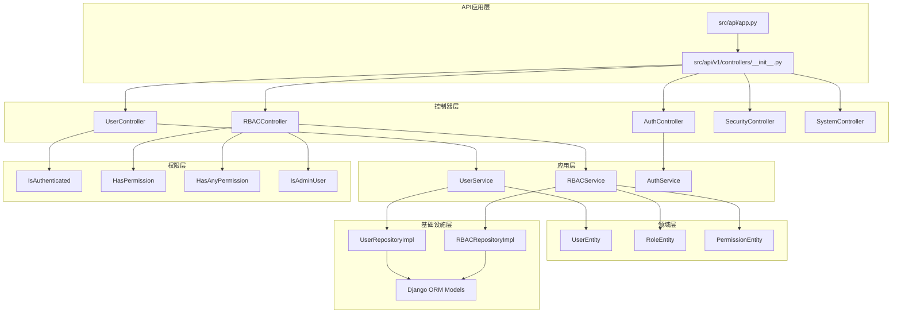
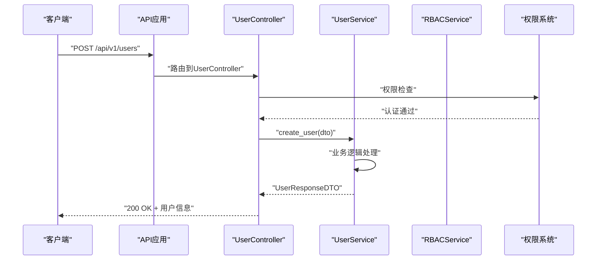
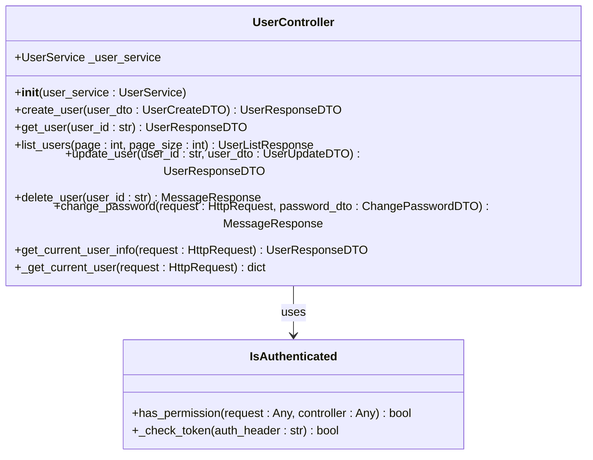
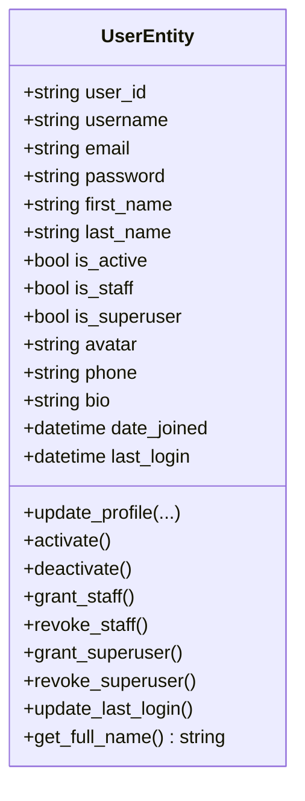
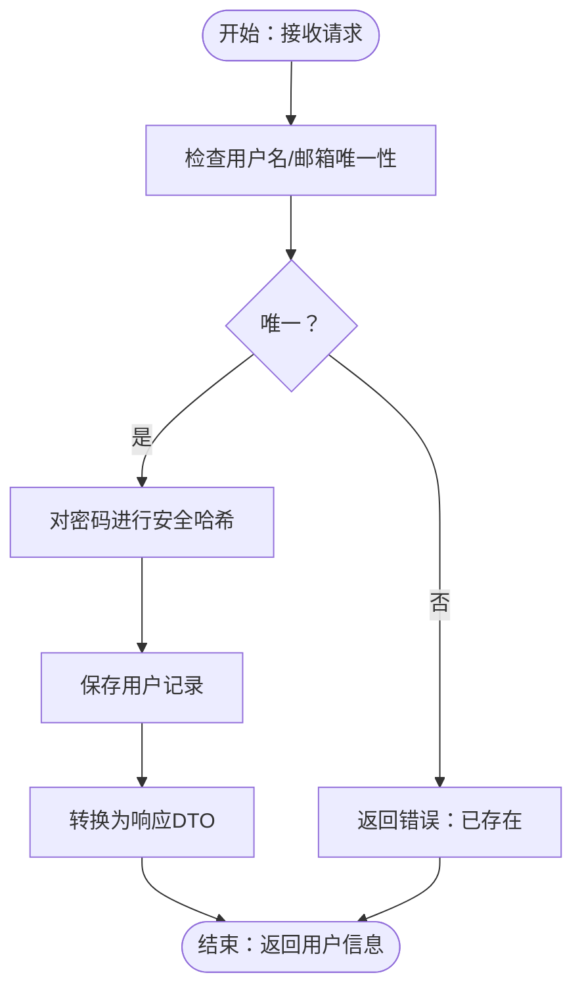
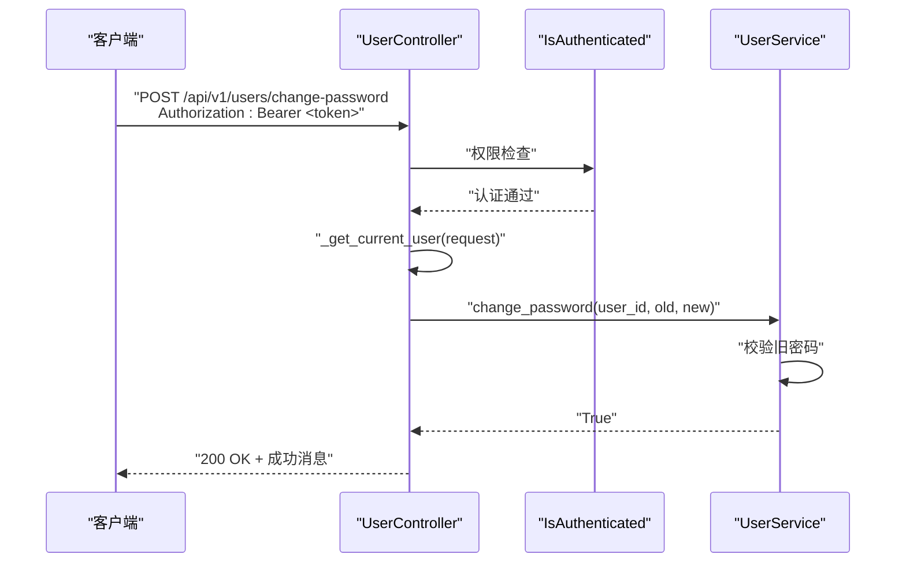
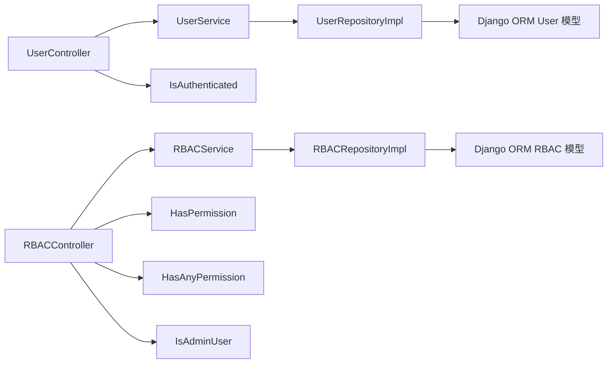

# 用户管理接口

<cite>
**本文引用的文件**
- [src/api/app.py](file://src/api/app.py)
- [src/api/v1/controllers/user_controller.py](file://src/api/v1/controllers/user_controller.py)
- [src/api/v1/controllers/rbac_controller.py](file://src/api/v1/controllers/rbac_controller.py)
- [src/api/v1/controllers/auth_controller.py](file://src/api/v1/controllers/auth_controller.py)
- [src/api/v1/controllers/security_controller.py](file://src/api/v1/controllers/security_controller.py)
- [src/api/v1/controllers/system_controller.py](file://src/api/v1/controllers/system_controller.py)
- [src/api/v1/controllers/__init__.py](file://src/api/v1/controllers/__init__.py)
- [src/api/common/permissions.py](file://src/api/common/permissions.py)
- [src/application/services/user_service.py](file://src/application/services/user_service.py)
- [src/application/services/rbac_service.py](file://src/application/services/rbac_service.py)
- [src/application/dto/user/user_create_dto.py](file://src/application/dto/user/user_create_dto.py)
- [src/application/dto/user/user_update_dto.py](file://src/application/dto/user/user_update_dto.py)
- [src/application/dto/user/user_response_dto.py](file://src/application/dto/user/user_response_dto.py)
- [src/application/dto/user/change_password_dto.py](file://src/application/dto/user/change_password_dto.py)
- [src/application/dto/user/user_login_dto.py](file://src/application/dto/user/user_login_dto.py)
- [src/infrastructure/repositories/user_repo_impl.py](file://src/infrastructure/repositories/user_repo_impl.py)
- [src/infrastructure/persistence/models/user_models.py](file://src/infrastructure/persistence/models/user_models.py)
- [src/domain/user/entities/user_entity.py](file://src/domain/user/entities/user_entity.py)
- [tests/test_api/test_user_api.py](file://tests/test_api/test_user_api.py)
</cite>

## 更新摘要
**所做更改**
- 更新架构总览以反映控制器架构迁移
- 新增NinjaExtra控制器装饰器使用说明
- 增强RBAC权限系统集成文档
- 更新权限类和控制器模式说明
- 补充控制器依赖注入和SOLID原则说明

## 目录
1. [简介](#简介)
2. [项目结构](#项目结构)
3. [核心组件](#核心组件)
4. [架构总览](#架构总览)
5. [详细组件分析](#详细组件分析)
6. [依赖分析](#依赖分析)
7. [性能考虑](#性能考虑)
8. [故障排查指南](#故障排查指南)
9. [结论](#结论)
10. [附录](#附录)

## 简介
本文件为"用户管理接口"的全面 API 文档，覆盖用户注册、登录、信息更新、密码修改、用户查询与删除等全部用户相关功能。内容包括：
- 每个端点的功能描述、请求参数、响应结构与权限要求
- 用户实体字段定义、数据类型约束与业务规则
- 用户 CRUD 操作的最佳实践与示例
- 用户状态管理、邮箱验证与账户激活流程
- 批量操作、分页查询与搜索过滤的实现细节
- **新增**：基于NinjaExtra控制器架构的改进实现
- **新增**：与RBAC权限系统的深度集成

## 项目结构
该系统采用现代化的控制器架构：API应用层负责路由注册；控制器层提供RESTful端点和权限控制；应用服务层封装业务逻辑；仓储层负责数据持久化；领域层定义用户实体与业务规则；基础设施层提供模型与缓存等支撑。

**图表来源**
- [src/api/app.py:8-16](file://src/api/app.py#L8-L16)
- [src/api/v1/controllers/__init__.py:6-10](file://src/api/v1/controllers/__init__.py#L6-L10)
- [src/api/v1/controllers/user_controller.py:28-46](file://src/api/v1/controllers/user_controller.py#L28-L46)
- [src/api/v1/controllers/rbac_controller.py:31-49](file://src/api/v1/controllers/rbac_controller.py#L31-L49)
- [src/api/common/permissions.py:13-244](file://src/api/common/permissions.py#L13-L244)

**章节来源**
- [src/api/app.py:8-16](file://src/api/app.py#L8-L16)
- [src/api/v1/controllers/__init__.py:6-10](file://src/api/v1/controllers/__init__.py#L6-L10)
- [src/api/v1/controllers/user_controller.py:28-46](file://src/api/v1/controllers/user_controller.py#L28-L46)
- [src/api/common/permissions.py:13-244](file://src/api/common/permissions.py#L13-L244)

## 核心组件
- **控制器架构**
  - 使用NinjaExtra的@api_controller装饰器提供RESTful端点
  - 支持HTTP方法装饰器：@http_get、@http_post、@http_put、@http_delete
  - 实现依赖注入和构造函数注入模式
- **用户控制器**
  - 提供完整的用户CRUD操作：创建、查询、更新、删除
  - 支持密码修改和当前用户信息查询
  - 集成JWT认证和RBAC权限检查
- **RBAC权限系统**
  - 新增HasPermission权限类，支持细粒度权限控制
  - HasAnyPermission权限类，支持多权限检查
  - IsAdminUser权限类，专门用于管理员角色检查
- **应用服务层**
  - UserService处理用户业务逻辑
  - RBACService处理角色权限业务逻辑
  - 支持异步操作和缓存管理
- **权限控制**
  - IsAuthenticated：基础认证检查
  - 自定义权限类：认证、权限检查、管理员等
- **DTO和响应**
  - 统一的数据传输对象结构
  - 标准化的响应格式和错误处理

**章节来源**
- [src/api/v1/controllers/user_controller.py:28-46](file://src/api/v1/controllers/user_controller.py#L28-L46)
- [src/api/v1/controllers/rbac_controller.py:31-49](file://src/api/v1/controllers/rbac_controller.py#L31-L49)
- [src/api/common/permissions.py:13-244](file://src/api/common/permissions.py#L13-L244)
- [src/application/services/user_service.py:14-26](file://src/application/services/user_service.py#L14-L26)
- [src/application/services/rbac_service.py:15-23](file://src/application/services/rbac_service.py#L15-L23)

## 架构总览
用户管理接口采用现代化的控制器架构，遵循SOLID原则：
- **单一职责**：每个控制器专注于特定领域的API请求
- **依赖倒置**：通过构造函数注入服务实例
- **开放封闭**：控制器层对扩展开放，对修改封闭
- **里氏替换**：控制器继承自基类，保持一致的接口
- **接口隔离**：权限类提供明确的接口契约

**图表来源**
- [src/api/app.py:16](file://src/api/app.py#L16)
- [src/api/v1/controllers/user_controller.py:48-65](file://src/api/v1/controllers/user_controller.py#L48-L65)
- [src/api/common/permissions.py:19-43](file://src/api/common/permissions.py#L19-L43)

**章节来源**
- [src/api/app.py:16](file://src/api/app.py#L16)
- [src/api/v1/controllers/user_controller.py:28-46](file://src/api/v1/controllers/user_controller.py#L28-L46)
- [src/api/common/permissions.py:13-244](file://src/api/common/permissions.py#L13-L244)

## 详细组件分析

### 用户控制器与权限系统

**更新** 用户控制器现在采用标准的控制器模式，提供更好的组织和依赖注入能力。

- **控制器装饰器**
  - @api_controller("/v1", tags=["用户"], permissions=[AllowAny])
  - 支持标签分类和默认权限设置
- **HTTP方法装饰器**
  - @http_get、@http_post、@http_put、@http_delete
  - 提供语义化的端点定义
- **依赖注入**
  - 构造函数注入UserService实例
  - 支持可选参数，便于测试和扩展
- **权限集成**
  - 修改密码和当前用户信息查询需要IsAuthenticated权限
  - 支持自定义权限检查和RBAC集成

**图表来源**
- [src/api/v1/controllers/user_controller.py:28-46](file://src/api/v1/controllers/user_controller.py#L28-L46)
- [src/api/v1/controllers/user_controller.py:146-171](file://src/api/v1/controllers/user_controller.py#L146-L171)
- [src/api/common/permissions.py:13-44](file://src/api/common/permissions.py#L13-L44)

**章节来源**
- [src/api/v1/controllers/user_controller.py:28-46](file://src/api/v1/controllers/user_controller.py#L28-L46)
- [src/api/v1/controllers/user_controller.py:146-171](file://src/api/v1/controllers/user_controller.py#L146-L171)
- [src/api/common/permissions.py:13-44](file://src/api/common/permissions.py#L13-L44)

### 用户实体与字段定义
- 用户实体包含标识、身份信息、状态标志、扩展信息与时间戳
- 关键字段与约束
  - user_id: 字符串，唯一标识
  - username: 非空，长度 3~50
  - email: 非空，需包含"@"
  - is_active: 布尔，表示账户是否激活
  - is_staff / is_superuser: 员工与超级管理员标志
  - first_name / last_name / phone / avatar / bio: 可空扩展信息
  - date_joined / last_login: 时间戳

**图表来源**
- [src/domain/user/entities/user_entity.py:11-119](file://src/domain/user/entities/user_entity.py#L11-L119)

**章节来源**
- [src/domain/user/entities/user_entity.py:11-119](file://src/domain/user/entities/user_entity.py#L11-L119)

### 用户创建（注册）
- **端点**
  - 方法与路径：POST /api/v1/users
  - 权限：公开接口（AllowAny）
- **请求体（UserCreateDTO）**
  - username: 非空，长度 3~50
  - email: 非空，符合邮箱格式
  - password: 非空，长度 6~100
  - first_name / last_name / phone: 可空
- **响应**
  - UserResponseDTO：包含用户完整信息
- **业务规则**
  - 用户名与邮箱唯一性校验
  - 密码使用Django安全哈希
- **示例**
  - 成功场景：提交合法的用户名、邮箱与密码，返回创建的用户信息
  - 失败场景：用户名或邮箱重复，返回错误

**图表来源**
- [src/application/services/user_service.py:27-48](file://src/application/services/user_service.py#L27-L48)
- [src/infrastructure/repositories/user_repo_impl.py:125-131](file://src/infrastructure/repositories/user_repo_impl.py#L125-L131)

**章节来源**
- [src/api/v1/controllers/user_controller.py:48-65](file://src/api/v1/controllers/user_controller.py#L48-L65)
- [src/application/dto/user/user_create_dto.py:9-33](file://src/application/dto/user/user_create_dto.py#L9-L33)
- [src/application/services/user_service.py:27-48](file://src/application/services/user_service.py#L27-L48)

### 获取用户详情
- **端点**
  - 方法与路径：GET /api/v1/users/{user_id}
  - 权限：公开接口
- **参数**
  - user_id: 路径参数，用户唯一标识
- **响应**
  - UserResponseDTO：用户信息
- **业务规则**
  - 若用户不存在，返回错误

**章节来源**
- [src/api/v1/controllers/user_controller.py:67-86](file://src/api/v1/controllers/user_controller.py#L67-L86)
- [src/application/services/user_service.py:50-64](file://src/application/services/user_service.py#L50-L64)

### 获取用户列表（分页）
- **端点**
  - 方法与路径：GET /api/v1/users
  - 权限：公开接口
- **查询参数**
  - page: 整数，>=1，默认 1
  - page_size: 整数，>=1 且 <=100，默认 10
- **响应**
  - UserListResponse：包含 users、total、page、page_size 的列表响应
- **业务规则**
  - 支持分页与总数统计
- **示例**
  - 创建多个用户后，按 page/page_size 查询，验证分页结果

**章节来源**
- [src/api/v1/controllers/user_controller.py:88-103](file://src/api/v1/controllers/user_controller.py#L88-L103)
- [src/application/services/user_service.py:108-112](file://src/application/services/user_service.py#L108-L112)

### 更新用户
- **端点**
  - 方法与路径：PUT /api/v1/users/{user_id}
  - 权限：公开接口
- **请求体（UserUpdateDTO）**
  - first_name / last_name / phone / avatar / bio: 可空
- **响应**
  - UserResponseDTO：更新后的用户信息
- **业务规则**
  - 仅更新传入的字段
  - 更新后清除相关缓存
- **示例**
  - 发送部分字段更新请求，验证只更新传入字段

**章节来源**
- [src/api/v1/controllers/user_controller.py:105-123](file://src/api/v1/controllers/user_controller.py#L105-L123)
- [src/application/dto/user/user_update_dto.py:9-31](file://src/application/dto/user/user_update_dto.py#L9-L31)
- [src/application/services/user_service.py:80-96](file://src/application/services/user_service.py#L80-L96)

### 删除用户
- **端点**
  - 方法与路径：DELETE /api/v1/users/{user_id}
  - 权限：公开接口
- **响应**
  - MessageResponse：删除成功消息
- **业务规则**
  - 删除后清理用户相关缓存
- **示例**
  - 删除存在的用户，返回成功消息；删除不存在的用户，返回错误

**章节来源**
- [src/api/v1/controllers/user_controller.py:125-144](file://src/api/v1/controllers/user_controller.py#L125-L144)
- [src/application/services/user_service.py:98-106](file://src/application/services/user_service.py#L98-L106)

### 修改密码
- **端点**
  - 方法与路径：POST /api/v1/users/change-password
  - 权限：需要IsAuthenticated权限
- **请求头**
  - Authorization: Bearer <token>
- **请求体（ChangePasswordDTO）**
  - old_password: 非空，长度 6~100
  - new_password: 非空，长度 6~100
- **响应**
  - MessageResponse：密码修改成功消息
- **业务规则**
  - 需要当前登录用户身份
  - 校验旧密码正确性
  - 新密码进行安全哈希存储
- **示例**
  - 登录后携带 token 调用修改密码接口，返回成功

**图表来源**
- [src/api/v1/controllers/user_controller.py:146-171](file://src/api/v1/controllers/user_controller.py#L146-L171)
- [src/api/common/permissions.py:19-43](file://src/api/common/permissions.py#L19-L43)
- [src/application/services/user_service.py:114-127](file://src/application/services/user_service.py#L114-L127)

**章节来源**
- [src/api/v1/controllers/user_controller.py:146-171](file://src/api/v1/controllers/user_controller.py#L146-L171)
- [src/api/common/permissions.py:19-43](file://src/api/common/permissions.py#L19-L43)
- [src/application/dto/user/change_password_dto.py:9-22](file://src/application/dto/user/change_password_dto.py#L9-L22)
- [src/application/services/user_service.py:114-127](file://src/application/services/user_service.py#L114-L127)

### 获取当前用户信息
- **端点**
  - 方法与路径：GET /api/v1/me
  - 权限：需要IsAuthenticated权限
- **请求头**
  - Authorization: Bearer <token>
- **响应**
  - UserResponseDTO：当前登录用户信息
- **业务规则**
  - 需要有效 token，否则返回错误
- **示例**
  - 登录后携带 token 调用 /me，返回当前用户信息

**章节来源**
- [src/api/v1/controllers/user_controller.py:173-197](file://src/api/v1/controllers/user_controller.py#L173-L197)
- [src/api/common/permissions.py:19-43](file://src/api/common/permissions.py#L19-L43)

### 登录与认证（补充）
- **端点**
  - POST /api/v1/auth/login：用户名+密码登录，返回访问/刷新令牌
  - POST /api/v1/auth/refresh：使用刷新令牌获取新的访问令牌
  - POST /api/v1/auth/logout：撤销当前访问令牌
- **用途**
  - 为需要认证的用户接口（如修改密码、获取当前用户）提供 Bearer Token

**章节来源**
- [src/api/v1/controllers/auth_controller.py:36-66](file://src/api/v1/controllers/auth_controller.py#L36-L66)
- [src/application/dto/user/user_login_dto.py:9-27](file://src/application/dto/user/user_login_dto.py#L9-L27)

## 依赖分析
- **控制器到服务**
  - UserController通过构造函数注入UserService
  - RBACController通过构造函数注入RBACService
- **服务到仓储**
  - UserService通过UserRepositoryImpl访问数据库
  - RBACService通过RBACRepositoryImpl访问角色权限数据
- **权限到控制器**
  - 控制器使用IsAuthenticated等权限类进行鉴权
  - 新增HasPermission、HasAnyPermission权限类支持细粒度权限控制

**图表来源**
- [src/api/v1/controllers/user_controller.py:39](file://src/api/v1/controllers/user_controller.py#L39)
- [src/api/v1/controllers/rbac_controller.py:42](file://src/api/v1/controllers/rbac_controller.py#L42)
- [src/api/common/permissions.py:13-244](file://src/api/common/permissions.py#L13-L244)

**章节来源**
- [src/api/v1/controllers/user_controller.py:39](file://src/api/v1/controllers/user_controller.py#L39)
- [src/api/v1/controllers/rbac_controller.py:42](file://src/api/v1/controllers/rbac_controller.py#L42)
- [src/api/common/permissions.py:13-244](file://src/api/common/permissions.py#L13-L244)

## 性能考虑
- **缓存策略**
  - 读取用户详情时优先从缓存获取，命中则直接返回，未命中再查询数据库并写入缓存
  - 更新与删除用户后清理相关缓存，避免脏读
  - RBAC权限缓存支持用户权限快速检查
- **异步访问**
  - 仓储与服务层广泛使用异步 ORM 接口，提升高并发下的吞吐
  - 权限检查支持异步验证
- **分页与索引**
  - 用户列表支持分页与总数统计
  - 模型定义了 username、email、phone 等索引，优化查询性能
- **密码安全**
  - 使用Django内置的安全哈希算法，避免明文存储
- **依赖注入**
  - 控制器支持可选的依赖注入，便于测试和性能优化

**章节来源**
- [src/application/services/user_service.py:50-64](file://src/application/services/user_service.py#L50-L64)
- [src/application/services/rbac_service.py:194-212](file://src/application/services/rbac_service.py#L194-L212)
- [src/infrastructure/repositories/user_repo_impl.py:117-123](file://src/infrastructure/repositories/user_repo_impl.py#L117-L123)

## 故障排查指南
- **常见错误与原因**
  - 用户不存在：查询用户详情或删除用户时，若 ID 不存在会返回错误
  - 未登录或令牌无效：访问需要认证的接口（如 /me、/users/change-password）时，缺少或无效的 Bearer Token
  - 用户名或邮箱已存在：创建用户时重复导致冲突
  - 原密码不正确：修改密码时旧密码校验失败
  - 用户被停用：认证时发现 is_active=False
  - 权限不足：访问需要特定权限的接口时，用户没有相应权限
- **排查步骤**
  - 确认请求头 Authorization 是否为 Bearer <token>
  - 确认 token 未过期且签名有效
  - 确认用户状态 is_active=True
  - 检查 DTO 字段长度与格式是否满足约束
  - 查看服务层异常抛出的具体错误信息
  - 验证RBAC权限配置和用户角色分配

**章节来源**
- [src/api/v1/controllers/user_controller.py:84](file://src/api/v1/controllers/user_controller.py#L84)
- [src/api/v1/controllers/user_controller.py:166](file://src/api/v1/controllers/user_controller.py#L166)
- [src/api/v1/controllers/user_controller.py:190](file://src/api/v1/controllers/user_controller.py#L190)
- [src/application/services/user_service.py:30-35](file://src/application/services/user_service.py#L30-L35)
- [src/application/services/user_service.py:120-123](file://src/application/services/user_service.py#L120-L123)
- [src/application/services/rbac_service.py:144-153](file://src/application/services/rbac_service.py#L144-L153)

## 结论
本用户管理接口基于现代化的控制器架构，提供了完整的用户生命周期管理能力。通过采用NinjaExtra的控制器模式、增强的RBAC权限系统集成、依赖注入和SOLID原则，系统在保证安全性的同时具备优秀的可维护性和扩展性。新的架构支持更精细的权限控制、更好的代码组织和更强的测试能力。建议在生产环境中结合认证与RBAC策略，进一步强化访问控制与审计能力。

## 附录

### 用户实体字段定义与约束
- user_id: 字符串，唯一标识
- username: 非空，长度 3~50
- email: 非空，需包含"@"
- is_active: 布尔，账户激活状态
- is_staff / is_superuser: 布尔，员工与超级管理员标志
- first_name / last_name / phone / avatar / bio: 可空扩展信息
- date_joined / last_login: 时间戳

**章节来源**
- [src/domain/user/entities/user_entity.py:18-31](file://src/domain/user/entities/user_entity.py#L18-L31)
- [src/application/dto/user/user_create_dto.py:12-17](file://src/application/dto/user/user_create_dto.py#L12-L17)
- [src/application/dto/user/user_update_dto.py:12-16](file://src/application/dto/user/user_update_dto.py#L12-L16)
- [src/application/dto/user/user_response_dto.py:14-26](file://src/application/dto/user/user_response_dto.py#L14-L26)

### 权限要求一览
- 创建用户：允许任何用户访问（AllowAny）
- 获取用户详情：允许任何用户访问（AllowAny）
- 获取用户列表：允许任何用户访问（AllowAny）
- 更新用户：允许任何用户访问（AllowAny）
- 删除用户：允许任何用户访问（AllowAny）
- 修改密码：需要IsAuthenticated权限
- 获取当前用户信息：需要IsAuthenticated权限

**新增** 支持更精细的权限控制：
- HasPermission：检查用户是否拥有指定权限
- HasAnyPermission：检查用户是否拥有任意指定权限
- IsAdminUser：检查用户是否为管理员角色

**章节来源**
- [src/api/v1/controllers/user_controller.py:48-197](file://src/api/v1/controllers/user_controller.py#L48-L197)
- [src/api/common/permissions.py:13-244](file://src/api/common/permissions.py#L13-L244)

### 最佳实践
- **创建用户**
  - 在前端完成基础校验（长度、格式），后端再次校验唯一性
  - 使用Django安全哈希存储密码
- **更新用户**
  - 使用PATCH方式仅传递变更字段，减少不必要的更新
  - 更新后及时清理缓存
- **删除用户**
  - 采用软删除策略（如需保留审计日志），并清理相关缓存
- **密码修改**
  - 必须校验旧密码正确性
  - 修改后使旧 token 失效（结合登出或黑名单机制）
- **分页查询**
  - 合理设置 page_size 上限，避免过大请求
  - 使用数据库索引优化查询
- **权限管理**
  - 使用HasPermission和HasAnyPermission实现细粒度权限控制
  - 定期清理权限缓存，确保权限状态同步
  - 遵循最小权限原则分配用户角色

**章节来源**
- [src/application/services/user_service.py:80-96](file://src/application/services/user_service.py#L80-L96)
- [src/application/services/rbac_service.py:194-212](file://src/application/services/rbac_service.py#L194-L212)
- [src/api/v1/controllers/user_controller.py:88-103](file://src/api/v1/controllers/user_controller.py#L88-L103)
- [src/api/common/permissions.py:46-194](file://src/api/common/permissions.py#L46-L194)