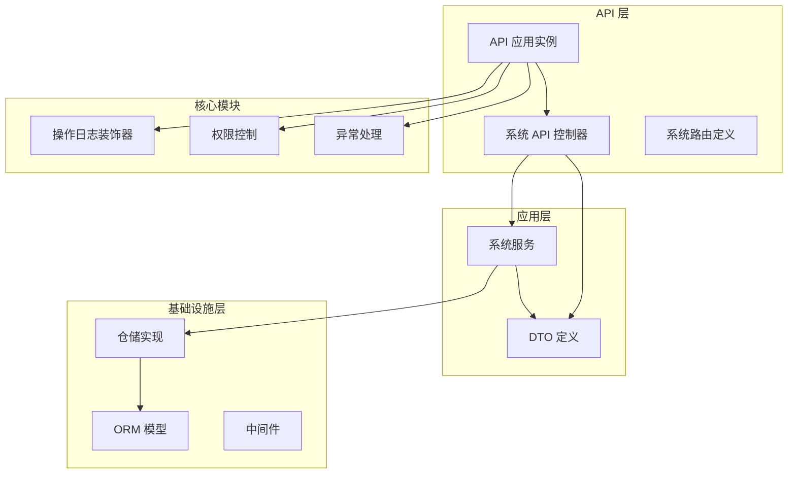
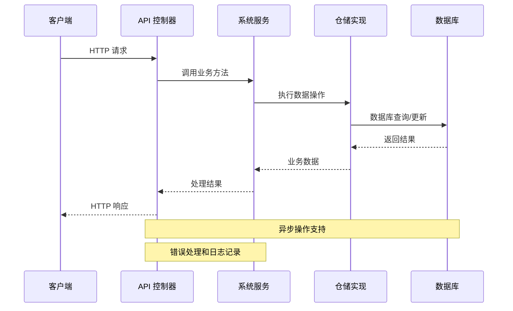
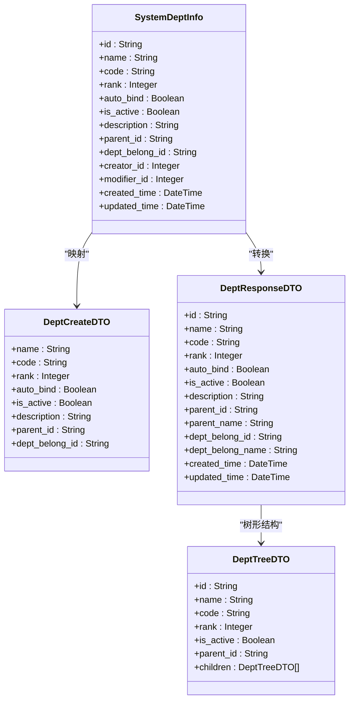
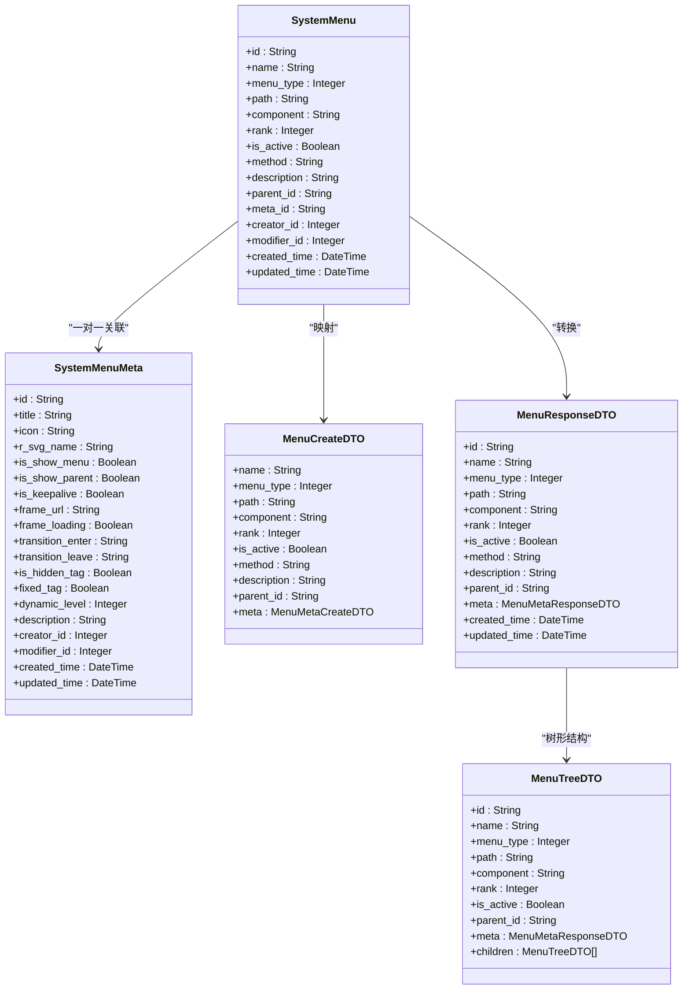
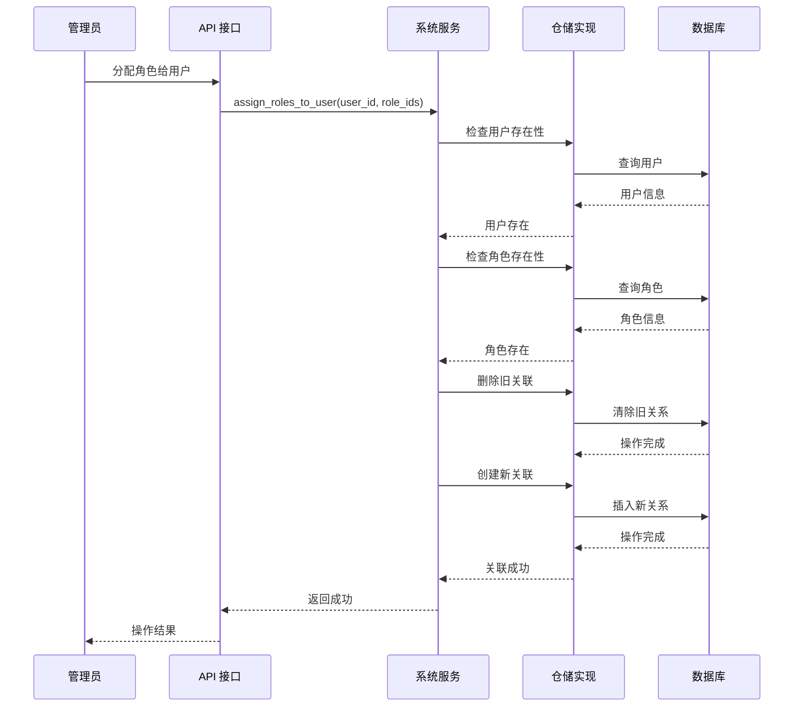
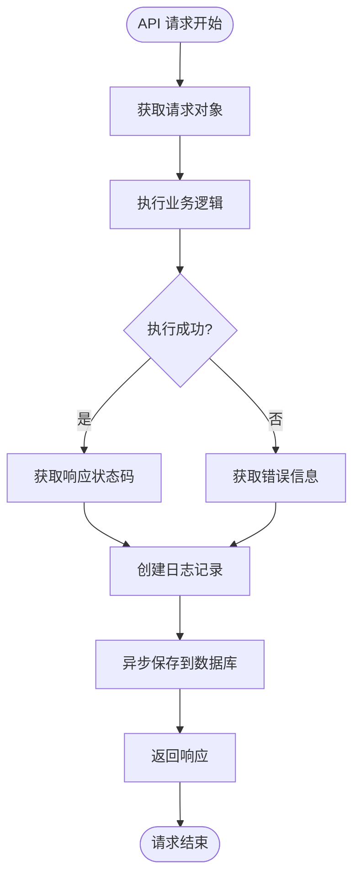
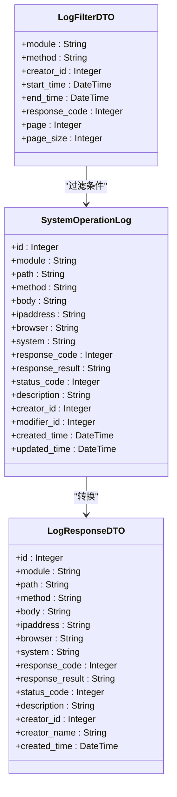
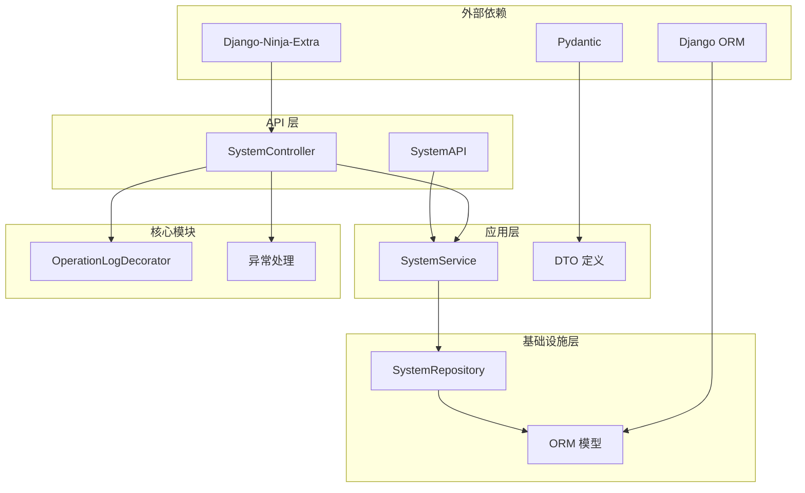
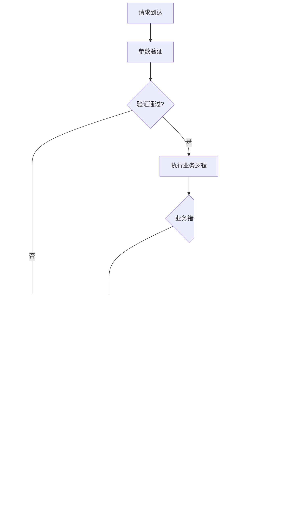

# 系统管理 API

<cite>
**本文档引用的文件**
- [src/api/app.py](file://src/api/app.py)
- [src/api/v1/system_api.py](file://src/api/v1/system_api.py)
- [src/api/v1/controllers/system_controller.py](file://src/api/v1/controllers/system_controller.py)
- [src/application/services/system_service.py](file://src/application/services/system_service.py)
- [src/application/dto/system/dept_dto.py](file://src/application/dto/system/dept_dto.py)
- [src/application/dto/system/menu_dto.py](file://src/application/dto/system/menu_dto.py)
- [src/application/dto/system/log_dto.py](file://src/application/dto/system/log_dto.py)
- [src/application/dto/system/role_dto.py](file://src/application/dto/system/role_dto.py)
- [src/infrastructure/repositories/system_repo_impl.py](file://src/infrastructure/repositories/system_repo_impl.py)
- [src/infrastructure/persistence/models/system_models.py](file://src/infrastructure/persistence/models/system_models.py)
- [src/core/decorators/operation_log.py](file://src/core/decorators/operation_log.py)
</cite>

## 目录
1. [简介](#简介)
2. [项目结构](#项目结构)
3. [核心组件](#核心组件)
4. [架构概览](#架构概览)
5. [详细组件分析](#详细组件分析)
6. [依赖分析](#依赖分析)
7. [性能考虑](#性能考虑)
8. [故障排除指南](#故障排除指南)
9. [结论](#结论)
10. [附录](#附录)

## 简介
本文件详细记录了系统管理 API 的完整规范，涵盖系统配置、部门管理、菜单管理、日志管理等系统级功能接口。该 API 基于 Django-Ninja-Extra 构建，采用清晰的分层架构设计，实现了完整的 RBAC 权限管理和操作审计功能。

系统管理 API 提供了以下核心能力：
- **部门管理**：支持部门的 CRUD 操作、树形结构查询、层级关系管理
- **菜单管理**：支持菜单 CRUD 操作、权限配置、层级关系管理
- **角色管理**：支持角色 CRUD 操作、权限分配、用户角色关联
- **日志管理**：支持操作日志查询、自动记录、审计追踪
- **系统监控**：健康检查、性能监控、异常处理

## 项目结构
系统采用典型的分层架构设计，各层职责明确，耦合度低，便于维护和扩展。

**图表来源**
- [src/api/app.py:17-30](file://src/api/app.py#L17-L30)
- [src/api/v1/system_api.py:25-30](file://src/api/v1/system_api.py#L25-L30)
- [src/application/services/system_service.py:31-32](file://src/application/services/system_service.py#L31-L32)

**章节来源**
- [src/api/app.py:17-30](file://src/api/app.py#L17-L30)
- [src/api/v1/system_api.py:25-30](file://src/api/v1/system_api.py#L25-L30)
- [src/application/services/system_service.py:31-32](file://src/application/services/system_service.py#L31-L32)

## 核心组件
系统管理 API 由多个核心组件构成，每个组件都有明确的职责和边界。

### API 控制器层
- **SystemController**：系统管理的主要入口点，处理所有系统级 API 请求
- **路由定义**：基于装饰器的路由声明，支持多种 HTTP 方法
- **响应模型**：统一的响应格式，包含消息、数据和总数字段

### 应用服务层
- **SystemService**：系统业务逻辑的核心实现
- **DTO 定义**：数据传输对象，确保前后端数据格式一致
- **业务规则验证**：完整的数据验证和业务规则检查

### 基础设施层
- **SystemRepository**：数据访问层，封装数据库操作
- **ORM 模型**：Django ORM 模型定义，映射数据库表结构
- **仓储模式**：实现数据持久化和查询操作

**章节来源**
- [src/api/v1/controllers/system_controller.py:60-78](file://src/api/v1/controllers/system_controller.py#L60-L78)
- [src/application/services/system_service.py:25-32](file://src/application/services/system_service.py#L25-L32)
- [src/infrastructure/repositories/system_repo_impl.py:22-23](file://src/infrastructure/repositories/system_repo_impl.py#L22-L23)

## 架构概览
系统采用分层架构设计，遵循 SOLID 原则，确保代码的可维护性和可扩展性。

**图表来源**
- [src/api/v1/controllers/system_controller.py:113-130](file://src/api/v1/controllers/system_controller.py#L113-L130)
- [src/application/services/system_service.py:36-47](file://src/application/services/system_service.py#L36-L47)
- [src/infrastructure/repositories/system_repo_impl.py:27-43](file://src/infrastructure/repositories/system_repo_impl.py#L27-L43)

## 详细组件分析

### 部门管理接口

#### 接口规范
部门管理提供了完整的 CRUD 操作和树形结构查询功能：

**创建部门**
- **URL**: `POST /v1/system/depts`
- **权限**: 需要相应权限
- **请求体**: 部门创建 DTO
- **响应**: 部门响应 DTO

**获取部门详情**
- **URL**: `GET /v1/system/depts/{dept_id}`
- **权限**: 需要相应权限
- **路径参数**: dept_id (部门ID)
- **响应**: 部门响应 DTO

**更新部门**
- **URL**: `PUT /v1/system/depts/{dept_id}`
- **权限**: 需要相应权限
- **路径参数**: dept_id (部门ID)
- **请求体**: 部门更新 DTO
- **响应**: 部门响应 DTO

**删除部门**
- **URL**: `DELETE /v1/system/depts/{dept_id}`
- **权限**: 需要相应权限
- **路径参数**: dept_id (部门ID)
- **响应**: 成功消息

**获取部门列表**
- **URL**: `GET /v1/system/depts`
- **权限**: 需要相应权限
- **查询参数**: is_active (可选)
- **响应**: 部门列表响应

**获取部门树形结构**
- **URL**: `GET /v1/system/depts/tree`
- **权限**: 需要相应权限
- **响应**: 部门树形结构 DTO 列表

#### 数据模型

**图表来源**
- [src/infrastructure/persistence/models/system_models.py:12-83](file://src/infrastructure/persistence/models/system_models.py#L12-L83)
- [src/application/dto/system/dept_dto.py:11-94](file://src/application/dto/system/dept_dto.py#L11-L94)

#### 业务规则
- **唯一性约束**: 部门编码必须唯一
- **层级关系**: 支持多级父子关系
- **激活状态**: 部门可以启用/禁用
- **删除保护**: 不能删除有子部门或用户的部门

**章节来源**
- [src/api/v1/system_api.py:73-146](file://src/api/v1/system_api.py#L73-L146)
- [src/application/services/system_service.py:36-86](file://src/application/services/system_service.py#L36-L86)
- [src/infrastructure/repositories/system_repo_impl.py:27-118](file://src/infrastructure/repositories/system_repo_impl.py#L27-L118)

### 菜单管理接口

#### 接口规范
菜单管理提供了完整的权限管理功能：

**创建菜单**
- **URL**: `POST /v1/system/menus`
- **权限**: 需要相应权限
- **请求体**: 菜单创建 DTO
- **响应**: 菜单响应 DTO

**获取菜单详情**
- **URL**: `GET /v1/system/menus/{menu_id}`
- **权限**: 需要相应权限
- **路径参数**: menu_id (菜单ID)
- **响应**: 菜单响应 DTO

**更新菜单**
- **URL**: `PUT /v1/system/menus/{menu_id}`
- **权限**: 需要相应权限
- **路径参数**: menu_id (菜单ID)
- **请求体**: 菜单更新 DTO
- **响应**: 菜单响应 DTO

**删除菜单**
- **URL**: `DELETE /v1/system/menus/{menu_id}`
- **权限**: 需要相应权限
- **路径参数**: menu_id (菜单ID)
- **响应**: 成功消息

**获取菜单列表**
- **URL**: `GET /v1/system/menus`
- **权限**: 需要相应权限
- **查询参数**: is_active (可选)
- **响应**: 菜单列表响应

**获取菜单树形结构**
- **URL**: `GET /v1/system/menus/tree`
- **权限**: 需要相应权限
- **响应**: 菜单树形结构 DTO 列表

#### 数据模型

**图表来源**
- [src/infrastructure/persistence/models/system_models.py:141-217](file://src/infrastructure/persistence/models/system_models.py#L141-L217)
- [src/infrastructure/persistence/models/system_models.py:85-139](file://src/infrastructure/persistence/models/system_models.py#L85-L139)
- [src/application/dto/system/menu_dto.py:62-158](file://src/application/dto/system/menu_dto.py#L62-L158)

#### 菜单类型
系统支持三种菜单类型：
- **目录 (0)**: 用于组织菜单的容器
- **菜单 (1)**: 实际的页面菜单
- **按钮 (2)**: 页面上的具体操作按钮

**章节来源**
- [src/api/v1/system_api.py:152-226](file://src/api/v1/system_api.py#L152-L226)
- [src/application/services/system_service.py:147-197](file://src/application/services/system_service.py#L147-L197)
- [src/infrastructure/repositories/system_repo_impl.py:129-255](file://src/infrastructure/repositories/system_repo_impl.py#L129-L255)

### 角色管理接口

#### 接口规范
角色管理提供了完整的权限管理体系：

**创建角色**
- **URL**: `POST /v1/system/roles`
- **权限**: 需要相应权限
- **请求体**: 角色创建 DTO
- **响应**: 角色响应 DTO

**获取角色详情**
- **URL**: `GET /v1/system/roles/{role_id}`
- **权限**: 需要相应权限
- **路径参数**: role_id (角色ID)
- **响应**: 角色响应 DTO

**更新角色**
- **URL**: `PUT /v1/system/roles/{role_id}`
- **权限**: 需要相应权限
- **路径参数**: role_id (角色ID)
- **请求体**: 角色更新 DTO
- **响应**: 角色响应 DTO

**删除角色**
- **URL**: `DELETE /v1/system/roles/{role_id}`
- **权限**: 需要相应权限
- **路径参数**: role_id (角色ID)
- **响应**: 成功消息

**获取角色列表**
- **URL**: `GET /v1/system/roles`
- **权限**: 需要相应权限
- **查询参数**: is_active (可选)
- **响应**: 角色列表响应

**为角色分配菜单权限**
- **URL**: `POST /v1/system/roles/{role_id}/menus`
- **权限**: 需要相应权限
- **路径参数**: role_id (角色ID)
- **请求体**: 角色菜单分配 DTO
- **响应**: 成功消息

**获取角色的菜单列表**
- **URL**: `GET /v1/system/roles/{role_id}/menus`
- **权限**: 需要相应权限
- **路径参数**: role_id (角色ID)
- **响应**: 菜单列表响应

#### 用户角色管理

**图表来源**
- [src/api/v1/system_api.py:325-346](file://src/api/v1/system_api.py#L325-L346)
- [src/application/services/system_service.py:370-386](file://src/application/services/system_service.py#L370-L386)
- [src/infrastructure/repositories/system_repo_impl.py:370-384](file://src/infrastructure/repositories/system_repo_impl.py#L370-L384)

#### 权限计算规则
系统采用多角色权限计算策略：
- **多角色取交集**：用户最终权限 = 各角色权限的交集
- **权限即菜单**：角色权限直接对应菜单权限
- **实时计算**：每次请求时重新计算用户权限

**章节来源**
- [src/api/v1/system_api.py:232-357](file://src/api/v1/system_api.py#L232-L357)
- [src/application/services/system_service.py:272-400](file://src/application/services/system_service.py#L272-L400)
- [src/infrastructure/repositories/system_repo_impl.py:396-428](file://src/infrastructure/repositories/system_repo_impl.py#L396-L428)

### 日志管理接口

#### 接口规范
系统提供了完整的操作日志管理功能：

**获取操作日志列表**
- **URL**: `GET /v1/system/operation-logs`
- **权限**: 需要相应权限
- **查询参数**: 
  - module (模块名称)
  - method (请求方法)
  - creator_id (操作者ID)
  - start_time (开始时间)
  - end_time (结束时间)
  - response_code (响应状态码)
  - page (页码，默认1)
  - page_size (每页数量，默认20)
- **响应**: 操作日志列表响应

**获取操作日志详情**
- **URL**: `GET /v1/system/operation-logs/{log_id}`
- **权限**: 需要相应权限
- **路径参数**: log_id (日志ID)
- **响应**: 操作日志响应 DTO

#### 自动日志记录
系统通过装饰器实现自动日志记录：

**图表来源**
- [src/core/decorators/operation_log.py:31-68](file://src/core/decorators/operation_log.py#L31-L68)
- [src/core/decorators/operation_log.py:75-127](file://src/core/decorators/operation_log.py#L75-L127)

#### 日志数据模型

**图表来源**
- [src/infrastructure/persistence/models/system_models.py:219-271](file://src/infrastructure/persistence/models/system_models.py#L219-L271)
- [src/application/dto/system/log_dto.py:11-57](file://src/application/dto/system/log_dto.py#L11-L57)

**章节来源**
- [src/api/v1/system_api.py:363-408](file://src/api/v1/system_api.py#L363-L408)
- [src/application/services/system_service.py:404-414](file://src/application/services/system_service.py#L404-L414)
- [src/core/decorators/operation_log.py:15-72](file://src/core/decorators/operation_log.py#L15-L72)

## 依赖分析

### 组件依赖关系
系统采用清晰的依赖层次结构，避免循环依赖：

**图表来源**
- [src/api/v1/controllers/system_controller.py:29](file://src/api/v1/controllers/system_controller.py#L29)
- [src/application/services/system_service.py:22](file://src/application/services/system_service.py#L22)
- [src/infrastructure/repositories/system_repo_impl.py:10](file://src/infrastructure/repositories/system_repo_impl.py#L10)

### 数据流分析
系统内部的数据流遵循单向依赖原则：

1. **API 层**接收请求，调用应用服务
2. **应用服务层**执行业务逻辑，调用仓储层
3. **仓储层**进行数据持久化操作
4. **ORM 模型**映射数据库结构
5. **响应**逐层返回到客户端

**章节来源**
- [src/api/v1/controllers/system_controller.py:113-130](file://src/api/v1/controllers/system_controller.py#L113-L130)
- [src/application/services/system_service.py:36-47](file://src/application/services/system_service.py#L36-L47)
- [src/infrastructure/repositories/system_repo_impl.py:27-43](file://src/infrastructure/repositories/system_repo_impl.py#L27-L43)

## 性能考虑
系统在设计时充分考虑了性能优化：

### 数据库优化
- **索引设计**: 关键字段建立数据库索引
- **查询优化**: 使用 select_related 减少 N+1 查询
- **分页机制**: 支持大数据量的分页查询
- **异步操作**: 全面使用异步数据库操作

### 缓存策略
- **响应缓存**: 对静态数据进行缓存
- **查询缓存**: 缓存常用的查询结果
- **连接池**: 数据库连接池管理

### 性能监控
- **慢查询监控**: 记录执行时间过长的操作
- **内存使用监控**: 监控内存使用情况
- **并发控制**: 限制同时处理的请求数量

## 故障排除指南

### 常见错误类型

#### 数据验证错误
- **部门编码重复**: 创建/更新部门时编码冲突
- **菜单名称重复**: 菜单名称唯一性约束
- **角色编码重复**: 角色编码唯一性约束

#### 业务逻辑错误
- **删除保护**: 有子部门或用户的实体无法删除
- **权限不足**: 操作需要更高权限级别
- **资源不存在**: 请求的目标实体不存在

#### 数据库错误
- **连接超时**: 数据库连接异常
- **死锁**: 并发操作导致的死锁
- **事务回滚**: 数据一致性检查失败

### 错误处理机制
系统采用统一的错误处理策略：

**图表来源**
- [src/api/v1/system_api.py:84-122](file://src/api/v1/system_api.py#L84-L122)
- [src/application/services/system_service.py:42-47](file://src/application/services/system_service.py#L42-L47)

### 调试建议
1. **启用详细日志**: 在开发环境启用详细的日志输出
2. **监控数据库**: 使用数据库监控工具跟踪查询性能
3. **测试边界条件**: 测试各种边界条件和异常情况
4. **性能基准测试**: 定期进行性能基准测试

**章节来源**
- [src/api/v1/system_api.py:84-202](file://src/api/v1/system_api.py#L84-L202)
- [src/application/services/system_service.py:42-86](file://src/application/services/system_service.py#L42-L86)

## 结论
系统管理 API 提供了完整的系统级功能接口，具有以下特点：

### 技术优势
- **清晰的分层架构**: 各层职责明确，便于维护和扩展
- **完整的权限体系**: 基于 RBAC 的细粒度权限控制
- **自动审计功能**: 全面的操作日志记录和追踪
- **高性能设计**: 异步操作和数据库优化

### 最佳实践
- **遵循单一职责原则**: 每个组件只负责特定功能
- **使用 DTO 模式**: 确保前后端数据格式一致
- **实施错误处理**: 统一的错误处理和日志记录
- **关注性能优化**: 数据库索引、查询优化、缓存策略

### 安全考虑
- **输入验证**: 严格的参数验证和类型检查
- **权限控制**: 基于角色的访问控制
- **审计追踪**: 完整的操作日志记录
- **数据保护**: 敏感数据的加密和脱敏

## 附录

### API 使用示例
系统提供了完整的 API 使用示例，包括请求格式、响应格式和错误处理。

### 配置选项
系统支持灵活的配置选项，包括数据库连接、缓存设置、日志级别等。

### 扩展指南
系统设计支持功能扩展，包括新增 API 接口、自定义业务逻辑、集成第三方服务等。