# 系统管理接口

<cite>
**本文档引用的文件**
- [system_controller.py](file://src/api/v1/controllers/system_controller.py)
- [system_service.py](file://src/application/services/system_service.py)
- [system_repo_impl.py](file://src/infrastructure/repositories/system_repo_impl.py)
- [system_models.py](file://src/infrastructure/persistence/models/system_models.py)
- [dept_dto.py](file://src/application/dto/system/dept_dto.py)
- [menu_dto.py](file://src/application/dto/system/menu_dto.py)
- [log_dto.py](file://src/application/dto/system/log_dto.py)
- [role_dto.py](file://src/application/dto/system/role_dto.py)
- [operation_log.py](file://src/core/decorators/operation_log.py)
- [request_logging_middleware.py](file://src/core/middlewares/request_logging_middleware.py)
- [permissions.py](file://src/api/common/permissions.py)
- [app.py](file://src/api/app.py)
- [__init__.py](file://src/api/v1/controllers/__init__.py)
- [auth_controller.py](file://src/api/v1/controllers/auth_controller.py)
- [rbac_controller.py](file://src/api/v1/controllers/rbac_controller.py)
- [user_controller.py](file://src/api/v1/controllers/user_controller.py)
- [test_system_api.py](file://tests/test_api/test_system_api.py)
</cite>

## 更新摘要
**所做更改**
- 更新了系统管理API从传统文件结构迁移到控制器架构的描述
- 新增了控制器架构下的系统管理功能说明
- 更新了项目结构图以反映新的控制器组织方式
- 增强了控制器与服务层交互的详细说明
- 补充了依赖注入和构造函数注入的实现细节

## 目录
1. [简介](#简介)
2. [项目结构](#项目结构)
3. [核心组件](#核心组件)
4. [架构概览](#架构概览)
5. [详细组件分析](#详细组件分析)
6. [依赖关系分析](#依赖关系分析)
7. [性能考虑](#性能考虑)
8. [故障排查指南](#故障排查指南)
9. [结论](#结论)

## 简介

Hello-Django-Ninja-Api 是一个基于 Django 和 Ninja 的现代化 Web API 框架，专注于提供完整的系统管理功能。本项目实现了企业级的系统管理接口，包括部门管理、菜单管理、角色管理、操作日志管理等核心功能。

**更新** 系统现已从传统的文件结构迁移到基于 NinjaExtra 的控制器架构。新的控制器架构提供了更清晰的职责分离、更好的可维护性和更强的扩展性。

系统采用分层架构设计，遵循 Clean Architecture 原则，通过 DTO（数据传输对象）、Service（应用服务）、Repository（仓储）和 Model（领域模型）的清晰分离，确保了代码的可维护性和扩展性。

## 项目结构

**更新** 项目采用模块化的控制器组织方式，按照功能域和层次结构进行划分：

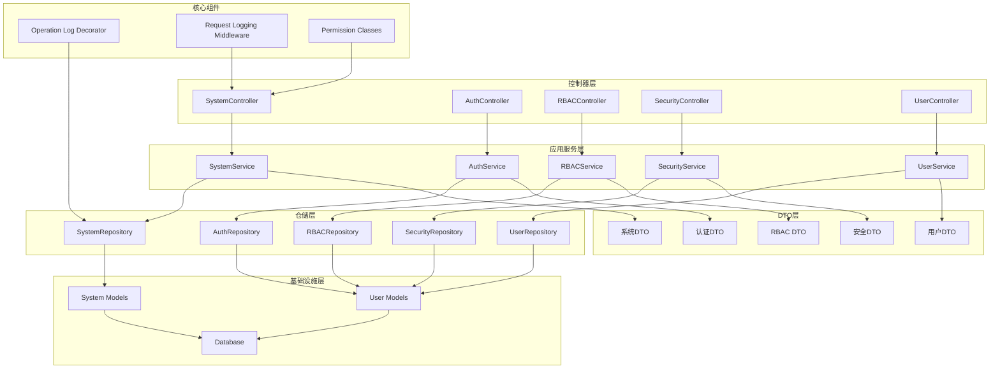

**图表来源**
- [system_controller.py:60-572](file://src/api/v1/controllers/system_controller.py#L60-L572)
- [app.py:8-16](file://src/api/app.py#L8-L16)
- [__init__.py:6-12](file://src/api/v1/controllers/__init__.py#L6-L12)

**章节来源**
- [system_controller.py:60-572](file://src/api/v1/controllers/system_controller.py#L60-L572)
- [app.py:8-16](file://src/api/app.py#L8-L16)
- [__init__.py:6-12](file://src/api/v1/controllers/__init__.py#L6-L12)

## 核心组件

### 系统管理控制器

**更新** 系统管理控制器是 API 的入口点，负责处理所有系统管理相关的 HTTP 请求。它采用 NinjaExtra 的 `@api_controller` 装饰器，提供了更丰富的 API 功能和更好的依赖注入支持。

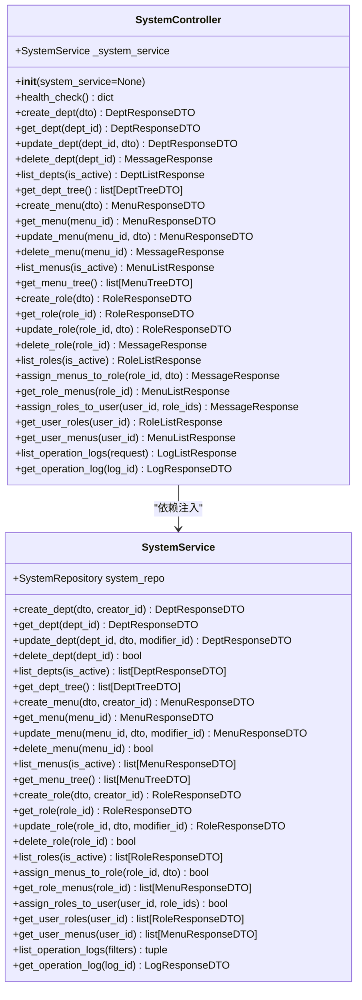

**图表来源**
- [system_controller.py:71-78](file://src/api/v1/controllers/system_controller.py#L71-L78)
- [system_service.py:31-32](file://src/application/services/system_service.py#L31-L32)

### 控制器架构特性

**新增** 系统控制器架构具有以下关键特性：

1. **依赖注入**: 通过构造函数注入 SystemService 实例，支持可选参数用于测试和依赖替换
2. **统一装饰器**: 使用 `@api_controller` 装饰器统一管理路由前缀和标签
3. **异步支持**: 所有控制器方法都支持异步操作，提升并发性能
4. **类型注解**: 完整的类型注解确保代码的可读性和IDE支持
5. **错误处理**: 统一的异常处理机制，提供清晰的错误信息

### 数据传输对象 (DTO)

系统使用 Pydantic 定义了完整的数据传输对象，确保了数据验证和序列化的一致性：

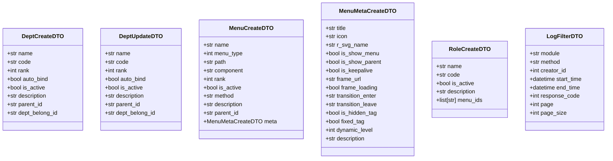

**图表来源**
- [dept_dto.py:11-94](file://src/application/dto/system/dept_dto.py#L11-L94)
- [menu_dto.py:62-158](file://src/application/dto/system/menu_dto.py#L62-L158)
- [role_dto.py:11-76](file://src/application/dto/system/role_dto.py#L11-L76)
- [log_dto.py:34-57](file://src/application/dto/system/log_dto.py#L34-L57)

**章节来源**
- [system_controller.py:60-572](file://src/api/v1/controllers/system_controller.py#L60-L572)
- [system_service.py:25-423](file://src/application/services/system_service.py#L25-L423)
- [dept_dto.py:1-94](file://src/application/dto/system/dept_dto.py#L1-L94)
- [menu_dto.py:1-158](file://src/application/dto/system/menu_dto.py#L1-L158)
- [role_dto.py:1-76](file://src/application/dto/system/role_dto.py#L1-L76)
- [log_dto.py:1-57](file://src/application/dto/system/log_dto.py#L1-L57)

## 架构概览

**更新** 系统采用基于控制器的分层架构设计，确保了关注点分离和代码的可维护性：

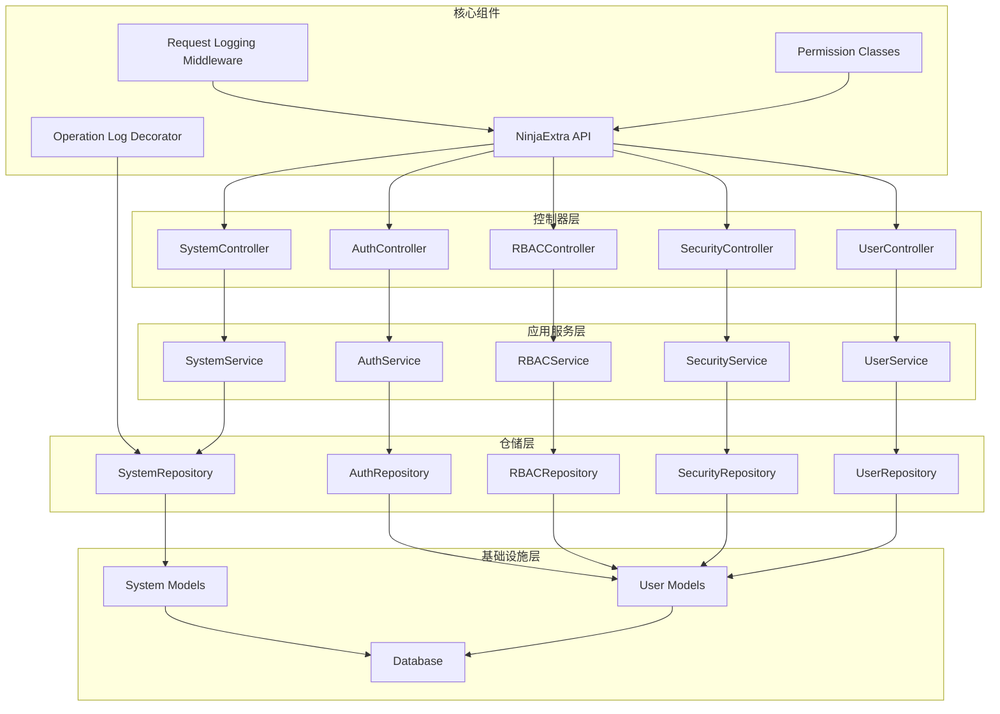

**图表来源**
- [app.py:11-16](file://src/api/app.py#L11-L16)
- [system_controller.py:60-61](file://src/api/v1/controllers/system_controller.py#L60-L61)
- [auth_controller.py:16-17](file://src/api/v1/controllers/auth_controller.py#L16-L17)
- [rbac_controller.py:31-32](file://src/api/v1/controllers/rbac_controller.py#L31-L32)

### 数据模型关系

系统的核心数据模型通过外键关系建立了紧密的关联：

```mermaid
erDiagram
SYSTEM_DEPTINFO {
char id PK
char name
char code UK
int rank
bool is_active
char description
char parent_id FK
char dept_belong_id FK
char creator_id FK
char modifier_id FK
datetime created_time
datetime updated_time
}
SYSTEM_MENU {
char id PK
char name UK
smallint menu_type
char path
char component
int rank
bool is_active
char method
char description
char parent_id FK
char meta_id UK FK
char creator_id FK
char modifier_id FK
datetime created_time
datetime updated_time
}
SYSTEM_MENUMETA {
char id PK
char title
char icon
char r_svg_name
bool is_show_menu
bool is_show_parent
bool is_keepalive
varchar frame_url
bool frame_loading
char transition_enter
char transition_leave
bool is_hidden_tag
bool fixed_tag
int dynamic_level
char description
char creator_id FK
char modifier_id FK
datetime created_time
datetime updated_time
}
SYSTEM_OPERATIONLOG {
bigint id PK
char module
char path
char method
text body
char ipaddress
char browser
char system
int response_code
text response_result
int status_code
char description
char creator_id FK
char modifier_id FK
datetime created_time
datetime updated_time
}
SYSTEM_USERROLE {
char id PK
char name UK
char code UK
bool is_active
char description
char creator_id FK
char modifier_id FK
datetime created_time
datetime updated_time
}
SYSTEM_USERROLEMENU {
bigint id PK
char userrole_id FK
char menu_id FK
}
SYSTEM_USERINFO_ROLES {
bigint id PK
int userinfo_id FK
char userrole_id FK
}
USER {
int id PK
char username UK
char email UK
char password
bool is_active
datetime created_time
datetime updated_time
}
SYSTEM_DEPTINFO }o--|| SYSTEM_DEPTINFO : "parent/children"
SYSTEM_DEPTINFO }o--|| USER : "creator/modifier"
SYSTEM_MENU }o--|| SYSTEM_MENUMETA : "meta"
SYSTEM_MENU }o--|| SYSTEM_MENU : "parent/children"
SYSTEM_MENU }o--|| USER : "creator/modifier"
SYSTEM_OPERATIONLOG }o--|| USER : "creator/modifier"
SYSTEM_USERROLE }o--|| USER : "creator/modifier"
SYSTEM_USERROLEMENU }o--|| SYSTEM_USERROLE : "userrole"
SYSTEM_USERROLEMENU }o--|| SYSTEM_MENU : "menu"
SYSTEM_USERINFO_ROLES }o--|| USER : "userinfo"
SYSTEM_USERINFO_ROLES }o--|| SYSTEM_USERROLE : "userrole"
```

**图表来源**
- [system_models.py:12-395](file://src/infrastructure/persistence/models/system_models.py#L12-L395)

**章节来源**
- [system_models.py:1-395](file://src/infrastructure/persistence/models/system_models.py#L1-L395)

## 详细组件分析

### 部门管理系统

部门管理是组织架构的基础，支持树形结构管理和层级关系维护。

#### 部门操作流程

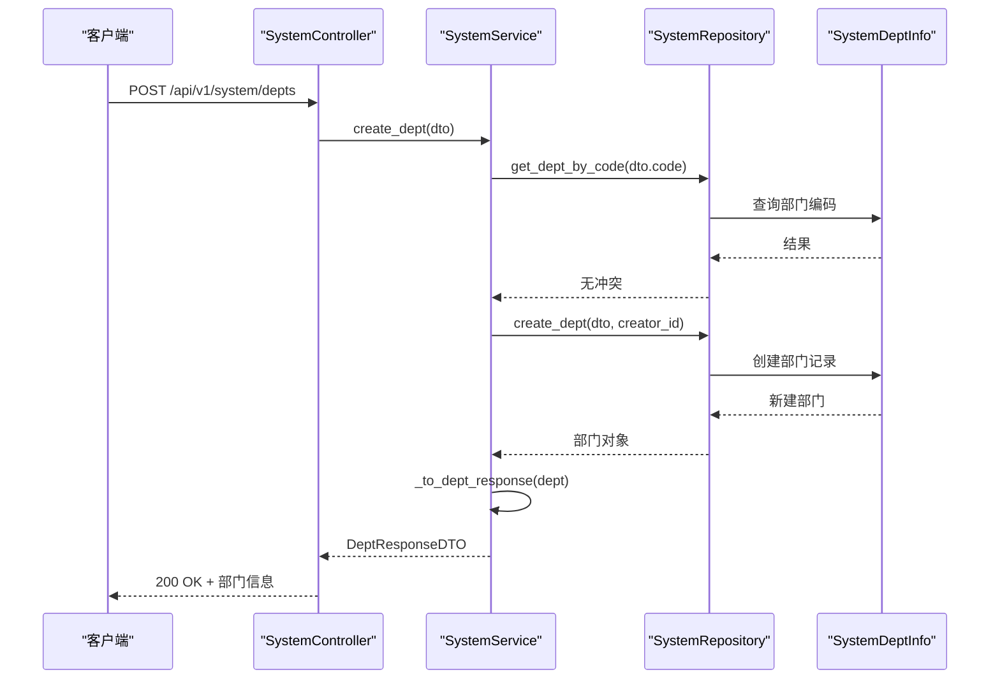

**图表来源**
- [system_controller.py:97-115](file://src/api/v1/controllers/system_controller.py#L97-L115)
- [system_service.py:36-47](file://src/application/services/system_service.py#L36-L47)
- [system_repo_impl.py:27-43](file://src/infrastructure/repositories/system_repo_impl.py#L27-L43)

#### 部门树形结构构建

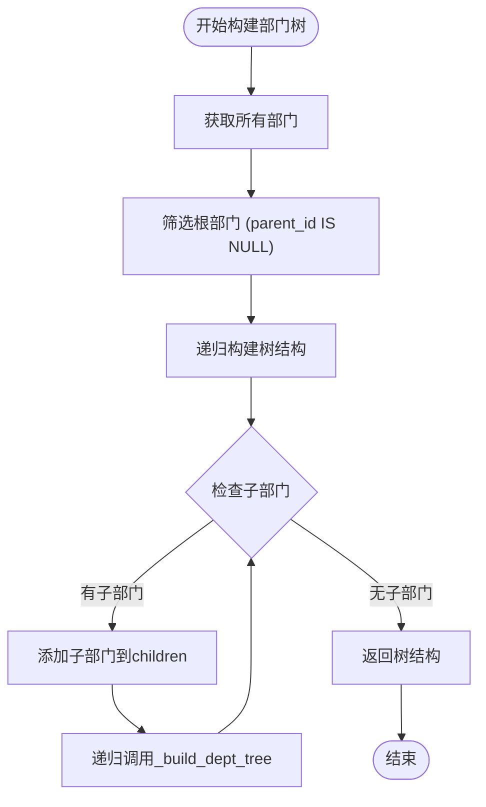

**图表来源**
- [system_service.py:94-111](file://src/application/services/system_service.py#L94-L111)

**章节来源**
- [system_controller.py:97-205](file://src/api/v1/controllers/system_controller.py#L97-L205)
- [system_service.py:36-140](file://src/application/services/system_service.py#L36-L140)
- [system_repo_impl.py:27-125](file://src/infrastructure/repositories/system_repo_impl.py#L27-L125)

### 菜单权限管理系统

菜单权限系统实现了基于 RBAC 的权限控制，支持复杂的权限继承和组合。

#### 菜单权限分配流程

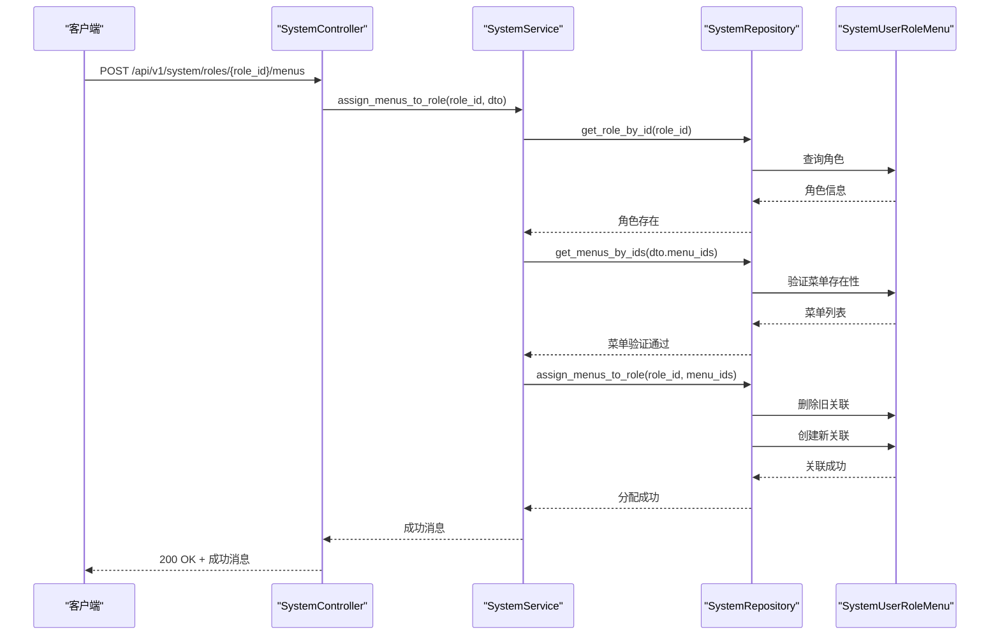

**图表来源**
- [system_controller.py:419-438](file://src/api/v1/controllers/system_controller.py#L419-L438)
- [system_service.py:349-361](file://src/application/services/system_service.py#L349-L361)
- [system_repo_impl.py:343-356](file://src/infrastructure/repositories/system_repo_impl.py#L343-L356)

#### 用户权限计算算法

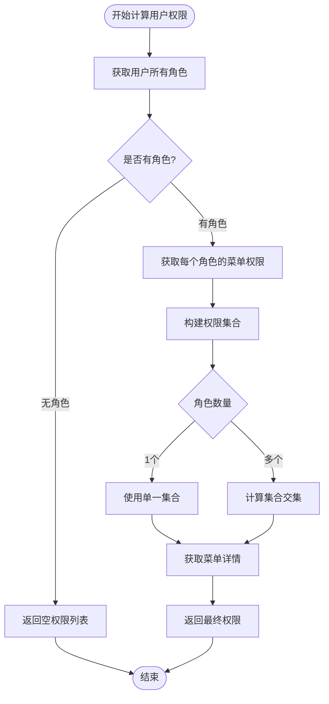

**图表来源**
- [system_service.py:404-407](file://src/application/services/system_service.py#L404-L407)
- [system_repo_impl.py:396-428](file://src/infrastructure/repositories/system_repo_impl.py#L396-L428)

**章节来源**
- [system_controller.py:209-318](file://src/api/v1/controllers/system_controller.py#L209-L318)
- [system_service.py:147-407](file://src/application/services/system_service.py#L147-L407)
- [system_repo_impl.py:129-428](file://src/infrastructure/repositories/system_repo_impl.py#L129-L428)

### 操作日志管理系统

操作日志系统提供了完整的审计跟踪功能，支持多维度的查询和过滤。

#### 日志记录流程

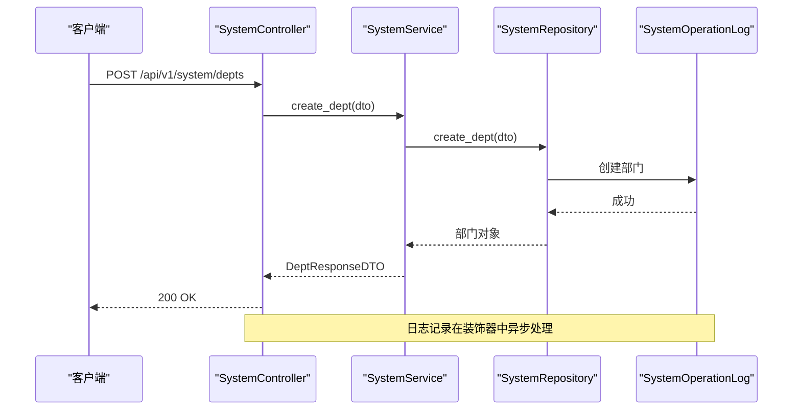

**图表来源**
- [operation_log.py:29-72](file://src/core/decorators/operation_log.py#L29-L72)
- [system_service.py:36-47](file://src/application/services/system_service.py#L36-L47)
- [system_repo_impl.py:432-463](file://src/infrastructure/repositories/system_repo_impl.py#L432-L463)

#### 日志查询和过滤

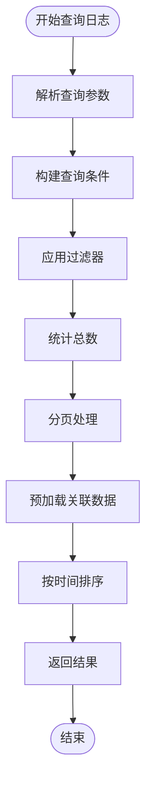

**图表来源**
- [system_controller.py:514-550](file://src/api/v1/controllers/system_controller.py#L514-L550)
- [system_repo_impl.py:465-497](file://src/infrastructure/repositories/system_repo_impl.py#L465-L497)

**章节来源**
- [operation_log.py:1-175](file://src/core/decorators/operation_log.py#L1-L175)
- [system_controller.py:514-572](file://src/api/v1/controllers/system_controller.py#L514-L572)
- [system_service.py:411-423](file://src/application/services/system_service.py#L411-L423)
- [system_repo_impl.py:432-505](file://src/infrastructure/repositories/system_repo_impl.py#L432-L505)

### 权限控制系统

系统集成了基于 JWT 的认证和基于 RBAC 的授权机制。

#### 权限检查流程

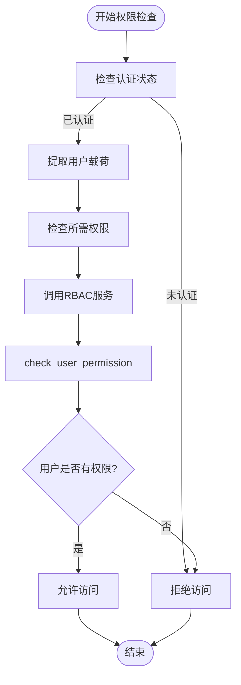

**图表来源**
- [permissions.py:103-120](file://src/api/common/permissions.py#L103-L120)

**章节来源**
- [permissions.py:1-244](file://src/api/common/permissions.py#L1-L244)

## 依赖关系分析

**更新** 系统采用基于控制器的松耦合设计，各层之间的依赖关系清晰明确：

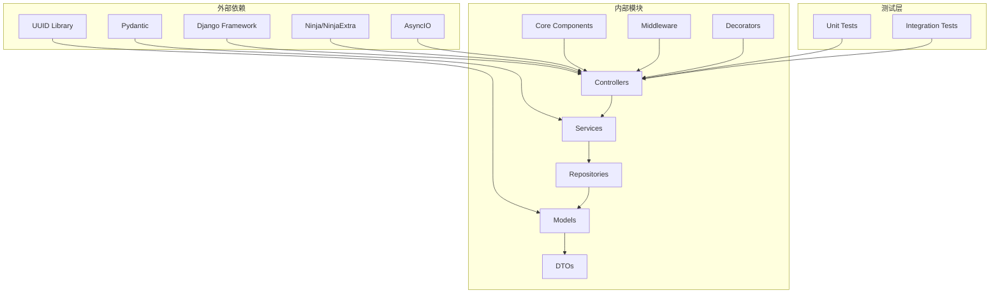

**图表来源**
- [app.py:6-13](file://src/api/app.py#L6-L13)
- [system_controller.py:29](file://src/api/v1/controllers/system_controller.py#L29)
- [system_service.py:6-22](file://src/application/services/system_service.py#L6-L22)

### 数据流分析

**更新** 系统的关键数据流展示了从 API 请求到数据库存储的完整过程：

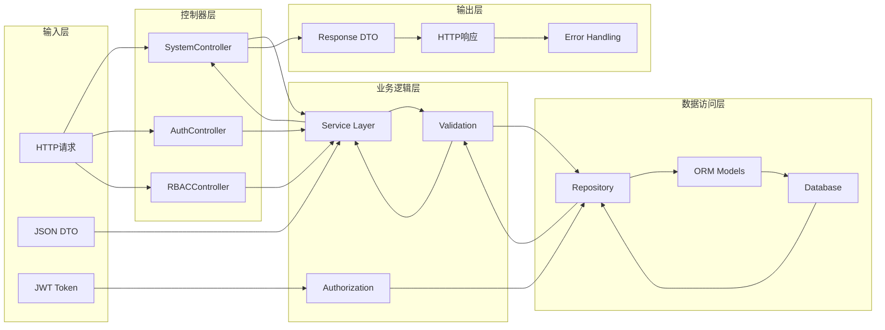

**图表来源**
- [system_controller.py:71-78](file://src/api/v1/controllers/system_controller.py#L71-L78)
- [system_service.py:31-32](file://src/application/services/system_service.py#L31-L32)

**章节来源**
- [app.py:1-29](file://src/api/app.py#L1-L29)
- [system_controller.py:60-572](file://src/api/v1/controllers/system_controller.py#L60-L572)
- [system_service.py:1-423](file://src/application/services/system_service.py#L1-L423)
- [system_repo_impl.py:1-445](file://src/infrastructure/repositories/system_repo_impl.py#L1-L445)

## 性能考虑

**更新** 系统在设计时充分考虑了性能优化，采用了多种策略来提升响应速度和吞吐量：

### 控制器架构优化
- **依赖注入**: 通过构造函数注入减少对象创建开销
- **异步处理**: 所有控制器方法支持异步操作，提升并发性能
- **类型注解**: 完整的类型注解支持更好的IDE性能和编译优化

### 缓存策略
- 使用 UUID 作为主键，避免了序列号带来的热点问题
- 合理的数据库索引设计，支持高频查询场景
- 预加载关联数据，减少 N+1 查询问题

### 查询优化
- 分页查询支持，防止大数据量查询导致的性能问题
- 条件过滤优化，只查询必要的字段
- 关联查询优化，使用 select_related 预加载

### 异步处理
- 所有数据库操作采用异步模式
- 日志记录异步执行，不影响主业务流程
- 权限检查异步处理

## 故障排查指南

### 常见问题诊断

#### 控制器架构问题
- **问题**: 控制器方法无法接收参数
  - **原因**: 类型注解不正确或依赖注入失败
  - **解决方案**: 检查构造函数注入和类型注解

- **问题**: 依赖注入不生效
  - **原因**: 未正确配置 NinjaExtra API 注册
  - **解决方案**: 确认在 app.py 中正确注册控制器

#### 部门管理问题
- **问题**: 创建部门时报错"部门编码已存在"
  - **原因**: 部门编码重复
  - **解决方案**: 修改部门编码或删除重复记录

- **问题**: 删除部门失败
  - **原因**: 部门下存在子部门或用户
  - **解决方案**: 先删除子部门和用户，再删除父部门

#### 菜单权限问题
- **问题**: 分配菜单权限失败
  - **原因**: 角色不存在或部分菜单不存在
  - **解决方案**: 检查角色ID和菜单ID的有效性

- **问题**: 用户权限不正确
  - **原因**: 多角色权限计算错误
  - **解决方案**: 检查角色权限分配，确认权限交集逻辑

#### 日志系统问题
- **问题**: 操作日志未记录
  - **原因**: 装饰器配置错误或异步日志失败
  - **解决方案**: 检查 operation_log 装饰器配置

**章节来源**
- [system_controller.py:71-78](file://src/api/v1/controllers/system_controller.py#L71-L78)
- [system_service.py:40-47](file://src/application/services/system_service.py#L40-L47)
- [system_service.py:74-86](file://src/application/services/system_service.py#L74-L86)
- [operation_log.py:54-62](file://src/core/decorators/operation_log.py#L54-L62)

### 调试技巧

1. **启用详细日志**: 在开发环境中启用 Django 的详细日志记录
2. **使用调试工具**: 利用 Django Debug Toolbar 分析查询性能
3. **单元测试**: 编写完整的单元测试覆盖边界条件
4. **集成测试**: 使用 Postman 或 curl 进行 API 集成测试

**章节来源**
- [test_system_api.py:1-501](file://tests/test_api/test_system_api.py#L1-L501)

## 结论

Hello-Django-Ninja-Api 提供了一个完整的企业级系统管理解决方案，具有以下特点：

### 技术优势
- **架构清晰**: 采用基于控制器的分层架构，职责分离明确
- **扩展性强**: 模块化设计便于功能扩展
- **性能优秀**: 异步处理和查询优化确保高并发性能
- **安全可靠**: 完整的权限控制和审计日志系统
- **依赖注入**: 支持可选的依赖注入，便于测试和维护

### 功能完整性
- 覆盖了企业系统管理的核心需求
- 支持复杂的组织架构和权限模型
- 提供完整的审计和监控能力
- 具备良好的可维护性和可测试性

### 最佳实践
- 遵循 Clean Architecture 设计原则
- 使用 DTO 模式确保数据一致性
- 实现异步处理提升性能
- 建立完善的测试体系

**更新** 新的控制器架构为现代 Web 应用提供了更加现代化和可维护的技术基础，适合各种规模的企业级应用场景。

该系统为现代 Web 应用提供了坚实的技术基础，适合各种规模的企业级应用场景。