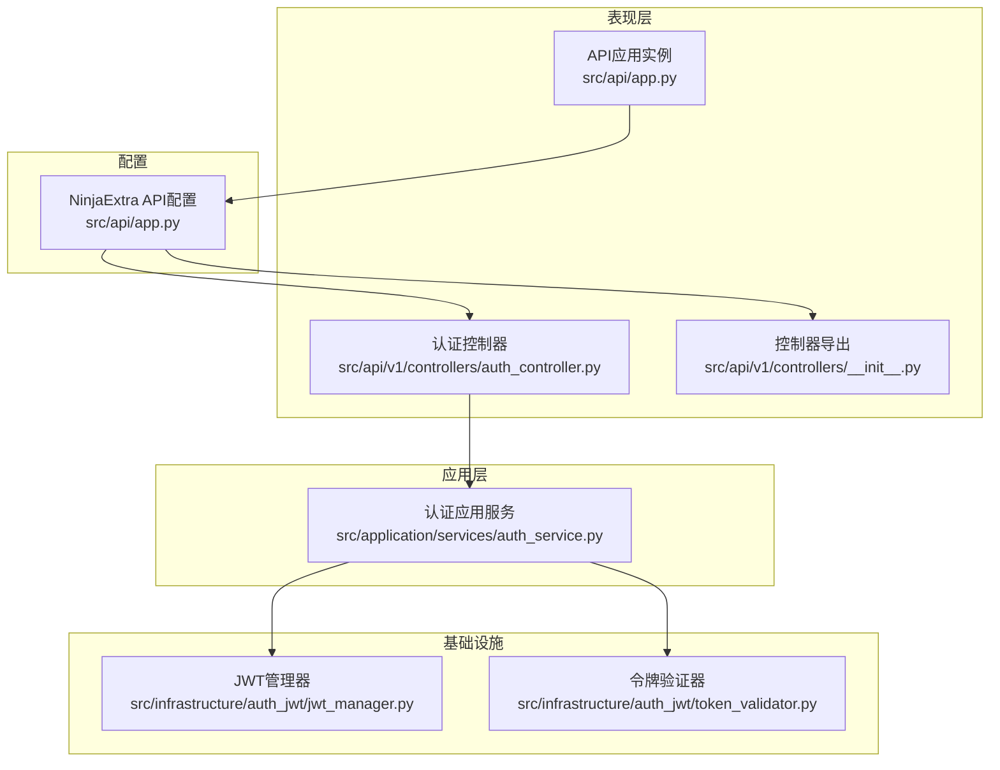
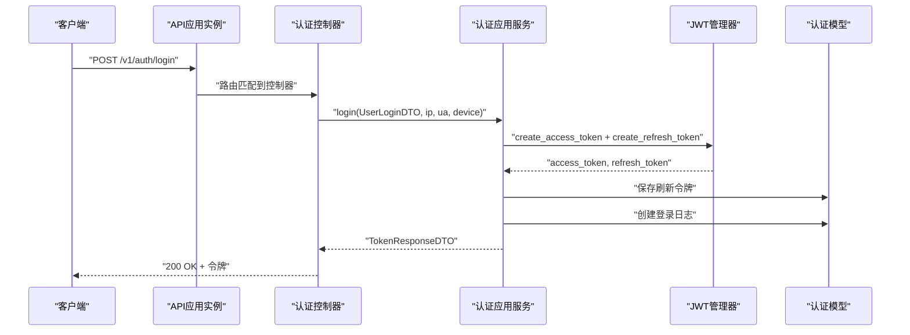
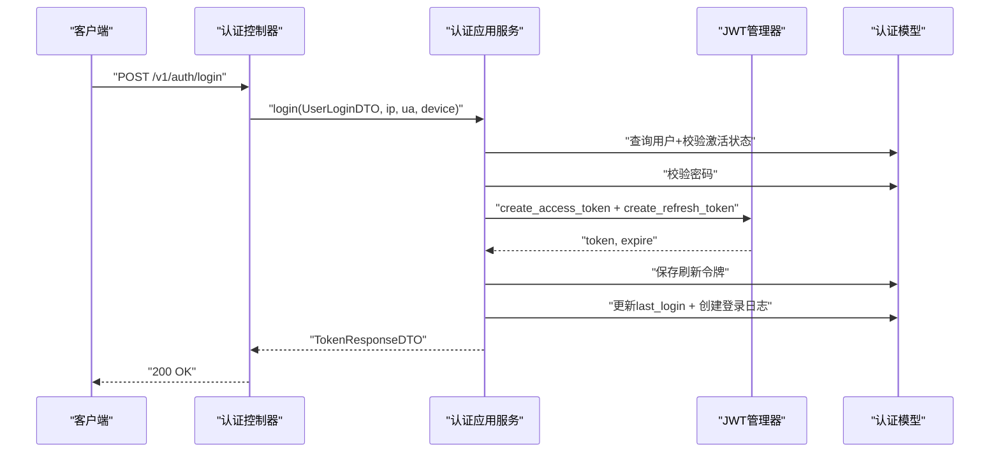
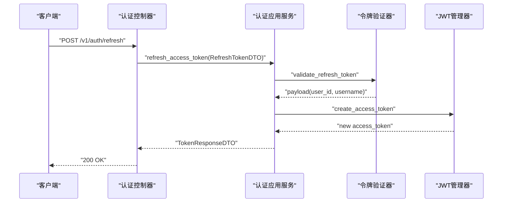
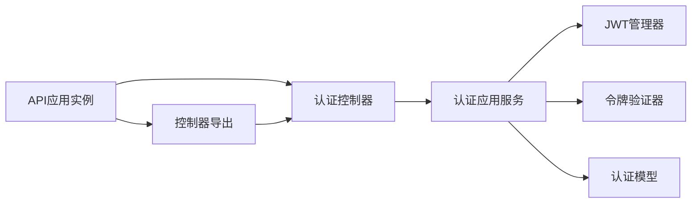

# 认证接口

<cite>
**本文引用的文件**
- [src/api/app.py](file://src/api/app.py)
- [src/api/v1/controllers/auth_controller.py](file://src/api/v1/controllers/auth_controller.py)
- [src/api/v1/controllers/__init__.py](file://src/api/v1/controllers/__init__.py)
- [src/application/services/auth_service.py](file://src/application/services/auth_service.py)
- [src/application/dto/auth/token_response_dto.py](file://src/application/dto/auth/token_response_dto.py)
- [src/application/dto/auth/refresh_token_dto.py](file://src/application/dto/auth/refresh_token_dto.py)
- [src/application/dto/user/user_login_dto.py](file://src/application/dto/user/user_login_dto.py)
- [src/api/common/responses.py](file://src/api/common/responses.py)
</cite>

## 更新摘要
**所做更改**
- 更新了认证控制器架构，从独立API文件迁移到基于@api_controller装饰器的控制器模式
- 新增了依赖注入机制，支持构造函数注入AuthService实例
- 更新了路由注册方式，通过NinjaExtraAPI.register_controllers统一注册
- 重构了认证接口的实现结构，提供更好的代码组织和维护性

## 目录
1. [简介](#简介)
2. [项目结构](#项目结构)
3. [核心组件](#核心组件)
4. [架构总览](#架构总览)
5. [详细组件分析](#详细组件分析)
6. [依赖分析](#依赖分析)
7. [性能考量](#性能考量)
8. [故障排查指南](#故障排查指南)
9. [结论](#结论)
10. [附录](#附录)

## 简介
本文件为认证接口组的详细 API 文档，覆盖用户登录、令牌刷新、用户登出等核心认证能力。文档说明每个端点的 HTTP 方法、URL 路径、请求参数、响应格式与错误处理；阐述 JWT 令牌生成与验证流程、设备信息采集、登录日志记录等实现细节；提供典型认证场景的请求与响应示例；解释认证中间件工作原理与安全考虑；并说明令牌过期处理、刷新令牌机制与登出流程的技术实现。

**更新** 认证系统现已从传统的独立API文件架构迁移到基于NinjaExtra框架的控制器架构，采用@api_controller装饰器提供更好的依赖注入和错误处理机制。

## 项目结构
认证相关代码采用分层架构组织，现已迁移到控制器架构：
- 表现层：NinjaExtra控制器，使用@api_controller装饰器，负责接收请求、解析DTO、调用应用服务并返回响应。
- 应用层：认证应用服务，封装业务逻辑（登录、刷新、登出、校验）。
- 领域层：JWT管理器与令牌验证器，处理令牌生命周期与撤销等核心业务规则。
- 基础设施层：认证模型（刷新令牌、黑名单、登录日志），支持刷新令牌持久化与审计。
- 配置层：NinjaExtra API实例，负责控制器注册和路由管理。

**图表来源**
- [src/api/app.py:1-29](file://src/api/app.py#L1-L29)
- [src/api/v1/controllers/auth_controller.py:1-100](file://src/api/v1/controllers/auth_controller.py#L1-L100)
- [src/api/v1/controllers/__init__.py:1-13](file://src/api/v1/controllers/__init__.py#L1-L13)
- [src/application/services/auth_service.py:1-180](file://src/application/services/auth_service.py#L1-L180)

**章节来源**
- [src/api/app.py:1-29](file://src/api/app.py#L1-L29)
- [src/api/v1/controllers/auth_controller.py:1-100](file://src/api/v1/controllers/auth_controller.py#L1-L100)
- [src/api/v1/controllers/__init__.py:1-13](file://src/api/v1/controllers/__init__.py#L1-L13)
- [src/application/services/auth_service.py:1-180](file://src/application/services/auth_service.py#L1-L180)

## 核心组件
- **认证控制器**：使用@api_controller装饰器，提供/v1/auth路径下的认证API，支持依赖注入和更好的错误处理。
- **认证应用服务**：封装登录校验、令牌签发、刷新令牌验证、登出撤销与缓存清理、登录日志记录等。
- **JWT管理器**：负责访问令牌与刷新令牌的生成、解码、过期判断与载荷提取。
- **令牌验证器**：负责访问令牌有效性校验、刷新令牌校验、黑名单检查与令牌撤销。
- **认证模型**：持久化刷新令牌、黑名单与登录日志，支持按用户与JTI查询索引。
- **DTO**：定义登录、刷新令牌与响应的结构与示例。
- **统一响应**：MessageResponse类，保证错误与消息格式一致性。

**更新** 控制器架构提供了更好的代码组织和依赖注入支持，通过构造函数注入AuthService实例，支持测试和扩展。

**章节来源**
- [src/api/v1/controllers/auth_controller.py:16-100](file://src/api/v1/controllers/auth_controller.py#L16-L100)
- [src/application/services/auth_service.py:20-180](file://src/application/services/auth_service.py#L20-L180)
- [src/application/dto/auth/token_response_dto.py:9-32](file://src/application/dto/auth/token_response_dto.py#L9-L32)
- [src/application/dto/auth/refresh_token_dto.py:9-20](file://src/application/dto/auth/refresh_token_dto.py#L9-L20)
- [src/application/dto/user/user_login_dto.py:9-22](file://src/application/dto/user/user_login_dto.py#L9-L22)
- [src/api/common/responses.py:13-105](file://src/api/common/responses.py#L13-L105)

## 架构总览
认证系统遵循"请求—控制器—应用服务—基础设施—持久化"的分层设计。控制器作为表现层入口，通过依赖注入获取AuthService实例；应用服务协调JWT管理器、令牌验证器与持久化层，完成完整的认证业务流程。

**图表来源**
- [src/api/app.py:11-16](file://src/api/app.py#L11-L16)
- [src/api/v1/controllers/auth_controller.py:36-61](file://src/api/v1/controllers/auth_controller.py#L36-L61)
- [src/application/services/auth_service.py:26-88](file://src/application/services/auth_service.py#L26-L88)

## 详细组件分析

### 登录接口
- **端点**：POST /v1/auth/login
- **请求体**：UserLoginDTO（用户名、密码、设备信息）
- **响应体**：TokenResponseDTO（访问令牌、刷新令牌、令牌类型、过期秒数、用户信息）
- **流程要点**：
  - 控制器从请求头提取客户端IP与UA，并结合设备信息传入应用服务。
  - 应用服务查询用户、校验激活状态与密码，失败则记录登录日志并抛出错误。
  - 成功后生成访问令牌与刷新令牌，保存刷新令牌到数据库，更新用户最后登录时间，记录登录日志。
  - 读取配置中的访问令牌有效期，计算expires_in（秒）返回给客户端。
- **典型响应示例**：见TokenResponseDTO示例

**图表来源**
- [src/api/v1/controllers/auth_controller.py:36-61](file://src/api/v1/controllers/auth_controller.py#L36-L61)
- [src/application/services/auth_service.py:26-88](file://src/application/services/auth_service.py#L26-L88)

**章节来源**
- [src/api/v1/controllers/auth_controller.py:36-61](file://src/api/v1/controllers/auth_controller.py#L36-L61)
- [src/application/services/auth_service.py:26-88](file://src/application/services/auth_service.py#L26-L88)
- [src/application/dto/user/user_login_dto.py:9-22](file://src/application/dto/user/user_login_dto.py#L9-L22)
- [src/application/dto/auth/token_response_dto.py:9-32](file://src/application/dto/auth/token_response_dto.py#L9-L32)

### 刷新令牌接口
- **端点**：POST /v1/auth/refresh
- **请求体**：RefreshTokenDTO（刷新令牌）
- **响应体**：TokenResponseDTO（仅返回新的访问令牌与过期秒数，刷新令牌字段为空）
- **流程要点**：
  - 应用服务调用令牌验证器对刷新令牌进行校验，失败则抛出错误。
  - 校验通过后根据payload中的用户标识重新生成访问令牌，读取配置中的访问令牌有效期，返回响应。
- **典型响应示例**：见TokenResponseDTO示例

**图表来源**
- [src/api/v1/controllers/auth_controller.py:63-80](file://src/api/v1/controllers/auth_controller.py#L63-L80)
- [src/application/services/auth_service.py:90-126](file://src/application/services/auth_service.py#L90-L126)

**章节来源**
- [src/api/v1/controllers/auth_controller.py:63-80](file://src/api/v1/controllers/auth_controller.py#L63-L80)
- [src/application/services/auth_service.py:90-126](file://src/application/services/auth_service.py#L90-L126)
- [src/application/dto/auth/refresh_token_dto.py:9-20](file://src/application/dto/auth/refresh_token_dto.py#L9-L20)
- [src/application/dto/auth/token_response_dto.py:9-32](file://src/application/dto/auth/token_response_dto.py#L9-L32)

### 登出接口
- **端点**：POST /v1/auth/logout
- **请求头**：Authorization: Bearer <访问令牌>
- **响应体**：MessageResponse（登出成功消息）
- **流程要点**：
  - 控制器从Authorization头提取访问令牌，调用应用服务执行登出。
  - 应用服务调用令牌验证器撤销访问令牌（加入黑名单），随后清理用户相关缓存（角色、权限、用户信息）。
  - 不论是否传入令牌，均返回"登出成功"消息。
- **典型响应示例**：见MessageResponse示例

**图表来源**
- [src/api/v1/controllers/auth_controller.py:82-99](file://src/api/v1/controllers/auth_controller.py#L82-L99)
- [src/application/services/auth_service.py:128-144](file://src/application/services/auth_service.py#L128-L144)

**章节来源**
- [src/api/v1/controllers/auth_controller.py:82-99](file://src/api/v1/controllers/auth_controller.py#L82-L99)
- [src/application/services/auth_service.py:128-144](file://src/application/services/auth_service.py#L128-L144)
- [src/api/common/responses.py:13-105](file://src/api/common/responses.py#L13-L105)

### 控制器架构与依赖注入
- **控制器装饰器**：使用@api_controller装饰器，提供路径前缀"/v1/auth"和标签"认证"。
- **依赖注入**：通过构造函数注入AuthService实例，支持可选参数以便于测试和扩展。
- **路由注册**：通过NinjaExtraAPI.register_controllers统一注册，简化路由配置。
- **异步支持**：所有控制器方法均使用async def定义，支持异步操作。

**更新** 新的控制器架构提供了更好的代码组织、依赖管理和测试支持。

**章节来源**
- [src/api/v1/controllers/auth_controller.py:16-35](file://src/api/v1/controllers/auth_controller.py#L16-L35)
- [src/api/app.py:15-16](file://src/api/app.py#L15-L16)
- [src/api/v1/controllers/__init__.py:6-12](file://src/api/v1/controllers/__init__.py#L6-L12)

## 依赖分析
- **控制器依赖**：认证控制器依赖AuthService，通过构造函数注入实现依赖倒置。
- **应用服务依赖**：AuthService依赖JWT管理器、令牌验证器、RBAC仓库与缓存管理器、认证模型。
- **API实例依赖**：NinjaExtraAPI实例依赖所有控制器类，通过register_controllers统一注册。
- **DTO依赖**：控制器方法直接使用Pydantic DTO进行请求参数验证和响应格式化。

**图表来源**
- [src/api/app.py:8-16](file://src/api/app.py#L8-L16)
- [src/api/v1/controllers/auth_controller.py:27-34](file://src/api/v1/controllers/auth_controller.py#L27-L34)
- [src/api/v1/controllers/__init__.py:6-12](file://src/api/v1/controllers/__init__.py#L6-L12)

**章节来源**
- [src/api/app.py:8-16](file://src/api/app.py#L8-L16)
- [src/api/v1/controllers/auth_controller.py:27-34](file://src/api/v1/controllers/auth_controller.py#L27-L34)
- [src/api/v1/controllers/__init__.py:6-12](file://src/api/v1/controllers/__init__.py#L6-L12)

## 性能考量
- **缓存利用**：令牌撤销通过缓存实现即时生效，避免频繁数据库查询；登出后清理用户相关缓存，减少后续鉴权开销。
- **异步处理**：控制器和应用服务均支持异步操作，提高并发处理能力。
- **依赖注入**：通过构造函数注入AuthService实例，支持单例模式和缓存复用。
- **DTO验证**：使用Pydantic DTO进行参数验证，减少运行时错误和类型转换开销。

**更新** 新的控制器架构支持异步操作和更好的依赖管理，提升了整体性能和可维护性。

**章节来源**
- [src/api/v1/controllers/auth_controller.py:36-99](file://src/api/v1/controllers/auth_controller.py#L36-L99)
- [src/application/services/auth_service.py:26-144](file://src/application/services/auth_service.py#L26-L144)

## 故障排查指南
- **登录失败**
  - 现象：返回"用户名或密码错误"或"用户已被停用"。
  - 排查：确认用户是否存在、密码是否正确、账户是否激活；查看登录日志定位失败原因。
- **刷新令牌无效**
  - 现象：返回"刷新Token无效或已过期"。
  - 排查：确认刷新令牌类型为refresh、未被撤销、未过期；检查黑名单状态。
- **访问令牌失效**
  - 现象：访问接口返回无效或过期。
  - 排查：确认令牌类型为access、未被撤销、未过期；若近期登出，令牌已被加入黑名单。
- **控制器注册失败**
  - 现象：API无法访问/v1/auth路径。
  - 排查：确认NinjaExtraAPI实例正确创建，控制器通过register_controllers注册。
- **依赖注入问题**
  - 现象：控制器无法获取AuthService实例。
  - 排查：确认构造函数参数正确，或使用默认AuthService实例。

**更新** 新增了控制器注册和依赖注入相关的故障排查指导。

**章节来源**
- [src/api/v1/controllers/auth_controller.py:36-99](file://src/api/v1/controllers/auth_controller.py#L36-L99)
- [src/api/app.py:15-16](file://src/api/app.py#L15-L16)

## 结论
本认证接口组通过从独立API文件迁移到基于NinjaExtra的控制器架构，实现了更清晰的代码组织、更好的依赖注入支持和更强的可维护性。新的架构保持了原有的JWT认证能力，同时提供了异步支持和统一的依赖管理。登录、刷新与登出流程覆盖了典型场景，配合设备信息采集与登录日志记录，满足审计与风控需求。建议在生产环境中合理配置令牌生命周期、启用安全响应头与缓存，持续监控与优化性能与安全性。

**更新** 新的控制器架构为认证系统提供了更好的扩展性和维护性，是系统演进的重要里程碑。

## 附录

### 端点定义与示例
- **登录**
  - 方法：POST
  - 路径：/v1/auth/login
  - 请求体：UserLoginDTO（用户名、密码、设备信息）
  - 响应体：TokenResponseDTO（访问令牌、刷新令牌、令牌类型、过期秒数、用户信息）
  - 示例参考：UserLoginDTO示例、TokenResponseDTO示例
- **刷新**
  - 方法：POST
  - 路径：/v1/auth/refresh
  - 请求体：RefreshTokenDTO（刷新令牌）
  - 响应体：TokenResponseDTO（仅访问令牌与过期秒数）
  - 示例参考：RefreshTokenDTO示例、TokenResponseDTO示例
- **登出**
  - 方法：POST
  - 路径：/v1/auth/logout
  - 请求头：Authorization: Bearer <访问令牌>
  - 响应体：MessageResponse（登出成功消息）
  - 示例参考：MessageResponse示例

**更新** 端点定义保持不变，但实现方式已从独立API文件迁移到控制器架构。

**章节来源**
- [src/api/v1/controllers/auth_controller.py:36-99](file://src/api/v1/controllers/auth_controller.py#L36-L99)
- [src/application/dto/user/user_login_dto.py:9-22](file://src/application/dto/user/user_login_dto.py#L9-L22)
- [src/application/dto/auth/refresh_token_dto.py:9-20](file://src/application/dto/auth/refresh_token_dto.py#L9-L20)
- [src/application/dto/auth/token_response_dto.py:9-32](file://src/application/dto/auth/token_response_dto.py#L9-L32)
- [src/api/common/responses.py:13-105](file://src/api/common/responses.py#L13-L105)