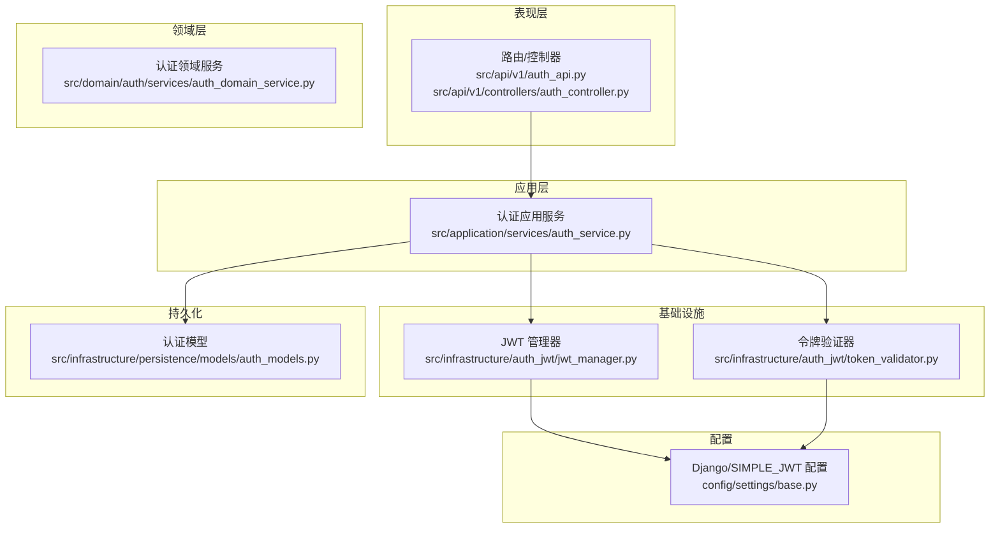
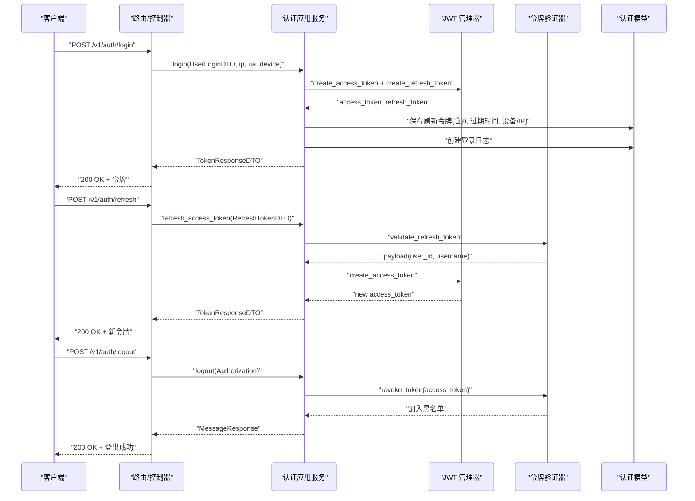
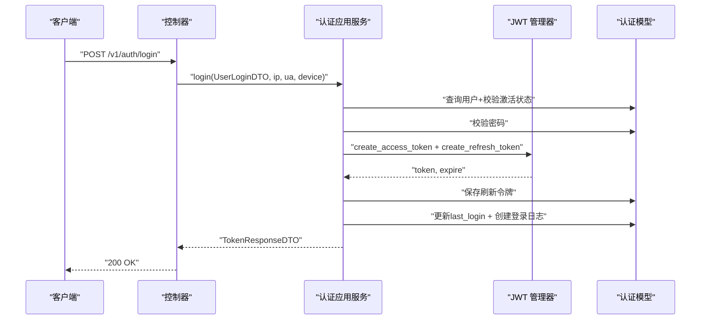
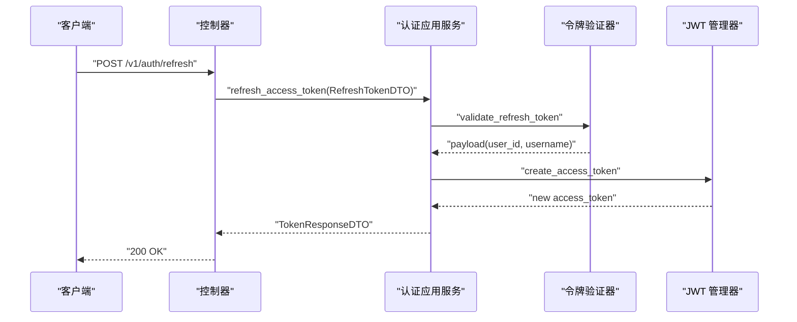
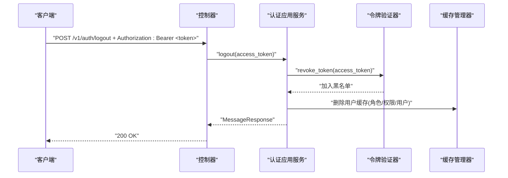
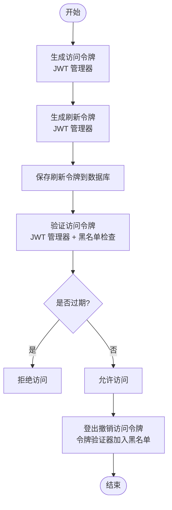
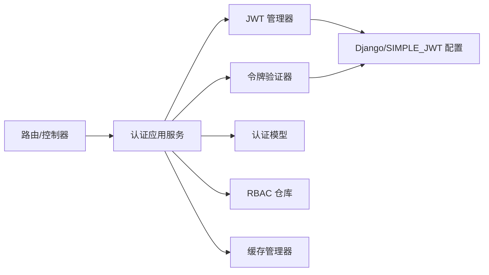

# 认证接口

<cite>
**本文引用的文件**
- [src/api/v1/auth_api.py](file://src/api/v1/auth_api.py)
- [src/api/v1/controllers/auth_controller.py](file://src/api/v1/controllers/auth_controller.py)
- [src/application/services/auth_service.py](file://src/application/services/auth_service.py)
- [src/domain/auth/services/auth_domain_service.py](file://src/domain/auth/services/auth_domain_service.py)
- [src/infrastructure/auth_jwt/jwt_manager.py](file://src/infrastructure/auth_jwt/jwt_manager.py)
- [src/infrastructure/auth_jwt/token_validator.py](file://src/infrastructure/auth_jwt/token_validator.py)
- [src/application/dto/auth/token_response_dto.py](file://src/application/dto/auth/token_response_dto.py)
- [src/application/dto/auth/refresh_token_dto.py](file://src/application/dto/auth/refresh_token_dto.py)
- [src/application/dto/user/user_login_dto.py](file://src/application/dto/user/user_login_dto.py)
- [src/infrastructure/persistence/models/auth_models.py](file://src/infrastructure/persistence/models/auth_models.py)
- [src/core/middlewares/security_middleware.py](file://src/core/middlewares/security_middleware.py)
- [src/core/exceptions/authentication_error.py](file://src/core/exceptions/authentication_error.py)
- [src/api/common/responses.py](file://src/api/common/responses.py)
- [config/settings/base.py](file://config/settings/base.py)
</cite>

## 目录
1. [简介](#简介)
2. [项目结构](#项目结构)
3. [核心组件](#核心组件)
4. [架构总览](#架构总览)
5. [详细组件分析](#详细组件分析)
6. [依赖分析](#依赖分析)
7. [性能考量](#性能考量)
8. [故障排查指南](#故障排查指南)
9. [结论](#结论)
10. [附录](#附录)

## 简介
本文件为认证接口组的详细 API 文档，覆盖用户登录、令牌刷新、用户登出等核心认证能力。文档说明每个端点的 HTTP 方法、URL 路径、请求参数、响应格式与错误处理；阐述 JWT 令牌生成与验证流程、设备信息采集、登录日志记录等实现细节；提供典型认证场景的请求与响应示例；解释认证中间件工作原理与安全考虑；并说明令牌过期处理、刷新令牌机制与登出流程的技术实现。

## 项目结构
认证相关代码采用分层架构组织：
- 表现层：Django Ninja 路由与控制器，负责接收请求、解析 DTO、调用应用服务并返回响应。
- 应用层：认证应用服务，封装业务逻辑（登录、刷新、登出、校验）。
- 领域层：认证领域服务，处理令牌生命周期与撤销等核心业务规则。
- 基础设施层：JWT 管理器与令牌验证器，负责签名算法、载荷解析、黑名单与过期判断。
- 持久化层：认证相关模型（刷新令牌、黑名单、登录日志），支持刷新令牌持久化与审计。
- 配置层：Django 与 SIMPLE_JWT 配置，控制令牌生命周期、算法与认证方式。

图表来源
- [src/api/v1/auth_api.py:1-74](file://src/api/v1/auth_api.py#L1-L74)
- [src/api/v1/controllers/auth_controller.py:1-133](file://src/api/v1/controllers/auth_controller.py#L1-L133)
- [src/application/services/auth_service.py:1-233](file://src/application/services/auth_service.py#L1-L233)
- [src/domain/auth/services/auth_domain_service.py:1-130](file://src/domain/auth/services/auth_domain_service.py#L1-L130)
- [src/infrastructure/auth_jwt/jwt_manager.py:1-147](file://src/infrastructure/auth_jwt/jwt_manager.py#L1-L147)
- [src/infrastructure/auth_jwt/token_validator.py:1-108](file://src/infrastructure/auth_jwt/token_validator.py#L1-L108)
- [src/infrastructure/persistence/models/auth_models.py:1-114](file://src/infrastructure/persistence/models/auth_models.py#L1-L114)
- [config/settings/base.py:137-151](file://config/settings/base.py#L137-L151)

章节来源
- [src/api/v1/auth_api.py:1-74](file://src/api/v1/auth_api.py#L1-L74)
- [src/api/v1/controllers/auth_controller.py:1-133](file://src/api/v1/controllers/auth_controller.py#L1-L133)
- [src/application/services/auth_service.py:1-233](file://src/application/services/auth_service.py#L1-L233)
- [src/infrastructure/auth_jwt/jwt_manager.py:1-147](file://src/infrastructure/auth_jwt/jwt_manager.py#L1-L147)
- [src/infrastructure/auth_jwt/token_validator.py:1-108](file://src/infrastructure/auth_jwt/token_validator.py#L1-L108)
- [src/infrastructure/persistence/models/auth_models.py:1-114](file://src/infrastructure/persistence/models/auth_models.py#L1-L114)
- [config/settings/base.py:137-151](file://config/settings/base.py#L137-L151)

## 核心组件
- 认证路由与控制器：提供 /v1/auth/login、/v1/auth/refresh、/v1/auth/logout 三个端点，分别处理登录、刷新与登出。
- 认证应用服务：封装登录校验、令牌签发、刷新令牌验证、登出撤销与缓存清理、登录日志记录等。
- JWT 管理器：负责访问令牌与刷新令牌的生成、解码、过期判断与载荷提取。
- 令牌验证器：负责访问令牌有效性校验、刷新令牌校验、黑名单检查与令牌撤销。
- 认证模型：持久化刷新令牌、黑名单与登录日志，支持按用户与 JTI 查询索引。
- DTO：定义登录、刷新令牌与响应的结构与示例。
- 安全中间件：在生产环境添加安全响应头，提升安全性。
- 异常与统一响应：认证错误异常与通用响应工具，保证错误与消息格式一致性。

章节来源
- [src/api/v1/auth_api.py:22-73](file://src/api/v1/auth_api.py#L22-L73)
- [src/api/v1/controllers/auth_controller.py:16-132](file://src/api/v1/controllers/auth_controller.py#L16-L132)
- [src/application/services/auth_service.py:20-232](file://src/application/services/auth_service.py#L20-L232)
- [src/infrastructure/auth_jwt/jwt_manager.py:13-146](file://src/infrastructure/auth_jwt/jwt_manager.py#L13-L146)
- [src/infrastructure/auth_jwt/token_validator.py:11-107](file://src/infrastructure/auth_jwt/token_validator.py#L11-L107)
- [src/infrastructure/persistence/models/auth_models.py:12-114](file://src/infrastructure/persistence/models/auth_models.py#L12-L114)
- [src/application/dto/auth/token_response_dto.py:9-31](file://src/application/dto/auth/token_response_dto.py#L9-L31)
- [src/application/dto/auth/refresh_token_dto.py:9-21](file://src/application/dto/auth/refresh_token_dto.py#L9-L21)
- [src/application/dto/user/user_login_dto.py:9-27](file://src/application/dto/user/user_login_dto.py#L9-L27)
- [src/core/middlewares/security_middleware.py:14-53](file://src/core/middlewares/security_middleware.py#L14-L53)
- [src/core/exceptions/authentication_error.py:9-25](file://src/core/exceptions/authentication_error.py#L9-L25)
- [src/api/common/responses.py:13-109](file://src/api/common/responses.py#L13-L109)

## 架构总览
认证系统遵循“请求—应用服务—基础设施—持久化”的分层设计。JWT 管理器与令牌验证器作为基础设施组件，既被应用服务使用，也受配置层控制；应用服务协调用户、RBAC 仓库与缓存，完成令牌签发、刷新与撤销；持久化层确保刷新令牌与审计日志的可靠存储。

图表来源
- [src/api/v1/auth_api.py:22-73](file://src/api/v1/auth_api.py#L22-L73)
- [src/application/services/auth_service.py:26-180](file://src/application/services/auth_service.py#L26-L180)
- [src/infrastructure/auth_jwt/jwt_manager.py:25-80](file://src/infrastructure/auth_jwt/jwt_manager.py#L25-L80)
- [src/infrastructure/auth_jwt/token_validator.py:21-103](file://src/infrastructure/auth_jwt/token_validator.py#L21-L103)
- [src/infrastructure/persistence/models/auth_models.py:12-44](file://src/infrastructure/persistence/models/auth_models.py#L12-L44)

## 详细组件分析

### 登录接口
- 端点：POST /v1/auth/login
- 请求体：UserLoginDTO（用户名、密码、设备信息）
- 响应体：TokenResponseDTO（访问令牌、刷新令牌、令牌类型、过期秒数、用户信息）
- 流程要点：
  - 从请求头提取客户端 IP 与 UA，并结合设备信息传入应用服务。
  - 应用服务查询用户、校验激活状态与密码，失败则记录登录日志并抛出错误。
  - 成功后生成访问令牌与刷新令牌，保存刷新令牌到数据库，更新用户最后登录时间，记录登录日志。
  - 读取配置中的访问令牌有效期，计算 expires_in（秒）返回给客户端。
- 典型响应示例（结构参考）：见 [TokenResponseDTO 示例:19-27](file://src/application/dto/auth/token_response_dto.py#L19-L27)

图表来源
- [src/api/v1/controllers/auth_controller.py:42-78](file://src/api/v1/controllers/auth_controller.py#L42-L78)
- [src/application/services/auth_service.py:26-111](file://src/application/services/auth_service.py#L26-L111)
- [src/infrastructure/auth_jwt/jwt_manager.py:25-80](file://src/infrastructure/auth_jwt/jwt_manager.py#L25-L80)
- [src/infrastructure/persistence/models/auth_models.py:12-44](file://src/infrastructure/persistence/models/auth_models.py#L12-L44)

章节来源
- [src/api/v1/auth_api.py:22-48](file://src/api/v1/auth_api.py#L22-L48)
- [src/api/v1/controllers/auth_controller.py:36-78](file://src/api/v1/controllers/auth_controller.py#L36-L78)
- [src/application/services/auth_service.py:26-111](file://src/application/services/auth_service.py#L26-L111)
- [src/application/dto/user/user_login_dto.py:9-27](file://src/application/dto/user/user_login_dto.py#L9-L27)
- [src/application/dto/auth/token_response_dto.py:9-31](file://src/application/dto/auth/token_response_dto.py#L9-L31)
- [src/infrastructure/persistence/models/auth_models.py:79-114](file://src/infrastructure/persistence/models/auth_models.py#L79-L114)

### 刷新令牌接口
- 端点：POST /v1/auth/refresh
- 请求体：RefreshTokenDTO（刷新令牌）
- 响应体：TokenResponseDTO（仅返回新的访问令牌与过期秒数，刷新令牌字段为空）
- 流程要点：
  - 应用服务调用令牌验证器对刷新令牌进行校验，失败则抛出错误。
  - 校验通过后根据 payload 中的用户标识重新生成访问令牌，读取配置中的访问令牌有效期，返回响应。
- 典型响应示例（结构参考）：见 [TokenResponseDTO 示例:19-27](file://src/application/dto/auth/token_response_dto.py#L19-L27)

图表来源
- [src/api/v1/auth_api.py:50-60](file://src/api/v1/auth_api.py#L50-L60)
- [src/api/v1/controllers/auth_controller.py:86-105](file://src/api/v1/controllers/auth_controller.py#L86-L105)
- [src/application/services/auth_service.py:113-162](file://src/application/services/auth_service.py#L113-L162)
- [src/infrastructure/auth_jwt/token_validator.py:62-79](file://src/infrastructure/auth_jwt/token_validator.py#L62-L79)
- [src/infrastructure/auth_jwt/jwt_manager.py:25-56](file://src/infrastructure/auth_jwt/jwt_manager.py#L25-L56)

章节来源
- [src/api/v1/auth_api.py:50-60](file://src/api/v1/auth_api.py#L50-L60)
- [src/api/v1/controllers/auth_controller.py:80-105](file://src/api/v1/controllers/auth_controller.py#L80-L105)
- [src/application/services/auth_service.py:113-162](file://src/application/services/auth_service.py#L113-L162)
- [src/application/dto/auth/refresh_token_dto.py:9-21](file://src/application/dto/auth/refresh_token_dto.py#L9-L21)
- [src/application/dto/auth/token_response_dto.py:9-31](file://src/application/dto/auth/token_response_dto.py#L9-L31)

### 登出接口
- 端点：POST /v1/auth/logout
- 请求头：Authorization: Bearer <访问令牌>
- 响应体：MessageResponse（登出成功消息）
- 流程要点：
  - 控制器从 Authorization 头提取访问令牌，调用应用服务执行登出。
  - 应用服务调用令牌验证器撤销访问令牌（加入黑名单），随后清理用户相关缓存（角色、权限、用户信息）。
  - 不论是否传入令牌，均返回“登出成功”消息。
- 典型响应示例（结构参考）：见 [MessageResponse 示例:13-19](file://src/api/common/responses.py#L13-L19)

图表来源
- [src/api/v1/auth_api.py:63-73](file://src/api/v1/auth_api.py#L63-L73)
- [src/api/v1/controllers/auth_controller.py:113-132](file://src/api/v1/controllers/auth_controller.py#L113-L132)
- [src/application/services/auth_service.py:164-180](file://src/application/services/auth_service.py#L164-L180)
- [src/infrastructure/auth_jwt/token_validator.py:81-103](file://src/infrastructure/auth_jwt/token_validator.py#L81-L103)

章节来源
- [src/api/v1/auth_api.py:63-73](file://src/api/v1/auth_api.py#L63-L73)
- [src/api/v1/controllers/auth_controller.py:107-132](file://src/api/v1/controllers/auth_controller.py#L107-L132)
- [src/application/services/auth_service.py:164-180](file://src/application/services/auth_service.py#L164-L180)
- [src/api/common/responses.py:13-19](file://src/api/common/responses.py#L13-L19)

### JWT 令牌生成与验证流程
- 令牌生成：
  - 访问令牌：包含用户标识、用户名、角色、权限、机构标识、类型为 access、带 exp/iat/jti，使用配置的算法与密钥签名。
  - 刷新令牌：包含用户标识、用户名、类型为 refresh、带 exp/iat/jti，使用相同算法与密钥签名。
- 令牌验证：
  - 访问令牌：需通过 JWT 管理器解码与过期检查，且必须为 access 类型；同时检查黑名单。
  - 刷新令牌：需通过 JWT 管理器解码与过期检查，且必须为 refresh 类型；同时检查黑名单。
- 令牌撤销：
  - 登出时根据访问令牌载荷中的 jti 与剩余有效期，将其加入黑名单缓存，实现即时失效。

图表来源
- [src/infrastructure/auth_jwt/jwt_manager.py:25-143](file://src/infrastructure/auth_jwt/jwt_manager.py#L25-L143)
- [src/infrastructure/auth_jwt/token_validator.py:21-103](file://src/infrastructure/auth_jwt/token_validator.py#L21-L103)
- [src/infrastructure/persistence/models/auth_models.py:12-44](file://src/infrastructure/persistence/models/auth_models.py#L12-L44)

章节来源
- [src/infrastructure/auth_jwt/jwt_manager.py:13-146](file://src/infrastructure/auth_jwt/jwt_manager.py#L13-L146)
- [src/infrastructure/auth_jwt/token_validator.py:11-107](file://src/infrastructure/auth_jwt/token_validator.py#L11-L107)
- [src/infrastructure/persistence/models/auth_models.py:12-44](file://src/infrastructure/persistence/models/auth_models.py#L12-L44)

### 设备信息收集与登录日志记录
- 设备信息收集：控制器从请求头提取客户端 IP 与 UA，并结合登录 DTO 的设备信息传递给应用服务。
- 登录日志记录：应用服务在登录成功与失败时创建登录日志，记录用户、IP、UA、设备信息、登录状态与失败原因等字段，便于审计与风控。

章节来源
- [src/api/v1/controllers/auth_controller.py:63-78](file://src/api/v1/controllers/auth_controller.py#L63-L78)
- [src/application/services/auth_service.py:44-56](file://src/application/services/auth_service.py#L44-L56)
- [src/application/services/auth_service.py:210-228](file://src/application/services/auth_service.py#L210-L228)
- [src/infrastructure/persistence/models/auth_models.py:79-114](file://src/infrastructure/persistence/models/auth_models.py#L79-L114)

### 认证中间件与安全考虑
- 安全中间件：在非调试环境下自动添加安全响应头（如 X-Content-Type-Options、X-Frame-Options、Strict-Transport-Security 等），增强浏览器安全防护。
- 认证中间件链：Django 内置认证中间件与自定义限流、安全中间件共同作用，保障请求在进入业务逻辑前满足基本安全要求。

章节来源
- [src/core/middlewares/security_middleware.py:14-53](file://src/core/middlewares/security_middleware.py#L14-L53)
- [config/settings/base.py:40-52](file://config/settings/base.py#L40-L52)

## 依赖分析
- 路由/控制器依赖认证应用服务；应用服务依赖 JWT 管理器、令牌验证器、RBAC 仓库与缓存管理器、认证模型。
- JWT 管理器与令牌验证器依赖 Django 配置（SIMPLE_JWT）与缓存后端。
- 认证模型提供刷新令牌、黑名单与登录日志的持久化能力。

图表来源
- [src/api/v1/auth_api.py:6-13](file://src/api/v1/auth_api.py#L6-L13)
- [src/api/v1/controllers/auth_controller.py:12-13](file://src/api/v1/controllers/auth_controller.py#L12-L13)
- [src/application/services/auth_service.py:10-17](file://src/application/services/auth_service.py#L10-L17)
- [src/infrastructure/auth_jwt/jwt_manager.py:10-23](file://src/infrastructure/auth_jwt/jwt_manager.py#L10-L23)
- [src/infrastructure/auth_jwt/token_validator.py:6-18](file://src/infrastructure/auth_jwt/token_validator.py#L6-L18)
- [config/settings/base.py:137-151](file://config/settings/base.py#L137-L151)

章节来源
- [src/api/v1/auth_api.py:6-13](file://src/api/v1/auth_api.py#L6-L13)
- [src/api/v1/controllers/auth_controller.py:12-13](file://src/api/v1/controllers/auth_controller.py#L12-L13)
- [src/application/services/auth_service.py:10-17](file://src/application/services/auth_service.py#L10-L17)
- [src/infrastructure/auth_jwt/jwt_manager.py:10-23](file://src/infrastructure/auth_jwt/jwt_manager.py#L10-L23)
- [src/infrastructure/auth_jwt/token_validator.py:6-18](file://src/infrastructure/auth_jwt/token_validator.py#L6-L18)
- [config/settings/base.py:137-151](file://config/settings/base.py#L137-L151)

## 性能考量
- 缓存利用：令牌撤销通过缓存实现即时生效，避免频繁数据库查询；登出后清理用户相关缓存，减少后续鉴权开销。
- 数据库索引：刷新令牌模型对 user 与 jti 建有索引，提高查询与去重效率。
- 配置优化：通过 SIMPLE_JWT 控制令牌生命周期与算法，平衡安全与性能；Redis 缓存默认启用，建议在生产环境合理设置过期时间与容量。
- I/O 优化：登录成功后仅写入必要的日志与刷新令牌，避免冗余操作。

章节来源
- [src/infrastructure/auth_jwt/token_validator.py:47-60](file://src/infrastructure/auth_jwt/token_validator.py#L47-L60)
- [src/infrastructure/persistence/models/auth_models.py:38-41](file://src/infrastructure/persistence/models/auth_models.py#L38-L41)
- [config/settings/base.py:158-163](file://config/settings/base.py#L158-L163)

## 故障排查指南
- 登录失败
  - 现象：返回“用户名或密码错误”或“用户已被停用”。
  - 排查：确认用户是否存在、密码是否正确、账户是否激活；查看登录日志定位失败原因。
- 刷新令牌无效
  - 现象：返回“刷新Token无效或已过期”。
  - 排查：确认刷新令牌类型为 refresh、未被撤销、未过期；检查黑名单状态。
- 访问令牌失效
  - 现象：访问接口返回无效或过期。
  - 排查：确认令牌类型为 access、未被撤销、未过期；若近期登出，令牌已被加入黑名单。
- 登出未生效
  - 现象：登出后仍可使用旧令牌。
  - 排查：确认 Authorization 头格式正确；检查黑名单缓存是否正常；确认登出流程已执行。

章节来源
- [src/application/services/auth_service.py:37-56](file://src/application/services/auth_service.py#L37-L56)
- [src/application/services/auth_service.py:118-120](file://src/application/services/auth_service.py#L118-L120)
- [src/infrastructure/auth_jwt/token_validator.py:21-45](file://src/infrastructure/auth_jwt/token_validator.py#L21-L45)
- [src/infrastructure/auth_jwt/token_validator.py:81-103](file://src/infrastructure/auth_jwt/token_validator.py#L81-L103)

## 结论
本认证接口组通过清晰的分层设计与完善的基础设施组件，实现了安全、可扩展的 JWT 认证能力。登录、刷新与登出流程覆盖了典型场景，配合设备信息采集与登录日志记录，满足审计与风控需求。建议在生产环境中合理配置令牌生命周期、启用安全响应头与缓存，持续监控与优化性能与安全性。

## 附录

### 端点定义与示例
- 登录
  - 方法：POST
  - 路径：/v1/auth/login
  - 请求体：UserLoginDTO（用户名、密码、设备信息）
  - 响应体：TokenResponseDTO（访问令牌、刷新令牌、令牌类型、过期秒数、用户信息）
  - 示例参考：[UserLoginDTO 示例:17-23](file://src/application/dto/user/user_login_dto.py#L17-L23)、[TokenResponseDTO 示例:19-27](file://src/application/dto/auth/token_response_dto.py#L19-L27)
- 刷新
  - 方法：POST
  - 路径：/v1/auth/refresh
  - 请求体：RefreshTokenDTO（刷新令牌）
  - 响应体：TokenResponseDTO（仅访问令牌与过期秒数）
  - 示例参考：[RefreshTokenDTO 示例:15-17](file://src/application/dto/auth/refresh_token_dto.py#L15-L17)、[TokenResponseDTO 示例:19-27](file://src/application/dto/auth/token_response_dto.py#L19-L27)
- 登出
  - 方法：POST
  - 路径：/v1/auth/logout
  - 请求头：Authorization: Bearer <访问令牌>
  - 响应体：MessageResponse（登出成功消息）
  - 示例参考：[MessageResponse 示例:13-19](file://src/api/common/responses.py#L13-L19)

章节来源
- [src/api/v1/auth_api.py:22-73](file://src/api/v1/auth_api.py#L22-L73)
- [src/api/v1/controllers/auth_controller.py:36-132](file://src/api/v1/controllers/auth_controller.py#L36-L132)
- [src/application/dto/user/user_login_dto.py:9-27](file://src/application/dto/user/user_login_dto.py#L9-L27)
- [src/application/dto/auth/refresh_token_dto.py:9-21](file://src/application/dto/auth/refresh_token_dto.py#L9-L21)
- [src/application/dto/auth/token_response_dto.py:9-31](file://src/application/dto/auth/token_response_dto.py#L9-L31)
- [src/api/common/responses.py:13-19](file://src/api/common/responses.py#L13-L19)