# RBAC 数据模型设计

<cite>
**本文档中引用的文件**
- [role_entity.py](file://src/domain/rbac/entities/role_entity.py)
- [permission_entity.py](file://src/domain/rbac/entities/permission_entity.py)
- [rbac_models.py](file://src/infrastructure/persistence/models/rbac_models.py)
- [0001_initial.py](file://src/infrastructure/persistence/migrations/0001_initial.py)
- [0002_auto_20260314_0921.py](file://src/infrastructure/persistence/migrations/0002_auto_20260314_0921.py)
- [rbac_repo_impl.py](file://src/infrastructure/repositories/rbac_repo_impl.py)
- [rbac_service.py](file://src/application/services/rbac_service.py)
- [rbac_repository.py](file://src/domain/rbac/repositories/rbac_repository.py)
- [test_rbac_models.py](file://tests/test_models/test_rbac_models.py)
- [rbac.sql](file://sql/rbac.sql)
</cite>

## 目录
1. [简介](#简介)
2. [项目结构](#项目结构)
3. [核心组件](#核心组件)
4. [架构概览](#架构概览)
5. [详细组件分析](#详细组件分析)
6. [数据库设计](#数据库设计)
7. [依赖关系分析](#依赖关系分析)
8. [性能考虑](#性能考虑)
9. [故障排除指南](#故障排除指南)
10. [最佳实践](#最佳实践)
11. [结论](#结论)

## 简介

本文件详细阐述了基于 Django Ninja 的 RBAC（基于角色的访问控制）数据模型设计。该系统实现了完整的权限管理体系，包括角色实体、权限实体以及它们之间的多对多关联关系。通过清晰的数据模型设计和严格的业务规则约束，确保了系统的安全性和可维护性。

RBAC 模型采用分层架构设计，将领域模型、基础设施层和应用服务层清晰分离，提供了灵活的扩展能力和良好的性能表现。

## 项目结构

RBAC 数据模型在项目中的组织结构如下：

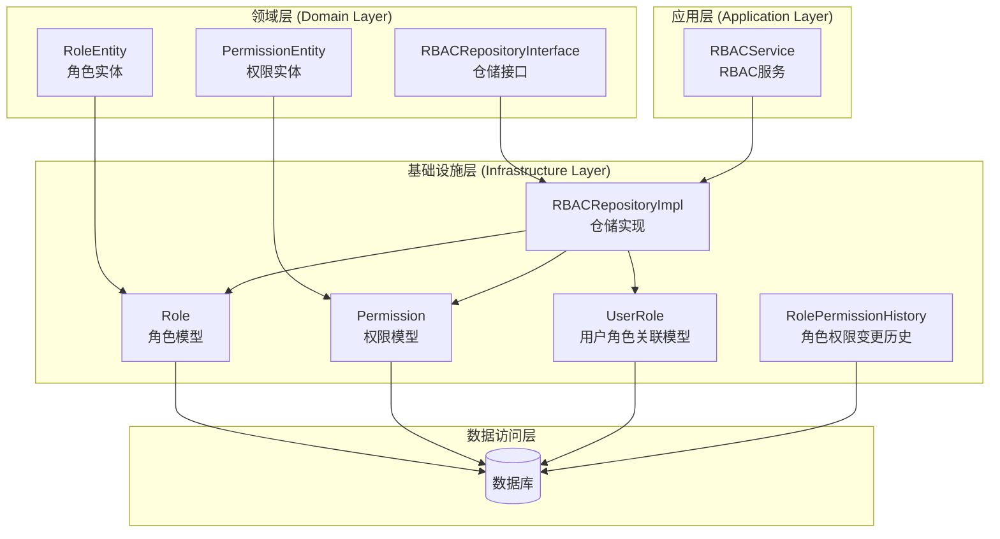

**图表来源**
- [rbac_models.py:13-148](file://src/infrastructure/persistence/models/rbac_models.py#L13-L148)
- [role_entity.py:11-80](file://src/domain/rbac/entities/role_entity.py#L11-L80)
- [permission_entity.py:11-85](file://src/domain/rbac/entities/permission_entity.py#L11-L85)

**章节来源**
- [rbac_models.py:1-148](file://src/infrastructure/persistence/models/rbac_models.py#L1-L148)
- [role_entity.py:1-80](file://src/domain/rbac/entities/role_entity.py#L1-L80)
- [permission_entity.py:1-85](file://src/domain/rbac/entities/permission_entity.py#L1-L85)

## 核心组件

### 角色实体 (RoleEntity)

角色实体是 RBAC 系统的核心数据结构，采用 Python dataclass 设计，提供了完整的行为封装：

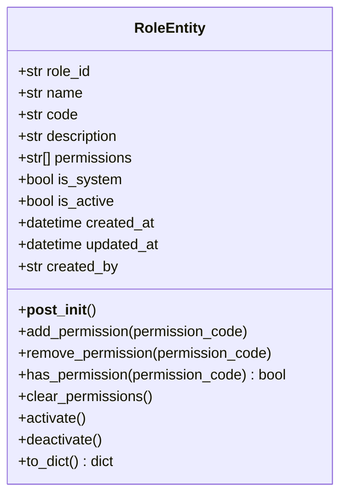

**图表来源**
- [role_entity.py:11-80](file://src/domain/rbac/entities/role_entity.py#L11-L80)

### 权限实体 (PermissionEntity)

权限实体定义了系统中各种操作的访问许可，支持自动解析权限代码格式：

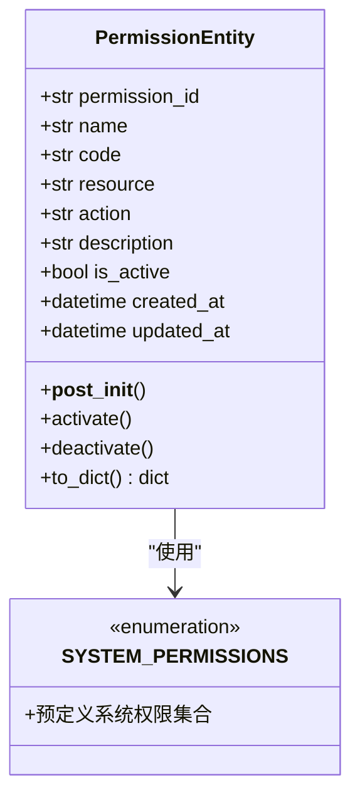

**图表来源**
- [permission_entity.py:11-85](file://src/domain/rbac/entities/permission_entity.py#L11-L85)

**章节来源**
- [role_entity.py:11-80](file://src/domain/rbac/entities/role_entity.py#L11-L80)
- [permission_entity.py:11-85](file://src/domain/rbac/entities/permission_entity.py#L11-L85)

## 架构概览

RBAC 系统采用经典的三层架构模式，实现了清晰的关注点分离：

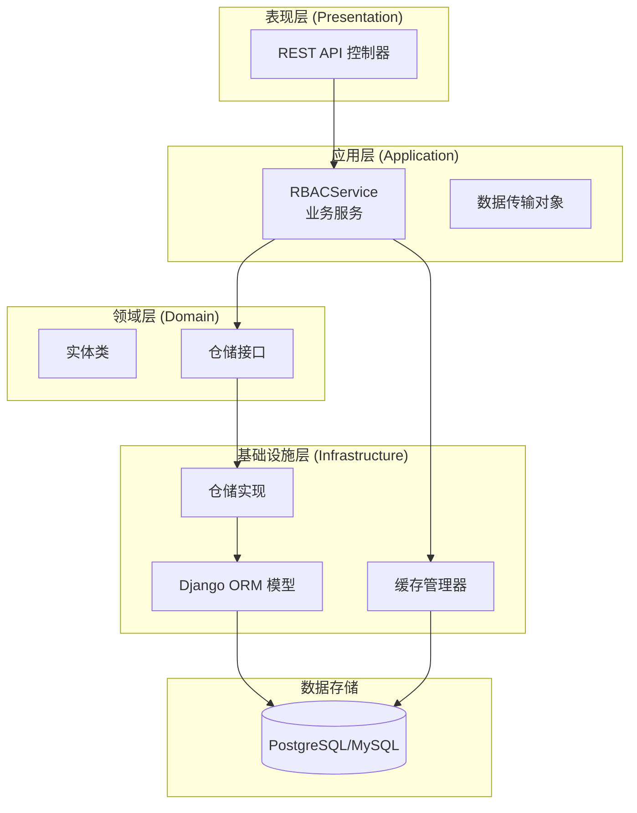

**图表来源**
- [rbac_service.py:22-286](file://src/application/services/rbac_service.py#L22-L286)
- [rbac_repo_impl.py:15-253](file://src/infrastructure/repositories/rbac_repo_impl.py#L15-L253)

## 详细组件分析

### 角色模型 (Role Model)

角色模型是 RBAC 系统的核心实体，负责存储角色的基本信息和权限关联：

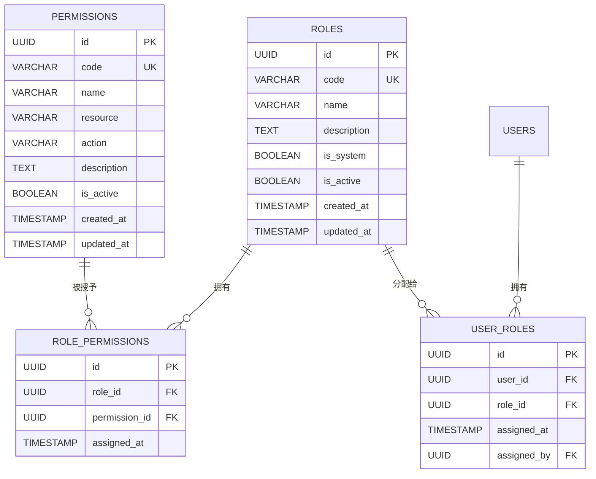

**图表来源**
- [rbac_models.py:43-114](file://src/infrastructure/persistence/models/rbac_models.py#L43-L114)

### 权限模型 (Permission Model)

权限模型定义了系统中各种操作的访问许可，支持资源-动作模式：

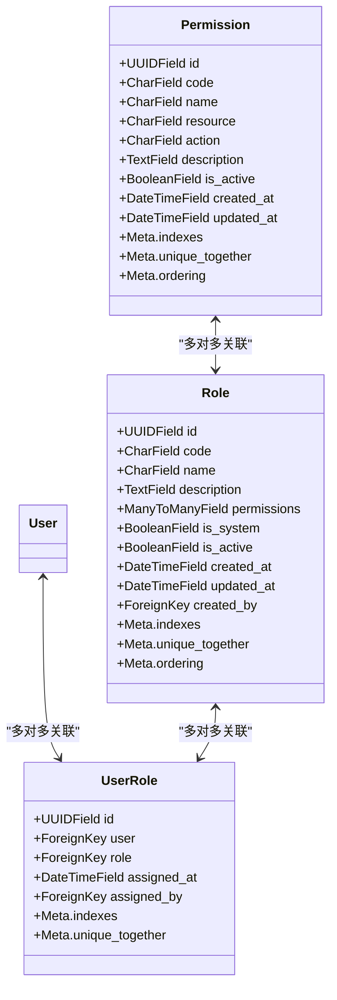

**图表来源**
- [rbac_models.py:13-114](file://src/infrastructure/persistence/models/rbac_models.py#L13-L114)

**章节来源**
- [rbac_models.py:13-148](file://src/infrastructure/persistence/models/rbac_models.py#L13-L148)

### 用户角色关联模型 (UserRole Model)

用户角色关联模型实现了用户与角色之间的多对多关系，支持角色分配和撤销功能：

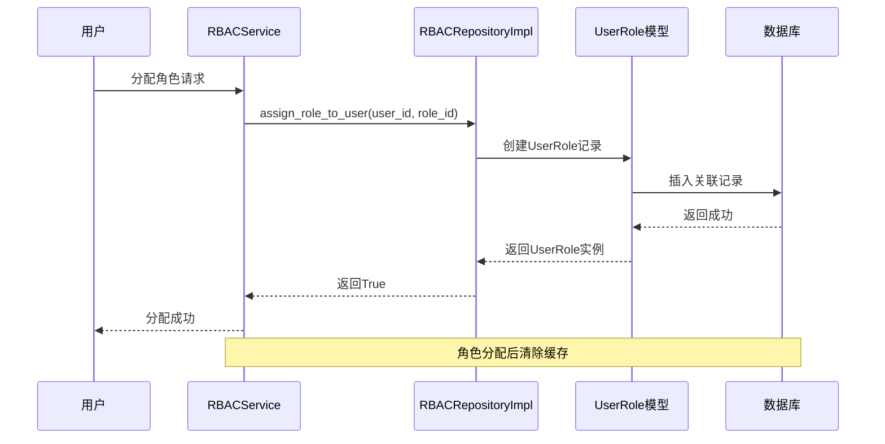

**图表来源**
- [rbac_service.py:171-205](file://src/application/services/rbac_service.py#L171-L205)
- [rbac_repo_impl.py:186-194](file://src/infrastructure/repositories/rbac_repo_impl.py#L186-L194)

**章节来源**
- [rbac_repo_impl.py:186-253](file://src/infrastructure/repositories/rbac_repo_impl.py#L186-L253)
- [rbac_service.py:171-252](file://src/application/services/rbac_service.py#L171-L252)

## 数据库设计

### 表结构定义

#### 角色表 (roles)

| 字段名 | 类型 | 约束 | 描述 |
|--------|------|------|------|
| id | UUID | 主键 | 角色唯一标识符 |
| code | VARCHAR(50) | 唯一索引 | 角色代码，如 'admin', 'user' |
| name | VARCHAR(100) | 必填 | 角色名称 |
| description | TEXT | 可空 | 角色描述 |
| is_system | BOOLEAN | 默认False | 是否系统角色 |
| is_active | BOOLEAN | 默认True | 角色状态 |
| created_at | TIMESTAMP | 自动设置 | 创建时间 |
| updated_at | TIMESTAMP | 自动更新 | 更新时间 |
| created_by | UUID | 外键到users | 创建者 |

#### 权限表 (permissions)

| 字段名 | 类型 | 约束 | 描述 |
|--------|------|------|------|
| id | UUID | 主键 | 权限唯一标识符 |
| code | VARCHAR(100) | 唯一索引 | 权限代码，如 'user:read' |
| name | VARCHAR(100) | 必填 | 权限名称 |
| resource | VARCHAR(50) | 索引 | 资源类型，如 'user' |
| action | VARCHAR(50) | 必填 | 操作类型，如 'read' |
| description | TEXT | 可空 | 权限描述 |
| is_active | BOOLEAN | 默认True | 权限状态 |
| created_at | TIMESTAMP | 自动设置 | 创建时间 |
| updated_at | TIMESTAMP | 自动更新 | 更新时间 |

#### 用户角色关联表 (user_roles)

| 字段名 | 类型 | 约束 | 描述 |
|--------|------|------|------|
| id | UUID | 主键 | 关联记录唯一标识符 |
| user_id | UUID | 外键到users | 用户标识符 |
| role_id | UUID | 外键到roles | 角色标识符 |
| assigned_at | TIMESTAMP | 自动设置 | 分配时间 |
| assigned_by | UUID | 外键到users | 分配者 |

#### 角色权限历史表 (role_permission_history)

| 字段名 | 类型 | 约束 | 描述 |
|--------|------|------|------|
| id | UUID | 主键 | 历史记录唯一标识符 |
| role_id | UUID | 外键到roles | 角色标识符 |
| permission_id | UUID | 外键到permissions | 权限标识符 |
| action | VARCHAR(20) | 枚举('add','remove') | 操作类型 |
| changed_at | TIMESTAMP | 自动设置 | 变更时间 |
| changed_by | UUID | 外键到users | 变更者 |

### 索引设计

系统采用了多层次的索引策略以优化查询性能：

```mermaid
graph LR
subgraph "角色表索引"
R1[唯一索引: code]
R2[普通索引: created_at]
end
subgraph "权限表索引"
P1[唯一索引: code]
P2[普通索引: resource]
P3[复合索引: resource, action]
end
subgraph "用户角色关联表索引"
U1[唯一索引: (user_id, role_id)]
U2[普通索引: user_id]
U3[普通索引: role_id]
end
subgraph "权限历史表索引"
H1[普通索引: role_id]
H2[普通索引: permission_id]
H3[普通索引: changed_at]
end
```

**图表来源**
- [rbac_models.py:29-110](file://src/infrastructure/persistence/models/rbac_models.py#L29-L110)

### 约束条件

系统通过多种约束确保数据完整性：

1. **唯一性约束**
   - 角色代码唯一性
   - 权限代码唯一性
   - 用户角色组合唯一性

2. **外键约束**
   - 用户角色关联表的外键约束
   - 角色权限历史表的外键约束

3. **业务约束**
   - 系统角色不可删除
   - 角色必须有名称和代码
   - 权限必须有名称和代码

**章节来源**
- [rbac_models.py:29-145](file://src/infrastructure/persistence/models/rbac_models.py#L29-L145)

## 依赖关系分析

### 组件耦合度分析

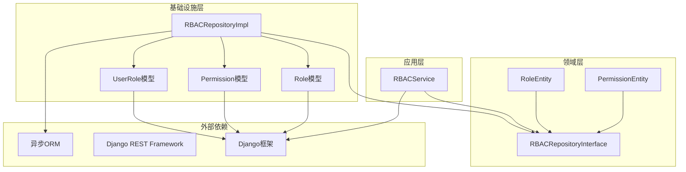

**图表来源**
- [rbac_service.py:19-29](file://src/application/services/rbac_service.py#L19-L29)
- [rbac_repo_impl.py:10-12](file://src/infrastructure/repositories/rbac_repo_impl.py#L10-L12)

### 数据流分析

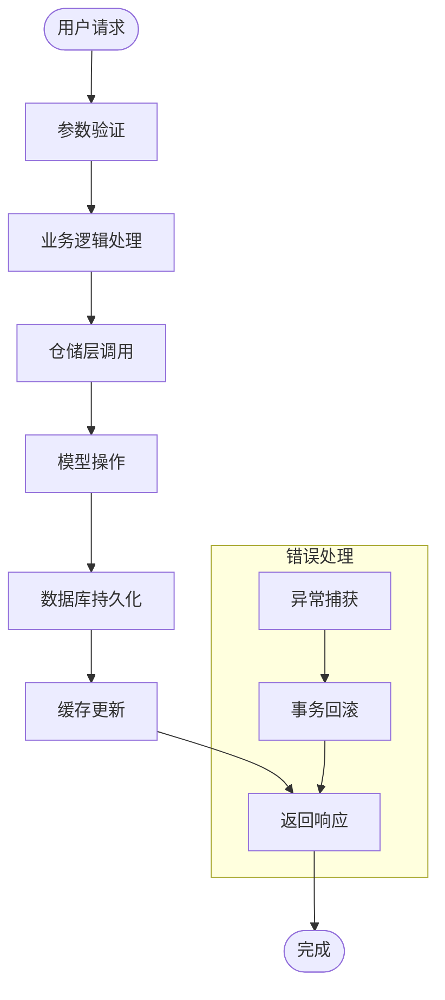

**图表来源**
- [rbac_service.py:33-106](file://src/application/services/rbac_service.py#L33-L106)
- [rbac_repo_impl.py:66-97](file://src/infrastructure/repositories/rbac_repo_impl.py#L66-L97)

**章节来源**
- [rbac_repository.py:12-112](file://src/domain/rbac/repositories/rbac_repository.py#L12-L112)
- [rbac_service.py:22-286](file://src/application/services/rbac_service.py#L22-L286)

## 性能考虑

### 查询优化策略

1. **索引优化**
   - 在角色代码上建立唯一索引，确保快速查找
   - 在权限资源和动作上建立复合索引，优化权限查询
   - 在用户角色关联表上建立唯一索引，防止重复分配

2. **查询优化**
   - 使用 select_related 和 prefetch_related 减少 N+1 查询问题
   - 实施分页查询处理大量数据
   - 使用缓存机制减少重复查询

3. **缓存策略**
   - 用户权限缓存：缓存用户的所有权限代码
   - 用户角色缓存：缓存用户的角色信息
   - 缓存失效：角色分配/撤销时自动清理相关缓存

### 异步处理

系统采用异步编程模式，提高了并发处理能力：

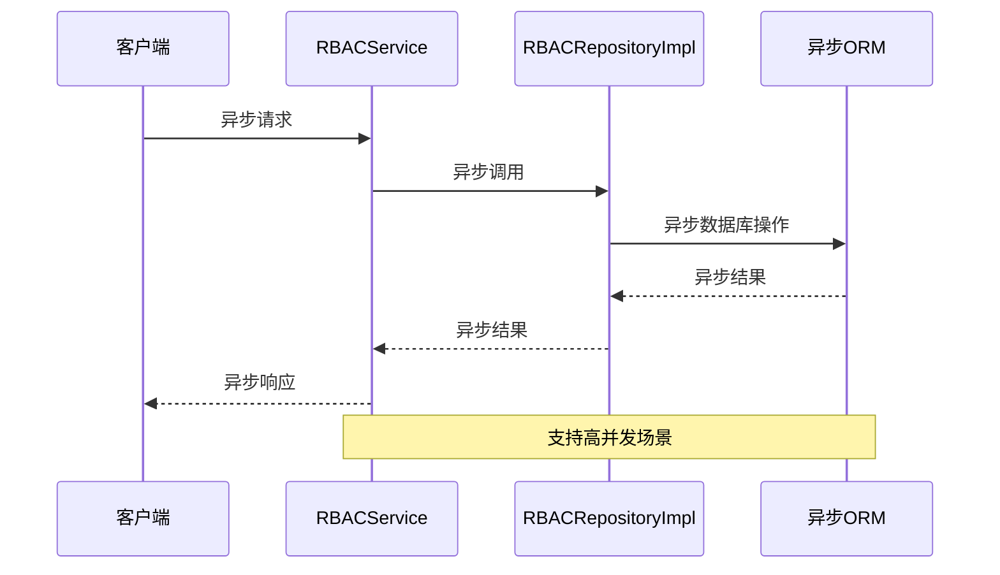

**图表来源**
- [rbac_repo_impl.py:50-57](file://src/infrastructure/repositories/rbac_repo_impl.py#L50-L57)
- [rbac_service.py:233-251](file://src/application/services/rbac_service.py#L233-L251)

## 故障排除指南

### 常见问题及解决方案

#### 角色代码冲突

**问题描述**：尝试创建具有重复角色代码的角色时出现冲突

**解决方案**：
1. 检查现有角色代码
2. 使用唯一性约束避免重复
3. 提供适当的错误处理和用户反馈

#### 权限代码冲突

**问题描述**：权限代码重复导致数据库约束冲突

**解决方案**：
1. 在创建权限前检查唯一性
2. 实施权限代码规范化处理
3. 提供详细的错误信息

#### 用户角色分配失败

**问题描述**：用户角色分配操作失败

**解决方案**：
1. 验证用户和角色的存在性
2. 检查角色状态（是否激活）
3. 确认用户未重复拥有相同角色
4. 实施事务处理确保数据一致性

### 错误处理流程

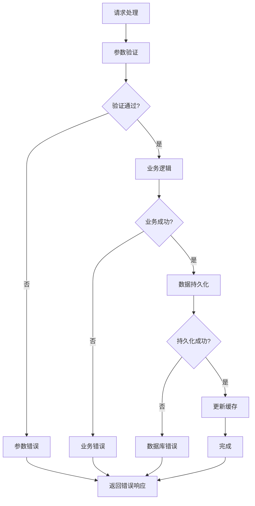

**图表来源**
- [rbac_service.py:37-40](file://src/application/services/rbac_service.py#L37-L40)
- [rbac_repo_impl.py:188-194](file://src/infrastructure/repositories/rbac_repo_impl.py#L188-L194)

**章节来源**
- [rbac_service.py:33-205](file://src/application/services/rbac_service.py#L33-L205)
- [rbac_repo_impl.py:186-253](file://src/infrastructure/repositories/rbac_repo_impl.py#L186-L253)

## 最佳实践

### 数据模型设计原则

1. **单一职责原则**
   - 每个模型只负责特定的业务领域
   - 避免模型间的过度耦合

2. **数据完整性保证**
   - 使用数据库约束确保数据一致性
   - 实施业务规则验证
   - 提供完善的错误处理机制

3. **性能优化**
   - 合理设计索引策略
   - 实施缓存机制
   - 优化查询语句

### 安全最佳实践

1. **权限验证**
   - 实施细粒度权限控制
   - 支持权限继承和组合
   - 提供权限审计功能

2. **数据保护**
   - 实施最小权限原则
   - 提供权限变更历史
   - 支持权限撤销和回收

3. **系统安全**
   - 防止权限提升攻击
   - 实施会话管理和令牌验证
   - 提供安全的日志记录

### 扩展性考虑

1. **模块化设计**
   - 支持动态权限定义
   - 提供插件化的权限扩展机制
   - 支持自定义权限处理器

2. **监控和审计**
   - 实施完整的权限使用记录
   - 提供权限使用统计分析
   - 支持权限合规性检查

## 结论

本 RBAC 数据模型设计通过清晰的分层架构、严格的数据约束和完善的业务逻辑，构建了一个功能完整、性能优良的权限管理系统。系统的主要优势包括：

1. **架构清晰**：分层设计确保了各层职责明确，便于维护和扩展
2. **性能优秀**：合理的索引设计和缓存策略提供了高效的查询性能
3. **安全可靠**：多重约束和验证机制确保了数据的完整性和安全性
4. **易于扩展**：模块化设计支持功能的灵活扩展和定制

该设计为后续的功能扩展和性能优化奠定了坚实的基础，能够满足复杂业务场景下的权限管理需求。