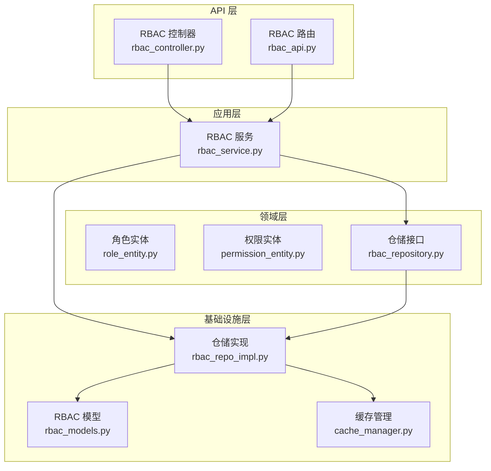
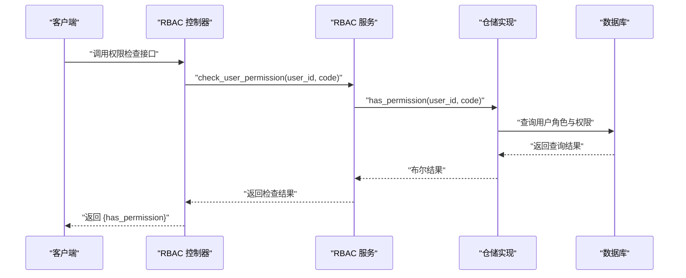
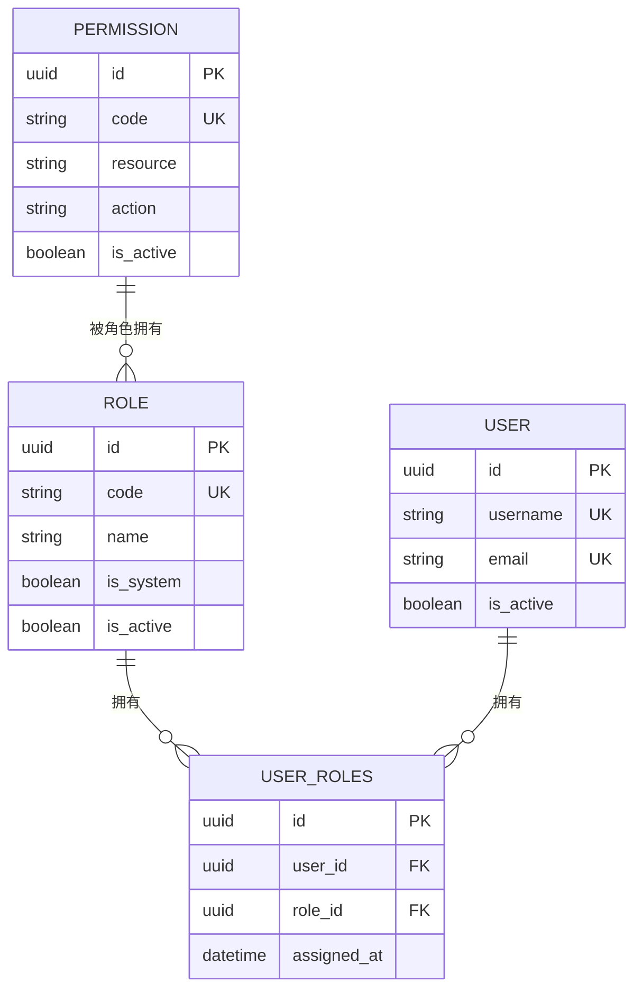
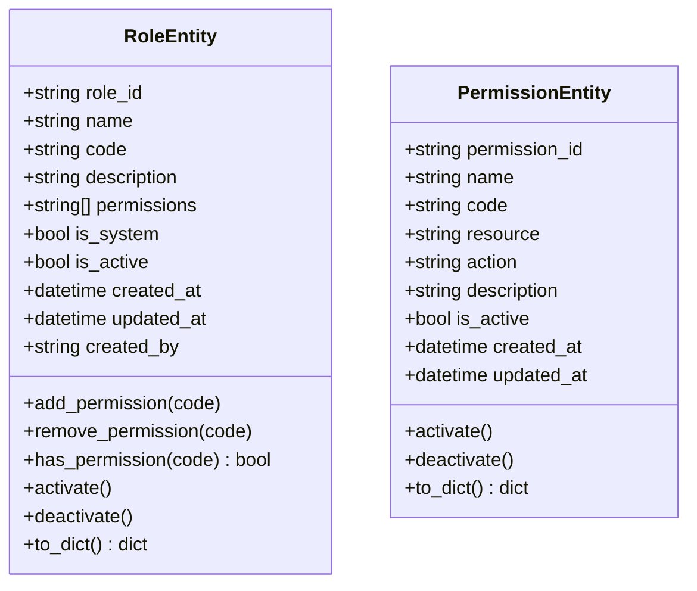
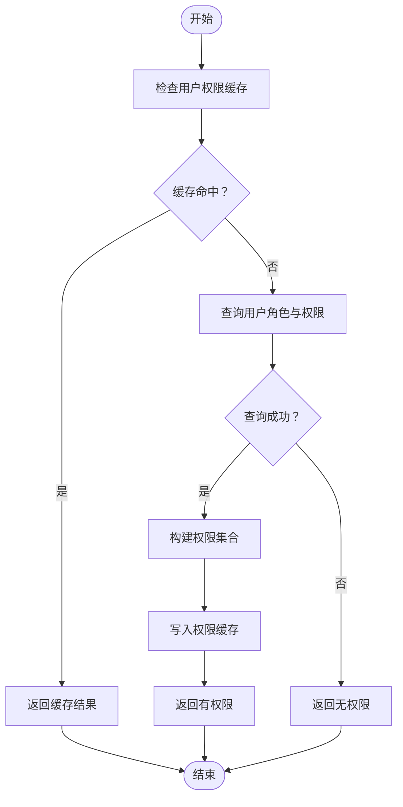
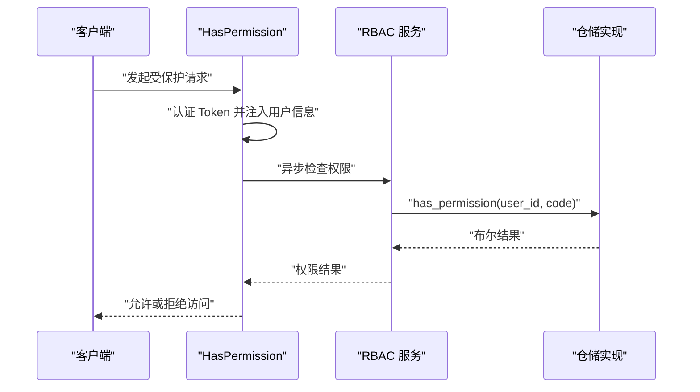
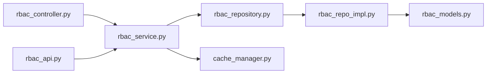
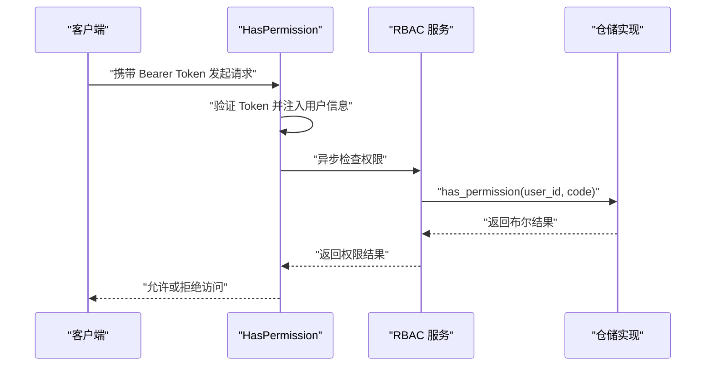

# RBAC 权限系统

<cite>
**本文档引用的文件**
- [role_entity.py](file://src/domain/rbac/entities/role_entity.py)
- [permission_entity.py](file://src/domain/rbac/entities/permission_entity.py)
- [rbac_repository.py](file://src/domain/rbac/repositories/rbac_repository.py)
- [rbac_service.py](file://src/application/services/rbac_service.py)
- [rbac_controller.py](file://src/api/v1/controllers/rbac_controller.py)
- [rbac_api.py](file://src/api/v1/rbac_api.py)
- [rbac_models.py](file://src/infrastructure/persistence/models/rbac_models.py)
- [rbac_repo_impl.py](file://src/infrastructure/repositories/rbac_repo_impl.py)
- [cache_manager.py](file://src/infrastructure/cache/cache_manager.py)
- [permissions.py](file://src/api/common/permissions.py)
- [role_create_dto.py](file://src/application/dto/rbac/role_create_dto.py)
- [assign_role_dto.py](file://src/application/dto/rbac/assign_role_dto.py)
- [user_roles_response_dto.py](file://src/application/dto/rbac/user_roles_response_dto.py)
- [test_rbac_models.py](file://tests/test_models/test_rbac_models.py)
- [0001_initial.py](file://src/infrastructure/persistence/migrations/0001_initial.py)
- [init_admin.py](file://scripts/init_admin.py)
- [rbac.sql](file://sql/rbac.sql)
</cite>

## 目录
1. [简介](#简介)
2. [项目结构](#项目结构)
3. [核心组件](#核心组件)
4. [架构总览](#架构总览)
5. [详细组件分析](#详细组件分析)
6. [依赖关系分析](#依赖关系分析)
7. [性能考量](#性能考量)
8. [故障排查指南](#故障排查指南)
9. [结论](#结论)
10. [附录](#附录)

## 简介
本文件全面阐述基于 Django Ninja 的 RBAC（基于角色的访问控制）权限系统的设计与实现。系统采用清晰的分层架构：领域层定义角色与权限实体；应用层封装业务逻辑；基础设施层负责数据持久化与缓存；API 层提供对外接口。系统支持角色管理、权限分配、用户角色绑定、权限验证与缓存优化，并提供初始化脚本与示例数据。

## 项目结构
RBAC 相关代码分布在以下层次：
- 领域层：角色与权限实体定义
- 应用层：RBAC 服务处理业务逻辑
- 基础设施层：Django ORM 模型、仓储实现、缓存管理
- API 层：控制器与路由，提供 REST 接口
- 测试与迁移：模型测试与数据库迁移

**图表来源**
- [rbac_controller.py:38-351](file://src/api/v1/controllers/rbac_controller.py#L38-L351)
- [rbac_api.py:1-184](file://src/api/v1/rbac_api.py#L1-L184)
- [rbac_service.py:22-286](file://src/application/services/rbac_service.py#L22-L286)
- [rbac_repository.py:12-112](file://src/domain/rbac/repositories/rbac_repository.py#L12-L112)
- [rbac_models.py:13-148](file://src/infrastructure/persistence/models/rbac_models.py#L13-L148)
- [rbac_repo_impl.py:15-253](file://src/infrastructure/repositories/rbac_repo_impl.py#L15-L253)
- [cache_manager.py:16-149](file://src/infrastructure/cache/cache_manager.py#L16-L149)

**章节来源**
- [rbac_controller.py:38-351](file://src/api/v1/controllers/rbac_controller.py#L38-L351)
- [rbac_api.py:1-184](file://src/api/v1/rbac_api.py#L1-L184)
- [rbac_service.py:22-286](file://src/application/services/rbac_service.py#L22-L286)
- [rbac_repository.py:12-112](file://src/domain/rbac/repositories/rbac_repository.py#L12-L112)
- [rbac_models.py:13-148](file://src/infrastructure/persistence/models/rbac_models.py#L13-L148)
- [rbac_repo_impl.py:15-253](file://src/infrastructure/repositories/rbac_repo_impl.py#L15-L253)
- [cache_manager.py:16-149](file://src/infrastructure/cache/cache_manager.py#L16-L149)

## 核心组件
- 角色实体：包含角色标识、代码、名称、描述、权限集合、系统标记、激活状态及时间戳等属性，并提供权限增删、激活/停用、序列化等方法。
- 权限实体：包含权限标识、代码、资源类型、操作类型、名称、描述、激活状态及时间戳等属性，支持从代码自动解析资源与动作。
- 仓储接口：定义角色、权限、用户角色关联的抽象数据访问方法。
- 仓储实现：基于 Django ORM 的具体实现，负责实体与模型之间的转换、查询与持久化。
- RBAC 服务：封装业务逻辑，包括角色与权限的创建、更新、删除、列表查询、用户角色分配与权限校验、缓存管理。
- API 控制器与路由：提供 REST 接口，包括角色管理、权限管理、用户角色关联与权限检查。
- 缓存管理：提供统一的缓存键空间与读写接口，支持用户权限与角色缓存。
- 权限装饰器：提供基于 Token 的认证与权限检查能力，支持单权限与任一权限检查。

**章节来源**
- [role_entity.py:11-80](file://src/domain/rbac/entities/role_entity.py#L11-L80)
- [permission_entity.py:11-85](file://src/domain/rbac/entities/permission_entity.py#L11-L85)
- [rbac_repository.py:12-112](file://src/domain/rbac/repositories/rbac_repository.py#L12-L112)
- [rbac_repo_impl.py:15-253](file://src/infrastructure/repositories/rbac_repo_impl.py#L15-L253)
- [rbac_service.py:22-286](file://src/application/services/rbac_service.py#L22-L286)
- [rbac_controller.py:38-351](file://src/api/v1/controllers/rbac_controller.py#L38-L351)
- [rbac_api.py:1-184](file://src/api/v1/rbac_api.py#L1-L184)
- [cache_manager.py:16-149](file://src/infrastructure/cache/cache_manager.py#L16-L149)
- [permissions.py:14-245](file://src/api/common/permissions.py#L14-L245)

## 架构总览
系统遵循分层架构与依赖倒置原则：
- API 层仅依赖应用服务接口，不直接操作数据
- 应用服务依赖仓储接口，实现业务编排
- 仓储接口由具体实现类实现，操作 Django ORM 模型
- 缓存管理器提供跨模块的缓存能力

**图表来源**
- [rbac_controller.py:321-351](file://src/api/v1/controllers/rbac_controller.py#L321-L351)
- [rbac_service.py:233-251](file://src/application/services/rbac_service.py#L233-L251)
- [rbac_repo_impl.py:230-248](file://src/infrastructure/repositories/rbac_repo_impl.py#L230-L248)

**章节来源**
- [rbac_controller.py:321-351](file://src/api/v1/controllers/rbac_controller.py#L321-L351)
- [rbac_service.py:233-251](file://src/application/services/rbac_service.py#L233-L251)
- [rbac_repo_impl.py:230-248](file://src/infrastructure/repositories/rbac_repo_impl.py#L230-L248)

## 详细组件分析

### 数据模型与仓储
- 角色模型：包含 code 唯一索引、名称、描述、权限多对多关系、系统角色标记、激活状态与时间戳。
- 权限模型：包含 code 唯一索引、资源类型与操作类型索引、名称、描述、激活状态与时间戳。
- 用户角色关联模型：多对多关系，带唯一约束与索引，记录分配时间与分配者。
- 仓储接口：定义角色、权限、用户角色关联的 CRUD 与查询方法。
- 仓储实现：完成实体与模型的双向转换，执行查询、更新与关联维护。

**图表来源**
- [rbac_models.py:13-114](file://src/infrastructure/persistence/models/rbac_models.py#L13-L114)
- [0001_initial.py:588-656](file://src/infrastructure/persistence/migrations/0001_initial.py#L588-L656)

**章节来源**
- [rbac_models.py:13-148](file://src/infrastructure/persistence/models/rbac_models.py#L13-L148)
- [rbac_repo_impl.py:15-253](file://src/infrastructure/repositories/rbac_repo_impl.py#L15-L253)
- [rbac_repository.py:12-112](file://src/domain/rbac/repositories/rbac_repository.py#L12-L112)
- [0001_initial.py:588-656](file://src/infrastructure/persistence/migrations/0001_initial.py#L588-L656)

### 角色与权限实体
- 角色实体：提供权限增删、激活/停用、序列化等方法，确保角色名称与代码非空。
- 权限实体：提供激活/停用、序列化方法，并支持从代码自动解析资源与动作。

**图表来源**
- [role_entity.py:11-80](file://src/domain/rbac/entities/role_entity.py#L11-L80)
- [permission_entity.py:11-85](file://src/domain/rbac/entities/permission_entity.py#L11-L85)

**章节来源**
- [role_entity.py:11-80](file://src/domain/rbac/entities/role_entity.py#L11-L80)
- [permission_entity.py:11-85](file://src/domain/rbac/entities/permission_entity.py#L11-L85)

### RBAC 服务层
- 角色管理：创建、查询、更新、删除角色，支持权限批量赋权。
- 权限管理：创建、查询、列出权限，支持系统权限初始化。
- 用户角色关联：分配角色给用户、移除用户角色、获取用户角色与权限、检查用户权限。
- 缓存策略：检查权限时优先读取缓存，未命中则查询数据库并回填缓存。

**图表来源**
- [rbac_service.py:233-251](file://src/application/services/rbac_service.py#L233-L251)
- [cache_manager.py:108-122](file://src/infrastructure/cache/cache_manager.py#L108-L122)

**章节来源**
- [rbac_service.py:22-286](file://src/application/services/rbac_service.py#L22-L286)
- [cache_manager.py:16-149](file://src/infrastructure/cache/cache_manager.py#L16-L149)

### API 接口与权限装饰器
- 控制器接口：提供角色 CRUD、权限列表、系统权限初始化、用户角色分配/移除、用户角色与权限查询、权限检查等接口。
- 路由接口：提供与控制器一致的 REST 接口。
- 权限装饰器：提供认证、单权限检查、任一权限检查、管理员检查等能力，支持异步权限校验。

**图表来源**
- [permissions.py:47-121](file://src/api/common/permissions.py#L47-L121)
- [rbac_service.py:233-251](file://src/application/services/rbac_service.py#L233-L251)
- [rbac_repo_impl.py:230-248](file://src/infrastructure/repositories/rbac_repo_impl.py#L230-L248)

**章节来源**
- [rbac_controller.py:38-351](file://src/api/v1/controllers/rbac_controller.py#L38-L351)
- [rbac_api.py:1-184](file://src/api/v1/rbac_api.py#L1-L184)
- [permissions.py:14-245](file://src/api/common/permissions.py#L14-L245)

### DTO 与响应模型
- 角色创建 DTO：包含角色名称、代码、描述与权限代码列表。
- 分配角色 DTO：包含用户 ID 与角色 ID。
- 用户角色响应 DTO：包含用户 ID、角色列表与权限代码列表。

**章节来源**
- [role_create_dto.py:9-30](file://src/application/dto/rbac/role_create_dto.py#L9-L30)
- [assign_role_dto.py:9-21](file://src/application/dto/rbac/assign_role_dto.py#L9-L21)
- [user_roles_response_dto.py:11-17](file://src/application/dto/rbac/user_roles_response_dto.py#L11-L17)

## 依赖关系分析
- 控制器依赖应用服务，应用服务依赖仓储接口，仓储接口由具体实现类实现。
- 服务层依赖缓存管理器进行权限缓存。
- 模型层提供 Django ORM 支撑，迁移文件定义了数据库结构。

**图表来源**
- [rbac_controller.py:49-56](file://src/api/v1/controllers/rbac_controller.py#L49-L56)
- [rbac_api.py:17-17](file://src/api/v1/rbac_api.py#L17-L17)
- [rbac_service.py:28-29](file://src/application/services/rbac_service.py#L28-L29)
- [rbac_repository.py:12-18](file://src/domain/rbac/repositories/rbac_repository.py#L12-L18)
- [rbac_repo_impl.py:15-19](file://src/infrastructure/repositories/rbac_repo_impl.py#L15-L19)
- [cache_manager.py:16-20](file://src/infrastructure/cache/cache_manager.py#L16-L20)
- [rbac_models.py:13-20](file://src/infrastructure/persistence/models/rbac_models.py#L13-L20)

**章节来源**
- [rbac_controller.py:49-56](file://src/api/v1/controllers/rbac_controller.py#L49-L56)
- [rbac_api.py:17-17](file://src/api/v1/rbac_api.py#L17-L17)
- [rbac_service.py:28-29](file://src/application/services/rbac_service.py#L28-L29)
- [rbac_repo_impl.py:15-19](file://src/infrastructure/repositories/rbac_repo_impl.py#L15-L19)

## 性能考量
- 缓存策略：权限检查优先读取缓存，减少数据库查询；角色与权限变更时主动清理缓存。
- 查询优化：模型定义了必要的索引（如权限 code、资源类型），仓储实现中使用 select_related 与 prefetch_related 减少 N+1 查询。
- 异步操作：服务层使用异步 ORM 方法，提升并发性能。
- 建议：在高并发场景下，可结合 Redis 缓存与批量预热策略进一步优化。

[本节为通用性能建议，无需特定文件引用]

## 故障排查指南
- 角色/权限重复：创建时检查唯一性约束，避免重复创建。
- 用户无角色：确认用户角色关联是否正确建立。
- 权限检查失败：检查 Token 是否有效、用户是否已认证、权限是否已分配且激活。
- 缓存异常：确认缓存键命名与分组，必要时手动清理相关缓存键。

**章节来源**
- [rbac_service.py:171-205](file://src/application/services/rbac_service.py#L171-L205)
- [rbac_repo_impl.py:230-248](file://src/infrastructure/repositories/rbac_repo_impl.py#L230-L248)
- [cache_manager.py:108-137](file://src/infrastructure/cache/cache_manager.py#L108-L137)

## 结论
该 RBAC 系统通过清晰的分层设计与完善的缓存策略，实现了角色与权限的全生命周期管理，并提供了灵活的权限验证机制。系统具备良好的扩展性与可维护性，适合在企业级应用中推广使用。

[本节为总结性内容，无需特定文件引用]

## 附录

### 权限验证流程（API 级别）

**图表来源**
- [permissions.py:103-121](file://src/api/common/permissions.py#L103-L121)
- [rbac_service.py:233-251](file://src/application/services/rbac_service.py#L233-L251)
- [rbac_repo_impl.py:230-248](file://src/infrastructure/repositories/rbac_repo_impl.py#L230-L248)

### 初始化脚本与示例数据
- 初始化脚本：自动执行数据库迁移并创建初始管理员账户。
- 示例数据：系统权限预设集合，可在初始化时批量创建。

**章节来源**
- [init_admin.py:19-84](file://scripts/init_admin.py#L19-L84)
- [rbac_service.py:152-167](file://src/application/services/rbac_service.py#L152-L167)
- [permission_entity.py:64-85](file://src/domain/rbac/entities/permission_entity.py#L64-L85)

### 权限 API 接口清单
- 角色管理
  - POST /v1/rbac/roles
  - GET /v1/rbac/roles/{role_id}
  - GET /v1/rbac/roles
  - PUT /v1/rbac/roles/{role_id}
  - DELETE /v1/rbac/roles/{role_id}
- 权限管理
  - GET /v1/rbac/permissions
  - POST /v1/rbac/permissions/init
- 用户角色关联
  - POST /v1/rbac/users/{user_id}/roles
  - DELETE /v1/rbac/users/{user_id}/roles/{role_id}
  - GET /v1/rbac/users/{user_id}/roles
  - GET /v1/rbac/users/{user_id}/permissions/check

**章节来源**
- [rbac_controller.py:60-351](file://src/api/v1/controllers/rbac_controller.py#L60-L351)
- [rbac_api.py:45-184](file://src/api/v1/rbac_api.py#L45-L184)

### 最佳实践与安全考虑
- 最小权限原则：为角色分配最小必要权限。
- 审计与变更追踪：利用角色权限变更历史表记录权限变更。
- 缓存一致性：权限变更后及时清理缓存，避免脏读。
- Token 安全：严格验证 Token，限制有效期与刷新策略。
- 输入校验：对所有输入进行校验与清洗，防止注入与越权。

[本节为通用最佳实践，无需特定文件引用]