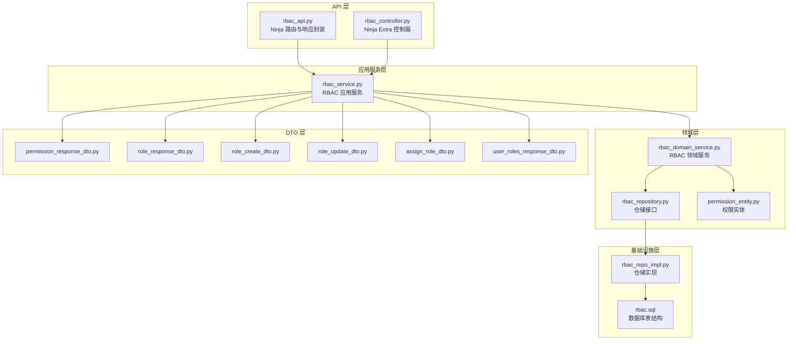
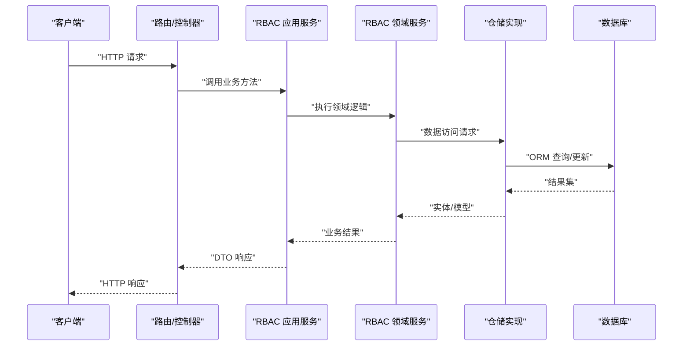
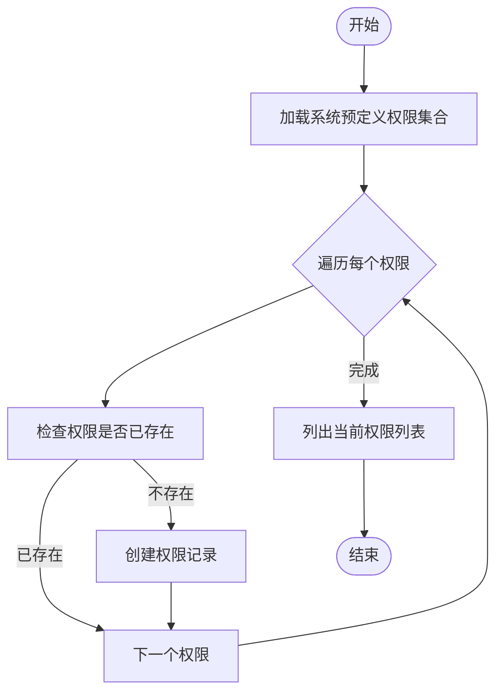
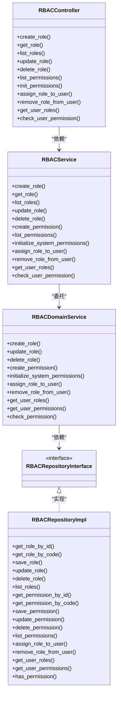

# 权限管理功能

<cite>
**本文档引用的文件**
- [rbac_api.py](file://src/api/v1/rbac_api.py)
- [rbac_controller.py](file://src/api/v1/controllers/rbac_controller.py)
- [rbac_service.py](file://src/application/services/rbac_service.py)
- [rbac_domain_service.py](file://src/domain/rbac/services/rbac_domain_service.py)
- [rbac_repository.py](file://src/domain/rbac/repositories/rbac_repository.py)
- [rbac_repo_impl.py](file://src/infrastructure/repositories/rbac_repo_impl.py)
- [permission_response_dto.py](file://src/application/dto/rbac/permission_response_dto.py)
- [role_response_dto.py](file://src/application/dto/rbac/role_response_dto.py)
- [role_create_dto.py](file://src/application/dto/rbac/role_create_dto.py)
- [role_update_dto.py](file://src/application/dto/rbac/role_update_dto.py)
- [assign_role_dto.py](file://src/application/dto/rbac/assign_role_dto.py)
- [user_roles_response_dto.py](file://src/application/dto/rbac/user_roles_response_dto.py)
- [permission_entity.py](file://src/domain/rbac/entities/permission_entity.py)
- [rbac.sql](file://sql/rbac.sql)
- [init_admin.py](file://scripts/init_admin.py)
</cite>

## 目录
1. [简介](#简介)
2. [项目结构](#项目结构)
3. [核心组件](#核心组件)
4. [架构总览](#架构总览)
5. [详细组件分析](#详细组件分析)
6. [依赖关系分析](#依赖关系分析)
7. [性能考量](#性能考量)
8. [故障排查指南](#故障排查指南)
9. [结论](#结论)
10. [附录](#附录)

## 简介
本文件系统性阐述权限管理功能的完整实现，涵盖权限与角色的创建、查询、状态管理与初始化流程；详解控制器与服务层的业务逻辑、仓储层的数据访问机制；说明响应 DTO 的字段设计与权限代码规范；提供 API 接口文档与初始化脚本说明，并总结最佳实践与安全注意事项。

## 项目结构
权限管理模块采用分层架构：API 层负责请求入口与响应封装；应用服务层承载业务规则与流程编排；领域服务与仓储接口定义抽象契约；仓储实现对接数据库模型；DTO 负责跨层数据传输与序列化。

图表来源
- [rbac_api.py:1-184](file://src/api/v1/rbac_api.py#L1-L184)
- [rbac_controller.py:1-351](file://src/api/v1/controllers/rbac_controller.py#L1-L351)
- [rbac_service.py:1-286](file://src/application/services/rbac_service.py#L1-L286)
- [rbac_domain_service.py:1-144](file://src/domain/rbac/services/rbac_domain_service.py#L1-L144)
- [rbac_repository.py:1-112](file://src/domain/rbac/repositories/rbac_repository.py#L1-L112)
- [rbac_repo_impl.py:1-253](file://src/infrastructure/repositories/rbac_repo_impl.py#L1-L253)
- [permission_response_dto.py:1-25](file://src/application/dto/rbac/permission_response_dto.py#L1-L25)
- [role_response_dto.py:1-26](file://src/application/dto/rbac/role_response_dto.py#L1-L26)
- [role_create_dto.py:1-30](file://src/application/dto/rbac/role_create_dto.py#L1-L30)
- [role_update_dto.py:1-28](file://src/application/dto/rbac/role_update_dto.py#L1-L28)
- [assign_role_dto.py:1-21](file://src/application/dto/rbac/assign_role_dto.py#L1-L21)
- [user_roles_response_dto.py:1-17](file://src/application/dto/rbac/user_roles_response_dto.py#L1-L17)
- [permission_entity.py:1-85](file://src/domain/rbac/entities/permission_entity.py#L1-L85)
- [rbac.sql:1-232](file://sql/rbac.sql#L1-L232)

章节来源
- [rbac_api.py:1-184](file://src/api/v1/rbac_api.py#L1-L184)
- [rbac_controller.py:1-351](file://src/api/v1/controllers/rbac_controller.py#L1-L351)
- [rbac_service.py:1-286](file://src/application/services/rbac_service.py#L1-L286)
- [rbac_repo_impl.py:1-253](file://src/infrastructure/repositories/rbac_repo_impl.py#L1-L253)

## 核心组件
- 权限控制器与路由：提供角色、权限、用户角色关联的 HTTP 接口，支持列表查询、详情获取、创建、更新、删除、初始化、权限校验等。
- 应用服务：封装业务规则，包括权限与角色的创建/更新/删除、权限初始化、用户角色分配与权限校验、缓存更新与失效。
- 领域服务与仓储接口：定义角色/权限/用户角色关联的领域逻辑与数据访问契约。
- 仓储实现：基于 Django ORM 的异步查询、过滤、排序与关联加载。
- DTO 设计：统一响应结构，明确字段含义与约束，确保前后端一致的数据契约。
- 实体与初始化：权限实体定义权限代码规范与状态标识，系统预定义权限集合用于初始化。

章节来源
- [rbac_api.py:109-128](file://src/api/v1/rbac_api.py#L109-L128)
- [rbac_controller.py:189-235](file://src/api/v1/controllers/rbac_controller.py#L189-L235)
- [rbac_service.py:115-167](file://src/application/services/rbac_service.py#L115-L167)
- [rbac_domain_service.py:85-109](file://src/domain/rbac/services/rbac_domain_service.py#L85-L109)
- [rbac_repo_impl.py:172-182](file://src/infrastructure/repositories/rbac_repo_impl.py#L172-L182)
- [permission_response_dto.py:11-24](file://src/application/dto/rbac/permission_response_dto.py#L11-L24)
- [role_response_dto.py:11-25](file://src/application/dto/rbac/role_response_dto.py#L11-L25)
- [permission_entity.py:65-84](file://src/domain/rbac/entities/permission_entity.py#L65-L84)

## 架构总览
下图展示从 API 到仓储的调用链路与关键职责划分：

图表来源
- [rbac_api.py:45-128](file://src/api/v1/rbac_api.py#L45-L128)
- [rbac_controller.py:66-235](file://src/api/v1/controllers/rbac_controller.py#L66-L235)
- [rbac_service.py:33-167](file://src/application/services/rbac_service.py#L33-L167)
- [rbac_domain_service.py:22-109](file://src/domain/rbac/services/rbac_domain_service.py#L22-L109)
- [rbac_repo_impl.py:50-182](file://src/infrastructure/repositories/rbac_repo_impl.py#L50-L182)

## 详细组件分析

### 权限控制器与路由
- 路由层（Ninja）：定义权限列表查询、权限初始化、角色 CRUD、用户角色分配与权限校验等接口。
- 控制器层（Ninja Extra）：以类形式组织 API，注入 RBACService，统一处理异常与响应格式。
- 关键接口
  - 获取权限列表：支持按激活状态与资源类型过滤。
  - 初始化系统权限：批量创建预定义权限。
  - 角色管理：创建、查询、更新、删除角色。
  - 用户角色关联：分配角色、移除角色、获取用户角色与权限、检查用户权限。

章节来源
- [rbac_api.py:109-128](file://src/api/v1/rbac_api.py#L109-L128)
- [rbac_api.py:45-104](file://src/api/v1/rbac_api.py#L45-L104)
- [rbac_api.py:172-183](file://src/api/v1/rbac_api.py#L172-L183)
- [rbac_controller.py:189-235](file://src/api/v1/controllers/rbac_controller.py#L189-L235)
- [rbac_controller.py:66-185](file://src/api/v1/controllers/rbac_controller.py#L66-L185)
- [rbac_controller.py:326-350](file://src/api/v1/controllers/rbac_controller.py#L326-L350)

### 应用服务层（RBACService）
- 角色管理
  - 创建角色：校验唯一性、持久化、建立权限关联。
  - 更新角色：禁止修改系统角色、更新字段、重新绑定权限。
  - 删除角色：禁止删除系统角色。
  - 列表查询：支持按激活状态过滤。
- 权限管理
  - 创建权限：校验唯一性、解析资源与动作、持久化。
  - 列表查询：支持按激活状态与资源过滤。
  - 初始化系统权限：遍历预定义集合，未存在则创建。
- 用户角色关联
  - 分配角色：校验用户与角色存在性与状态，避免重复分配，清除缓存。
  - 移除角色：删除关联并清理缓存。
  - 获取用户角色与权限：聚合用户角色与权限代码。
  - 检查用户权限：优先读取缓存，未命中则查询数据库并回填缓存。
- DTO 映射：将模型/实体转换为响应 DTO。

章节来源
- [rbac_service.py:33-106](file://src/application/services/rbac_service.py#L33-L106)
- [rbac_service.py:115-167](file://src/application/services/rbac_service.py#L115-L167)
- [rbac_service.py:171-251](file://src/application/services/rbac_service.py#L171-L251)
- [rbac_service.py:255-281](file://src/application/services/rbac_service.py#L255-L281)

### 领域服务与仓储接口
- 领域服务：封装核心业务规则，如系统角色保护、权限代码唯一性、用户权限计算等。
- 仓储接口：定义角色、权限、用户角色关联的抽象方法，保证应用服务与实现解耦。

章节来源
- [rbac_domain_service.py:22-73](file://src/domain/rbac/services/rbac_domain_service.py#L22-L73)
- [rbac_domain_service.py:85-115](file://src/domain/rbac/services/rbac_domain_service.py#L85-L115)
- [rbac_domain_service.py:119-143](file://src/domain/rbac/services/rbac_domain_service.py#L119-L143)
- [rbac_repository.py:22-111](file://src/domain/rbac/repositories/rbac_repository.py#L22-L111)

### 仓储实现（RBACRepositoryImpl）
- 角色操作：按 ID/Code 查询、保存/更新、删除、列表过滤。
- 权限操作：按 ID/Code 查询、保存/更新、删除、列表过滤（支持激活状态与资源过滤）。
- 用户角色关联：分配角色、移除角色、获取用户角色、获取用户权限（含去重与激活过滤）、检查用户是否拥有某权限。
- 性能优化：使用 select_related/prefetch_related 减少 N+1 查询。

章节来源
- [rbac_repo_impl.py:50-105](file://src/infrastructure/repositories/rbac_repo_impl.py#L50-L105)
- [rbac_repo_impl.py:135-182](file://src/infrastructure/repositories/rbac_repo_impl.py#L135-L182)
- [rbac_repo_impl.py:186-248](file://src/infrastructure/repositories/rbac_repo_impl.py#L186-L248)

### 权限响应 DTO 与权限实体
- 权限响应 DTO：定义权限 ID、名称、代码、资源、动作、描述、激活状态、创建时间等字段。
- 角色响应 DTO：定义角色 ID、名称、代码、权限代码列表、系统标记、激活状态、时间戳等。
- 权限实体：定义权限代码规范（支持“资源:动作”格式自动解析）、激活/停用方法、字典序列化。

章节来源
- [permission_response_dto.py:11-24](file://src/application/dto/rbac/permission_response_dto.py#L11-L24)
- [role_response_dto.py:11-25](file://src/application/dto/rbac/role_response_dto.py#L11-L25)
- [permission_entity.py:18-47](file://src/domain/rbac/entities/permission_entity.py#L18-L47)

### 角色与权限 DTO
- 角色创建 DTO：包含名称、代码、描述、权限代码列表。
- 角色更新 DTO：可选字段更新。
- 分配角色 DTO：用户 ID 与角色 ID。
- 用户角色响应 DTO：用户 ID、角色列表、权限代码列表。

章节来源
- [role_create_dto.py:9-29](file://src/application/dto/rbac/role_create_dto.py#L9-L29)
- [role_update_dto.py:9-27](file://src/application/dto/rbac/role_update_dto.py#L9-L27)
- [assign_role_dto.py:9-20](file://src/application/dto/rbac/assign_role_dto.py#L9-L20)
- [user_roles_response_dto.py:11-16](file://src/application/dto/rbac/user_roles_response_dto.py#L11-L16)

### 权限初始化流程
- 预定义权限集合：包含用户、角色、权限、系统、API 等维度的标准权限。
- 初始化策略：若权限不存在则创建，返回当前权限列表。

图表来源
- [rbac_service.py:152-167](file://src/application/services/rbac_service.py#L152-L167)
- [permission_entity.py:65-84](file://src/domain/rbac/entities/permission_entity.py#L65-L84)

## 依赖关系分析
- 控制器依赖应用服务；应用服务依赖仓储实现与 DTO；仓储实现依赖数据库模型。
- 领域服务与仓储接口形成抽象层，便于替换实现与单元测试。
- DTO 作为跨层契约，避免直接暴露模型细节。

图表来源
- [rbac_controller.py:39-350](file://src/api/v1/controllers/rbac_controller.py#L39-L350)
- [rbac_service.py:22-285](file://src/application/services/rbac_service.py#L22-L285)
- [rbac_domain_service.py:11-143](file://src/domain/rbac/services/rbac_domain_service.py#L11-L143)
- [rbac_repository.py:12-111](file://src/domain/rbac/repositories/rbac_repository.py#L12-L111)
- [rbac_repo_impl.py:15-252](file://src/infrastructure/repositories/rbac_repo_impl.py#L15-L252)

章节来源
- [rbac_controller.py:39-350](file://src/api/v1/controllers/rbac_controller.py#L39-L350)
- [rbac_service.py:22-285](file://src/application/services/rbac_service.py#L22-L285)
- [rbac_repo_impl.py:15-252](file://src/infrastructure/repositories/rbac_repo_impl.py#L15-L252)

## 性能考量
- 查询优化
  - 使用 select_related/prefetch_related 避免 N+1 查询。
  - 列表查询支持按 is_active 与 resource 过滤，减少结果集大小。
- 缓存策略
  - 用户权限检查优先读取缓存；角色变更后主动清理缓存，保证一致性。
- 异步 ORM
  - 应用服务与仓储均使用异步 ORM 方法，提升并发性能。

章节来源
- [rbac_repo_impl.py:203-248](file://src/infrastructure/repositories/rbac_repo_impl.py#L203-L248)
- [rbac_service.py:233-251](file://src/application/services/rbac_service.py#L233-L251)

## 故障排查指南
- 常见错误与处理
  - 角色/权限不存在：在查询与更新/删除时抛出明确错误。
  - 系统角色保护：禁止修改或删除系统角色。
  - 用户/角色状态：分配角色前检查角色是否激活。
  - 重复分配：避免重复分配同一角色给同一用户。
  - 权限代码冲突：创建权限前检查唯一性。
- 建议排查步骤
  - 确认输入参数与 DTO 字段约束。
  - 检查数据库中角色/权限是否存在且状态正常。
  - 查看缓存是否需要清理以刷新权限视图。
  - 核对权限代码格式与预定义集合。

章节来源
- [rbac_service.py:74-106](file://src/application/services/rbac_service.py#L74-L106)
- [rbac_service.py:171-205](file://src/application/services/rbac_service.py#L171-L205)
- [rbac_repo_impl.py:186-194](file://src/infrastructure/repositories/rbac_repo_impl.py#L186-L194)

## 结论
该权限管理模块遵循清晰的分层架构与领域驱动设计，通过 DTO 统一数据契约，应用服务编排业务流程，仓储实现数据访问，具备良好的扩展性与可维护性。结合缓存与异步 ORM，满足高并发场景下的权限查询与校验需求。

## 附录

### API 接口文档

- 权限列表查询
  - 方法与路径：GET /v1/rbac/permissions
  - 查询参数：
    - is_active: bool（可选），按激活状态过滤
    - resource: str（可选），按资源类型过滤
  - 响应：包含 permissions（权限列表）与 total（总数）

- 初始化系统权限
  - 方法与路径：POST /v1/rbac/permissions/init
  - 响应：消息提示初始化成功

- 角色管理
  - 创建角色：POST /v1/rbac/roles
  - 获取角色详情：GET /v1/rbac/roles/{role_id}
  - 获取角色列表：GET /v1/rbac/roles
  - 更新角色：PUT /v1/rbac/roles/{role_id}
  - 删除角色：DELETE /v1/rbac/roles/{role_id}

- 用户角色关联
  - 分配角色给用户：POST /v1/rbac/users/{user_id}/roles
  - 从用户移除角色：DELETE /v1/rbac/users/{user_id}/roles/{role_id}
  - 获取用户角色与权限：GET /v1/rbac/users/{user_id}/roles
  - 检查用户权限：GET /v1/rbac/users/{user_id}/permissions/check

章节来源
- [rbac_api.py:109-183](file://src/api/v1/rbac_api.py#L109-L183)
- [rbac_controller.py:189-350](file://src/api/v1/controllers/rbac_controller.py#L189-L350)

### 权限代码规范与状态标识
- 权限代码规范
  - 支持“资源:动作”格式，系统会自动解析 resource 与 action。
  - 预定义权限覆盖用户、角色、权限、系统、API 等维度。
- 状态标识
  - is_active：表示权限是否激活。
  - is_system：表示是否为系统内置权限（受保护）。

章节来源
- [permission_entity.py:18-47](file://src/domain/rbac/entities/permission_entity.py#L18-L47)
- [permission_entity.py:65-84](file://src/domain/rbac/entities/permission_entity.py#L65-L84)
- [permission_response_dto.py:14-20](file://src/application/dto/rbac/permission_response_dto.py#L14-L20)
- [role_response_dto.py:18-20](file://src/application/dto/rbac/role_response_dto.py#L18-L20)

### 数据库表结构说明
- 相关表：用户表、角色表、角色-菜单关联表、用户-角色关联表、菜单表、菜单元信息表、操作日志表等。
- 权限与角色通过中间表进行多对多关联，支持按激活状态过滤与权限继承。

章节来源
- [rbac.sql:196-231](file://sql/rbac.sql#L196-L231)

### 初始化脚本说明
- 脚本功能：执行数据库迁移、创建初始管理员账号。
- 执行方式：通过脚本运行 Django 命令，避免导入链问题。
- 注意事项：生产环境需及时修改默认密码。

章节来源
- [init_admin.py:19-84](file://scripts/init_admin.py#L19-L84)