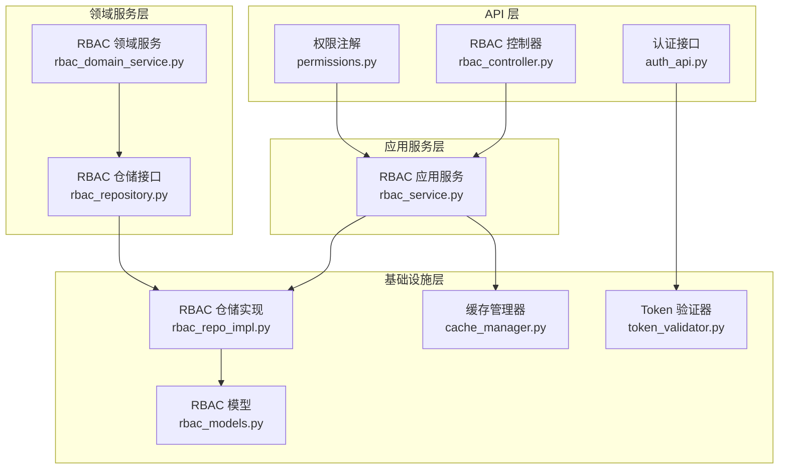
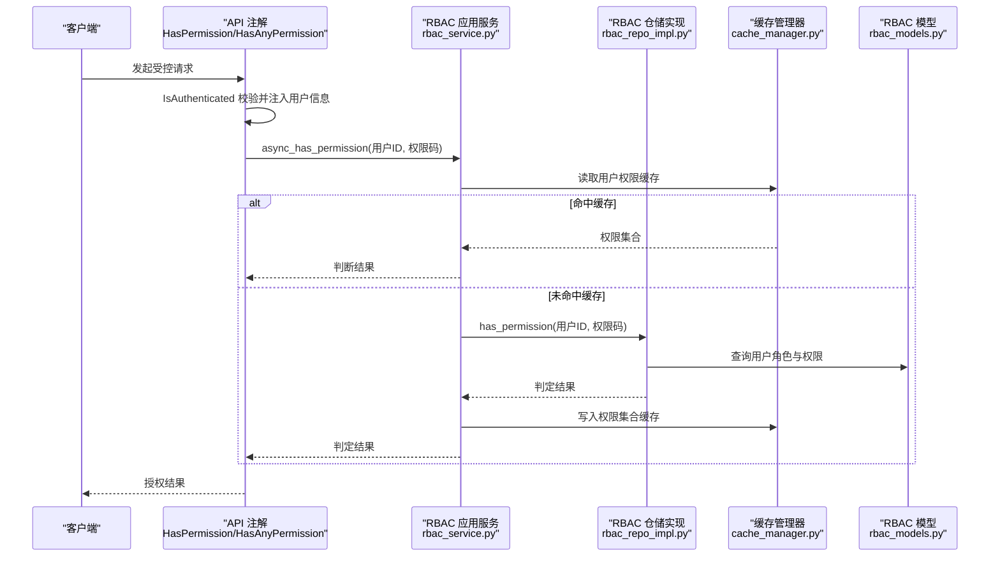
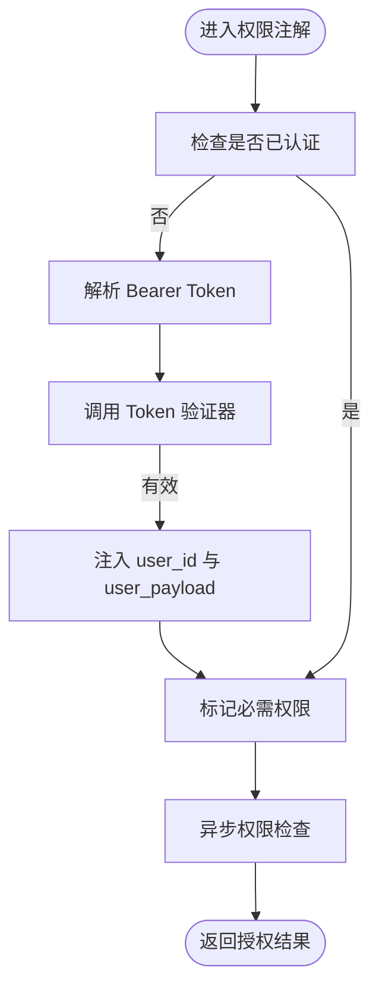
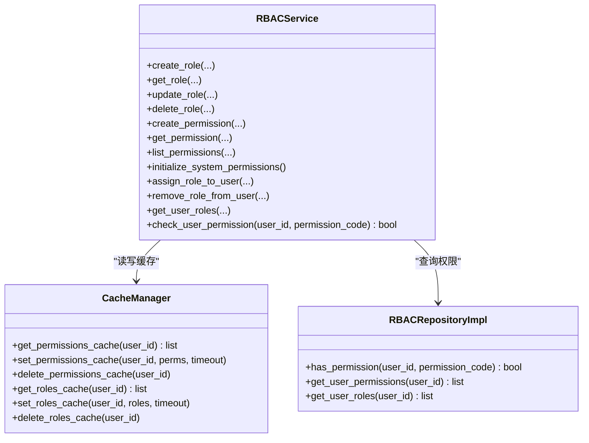
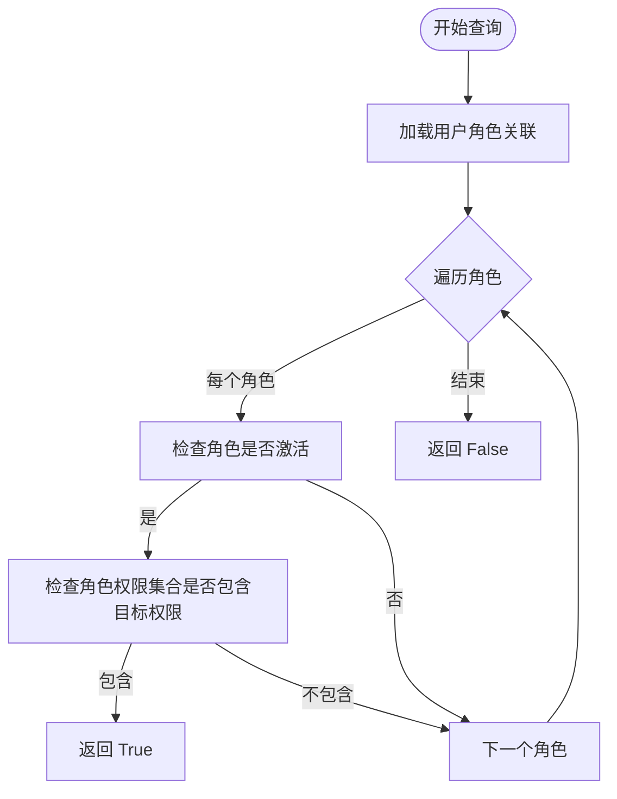
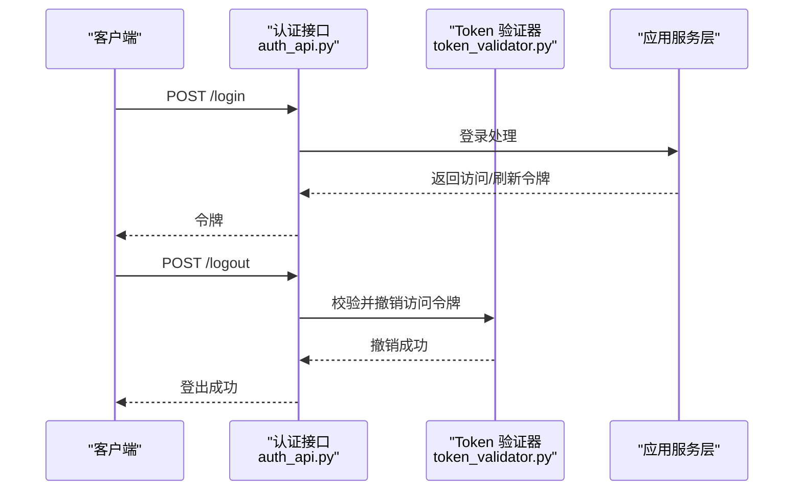
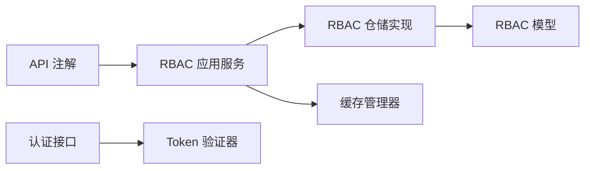

# 权限验证机制

<cite>
**本文档引用的文件**
- [src/api/common/permissions.py](file://src/api/common/permissions.py)
- [src/application/services/rbac_service.py](file://src/application/services/rbac_service.py)
- [src/domain/rbac/services/rbac_domain_service.py](file://src/domain/rbac/services/rbac_domain_service.py)
- [src/domain/rbac/repositories/rbac_repository.py](file://src/domain/rbac/repositories/rbac_repository.py)
- [src/infrastructure/repositories/rbac_repo_impl.py](file://src/infrastructure/repositories/rbac_repo_impl.py)
- [src/infrastructure/cache/cache_manager.py](file://src/infrastructure/cache/cache_manager.py)
- [src/infrastructure/auth_jwt/token_validator.py](file://src/infrastructure/auth_jwt/token_validator.py)
- [src/api/v1/controllers/rbac_controller.py](file://src/api/v1/controllers/rbac_controller.py)
- [src/domain/rbac/entities/permission_entity.py](file://src/domain/rbac/entities/permission_entity.py)
- [src/infrastructure/persistence/models/rbac_models.py](file://src/infrastructure/persistence/models/rbac_models.py)
- [src/api/v1/auth_api.py](file://src/api/v1/auth_api.py)
- [src/application/dto/rbac/permission_response_dto.py](file://src/application/dto/rbac/permission_response_dto.py)
</cite>

## 目录
1. [简介](#简介)
2. [项目结构](#项目结构)
3. [核心组件](#核心组件)
4. [架构总览](#架构总览)
5. [详细组件分析](#详细组件分析)
6. [依赖分析](#依赖分析)
7. [性能考量](#性能考量)
8. [故障排查指南](#故障排查指南)
9. [结论](#结论)
10. [附录：使用示例与最佳实践](#附录使用示例与最佳实践)

## 简介
本文件系统性阐述本项目的权限验证机制，覆盖用户权限检查、中间件权限拦截、API 级别权限控制、服务层权限计算与缓存策略、仓储层权限数据查询与关系解析等。文档同时给出流程图与时序图，帮助读者快速理解从请求到授权决策的完整链路。

## 项目结构
围绕权限验证的关键目录与文件如下：
- API 层：权限注解与控制器
  - src/api/common/permissions.py：权限注解（IsAuthenticated、HasPermission、HasAnyPermission、IsAdminUser、AllowAny）
  - src/api/v1/controllers/rbac_controller.py：RBAC 控制器，提供权限检查接口
  - src/api/v1/auth_api.py：认证相关接口，配合 Token 验证
- 应用服务层：权限业务逻辑
  - src/application/services/rbac_service.py：RBAC 应用服务，负责权限检查、缓存与角色/权限管理
- 领域服务层：核心业务规则
  - src/domain/rbac/services/rbac_domain_service.py：角色/权限/用户关系的领域服务
  - src/domain/rbac/repositories/rbac_repository.py：RBAC 仓储接口
- 基础设施层：数据持久化与缓存
  - src/infrastructure/repositories/rbac_repo_impl.py：RBAC 仓储实现（ORM 查询、权限树构建）
  - src/infrastructure/cache/cache_manager.py：统一缓存管理（用户角色/权限缓存）
  - src/infrastructure/persistence/models/rbac_models.py：RBAC 模型（Permission、Role、UserRole）
  - src/infrastructure/auth_jwt/token_validator.py：JWT 验证与黑名单检查
- 领域实体与 DTO
  - src/domain/rbac/entities/permission_entity.py：权限实体与系统预定义权限
  - src/application/dto/rbac/permission_response_dto.py：权限响应 DTO

图表来源
- [src/api/common/permissions.py:1-245](file://src/api/common/permissions.py#L1-L245)
- [src/application/services/rbac_service.py:1-286](file://src/application/services/rbac_service.py#L1-L286)
- [src/domain/rbac/services/rbac_domain_service.py:1-144](file://src/domain/rbac/services/rbac_domain_service.py#L1-L144)
- [src/domain/rbac/repositories/rbac_repository.py:1-112](file://src/domain/rbac/repositories/rbac_repository.py#L1-L112)
- [src/infrastructure/repositories/rbac_repo_impl.py:1-253](file://src/infrastructure/repositories/rbac_repo_impl.py#L1-L253)
- [src/infrastructure/cache/cache_manager.py:1-149](file://src/infrastructure/cache/cache_manager.py#L1-L149)
- [src/infrastructure/persistence/models/rbac_models.py:1-148](file://src/infrastructure/persistence/models/rbac_models.py#L1-L148)
- [src/infrastructure/auth_jwt/token_validator.py:1-108](file://src/infrastructure/auth_jwt/token_validator.py#L1-L108)
- [src/api/v1/controllers/rbac_controller.py:1-351](file://src/api/v1/controllers/rbac_controller.py#L1-L351)
- [src/api/v1/auth_api.py:1-74](file://src/api/v1/auth_api.py#L1-L74)

章节来源
- [src/api/common/permissions.py:1-245](file://src/api/common/permissions.py#L1-L245)
- [src/application/services/rbac_service.py:1-286](file://src/application/services/rbac_service.py#L1-L286)
- [src/infrastructure/cache/cache_manager.py:1-149](file://src/infrastructure/cache/cache_manager.py#L1-L149)
- [src/infrastructure/auth_jwt/token_validator.py:1-108](file://src/infrastructure/auth_jwt/token_validator.py#L1-L108)
- [src/infrastructure/repositories/rbac_repo_impl.py:1-253](file://src/infrastructure/repositories/rbac_repo_impl.py#L1-L253)
- [src/infrastructure/persistence/models/rbac_models.py:1-148](file://src/infrastructure/persistence/models/rbac_models.py#L1-L148)
- [src/api/v1/controllers/rbac_controller.py:1-351](file://src/api/v1/controllers/rbac_controller.py#L1-L351)
- [src/api/v1/auth_api.py:1-74](file://src/api/v1/auth_api.py#L1-L74)

## 核心组件
- 权限注解（API 层）
  - IsAuthenticated：校验 Bearer Token 并将用户信息注入请求对象
  - HasPermission / HasAnyPermission：校验单个或任一权限，采用“同步标记 + 异步检查”的双阶段模式
  - IsAdminUser：基于 Token 载荷中的角色判断管理员
  - AllowAny：开放访问
- RBAC 应用服务（应用层）
  - 角色/权限 CRUD、用户角色分配与移除、用户权限检查、缓存读写与失效
- RBAC 仓储实现（基础设施层）
  - ORM 查询、用户角色/权限树构建、权限继承（角色聚合权限）、has_permission 判定
- 缓存管理器（基础设施层）
  - 用户权限/角色缓存键生成与读写，超时策略
- Token 验证器（基础设施层）
  - JWT 校验、类型检查、黑名单检查、撤销 Token

章节来源
- [src/api/common/permissions.py:14-245](file://src/api/common/permissions.py#L14-L245)
- [src/application/services/rbac_service.py:22-286](file://src/application/services/rbac_service.py#L22-L286)
- [src/infrastructure/repositories/rbac_repo_impl.py:15-253](file://src/infrastructure/repositories/rbac_repo_impl.py#L15-L253)
- [src/infrastructure/cache/cache_manager.py:16-149](file://src/infrastructure/cache/cache_manager.py#L16-L149)
- [src/infrastructure/auth_jwt/token_validator.py:11-108](file://src/infrastructure/auth_jwt/token_validator.py#L11-L108)

## 架构总览
下图展示从请求进入 API 注解，到服务层与仓储层的调用路径，以及缓存与模型交互：

图表来源
- [src/api/common/permissions.py:67-120](file://src/api/common/permissions.py#L67-L120)
- [src/application/services/rbac_service.py:233-251](file://src/application/services/rbac_service.py#L233-L251)
- [src/infrastructure/repositories/rbac_repo_impl.py:230-248](file://src/infrastructure/repositories/rbac_repo_impl.py#L230-L248)
- [src/infrastructure/cache/cache_manager.py:108-122](file://src/infrastructure/cache/cache_manager.py#L108-L122)
- [src/infrastructure/persistence/models/rbac_models.py:13-114](file://src/infrastructure/persistence/models/rbac_models.py#L13-L114)

## 详细组件分析

### 权限注解与中间件拦截机制
- 同步阶段（has_permission）
  - 若请求未携带用户 ID，则尝试从 Authorization 头解析 Bearer Token 并调用 Token 验证器
  - 通过验证后，将 user_id 与 user_payload 注入 request，并设置异步检查所需的“必需权限”标记
- 异步阶段（async_has_permission）
  - 从 request 中取出 user_id 与“必需权限”，调用 RBAC 应用服务执行权限检查
  - 应用服务再委托仓储实现完成数据库判定，并进行缓存读写

图表来源
- [src/api/common/permissions.py:78-101](file://src/api/common/permissions.py#L78-L101)
- [src/api/common/permissions.py:103-120](file://src/api/common/permissions.py#L103-L120)
- [src/infrastructure/auth_jwt/token_validator.py:21-45](file://src/infrastructure/auth_jwt/token_validator.py#L21-L45)

章节来源
- [src/api/common/permissions.py:14-245](file://src/api/common/permissions.py#L14-L245)
- [src/infrastructure/auth_jwt/token_validator.py:11-108](file://src/infrastructure/auth_jwt/token_validator.py#L11-L108)

### RBAC 应用服务（权限计算与缓存策略）
- 角色/权限管理：创建、查询、更新、删除；系统权限初始化
- 用户角色管理：分配角色、移除角色、获取用户角色与权限
- 权限检查：
  - 优先从缓存读取用户权限集合
  - 未命中则调用仓储实现的 has_permission 判定
  - 将用户所有角色的权限集合写入缓存，提升后续查询性能
- 缓存键设计：
  - 用户权限缓存键：rbac:permissions:{user_id}
  - 用户角色缓存键：rbac:roles:{user_id}
  - 默认超时：权限缓存约 10 分钟，角色缓存约 10 分钟

图表来源
- [src/application/services/rbac_service.py:22-286](file://src/application/services/rbac_service.py#L22-L286)
- [src/infrastructure/cache/cache_manager.py:16-149](file://src/infrastructure/cache/cache_manager.py#L16-L149)
- [src/infrastructure/repositories/rbac_repo_impl.py:15-253](file://src/infrastructure/repositories/rbac_repo_impl.py#L15-L253)

章节来源
- [src/application/services/rbac_service.py:22-286](file://src/application/services/rbac_service.py#L22-L286)
- [src/infrastructure/cache/cache_manager.py:16-149](file://src/infrastructure/cache/cache_manager.py#L16-L149)

### 仓储实现（权限数据查询与权限树构建）
- has_permission：按用户角色链路逐级检查，仅当角色激活且角色权限集合包含目标权限时返回真
- get_user_permissions：聚合用户所有角色的权限集合，去重后返回
- get_user_roles：查询用户关联角色并加载权限集合
- 权限关系解析：
  - 用户 → 多个角色 → 角色拥有多个权限
  - 通过 select_related/prefetch_related 降低 N+1 查询风险

图表来源
- [src/infrastructure/repositories/rbac_repo_impl.py:230-248](file://src/infrastructure/repositories/rbac_repo_impl.py#L230-L248)
- [src/infrastructure/persistence/models/rbac_models.py:79-114](file://src/infrastructure/persistence/models/rbac_models.py#L79-L114)

章节来源
- [src/infrastructure/repositories/rbac_repo_impl.py:15-253](file://src/infrastructure/repositories/rbac_repo_impl.py#L15-L253)
- [src/infrastructure/persistence/models/rbac_models.py:13-148](file://src/infrastructure/persistence/models/rbac_models.py#L13-L148)

### Token 验证与安全控制
- Token 验证器负责：
  - JWT 校验与过期检查
  - 类型校验（access/refresh）
  - 黑名单检查（基于缓存）
  - 撤销 Token（将 jti 加入黑名单）
- 认证 API：
  - 登录：返回访问令牌与刷新令牌
  - 刷新：使用刷新令牌换取新的访问令牌
  - 登出：撤销当前访问令牌

图表来源
- [src/api/v1/auth_api.py:22-74](file://src/api/v1/auth_api.py#L22-L74)
- [src/infrastructure/auth_jwt/token_validator.py:21-103](file://src/infrastructure/auth_jwt/token_validator.py#L21-L103)

章节来源
- [src/api/v1/auth_api.py:1-74](file://src/api/v1/auth_api.py#L1-L74)
- [src/infrastructure/auth_jwt/token_validator.py:11-108](file://src/infrastructure/auth_jwt/token_validator.py#L11-L108)

### API 级别权限控制（RBAC 控制器）
- 提供权限检查接口：GET /v1/rbac/users/{user_id}/permissions/check
- 该接口直接调用 RBAC 应用服务的权限检查方法，返回布尔结果
- 控制器本身未设置额外权限注解，但内部会依赖上文的权限注解链路

章节来源
- [src/api/v1/controllers/rbac_controller.py:321-351](file://src/api/v1/controllers/rbac_controller.py#L321-L351)
- [src/application/services/rbac_service.py:233-251](file://src/application/services/rbac_service.py#L233-L251)

## 依赖分析
- 松耦合设计
  - API 注解仅依赖 Token 验证器与应用服务
  - 应用服务通过仓储接口抽象与具体实现解耦
  - 仓储实现依赖 ORM 模型，提供稳定的查询接口
- 关键依赖链
  - API 注解 → 应用服务 → 仓储实现 → ORM 模型
  - 应用服务 → 缓存管理器
  - 认证 API → Token 验证器

图表来源
- [src/api/common/permissions.py:14-245](file://src/api/common/permissions.py#L14-L245)
- [src/application/services/rbac_service.py:22-286](file://src/application/services/rbac_service.py#L22-L286)
- [src/infrastructure/repositories/rbac_repo_impl.py:15-253](file://src/infrastructure/repositories/rbac_repo_impl.py#L15-L253)
- [src/infrastructure/cache/cache_manager.py:16-149](file://src/infrastructure/cache/cache_manager.py#L16-L149)
- [src/infrastructure/persistence/models/rbac_models.py:13-148](file://src/infrastructure/persistence/models/rbac_models.py#L13-L148)
- [src/api/v1/auth_api.py:1-74](file://src/api/v1/auth_api.py#L1-L74)
- [src/infrastructure/auth_jwt/token_validator.py:11-108](file://src/infrastructure/auth_jwt/token_validator.py#L11-L108)

章节来源
- [src/api/common/permissions.py:14-245](file://src/api/common/permissions.py#L14-L245)
- [src/application/services/rbac_service.py:22-286](file://src/application/services/rbac_service.py#L22-L286)
- [src/infrastructure/repositories/rbac_repo_impl.py:15-253](file://src/infrastructure/repositories/rbac_repo_impl.py#L15-L253)
- [src/infrastructure/cache/cache_manager.py:16-149](file://src/infrastructure/cache/cache_manager.py#L16-L149)
- [src/infrastructure/persistence/models/rbac_models.py:13-148](file://src/infrastructure/persistence/models/rbac_models.py#L13-L148)
- [src/api/v1/auth_api.py:1-74](file://src/api/v1/auth_api.py#L1-L74)
- [src/infrastructure/auth_jwt/token_validator.py:11-108](file://src/infrastructure/auth_jwt/token_validator.py#L11-L108)

## 性能考量
- 缓存优先策略
  - 权限检查优先读取缓存，避免重复数据库查询
  - 缓存键粒度细化至用户维度，减少跨用户污染
- 查询优化
  - 仓储实现使用 select_related/prefetch_related，降低 N+1 查询
  - 模型索引覆盖 code、resource、user、role 等高频查询字段
- 超时与失效
  - 权限缓存与角色缓存设置合理超时，平衡一致性与性能
  - 角色/权限变更时主动清理相关缓存键

章节来源
- [src/application/services/rbac_service.py:233-251](file://src/application/services/rbac_service.py#L233-L251)
- [src/infrastructure/cache/cache_manager.py:108-137](file://src/infrastructure/cache/cache_manager.py#L108-L137)
- [src/infrastructure/repositories/rbac_repo_impl.py:201-248](file://src/infrastructure/repositories/rbac_repo_impl.py#L201-L248)
- [src/infrastructure/persistence/models/rbac_models.py:29-37](file://src/infrastructure/persistence/models/rbac_models.py#L29-L37)
- [src/infrastructure/persistence/models/rbac_models.py:107-110](file://src/infrastructure/persistence/models/rbac_models.py#L107-L110)

## 故障排查指南
- 常见问题定位
  - Token 无效/过期/类型错误：检查 Token 验证器返回值与黑名单状态
  - 权限检查失败：确认用户是否拥有对应角色与权限，检查缓存是否陈旧
  - 角色/权限变更后仍显示旧权限：确认变更后是否清理了用户权限缓存
- 日志与调试
  - 缓存读写异常：查看缓存管理器的日志输出
  - 数据库查询异常：关注仓储实现的异常分支与 ORM 查询

章节来源
- [src/infrastructure/auth_jwt/token_validator.py:21-103](file://src/infrastructure/auth_jwt/token_validator.py#L21-L103)
- [src/application/services/rbac_service.py:201-217](file://src/application/services/rbac_service.py#L201-L217)
- [src/infrastructure/cache/cache_manager.py:42-82](file://src/infrastructure/cache/cache_manager.py#L42-L82)

## 结论
本项目的权限验证机制采用“注解 + 应用服务 + 仓储 + 缓存”的分层设计，结合 Token 验证与黑名单控制，实现了高效、可维护的 RBAC 权限体系。通过缓存与查询优化，系统在高并发场景下具备良好的性能表现；通过清晰的职责划分与接口抽象，便于扩展与演进。

## 附录：使用示例与最佳实践

### 在控制器中使用权限注解
- 在控制器类或方法上添加权限注解，例如：
  - 允许认证用户访问：IsAuthenticated
  - 必须拥有特定权限：HasPermission("user:read")
  - 至少满足一组权限之一：HasAnyPermission("user:read", "user:write")

章节来源
- [src/api/common/permissions.py:47-245](file://src/api/common/permissions.py#L47-L245)

### 在中间件中进行权限拦截
- 通过权限注解实现请求拦截与异步权限检查，无需额外中间件
- 如需全局安全策略，可在 API 注解层统一配置

章节来源
- [src/api/common/permissions.py:67-120](file://src/api/common/permissions.py#L67-L120)

### 在服务层进行权限检查
- 调用 RBAC 应用服务的权限检查方法，自动处理缓存与数据库查询
- 示例路径：[rbac_service.check_user_permission:233-251](file://src/application/services/rbac_service.py#L233-L251)

章节来源
- [src/application/services/rbac_service.py:233-251](file://src/application/services/rbac_service.py#L233-L251)

### 权限验证的实现策略
- 静态权限检查：通过权限注解在 API 层声明式控制
- 动态权限验证：在业务逻辑中调用应用服务进行实时判定
- 权限缓存优化：利用缓存管理器对用户权限与角色进行缓存，降低数据库压力

章节来源
- [src/api/common/permissions.py:67-120](file://src/api/common/permissions.py#L67-L120)
- [src/application/services/rbac_service.py:233-251](file://src/application/services/rbac_service.py#L233-L251)
- [src/infrastructure/cache/cache_manager.py:108-137](file://src/infrastructure/cache/cache_manager.py#L108-L137)

### 最佳实践与安全考虑
- 最小权限原则：为角色分配最小必要权限
- 定期审计：定期检查系统权限与用户权限映射
- 缓存一致性：角色/权限变更后及时清理缓存
- Token 安全：严格校验 Token 类型与黑名单，支持撤销与过期处理
- 查询优化：使用索引与预加载，避免 N+1 查询

章节来源
- [src/infrastructure/auth_jwt/token_validator.py:21-103](file://src/infrastructure/auth_jwt/token_validator.py#L21-L103)
- [src/infrastructure/repositories/rbac_repo_impl.py:201-248](file://src/infrastructure/repositories/rbac_repo_impl.py#L201-L248)
- [src/infrastructure/persistence/models/rbac_models.py:29-37](file://src/infrastructure/persistence/models/rbac_models.py#L29-L37)
- [src/infrastructure/persistence/models/rbac_models.py:107-110](file://src/infrastructure/persistence/models/rbac_models.py#L107-L110)