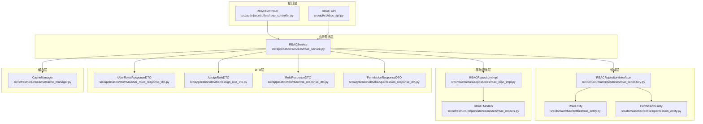
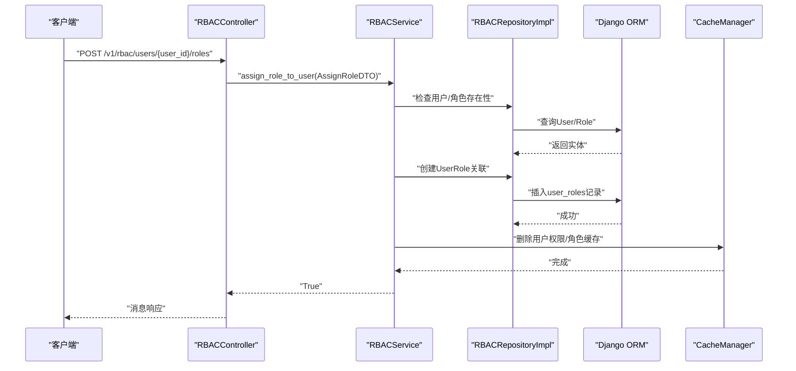
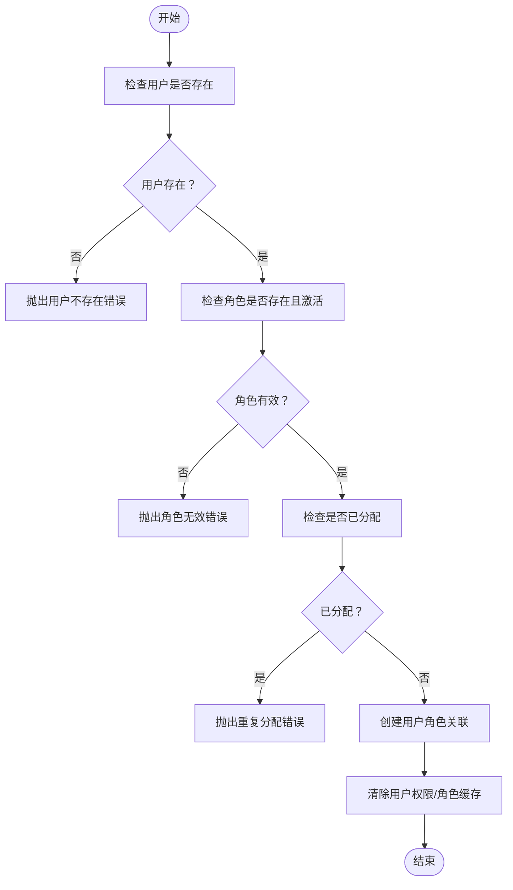
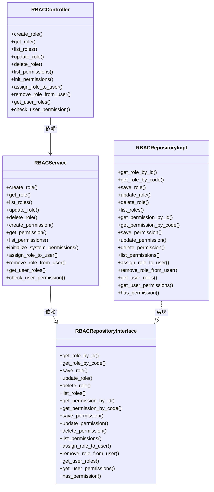

# 用户角色关联管理

<cite>
**本文档引用的文件**
- [rbac_controller.py](file://src/api/v1/controllers/rbac_controller.py)
- [rbac_api.py](file://src/api/v1/rbac_api.py)
- [rbac_service.py](file://src/application/services/rbac_service.py)
- [rbac_repository.py](file://src/domain/rbac/repositories/rbac_repository.py)
- [rbac_repo_impl.py](file://src/infrastructure/repositories/rbac_repo_impl.py)
- [user_roles_response_dto.py](file://src/application/dto/rbac/user_roles_response_dto.py)
- [assign_role_dto.py](file://src/application/dto/rbac/assign_role_dto.py)
- [role_response_dto.py](file://src/application/dto/rbac/role_response_dto.py)
- [permission_response_dto.py](file://src/application/dto/rbac/permission_response_dto.py)
- [role_entity.py](file://src/domain/rbac/entities/role_entity.py)
- [permission_entity.py](file://src/domain/rbac/entities/permission_entity.py)
- [rbac_models.py](file://src/infrastructure/persistence/models/rbac_models.py)
- [cache_manager.py](file://src/infrastructure/cache/cache_manager.py)
</cite>

## 目录
1. [简介](#简介)
2. [项目结构](#项目结构)
3. [核心组件](#核心组件)
4. [架构总览](#架构总览)
5. [详细组件分析](#详细组件分析)
6. [依赖关系分析](#依赖关系分析)
7. [性能考虑](#性能考虑)
8. [故障排除指南](#故障排除指南)
9. [结论](#结论)
10. [附录](#附录)

## 简介
本文件聚焦于用户角色关联管理，系统性阐述用户与角色之间的分配、移除与查询流程，覆盖控制器层、服务层、仓储层、数据传输对象（DTO）、领域实体与缓存策略。文档同时提供接口规范、最佳实践与性能优化建议，帮助开发者快速理解并安全高效地扩展权限体系。

## 项目结构
围绕用户角色关联管理的相关模块分布如下：
- 控制器层：提供REST接口，负责请求接收与响应封装
- 应用服务层：编排业务规则，协调仓储与缓存
- 领域层：定义角色与权限的实体与仓储接口契约
- 基础设施层：实现仓储接口，完成ORM模型与数据库交互
- DTO层：定义跨层数据传输结构
- 缓存层：提供用户权限与角色的缓存读写

图表来源
- [rbac_controller.py:38-351](file://src/api/v1/controllers/rbac_controller.py#L38-L351)
- [rbac_api.py:19-184](file://src/api/v1/rbac_api.py#L19-L184)
- [rbac_service.py:22-286](file://src/application/services/rbac_service.py#L22-L286)
- [rbac_repository.py:12-112](file://src/domain/rbac/repositories/rbac_repository.py#L12-L112)
- [rbac_repo_impl.py:15-253](file://src/infrastructure/repositories/rbac_repo_impl.py#L15-L253)
- [user_roles_response_dto.py:11-17](file://src/application/dto/rbac/user_roles_response_dto.py#L11-L17)
- [assign_role_dto.py:9-21](file://src/application/dto/rbac/assign_role_dto.py#L9-L21)
- [role_response_dto.py:11-26](file://src/application/dto/rbac/role_response_dto.py#L11-L26)
- [permission_response_dto.py:11-25](file://src/application/dto/rbac/permission_response_dto.py#L11-L25)
- [role_entity.py:11-80](file://src/domain/rbac/entities/role_entity.py#L11-L80)
- [permission_entity.py:11-85](file://src/domain/rbac/entities/permission_entity.py#L11-L85)
- [rbac_models.py:13-148](file://src/infrastructure/persistence/models/rbac_models.py#L13-L148)
- [cache_manager.py:16-149](file://src/infrastructure/cache/cache_manager.py#L16-L149)

章节来源
- [rbac_controller.py:38-351](file://src/api/v1/controllers/rbac_controller.py#L38-L351)
- [rbac_api.py:19-184](file://src/api/v1/rbac_api.py#L19-L184)
- [rbac_service.py:22-286](file://src/application/services/rbac_service.py#L22-L286)
- [rbac_repo_impl.py:15-253](file://src/infrastructure/repositories/rbac_repo_impl.py#L15-L253)

## 核心组件
- 用户角色控制器：提供角色分配、角色移除、用户角色查询、权限校验等接口
- RBAC服务：封装业务规则，包括角色分配验证、角色移除处理、用户权限计算与缓存更新
- 仓储接口与实现：抽象角色/权限/用户角色关联的数据访问契约与ORM实现
- DTO：定义用户角色查询响应、角色分配输入、角色/权限响应结构
- 实体：角色与权限的领域模型
- 缓存管理：提供用户权限与角色的缓存读取、写入与失效

章节来源
- [rbac_controller.py:38-351](file://src/api/v1/controllers/rbac_controller.py#L38-L351)
- [rbac_service.py:22-286](file://src/application/services/rbac_service.py#L22-L286)
- [rbac_repo_impl.py:15-253](file://src/infrastructure/repositories/rbac_repo_impl.py#L15-L253)
- [user_roles_response_dto.py:11-17](file://src/application/dto/rbac/user_roles_response_dto.py#L11-L17)
- [assign_role_dto.py:9-21](file://src/application/dto/rbac/assign_role_dto.py#L9-L21)
- [role_response_dto.py:11-26](file://src/application/dto/rbac/role_response_dto.py#L11-L26)
- [permission_response_dto.py:11-25](file://src/application/dto/rbac/permission_response_dto.py#L11-L25)
- [role_entity.py:11-80](file://src/domain/rbac/entities/role_entity.py#L11-L80)
- [permission_entity.py:11-85](file://src/domain/rbac/entities/permission_entity.py#L11-L85)
- [cache_manager.py:16-149](file://src/infrastructure/cache/cache_manager.py#L16-L149)

## 架构总览
用户角色关联管理遵循分层架构与依赖倒置原则：
- 控制器层仅负责HTTP请求/响应与参数校验
- 应用服务层编排业务规则，调用仓储与缓存
- 领域层定义接口契约，确保业务逻辑与数据访问解耦
- 基础设施层实现具体的数据访问与ORM映射
- DTO在各层之间传递数据，避免直接暴露ORM模型
- 缓存层提升权限查询性能，降低数据库压力

图表来源
- [rbac_controller.py:239-268](file://src/api/v1/controllers/rbac_controller.py#L239-L268)
- [rbac_service.py:171-205](file://src/application/services/rbac_service.py#L171-L205)
- [rbac_repo_impl.py:186-194](file://src/infrastructure/repositories/rbac_repo_impl.py#L186-L194)
- [cache_manager.py:108-137](file://src/infrastructure/cache/cache_manager.py#L108-L137)

## 详细组件分析

### 用户角色控制器（RBACController）
- 职责：提供角色管理、权限管理与用户角色关联的HTTP接口
- 关键接口
  - 分配角色给用户：POST /v1/rbac/users/{user_id}/roles
  - 从用户移除角色：DELETE /v1/rbac/users/{user_id}/roles/{role_id}
  - 获取用户角色权限：GET /v1/rbac/users/{user_id}/roles
  - 检查用户权限：GET /v1/rbac/users/{user_id}/permissions/check
- 设计要点
  - 使用Ninja Extra装饰器声明路由与响应类型
  - 通过构造函数注入RBACService，便于测试与替换
  - 对异常进行显式处理并返回标准化消息

章节来源
- [rbac_controller.py:38-351](file://src/api/v1/controllers/rbac_controller.py#L38-L351)

### RBAC服务（RBACService）
- 职责：实现业务规则与流程编排
- 核心功能
  - 角色分配：校验用户与角色存在性、角色状态、重复分配；创建关联并清除缓存
  - 角色移除：删除用户角色关联并清除缓存
  - 用户角色查询：聚合用户角色与权限，返回DTO
  - 权限校验：优先从缓存读取，未命中则查询数据库并回填缓存
- 错误处理：对不存在或状态异常场景抛出明确错误
- 性能优化：利用缓存减少重复查询

图表来源
- [rbac_service.py:171-205](file://src/application/services/rbac_service.py#L171-L205)

章节来源
- [rbac_service.py:22-286](file://src/application/services/rbac_service.py#L22-L286)

### 仓储接口与实现（RBACRepositoryInterface/RBACRepositoryImpl）
- 仓储接口：定义角色、权限与用户角色关联的抽象方法
- 仓储实现：基于Django ORM实现，包含
  - 角色与权限的增删改查
  - 用户角色关联的创建、删除、查询
  - 权限聚合与权限校验逻辑
- 性能特性：使用select_related/prefetch_related减少N+1查询

章节来源
- [rbac_repository.py:12-112](file://src/domain/rbac/repositories/rbac_repository.py#L12-L112)
- [rbac_repo_impl.py:15-253](file://src/infrastructure/repositories/rbac_repo_impl.py#L15-L253)

### 数据模型（RBAC Models）
- Permission：权限实体，包含code、resource、action等字段
- Role：角色实体，维护与Permission的多对多关系
- UserRole：用户角色关联表，记录用户与角色的多对多关系及分配信息
- 索引与约束：为常用查询字段建立索引，唯一联合索引防止重复分配

章节来源
- [rbac_models.py:13-148](file://src/infrastructure/persistence/models/rbac_models.py#L13-L148)

### DTO设计（UserRolesResponseDTO、AssignRoleDTO、RoleResponseDTO、PermissionResponseDTO）
- UserRolesResponseDTO：包含user_id、roles（RoleResponseDTO列表）、permissions（权限代码列表）
- AssignRoleDTO：包含user_id、role_id，用于角色分配
- RoleResponseDTO：角色基本信息与权限代码列表
- PermissionResponseDTO：权限基本信息，包含resource与action拆分

章节来源
- [user_roles_response_dto.py:11-17](file://src/application/dto/rbac/user_roles_response_dto.py#L11-L17)
- [assign_role_dto.py:9-21](file://src/application/dto/rbac/assign_role_dto.py#L9-L21)
- [role_response_dto.py:11-26](file://src/application/dto/rbac/role_response_dto.py#L11-L26)
- [permission_response_dto.py:11-25](file://src/application/dto/rbac/permission_response_dto.py#L11-L25)

### 领域实体（RoleEntity、PermissionEntity）
- RoleEntity：角色数据类，提供权限增删、激活/停用、序列化等方法
- PermissionEntity：权限数据类，支持从code自动解析resource与action

章节来源
- [role_entity.py:11-80](file://src/domain/rbac/entities/role_entity.py#L11-L80)
- [permission_entity.py:11-85](file://src/domain/rbac/entities/permission_entity.py#L11-L85)

### 缓存管理（CacheManager）
- 提供用户权限与角色缓存的读取、写入与删除
- 缓存键命名规范：hello_api:rbac:permissions:{user_id}、hello_api:rbac:roles:{user_id}
- 在角色分配/移除后主动清理对应缓存，保证一致性

章节来源
- [cache_manager.py:16-149](file://src/infrastructure/cache/cache_manager.py#L16-L149)

## 依赖关系分析
- 控制器依赖应用服务
- 应用服务依赖仓储接口与缓存管理
- 仓储实现依赖ORM模型
- DTO用于跨层数据传输
- 领域实体与仓储接口解耦

图表来源
- [rbac_controller.py:38-351](file://src/api/v1/controllers/rbac_controller.py#L38-L351)
- [rbac_service.py:22-286](file://src/application/services/rbac_service.py#L22-L286)
- [rbac_repository.py:12-112](file://src/domain/rbac/repositories/rbac_repository.py#L12-L112)
- [rbac_repo_impl.py:15-253](file://src/infrastructure/repositories/rbac_repo_impl.py#L15-L253)

章节来源
- [rbac_controller.py:38-351](file://src/api/v1/controllers/rbac_controller.py#L38-L351)
- [rbac_service.py:22-286](file://src/application/services/rbac_service.py#L22-L286)
- [rbac_repository.py:12-112](file://src/domain/rbac/repositories/rbac_repository.py#L12-L112)
- [rbac_repo_impl.py:15-253](file://src/infrastructure/repositories/rbac_repo_impl.py#L15-L253)

## 性能考虑
- 缓存策略
  - 权限缓存：用户权限集合按用户维度缓存，默认超时较短，配合主动失效
  - 角色缓存：用户角色列表缓存，与权限缓存协同使用
  - 主动失效：角色分配/移除后立即删除对应缓存键
- 查询优化
  - 使用select_related/prefetch_related减少数据库往返
  - 为常用过滤字段建立数据库索引
- 批量操作
  - 批量权限赋值可通过角色DTO中的permissions字段一次性设置
- 并发控制
  - 用户角色唯一性由数据库唯一索引保障，避免重复分配

[本节为通用性能建议，不直接分析具体文件]

## 故障排除指南
- 用户不存在
  - 现象：分配角色时报错“用户不存在”
  - 处理：确认user_id有效性与用户状态
- 角色不存在或未激活
  - 现象：分配角色时报错“角色不存在/角色已被停用”
  - 处理：检查角色是否存在且is_active为True
- 重复分配
  - 现象：分配报错“用户已拥有此角色”
  - 处理：先移除再重新分配，或直接跳过
- 移除失败
  - 现象：移除角色返回未生效
  - 处理：确认user_id与role_id组合是否存在
- 权限校验不准确
  - 现象：新分配的角色权限未即时生效
  - 处理：等待缓存过期或主动触发缓存清理

章节来源
- [rbac_service.py:171-217](file://src/application/services/rbac_service.py#L171-L217)
- [rbac_controller.py:245-298](file://src/api/v1/controllers/rbac_controller.py#L245-L298)

## 结论
该用户角色关联管理方案通过清晰的分层架构与严格的依赖倒置，实现了角色分配、移除与查询的完整闭环。结合缓存与ORM优化，系统在正确性与性能之间取得良好平衡。建议在生产环境中配合完善的监控与缓存清理策略，确保权限一致性与查询效率。

[本节为总结性内容，不直接分析具体文件]

## 附录

### API 接口文档

- 分配角色给用户
  - 方法：POST
  - 路径：/v1/rbac/users/{user_id}/roles
  - 请求体：AssignRoleDTO（包含user_id、role_id）
  - 响应：MessageResponse（成功消息）
  - 异常：用户不存在、角色不存在/未激活、重复分配
  - 章节来源
    - [rbac_controller.py:239-268](file://src/api/v1/controllers/rbac_controller.py#L239-L268)
    - [rbac_api.py:134-146](file://src/api/v1/rbac_api.py#L134-L146)

- 从用户移除角色
  - 方法：DELETE
  - 路径：/v1/rbac/users/{user_id}/roles/{role_id}
  - 响应：MessageResponse（成功消息）
  - 异常：用户没有此角色
  - 章节来源
    - [rbac_controller.py:269-299](file://src/api/v1/controllers/rbac_controller.py#L269-L299)
    - [rbac_api.py:148-159](file://src/api/v1/rbac_api.py#L148-L159)

- 获取用户角色权限
  - 方法：GET
  - 路径：/v1/rbac/users/{user_id}/roles
  - 响应：UserRolesResponseDTO（包含roles与permissions）
  - 章节来源
    - [rbac_controller.py:300-319](file://src/api/v1/controllers/rbac_controller.py#L300-L319)
    - [rbac_api.py:162-169](file://src/api/v1/rbac_api.py#L162-L169)

- 检查用户权限
  - 方法：GET
  - 路径：/v1/rbac/users/{user_id}/permissions/check
  - 查询参数：permission_code
  - 响应：包含user_id、permission_code、has_permission的字典
  - 章节来源
    - [rbac_controller.py:321-350](file://src/api/v1/controllers/rbac_controller.py#L321-L350)
    - [rbac_api.py:172-183](file://src/api/v1/rbac_api.py#L172-L183)

### 最佳实践
- 输入校验：始终在控制器层对关键参数进行校验
- 缓存一致性：任何角色/权限变更后必须清理相关缓存键
- 错误处理：对外统一抛出明确的业务异常，便于前端处理
- 性能优化：优先使用缓存，必要时引入批量查询与索引优化
- 安全性：对敏感操作增加鉴权与审计日志

[本节为通用最佳实践，不直接分析具体文件]