# 角色管理功能

<cite>
**本文档引用的文件**
- [rbac_controller.py](file://src/api/v1/controllers/rbac_controller.py)
- [rbac_api.py](file://src/api/v1/rbac_api.py)
- [rbac_service.py](file://src/application/services/rbac_service.py)
- [rbac_repo_impl.py](file://src/infrastructure/repositories/rbac_repo_impl.py)
- [role_entity.py](file://src/domain/rbac/entities/role_entity.py)
- [permission_entity.py](file://src/domain/rbac/entities/permission_entity.py)
- [rbac_repository.py](file://src/domain/rbac/repositories/rbac_repository.py)
- [rbac_models.py](file://src/infrastructure/persistence/models/rbac_models.py)
- [role_create_dto.py](file://src/application/dto/rbac/role_create_dto.py)
- [role_update_dto.py](file://src/application/dto/rbac/role_update_dto.py)
- [role_response_dto.py](file://src/application/dto/rbac/role_response_dto.py)
- [permission_response_dto.py](file://src/application/dto/rbac/permission_response_dto.py)
- [assign_role_dto.py](file://src/application/dto/rbac/assign_role_dto.py)
- [user_roles_response_dto.py](file://src/application/dto/rbac/user_roles_response_dto.py)
- [cache_manager.py](file://src/infrastructure/cache/cache_manager.py)
- [validation_error.py](file://src/core/exceptions/validation_error.py)
</cite>

## 目录
1. [简介](#简介)
2. [项目结构](#项目结构)
3. [核心组件](#核心组件)
4. [架构概览](#架构概览)
5. [详细组件分析](#详细组件分析)
6. [依赖关系分析](#依赖关系分析)
7. [性能考虑](#性能考虑)
8. [故障排除指南](#故障排除指南)
9. [结论](#结论)
10. [附录](#附录)

## 简介

本文件详细阐述了基于 Django Ninja 的角色管理功能实现。该系统采用分层架构设计，实现了完整的 RBAC（基于角色的访问控制）功能，包括角色的创建、查询、更新、删除等 CRUD 操作，以及权限管理和用户角色关联管理。

系统遵循 SOLID 原则，通过清晰的分层结构实现了关注点分离：API 控制器层负责 HTTP 接口和请求参数验证，应用服务层处理业务逻辑，仓储层负责数据持久化，领域实体层定义核心业务概念。

## 项目结构

角色管理功能在项目中的组织结构如下：

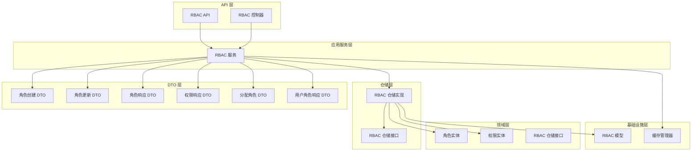

**图表来源**
- [rbac_controller.py:38-351](file://src/api/v1/controllers/rbac_controller.py#L38-L351)
- [rbac_api.py:19-184](file://src/api/v1/rbac_api.py#L19-L184)
- [rbac_service.py:22-286](file://src/application/services/rbac_service.py#L22-L286)

**章节来源**
- [rbac_controller.py:1-351](file://src/api/v1/controllers/rbac_controller.py#L1-L351)
- [rbac_api.py:1-184](file://src/api/v1/rbac_api.py#L1-L184)

## 核心组件

### 角色实体模型

角色实体是 RBAC 系统的核心业务概念，定义了角色的基本属性和行为：

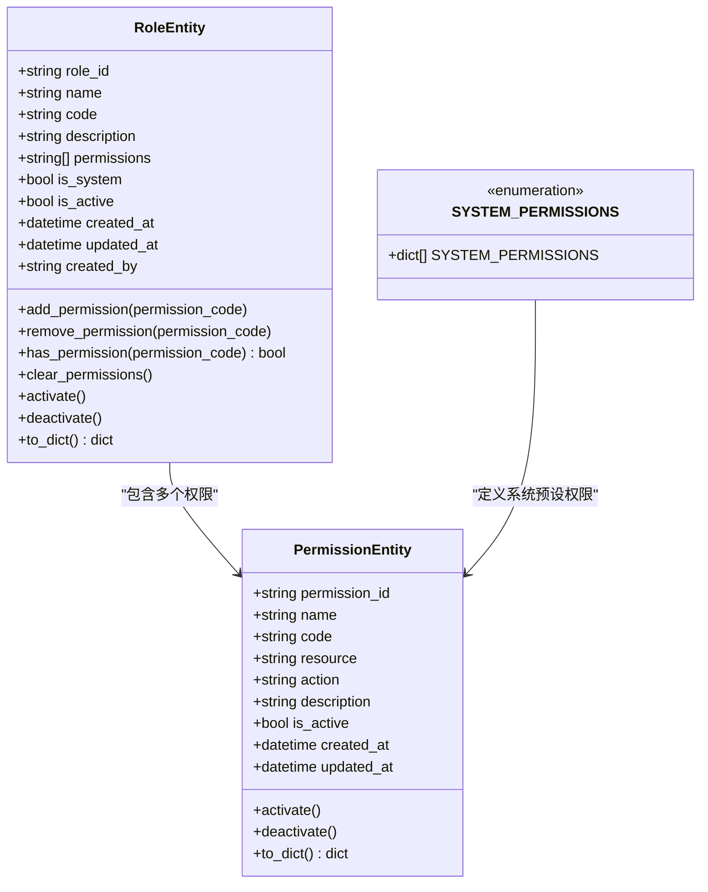

**图表来源**
- [role_entity.py:11-80](file://src/domain/rbac/entities/role_entity.py#L11-L80)
- [permission_entity.py:11-85](file://src/domain/rbac/entities/permission_entity.py#L11-L85)

### 数据传输对象（DTO）

系统采用 DTO 模式实现数据传输的标准化和验证：

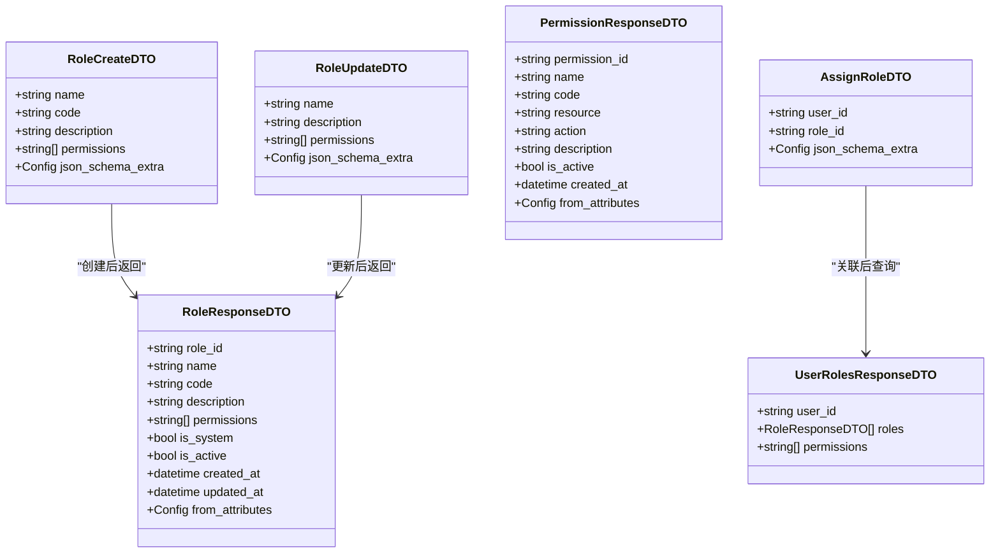

**图表来源**
- [role_create_dto.py:9-30](file://src/application/dto/rbac/role_create_dto.py#L9-L30)
- [role_update_dto.py:9-28](file://src/application/dto/rbac/role_update_dto.py#L9-L28)
- [role_response_dto.py:11-26](file://src/application/dto/rbac/role_response_dto.py#L11-L26)
- [permission_response_dto.py:11-25](file://src/application/dto/rbac/permission_response_dto.py#L11-L25)
- [assign_role_dto.py:9-21](file://src/application/dto/rbac/assign_role_dto.py#L9-L21)
- [user_roles_response_dto.py:11-17](file://src/application/dto/rbac/user_roles_response_dto.py#L11-L17)

**章节来源**
- [role_entity.py:1-80](file://src/domain/rbac/entities/role_entity.py#L1-L80)
- [permission_entity.py:1-85](file://src/domain/rbac/entities/permission_entity.py#L1-L85)
- [role_create_dto.py:1-30](file://src/application/dto/rbac/role_create_dto.py#L1-L30)
- [role_update_dto.py:1-28](file://src/application/dto/rbac/role_update_dto.py#L1-L28)
- [role_response_dto.py:1-26](file://src/application/dto/rbac/role_response_dto.py#L1-L26)
- [permission_response_dto.py:1-25](file://src/application/dto/rbac/permission_response_dto.py#L1-L25)
- [assign_role_dto.py:1-21](file://src/application/dto/rbac/assign_role_dto.py#L1-L21)
- [user_roles_response_dto.py:1-17](file://src/application/dto/rbac/user_roles_response_dto.py#L1-L17)

## 架构概览

系统采用经典的分层架构模式，实现了清晰的关注点分离：

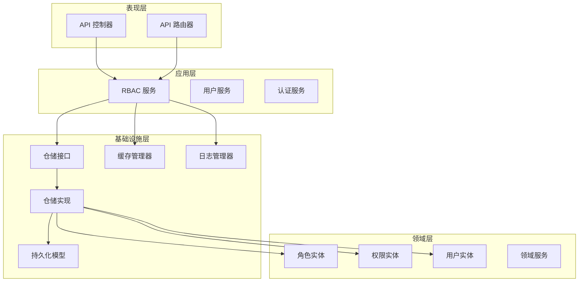

**图表来源**
- [rbac_controller.py:38-56](file://src/api/v1/controllers/rbac_controller.py#L38-L56)
- [rbac_service.py:22-29](file://src/application/services/rbac_service.py#L22-L29)
- [rbac_repo_impl.py:15-19](file://src/infrastructure/repositories/rbac_repo_impl.py#L15-L19)

### 数据流图

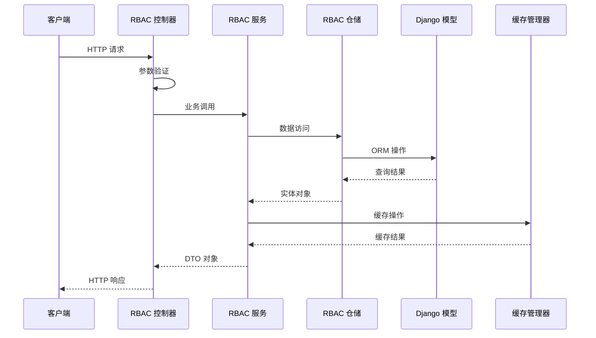

**图表来源**
- [rbac_controller.py:66-82](file://src/api/v1/controllers/rbac_controller.py#L66-L82)
- [rbac_service.py:33-56](file://src/application/services/rbac_service.py#L33-L56)
- [rbac_repo_impl.py:50-56](file://src/infrastructure/repositories/rbac_repo_impl.py#L50-L56)

**章节来源**
- [rbac_controller.py:1-351](file://src/api/v1/controllers/rbac_controller.py#L1-L351)
- [rbac_service.py:1-286](file://src/application/services/rbac_service.py#L1-L286)

## 详细组件分析

### RBAC 控制器实现

RBAC 控制器提供了完整的 HTTP 接口，实现了所有角色管理功能：

#### 角色管理接口

```mermaid
flowchart TD
Start([HTTP 请求到达]) --> Validate[参数验证]
Validate --> Route{路由选择}
Route --> |POST /roles| Create[创建角色]
Route --> |GET /roles/{role_id}| GetDetail[获取角色详情]
Route --> |GET /roles| List[获取角色列表]
Route --> |PUT /roles/{role_id}| Update[更新角色]
Route --> |DELETE /roles/{role_id}| Delete[删除角色]
Create --> CreateService[调用 RBAC 服务]
GetDetail --> GetService[调用 RBAC 服务]
List --> ListService[调用 RBAC 服务]
Update --> UpdateService[调用 RBAC 服务]
Delete --> DeleteService[调用 RBAC 服务]
CreateService --> CreateResult[返回角色响应]
GetService --> DetailResult[返回角色响应]
ListService --> ListResult[返回角色列表]
UpdateService --> UpdateResult[返回角色响应]
DeleteService --> DeleteResult[返回成功消息]
CreateResult --> End([HTTP 响应])
DetailResult --> End
ListResult --> End
UpdateResult --> End
DeleteResult --> End
```

**图表来源**
- [rbac_controller.py:60-185](file://src/api/v1/controllers/rbac_controller.py#L60-L185)

#### 权限管理接口

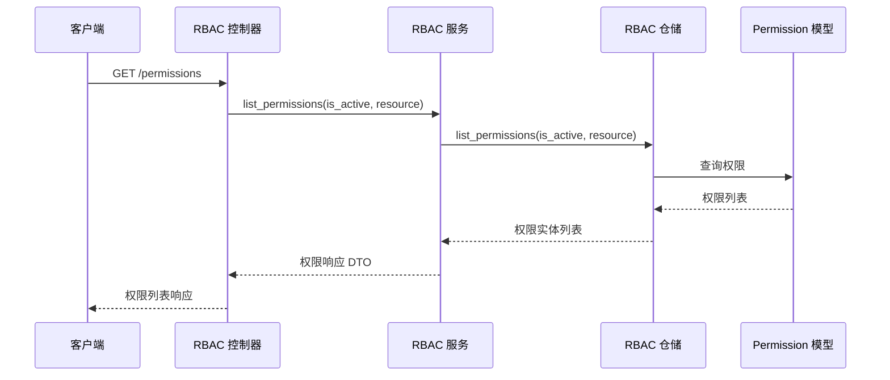

**图表来源**
- [rbac_controller.py:189-217](file://src/api/v1/controllers/rbac_controller.py#L189-L217)

#### 用户角色关联接口

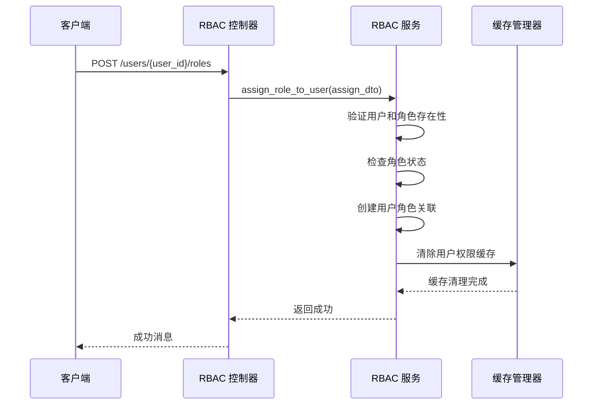

**图表来源**
- [rbac_controller.py:239-267](file://src/api/v1/controllers/rbac_controller.py#L239-L267)

**章节来源**
- [rbac_controller.py:38-351](file://src/api/v1/controllers/rbac_controller.py#L38-L351)

### RBAC 服务层业务逻辑

RBAC 服务层实现了核心业务逻辑，包括数据验证、权限分配和状态管理：

#### 角色创建流程

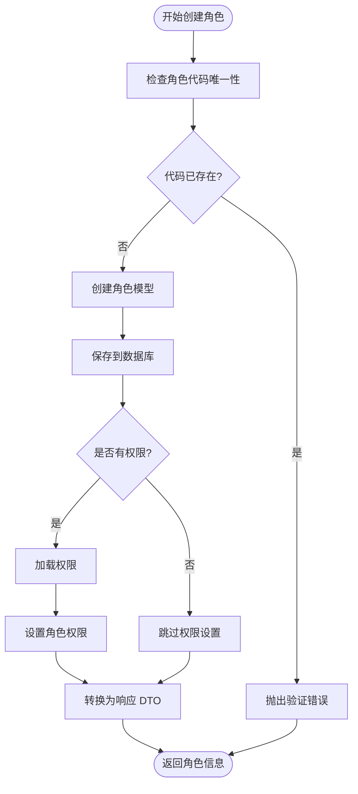

**图表来源**
- [rbac_service.py:33-56](file://src/application/services/rbac_service.py#L33-L56)

#### 角色更新流程

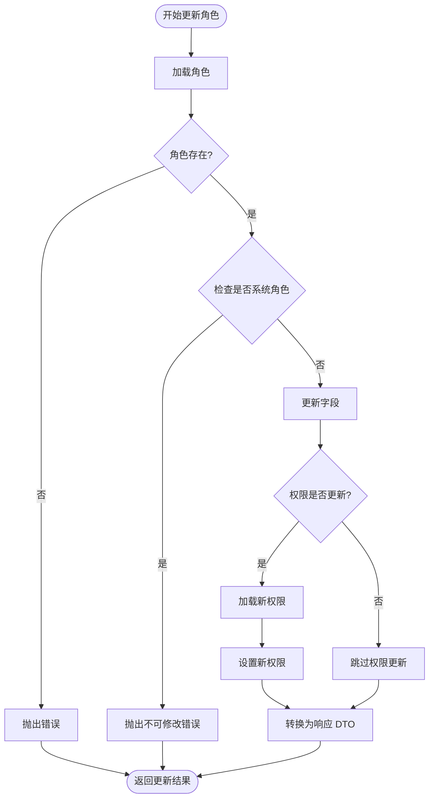

**图表来源**
- [rbac_service.py:72-94](file://src/application/services/rbac_service.py#L72-L94)

#### 权限检查流程

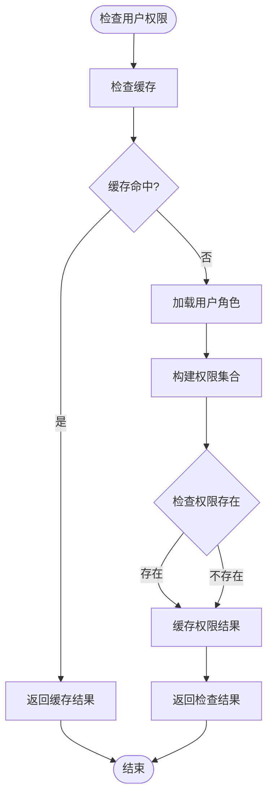

**图表来源**
- [rbac_service.py:233-251](file://src/application/services/rbac_service.py#L233-L251)

**章节来源**
- [rbac_service.py:22-286](file://src/application/services/rbac_service.py#L22-L286)

### 仓储层实现机制

仓储层负责数据持久化和查询优化：

#### 角色仓储接口

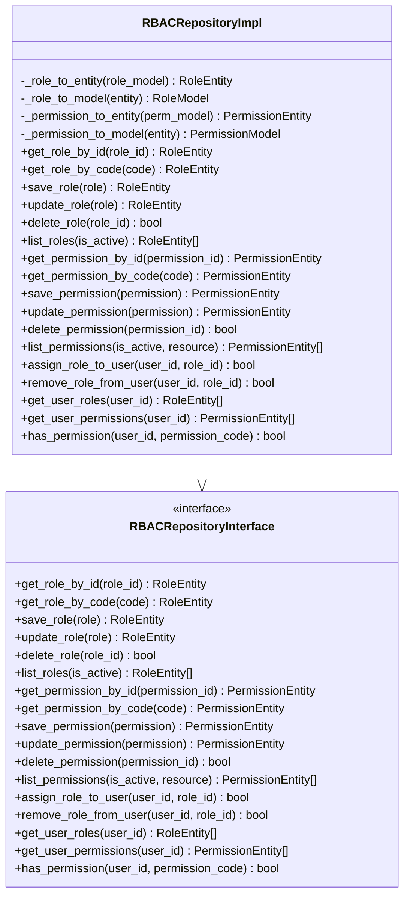

**图表来源**
- [rbac_repository.py:12-112](file://src/domain/rbac/repositories/rbac_repository.py#L12-L112)
- [rbac_repo_impl.py:15-253](file://src/infrastructure/repositories/rbac_repo_impl.py#L15-L253)

#### 数据库模型设计

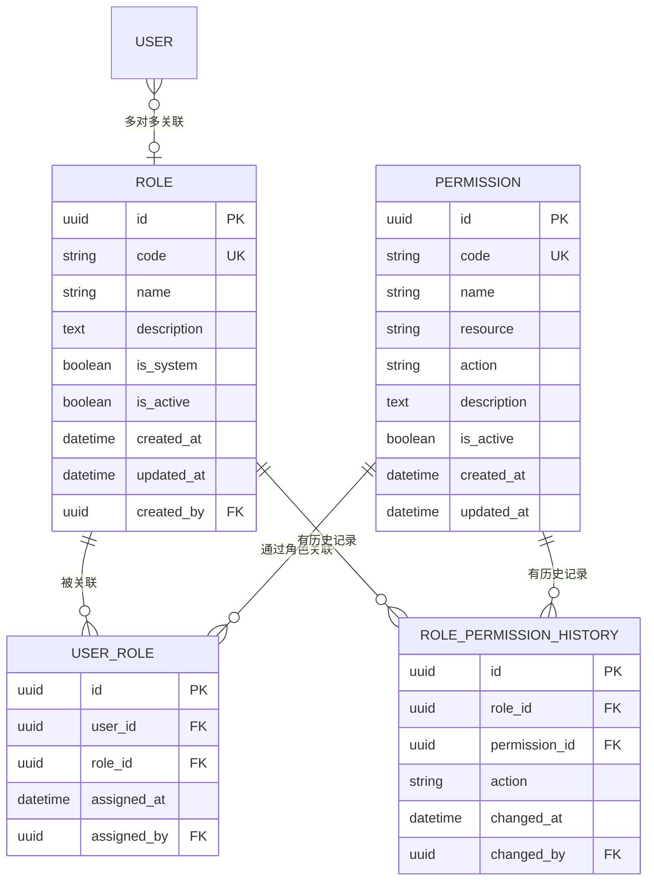

**图表来源**
- [rbac_models.py:13-148](file://src/infrastructure/persistence/models/rbac_models.py#L13-L148)

**章节来源**
- [rbac_repo_impl.py:1-253](file://src/infrastructure/repositories/rbac_repo_impl.py#L1-L253)
- [rbac_models.py:1-148](file://src/infrastructure/persistence/models/rbac_models.py#L1-L148)

## 依赖关系分析

系统采用依赖倒置原则，通过接口抽象实现松耦合设计：

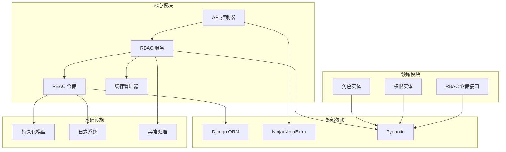

**图表来源**
- [rbac_controller.py:6-21](file://src/api/v1/controllers/rbac_controller.py#L6-L21)
- [rbac_service.py:8-19](file://src/application/services/rbac_service.py#L8-L19)
- [rbac_repo_impl.py:8-12](file://src/infrastructure/repositories/rbac_repo_impl.py#L8-L12)

### 循环依赖检测

系统通过以下机制避免循环依赖：

1. **DTO 依赖方向**：DTO 只依赖 Pydantic，不反向依赖其他模块
2. **实体依赖方向**：实体只包含基本数据结构，不依赖上层组件
3. **仓储接口**：定义在领域层，实现类在基础设施层
4. **服务依赖**：服务通过接口依赖仓储，不直接依赖具体实现

**章节来源**
- [rbac_controller.py:1-351](file://src/api/v1/controllers/rbac_controller.py#L1-L351)
- [rbac_service.py:1-286](file://src/application/services/rbac_service.py#L1-L286)
- [rbac_repo_impl.py:1-253](file://src/infrastructure/repositories/rbac_repo_impl.py#L1-L253)

## 性能考虑

### 缓存策略

系统实现了多层次的缓存策略来提升性能：

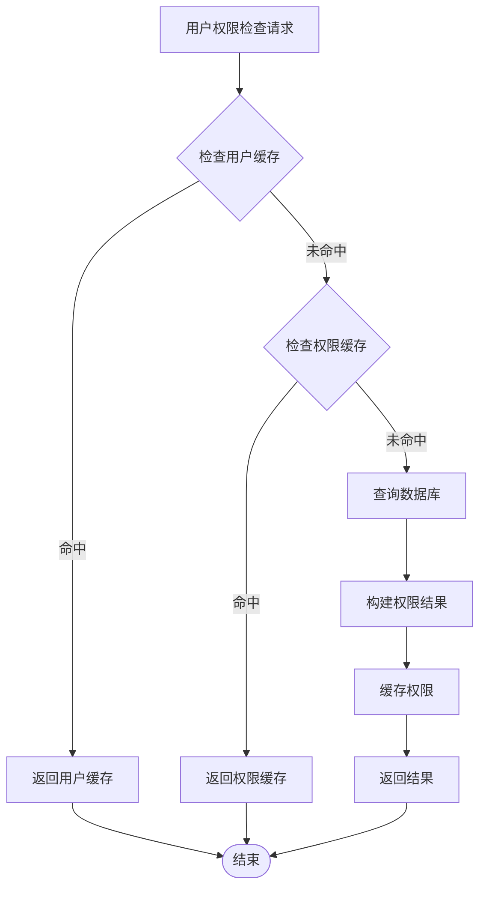

**图表来源**
- [cache_manager.py:108-122](file://src/infrastructure/cache/cache_manager.py#L108-L122)
- [rbac_service.py:233-251](file://src/application/services/rbac_service.py#L233-L251)

### 查询优化

1. **索引优化**：在关键字段上建立数据库索引
2. **批量查询**：使用 `select_related` 和 `prefetch_related` 减少 N+1 查询
3. **异步操作**：使用 Django 的异步 ORM 方法
4. **缓存失效**：在数据变更时自动清除相关缓存

### 并发处理

系统通过以下机制保证并发安全性：

1. **数据库事务**：在关键操作中使用事务
2. **唯一约束**：在数据库层面保证数据唯一性
3. **乐观锁**：使用版本号或时间戳防止并发冲突
4. **缓存一致性**：在数据变更时同步更新缓存

## 故障排除指南

### 常见错误及解决方案

#### 角色相关错误

| 错误类型 | 错误码 | 描述 | 解决方案 |
|---------|--------|------|----------|
| 角色不存在 | 404 | 请求的角色 ID 不存在 | 验证角色 ID 是否正确，检查数据库连接 |
| 角色代码重复 | 400 | 角色代码已存在 | 修改角色代码，确保唯一性 |
| 系统角色不可修改 | 400 | 尝试修改系统预定义角色 | 不要修改系统角色，创建自定义角色 |
| 角色已被停用 | 400 | 角色状态为非激活 | 启用角色后再进行操作 |

#### 权限相关错误

| 错误类型 | 错误码 | 描述 | 解决方案 |
|---------|--------|------|----------|
| 权限不存在 | 404 | 请求的权限不存在 | 检查权限代码，先初始化系统权限 |
| 权限代码重复 | 400 | 权限代码已存在 | 使用唯一的权限代码 |
| 权限解析失败 | 400 | 权限代码格式不正确 | 确保权限代码符合 `resource:action` 格式 |

#### 用户角色关联错误

| 错误类型 | 错误码 | 描述 | 解决方案 |
|---------|--------|------|----------|
| 用户不存在 | 400 | 指定的用户 ID 不存在 | 验证用户 ID，确保用户存在 |
| 用户已拥有此角色 | 400 | 用户已经具有该角色 | 检查用户当前角色，避免重复分配 |
| 用户没有此角色 | 400 | 用户不具有指定角色 | 检查用户角色分配状态 |

### 调试技巧

1. **启用详细日志**：在开发环境中启用详细的日志输出
2. **数据库查询分析**：使用 Django Debug Toolbar 分析查询性能
3. **缓存状态检查**：使用 Redis/Cache 管理工具检查缓存状态
4. **API 测试**：使用 Postman 或 curl 进行手动测试

**章节来源**
- [rbac_service.py:38-40](file://src/application/services/rbac_service.py#L38-L40)
- [rbac_service.py:174-182](file://src/application/services/rbac_service.py#L174-L182)
- [validation_error.py:9-26](file://src/core/exceptions/validation_error.py#L9-L26)

## 结论

本角色管理功能实现了完整的 RBAC 系统，具有以下特点：

### 技术优势

1. **清晰的分层架构**：遵循分层设计原则，职责分离明确
2. **完善的异常处理**：提供详细的错误信息和处理机制
3. **高性能缓存策略**：通过多级缓存提升系统性能
4. **灵活的扩展性**：通过接口抽象支持功能扩展

### 安全特性

1. **输入验证**：严格的 DTO 验证确保数据完整性
2. **权限控制**：细粒度的权限管理防止未授权访问
3. **审计跟踪**：完整的操作日志记录
4. **缓存安全**：及时的缓存失效保证数据一致性

### 最佳实践建议

1. **定期维护**：定期清理无效角色和权限
2. **监控告警**：建立系统监控和告警机制
3. **备份策略**：制定完善的数据备份和恢复策略
4. **性能优化**：持续监控和优化系统性能

## 附录

### API 接口文档

#### 角色管理接口

| 方法 | 路径 | 功能 | 请求参数 | 响应数据 |
|------|------|------|----------|----------|
| POST | `/v1/rbac/roles` | 创建角色 | RoleCreateDTO | RoleResponseDTO |
| GET | `/v1/rbac/roles/{role_id}` | 获取角色详情 | 路径参数: role_id | RoleResponseDTO |
| GET | `/v1/rbac/roles` | 获取角色列表 | 查询参数: is_active | RoleListResponse |
| PUT | `/v1/rbac/roles/{role_id}` | 更新角色 | 路径参数: role_id<br/>RoleUpdateDTO | RoleResponseDTO |
| DELETE | `/v1/rbac/roles/{role_id}` | 删除角色 | 路径参数: role_id | MessageResponse |

#### 权限管理接口

| 方法 | 路径 | 功能 | 请求参数 | 响应数据 |
|------|------|------|----------|----------|
| GET | `/v1/rbac/permissions` | 获取权限列表 | 查询参数: is_active, resource | PermissionListResponse |
| POST | `/v1/rbac/permissions/init` | 初始化系统权限 | 无 | MessageResponse |

#### 用户角色关联接口

| 方法 | 路径 | 功能 | 请求参数 | 响应数据 |
|------|------|------|----------|----------|
| POST | `/v1/rbac/users/{user_id}/roles` | 分配角色给用户 | 路径参数: user_id<br/>AssignRoleDTO | MessageResponse |
| DELETE | `/v1/rbac/users/{user_id}/roles/{role_id}` | 从用户移除角色 | 路径参数: user_id, role_id | MessageResponse |
| GET | `/v1/rbac/users/{user_id}/roles` | 获取用户角色权限 | 路径参数: user_id | UserRolesResponseDTO |
| GET | `/v1/rbac/users/{user_id}/permissions/check` | 检查用户权限 | 路径参数: user_id, permission_code | JSON 对象 |

### 数据验证规则

#### 角色创建验证

- `name`: 必填，长度 1-100 字符
- `code`: 必填，长度 1-50 字符，必须唯一
- `description`: 可选，最大长度 255 字符
- `permissions`: 可选，权限代码数组

#### 角色更新验证

- `name`: 可选，长度 1-100 字符
- `description`: 可选，最大长度 255 字符
- `permissions`: 可选，权限代码数组

#### 权限验证

- `name`: 必填，长度 1-100 字符
- `code`: 必填，格式 `resource:action`
- `description`: 可选，最大长度 255 字符

### 缓存配置

| 缓存键 | 分组 | 过期时间 | 描述 |
|--------|------|----------|------|
| `permissions:{user_id}` | rbac | 600 秒 | 用户权限缓存 |
| `roles:{user_id}` | rbac | 600 秒 | 用户角色缓存 |
| `user:{user_id}` | user | 1800 秒 | 用户信息缓存 |