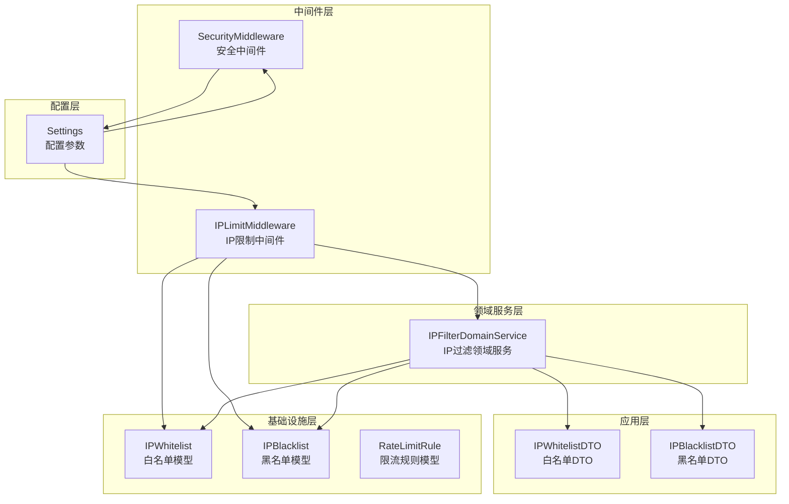
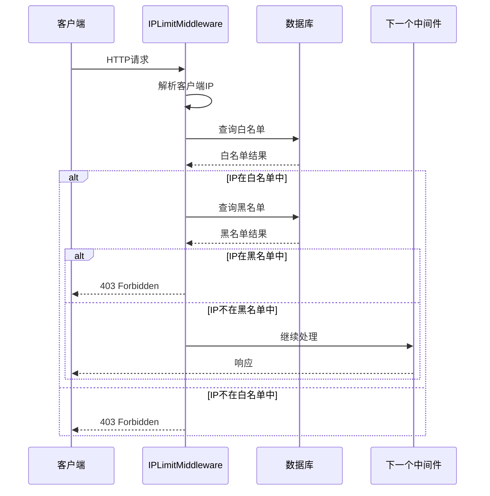
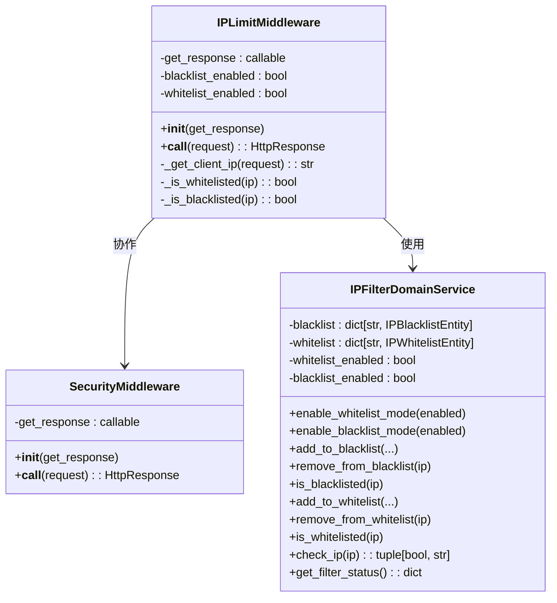
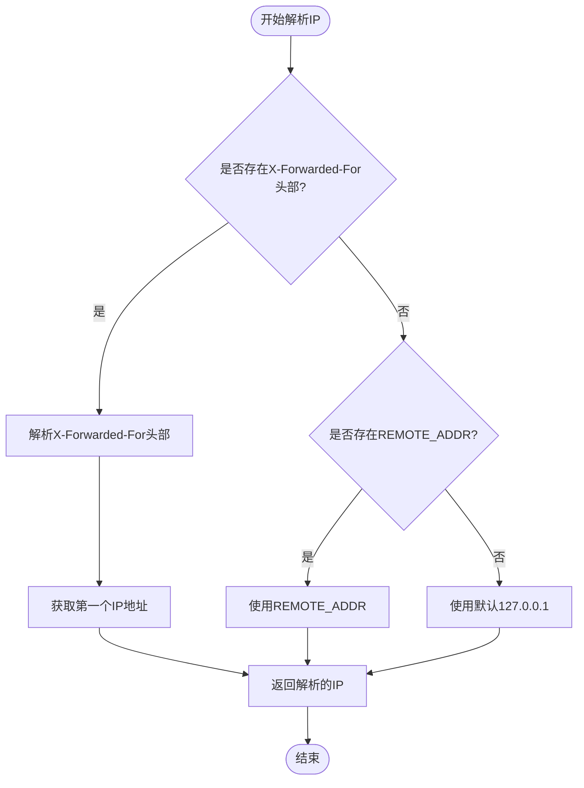
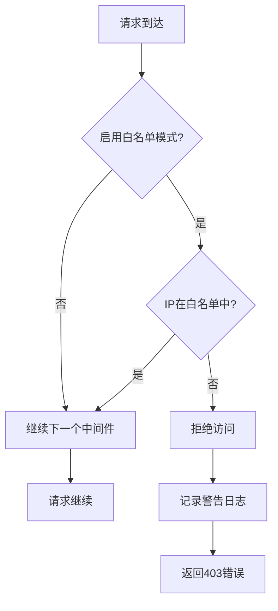
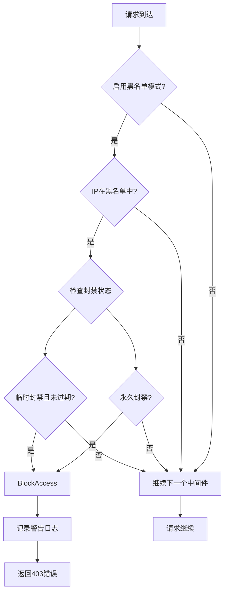
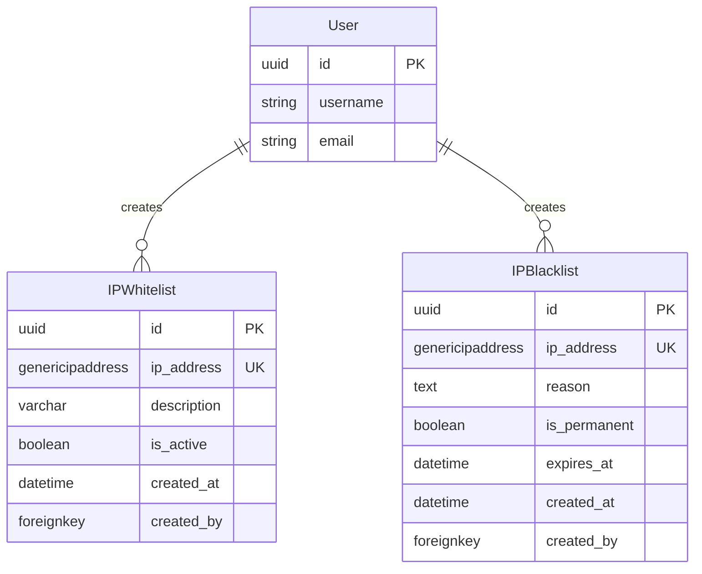
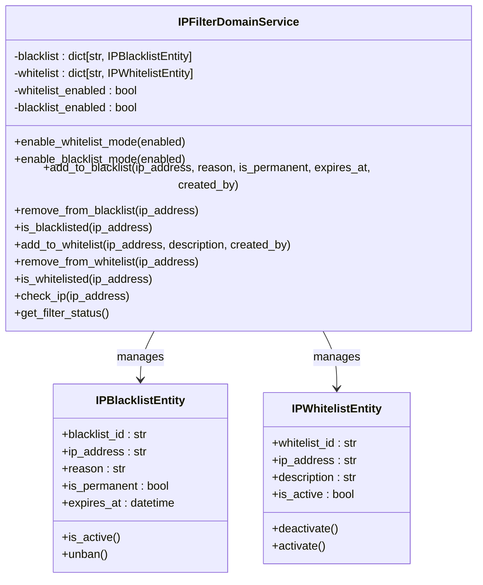
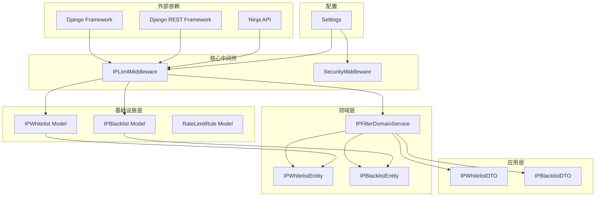
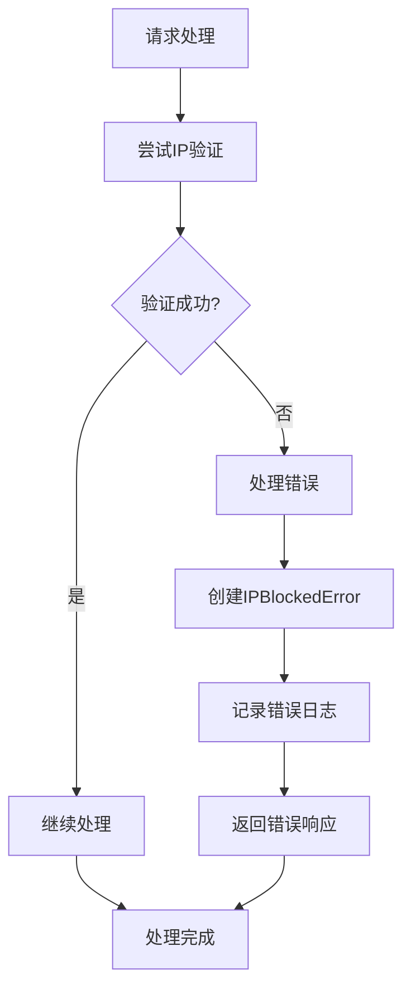

# IP限制中间件

<cite>
**本文档引用的文件**
- [ip_limit_middleware.py](file://src/core/middlewares/ip_limit_middleware.py)
- [security_middleware.py](file://src/core/middlewares/security_middleware.py)
- [ip_filter_service.py](file://src/domain/security/services/ip_filter_service.py)
- [security_models.py](file://src/infrastructure/persistence/models/security_models.py)
- [ip_whitelist_dto.py](file://src/application/dto/security/ip_whitelist_dto.py)
- [ip_blacklist_dto.py](file://src/application/dto/security/ip_blacklist_dto.py)
- [ip_whitelist_entity.py](file://src/domain/security/entities/ip_whitelist_entity.py)
- [ip_blacklist_entity.py](file://src/domain/security/entities/ip_blacklist_entity.py)
- [base.py](file://config/settings/base.py)
- [security_api.py](file://src/api/v1/security_api.py)
- [utils.py](file://src/core/utils.py)
- [ip_blocked_error.py](file://src/core/exceptions/ip_blocked_error.py)
</cite>

## 目录
1. [简介](#简介)
2. [项目结构](#项目结构)
3. [核心组件](#核心组件)
4. [架构概览](#架构概览)
5. [详细组件分析](#详细组件分析)
6. [依赖关系分析](#依赖关系分析)
7. [性能考虑](#性能考虑)
8. [故障排除指南](#故障排除指南)
9. [结论](#结论)
10. [附录](#附录)

## 简介

IP限制中间件是本项目安全体系的重要组成部分，负责基于IP地址的访问控制机制。该中间件实现了完整的IP白名单和黑名单功能，支持静态IP列表管理和动态IP管理，能够有效防止未授权访问和恶意攻击。

本中间件采用Django中间件架构，通过请求预处理的方式拦截和验证客户端IP地址，确保只有符合访问策略的请求才能继续后续的业务处理。系统支持两种主要的访问控制模式：白名单模式（仅允许特定IP访问）和黑名单模式（阻止特定IP访问），并且白名单模式具有更高的优先级。

## 项目结构

IP限制中间件在整个项目架构中位于核心层，与安全中间件、领域服务、数据模型等组件协同工作：



**图表来源**
- [ip_limit_middleware.py:15-130](file://src/core/middlewares/ip_limit_middleware.py#L15-L130)
- [security_middleware.py:14-54](file://src/core/middlewares/security_middleware.py#L14-L54)
- [ip_filter_service.py:12-149](file://src/domain/security/services/ip_filter_service.py#L12-L149)

**章节来源**
- [ip_limit_middleware.py:1-130](file://src/core/middlewares/ip_limit_middleware.py#L1-L130)
- [base.py:39-52](file://config/settings/base.py#L39-L52)

## 核心组件

### IP限制中间件核心功能

IP限制中间件提供了完整的IP访问控制功能，包括：

- **IP地址解析**：支持代理服务器IP处理和真实客户端IP提取
- **白名单过滤**：仅允许白名单中的IP地址访问
- **黑名单过滤**：阻止黑名单中的IP地址访问
- **临时和永久封禁**：支持临时封禁和永久封禁两种模式
- **日志记录**：详细的访问控制日志记录

### 配置参数

中间件通过Django设置进行配置，支持以下关键参数：

| 配置参数 | 类型 | 默认值 | 描述 |
|---------|------|--------|------|
| IP_BLACKLIST_ENABLED | 布尔值 | False | 是否启用黑名单功能 |
| IP_WHITELIST_ENABLED | 布尔值 | False | 是否启用白名单功能 |

### 数据传输对象

系统使用Pydantic模型进行数据验证和序列化：

- **IPWhitelistDTO**：白名单数据传输对象，包含IP地址和描述信息
- **IPBlacklistDTO**：黑名单数据传输对象，包含IP地址、原因、是否永久封禁和过期时间

**章节来源**
- [ip_limit_middleware.py:25-28](file://src/core/middlewares/ip_limit_middleware.py#L25-L28)
- [base.py:232-235](file://config/settings/base.py#L232-L235)
- [ip_whitelist_dto.py:9-21](file://src/application/dto/security/ip_whitelist_dto.py#L9-L21)
- [ip_blacklist_dto.py:11-27](file://src/application/dto/security/ip_blacklist_dto.py#L11-L27)

## 架构概览

IP限制中间件采用分层架构设计，确保了良好的可维护性和扩展性：



**图表来源**
- [ip_limit_middleware.py:41-76](file://src/core/middlewares/ip_limit_middleware.py#L41-L76)
- [ip_limit_middleware.py:78-129](file://src/core/middlewares/ip_limit_middleware.py#L78-L129)

### 中间件执行流程

IP限制中间件的执行流程遵循Django中间件的标准模式：

1. **请求预处理**：在请求到达视图之前执行
2. **IP地址解析**：从HTTP头部和远程地址提取客户端IP
3. **白名单检查**：如果启用白名单模式，检查IP是否在白名单中
4. **黑名单检查**：如果启用黑名单模式，检查IP是否在黑名单中
5. **响应处理**：根据检查结果决定放行或拒绝请求

**章节来源**
- [ip_limit_middleware.py:41-76](file://src/core/middlewares/ip_limit_middleware.py#L41-L76)

## 详细组件分析

### IP限制中间件类结构



**图表来源**
- [ip_limit_middleware.py:15-130](file://src/core/middlewares/ip_limit_middleware.py#L15-L130)
- [security_middleware.py:14-54](file://src/core/middlewares/security_middleware.py#L14-L54)
- [ip_filter_service.py:12-149](file://src/domain/security/services/ip_filter_service.py#L12-L149)

### IP地址解析机制

IP地址解析是IP限制中间件的核心功能之一，需要处理多种网络环境：



**图表来源**
- [ip_limit_middleware.py:78-93](file://src/core/middlewares/ip_limit_middleware.py#L78-L93)

#### 代理服务器IP处理

系统支持标准的HTTP代理头部处理：

- **X-Forwarded-For**: 包含客户端IP和经过的代理服务器IP列表
- **REMOTE_ADDR**: 直接连接到Web服务器的IP地址
- **优先级处理**: 从X-Forwarded-For的第一个IP开始，回退到REMOTE_ADDR

#### 私有IP识别

虽然当前实现主要关注IP地址的简单验证，但系统为未来的私有IP识别预留了扩展空间。私有IP通常包括：
- 10.0.0.0 - 10.255.255.255
- 172.16.0.0 - 172.31.255.255  
- 192.168.0.0 - 192.168.255.255

**章节来源**
- [ip_limit_middleware.py:78-93](file://src/core/middlewares/ip_limit_middleware.py#L78-L93)

### IP白名单和黑名单实现

#### 白名单机制

白名单模式采用"默认拒绝，明确允许"的安全策略：



**图表来源**
- [ip_limit_middleware.py:54-63](file://src/core/middlewares/ip_limit_middleware.py#L54-L63)

#### 黑名单机制

黑名单模式采用"默认允许，明确阻止"的策略：



**图表来源**
- [ip_limit_middleware.py:65-74](file://src/core/middlewares/ip_limit_middleware.py#L65-L74)
- [ip_limit_middleware.py:109-129](file://src/core/middlewares/ip_limit_middleware.py#L109-L129)

#### 封禁状态管理

黑名单支持两种封禁状态：

| 状态类型 | 检查条件 | 行为 |
|---------|----------|------|
| 永久封禁 | is_permanent = True | 始终阻止访问 |
| 临时封禁 | is_permanent = False 且 expires_at > 当前时间 | 在有效期内阻止访问 |

**章节来源**
- [ip_limit_middleware.py:109-129](file://src/core/middlewares/ip_limit_middleware.py#L109-L129)

### 数据模型设计

系统使用Django ORM模型存储IP白名单和黑名单信息：



**图表来源**
- [security_models.py:13-80](file://src/infrastructure/persistence/models/security_models.py#L13-L80)

#### 实体属性说明

**IPWhitelist实体**：
- `whitelist_id`: 唯一标识符
- `ip_address`: IP地址（唯一约束）
- `description`: 描述信息
- `is_active`: 是否激活
- `created_at`: 创建时间
- `created_by`: 创建者

**IPBlacklist实体**：
- `blacklist_id`: 唯一标识符
- `ip_address`: IP地址（唯一约束）
- `reason`: 封禁原因
- `is_permanent`: 是否永久封禁
- `expires_at`: 过期时间
- `created_at`: 创建时间
- `created_by`: 创建者

**章节来源**
- [security_models.py:13-80](file://src/infrastructure/persistence/models/security_models.py#L13-L80)

### 领域服务实现

IP过滤领域服务提供了内存中的IP过滤逻辑，支持异步操作：



**图表来源**
- [ip_filter_service.py:12-149](file://src/domain/security/services/ip_filter_service.py#L12-L149)
- [ip_blacklist_entity.py:11-53](file://src/domain/security/entities/ip_blacklist_entity.py#L11-L53)
- [ip_whitelist_entity.py:11-47](file://src/domain/security/entities/ip_whitelist_entity.py#L11-L47)

#### 过滤策略优先级

IP过滤领域服务实现了明确的优先级策略：

1. **白名单优先**：如果启用白名单模式，只有白名单中的IP才被允许
2. **黑名单检查**：在白名单模式下，不在白名单中的IP直接拒绝
3. **默认允许**：如果既不启用白名单也不启用黑名单，默认允许所有访问

**章节来源**
- [ip_filter_service.py:120-139](file://src/domain/security/services/ip_filter_service.py#L120-L139)

## 依赖关系分析

IP限制中间件的依赖关系体现了清晰的分层架构：



**图表来源**
- [ip_limit_middleware.py:1-130](file://src/core/middlewares/ip_limit_middleware.py#L1-L130)
- [base.py:22-37](file://config/settings/base.py#L22-L37)

### 中间件协作关系

IP限制中间件与安全中间件存在协作关系：

- **执行顺序**：IP限制中间件在安全中间件之前执行，确保访问控制在安全加固之前完成
- **职责分离**：IP限制中间件专注于IP访问控制，安全中间件专注于HTTP安全头设置
- **配置独立**：两者通过各自的配置参数独立控制功能开关

**章节来源**
- [base.py:49-52](file://config/settings/base.py#L49-L52)
- [ip_limit_middleware.py:30-39](file://src/core/middlewares/ip_limit_middleware.py#L30-L39)

## 性能考虑

### 缓存策略

当前实现采用数据库查询方式进行IP验证，建议实施以下缓存策略：

1. **内存缓存**：使用Redis缓存IP验证结果，减少数据库查询压力
2. **分层缓存**：实现多级缓存（本地缓存 + Redis缓存）
3. **缓存失效**：设置合理的缓存过期时间（如5-10分钟）

### 数据库优化

针对IP验证的数据库查询进行了专门优化：

- **索引优化**：IP地址字段建立唯一索引和数据库索引
- **查询优化**：使用exists()方法进行存在性检查，避免不必要的数据加载
- **批量操作**：支持批量IP验证和管理操作

### 异步处理

领域服务支持异步操作，提高了系统的并发处理能力：

- **异步方法**：所有IP验证方法都支持async/await语法
- **非阻塞操作**：数据库操作使用异步ORM方法
- **并发支持**：能够同时处理多个并发的IP验证请求

**章节来源**
- [security_models.py:19-29](file://src/infrastructure/persistence/models/security_models.py#L19-L29)
- [ip_limit_middleware.py:105-107](file://src/core/middlewares/ip_limit_middleware.py#L105-L107)

## 故障排除指南

### 常见问题诊断

#### IP地址解析问题

**症状**：所有请求都被拒绝或IP地址显示为代理服务器地址

**排查步骤**：
1. 检查X-Forwarded-For头部是否正确传递
2. 验证REMOTE_ADDR配置是否正确
3. 确认代理服务器配置

#### 权限配置问题

**症状**：白名单模式下无法访问，或黑名单模式下仍然可以访问

**排查步骤**：
1. 检查IP_BLACKLIST_ENABLED和IP_WHITELIST_ENABLED配置
2. 验证白名单和黑名单数据是否正确导入
3. 确认数据库连接正常

#### 性能问题

**症状**：IP验证导致请求延迟增加

**排查步骤**：
1. 检查数据库查询性能
2. 实施缓存策略
3. 优化IP地址索引

### 错误处理机制

系统提供了完善的错误处理和异常管理：



**图表来源**
- [ip_limit_middleware.py:56-74](file://src/core/middlewares/ip_limit_middleware.py#L56-L74)

**章节来源**
- [ip_blocked_error.py:9-26](file://src/core/exceptions/ip_blocked_error.py#L9-L26)

## 结论

IP限制中间件为本项目提供了强大的IP访问控制能力。通过白名单和黑名单机制的结合，系统能够灵活地应对各种安全需求。中间件的设计充分考虑了性能、可维护性和扩展性，为构建安全可靠的Web应用奠定了坚实基础。

未来可以进一步增强的功能包括：
- IP地址段支持和CIDR表示法
- 动态IP检测和自动封禁
- 更精细的访问日志记录
- 分布式环境下的IP状态同步

## 附录

### API接口参考

系统提供了完整的IP管理API接口：

| 接口 | 方法 | 路径 | 功能 |
|------|------|------|------|
| 添加IP到黑名单 | POST | `/api/v1/security/blacklist` | 添加新的黑名单IP |
| 从黑名单移除 | DELETE | `/api/v1/security/blacklist/{ip_address}` | 移除黑名单IP |
| 获取黑名单列表 | GET | `/api/v1/security/blacklist` | 获取所有黑名单IP |
| 添加IP到白名单 | POST | `/api/v1/security/whitelist` | 添加新的白名单IP |
| 从白名单移除 | DELETE | `/api/v1/security/whitelist/{ip_address}` | 移除白名单IP |
| 获取白名单列表 | GET | `/api/v1/security/whitelist` | 获取所有白名单IP |
| 获取安全状态 | GET | `/api/v1/security/status` | 获取当前安全配置状态 |

### 配置示例

```python
# 启用白名单模式
IP_WHITELIST_ENABLED = True

# 启用黑名单模式  
IP_BLACKLIST_ENABLED = True

# 数据库配置
DATABASES = {
    'default': {
        'ENGINE': 'django.db.backends.mysql',
        'NAME': 'your_database',
        'USER': 'your_username',
        'PASSWORD': 'your_password',
        'HOST': 'localhost',
        'PORT': '3306',
    }
}

# 缓存配置
CACHES = {
    'default': {
        'BACKEND': 'django.core.cache.backends.redis.RedisCache',
        'LOCATION': 'redis://127.0.0.1:6379/1',
    }
}
```

**章节来源**
- [security_api.py:35-155](file://src/api/v1/security_api.py#L35-L155)
- [base.py:232-235](file://config/settings/base.py#L232-L235)