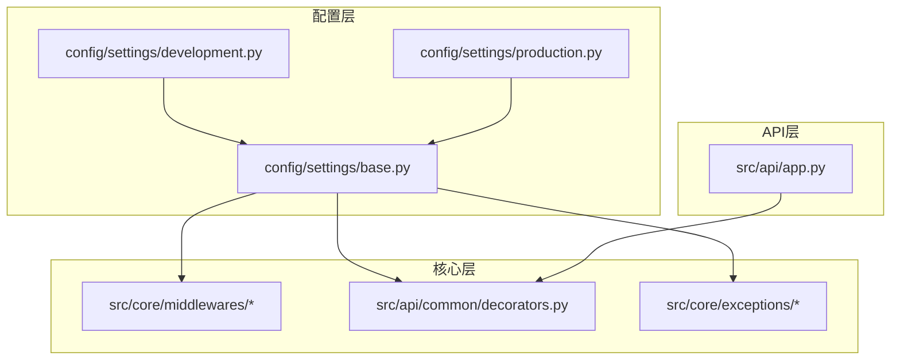
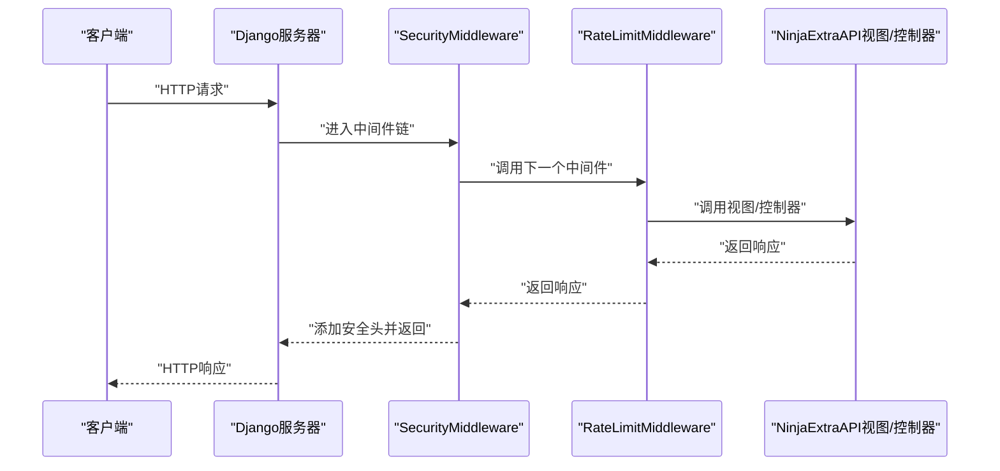
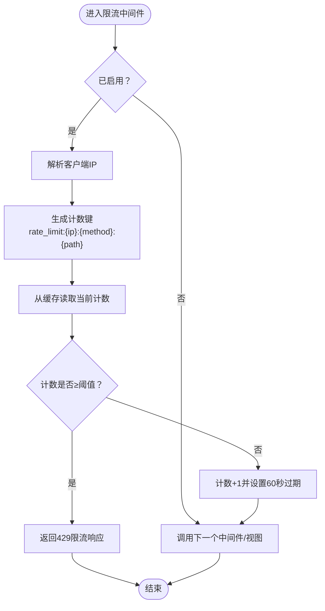
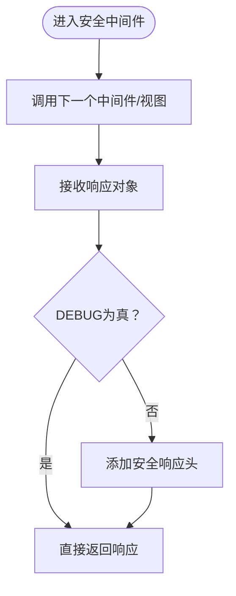
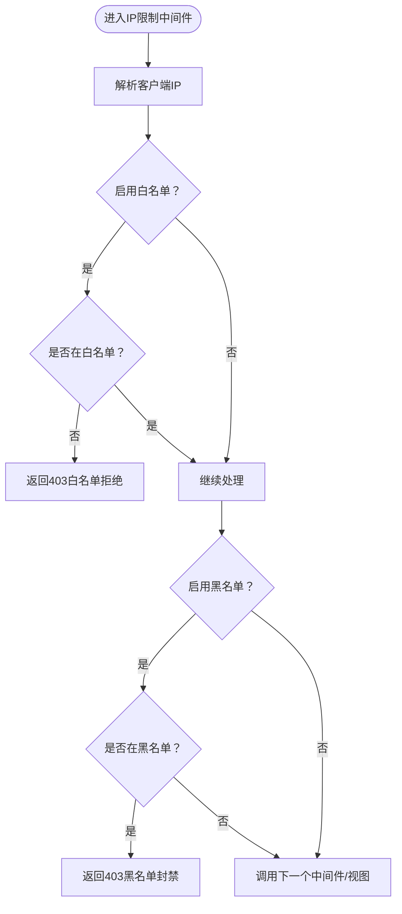
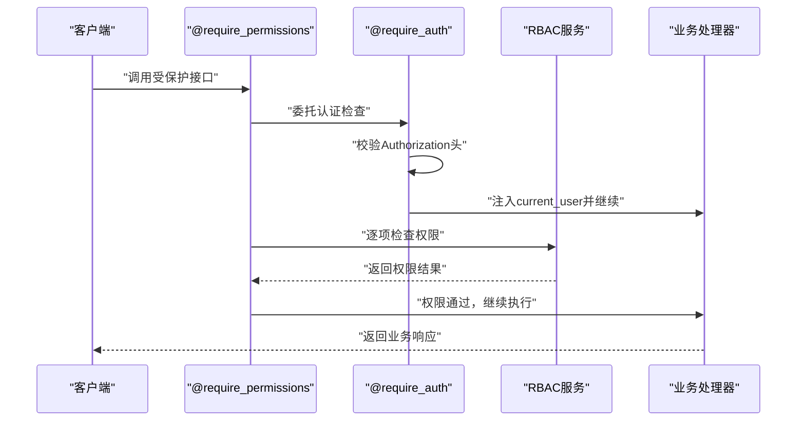
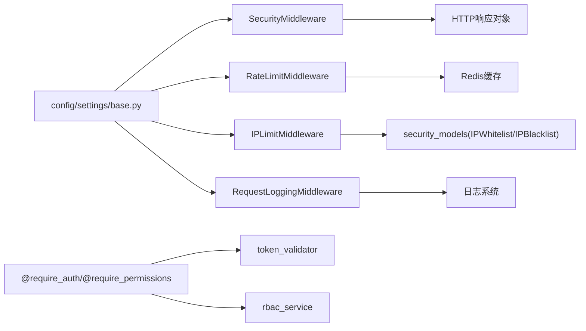

# 中间件与拦截器

<cite>
**本文引用的文件**
- [src/core/middlewares/__init__.py](file://src/core/middlewares/__init__.py)
- [src/core/middlewares/rate_limit_middleware.py](file://src/core/middlewares/rate_limit_middleware.py)
- [src/core/middlewares/security_middleware.py](file://src/core/middlewares/security_middleware.py)
- [src/core/middlewares/ip_limit_middleware.py](file://src/core/middlewares/ip_limit_middleware.py)
- [src/core/middlewares/request_logging_middleware.py](file://src/core/middlewares/request_logging_middleware.py)
- [config/settings/base.py](file://config/settings/base.py)
- [config/settings/development.py](file://config/settings/development.py)
- [config/settings/production.py](file://config/settings/production.py)
- [src/api/app.py](file://src/api/app.py)
- [src/api/common/decorators.py](file://src/api/common/decorators.py)
- [src/core/exceptions/__init__.py](file://src/core/exceptions/__init__.py)
- [src/core/exceptions/base.py](file://src/core/exceptions/base.py)
- [src/core/exceptions/rate_limit_error.py](file://src/core/exceptions/rate_limit_error.py)
- [src/core/exceptions/ip_blocked_error.py](file://src/core/exceptions/ip_blocked_error.py)
- [tests/test_middlewares/test_rate_limit_middleware.py](file://tests/test_middlewares/test_rate_limit_middleware.py)
</cite>

## 目录
1. [简介](#简介)
2. [项目结构](#项目结构)
3. [核心组件](#核心组件)
4. [架构总览](#架构总览)
5. [详细组件分析](#详细组件分析)
6. [依赖分析](#依赖分析)
7. [性能考虑](#性能考虑)
8. [故障排查指南](#故障排查指南)
9. [结论](#结论)
10. [附录](#附录)

## 简介
本文件系统性阐述本项目的中间件与拦截器体系，覆盖 Django 中间件的执行顺序、请求处理链与响应处理链；详解限流、安全、IP 限制、请求日志等自定义中间件的实现与配置；说明装饰器模式在权限控制中的应用（如 @require_auth、@require_permissions）；提供性能优化、错误处理与异常捕获、调试与监控建议，以及自定义中间件开发指导与示例代码路径。

## 项目结构
本项目采用分层与功能域结合的组织方式：
- 配置层：集中于 config/settings，按环境拆分基础配置、开发与生产配置
- API 层：基于 Django-Ninja-Extra 的 API 实例与控制器注册
- 核心层：包含中间件、异常、工具与日志等横切关注点
- 基础设施层：持久化、缓存、认证与领域服务等

图表来源
- [config/settings/base.py:39-52](file://config/settings/base.py#L39-L52)
- [src/api/app.py:70-84](file://src/api/app.py#L70-L84)

章节来源
- [config/settings/base.py:1-235](file://config/settings/base.py#L1-L235)
- [src/api/app.py:1-102](file://src/api/app.py#L1-L102)

## 核心组件
- 中间件模块统一导出：SecurityMiddleware、RateLimitMiddleware、IPLimitMiddleware、RequestLoggingMiddleware
- 中间件职责：
  - 安全中间件：在生产环境为响应添加安全头
  - 限流中间件：基于 IP 的请求频率限制
  - IP 限制中间件：白名单/黑名单过滤
  - 请求日志中间件：记录请求开始/完成、耗时、用户与 IP
- 装饰器模式权限控制：统一错误处理、认证校验、权限校验、实体存在性校验
- 异常体系：以 BaseAPIError 为基类，派生出具体异常类型（如限流、IP 封禁）

章节来源
- [src/core/middlewares/__init__.py:1-17](file://src/core/middlewares/__init__.py#L1-L17)
- [src/core/middlewares/security_middleware.py:14-54](file://src/core/middlewares/security_middleware.py#L14-L54)
- [src/core/middlewares/rate_limit_middleware.py:15-112](file://src/core/middlewares/rate_limit_middleware.py#L15-L112)
- [src/core/middlewares/ip_limit_middleware.py:15-130](file://src/core/middlewares/ip_limit_middleware.py#L15-L130)
- [src/core/middlewares/request_logging_middleware.py:14-86](file://src/core/middlewares/request_logging_middleware.py#L14-L86)
- [src/api/common/decorators.py:13-191](file://src/api/common/decorators.py#L13-L191)
- [src/core/exceptions/__init__.py:1-34](file://src/core/exceptions/__init__.py#L1-L34)
- [src/core/exceptions/base.py:7-40](file://src/core/exceptions/base.py#L7-L40)

## 架构总览
下图展示请求在 Django 中间件栈中的处理流程，以及自定义中间件在整体链路中的位置与作用：

图表来源
- [config/settings/base.py:39-52](file://config/settings/base.py#L39-L52)
- [src/core/middlewares/security_middleware.py:33-53](file://src/core/middlewares/security_middleware.py#L33-L53)
- [src/core/middlewares/rate_limit_middleware.py:41-68](file://src/core/middlewares/rate_limit_middleware.py#L41-L68)
- [src/api/app.py:70-84](file://src/api/app.py#L70-L84)

## 详细组件分析

### 中间件执行顺序与链式处理
- 中间件在配置中按声明顺序组成处理链，请求按“外-内”方向传递，响应按“内-外”方向返回
- 本项目中间件链包含 Django 内置中间件与自定义中间件，其中自定义中间件位于链中部，便于在认证之后、视图之前进行限流与安全加固

章节来源
- [config/settings/base.py:39-52](file://config/settings/base.py#L39-L52)

### 限流中间件（RateLimitMiddleware）
- 功能要点
  - 基于 IP、HTTP 方法与路径的组合键进行计数
  - 使用缓存存储计数与过期时间，实现每分钟级限流
  - 可通过设置项开启/关闭，默认启用
- 关键行为
  - 若超出阈值，返回限流错误的 JSON 响应与 429 状态码
  - 计数器在 60 秒后过期
- 配置
  - RATE_LIMIT_ENABLED：是否启用
  - RATE_LIMIT_DEFAULT：默认限流规则（环境变量注入）

图表来源
- [src/core/middlewares/rate_limit_middleware.py:41-112](file://src/core/middlewares/rate_limit_middleware.py#L41-L112)
- [config/settings/base.py:228-230](file://config/settings/base.py#L228-L230)

章节来源
- [src/core/middlewares/rate_limit_middleware.py:15-112](file://src/core/middlewares/rate_limit_middleware.py#L15-L112)
- [config/settings/base.py:228-230](file://config/settings/base.py#L228-L230)
- [tests/test_middlewares/test_rate_limit_middleware.py:29-76](file://tests/test_middlewares/test_rate_limit_middleware.py#L29-L76)

### 安全中间件（SecurityMiddleware）
- 功能要点
  - 在生产环境为响应添加安全头，增强浏览器安全策略
  - 仅在非调试模式生效
- 安全头示例
  - X-Content-Type-Options、X-Frame-Options、X-XSS-Protection、Strict-Transport-Security

图表来源
- [src/core/middlewares/security_middleware.py:33-53](file://src/core/middlewares/security_middleware.py#L33-L53)
- [config/settings/production.py:29-39](file://config/settings/production.py#L29-L39)

章节来源
- [src/core/middlewares/security_middleware.py:14-54](file://src/core/middlewares/security_middleware.py#L14-L54)
- [config/settings/production.py:29-39](file://config/settings/production.py#L29-L39)

### IP 限制中间件（IPLimitMiddleware）
- 功能要点
  - 支持白名单与黑名单两种模式，互斥启用
  - 白名单：仅允许白名单内的 IP 访问
  - 黑名单：永久或临时封禁指定 IP
  - 通过模型查询判断白/黑名单状态
- 配置
  - IP_BLACKLIST_ENABLED：启用黑名单
  - IP_WHITELIST_ENABLED：启用白名单

图表来源
- [src/core/middlewares/ip_limit_middleware.py:41-130](file://src/core/middlewares/ip_limit_middleware.py#L41-L130)
- [config/settings/base.py:232-234](file://config/settings/base.py#L232-L234)

章节来源
- [src/core/middlewares/ip_limit_middleware.py:15-130](file://src/core/middlewares/ip_limit_middleware.py#L15-L130)
- [config/settings/base.py:232-234](file://config/settings/base.py#L232-L234)

### 请求日志中间件（RequestLoggingMiddleware）
- 功能要点
  - 记录请求开始与完成信息，包含方法、路径、用户与 IP
  - 计算请求耗时并记录到日志
- 日志来源
  - 由配置中的日志系统统一输出至文件与控制台

章节来源
- [src/core/middlewares/request_logging_middleware.py:14-86](file://src/core/middlewares/request_logging_middleware.py#L14-L86)
- [config/settings/base.py:174-226](file://config/settings/base.py#L174-L226)

### 装饰器模式在权限控制中的应用
- 统一错误处理（@handle_errors）
  - 捕获常见异常并转换为 HTTP 错误
  - 对未捕获异常记录详细日志并返回 500
- 认证装饰器（@require_auth）
  - 校验 Authorization 头是否为 Bearer 令牌
  - 通过令牌校验后将用户信息注入 kwargs
- 权限装饰器（@require_permissions）
  - 基于认证装饰器之上，逐项校验用户是否具备所需权限
  - 权限检查通过后才进入业务逻辑
- 实体存在性校验（@validate_exists）
  - 在执行业务前验证目标实体是否存在，不存在则返回 404

图表来源
- [src/api/common/decorators.py:95-144](file://src/api/common/decorators.py#L95-L144)
- [src/api/common/decorators.py:53-92](file://src/api/common/decorators.py#L53-L92)
- [src/api/common/decorators.py:13-51](file://src/api/common/decorators.py#L13-L51)

章节来源
- [src/api/common/decorators.py:13-191](file://src/api/common/decorators.py#L13-L191)

### 异常体系与错误处理
- 基类：BaseAPIError，提供统一的消息与代码结构
- 具体异常：RateLimitError、IPBlockedError 等，继承自基类
- 与装饰器配合：@handle_errors 将业务异常映射为 HTTP 错误码，保证对外一致的错误格式

章节来源
- [src/core/exceptions/base.py:7-40](file://src/core/exceptions/base.py#L7-L40)
- [src/core/exceptions/rate_limit_error.py:9-26](file://src/core/exceptions/rate_limit_error.py#L9-L26)
- [src/core/exceptions/ip_blocked_error.py:9-26](file://src/core/exceptions/ip_blocked_error.py#L9-L26)
- [src/core/exceptions/__init__.py:1-34](file://src/core/exceptions/__init__.py#L1-L34)
- [src/api/common/decorators.py:13-51](file://src/api/common/decorators.py#L13-L51)

## 依赖分析
- 中间件依赖
  - RateLimitMiddleware：依赖缓存系统与设置项
  - SecurityMiddleware：依赖设置项中的 DEBUG 标志
  - IPLimitMiddleware：依赖持久化模型（白/黑名单表）
  - RequestLoggingMiddleware：依赖日志系统
- 装饰器依赖
  - require_auth：依赖令牌校验器
  - require_permissions：依赖 RBAC 服务
- 配置依赖
  - MIDDLEWARE 列表决定中间件链顺序
  - 各种 ENABLED 设置控制中间件功能开关

图表来源
- [config/settings/base.py:39-52](file://config/settings/base.py#L39-L52)
- [config/settings/base.py:153-163](file://config/settings/base.py#L153-L163)
- [src/core/middlewares/rate_limit_middleware.py:30-40](file://src/core/middlewares/rate_limit_middleware.py#L30-L40)
- [src/core/middlewares/ip_limit_middleware.py:105-129](file://src/core/middlewares/ip_limit_middleware.py#L105-L129)
- [src/api/common/decorators.py:81-86](file://src/api/common/decorators.py#L81-L86)
- [src/api/common/decorators.py:132-136](file://src/api/common/decorators.py#L132-L136)

章节来源
- [config/settings/base.py:153-163](file://config/settings/base.py#L153-L163)
- [src/core/middlewares/ip_limit_middleware.py:105-129](file://src/core/middlewares/ip_limit_middleware.py#L105-L129)
- [src/api/common/decorators.py:81-86](file://src/api/common/decorators.py#L81-L86)
- [src/api/common/decorators.py:132-136](file://src/api/common/decorators.py#L132-L136)

## 性能考虑
- 缓存与限流
  - 使用 Redis 缓存进行计数与过期控制，避免数据库压力
  - 限流键粒度包含 IP、方法与路径，减少误伤
- 中间件顺序
  - 将快速判定的中间件（如限流、IP 过滤）置于靠前位置，尽早拒绝请求
- 日志开销
  - 请求日志在生产环境应谨慎使用，避免高频写入影响性能
- 异步支持
  - 当前中间件与装饰器均基于同步实现；若引入异步视图，需确保中间件与装饰器兼容异步调用签名

[本节为通用性能建议，不直接分析具体文件]

## 故障排查指南
- 限流问题
  - 确认 RATE_LIMIT_ENABLED 与 RATE_LIMIT_DEFAULT 设置
  - 检查 Redis 连接与键空间是否正常
  - 单元测试可参考对限流阈值的断言
- IP 白/黑名单
  - 确认 IP_WHITELIST_ENABLED 与 IP_BLACKLIST_ENABLED 设置
  - 核对数据库中白/黑名单条目状态与有效期
- 安全头缺失
  - 确认非 DEBUG 模式且响应对象可修改
- 权限错误
  - 检查令牌格式与有效性
  - 确认用户权限集合是否包含所需权限代码
- 日志问题
  - 检查日志配置与文件权限，确认日志输出路径

章节来源
- [config/settings/base.py:228-234](file://config/settings/base.py#L228-L234)
- [tests/test_middlewares/test_rate_limit_middleware.py:29-76](file://tests/test_middlewares/test_rate_limit_middleware.py#L29-L76)
- [src/api/common/decorators.py:53-92](file://src/api/common/decorators.py#L53-L92)
- [src/api/common/decorators.py:95-144](file://src/api/common/decorators.py#L95-L144)

## 结论
本项目的中间件与拦截器体系通过明确的职责划分与可配置开关，实现了安全加固、访问控制与可观测性。装饰器模式在权限控制方面提供了清晰、可复用的横切能力。建议在生产环境中启用必要的安全头与限流策略，并结合缓存与合理的中间件顺序提升性能与稳定性。

[本节为总结性内容，不直接分析具体文件]

## 附录

### 中间件配置与注册机制
- 全局中间件
  - 在配置文件的 MIDDLEWARE 列表中声明，按顺序参与请求处理链
- 局部中间件
  - 本项目未提供针对单个视图/控制器的局部中间件示例；如需局部控制，可在视图内部手动调用相应逻辑或通过路由层封装

章节来源
- [config/settings/base.py:39-52](file://config/settings/base.py#L39-L52)

### 自定义中间件开发指导
- 基本结构
  - 接收 get_response 构造函数，实现 __call__ 处理请求与响应
  - 在请求阶段进行前置处理，在响应阶段进行后置处理
- 建议
  - 明确开关与配置项，便于灰度与回滚
  - 使用缓存进行轻量状态存储，避免阻塞
  - 提供单元测试覆盖边界条件（如阈值、IP 解析、异常路径）

章节来源
- [src/core/middlewares/rate_limit_middleware.py:30-68](file://src/core/middlewares/rate_limit_middleware.py#L30-L68)
- [src/core/middlewares/security_middleware.py:24-53](file://src/core/middlewares/security_middleware.py#L24-L53)
- [src/core/middlewares/ip_limit_middleware.py:30-76](file://src/core/middlewares/ip_limit_middleware.py#L30-L76)
- [src/core/middlewares/request_logging_middleware.py:25-68](file://src/core/middlewares/request_logging_middleware.py#L25-L68)

### 示例代码路径
- 限流中间件实现：[src/core/middlewares/rate_limit_middleware.py](file://src/core/middlewares/rate_limit_middleware.py)
- 安全中间件实现：[src/core/middlewares/security_middleware.py](file://src/core/middlewares/security_middleware.py)
- IP 限制中间件实现：[src/core/middlewares/ip_limit_middleware.py](file://src/core/middlewares/ip_limit_middleware.py)
- 请求日志中间件实现：[src/core/middlewares/request_logging_middleware.py](file://src/core/middlewares/request_logging_middleware.py)
- 装饰器实现：[src/api/common/decorators.py](file://src/api/common/decorators.py)
- 中间件统一导出：[src/core/middlewares/__init__.py](file://src/core/middlewares/__init__.py)
- 异常体系：[src/core/exceptions/__init__.py](file://src/core/exceptions/__init__.py)