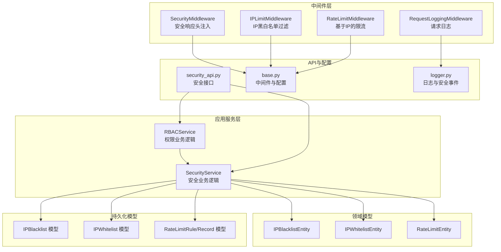
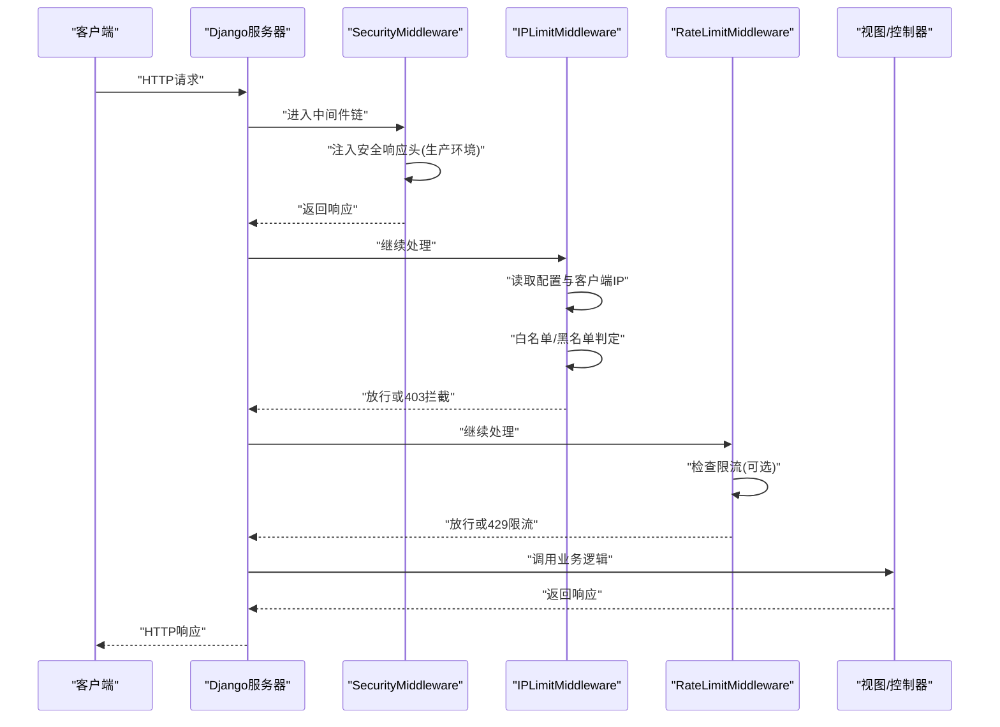
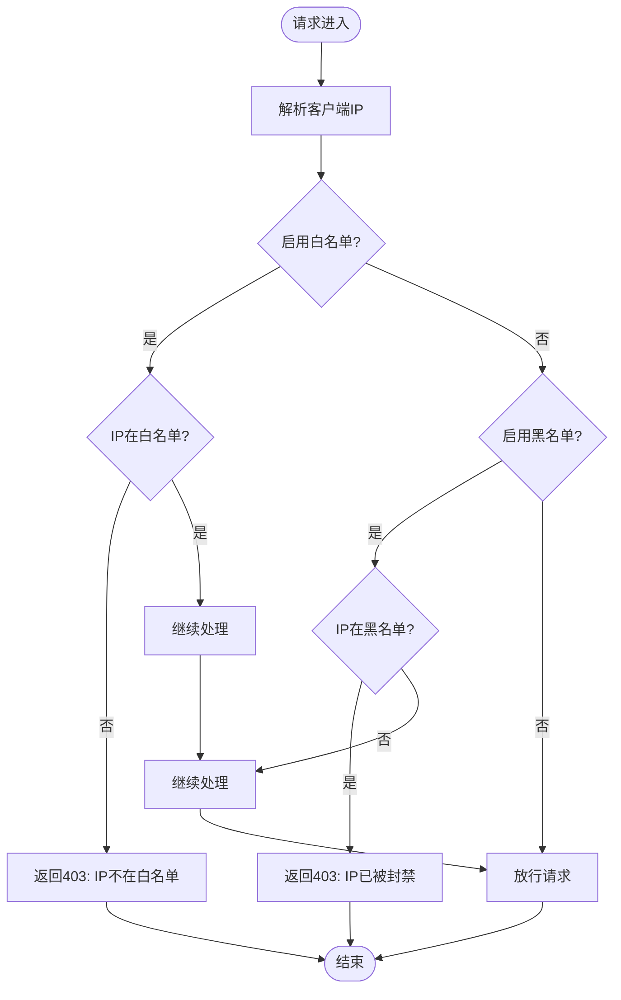
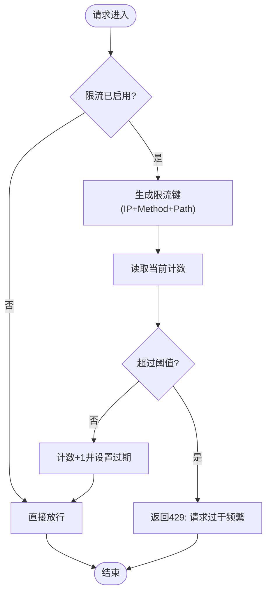
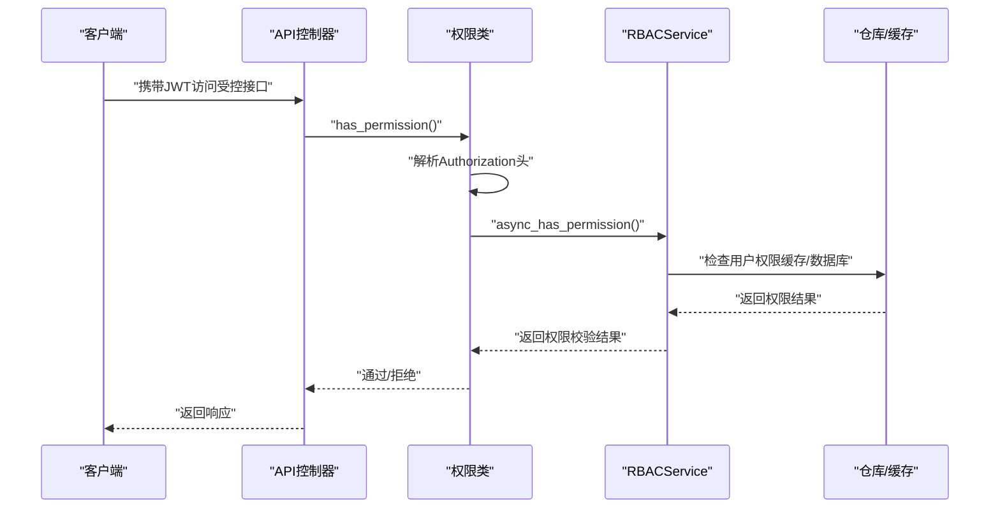
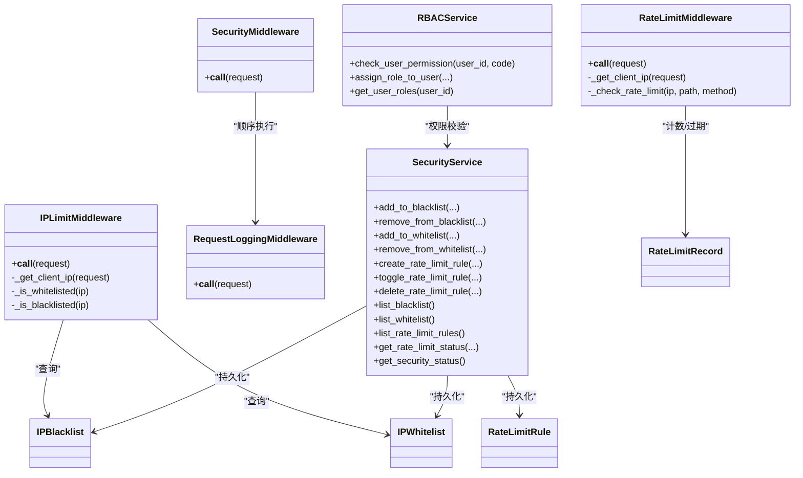

# 安全中间件

<cite>
**本文引用的文件**
- [security_middleware.py](file://src/core/middlewares/security_middleware.py)
- [ip_limit_middleware.py](file://src/core/middlewares/ip_limit_middleware.py)
- [rate_limit_middleware.py](file://src/core/middlewares/rate_limit_middleware.py)
- [request_logging_middleware.py](file://src/core/middlewares/request_logging_middleware.py)
- [security_service.py](file://src/application/services/security_service.py)
- [rbac_service.py](file://src/application/services/rbac_service.py)
- [permissions.py](file://src/api/common/permissions.py)
- [security_models.py](file://src/infrastructure/persistence/models/security_models.py)
- [ip_blacklist_entity.py](file://src/domain/security/entities/ip_blacklist_entity.py)
- [ip_whitelist_entity.py](file://src/domain/security/entities/ip_whitelist_entity.py)
- [rate_limit_entity.py](file://src/domain/security/entities/rate_limit_entity.py)
- [security_api.py](file://src/api/v1/security_api.py)
- [base.py](file://config/settings/base.py)
- [logger.py](file://src/core/logger.py)
- [app.py](file://src/api/app.py)
</cite>

## 目录
1. [简介](#简介)
2. [项目结构](#项目结构)
3. [核心组件](#核心组件)
4. [架构总览](#架构总览)
5. [组件详解](#组件详解)
6. [依赖关系分析](#依赖关系分析)
7. [性能考量](#性能考量)
8. [故障排查指南](#故障排查指南)
9. [结论](#结论)
10. [附录](#附录)

## 简介
本文件面向安全中间件的综合技术文档，聚焦以下目标：
- 安全中间件的核心功能：请求安全验证、恶意请求检测、安全策略执行
- IP黑白名单机制：白名单放行与黑名单拦截的判定逻辑
- 与RBAC系统的集成：权限验证与访问控制
- 配置项说明：安全级别、例外路径、限流与黑白名单开关
- 安全事件日志与告警机制
- 在请求处理链中的位置与执行时机
- 常见安全威胁的防护策略与最佳实践
- 性能优化与监控建议

## 项目结构
安全相关能力由“中间件层 + 应用服务层 + 领域模型 + 持久化模型 + API接口 + 配置”共同构成，整体采用分层架构，职责清晰、边界明确。

图表来源
- [security_middleware.py:14-54](file://src/core/middlewares/security_middleware.py#L14-L54)
- [ip_limit_middleware.py:15-130](file://src/core/middlewares/ip_limit_middleware.py#L15-L130)
- [rate_limit_middleware.py:15-112](file://src/core/middlewares/rate_limit_middleware.py#L15-L112)
- [request_logging_middleware.py:14-86](file://src/core/middlewares/request_logging_middleware.py#L14-L86)
- [security_service.py:24-225](file://src/application/services/security_service.py#L24-L225)
- [rbac_service.py:22-286](file://src/application/services/rbac_service.py#L22-L286)
- [security_models.py:13-162](file://src/infrastructure/persistence/models/security_models.py#L13-L162)
- [ip_blacklist_entity.py:11-53](file://src/domain/security/entities/ip_blacklist_entity.py#L11-L53)
- [ip_whitelist_entity.py:11-47](file://src/domain/security/entities/ip_whitelist_entity.py#L11-L47)
- [rate_limit_entity.py:11-106](file://src/domain/security/entities/rate_limit_entity.py#L11-L106)
- [security_api.py:1-285](file://src/api/v1/security_api.py#L1-L285)
- [base.py:39-52](file://config/settings/base.py#L39-L52)
- [logger.py:12-138](file://src/core/logger.py#L12-L138)

章节来源
- [base.py:39-52](file://config/settings/base.py#L39-L52)
- [app.py:16-31](file://src/api/app.py#L16-L31)

## 核心组件
- 安全中间件（SecurityMiddleware）：在生产环境为响应注入安全头，增强浏览器侧安全防护
- IP限制中间件（IPLimitMiddleware）：基于配置的白名单/黑名单策略，对请求进行放行/拦截
- 限流中间件（RateLimitMiddleware）：基于Redis缓存的简单限流，按IP统计请求频次
- 请求日志中间件（RequestLoggingMiddleware）：记录请求开始/结束、耗时、用户与IP等信息
- 安全服务（SecurityService）：封装IP黑白名单与限流规则的业务逻辑，提供统一入口
- RBAC服务（RBACService）：提供权限校验、角色与权限管理
- 权限类（permissions.py）：基于NinjaExtra的权限体系，结合JWT与RBAC进行访问控制
- 安全模型与实体：ORM模型与数据实体，支撑持久化与业务规则
- 安全API：提供IP黑白名单与限流规则的增删改查与状态查询接口
- 日志与安全事件：集中化的日志配置与安全事件记录

章节来源
- [security_middleware.py:14-54](file://src/core/middlewares/security_middleware.py#L14-L54)
- [ip_limit_middleware.py:15-130](file://src/core/middlewares/ip_limit_middleware.py#L15-L130)
- [rate_limit_middleware.py:15-112](file://src/core/middlewares/rate_limit_middleware.py#L15-L112)
- [request_logging_middleware.py:14-86](file://src/core/middlewares/request_logging_middleware.py#L14-L86)
- [security_service.py:24-225](file://src/application/services/security_service.py#L24-L225)
- [rbac_service.py:22-286](file://src/application/services/rbac_service.py#L22-L286)
- [permissions.py:14-245](file://src/api/common/permissions.py#L14-L245)
- [security_models.py:13-162](file://src/infrastructure/persistence/models/security_models.py#L13-L162)
- [ip_blacklist_entity.py:11-53](file://src/domain/security/entities/ip_blacklist_entity.py#L11-L53)
- [ip_whitelist_entity.py:11-47](file://src/domain/security/entities/ip_whitelist_entity.py#L11-L47)
- [rate_limit_entity.py:11-106](file://src/domain/security/entities/rate_limit_entity.py#L11-L106)
- [security_api.py:1-285](file://src/api/v1/security_api.py#L1-L285)
- [logger.py:12-138](file://src/core/logger.py#L12-L138)

## 架构总览
安全中间件在请求处理链中的位置如下：

图表来源
- [base.py:39-52](file://config/settings/base.py#L39-L52)
- [security_middleware.py:33-53](file://src/core/middlewares/security_middleware.py#L33-L53)
- [ip_limit_middleware.py:41-76](file://src/core/middlewares/ip_limit_middleware.py#L41-L76)
- [rate_limit_middleware.py:41-68](file://src/core/middlewares/rate_limit_middleware.py#L41-L68)

## 组件详解

### 安全中间件（SecurityMiddleware）
- 职责：在生产环境为响应注入安全响应头，提升浏览器侧安全防护
- 关键行为：
  - 仅在非调试模式下生效
  - 注入内容类型嗅探阻止、点击劫持防护、XSS保护、HSTS等头部
- 执行时机：请求处理完成后，响应返回前

章节来源
- [security_middleware.py:14-54](file://src/core/middlewares/security_middleware.py#L14-L54)

### IP限制中间件（IPLimitMiddleware）
- 职责：基于配置的白名单/黑名单策略，对请求进行放行或拦截
- 配置项：
  - IP_BLACKLIST_ENABLED：启用黑名单模式
  - IP_WHITELIST_ENABLED：启用白名单模式
- IP解析：优先使用代理头，回退至远端地址
- 白名单逻辑：仅当IP在白名单且有效时放行
- 黑名单逻辑：若IP永久封禁或未过期临时封禁，则拦截
- 异常处理：拦截时返回JSON错误与403状态码

图表来源
- [ip_limit_middleware.py:41-76](file://src/core/middlewares/ip_limit_middleware.py#L41-L76)
- [ip_limit_middleware.py:78-130](file://src/core/middlewares/ip_limit_middleware.py#L78-L130)

章节来源
- [ip_limit_middleware.py:15-130](file://src/core/middlewares/ip_limit_middleware.py#L15-L130)
- [base.py:233-234](file://config/settings/base.py#L233-L234)

### 限流中间件（RateLimitMiddleware）
- 职责：基于Redis缓存对请求进行频率限制
- 配置项：
  - RATE_LIMIT_ENABLED：是否启用限流
  - RATE_LIMIT_DEFAULT：默认限流规则（示例：每分钟100次）
- 实现要点：
  - 以IP+方法+路径为维度生成键
  - 使用固定窗口计数，60秒过期
  - 超限时返回JSON错误与429状态码

图表来源
- [rate_limit_middleware.py:41-68](file://src/core/middlewares/rate_limit_middleware.py#L41-L68)
- [rate_limit_middleware.py:87-112](file://src/core/middlewares/rate_limit_middleware.py#L87-L112)

章节来源
- [rate_limit_middleware.py:15-112](file://src/core/middlewares/rate_limit_middleware.py#L15-L112)
- [base.py:229-230](file://config/settings/base.py#L229-L230)

### 请求日志中间件（RequestLoggingMiddleware）
- 职责：记录请求开始/结束、耗时、用户与IP等信息
- 作用：便于审计与问题定位

章节来源
- [request_logging_middleware.py:14-86](file://src/core/middlewares/request_logging_middleware.py#L14-L86)

### 安全服务（SecurityService）
- 职责：封装IP黑白名单与限流规则的业务逻辑
- 能力：
  - 黑名单：新增、移除、查询、列表
  - 白名单：新增、移除、列表
  - 限流规则：创建、切换状态、删除、列表、获取限流状态
  - 安全状态：聚合统计黑白名单与限流规则数量
- DTO映射：将领域实体转换为响应DTO

章节来源
- [security_service.py:24-225](file://src/application/services/security_service.py#L24-L225)

### RBAC服务与权限类（RBACService + permissions.py）
- RBACService：提供角色、权限、用户角色关联的管理与权限校验
- 权限类：
  - IsAuthenticated：基于JWT的认证
  - HasPermission / HasAnyPermission：基于RBAC的权限校验
  - IsAdminUser：管理员角色校验
  - AllowAny：开放权限
- 执行流程：先认证，再异步权限检查，最终由业务控制器执行

图表来源
- [permissions.py:14-245](file://src/api/common/permissions.py#L14-L245)
- [rbac_service.py:233-251](file://src/application/services/rbac_service.py#L233-L251)

章节来源
- [rbac_service.py:22-286](file://src/application/services/rbac_service.py#L22-L286)
- [permissions.py:14-245](file://src/api/common/permissions.py#L14-L245)

### 安全模型与实体
- IPBlacklist/IPWhitelist：ORM模型，支持唯一索引、外键关联、有效期判断
- RateLimitRule/Record：限流规则与记录模型，支持复合索引与过期控制
- 领域实体：数据类封装业务规则（如封禁有效性、限流字符串、计数重置）

章节来源
- [security_models.py:13-162](file://src/infrastructure/persistence/models/security_models.py#L13-L162)
- [ip_blacklist_entity.py:11-53](file://src/domain/security/entities/ip_blacklist_entity.py#L11-L53)
- [ip_whitelist_entity.py:11-47](file://src/domain/security/entities/ip_whitelist_entity.py#L11-L47)
- [rate_limit_entity.py:11-106](file://src/domain/security/entities/rate_limit_entity.py#L11-L106)

### 安全API（security_api.py）
- 提供：
  - 黑名单：新增、移除、列表
  - 白名单：新增、移除、列表
  - 限流规则：创建、切换、删除、列表
  - 安全状态：统计黑白名单与限流规则数量
- 与SecurityService配合，实现业务编排

章节来源
- [security_api.py:1-285](file://src/api/v1/security_api.py#L1-L285)

### 日志与安全事件（logger.py）
- 预定义日志器：src、src.auth、src.security、src.api
- 安全事件记录：log_security_event用于记录安全事件
- 访问日志：独立的访问日志器，便于审计

章节来源
- [logger.py:12-138](file://src/core/logger.py#L12-L138)

## 依赖关系分析

图表来源
- [security_middleware.py:14-54](file://src/core/middlewares/security_middleware.py#L14-L54)
- [ip_limit_middleware.py:15-130](file://src/core/middlewares/ip_limit_middleware.py#L15-L130)
- [rate_limit_middleware.py:15-112](file://src/core/middlewares/rate_limit_middleware.py#L15-L112)
- [request_logging_middleware.py:14-86](file://src/core/middlewares/request_logging_middleware.py#L14-L86)
- [security_service.py:24-225](file://src/application/services/security_service.py#L24-L225)
- [rbac_service.py:22-286](file://src/application/services/rbac_service.py#L22-L286)
- [security_models.py:13-162](file://src/infrastructure/persistence/models/security_models.py#L13-L162)

## 性能考量
- 中间件链顺序：SecurityMiddleware位于IPLimitMiddleware与RateLimitMiddleware之前，避免不必要的业务处理
- 缓存与存储：
  - 限流使用Redis缓存，需保证Redis可用性与延迟
  - 黑白名单查询使用数据库，建议在IP字段建立索引
- 并发与限流：
  - 固定窗口计数简单高效，适合中小规模流量
  - 对高并发场景可考虑令牌桶/漏桶算法或分布式限流方案
- 日志开销：
  - 生产环境建议落盘并轮转，避免磁盘IO瓶颈
- 监控指标：
  - 请求量、429限流次数、403拦截次数、响应时间分布

[本节为通用性能建议，不直接分析具体文件]

## 故障排查指南
- IP黑白名单拦截
  - 现象：返回403，消息提示IP不在白名单或已被封禁
  - 排查：确认配置项、IP解析是否正确、封禁有效期
- 限流触发
  - 现象：返回429，提示请求过于频繁
  - 排查：确认限流键生成、Redis连接、阈值设置
- 安全日志
  - 使用log_security_event记录安全事件，结合日志轮转与告警
- 权限校验失败
  - 确认JWT有效性、权限缓存一致性、RBAC规则配置

章节来源
- [ip_limit_middleware.py:55-74](file://src/core/middlewares/ip_limit_middleware.py#L55-L74)
- [rate_limit_middleware.py:58-66](file://src/core/middlewares/rate_limit_middleware.py#L58-L66)
- [logger.py:129-138](file://src/core/logger.py#L129-L138)

## 结论
本安全中间件体系通过中间件链、应用服务、RBAC与日志体系形成闭环，覆盖了响应安全头注入、IP黑白名单过滤、请求限流、权限校验与审计追踪等关键能力。通过合理的配置与监控，可在保证安全性的同时维持良好的性能与可观测性。

[本节为总结性内容，不直接分析具体文件]

## 附录

### 配置项一览
- 中间件链顺序（参考中间件配置）
  - SecurityMiddleware
  - IPLimitMiddleware
  - RateLimitMiddleware
- 安全级别与响应头
  - 生产环境自动注入安全响应头
- 黑白名单与限流开关
  - IP_BLACKLIST_ENABLED
  - IP_WHITELIST_ENABLED
  - RATE_LIMIT_ENABLED
  - RATE_LIMIT_DEFAULT

章节来源
- [base.py:39-52](file://config/settings/base.py#L39-L52)
- [base.py:229-234](file://config/settings/base.py#L229-L234)

### 常见安全威胁与防护策略
- XSS、点击劫持、MIME嗅探：通过安全响应头缓解
- 暴力破解与爬虫：通过限流与IP封禁应对
- 未授权访问：通过JWT认证与RBAC权限控制
- 审计与追溯：通过请求日志与安全事件日志

[本节为通用安全知识，不直接分析具体文件]