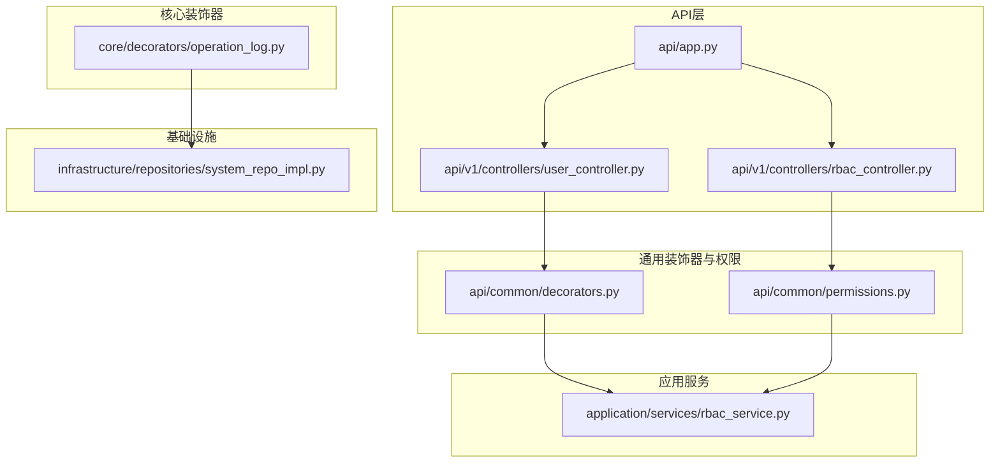
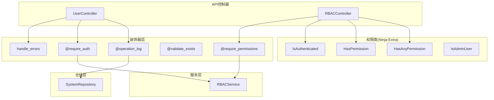
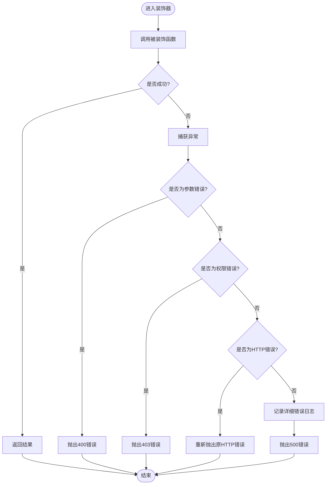
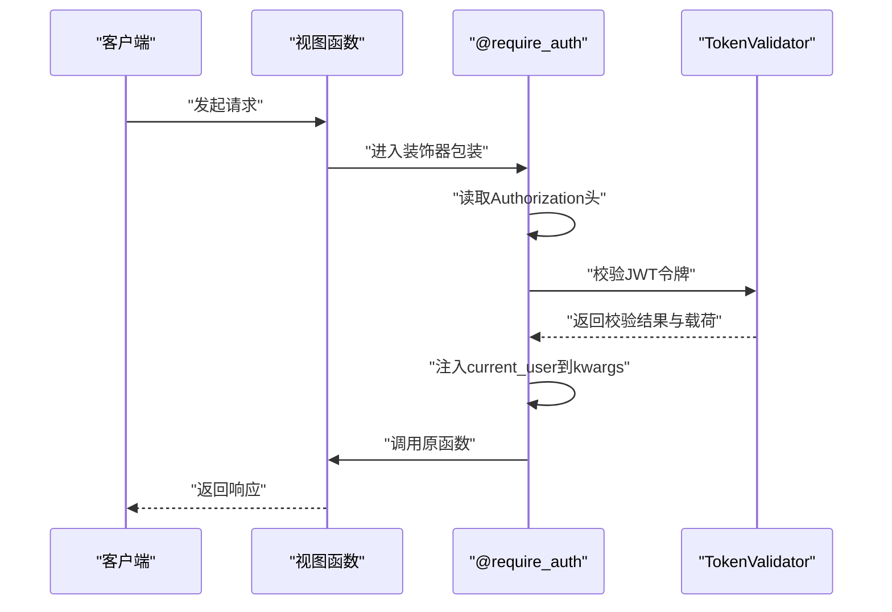
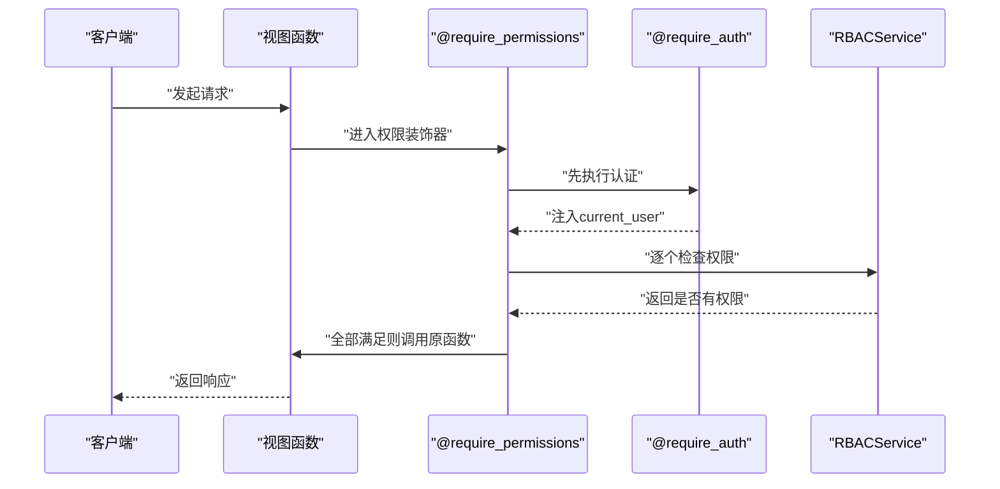
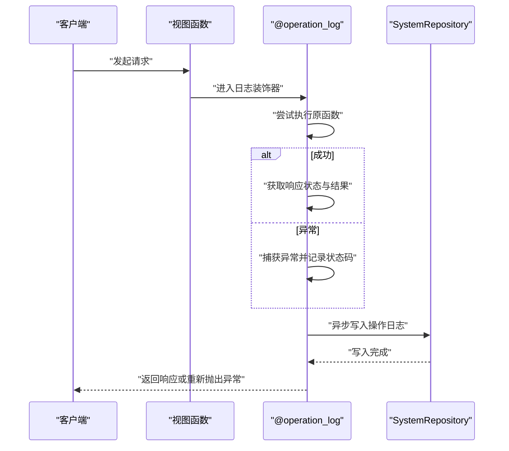
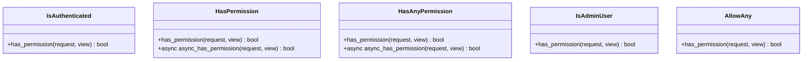
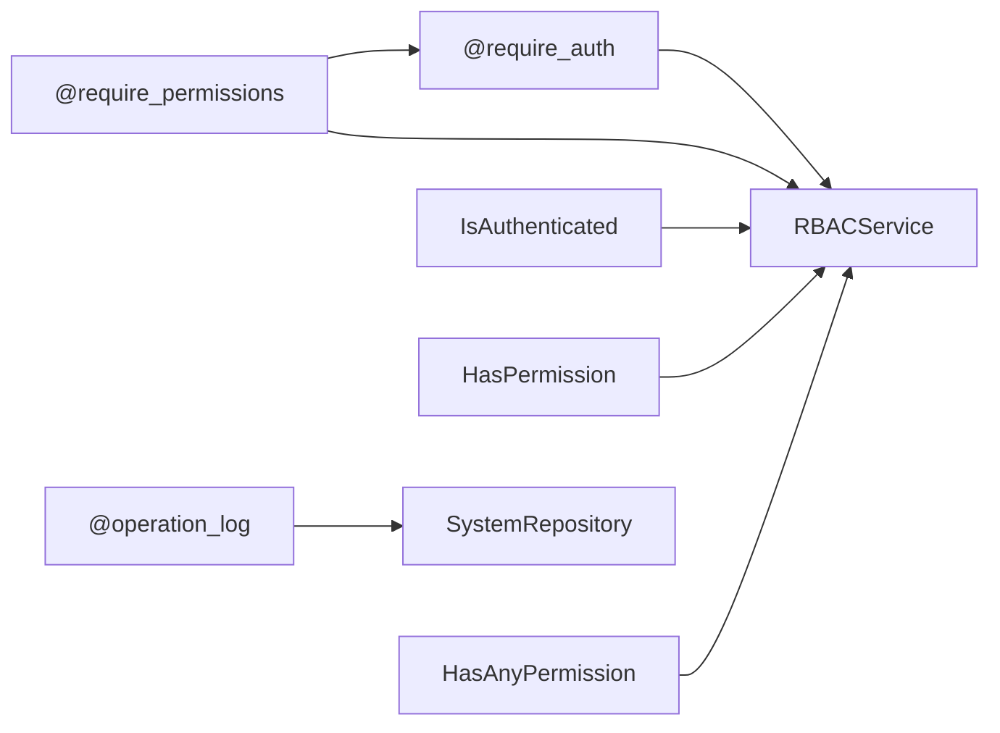

# 装饰器模式应用

<cite>
**本文引用的文件**
- [src/api/common/decorators.py](file://src/api/common/decorators.py)
- [src/api/common/permissions.py](file://src/api/common/permissions.py)
- [src/core/decorators/operation_log.py](file://src/core/decorators/operation_log.py)
- [src/application/services/rbac_service.py](file://src/application/services/rbac_service.py)
- [src/infrastructure/repositories/system_repo_impl.py](file://src/infrastructure/repositories/system_repo_impl.py)
- [src/api/v1/controllers/user_controller.py](file://src/api/v1/controllers/user_controller.py)
- [src/api/v1/controllers/rbac_controller.py](file://src/api/v1/controllers/rbac_controller.py)
- [src/api/app.py](file://src/api/app.py)
- [src/core/middlewares/request_logging_middleware.py](file://src/core/middlewares/request_logging_middleware.py)
- [src/core/middlewares/security_middleware.py](file://src/core/middlewares/security_middleware.py)
</cite>

## 目录
1. [引言](#引言)
2. [项目结构](#项目结构)
3. [核心组件](#核心组件)
4. [架构总览](#架构总览)
5. [详细组件分析](#详细组件分析)
6. [依赖分析](#依赖分析)
7. [性能考量](#性能考量)
8. [故障排查指南](#故障排查指南)
9. [结论](#结论)
10. [附录](#附录)

## 引言
本技术文档围绕装饰器模式在权限控制与审计日志中的应用展开，结合 Django-Ninja 与 Ninja-Extra 的实现，系统讲解装饰器的设计原理、参数传递与函数包装技术，并给出组合使用、执行顺序、与中间件的区别与选择原则、性能影响与优化策略、以及自定义装饰器的开发指导与最佳实践。同时覆盖异步视图下的使用注意事项。

## 项目结构
本项目采用分层清晰的目录组织：API 控制器位于 v1 层，通用装饰器与权限类位于 common 层，核心装饰器（如操作日志）位于 core/decorators，业务服务位于 application，仓储实现位于 infrastructure，入口应用在 api/app.py。

**图表来源**
- [src/api/app.py:17-30](file://src/api/app.py#L17-L30)
- [src/api/v1/controllers/user_controller.py:33](file://src/api/v1/controllers/user_controller.py#L33)
- [src/api/v1/controllers/rbac_controller.py:38](file://src/api/v1/controllers/rbac_controller.py#L38)
- [src/api/common/decorators.py:13](file://src/api/common/decorators.py#L13)
- [src/api/common/permissions.py:14](file://src/api/common/permissions.py#L14)
- [src/core/decorators/operation_log.py:15](file://src/core/decorators/operation_log.py#L15)
- [src/application/services/rbac_service.py:22](file://src/application/services/rbac_service.py#L22)
- [src/infrastructure/repositories/system_repo_impl.py:22](file://src/infrastructure/repositories/system_repo_impl.py#L22)

**章节来源**
- [src/api/app.py:17-30](file://src/api/app.py#L17-L30)

## 核心组件
- 统一错误处理装饰器：捕获业务异常并转换为 HTTP 错误，保证 API 响应一致性。
- 认证装饰器：校验 Bearer 令牌并将当前用户注入到 kwargs，供后续逻辑使用。
- 权限装饰器：在认证基础上检查用户是否具备所需权限，支持多权限校验。
- 实体存在性装饰器：在执行业务前校验实体是否存在，避免空引用。
- 操作日志装饰器：自动记录 API 操作日志，包含请求上下文、响应状态与错误信息。
- 权限类（Ninja-Extra）：基于 BasePermission 的认证与权限检查，支持同步与异步权限检查。

**章节来源**
- [src/api/common/decorators.py:13](file://src/api/common/decorators.py#L13-L50)
- [src/api/common/decorators.py:53](file://src/api/common/decorators.py#L53-L92)
- [src/api/common/decorators.py:95](file://src/api/common/decorators.py#L95-L143)
- [src/api/common/decorators.py:146](file://src/api/common/decorators.py#L146-L190)
- [src/core/decorators/operation_log.py:15](file://src/core/decorators/operation_log.py#L15-L72)
- [src/api/common/permissions.py:14](file://src/api/common/permissions.py#L14-L44)
- [src/api/common/permissions.py:47](file://src/api/common/permissions.py#L47-L121)
- [src/api/common/permissions.py:123](file://src/api/common/permissions.py#L123-L195)
- [src/api/common/permissions.py:198](file://src/api/common/permissions.py#L198-L233)

## 架构总览
装饰器与权限类在 API 层形成“细粒度、可组合”的横切关注点，既可直接装饰控制器方法，也可通过 Ninja-Extra 的权限类在控制器级别统一管理。操作日志装饰器贯穿业务流程，提供审计能力。

**图表来源**
- [src/api/v1/controllers/user_controller.py:33](file://src/api/v1/controllers/user_controller.py#L33)
- [src/api/v1/controllers/rbac_controller.py:38](file://src/api/v1/controllers/rbac_controller.py#L38)
- [src/api/common/decorators.py:13](file://src/api/common/decorators.py#L13-L50)
- [src/api/common/decorators.py:53](file://src/api/common/decorators.py#L53-L92)
- [src/api/common/decorators.py:95](file://src/api/common/decorators.py#L95-L143)
- [src/api/common/decorators.py:146](file://src/api/common/decorators.py#L146-L190)
- [src/core/decorators/operation_log.py:15](file://src/core/decorators/operation_log.py#L15-L72)
- [src/api/common/permissions.py:14](file://src/api/common/permissions.py#L14-L44)
- [src/api/common/permissions.py:47](file://src/api/common/permissions.py#L47-L121)
- [src/api/common/permissions.py:123](file://src/api/common/permissions.py#L123-L195)
- [src/application/services/rbac_service.py:22](file://src/application/services/rbac_service.py#L22)
- [src/infrastructure/repositories/system_repo_impl.py:22](file://src/infrastructure/repositories/system_repo_impl.py#L22)

## 详细组件分析

### 统一错误处理装饰器
- 设计要点：使用装饰器包装目标函数，捕获特定异常并转换为 HTTP 错误；对未知异常记录日志后统一返回 500。
- 参数与包装：接收被装饰函数，返回包装后的异步 wrapper，保持原函数签名与行为。
- 执行顺序：建议置于最外层，优先拦截业务异常并转换。

**图表来源**
- [src/api/common/decorators.py:13](file://src/api/common/decorators.py#L13-L50)

**章节来源**
- [src/api/common/decorators.py:13](file://src/api/common/decorators.py#L13-L50)

### 认证装饰器
- 设计要点：从请求头解析 Bearer 令牌，调用令牌验证器校验有效性，将用户载荷注入 kwargs。
- 参数与包装：装饰器不带参数，返回包装后的异步 wrapper。
- 注意事项：若未携带有效令牌，直接抛出 401。

**图表来源**
- [src/api/common/decorators.py:53](file://src/api/common/decorators.py#L53-L92)

**章节来源**
- [src/api/common/decorators.py:53](file://src/api/common/decorators.py#L53-L92)

### 权限装饰器（@require_permissions）
- 设计要点：在认证基础上逐项检查用户是否具备所需权限，支持多个权限码。
- 参数与包装：装饰器接受权限码列表作为参数，返回嵌套装饰器，内部再次应用认证装饰器。
- 与服务交互：通过 RBAC 服务查询用户权限，缓存命中则直接返回，未命中则查询数据库并写入缓存。

**图表来源**
- [src/api/common/decorators.py:95](file://src/api/common/decorators.py#L95-L143)
- [src/application/services/rbac_service.py:233](file://src/application/services/rbac_service.py#L233-L251)

**章节来源**
- [src/api/common/decorators.py:95](file://src/api/common/decorators.py#L95-L143)
- [src/application/services/rbac_service.py:233](file://src/application/services/rbac_service.py#L233-L251)

### 实体存在性装饰器（@validate_exists）
- 设计要点：从 kwargs 中推断实体 ID，调用传入的异步获取函数，若不存在则抛出 404。
- 参数与包装：装饰器接受一个异步函数，返回包装后的异步 wrapper，并将实体注入 kwargs。

**章节来源**
- [src/api/common/decorators.py:146](file://src/api/common/decorators.py#L146-L190)

### 操作日志装饰器（@operation_log）
- 设计要点：在函数执行前后收集请求上下文、响应状态与错误信息，异步写入系统操作日志仓储。
- 参数与包装：装饰器接受模块名与描述，返回包装后的异步 wrapper；日志记录失败不影响主流程。
- 上下文采集：用户 ID、路径、方法、请求体、IP、浏览器与系统信息等。

**图表来源**
- [src/core/decorators/operation_log.py:15](file://src/core/decorators/operation_log.py#L15-L72)
- [src/infrastructure/repositories/system_repo_impl.py:432](file://src/infrastructure/repositories/system_repo_impl.py#L432-L463)

**章节来源**
- [src/core/decorators/operation_log.py:15](file://src/core/decorators/operation_log.py#L15-L72)
- [src/infrastructure/repositories/system_repo_impl.py:432](file://src/infrastructure/repositories/system_repo_impl.py#L432-L463)

### 权限类（Ninja-Extra）
- IsAuthenticated：认证检查，将用户信息注入 request。
- HasPermission / HasAnyPermission：权限检查，支持同步与异步权限检查。
- IsAdminUser：管理员角色检查。
- AllowAny：允许所有访问。

**图表来源**
- [src/api/common/permissions.py:14](file://src/api/common/permissions.py#L14-L44)
- [src/api/common/permissions.py:47](file://src/api/common/permissions.py#L47-L121)
- [src/api/common/permissions.py:123](file://src/api/common/permissions.py#L123-L195)
- [src/api/common/permissions.py:198](file://src/api/common/permissions.py#L198-L233)
- [src/api/common/permissions.py:236](file://src/api/common/permissions.py#L236-L244)

**章节来源**
- [src/api/common/permissions.py:14](file://src/api/common/permissions.py#L14-L44)
- [src/api/common/permissions.py:47](file://src/api/common/permissions.py#L47-L121)
- [src/api/common/permissions.py:123](file://src/api/common/permissions.py#L123-L195)
- [src/api/common/permissions.py:198](file://src/api/common/permissions.py#L198-L233)
- [src/api/common/permissions.py:236](file://src/api/common/permissions.py#L236-L244)

## 依赖分析
- 装饰器依赖关系：权限装饰器内部依赖认证装饰器；两者均依赖 RBAC 服务进行权限校验。
- 权限类依赖关系：权限类依赖 TokenValidator 进行令牌校验，并依赖 RBAC 服务进行权限判断。
- 操作日志装饰器依赖：异步写入 SystemRepository，不阻塞主流程。
- 控制器使用：UserController 通过权限类实现认证与权限控制；RBACController 通过装饰器与权限类共同实现细粒度权限控制。

**图表来源**
- [src/api/common/decorators.py:53](file://src/api/common/decorators.py#L53-L92)
- [src/api/common/decorators.py:95](file://src/api/common/decorators.py#L95-L143)
- [src/api/common/permissions.py:14](file://src/api/common/permissions.py#L14-L44)
- [src/api/common/permissions.py:47](file://src/api/common/permissions.py#L47-L121)
- [src/api/common/permissions.py:123](file://src/api/common/permissions.py#L123-L195)
- [src/core/decorators/operation_log.py:15](file://src/core/decorators/operation_log.py#L15-L72)
- [src/application/services/rbac_service.py:22](file://src/application/services/rbac_service.py#L22)
- [src/infrastructure/repositories/system_repo_impl.py:22](file://src/infrastructure/repositories/system_repo_impl.py#L22)

**章节来源**
- [src/api/common/decorators.py:53](file://src/api/common/decorators.py#L53-L92)
- [src/api/common/decorators.py:95](file://src/api/common/decorators.py#L95-L143)
- [src/api/common/permissions.py:14](file://src/api/common/permissions.py#L14-L44)
- [src/api/common/permissions.py:47](file://src/api/common/permissions.py#L47-L121)
- [src/api/common/permissions.py:123](file://src/api/common/permissions.py#L123-L195)
- [src/core/decorators/operation_log.py:15](file://src/core/decorators/operation_log.py#L15-L72)
- [src/application/services/rbac_service.py:22](file://src/application/services/rbac_service.py#L22)
- [src/infrastructure/repositories/system_repo_impl.py:22](file://src/infrastructure/repositories/system_repo_impl.py#L22)

## 性能考量
- 装饰器开销：装饰器引入一层函数调用与异常捕获，通常为微小开销；建议在高频路径上谨慎叠加装饰器层数。
- 权限缓存：RBAC 服务对用户权限进行缓存，显著降低重复查询成本；分配/移除角色后及时清理缓存。
- 异步日志：操作日志装饰器异步写入，避免阻塞主流程；日志记录失败不影响业务响应。
- 中间件对比：中间件对所有请求生效，适合全局横切（如安全头、请求日志），装饰器更灵活且可按需启用。

**章节来源**
- [src/application/services/rbac_service.py:233](file://src/application/services/rbac_service.py#L233-L251)
- [src/core/decorators/operation_log.py:54](file://src/core/decorators/operation_log.py#L54-L68)

## 故障排查指南
- 401 未认证：检查 Authorization 头格式与令牌有效性；确认装饰器是否正确注入 current_user。
- 403 权限不足：确认用户角色与权限映射；检查权限码拼写与缓存状态。
- 404 资源不存在：确认实体存在性装饰器是否正确识别 ID 并触发异常。
- 500 服务器错误：统一错误处理装饰器会捕获未知异常并记录日志；检查日志输出定位问题。
- 日志缺失：确认操作日志装饰器是否包裹目标函数，且仓储写入未抛出异常。

**章节来源**
- [src/api/common/decorators.py:13](file://src/api/common/decorators.py#L13-L50)
- [src/api/common/decorators.py:53](file://src/api/common/decorators.py#L53-L92)
- [src/api/common/decorators.py:95](file://src/api/common/decorators.py#L95-L143)
- [src/api/common/decorators.py:146](file://src/api/common/decorators.py#L146-L190)
- [src/core/decorators/operation_log.py:54](file://src/core/decorators/operation_log.py#L54-L68)

## 结论
装饰器模式在本项目中实现了细粒度、可组合的权限控制与审计能力。通过装饰器与 Ninja-Extra 权限类的协同，既能满足灵活的业务需求，又能保持代码的可维护性与可测试性。配合缓存与异步日志，可在保证功能完整性的同时兼顾性能与可观测性。

## 附录

### 装饰器组合与执行顺序
- 推荐顺序：统一错误处理装饰器在外层，认证装饰器在权限装饰器之前，实体存在性装饰器在业务逻辑之前，操作日志装饰器在最后。
- 示例参考：UserController 中的认证与日志装饰器组合；RBACController 中的权限装饰器组合。

**章节来源**
- [src/api/v1/controllers/user_controller.py:33](file://src/api/v1/controllers/user_controller.py#L33)
- [src/api/v1/controllers/rbac_controller.py:38](file://src/api/v1/controllers/rbac_controller.py#L38)

### 装饰器与中间件的区别与选择原则
- 装饰器：按需应用于特定视图或控制器，灵活性高，适合细粒度横切（认证、权限、日志）。
- 中间件：对所有请求生效，适合全局横切（安全头、请求日志、限流等）。
- 选择原则：若需针对特定端点启用审计或权限控制，优先使用装饰器；若需全局增强安全性或日志记录，使用中间件。

**章节来源**
- [src/core/middlewares/request_logging_middleware.py:14](file://src/core/middlewares/request_logging_middleware.py#L14-L85)
- [src/core/middlewares/security_middleware.py:14](file://src/core/middlewares/security_middleware.py#L14-L53)

### 自定义装饰器开发指导与最佳实践
- 保持无副作用：装饰器仅负责横切逻辑，不改变业务返回值结构。
- 异步兼容：确保装饰器包装的是异步函数，使用 async/await。
- 参数传递：通过闭包捕获装饰器参数，返回包装后的异步 wrapper。
- 错误处理：对异常进行分类处理，必要时记录日志并转换为标准 HTTP 错误。
- 性能优化：对昂贵操作（如权限查询）使用缓存；日志写入采用异步非阻塞方式。
- 可测试性：将核心逻辑拆分为独立函数，便于单元测试。

**章节来源**
- [src/api/common/decorators.py:13](file://src/api/common/decorators.py#L13-L50)
- [src/core/decorators/operation_log.py:15](file://src/core/decorators/operation_log.py#L15-L72)

### 异步视图中的使用注意事项
- 装饰器必须包装为异步函数，使用 async/await 调用被装饰函数与服务。
- 操作日志装饰器已内置异步写入逻辑，无需额外改造。
- 权限类的异步权限检查通过 async_has_permission 提供，确保与异步视图一致。

**章节来源**
- [src/api/common/decorators.py:31](file://src/api/common/decorators.py#L31-L50)
- [src/api/common/permissions.py:103](file://src/api/common/permissions.py#L103-L120)
- [src/api/common/permissions.py:173](file://src/api/common/permissions.py#L173-L195)
- [src/core/decorators/operation_log.py:29](file://src/core/decorators/operation_log.py#L29-L72)