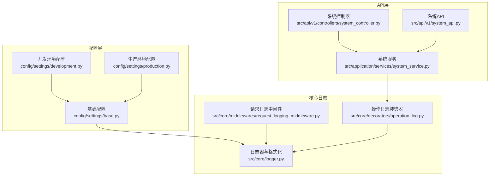
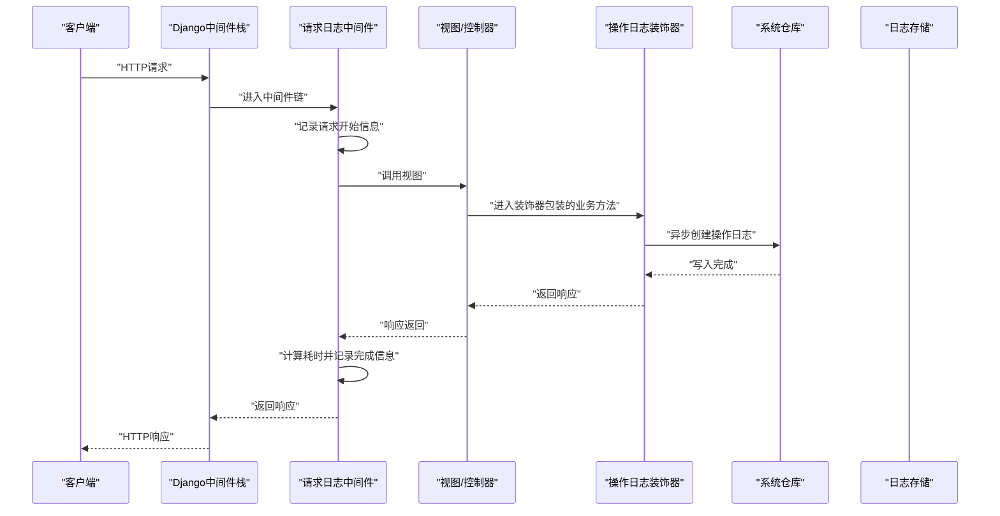
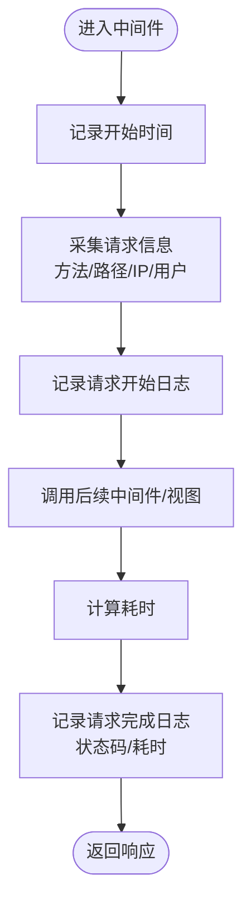
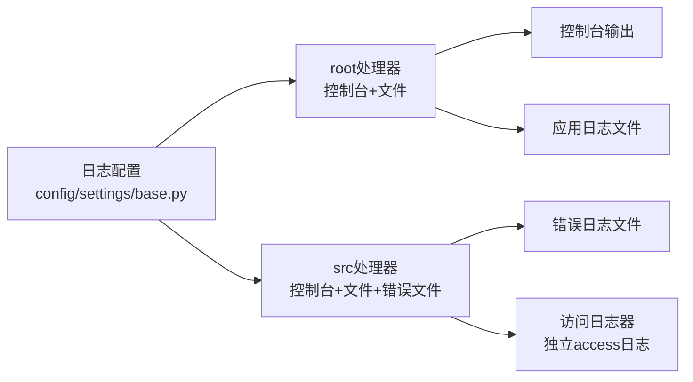
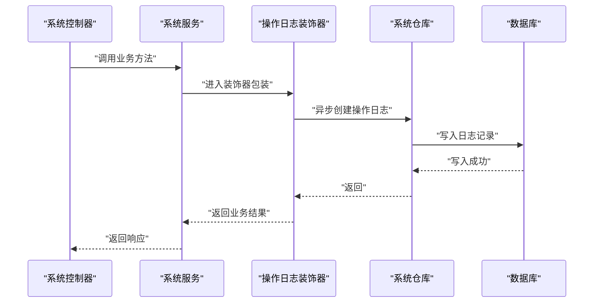
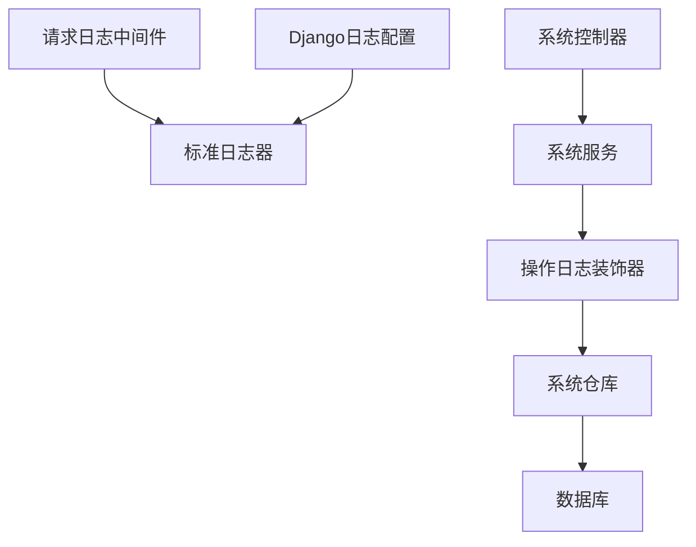

# 请求日志中间件

<cite>
**本文引用的文件**
- [request_logging_middleware.py](file://src/core/middlewares/request_logging_middleware.py)
- [logger.py](file://src/core/logger.py)
- [base.py](file://config/settings/base.py)
- [development.py](file://config/settings/development.py)
- [production.py](file://config/settings/production.py)
- [operation_log.py](file://src/core/decorators/operation_log.py)
- [system_controller.py](file://src/api/v1/controllers/system_controller.py)
- [system_service.py](file://src/application/services/system_service.py)
- [system_api.py](file://src/api/v1/system_api.py)
- [__init__.py](file://src/core/middlewares/__init__.py)
</cite>

## 目录
1. [简介](#简介)
2. [项目结构](#项目结构)
3. [核心组件](#核心组件)
4. [架构总览](#架构总览)
5. [详细组件分析](#详细组件分析)
6. [依赖分析](#依赖分析)
7. [性能考虑](#性能考虑)
8. [故障排除指南](#故障排除指南)
9. [结论](#结论)
10. [附录](#附录)

## 简介
本技术文档围绕请求日志中间件展开，系统性阐述其作用、实现原理与工作机制，涵盖请求信息采集、日志格式化与输出策略、日志级别与过滤机制、存储方式（文件、控制台、外部系统）、性能优化（异步写入与批量处理）、配置选项与自定义格式、日志分析与监控最佳实践，以及调试与故障排除方法。同时结合项目中的操作日志装饰器与系统日志管理能力，给出统一的日志治理视角。

## 项目结构
请求日志中间件位于核心中间件层，配合全局日志配置与操作日志装饰器共同构成完整的日志体系。关键位置如下：
- 请求日志中间件：src/core/middlewares/request_logging_middleware.py
- 全局日志配置与专用日志器：src/core/logger.py
- Django日志配置：config/settings/base.py、development.py、production.py
- 操作日志装饰器：src/core/decorators/operation_log.py
- 系统日志管理API与服务：src/api/v1/controllers/system_controller.py、src/application/services/system_service.py、src/api/v1/system_api.py
- 中间件统一导出：src/core/middlewares/__init__.py

**图表来源**
- [base.py:174-226](file://config/settings/base.py#L174-L226)
- [development.py:18-23](file://config/settings/development.py#L18-L23)
- [production.py:25-39](file://config/settings/production.py#L25-L39)
- [logger.py:12-82](file://src/core/logger.py#L12-L82)
- [request_logging_middleware.py:14-86](file://src/core/middlewares/request_logging_middleware.py#L14-L86)
- [operation_log.py:15-72](file://src/core/decorators/operation_log.py#L15-L72)
- [system_controller.py:60-734](file://src/api/v1/controllers/system_controller.py#L60-L734)
- [system_service.py:403-434](file://src/application/services/system_service.py#L403-L434)
- [system_api.py:364-408](file://src/api/v1/system_api.py#L364-L408)

**章节来源**
- [base.py:174-226](file://config/settings/base.py#L174-L226)
- [development.py:18-23](file://config/settings/development.py#L18-L23)
- [production.py:25-39](file://config/settings/production.py#L25-L39)
- [logger.py:12-82](file://src/core/logger.py#L12-L82)
- [request_logging_middleware.py:14-86](file://src/core/middlewares/request_logging_middleware.py#L14-L86)
- [operation_log.py:15-72](file://src/core/decorators/operation_log.py#L15-L72)
- [system_controller.py:60-734](file://src/api/v1/controllers/system_controller.py#L60-L734)
- [system_service.py:403-434](file://src/application/services/system_service.py#L403-L434)
- [system_api.py:364-408](file://src/api/v1/system_api.py#L364-L408)

## 核心组件
- 请求日志中间件：负责在请求进入与完成时记录关键信息（方法、路径、客户端IP、用户标识、耗时、状态码），并支持代理场景下的真实IP解析。
- 全局日志器与格式化：集中配置日志级别、格式、控制台与文件处理器，并按环境区分输出策略。
- 操作日志装饰器：在业务方法执行前后自动采集请求上下文、响应状态与异常信息，异步持久化到数据库，形成结构化的操作日志。
- 系统日志管理：提供操作日志的查询与统计接口，支撑审计与监控。

**章节来源**
- [request_logging_middleware.py:14-86](file://src/core/middlewares/request_logging_middleware.py#L14-L86)
- [logger.py:12-82](file://src/core/logger.py#L12-L82)
- [operation_log.py:15-72](file://src/core/decorators/operation_log.py#L15-L72)
- [system_controller.py:661-734](file://src/api/v1/controllers/system_controller.py#L661-L734)

## 架构总览
请求日志中间件与操作日志装饰器分别承担“网关层”和“业务层”的日志采集，二者协同工作，形成从入口到业务执行的完整日志链路。

**图表来源**
- [request_logging_middleware.py:34-68](file://src/core/middlewares/request_logging_middleware.py#L34-L68)
- [operation_log.py:29-72](file://src/core/decorators/operation_log.py#L29-L72)
- [system_service.py:403-434](file://src/application/services/system_service.py#L403-L434)

## 详细组件分析

### 请求日志中间件
- 作用与功能
  - 记录请求开始与完成信息
  - 计算请求耗时
  - 采集客户端IP、用户标识等上下文
- 实现要点
  - 使用时间戳记录请求开始与结束，计算耗时
  - 通过请求头解析真实IP，兼容代理场景
  - 使用标准日志器输出请求开始与完成两条日志
- 关键字段
  - 请求方法、请求路径、客户端IP、用户标识、响应状态码、耗时

**图表来源**
- [request_logging_middleware.py:34-68](file://src/core/middlewares/request_logging_middleware.py#L34-L68)

**章节来源**
- [request_logging_middleware.py:14-86](file://src/core/middlewares/request_logging_middleware.py#L14-L86)

### 全局日志配置与输出机制
- 日志级别与过滤
  - 开发环境：root与src日志器级别较低，便于调试
  - 生产环境：root提升至警告级别，src提升至信息级别，减少噪声
- 输出目标
  - 控制台：始终输出，便于本地开发观察
  - 文件：应用日志、错误日志、访问日志三套处理器，轮转保存
- 格式化
  - 统一的时间、模块名、级别、消息格式；支持JSON格式化器（在基础配置中定义）

**图表来源**
- [base.py:174-226](file://config/settings/base.py#L174-L226)
- [development.py:18-23](file://config/settings/development.py#L18-L23)
- [production.py:25-39](file://config/settings/production.py#L25-L39)
- [logger.py:12-82](file://src/core/logger.py#L12-L82)

**章节来源**
- [base.py:174-226](file://config/settings/base.py#L174-L226)
- [development.py:18-23](file://config/settings/development.py#L18-L23)
- [production.py:25-39](file://config/settings/production.py#L25-L39)
- [logger.py:12-82](file://src/core/logger.py#L12-L82)

### 操作日志装饰器与系统日志管理
- 装饰器职责
  - 自动捕获请求上下文（路径、方法、IP、UA、用户）
  - 捕获响应状态码与结果，或异常信息
  - 异步写入系统操作日志表，不影响主流程
- 系统日志管理
  - 提供分页、多条件过滤（模块、方法、时间范围、状态码等）的操作日志查询接口
  - 服务层封装查询与DTO转换，控制器暴露REST API

**图表来源**
- [operation_log.py:29-72](file://src/core/decorators/operation_log.py#L29-L72)
- [system_service.py:403-434](file://src/application/services/system_service.py#L403-L434)
- [system_controller.py:661-734](file://src/api/v1/controllers/system_controller.py#L661-L734)

**章节来源**
- [operation_log.py:15-175](file://src/core/decorators/operation_log.py#L15-L175)
- [system_controller.py:661-734](file://src/api/v1/controllers/system_controller.py#L661-L734)
- [system_service.py:403-434](file://src/application/services/system_service.py#L403-L434)

## 依赖分析
- 中间件依赖
  - 请求日志中间件依赖Django HTTP请求对象与标准日志器
  - 操作日志装饰器依赖请求对象、系统仓库与异步写入
- 配置依赖
  - 日志配置由Django settings统一管理，按环境切换级别与输出目标
- 组件耦合
  - 请求日志中间件与操作日志装饰器分别面向不同层次，耦合度低，可独立演进
  - 系统日志管理API与服务通过装饰器沉淀的数据进行查询，形成闭环

**图表来源**
- [request_logging_middleware.py:6-11](file://src/core/middlewares/request_logging_middleware.py#L6-L11)
- [logger.py:12-82](file://src/core/logger.py#L12-L82)
- [operation_log.py:84-127](file://src/core/decorators/operation_log.py#L84-L127)
- [system_service.py:403-434](file://src/application/services/system_service.py#L403-L434)
- [base.py:174-226](file://config/settings/base.py#L174-L226)

**章节来源**
- [request_logging_middleware.py:6-11](file://src/core/middlewares/request_logging_middleware.py#L6-L11)
- [logger.py:12-82](file://src/core/logger.py#L12-L82)
- [operation_log.py:84-127](file://src/core/decorators/operation_log.py#L84-L127)
- [system_service.py:403-434](file://src/application/services/system_service.py#L403-L434)
- [base.py:174-226](file://config/settings/base.py#L174-L226)

## 性能考虑
- 日志级别与过滤
  - 生产环境提高root与src日志器级别，降低低价值日志输出
- 输出目标选择
  - 开发环境以控制台为主，减少磁盘IO
  - 生产环境采用轮转文件，避免单文件过大
- 异步写入与批量处理
  - 操作日志装饰器采用异步写入，避免阻塞主业务线程
  - 可进一步引入队列/批处理策略，将多条日志合并提交，降低IO压力
- 资源开销控制
  - 限制请求体日志长度，防止超大请求导致日志膨胀
  - 合理设置轮转大小与备份数量，平衡磁盘占用与检索便利性

[本节为通用性能建议，不直接分析具体文件，故无“章节来源”]

## 故障排除指南
- 日志未输出或输出异常
  - 检查环境变量与配置文件中的日志级别设置
  - 确认日志目录存在且具备写权限
- IP显示异常
  - 确认反向代理正确传递客户端IP头
  - 核对中间件解析逻辑与请求头字段
- 操作日志缺失
  - 确认业务方法被装饰器包裹
  - 检查异步写入任务是否正常执行
- 查询不到日志
  - 核对过滤条件（模块、方法、时间范围、状态码）
  - 检查日志表结构与索引

**章节来源**
- [base.py:174-226](file://config/settings/base.py#L174-L226)
- [logger.py:42-82](file://src/core/logger.py#L42-L82)
- [request_logging_middleware.py:70-86](file://src/core/middlewares/request_logging_middleware.py#L70-L86)
- [operation_log.py:54-68](file://src/core/decorators/operation_log.py#L54-L68)
- [system_controller.py:661-734](file://src/api/v1/controllers/system_controller.py#L661-L734)

## 结论
请求日志中间件与操作日志装饰器共同构成了从入口到业务执行的双层日志体系。通过合理的日志级别与输出策略、清晰的字段采集与格式化、以及异步持久化机制，既能满足开发调试需求，也能在生产环境中提供稳定、可观测的日志能力。结合系统日志管理API，可实现高效的审计与监控闭环。

[本节为总结性内容，不直接分析具体文件，故无“章节来源”]

## 附录

### 日志记录的关键信息清单
- 请求时间：请求开始与结束时间
- 客户端IP：解析真实IP（支持代理）
- 用户标识：当前登录用户或匿名
- 请求路径与方法：HTTP方法与请求路径
- 响应状态码：最终响应状态
- 耗时：请求处理耗时（秒）
- 浏览器与系统：User-Agent解析结果（来自操作日志装饰器）
- 请求体摘要：限制长度的请求体内容（来自操作日志装饰器）

**章节来源**
- [request_logging_middleware.py:44-66](file://src/core/middlewares/request_logging_middleware.py#L44-L66)
- [operation_log.py:95-127](file://src/core/decorators/operation_log.py#L95-L127)

### 配置选项与自定义格式
- 环境相关
  - 开发/生产环境日志级别差异
  - 开发环境仅输出到控制台，生产环境输出到文件
- 日志格式
  - 支持统一格式与JSON格式（在基础配置中定义）
- 存储策略
  - 应用日志、错误日志、访问日志分离存储
  - 轮转文件与备份数量配置

**章节来源**
- [development.py:18-23](file://config/settings/development.py#L18-L23)
- [production.py:25-39](file://config/settings/production.py#L25-L39)
- [base.py:174-226](file://config/settings/base.py#L174-L226)
- [logger.py:42-82](file://src/core/logger.py#L42-L82)

### 日志分析与监控最佳实践
- 结构化日志：优先使用统一格式或JSON格式，便于解析与检索
- 分层日志：区分应用日志、错误日志、访问日志，便于定位问题
- 过滤与聚合：基于模块、方法、状态码、时间窗口进行聚合分析
- 告警联动：对错误日志与异常状态码建立告警规则
- 审计留痕：保留足够的上下文信息（用户、IP、UA、请求体摘要）以满足合规要求

[本节为通用最佳实践，不直接分析具体文件，故无“章节来源”]