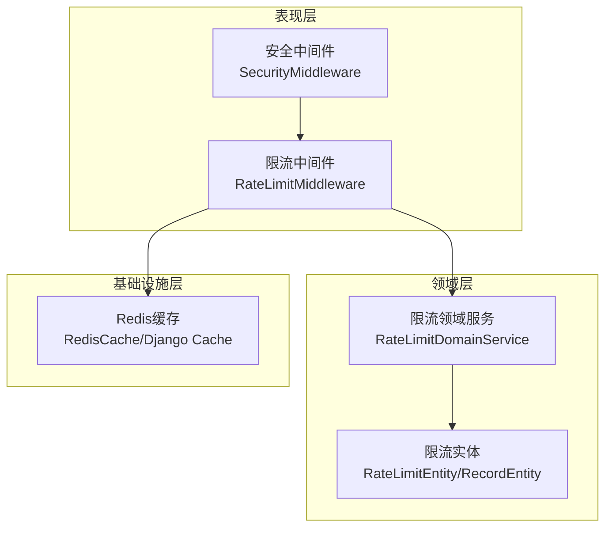
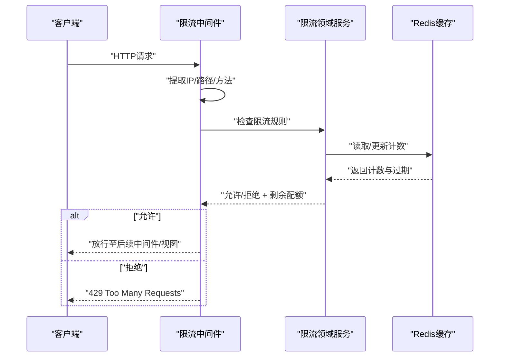
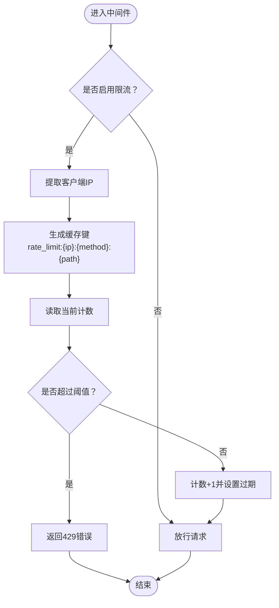
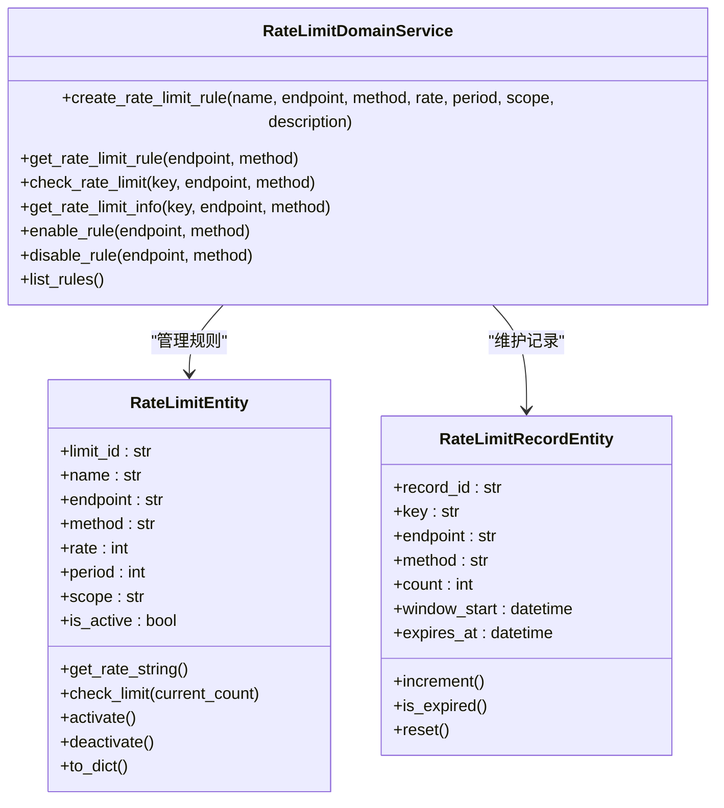
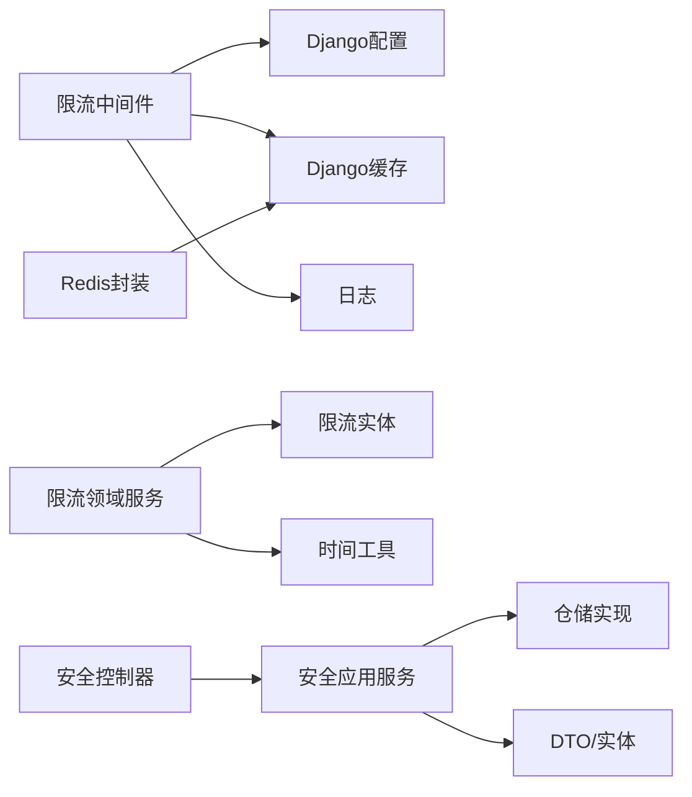

# 限流中间件

<cite>
**本文档引用的文件**
- [src/core/middlewares/rate_limit_middleware.py](file://src/core/middlewares/rate_limit_middleware.py)
- [src/core/exceptions/rate_limit_error.py](file://src/core/exceptions/rate_limit_error.py)
- [src/domain/security/services/rate_limit_service.py](file://src/domain/security/services/rate_limit_service.py)
- [src/application/dto/security/rate_limit_rule_dto.py](file://src/application/dto/security/rate_limit_rule_dto.py)
- [src/domain/security/entities/rate_limit_entity.py](file://src/domain/security/entities/rate_limit_entity.py)
- [src/infrastructure/cache/redis_cache.py](file://src/infrastructure/cache/redis_cache.py)
- [src/api/v1/controllers/security_controller.py](file://src/api/v1/controllers/security_controller.py)
- [src/application/services/security_service.py](file://src/application/services/security_service.py)
- [config/settings/base.py](file://config/settings/base.py)
- [src/core/middlewares/__init__.py](file://src/core/middlewares/__init__.py)
- [src/core/middlewares/security_middleware.py](file://src/core/middlewares/security_middleware.py)
- [src/core/exceptions/base.py](file://src/core/exceptions/base.py)
- [tests/test_middlewares/test_rate_limit_middleware.py](file://tests/test_middlewares/test_rate_limit_middleware.py)
</cite>

## 目录
1. [简介](#简介)
2. [项目结构](#项目结构)
3. [核心组件](#核心组件)
4. [架构总览](#架构总览)
5. [详细组件分析](#详细组件分析)
6. [依赖分析](#依赖分析)
7. [性能考虑](#性能考虑)
8. [故障排查指南](#故障排查指南)
9. [结论](#结论)
10. [附录](#附录)

## 简介
本文件面向“限流中间件”的技术文档，聚焦于基于IP的请求频率限制机制。内容涵盖中间件初始化与请求处理流程、限流算法实现、配置项说明、IP地址获取策略、缓存机制与Redis集成、错误处理与响应格式、与其他中间件的协作关系，以及扩展与自定义实现指导。读者无需深入的后端背景知识即可理解与使用。

## 项目结构
限流相关能力由三层协同实现：
- 表现层：Django中间件负责拦截请求、提取IP、执行限流判断并返回响应。
- 领域层：限流领域服务提供规则管理、窗口计数、剩余配额计算等核心业务逻辑。
- 基础设施层：Redis缓存提供高并发下的原子计数与过期控制；同时提供统一的缓存封装工具。

图表来源
- [src/core/middlewares/rate_limit_middleware.py:15-112](file://src/core/middlewares/rate_limit_middleware.py#L15-L112)
- [src/domain/security/services/rate_limit_service.py:11-126](file://src/domain/security/services/rate_limit_service.py#L11-L126)
- [src/domain/security/entities/rate_limit_entity.py:11-106](file://src/domain/security/entities/rate_limit_entity.py#L11-L106)
- [src/infrastructure/cache/redis_cache.py:15-169](file://src/infrastructure/cache/redis_cache.py#L15-L169)
- [src/core/middlewares/security_middleware.py:14-54](file://src/core/middlewares/security_middleware.py#L14-L54)

章节来源
- [src/core/middlewares/rate_limit_middleware.py:15-112](file://src/core/middlewares/rate_limit_middleware.py#L15-L112)
- [src/domain/security/services/rate_limit_service.py:11-126](file://src/domain/security/services/rate_limit_service.py#L11-L126)
- [src/domain/security/entities/rate_limit_entity.py:11-106](file://src/domain/security/entities/rate_limit_entity.py#L11-L106)
- [src/infrastructure/cache/redis_cache.py:15-169](file://src/infrastructure/cache/redis_cache.py#L15-L169)
- [src/core/middlewares/security_middleware.py:14-54](file://src/core/middlewares/security_middleware.py#L14-L54)

## 核心组件
- 限流中间件：在请求进入阶段进行IP识别与频率检查，超过阈值时返回429状态及统一错误格式。
- 限流领域服务：维护限流规则与计数窗口，支持按端点、方法、作用域（IP/用户/全局）进行精细化控制。
- 限流实体：定义规则与记录的数据结构，包含速率、周期、作用域、有效期等。
- Redis缓存：提供原子计数与过期控制，作为限流状态的持久化存储。
- 安全中间件：在生产环境添加安全响应头，与限流中间件共同构建安全边界。
- 异常体系：统一的限流异常基类与具体异常类型，便于上层捕获与处理。

章节来源
- [src/core/middlewares/rate_limit_middleware.py:15-112](file://src/core/middlewares/rate_limit_middleware.py#L15-L112)
- [src/domain/security/services/rate_limit_service.py:11-126](file://src/domain/security/services/rate_limit_service.py#L11-L126)
- [src/domain/security/entities/rate_limit_entity.py:11-106](file://src/domain/security/entities/rate_limit_entity.py#L11-L106)
- [src/infrastructure/cache/redis_cache.py:15-169](file://src/infrastructure/cache/redis_cache.py#L15-L169)
- [src/core/middlewares/security_middleware.py:14-54](file://src/core/middlewares/security_middleware.py#L14-L54)
- [src/core/exceptions/rate_limit_error.py:9-26](file://src/core/exceptions/rate_limit_error.py#L9-L26)
- [src/core/exceptions/base.py:7-40](file://src/core/exceptions/base.py#L7-L40)

## 架构总览
限流中间件在Django中间件链中的位置与职责如下：
- 位置：位于会话与CSRF之后、认证之前，确保对所有受管请求生效。
- 职责：基于IP识别请求来源，查询/更新限流计数，必要时拒绝请求并返回统一错误格式。
- 协作：与安全中间件共同提供安全响应头；与限流领域服务配合实现更复杂的规则与窗口管理。

图表来源
- [src/core/middlewares/rate_limit_middleware.py:41-112](file://src/core/middlewares/rate_limit_middleware.py#L41-L112)
- [src/domain/security/services/rate_limit_service.py:50-82](file://src/domain/security/services/rate_limit_service.py#L50-L82)
- [src/infrastructure/cache/redis_cache.py:28-65](file://src/infrastructure/cache/redis_cache.py#L28-L65)

章节来源
- [src/core/middlewares/rate_limit_middleware.py:41-112](file://src/core/middlewares/rate_limit_middleware.py#L41-L112)
- [src/domain/security/services/rate_limit_service.py:50-82](file://src/domain/security/services/rate_limit_service.py#L50-L82)
- [src/infrastructure/cache/redis_cache.py:28-65](file://src/infrastructure/cache/redis_cache.py#L28-L65)

## 详细组件分析

### 限流中间件（表现层）
- 初始化：读取配置开关与默认限流参数，决定是否启用限流与默认阈值。
- 请求处理：提取客户端IP（优先X-Forwarded-For，回退REMOTE_ADDR），生成键并查询缓存计数，超过阈值返回429。
- IP获取：支持代理链场景，取第一个IP作为真实客户端IP；若无X-Forwarded-For，则使用REMOTE_ADDR。
- 缓存使用：键名包含IP、方法与路径；计数+1并设置60秒过期。
- 错误响应：统一返回JSON格式的错误对象，包含错误码与提示信息。

图表来源
- [src/core/middlewares/rate_limit_middleware.py:41-112](file://src/core/middlewares/rate_limit_middleware.py#L41-L112)

章节来源
- [src/core/middlewares/rate_limit_middleware.py:15-112](file://src/core/middlewares/rate_limit_middleware.py#L15-L112)

### 限流领域服务（领域层）
- 规则管理：创建、启用/禁用、查询与列举限流规则；规则包含端点、方法、速率、周期、作用域等。
- 计数窗口：基于记录实体维护每个键的计数与窗口起始时间，支持过期重置与剩余配额计算。
- 查询接口：提供限流信息查询，返回是否启用、限制值、剩余次数与重置时间。

图表来源
- [src/domain/security/services/rate_limit_service.py:11-126](file://src/domain/security/services/rate_limit_service.py#L11-L126)
- [src/domain/security/entities/rate_limit_entity.py:11-106](file://src/domain/security/entities/rate_limit_entity.py#L11-L106)

章节来源
- [src/domain/security/services/rate_limit_service.py:11-126](file://src/domain/security/services/rate_limit_service.py#L11-L126)
- [src/domain/security/entities/rate_limit_entity.py:11-106](file://src/domain/security/entities/rate_limit_entity.py#L11-L106)

### 限流规则DTO与实体
- DTO：定义规则的输入结构，包含端点、方法、速率、周期、作用域与描述，并提供示例。
- 实体：定义规则与记录的持久化结构，包含校验逻辑、速率字符串格式化、激活/停用与序列化。

章节来源
- [src/application/dto/security/rate_limit_rule_dto.py:9-36](file://src/application/dto/security/rate_limit_rule_dto.py#L9-L36)
- [src/domain/security/entities/rate_limit_entity.py:11-106](file://src/domain/security/entities/rate_limit_entity.py#L11-L106)

### 缓存机制与Redis集成
- Django Cache后端：通过Redis作为默认缓存后端，键空间隔离与过期策略由后端统一管理。
- Redis封装：提供统一的get/set/delete/get_many/set_many/increment等便捷方法，支持自动JSON序列化与前缀隔离。
- 限流键设计：中间件使用“rate_limit:{ip}:{method}:{path}”作为键，计数+1并设置60秒过期。

章节来源
- [config/settings/base.py:153-163](file://config/settings/base.py#L153-L163)
- [src/infrastructure/cache/redis_cache.py:15-169](file://src/infrastructure/cache/redis_cache.py#L15-L169)
- [src/core/middlewares/rate_limit_middleware.py:100-111](file://src/core/middlewares/rate_limit_middleware.py#L100-L111)

### 错误处理与响应格式
- 中间件错误：当请求超过阈值时返回429状态与统一错误对象（包含错误码与消息）。
- 异常体系：限流异常继承自基础API异常，具备统一的错误码与消息格式，便于上层捕获与处理。
- 测试验证：单元测试覆盖请求在限值内、超过限值、白名单场景的行为。

章节来源
- [src/core/middlewares/rate_limit_middleware.py:58-68](file://src/core/middlewares/rate_limit_middleware.py#L58-L68)
- [src/core/exceptions/rate_limit_error.py:9-26](file://src/core/exceptions/rate_limit_error.py#L9-L26)
- [src/core/exceptions/base.py:7-40](file://src/core/exceptions/base.py#L7-L40)
- [tests/test_middlewares/test_rate_limit_middleware.py:33-75](file://tests/test_middlewares/test_rate_limit_middleware.py#L33-L75)

### 与其他中间件的协作
- 中间件顺序：限流中间件位于会话与CSRF之后、认证之前，确保对所有受管请求生效。
- 安全中间件：在生产环境添加安全响应头，与限流中间件共同构建安全边界。
- 导出与注册：中间件统一导出并在配置中注册，保证生命周期一致。

章节来源
- [src/core/middlewares/__init__.py:11-16](file://src/core/middlewares/__init__.py#L11-L16)
- [config/settings/base.py:39-52](file://config/settings/base.py#L39-L52)
- [src/core/middlewares/security_middleware.py:14-54](file://src/core/middlewares/security_middleware.py#L14-L54)

### 配置选项与默认行为
- 开关与默认限流：通过环境变量控制是否启用限流与默认限流规则字符串。
- 缓存后端：默认使用Redis作为缓存后端，键空间与过期策略由后端统一管理。
- 中间件开关：可在配置中关闭限流中间件，便于调试或特殊场景。

章节来源
- [config/settings/base.py:228-231](file://config/settings/base.py#L228-L231)
- [config/settings/base.py:153-163](file://config/settings/base.py#L153-L163)
- [src/core/middlewares/rate_limit_middleware.py:38-39](file://src/core/middlewares/rate_limit_middleware.py#L38-L39)

### API与管理界面
- 控制器：提供限流规则的创建、启用/禁用、删除与列表查询等API。
- 应用服务：封装业务逻辑，与仓储层交互完成规则的持久化与状态变更。
- DTO：定义规则的输入输出结构，支持示例展示与字段约束。

章节来源
- [src/api/v1/controllers/security_controller.py:189-282](file://src/api/v1/controllers/security_controller.py#L189-L282)
- [src/application/services/security_service.py:103-143](file://src/application/services/security_service.py#L103-L143)
- [src/application/dto/security/rate_limit_rule_dto.py:9-36](file://src/application/dto/security/rate_limit_rule_dto.py#L9-L36)

## 依赖分析
- 中间件依赖：限流中间件依赖Django配置、缓存系统与日志系统；对外不直接依赖领域服务。
- 领域服务依赖：限流领域服务依赖实体与时间工具，不直接依赖框架层。
- 缓存依赖：Redis封装依赖Django缓存抽象，屏蔽具体后端差异。
- 控制器与服务：控制器依赖应用服务，应用服务依赖仓储与DTO/实体。

图表来源
- [src/core/middlewares/rate_limit_middleware.py:8-12](file://src/core/middlewares/rate_limit_middleware.py#L8-L12)
- [src/domain/security/services/rate_limit_service.py:6-8](file://src/domain/security/services/rate_limit_service.py#L6-L8)
- [src/infrastructure/cache/redis_cache.py:10-12](file://src/infrastructure/cache/redis_cache.py#L10-L12)
- [src/api/v1/controllers/security_controller.py:18-19](file://src/api/v1/controllers/security_controller.py#L18-L19)
- [src/application/services/security_service.py:16-22](file://src/application/services/security_service.py#L16-L22)

章节来源
- [src/core/middlewares/rate_limit_middleware.py:8-12](file://src/core/middlewares/rate_limit_middleware.py#L8-L12)
- [src/domain/security/services/rate_limit_service.py:6-8](file://src/domain/security/services/rate_limit_service.py#L6-L8)
- [src/infrastructure/cache/redis_cache.py:10-12](file://src/infrastructure/cache/redis_cache.py#L10-L12)
- [src/api/v1/controllers/security_controller.py:18-19](file://src/api/v1/controllers/security_controller.py#L18-L19)
- [src/application/services/security_service.py:16-22](file://src/application/services/security_service.py#L16-L22)

## 性能考虑
- 缓存命中率：合理设置过期时间与键粒度，避免热点键竞争；在高并发场景下建议使用分布式锁或原子递增。
- 键设计：键包含IP、方法与路径，粒度适中；若需更细粒度（如按用户），可扩展作用域。
- 过期策略：中间件采用固定60秒过期；领域服务的记录窗口可按规则周期动态调整。
- 并发一致性：Redis原子操作可保证计数准确性；若需跨节点一致性，建议引入Redis Lua脚本或Redlock。
- 监控与告警：结合日志与指标监控限流触发频率，及时调整阈值与周期。

## 故障排查指南
- 429错误频繁：检查限流规则是否过严、是否误判IP、缓存是否异常；可通过API查询限流状态辅助定位。
- IP识别异常：确认代理链配置与X-Forwarded-For头是否正确传递；必要时在网关或反向代理处统一处理。
- 缓存不可用：检查Redis连接配置与网络连通性；确认Django缓存后端配置正确。
- 中间件未生效：确认中间件已在配置中注册且顺序正确；检查开关与默认限流参数。

章节来源
- [src/core/middlewares/rate_limit_middleware.py:58-68](file://src/core/middlewares/rate_limit_middleware.py#L58-L68)
- [config/settings/base.py:153-163](file://config/settings/base.py#L153-L163)
- [src/api/v1/controllers/security_controller.py:286-301](file://src/api/v1/controllers/security_controller.py#L286-L301)

## 结论
本限流方案通过“表现层中间件 + 领域服务 + Redis缓存”的分层设计，在保证易用性的同时提供了可扩展的规则管理与精细的计数控制。默认实现满足大多数场景需求，同时通过配置与API支持进一步定制与运维。

## 附录

### 配置项速查
- 开关与默认限流：通过环境变量控制是否启用限流与默认限流规则字符串。
- 缓存后端：默认使用Redis作为缓存后端，键空间与过期策略由后端统一管理。
- 中间件注册：在配置中注册限流中间件，确保其在认证之前生效。

章节来源
- [config/settings/base.py:228-231](file://config/settings/base.py#L228-L231)
- [config/settings/base.py:153-163](file://config/settings/base.py#L153-L163)
- [config/settings/base.py:39-52](file://config/settings/base.py#L39-L52)

### IP地址获取策略
- 优先级：若存在X-Forwarded-For头，取第一个IP作为客户端IP；否则使用REMOTE_ADDR。
- 适用场景：适用于反向代理、负载均衡器等部署架构。

章节来源
- [src/core/middlewares/rate_limit_middleware.py:70-85](file://src/core/middlewares/rate_limit_middleware.py#L70-L85)

### 错误响应格式
- 状态码：429 Too Many Requests
- 响应体：包含错误码与消息的JSON对象，便于前端统一处理。

章节来源
- [src/core/middlewares/rate_limit_middleware.py:60-66](file://src/core/middlewares/rate_limit_middleware.py#L60-L66)

### 限流规则管理API
- 创建规则：POST /api/v1/security/rate-limit
- 切换状态：PUT /api/v1/security/rate-limit/{rule_id}/toggle
- 删除规则：DELETE /api/v1/security/rate-limit/{rule_id}
- 列表查询：GET /api/v1/security/rate-limit

章节来源
- [src/api/v1/controllers/security_controller.py:189-282](file://src/api/v1/controllers/security_controller.py#L189-L282)