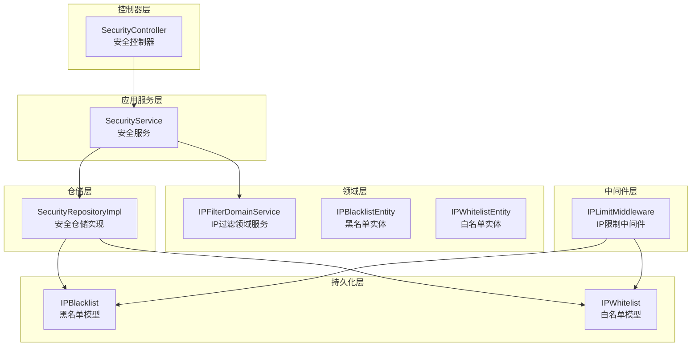
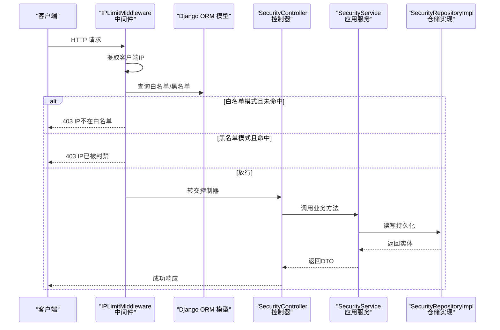
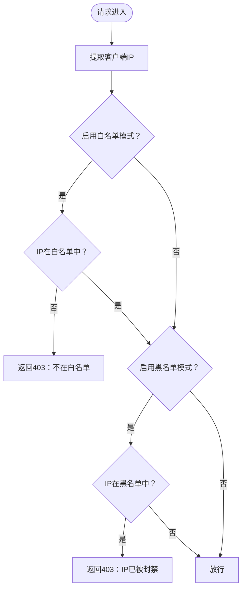
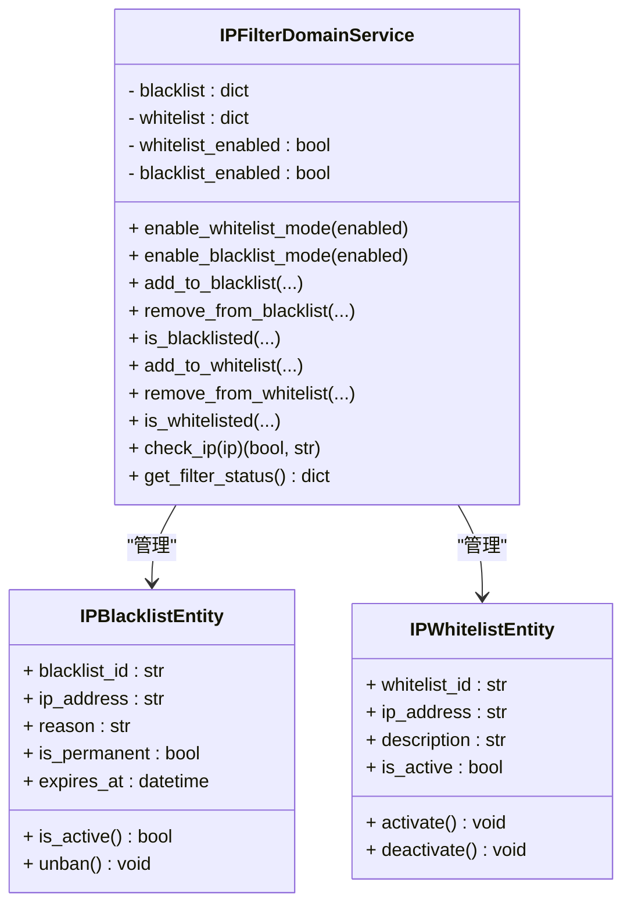
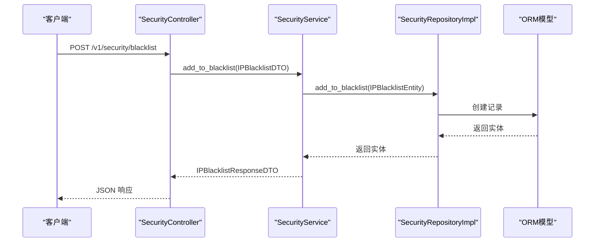
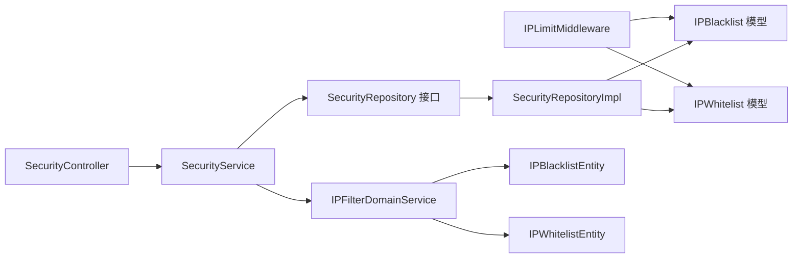

# IP 限制中间件

<cite>
**本文档引用的文件**
- [src/core/middlewares/ip_limit_middleware.py](file://src/core/middlewares/ip_limit_middleware.py)
- [src/domain/security/services/ip_filter_service.py](file://src/domain/security/services/ip_filter_service.py)
- [src/infrastructure/persistence/models/security_models.py](file://src/infrastructure/persistence/models/security_models.py)
- [config/settings/base.py](file://config/settings/base.py)
- [src/api/v1/controllers/security_controller.py](file://src/api/v1/controllers/security_controller.py)
- [src/application/services/security_service.py](file://src/application/services/security_service.py)
- [src/infrastructure/repositories/security_repo_impl.py](file://src/infrastructure/repositories/security_repo_impl.py)
- [src/domain/security/entities/ip_blacklist_entity.py](file://src/domain/security/entities/ip_blacklist_entity.py)
- [src/domain/security/entities/ip_whitelist_entity.py](file://src/domain/security/entities/ip_whitelist_entity.py)
- [src/application/dto/security/ip_blacklist_dto.py](file://src/application/dto/security/ip_blacklist_dto.py)
- [src/application/dto/security/ip_whitelist_dto.py](file://src/application/dto/security/ip_whitelist_dto.py)
- [src/application/dto/security/ip_blacklist_response_dto.py](file://src/application/dto/security/ip_blacklist_response_dto.py)
- [src/application/dto/security/ip_whitelist_response_dto.py](file://src/application/dto/security/ip_whitelist_response_dto.py)
- [src/core/exceptions/ip_blocked_error.py](file://src/core/exceptions/ip_blocked_error.py)
</cite>

## 目录
1. [简介](#简介)
2. [项目结构](#项目结构)
3. [核心组件](#核心组件)
4. [架构总览](#架构总览)
5. [详细组件分析](#详细组件分析)
6. [依赖关系分析](#依赖关系分析)
7. [性能考虑](#性能考虑)
8. [故障排查指南](#故障排查指南)
9. [结论](#结论)
10. [附录](#附录)

## 简介
本文件面向“IP 限制中间件”的技术文档，系统性阐述其设计原理、工作机制与运行流程。内容涵盖：
- IP 黑名单与白名单的配置方法与优先级规则
- IP 地址匹配与 CIDR 表示法支持现状
- IP 限制策略配置示例与典型应用场景
- 动态 IP 管理与实时更新机制
- 监控与统计能力
- 性能影响分析与优化建议
- 与限流、认证等其他安全组件的协同工作方式

## 项目结构
该系统采用分层架构：控制器层负责对外暴露 API；应用服务层编排业务；领域服务与实体封装核心业务规则；仓储层对接持久化；中间件层在请求链路中执行 IP 限制校验。

图表来源
- [src/api/v1/controllers/security_controller.py:21-302](file://src/api/v1/controllers/security_controller.py#L21-L302)
- [src/application/services/security_service.py:24-225](file://src/application/services/security_service.py#L24-L225)
- [src/domain/security/services/ip_filter_service.py:12-149](file://src/domain/security/services/ip_filter_service.py#L12-L149)
- [src/infrastructure/repositories/security_repo_impl.py:21-260](file://src/infrastructure/repositories/security_repo_impl.py#L21-L260)
- [src/infrastructure/persistence/models/security_models.py:13-80](file://src/infrastructure/persistence/models/security_models.py#L13-L80)
- [src/core/middlewares/ip_limit_middleware.py:15-130](file://src/core/middlewares/ip_limit_middleware.py#L15-L130)

章节来源
- [src/api/v1/controllers/security_controller.py:21-302](file://src/api/v1/controllers/security_controller.py#L21-L302)
- [src/application/services/security_service.py:24-225](file://src/application/services/security_service.py#L24-L225)
- [src/domain/security/services/ip_filter_service.py:12-149](file://src/domain/security/services/ip_filter_service.py#L12-L149)
- [src/infrastructure/repositories/security_repo_impl.py:21-260](file://src/infrastructure/repositories/security_repo_impl.py#L21-L260)
- [src/infrastructure/persistence/models/security_models.py:13-80](file://src/infrastructure/persistence/models/security_models.py#L13-L80)
- [src/core/middlewares/ip_limit_middleware.py:15-130](file://src/core/middlewares/ip_limit_middleware.py#L15-L130)

## 核心组件
- IP 限制中间件：在请求进入视图前进行 IP 白名单/黑名单校验，支持临时与永久封禁。
- IP 过滤领域服务：提供内存中的白名单/黑名单集合与检查逻辑，支持模式开关与状态查询。
- 安全控制器与服务：对外提供黑名单/白名单的增删改查与状态查询 API。
- 仓储实现：基于 Django ORM 的异步 CRUD，负责持久化与查询。
- 模型定义：Django ORM 模型，包含 IP 地址、封禁原因、是否永久、过期时间等字段。
- 异常定义：统一的 IP 被封禁异常类型，便于上层处理。

章节来源
- [src/core/middlewares/ip_limit_middleware.py:15-130](file://src/core/middlewares/ip_limit_middleware.py#L15-L130)
- [src/domain/security/services/ip_filter_service.py:12-149](file://src/domain/security/services/ip_filter_service.py#L12-L149)
- [src/api/v1/controllers/security_controller.py:21-302](file://src/api/v1/controllers/security_controller.py#L21-L302)
- [src/application/services/security_service.py:24-225](file://src/application/services/security_service.py#L24-L225)
- [src/infrastructure/repositories/security_repo_impl.py:21-260](file://src/infrastructure/repositories/security_repo_impl.py#L21-L260)
- [src/infrastructure/persistence/models/security_models.py:13-80](file://src/infrastructure/persistence/models/security_models.py#L13-L80)
- [src/core/exceptions/ip_blocked_error.py:9-26](file://src/core/exceptions/ip_blocked_error.py#L9-L26)

## 架构总览
IP 限制中间件与控制器/服务/仓储/模型之间的交互如下：

图表来源
- [src/core/middlewares/ip_limit_middleware.py:41-76](file://src/core/middlewares/ip_limit_middleware.py#L41-L76)
- [src/infrastructure/persistence/models/security_models.py:13-80](file://src/infrastructure/persistence/models/security_models.py#L13-L80)
- [src/api/v1/controllers/security_controller.py:43-185](file://src/api/v1/controllers/security_controller.py#L43-L185)
- [src/application/services/security_service.py:35-99](file://src/application/services/security_service.py#L35-L99)
- [src/infrastructure/repositories/security_repo_impl.py:29-108](file://src/infrastructure/repositories/security_repo_impl.py#L29-L108)

## 详细组件分析

### IP 限制中间件（IPLimitMiddleware）
- 职责：在请求到达视图前，根据配置的白名单/黑名单策略进行拦截或放行。
- IP 提取：优先使用代理头，回退到远端地址。
- 白名单优先：若启用白名单模式且 IP 不在白名单，则直接返回封禁响应。
- 黑名单次之：若启用黑名单模式且 IP 在黑名单中（含永久与未过期临时），则返回封禁响应。
- 放行条件：通过上述两条规则后，继续后续中间件与视图。

图表来源
- [src/core/middlewares/ip_limit_middleware.py:41-76](file://src/core/middlewares/ip_limit_middleware.py#L41-L76)

章节来源
- [src/core/middlewares/ip_limit_middleware.py:15-130](file://src/core/middlewares/ip_limit_middleware.py#L15-L130)

### IP 过滤领域服务（IPFilterDomainService）
- 内存集合：维护白名单/黑名单字典，支持动态增删与状态查询。
- 模式控制：独立于中间件的白名单/黑名单开关，便于在不同场景下灵活启用。
- 优先级规则：白名单优先，其次黑名单，最后默认允许。
- 状态查询：返回当前模式与条目数量等状态信息。

图表来源
- [src/domain/security/services/ip_filter_service.py:12-149](file://src/domain/security/services/ip_filter_service.py#L12-L149)
- [src/domain/security/entities/ip_blacklist_entity.py:11-53](file://src/domain/security/entities/ip_blacklist_entity.py#L11-L53)
- [src/domain/security/entities/ip_whitelist_entity.py:11-47](file://src/domain/security/entities/ip_whitelist_entity.py#L11-L47)

章节来源
- [src/domain/security/services/ip_filter_service.py:12-149](file://src/domain/security/services/ip_filter_service.py#L12-L149)
- [src/domain/security/entities/ip_blacklist_entity.py:11-53](file://src/domain/security/entities/ip_blacklist_entity.py#L11-L53)
- [src/domain/security/entities/ip_whitelist_entity.py:11-47](file://src/domain/security/entities/ip_whitelist_entity.py#L11-L47)

### 安全控制器与服务（SecurityController/SecurityService）
- 控制器：提供黑名单/白名单的新增、删除、查询与安全状态查询接口。
- 服务：编排业务逻辑，将 DTO 转换为领域实体，调用仓储进行持久化操作，并返回响应 DTO。

图表来源
- [src/api/v1/controllers/security_controller.py:43-112](file://src/api/v1/controllers/security_controller.py#L43-L112)
- [src/application/services/security_service.py:35-53](file://src/application/services/security_service.py#L35-L53)
- [src/infrastructure/repositories/security_repo_impl.py:29-39](file://src/infrastructure/repositories/security_repo_impl.py#L29-L39)
- [src/infrastructure/persistence/models/security_models.py:13-50](file://src/infrastructure/persistence/models/security_models.py#L13-L50)

章节来源
- [src/api/v1/controllers/security_controller.py:21-302](file://src/api/v1/controllers/security_controller.py#L21-L302)
- [src/application/services/security_service.py:24-225](file://src/application/services/security_service.py#L24-L225)
- [src/infrastructure/repositories/security_repo_impl.py:21-260](file://src/infrastructure/repositories/security_repo_impl.py#L21-L260)
- [src/infrastructure/persistence/models/security_models.py:13-80](file://src/infrastructure/persistence/models/security_models.py#L13-L80)

### 仓储实现（SecurityRepositoryImpl）
- 提供黑名单/白名单的增删查与列表查询，支持包含过期项的筛选。
- 将领域实体映射为 ORM 模型，完成持久化与查询。

章节来源
- [src/infrastructure/repositories/security_repo_impl.py:21-260](file://src/infrastructure/repositories/security_repo_impl.py#L21-L260)

### 模型定义（IPBlacklist/IPWhitelist）
- 字段覆盖：IP 地址、封禁原因、是否永久、过期时间、创建者、创建时间等。
- 索引与约束：IP 地址唯一且建立索引，便于快速查询。
- 激活判断：永久封禁或未过期临时封禁视为有效。

章节来源
- [src/infrastructure/persistence/models/security_models.py:13-80](file://src/infrastructure/persistence/models/security_models.py#L13-L80)

### DTO 与响应类
- 输入 DTO：IPBlacklistDTO、IPWhitelistDTO，定义字段与示例。
- 输出 DTO：IPBlacklistResponseDTO、IPWhitelistResponseDTO，用于 API 响应。

章节来源
- [src/application/dto/security/ip_blacklist_dto.py:11-27](file://src/application/dto/security/ip_blacklist_dto.py#L11-L27)
- [src/application/dto/security/ip_whitelist_dto.py:9-21](file://src/application/dto/security/ip_whitelist_dto.py#L9-L21)
- [src/application/dto/security/ip_blacklist_response_dto.py:11-23](file://src/application/dto/security/ip_blacklist_response_dto.py#L11-L23)
- [src/application/dto/security/ip_whitelist_response_dto.py:11-22](file://src/application/dto/security/ip_whitelist_response_dto.py#L11-L22)

### 异常定义（IPBlockedError）
- 统一的 IP 被封禁异常类型，便于上层捕获与处理。

章节来源
- [src/core/exceptions/ip_blocked_error.py:9-26](file://src/core/exceptions/ip_blocked_error.py#L9-L26)

## 依赖关系分析
- 中间件依赖 ORM 模型进行白名单/黑名单查询。
- 控制器依赖应用服务；应用服务依赖仓储接口与实体；仓储实现依赖 ORM 模型。
- 领域服务与实体相互协作，提供纯内存的过滤能力，便于单元测试与快速决策。

图表来源
- [src/core/middlewares/ip_limit_middleware.py:105-122](file://src/core/middlewares/ip_limit_middleware.py#L105-L122)
- [src/api/v1/controllers/security_controller.py:32-39](file://src/api/v1/controllers/security_controller.py#L32-L39)
- [src/application/services/security_service.py:30-32](file://src/application/services/security_service.py#L30-L32)
- [src/infrastructure/repositories/security_repo_impl.py:13-18](file://src/infrastructure/repositories/security_repo_impl.py#L13-L18)
- [src/domain/security/services/ip_filter_service.py:18-22](file://src/domain/security/services/ip_filter_service.py#L18-L22)

章节来源
- [src/core/middlewares/ip_limit_middleware.py:15-130](file://src/core/middlewares/ip_limit_middleware.py#L15-L130)
- [src/api/v1/controllers/security_controller.py:21-302](file://src/api/v1/controllers/security_controller.py#L21-L302)
- [src/application/services/security_service.py:24-225](file://src/application/services/security_service.py#L24-L225)
- [src/infrastructure/repositories/security_repo_impl.py:21-260](file://src/infrastructure/repositories/security_repo_impl.py#L21-L260)
- [src/domain/security/services/ip_filter_service.py:12-149](file://src/domain/security/services/ip_filter_service.py#L12-L149)

## 性能考虑
- 查询路径
  - 中间件：每次请求均需查询白名单/黑名单，建议确保 IP 字段建立索引（模型已建立索引）。
  - 控制器/服务：批量查询与列表展示时注意分页与筛选条件。
- 缓存建议
  - 对热点 IP 的封禁状态可引入缓存层（如 Redis）以降低数据库压力。
  - 结合异步 ORM 使用，避免阻塞事件循环。
- 并发与一致性
  - 黑名单/白名单的并发更新需保证幂等与原子性，仓储层已提供单条记录的增删查。
- 日志与可观测性
  - 中间件对拦截行为有日志输出，建议结合日志聚合与告警策略。
- 优化建议
  - 将频繁访问的白名单/黑名单加载至内存，结合定时刷新或事件驱动更新。
  - 对临时封禁条目定期清理，减少无效扫描。

[本节为通用性能指导，不直接分析具体文件]

## 故障排查指南
- 常见问题
  - IP 未生效：确认配置项是否启用白名单/黑名单模式。
  - 代理环境：确保正确传递代理头，避免获取到代理地址而非真实客户端 IP。
  - 临时封禁未过期：检查过期时间字段是否正确设置。
- 定位步骤
  - 查看中间件日志与返回状态码。
  - 通过控制器接口查询当前白名单/黑名单状态与条目。
  - 核对模型中的封禁状态与过期时间。
- 相关文件
  - 中间件日志与返回：[src/core/middlewares/ip_limit_middleware.py:56-74](file://src/core/middlewares/ip_limit_middleware.py#L56-L74)
  - 安全状态查询：[src/api/v1/controllers/security_controller.py:286-302](file://src/api/v1/controllers/security_controller.py#L286-L302)
  - 模型激活判断：[src/infrastructure/persistence/models/security_models.py:43-49](file://src/infrastructure/persistence/models/security_models.py#L43-L49)

章节来源
- [src/core/middlewares/ip_limit_middleware.py:56-74](file://src/core/middlewares/ip_limit_middleware.py#L56-L74)
- [src/api/v1/controllers/security_controller.py:286-302](file://src/api/v1/controllers/security_controller.py#L286-L302)
- [src/infrastructure/persistence/models/security_models.py:43-49](file://src/infrastructure/persistence/models/security_models.py#L43-L49)

## 结论
本 IP 限制中间件通过简洁的白名单优先、黑名单次之的策略，在请求早期即完成访问控制，具备良好的可配置性与可扩展性。结合控制器/服务/仓储/模型的清晰分层，能够满足日常的安全访问控制需求。建议在生产环境中配合缓存、日志与监控体系，持续优化性能与可观测性。

[本节为总结性内容，不直接分析具体文件]

## 附录

### 配置方法与优先级规则
- 配置项
  - 白名单开关：IP_WHITELIST_ENABLED
  - 黑名单开关：IP_BLACKLIST_ENABLED
- 优先级规则
  - 白名单优先：启用白名单模式时，仅允许白名单内的 IP。
  - 黑名单次之：在白名单模式未放行的前提下，再检查黑名单。
  - 默认允许：若未启用任何模式，默认允许所有请求。
- 配置位置
  - 基础配置文件中定义了开关项与默认值。

章节来源
- [config/settings/base.py:232-235](file://config/settings/base.py#L232-L235)
- [src/domain/security/services/ip_filter_service.py:120-139](file://src/domain/security/services/ip_filter_service.py#L120-L139)
- [src/core/middlewares/ip_limit_middleware.py:54-74](file://src/core/middlewares/ip_limit_middleware.py#L54-L74)

### IP 地址匹配与 CIDR 支持
- 当前实现
  - 中间件与仓储均按精确 IP 匹配进行查询。
  - 模型字段为通用 IP 地址类型，未显式支持 CIDR 表达式。
- 扩展建议
  - 若需支持 CIDR，可在仓储层增加范围查询或在中间件侧进行 CIDR 判断。
  - 对于大规模网段，建议引入专用库与索引策略。

章节来源
- [src/core/middlewares/ip_limit_middleware.py:105-122](file://src/core/middlewares/ip_limit_middleware.py#L105-L122)
- [src/infrastructure/repositories/security_repo_impl.py:46-108](file://src/infrastructure/repositories/security_repo_impl.py#L46-L108)
- [src/infrastructure/persistence/models/security_models.py:20](file://src/infrastructure/persistence/models/security_models.py#L20)

### 动态 IP 管理与实时更新
- 实时更新
  - 通过控制器接口进行黑名单/白名单的增删改查，变更即时生效。
- 状态查询
  - 提供安全状态接口，返回当前模式与条目数量等信息。
- 建议
  - 对高频更新场景，建议引入缓存与批量刷新策略，减少数据库压力。

章节来源
- [src/api/v1/controllers/security_controller.py:43-185](file://src/api/v1/controllers/security_controller.py#L43-L185)
- [src/application/services/security_service.py:169-182](file://src/application/services/security_service.py#L169-L182)
- [src/infrastructure/repositories/security_repo_impl.py:29-108](file://src/infrastructure/repositories/security_repo_impl.py#L29-L108)

### 监控与统计
- 日志输出：中间件对拦截行为进行警告日志记录。
- 状态接口：控制器提供安全状态查询，便于集成监控系统。
- 建议
  - 结合日志聚合与指标采集，建立告警与可视化面板。

章节来源
- [src/core/middlewares/ip_limit_middleware.py:56-57](file://src/core/middlewares/ip_limit_middleware.py#L56-L57)
- [src/api/v1/controllers/security_controller.py:286-302](file://src/api/v1/controllers/security_controller.py#L286-L302)

### 与其他安全组件的协同
- 限流中间件：与 IP 限制中间件同属安全层，可并行工作；建议在 IP 拦截后再进行限流判定。
- 认证与授权：IP 限制通常在认证之前执行，以尽早拒绝不受信任来源的请求。
- 建议
  - 明确中间件顺序，确保 IP 限制在认证与业务逻辑之前生效。

章节来源
- [config/settings/base.py:39-52](file://config/settings/base.py#L39-L52)
- [src/core/middlewares/ip_limit_middleware.py:41-76](file://src/core/middlewares/ip_limit_middleware.py#L41-L76)