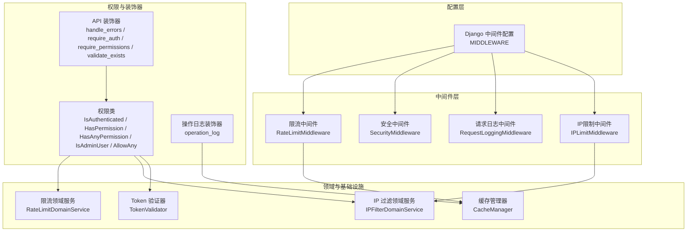
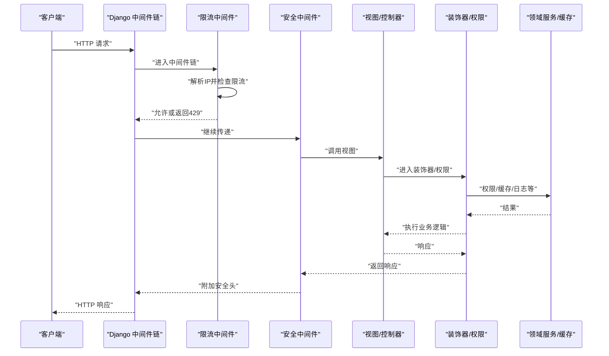
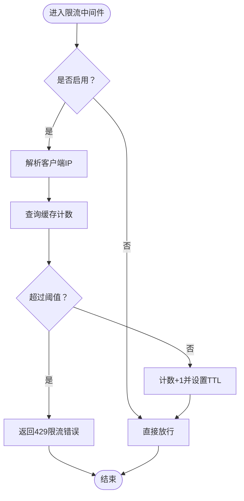
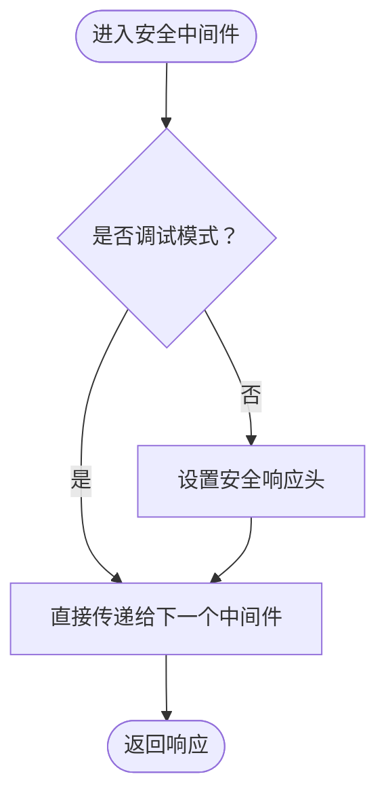
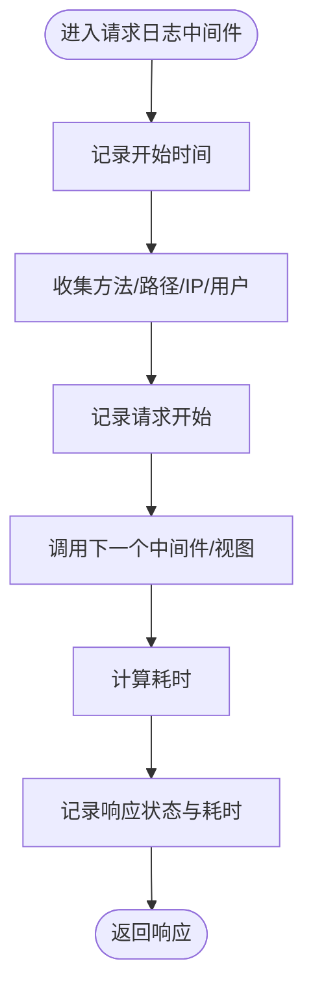
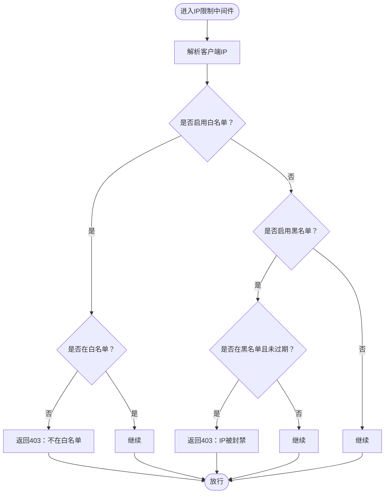
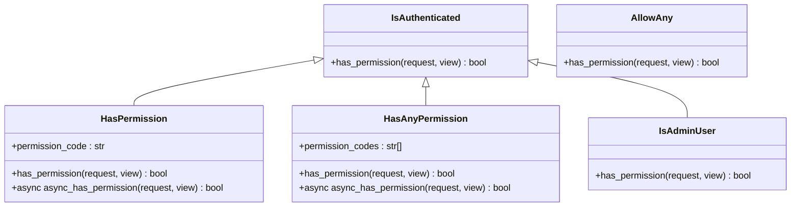
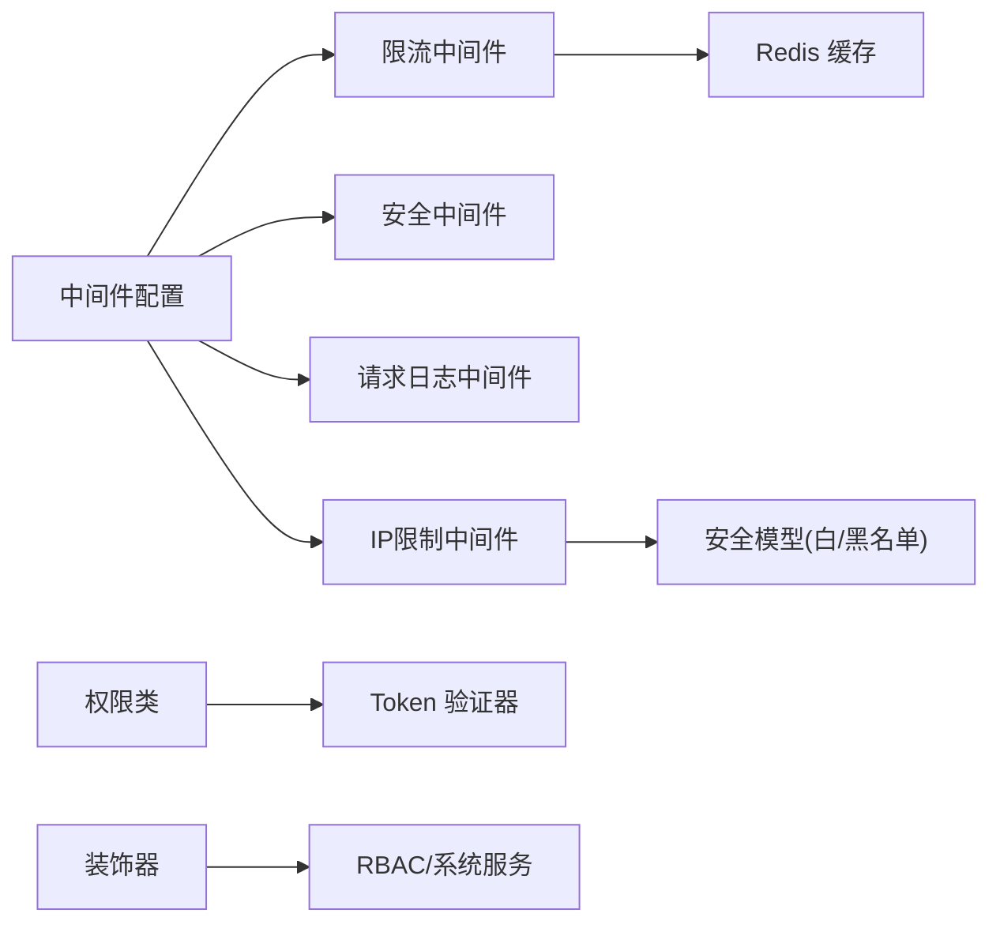

# 中间件和拦截器

<cite>
**本文引用的文件**
- [src/core/middlewares/__init__.py](file://src/core/middlewares/__init__.py)
- [src/core/middlewares/rate_limit_middleware.py](file://src/core/middlewares/rate_limit_middleware.py)
- [src/core/middlewares/security_middleware.py](file://src/core/middlewares/security_middleware.py)
- [src/core/middlewares/request_logging_middleware.py](file://src/core/middlewares/request_logging_middleware.py)
- [src/core/middlewares/ip_limit_middleware.py](file://src/core/middlewares/ip_limit_middleware.py)
- [config/settings/base.py](file://config/settings/base.py)
- [src/api/common/decorators.py](file://src/api/common/decorators.py)
- [src/api/common/permissions.py](file://src/api/common/permissions.py)
- [src/core/decorators/operation_log.py](file://src/core/decorators/operation_log.py)
- [src/domain/security/services/rate_limit_service.py](file://src/domain/security/services/rate_limit_service.py)
- [src/domain/security/services/ip_filter_service.py](file://src/domain/security/services/ip_filter_service.py)
- [src/infrastructure/cache/cache_manager.py](file://src/infrastructure/cache/cache_manager.py)
- [src/infrastructure/auth_jwt/token_validator.py](file://src/infrastructure/auth_jwt/token_validator.py)
- [tests/test_middlewares/test_rate_limit_middleware.py](file://tests/test_middlewares/test_rate_limit_middleware.py)
</cite>

## 目录
1. [简介](#简介)
2. [项目结构](#项目结构)
3. [核心组件](#核心组件)
4. [架构总览](#架构总览)
5. [详细组件分析](#详细组件分析)
6. [依赖分析](#依赖分析)
7. [性能考虑](#性能考虑)
8. [故障排除指南](#故障排除指南)
9. [结论](#结论)
10. [附录](#附录)

## 简介
本文件面向 Hello-Django-Ninja-Api 项目的中间件与拦截器体系，系统化梳理内置中间件的功能、配置项、执行顺序与优先级，并提供自定义中间件的开发指南与最佳实践。同时，结合装饰器与权限系统，解释其在请求生命周期中的作用机制，给出性能影响分析、优化建议以及故障排除与调试技巧，帮助开发者高效扩展与定制中间件。

## 项目结构
中间件与拦截器相关的核心位置如下：
- 中间件统一导出与注册：位于中间件模块导出文件与 Django 配置文件中
- 内置中间件：限流、安全、请求日志、IP 限制
- 权限与装饰器：统一错误处理、认证、权限校验、操作日志装饰器
- 领域服务与缓存：限流与 IP 过滤的领域逻辑，以及缓存管理器
- 测试：对限流中间件的行为进行单元测试

图表来源
- [config/settings/base.py:39-52](file://config/settings/base.py#L39-L52)
- [src/core/middlewares/__init__.py:6-16](file://src/core/middlewares/__init__.py#L6-L16)
- [src/api/common/decorators.py:13-191](file://src/api/common/decorators.py#L13-L191)
- [src/api/common/permissions.py:14-245](file://src/api/common/permissions.py#L14-L245)
- [src/core/decorators/operation_log.py:15-175](file://src/core/decorators/operation_log.py#L15-L175)
- [src/domain/security/services/rate_limit_service.py:11-126](file://src/domain/security/services/rate_limit_service.py#L11-L126)
- [src/domain/security/services/ip_filter_service.py:12-149](file://src/domain/security/services/ip_filter_service.py#L12-L149)
- [src/infrastructure/cache/cache_manager.py:16-149](file://src/infrastructure/cache/cache_manager.py#L16-L149)
- [src/infrastructure/auth_jwt/token_validator.py:11-108](file://src/infrastructure/auth_jwt/token_validator.py#L11-L108)

章节来源
- [config/settings/base.py:39-52](file://config/settings/base.py#L39-L52)
- [src/core/middlewares/__init__.py:6-16](file://src/core/middlewares/__init__.py#L6-L16)

## 核心组件
- 限流中间件：基于 IP 的请求频率限制，默认使用 Redis 缓存计数，支持开关与默认规则配置
- 安全中间件：在非调试环境下为响应添加安全头，增强 XSS、点击劫持等防护
- 请求日志中间件：记录请求开始/完成、耗时、用户与来源 IP 等信息
- IP 限制中间件：支持白名单/黑名单模式，结合持久化模型判断封禁状态（永久/临时）
- 权限与装饰器：统一错误处理、认证注入、权限校验、实体存在性校验；配合 Ninja Extra 权限类实现细粒度控制
- 操作日志装饰器：自动采集请求上下文并异步写入系统日志
- 领域服务与缓存：提供更完善的限流与 IP 过滤业务能力，以及统一缓存管理
- Token 验证器：JWT 校验、类型检查、黑名单与撤销

章节来源
- [src/core/middlewares/rate_limit_middleware.py:15-112](file://src/core/middlewares/rate_limit_middleware.py#L15-L112)
- [src/core/middlewares/security_middleware.py:14-54](file://src/core/middlewares/security_middleware.py#L14-L54)
- [src/core/middlewares/request_logging_middleware.py:14-86](file://src/core/middlewares/request_logging_middleware.py#L14-L86)
- [src/core/middlewares/ip_limit_middleware.py:15-130](file://src/core/middlewares/ip_limit_middleware.py#L15-L130)
- [src/api/common/decorators.py:13-191](file://src/api/common/decorators.py#L13-L191)
- [src/api/common/permissions.py:14-245](file://src/api/common/permissions.py#L14-L245)
- [src/core/decorators/operation_log.py:15-175](file://src/core/decorators/operation_log.py#L15-L175)
- [src/domain/security/services/rate_limit_service.py:11-126](file://src/domain/security/services/rate_limit_service.py#L11-L126)
- [src/domain/security/services/ip_filter_service.py:12-149](file://src/domain/security/services/ip_filter_service.py#L12-L149)
- [src/infrastructure/cache/cache_manager.py:16-149](file://src/infrastructure/cache/cache_manager.py#L16-L149)
- [src/infrastructure/auth_jwt/token_validator.py:11-108](file://src/infrastructure/auth_jwt/token_validator.py#L11-L108)

## 架构总览
中间件在 Django 请求生命周期中按 MIDDLEWARE 列表顺序执行，贯穿请求进入与响应返回阶段。权限与装饰器在 API 控制器与视图层进一步细化控制点，形成“中间件层 + 装饰器/权限层”的双重拦截体系。

图表来源
- [config/settings/base.py:39-52](file://config/settings/base.py#L39-L52)
- [src/core/middlewares/rate_limit_middleware.py:41-68](file://src/core/middlewares/rate_limit_middleware.py#L41-L68)
- [src/core/middlewares/security_middleware.py:33-53](file://src/core/middlewares/security_middleware.py#L33-L53)
- [src/api/common/decorators.py:13-191](file://src/api/common/decorators.py#L13-L191)
- [src/api/common/permissions.py:14-245](file://src/api/common/permissions.py#L14-L245)
- [src/domain/security/services/rate_limit_service.py:50-82](file://src/domain/security/services/rate_limit_service.py#L50-L82)
- [src/infrastructure/cache/cache_manager.py:42-71](file://src/infrastructure/cache/cache_manager.py#L42-L71)

## 详细组件分析

### 限流中间件（RateLimitMiddleware）
- 功能要点
  - 基于客户端 IP 与请求路径/方法组合的计数器
  - 使用 Redis 缓存存储计数与过期时间
  - 支持全局开关与默认规则配置项
- 关键行为
  - 若未启用则直接放行
  - 从请求头或远端地址解析真实 IP
  - 当超过阈值时返回限流错误与 429 状态码
- 配置项
  - 开关：RATE_LIMIT_ENABLED
  - 默认规则：RATE_LIMIT_DEFAULT
- 性能与复杂度
  - 单次请求 O(1) 缓存读写
  - 建议结合更细粒度规则与滑动窗口策略（见领域服务）

图表来源
- [src/core/middlewares/rate_limit_middleware.py:41-111](file://src/core/middlewares/rate_limit_middleware.py#L41-L111)
- [config/settings/base.py:228-230](file://config/settings/base.py#L228-L230)

章节来源
- [src/core/middlewares/rate_limit_middleware.py:15-112](file://src/core/middlewares/rate_limit_middleware.py#L15-L112)
- [config/settings/base.py:228-230](file://config/settings/base.py#L228-L230)

### 安全中间件（SecurityMiddleware）
- 功能要点
  - 在非调试环境下为响应添加安全头（X-Content-Type-Options、X-Frame-Options、X-XSS-Protection、HSTS）
- 行为说明
  - 仅在生产环境生效，避免本地开发时干扰
- 配置关联
  - 与 Django 全局安全设置协同工作

图表来源
- [src/core/middlewares/security_middleware.py:33-53](file://src/core/middlewares/security_middleware.py#L33-L53)
- [config/settings/base.py:166-172](file://config/settings/base.py#L166-L172)

章节来源
- [src/core/middlewares/security_middleware.py:14-54](file://src/core/middlewares/security_middleware.py#L14-L54)
- [config/settings/base.py:166-172](file://config/settings/base.py#L166-L172)

### 请求日志中间件（RequestLoggingMiddleware）
- 功能要点
  - 记录请求开始与完成信息、耗时、用户与来源 IP
  - 使用标准日志模块输出
- 行为说明
  - 在请求处理前后分别记录日志
  - 从请求头解析真实 IP

图表来源
- [src/core/middlewares/request_logging_middleware.py:34-68](file://src/core/middlewares/request_logging_middleware.py#L34-L68)

章节来源
- [src/core/middlewares/request_logging_middleware.py:14-86](file://src/core/middlewares/request_logging_middleware.py#L14-L86)

### IP 限制中间件（IPLimitMiddleware）
- 功能要点
  - 支持白名单与黑名单两种模式
  - 支持永久封禁与到期自动解封
- 关键行为
  - 从持久化模型中查询白/黑名单状态
  - 不在白名单或在黑名单时返回 403
- 配置项
  - IP_BLACKLIST_ENABLED
  - IP_WHITELIST_ENABLED

图表来源
- [src/core/middlewares/ip_limit_middleware.py:41-76](file://src/core/middlewares/ip_limit_middleware.py#L41-L76)
- [config/settings/base.py:232-234](file://config/settings/base.py#L232-L234)

章节来源
- [src/core/middlewares/ip_limit_middleware.py:15-130](file://src/core/middlewares/ip_limit_middleware.py#L15-L130)
- [config/settings/base.py:232-234](file://config/settings/base.py#L232-L234)

### 权限与装饰器体系
- 统一错误处理装饰器：捕获常见异常并转换为 HTTP 错误，便于前端统一处理
- 认证装饰器：校验 Authorization 头与 JWT 类型，注入当前用户信息
- 权限装饰器：基于 RBAC 服务检查用户是否拥有指定权限
- 实体存在性装饰器：在执行业务前验证资源是否存在
- Ninja Extra 权限类：与控制器权限注解配合，实现细粒度访问控制
- 操作日志装饰器：自动采集请求上下文并异步写入系统日志

图表来源
- [src/api/common/permissions.py:14-245](file://src/api/common/permissions.py#L14-L245)

章节来源
- [src/api/common/decorators.py:13-191](file://src/api/common/decorators.py#L13-L191)
- [src/api/common/permissions.py:14-245](file://src/api/common/permissions.py#L14-L245)
- [src/core/decorators/operation_log.py:15-175](file://src/core/decorators/operation_log.py#L15-L175)

### 领域服务与缓存
- 限流领域服务：提供规则创建、查询、检查与剩余次数计算，支持滑动窗口与过期重置
- IP 过滤领域服务：提供白/黑名单增删查与过滤状态查询
- 缓存管理器：统一缓存键命名、分组与序列化，封装常用缓存操作
- Token 验证器：JWT 校验、类型检查、黑名单与撤销

章节来源
- [src/domain/security/services/rate_limit_service.py:11-126](file://src/domain/security/services/rate_limit_service.py#L11-L126)
- [src/domain/security/services/ip_filter_service.py:12-149](file://src/domain/security/services/ip_filter_service.py#L12-L149)
- [src/infrastructure/cache/cache_manager.py:16-149](file://src/infrastructure/cache/cache_manager.py#L16-L149)
- [src/infrastructure/auth_jwt/token_validator.py:11-108](file://src/infrastructure/auth_jwt/token_validator.py#L11-L108)

## 依赖分析
- 中间件注册顺序
  - Django 中间件配置中，自定义中间件位于会话与通用中间件之后，安全中间件之前
  - 该顺序确保：认证、会话可用；响应阶段可附加安全头
- 中间件耦合与职责
  - 限流与 IP 限制依赖缓存与持久化模型
  - 权限体系依赖 Token 验证器与 RBAC 服务
  - 日志中间件与装饰器相互独立，分别负责生命周期日志与业务日志
- 外部依赖
  - Redis 缓存用于限流与 Token 黑名单
  - Ninja/NinjaExtra 提供路由、权限与响应模型

图表来源
- [config/settings/base.py:39-52](file://config/settings/base.py#L39-L52)
- [src/core/middlewares/rate_limit_middleware.py:38-39](file://src/core/middlewares/rate_limit_middleware.py#L38-L39)
- [src/core/middlewares/ip_limit_middleware.py:38-39](file://src/core/middlewares/ip_limit_middleware.py#L38-L39)
- [src/api/common/permissions.py:11-120](file://src/api/common/permissions.py#L11-L120)
- [src/infrastructure/auth_jwt/token_validator.py:17-20](file://src/infrastructure/auth_jwt/token_validator.py#L17-L20)

章节来源
- [config/settings/base.py:39-52](file://config/settings/base.py#L39-L52)

## 性能考虑
- 缓存命中与热点键
  - 限流中间件使用 Redis 存储计数，需关注键空间与过期策略
  - 建议结合领域服务的滑动窗口与规则化限流，减少热点键竞争
- 日志开销
  - 请求日志中间件在高并发下会产生大量 IO，建议合理采样或降级
- 中间件顺序
  - 将短路逻辑靠前放置（如限流、IP 限制），避免后续中间件与视图执行
- 缓存管理
  - 使用统一缓存管理器，避免重复序列化与键冲突
- 权限检查
  - 权限装饰器与权限类可能触发数据库查询，建议结合缓存与批量检查

[本节为通用性能建议，无需具体文件引用]

## 故障排除指南
- 限流中间件
  - 现象：频繁出现 429
  - 排查：确认 RATE_LIMIT_ENABLED 与 RATE_LIMIT_DEFAULT；检查 Redis 连接与键过期
  - 测试参考：单元测试覆盖了阈值边界与白名单模拟
- 安全中间件
  - 现象：响应缺少安全头
  - 排查：确认非调试模式；核对全局安全设置
- IP 限制中间件
  - 现象：白名单/黑名单不生效
  - 排查：确认 IP_BLACKLIST_ENABLED/IP_WHITELIST_ENABLED；检查模型数据与有效期
- 权限与装饰器
  - 现象：401/403 常见
  - 排查：Authorization 头格式、JWT 类型、Token 黑名单、RBAC 权限
- 操作日志装饰器
  - 现象：日志缺失
  - 排查：确认装饰器包裹范围与异步写入异常不影响主流程

章节来源
- [tests/test_middlewares/test_rate_limit_middleware.py:33-75](file://tests/test_middlewares/test_rate_limit_middleware.py#L33-L75)
- [src/core/middlewares/rate_limit_middleware.py:51-66](file://src/core/middlewares/rate_limit_middleware.py#L51-L66)
- [src/core/middlewares/security_middleware.py:47-51](file://src/core/middlewares/security_middleware.py#L47-L51)
- [src/core/middlewares/ip_limit_middleware.py:55-74](file://src/core/middlewares/ip_limit_middleware.py#L55-L74)
- [src/api/common/decorators.py:77-90](file://src/api/common/decorators.py#L77-L90)
- [src/api/common/permissions.py:31-44](file://src/api/common/permissions.py#L31-L44)
- [src/core/decorators/operation_log.py:54-68](file://src/core/decorators/operation_log.py#L54-L68)

## 结论
本项目通过“中间件层 + 装饰器/权限层”的双轨拦截体系，实现了从网络层到业务层的多维安全与可观测性保障。内置中间件具备明确的职责边界与可配置项，结合领域服务与缓存管理器，能够满足大多数场景下的限流与 IP 管控需求。建议在生产环境中合理配置中间件顺序与开关，配合缓存与日志策略，持续优化性能与稳定性。

[本节为总结性内容，无需具体文件引用]

## 附录

### 中间件执行顺序与优先级
- 注册顺序即执行顺序：中间件在 Django 配置中按列表顺序排列
- 建议优先放置短路与前置检查（限流、IP 限制），再进行安全加固与日志记录
- 与 Ninja Extra 权限配合时，装饰器/权限类在视图层生效，与中间件互补

章节来源
- [config/settings/base.py:39-52](file://config/settings/base.py#L39-L52)

### 自定义中间件开发指南与最佳实践
- 设计原则
  - 单一职责：每个中间件聚焦一类横切关注点
  - 可配置：通过 settings 提供开关与参数
  - 可观测：在关键节点记录日志或指标
  - 可测试：提供清晰的入口与依赖注入点
- 开发步骤
  - 定义中间件类，实现 __init__ 与 __call__ 方法
  - 在 settings 中注册中间件
  - 编写单元测试，覆盖正常与异常路径
- 性能建议
  - 使用缓存与异步 I/O
  - 避免在中间件中做重型同步操作
  - 合理设置 TTL 与键空间

[本节为通用开发建议，无需具体文件引用]

### 装饰器与权限系统的实现原理
- 装饰器
  - 统一错误处理：将业务异常映射为 HTTP 错误
  - 认证注入：校验 JWT 并将用户信息注入 kwargs
  - 权限检查：调用 RBAC 服务判断用户是否具备所需权限
  - 实体存在性：在执行前校验资源是否存在
- 权限类
  - 与 Ninja Extra 的 BasePermission 协作，在视图层进行细粒度控制
  - 支持同步与异步权限检查，满足不同场景

章节来源
- [src/api/common/decorators.py:13-191](file://src/api/common/decorators.py#L13-L191)
- [src/api/common/permissions.py:14-245](file://src/api/common/permissions.py#L14-L245)