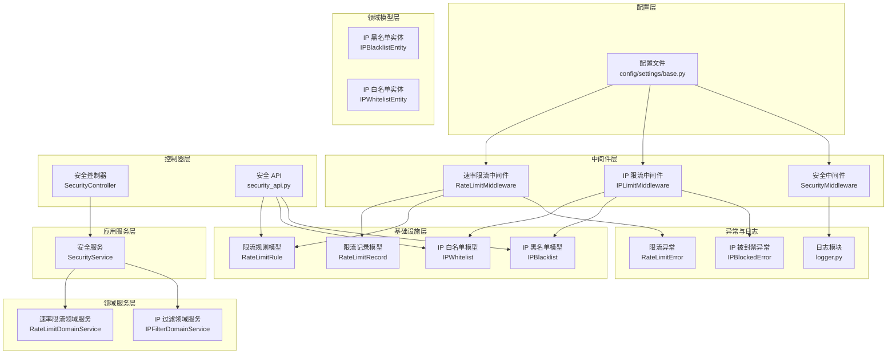
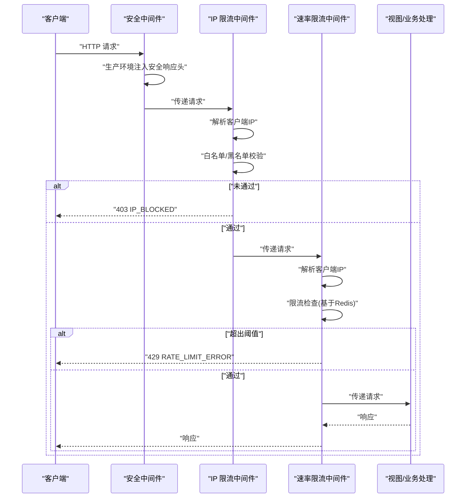
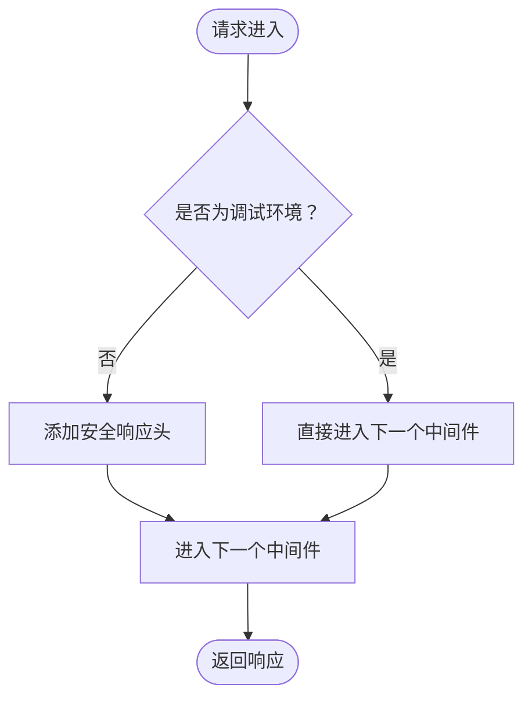
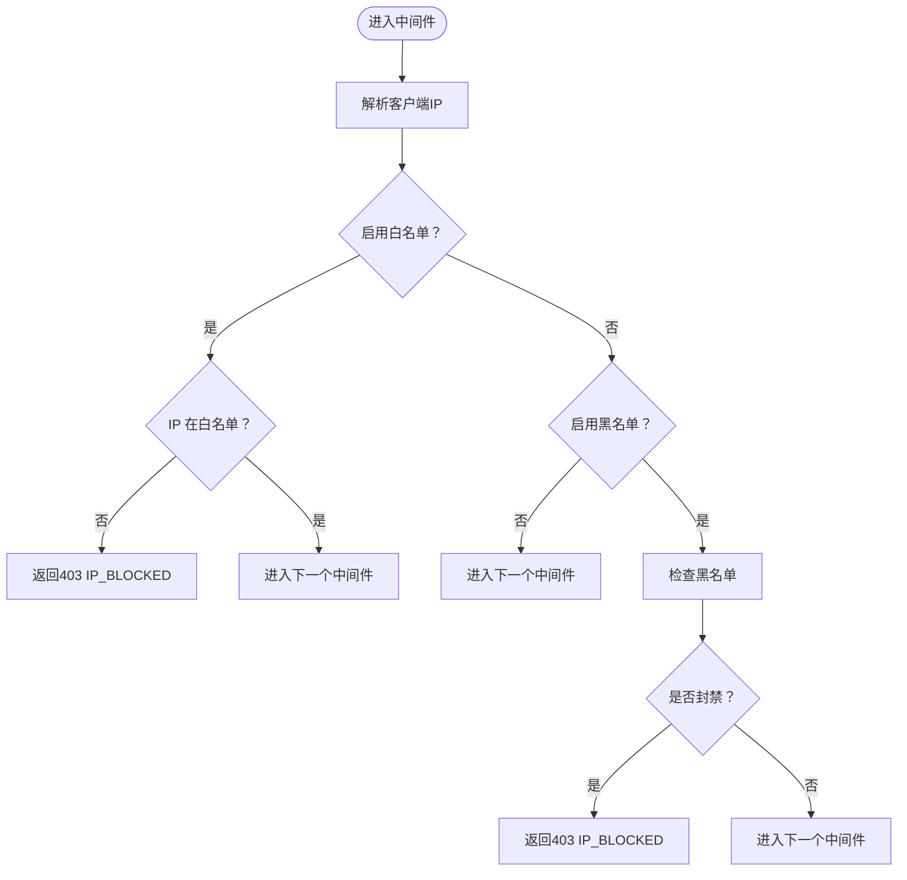
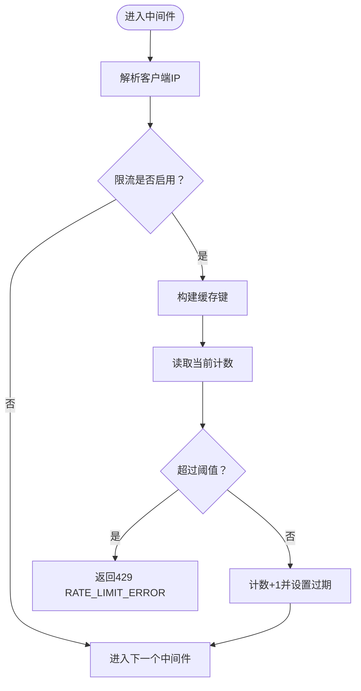
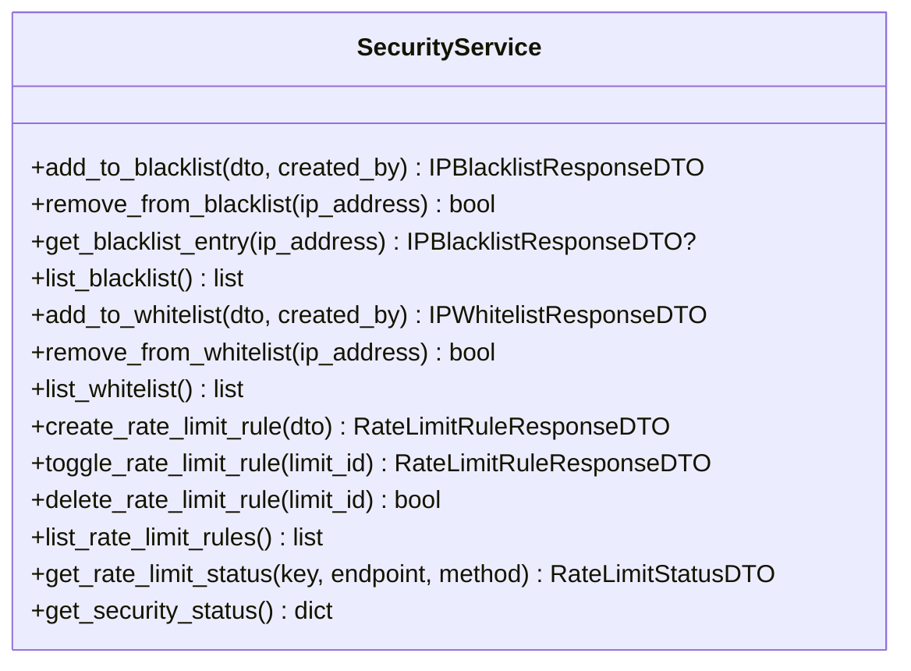
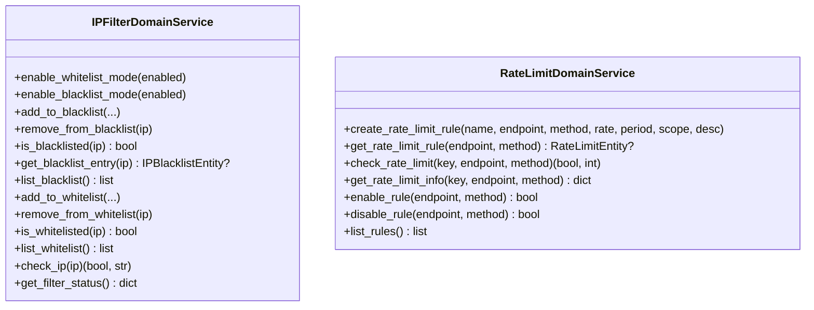
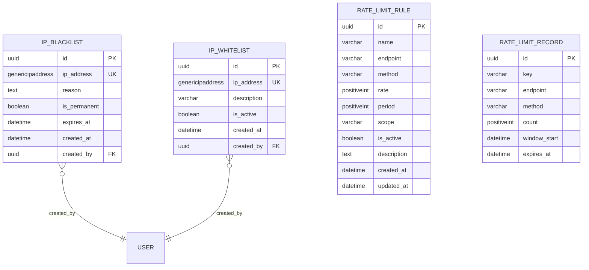
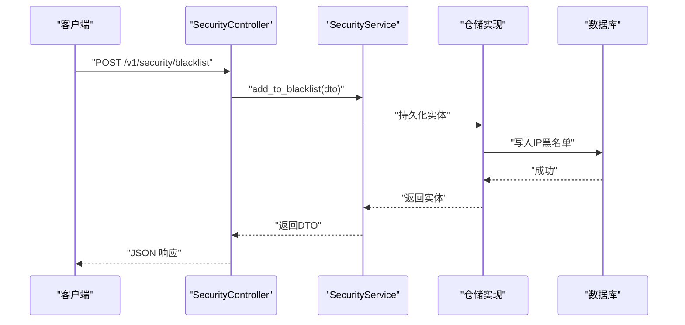
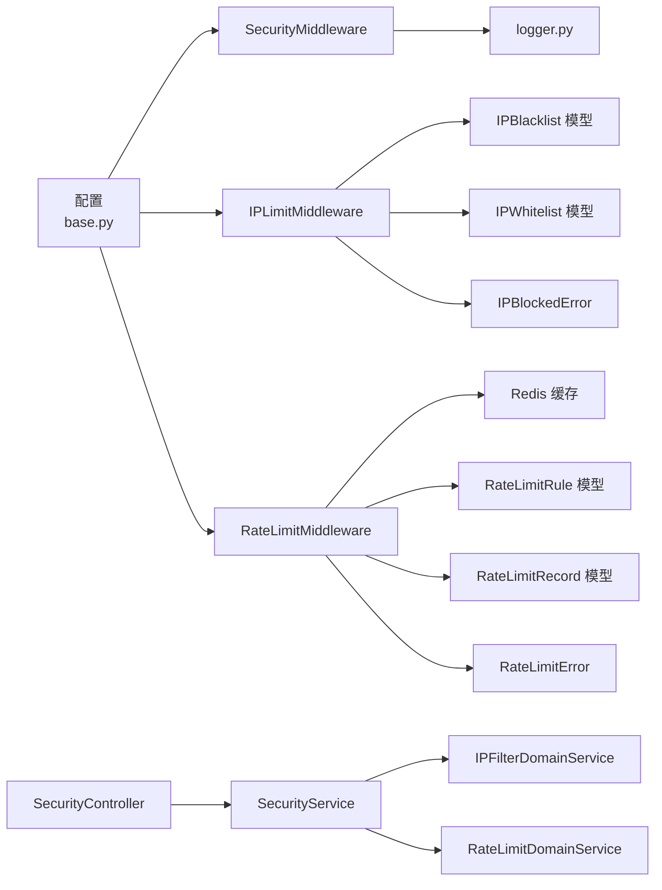

# 安全中间件

<cite>
**本文引用的文件**
- [security_middleware.py](file://src/core/middlewares/security_middleware.py)
- [ip_limit_middleware.py](file://src/core/middlewares/ip_limit_middleware.py)
- [rate_limit_middleware.py](file://src/core/middlewares/rate_limit_middleware.py)
- [security_models.py](file://src/infrastructure/persistence/models/security_models.py)
- [security_service.py](file://src/application/services/security_service.py)
- [security_controller.py](file://src/api/v1/controllers/security_controller.py)
- [ip_blacklist_entity.py](file://src/domain/security/entities/ip_blacklist_entity.py)
- [ip_whitelist_entity.py](file://src/domain/security/entities/ip_whitelist_entity.py)
- [ip_filter_service.py](file://src/domain/security/services/ip_filter_service.py)
- [rate_limit_service.py](file://src/domain/security/services/rate_limit_service.py)
- [base.py](file://config/settings/base.py)
- [ip_blocked_error.py](file://src/core/exceptions/ip_blocked_error.py)
- [rate_limit_error.py](file://src/core/exceptions/rate_limit_error.py)
- [logger.py](file://src/core/logger.py)
- [security_api.py](file://src/api/v1/security_api.py)
</cite>

## 目录
1. [简介](#简介)
2. [项目结构](#项目结构)
3. [核心组件](#核心组件)
4. [架构总览](#架构总览)
5. [详细组件分析](#详细组件分析)
6. [依赖分析](#依赖分析)
7. [性能考虑](#性能考虑)
8. [故障排查指南](#故障排查指南)
9. [结论](#结论)
10. [附录](#附录)

## 简介
本技术文档围绕安全中间件展开，系统性阐述其在请求生命周期中的安全检查机制与防护能力，覆盖以下方面：
- 安全响应头与生产环境强化策略
- IP 黑白名单过滤与配置
- 请求频率限流与规则管理
- 请求头验证与内容安全策略
- 配置项与自定义安全规则开发指南
- 安全事件监控与告警
- 安全漏洞预防与应急响应
- 与认证、授权、日志等其他安全组件的协作关系

## 项目结构
安全中间件位于核心层，配合应用服务、领域服务、基础设施模型与控制器共同构成完整的安全治理闭环。关键文件分布如下：
- 中间件层：安全中间件、IP 限流中间件、速率限流中间件
- 应用服务层：统一的安全业务编排与 DTO 转换
- 领域服务层：IP 过滤与速率限流的核心业务逻辑
- 领域模型层：IP 黑名单/白名单与速率限流规则的实体定义
- 基础设施层：ORM 模型与持久化实现
- 控制器层：对外暴露的安全管理 API
- 配置层：中间件顺序、Redis 缓存、限流开关与默认阈值
- 异常与日志：统一错误与安全事件日志

图表来源
- [base.py:39-52](file://config/settings/base.py#L39-L52)
- [security_middleware.py:14-53](file://src/core/middlewares/security_middleware.py#L14-L53)
- [ip_limit_middleware.py:15-129](file://src/core/middlewares/ip_limit_middleware.py#L15-L129)
- [rate_limit_middleware.py:15-111](file://src/core/middlewares/rate_limit_middleware.py#L15-L111)
- [security_service.py:24-224](file://src/application/services/security_service.py#L24-L224)
- [ip_filter_service.py:12-148](file://src/domain/security/services/ip_filter_service.py#L12-L148)
- [rate_limit_service.py:11-125](file://src/domain/security/services/rate_limit_service.py#L11-L125)
- [ip_blacklist_entity.py:11-52](file://src/domain/security/entities/ip_blacklist_entity.py#L11-L52)
- [ip_whitelist_entity.py:11-46](file://src/domain/security/entities/ip_whitelist_entity.py#L11-L46)
- [security_models.py:13-161](file://src/infrastructure/persistence/models/security_models.py#L13-L161)
- [security_controller.py:21-301](file://src/api/v1/controllers/security_controller.py#L21-L301)
- [security_api.py:23-284](file://src/api/v1/security_api.py#L23-L284)
- [ip_blocked_error.py:9-25](file://src/core/exceptions/ip_blocked_error.py#L9-L25)
- [rate_limit_error.py:9-25](file://src/core/exceptions/rate_limit_error.py#L9-L25)
- [logger.py:12-137](file://src/core/logger.py#L12-L137)

章节来源
- [base.py:39-52](file://config/settings/base.py#L39-L52)
- [security_middleware.py:14-53](file://src/core/middlewares/security_middleware.py#L14-L53)
- [ip_limit_middleware.py:15-129](file://src/core/middlewares/ip_limit_middleware.py#L15-L129)
- [rate_limit_middleware.py:15-111](file://src/core/middlewares/rate_limit_middleware.py#L15-L111)

## 核心组件
- 安全中间件：在生产环境自动注入安全响应头，增强浏览器安全策略。
- IP 限流中间件：基于配置的白/黑名单模式，对请求进行准入控制。
- 速率限流中间件：基于 Redis 缓存的简单滑动窗口限流，支持默认阈值。
- 安全服务：聚合业务逻辑，协调领域服务与仓储实现，提供统一的 DTO 接口。
- 领域服务：IP 过滤与速率限流的核心算法与状态管理。
- ORM 模型：持久化 IP 黑/白名单与限流规则/记录。
- 控制器/API：对外暴露安全配置与状态查询接口。

章节来源
- [security_middleware.py:14-53](file://src/core/middlewares/security_middleware.py#L14-L53)
- [ip_limit_middleware.py:15-129](file://src/core/middlewares/ip_limit_middleware.py#L15-L129)
- [rate_limit_middleware.py:15-111](file://src/core/middlewares/rate_limit_middleware.py#L15-L111)
- [security_service.py:24-224](file://src/application/services/security_service.py#L24-L224)
- [ip_filter_service.py:12-148](file://src/domain/security/services/ip_filter_service.py#L12-L148)
- [rate_limit_service.py:11-125](file://src/domain/security/services/rate_limit_service.py#L11-L125)
- [security_models.py:13-161](file://src/infrastructure/persistence/models/security_models.py#L13-L161)
- [security_controller.py:21-301](file://src/api/v1/controllers/security_controller.py#L21-L301)
- [security_api.py:23-284](file://src/api/v1/security_api.py#L23-L284)

## 架构总览
安全中间件在请求进入视图前执行，分别完成：
- 安全响应头注入（生产环境）
- IP 黑/白名单准入校验
- 速率限流检查

图表来源
- [security_middleware.py:33-53](file://src/core/middlewares/security_middleware.py#L33-L53)
- [ip_limit_middleware.py:41-76](file://src/core/middlewares/ip_limit_middleware.py#L41-L76)
- [rate_limit_middleware.py:41-68](file://src/core/middlewares/rate_limit_middleware.py#L41-L68)

## 详细组件分析

### 安全中间件（SecurityMiddleware）
- 职责：在非调试环境下为响应添加安全头，提升浏览器安全防护。
- 关键行为：
  - X-Content-Type-Options: nosniff
  - X-Frame-Options: DENY
  - X-XSS-Protection: 1; mode=block
  - Strict-Transport-Security: max-age=31536000; includeSubDomains
- 适用场景：生产环境强制启用，开发环境关闭。

图表来源
- [security_middleware.py:33-53](file://src/core/middlewares/security_middleware.py#L33-L53)

章节来源
- [security_middleware.py:14-53](file://src/core/middlewares/security_middleware.py#L14-L53)
- [base.py:165-173](file://config/settings/base.py#L165-L173)

### IP 限流中间件（IPLimitMiddleware）
- 职责：根据配置的白/黑名单模式，对请求来源 IP 进行准入控制。
- 配置项：
  - IP_BLACKLIST_ENABLED：启用黑名单模式
  - IP_WHITELIST_ENABLED：启用白名单模式
- IP 解析：优先取 X-Forwarded-For，回退 REMOTE_ADDR。
- 黑名单逻辑：
  - 支持永久封禁与到期封禁
  - 未命中封禁即放行
- 白名单逻辑：
  - 仅允许白名单内 IP
  - 未命中即拒绝

图表来源
- [ip_limit_middleware.py:41-76](file://src/core/middlewares/ip_limit_middleware.py#L41-L76)
- [ip_limit_middleware.py:78-129](file://src/core/middlewares/ip_limit_middleware.py#L78-L129)
- [base.py:232-234](file://config/settings/base.py#L232-L234)

章节来源
- [ip_limit_middleware.py:15-129](file://src/core/middlewares/ip_limit_middleware.py#L15-L129)
- [base.py:232-234](file://config/settings/base.py#L232-L234)

### 速率限流中间件（RateLimitMiddleware）
- 职责：基于 Redis 缓存实现按 IP 的请求频率限制。
- 配置项：
  - RATE_LIMIT_ENABLED：是否启用限流
  - RATE_LIMIT_DEFAULT：默认限流规则（如 100/minute）
- 实现要点：
  - 使用键：rate_limit:{ip}:{method}:{path}
  - 过期时间：60 秒
  - 当前计数超过阈值（示例为 100）时拒绝请求
- 返回：429 并携带统一错误码与消息。

图表来源
- [rate_limit_middleware.py:41-68](file://src/core/middlewares/rate_limit_middleware.py#L41-L68)
- [rate_limit_middleware.py:87-111](file://src/core/middlewares/rate_limit_middleware.py#L87-L111)
- [base.py:228-230](file://config/settings/base.py#L228-L230)

章节来源
- [rate_limit_middleware.py:15-111](file://src/core/middlewares/rate_limit_middleware.py#L15-L111)
- [base.py:228-230](file://config/settings/base.py#L228-L230)

### 安全服务（SecurityService）
- 职责：封装安全相关业务逻辑，协调领域服务与仓储实现。
- 主要功能：
  - IP 黑/白名单增删改查与列表
  - 限流规则创建、启停、删除与列表
  - 限流状态查询（剩余次数、重置时间等）
  - 安全状态汇总（黑白名单与限流规则数量）

图表来源
- [security_service.py:24-224](file://src/application/services/security_service.py#L24-L224)

章节来源
- [security_service.py:24-224](file://src/application/services/security_service.py#L24-L224)

### 领域服务（IPFilterDomainService / RateLimitDomainService）
- IPFilterDomainService：维护内存中的黑白名单与规则，提供检查与状态查询。
- RateLimitDomainService：维护限流规则与记录，提供检查与剩余次数计算。

图表来源
- [ip_filter_service.py:12-148](file://src/domain/security/services/ip_filter_service.py#L12-L148)
- [rate_limit_service.py:11-125](file://src/domain/security/services/rate_limit_service.py#L11-L125)

章节来源
- [ip_filter_service.py:12-148](file://src/domain/security/services/ip_filter_service.py#L12-L148)
- [rate_limit_service.py:11-125](file://src/domain/security/services/rate_limit_service.py#L11-L125)

### ORM 模型（IPBlacklist / IPWhitelist / RateLimitRule / RateLimitRecord）
- IPBlacklist/IPWhitelist：存储封禁/允许的 IP，支持永久与到期封禁。
- RateLimitRule：定义端点级限流规则（方法、速率、周期、作用域）。
- RateLimitRecord：记录实际请求次数与窗口起始时间。

图表来源
- [security_models.py:13-161](file://src/infrastructure/persistence/models/security_models.py#L13-L161)

章节来源
- [security_models.py:13-161](file://src/infrastructure/persistence/models/security_models.py#L13-L161)

### 控制器与 API（SecurityController / security_api.py）
- 提供对外接口：
  - 黑名单：新增、删除、列表
  - 白名单：新增、删除、列表
  - 限流规则：创建、启停、删除、列表
  - 安全状态：统计黑白名单与活跃限流规则数量
- 采用 DTO 进行输入输出，保证接口稳定与数据一致性。

图表来源
- [security_controller.py:43-68](file://src/api/v1/controllers/security_controller.py#L43-L68)
- [security_service.py:35-53](file://src/application/services/security_service.py#L35-L53)
- [security_models.py:13-41](file://src/infrastructure/persistence/models/security_models.py#L13-L41)

章节来源
- [security_controller.py:21-301](file://src/api/v1/controllers/security_controller.py#L21-L301)
- [security_api.py:23-284](file://src/api/v1/security_api.py#L23-L284)

## 依赖分析
- 中间件依赖配置：中间件通过 settings 读取开关与默认值。
- 中间件依赖缓存：速率限流依赖 Redis 缓存。
- 中间件依赖异常：IP/限流异常统一继承 BaseAPIError。
- 中间件依赖日志：记录安全事件与限流告警。
- 控制器依赖应用服务：控制器不直接操作仓储，通过服务编排。
- 领域服务依赖实体：实体负责状态与校验逻辑。

图表来源
- [base.py:228-234](file://config/settings/base.py#L228-L234)
- [rate_limit_middleware.py:8-10](file://src/core/middlewares/rate_limit_middleware.py#L8-L10)
- [ip_limit_middleware.py:105-119](file://src/core/middlewares/ip_limit_middleware.py#L105-L119)
- [security_models.py:13-161](file://src/infrastructure/persistence/models/security_models.py#L13-L161)
- [security_controller.py:32-39](file://src/api/v1/controllers/security_controller.py#L32-L39)
- [security_service.py:30-31](file://src/application/services/security_service.py#L30-L31)
- [ip_filter_service.py:18-22](file://src/domain/security/services/ip_filter_service.py#L18-L22)
- [rate_limit_service.py:17-20](file://src/domain/security/services/rate_limit_service.py#L17-L20)
- [logger.py:12-137](file://src/core/logger.py#L12-L137)
- [ip_blocked_error.py:9-25](file://src/core/exceptions/ip_blocked_error.py#L9-L25)
- [rate_limit_error.py:9-25](file://src/core/exceptions/rate_limit_error.py#L9-L25)

章节来源
- [base.py:228-234](file://config/settings/base.py#L228-L234)
- [security_models.py:13-161](file://src/infrastructure/persistence/models/security_models.py#L13-L161)
- [security_controller.py:32-39](file://src/api/v1/controllers/security_controller.py#L32-L39)
- [security_service.py:30-31](file://src/application/services/security_service.py#L30-L31)
- [ip_filter_service.py:18-22](file://src/domain/security/services/ip_filter_service.py#L18-L22)
- [rate_limit_service.py:17-20](file://src/domain/security/services/rate_limit_service.py#L17-L20)
- [logger.py:12-137](file://src/core/logger.py#L12-L137)
- [ip_blocked_error.py:9-25](file://src/core/exceptions/ip_blocked_error.py#L9-L25)
- [rate_limit_error.py:9-25](file://src/core/exceptions/rate_limit_error.py#L9-L25)

## 性能考虑
- 速率限流使用 Redis 缓存，具备高吞吐与低延迟特性；建议合理设置过期时间与键空间，避免热 key。
- IP 黑/白名单中间件在白名单模式下会查询数据库，建议：
  - 对 IP 地址建立索引（已由模型定义）
  - 结合缓存或内存表降低数据库压力
- 安全响应头为静态注入，开销极小。
- 日志在生产环境落盘，注意轮转与磁盘 IO；建议结合外部日志系统集中采集。

## 故障排查指南
- 403 IP_BLOCKED
  - 检查 IP 黑/白名单配置与状态
  - 确认中间件开关：IP_BLACKLIST_ENABLED / IP_WHITELIST_ENABLED
  - 查看日志：security_logger 输出安全事件
- 429 RATE_LIMIT_ERROR
  - 检查 RATE_LIMIT_ENABLED 与 RATE_LIMIT_DEFAULT
  - 清理或调整 Redis 中的 rate_limit:* 键
  - 关注限流记录表，确认窗口与阈值
- 安全响应头缺失
  - 确认非 DEBUG 环境
  - 检查配置文件中的安全头设置
- 日志问题
  - 检查日志目录权限与磁盘空间
  - 确认日志级别与处理器配置

章节来源
- [ip_limit_middleware.py:55-74](file://src/core/middlewares/ip_limit_middleware.py#L55-L74)
- [rate_limit_middleware.py:58-66](file://src/core/middlewares/rate_limit_middleware.py#L58-L66)
- [base.py:228-234](file://config/settings/base.py#L228-L234)
- [logger.py:129-137](file://src/core/logger.py#L129-L137)

## 结论
本安全中间件体系以中间件为核心，结合应用服务、领域服务与 ORM 模型，实现了：
- 生产环境安全响应头的自动化注入
- 基于配置的 IP 黑/白名单准入控制
- 基于 Redis 的轻量级速率限流
- 统一的 DTO 接口与异常处理
- 可扩展的限流规则与安全状态查询

通过合理的配置与监控，可在不侵入业务代码的前提下，显著提升系统的抗攻击能力与稳定性。

## 附录

### 配置选项与环境变量
- 中间件顺序：确保自定义中间件位于标准中间件之后
- 速率限流
  - RATE_LIMIT_ENABLED：是否启用限流
  - RATE_LIMIT_DEFAULT：默认限流规则（如 100/minute）
- IP 黑/白名单
  - IP_BLACKLIST_ENABLED：启用黑名单模式
  - IP_WHITELIST_ENABLED：启用白名单模式
- 缓存与日志
  - Redis 地址与端口
  - 日志目录与轮转策略

章节来源
- [base.py:39-52](file://config/settings/base.py#L39-L52)
- [base.py:228-234](file://config/settings/base.py#L228-L234)

### 自定义安全规则开发指南
- 新增限流规则
  - 在应用服务层调用创建方法，或通过控制器/API 提交
  - 设定端点、方法、速率与周期
- 扩展 IP 过滤逻辑
  - 在领域服务中增加新的过滤条件（如按时间段、按用户角色）
  - 保持 check_ip 返回值约定
- 增强日志与告警
  - 使用安全日志器记录关键事件
  - 结合外部监控系统（如告警平台）进行实时告警

章节来源
- [security_service.py:103-143](file://src/application/services/security_service.py#L103-L143)
- [ip_filter_service.py:120-139](file://src/domain/security/services/ip_filter_service.py#L120-L139)
- [logger.py:129-137](file://src/core/logger.py#L129-L137)

### 安全事件监控与告警
- 安全日志：记录 IP 被封禁、限流触发等事件
- 日志分类：应用日志、错误日志、访问日志
- 建议：接入集中式日志系统，设置阈值告警与可视化仪表盘

章节来源
- [logger.py:129-137](file://src/core/logger.py#L129-L137)

### 安全漏洞预防与应急响应
- 预防措施
  - 生产环境启用安全响应头
  - 启用速率限流与 IP 黑/白名单
  - 定期审计限流规则与封禁列表
- 应急响应
  - 快速封禁恶意 IP
  - 临时提高限流阈值或暂停限流
  - 回滚变更并复盘

章节来源
- [security_middleware.py:47-51](file://src/core/middlewares/security_middleware.py#L47-L51)
- [ip_limit_middleware.py:66-74](file://src/core/middlewares/ip_limit_middleware.py#L66-L74)
- [rate_limit_middleware.py:58-66](file://src/core/middlewares/rate_limit_middleware.py#L58-L66)

### 与其他安全组件的协作
- 认证与授权：JWT 与权限控制在其他中间件中完成，安全中间件与其并行工作
- 日志：统一日志模块为安全事件提供输出通道
- 异常：统一异常体系便于前端识别与处理

章节来源
- [base.py:40-52](file://config/settings/base.py#L40-L52)
- [logger.py:12-137](file://src/core/logger.py#L12-L137)
- [ip_blocked_error.py:9-25](file://src/core/exceptions/ip_blocked_error.py#L9-L25)
- [rate_limit_error.py:9-25](file://src/core/exceptions/rate_limit_error.py#L9-L25)