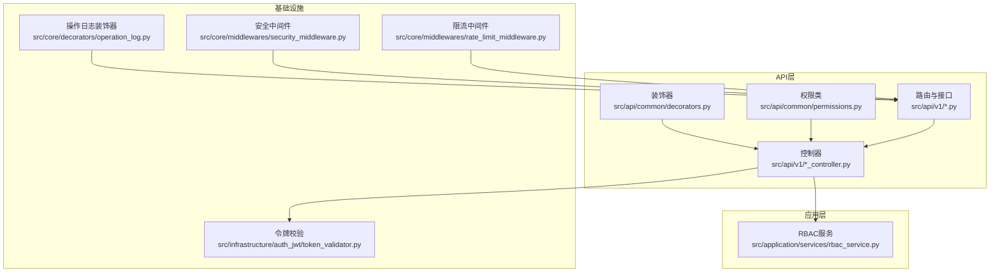
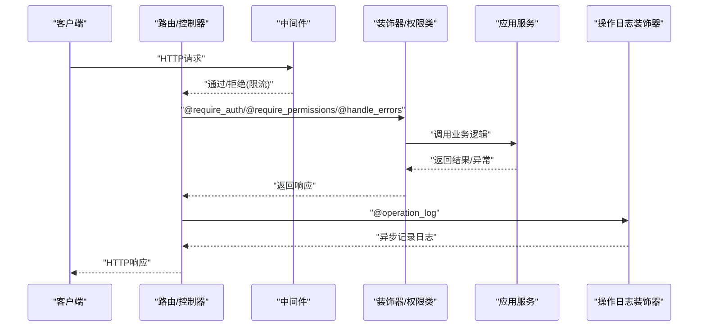
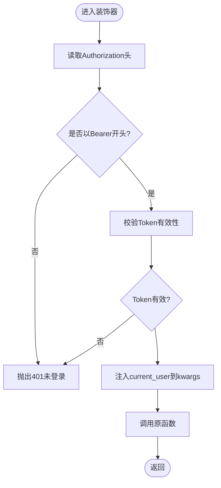
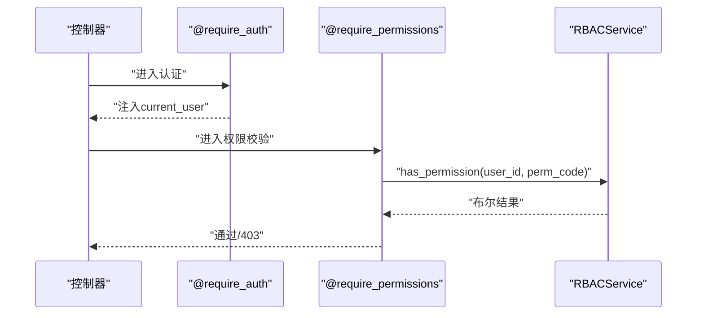
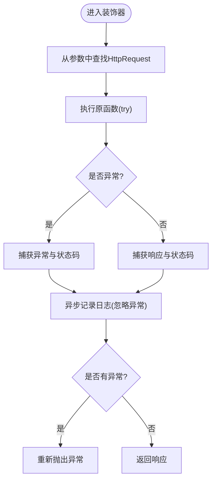
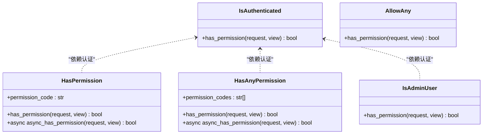
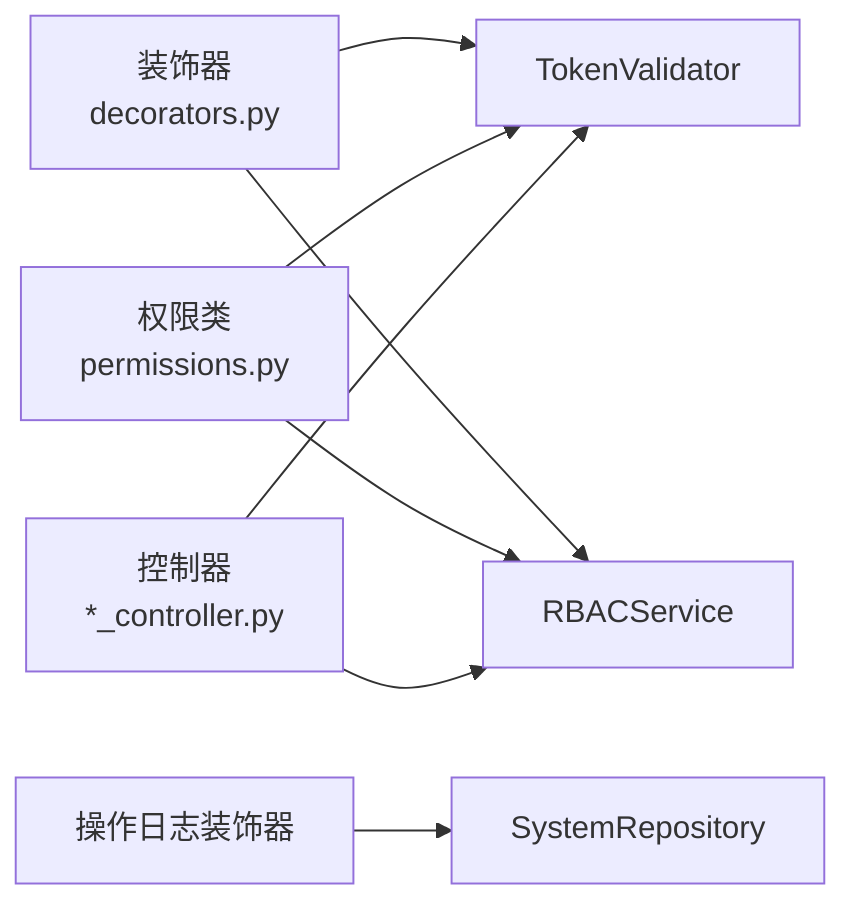

# 自定义装饰器

<cite>
**本文引用的文件**
- [src/api/common/decorators.py](file://src/api/common/decorators.py)
- [src/api/common/permissions.py](file://src/api/common/permissions.py)
- [src/core/decorators/operation_log.py](file://src/core/decorators/operation_log.py)
- [src/application/services/rbac_service.py](file://src/application/services/rbac_service.py)
- [src/infrastructure/auth_jwt/token_validator.py](file://src/infrastructure/auth_jwt/token_validator.py)
- [src/api/v1/controllers/auth_controller.py](file://src/api/v1/controllers/auth_controller.py)
- [src/api/v1/controllers/rbac_controller.py](file://src/api/v1/controllers/rbac_controller.py)
- [src/api/v1/user_api.py](file://src/api/v1/user_api.py)
- [src/api/v1/system_api.py](file://src/api/v1/system_api.py)
- [src/core/middlewares/security_middleware.py](file://src/core/middlewares/security_middleware.py)
- [src/core/middlewares/rate_limit_middleware.py](file://src/core/middlewares/rate_limit_middleware.py)
- [tests/test_api/test_auth_api.py](file://tests/test_api/test_auth_api.py)
- [tests/conftest.py](file://tests/conftest.py)
</cite>

## 目录
1. [简介](#简介)
2. [项目结构](#项目结构)
3. [核心组件](#核心组件)
4. [架构总览](#架构总览)
5. [详细组件分析](#详细组件分析)
6. [依赖分析](#依赖分析)
7. [性能考虑](#性能考虑)
8. [故障排查指南](#故障排查指南)
9. [结论](#结论)
10. [附录](#附录)

## 简介
本文件面向“自定义装饰器系统”的开发与使用，结合项目中的装饰器、权限类、中间件与服务层，系统化阐述以下主题：
- 装饰器设计模式与实现原理
- 权限装饰器的使用方法与配置选项
- 认证装饰器与授权装饰器的区别与应用场景
- 自定义装饰器的开发指南与最佳实践
- 装饰器的组合使用与嵌套调用方法
- 性能影响与优化策略
- 测试方法与调试技巧
- 常见装饰器模式的应用示例与代码模板

## 项目结构
该项目采用分层架构，装饰器与权限控制主要分布在以下模块：
- API通用装饰器与权限类：src/api/common
- 核心装饰器（操作日志）：src/core/decorators
- 应用服务（RBAC）：src/application/services
- 认证与令牌校验：src/infrastructure/auth_jwt
- 控制器与API路由：src/api/v1
- 中间件（安全与限流）：src/core/middlewares
- 测试：tests

图表来源
- [src/api/common/decorators.py:1-191](file://src/api/common/decorators.py#L1-L191)
- [src/api/common/permissions.py:1-245](file://src/api/common/permissions.py#L1-L245)
- [src/core/decorators/operation_log.py:1-175](file://src/core/decorators/operation_log.py#L1-L175)
- [src/application/services/rbac_service.py:1-319](file://src/application/services/rbac_service.py#L1-L319)
- [src/infrastructure/auth_jwt/token_validator.py:1-108](file://src/infrastructure/auth_jwt/token_validator.py#L1-L108)
- [src/core/middlewares/security_middleware.py:1-54](file://src/core/middlewares/security_middleware.py#L1-L54)
- [src/core/middlewares/rate_limit_middleware.py:1-112](file://src/core/middlewares/rate_limit_middleware.py#L1-L112)

章节来源
- [src/api/common/decorators.py:1-191](file://src/api/common/decorators.py#L1-L191)
- [src/api/common/permissions.py:1-245](file://src/api/common/permissions.py#L1-L245)
- [src/core/decorators/operation_log.py:1-175](file://src/core/decorators/operation_log.py#L1-L175)
- [src/application/services/rbac_service.py:1-319](file://src/application/services/rbac_service.py#L1-L319)
- [src/infrastructure/auth_jwt/token_validator.py:1-108](file://src/infrastructure/auth_jwt/token_validator.py#L1-L108)
- [src/core/middlewares/security_middleware.py:1-54](file://src/core/middlewares/security_middleware.py#L1-L54)
- [src/core/middlewares/rate_limit_middleware.py:1-112](file://src/core/middlewares/rate_limit_middleware.py#L1-L112)

## 核心组件
- 统一错误处理装饰器：将常见异常转换为HTTP错误，统一返回格式。
- 认证装饰器：校验Authorization头中的Bearer Token，并将当前用户信息注入到kwargs。
- 权限装饰器：基于RBAC服务检查用户是否具备所需权限，支持多权限与异步检查。
- 实体存在性验证装饰器：在执行业务前校验实体是否存在，支持注入entity到kwargs。
- 操作日志装饰器：自动记录API请求与响应信息，异步写入系统日志。
- 权限类（NinjaExtra）：基于BasePermission的认证与授权类，支持同步与异步权限检查。
- 安全中间件：生产环境添加安全响应头。
- 限流中间件：基于IP的请求频率限制。

章节来源
- [src/api/common/decorators.py:13-191](file://src/api/common/decorators.py#L13-L191)
- [src/api/common/permissions.py:14-245](file://src/api/common/permissions.py#L14-L245)
- [src/core/decorators/operation_log.py:15-175](file://src/core/decorators/operation_log.py#L15-L175)
- [src/core/middlewares/security_middleware.py:14-54](file://src/core/middlewares/security_middleware.py#L14-L54)
- [src/core/middlewares/rate_limit_middleware.py:15-112](file://src/core/middlewares/rate_limit_middleware.py#L15-L112)

## 架构总览
装饰器与权限控制贯穿请求生命周期：
- 请求进入后，中间件进行安全与限流处理
- 控制器/路由层使用装饰器与权限类进行认证与授权
- 应用服务层执行业务逻辑，必要时调用RBAC服务进行权限校验
- 操作日志装饰器在函数执行前后收集上下文并异步落库

图表来源
- [src/api/common/decorators.py:13-191](file://src/api/common/decorators.py#L13-L191)
- [src/api/common/permissions.py:14-245](file://src/api/common/permissions.py#L14-L245)
- [src/core/decorators/operation_log.py:15-175](file://src/core/decorators/operation_log.py#L15-L175)
- [src/core/middlewares/rate_limit_middleware.py:15-112](file://src/core/middlewares/rate_limit_middleware.py#L15-L112)
- [src/core/middlewares/security_middleware.py:14-54](file://src/core/middlewares/security_middleware.py#L14-L54)

## 详细组件分析

### 统一错误处理装饰器
- 设计要点
  - 使用functools.wraps保持原函数签名
  - 捕获ValueError、PermissionError、HttpError与其他异常，分别映射为400、403、500
  - 对未捕获异常记录日志并返回500
- 使用建议
  - 建议在每个API入口处使用，保证错误输出一致性
  - 与认证/授权装饰器配合，优先放在外层

章节来源
- [src/api/common/decorators.py:13-51](file://src/api/common/decorators.py#L13-L51)

### 认证装饰器
- 设计要点
  - 从Authorization头解析Bearer Token
  - 通过TokenValidator校验有效性与类型
  - 将payload注入kwargs供后续使用
- 使用建议
  - 通常与权限装饰器组合使用
  - 注意在控制器中接收current_user参数

图表来源
- [src/api/common/decorators.py:53-92](file://src/api/common/decorators.py#L53-L92)
- [src/infrastructure/auth_jwt/token_validator.py:21-45](file://src/infrastructure/auth_jwt/token_validator.py#L21-L45)

章节来源
- [src/api/common/decorators.py:53-92](file://src/api/common/decorators.py#L53-L92)
- [src/infrastructure/auth_jwt/token_validator.py:11-108](file://src/infrastructure/auth_jwt/token_validator.py#L11-L108)

### 权限装饰器
- 设计要点
  - 基于RBAC服务检查用户是否具备所需权限
  - 支持多个权限码，任一缺失即拒绝
  - 内部依赖require_auth，确保已认证
- 使用建议
  - 权限码遵循“资源:动作”规范
  - 与实体存在性装饰器配合，避免重复查询

图表来源
- [src/api/common/decorators.py:95-143](file://src/api/common/decorators.py#L95-L143)
- [src/application/services/rbac_service.py:233-251](file://src/application/services/rbac_service.py#L233-L251)

章节来源
- [src/api/common/decorators.py:95-143](file://src/api/common/decorators.py#L95-L143)
- [src/application/services/rbac_service.py:233-251](file://src/application/services/rbac_service.py#L233-L251)

### 实体存在性验证装饰器
- 设计要点
  - 从kwargs中提取实体ID（如user_id、role_id等）
  - 调用传入的异步获取函数验证实体存在
  - 将entity注入kwargs，便于后续业务使用
- 使用建议
  - ID提取逻辑需与路由参数命名一致
  - 未找到实体时抛出404

章节来源
- [src/api/common/decorators.py:146-191](file://src/api/common/decorators.py#L146-L191)

### 操作日志装饰器
- 设计要点
  - 在函数执行前后收集请求/响应信息
  - 异步写入系统日志仓库，不影响主流程
  - 解析User-Agent获取浏览器与操作系统信息
- 使用建议
  - 仅对关键业务接口使用，避免日志风暴
  - 注意请求体大小限制与异常吞吐

图表来源
- [src/core/decorators/operation_log.py:15-72](file://src/core/decorators/operation_log.py#L15-L72)
- [src/core/decorators/operation_log.py:75-175](file://src/core/decorators/operation_log.py#L75-L175)

章节来源
- [src/core/decorators/operation_log.py:15-175](file://src/core/decorators/operation_log.py#L15-L175)

### 权限类（NinjaExtra）
- 设计要点
  - IsAuthenticated：校验Bearer Token并注入用户信息
  - HasPermission/HasAnyPermission：同步注入需求权限，异步执行检查
  - IsAdminUser：基于payload中的roles判断管理员
  - AllowAny：放行所有请求
- 使用建议
  - 控制器级别permissions参数中声明
  - 与装饰器混合使用时注意顺序与冲突

图表来源
- [src/api/common/permissions.py:14-245](file://src/api/common/permissions.py#L14-L245)

章节来源
- [src/api/common/permissions.py:14-245](file://src/api/common/permissions.py#L14-L245)

### 中间件（安全与限流）
- 安全中间件
  - 生产环境添加X-Content-Type-Options、X-Frame-Options、X-XSS-Protection、Strict-Transport-Security等响应头
- 限流中间件
  - 基于IP与路径统计请求频次，默认每分钟100次
  - 可通过设置开启/关闭与默认规则

章节来源
- [src/core/middlewares/security_middleware.py:14-54](file://src/core/middlewares/security_middleware.py#L14-L54)
- [src/core/middlewares/rate_limit_middleware.py:15-112](file://src/core/middlewares/rate_limit_middleware.py#L15-L112)

## 依赖分析
- 装饰器依赖
  - require_auth → TokenValidator（令牌校验）
  - require_permissions → RBACService（权限检查）
  - operation_log → SystemRepository（日志持久化）
- 权限类依赖
  - TokenValidator（令牌校验）
  - RBACService（权限检查）
- 控制器与服务
  - 控制器通过装饰器/权限类与应用服务交互
  - 应用服务通过仓储与领域模型完成业务

图表来源
- [src/api/common/decorators.py:81-135](file://src/api/common/decorators.py#L81-L135)
- [src/api/common/permissions.py:11-120](file://src/api/common/permissions.py#L11-L120)
- [src/core/decorators/operation_log.py:12-127](file://src/core/decorators/operation_log.py#L12-L127)

章节来源
- [src/api/common/decorators.py:81-135](file://src/api/common/decorators.py#L81-L135)
- [src/api/common/permissions.py:11-120](file://src/api/common/permissions.py#L11-L120)
- [src/core/decorators/operation_log.py:12-127](file://src/core/decorators/operation_log.py#L12-L127)

## 性能考虑
- 装饰器开销
  - 认证与权限检查涉及外部服务调用（令牌校验、RBAC查询），建议结合缓存与批量查询
  - 操作日志装饰器异步写入，避免阻塞主流程
- 中间件开销
  - 限流中间件使用缓存计数，注意键空间与过期策略
  - 安全中间件仅在生产环境添加响应头，开发环境无额外开销
- 最佳实践
  - 对高频接口谨慎使用复杂装饰器链
  - 合理设置缓存TTL与命中率
  - 对日志装饰器限定关键接口

[本节为通用指导，无需列出具体文件来源]

## 故障排查指南
- 常见问题
  - 401未登录：确认Authorization头格式与Bearer Token有效性
  - 403权限不足：核对用户权限码与资源/动作匹配
  - 404实体不存在：确认ID参数与实体存在性装饰器配置
  - 500内部错误：查看日志定位异常位置
- 调试技巧
  - 在装饰器中增加日志输出，记录关键参数与分支
  - 使用单元测试模拟不同场景（认证失败、权限不足、实体不存在）
  - 结合中间件日志与操作日志定位问题
- 测试参考
  - 认证接口测试：登录、刷新、登出、未激活用户、不存在用户等场景
  - 权限类测试：控制器级权限注解与异步权限检查

章节来源
- [tests/test_api/test_auth_api.py:11-182](file://tests/test_api/test_auth_api.py#L11-L182)
- [tests/conftest.py:10-66](file://tests/conftest.py#L10-L66)

## 结论
本项目的装饰器体系通过“装饰器+权限类+中间件+服务层”的协同，实现了统一的认证、授权与日志能力。建议在实际开发中：
- 明确区分认证与授权职责，合理组合装饰器与权限类
- 关注性能与可观测性，对关键路径进行优化与监控
- 通过测试覆盖典型与边界场景，确保稳定性

[本节为总结，无需列出具体文件来源]

## 附录

### 权限装饰器使用方法与配置选项
- require_auth
  - 作用：校验Bearer Token并注入current_user
  - 参数：无
  - 返回：kwargs中包含current_user
- require_permissions(*permission_codes)
  - 作用：校验用户是否具备全部权限码
  - 参数：权限码列表（如"user:delete"）
  - 返回：通过或抛出403
- validate_exists(get_entity_func)
  - 作用：校验实体存在并注入entity
  - 参数：异步获取实体的函数
  - 返回：kwargs中包含entity

章节来源
- [src/api/common/decorators.py:53-191](file://src/api/common/decorators.py#L53-L191)

### 认证装饰器与授权装饰器的区别与应用场景
- 认证装饰器（require_auth）
  - 场景：所有需要登录态的接口
  - 关注点：令牌有效性与用户身份注入
- 授权装饰器（require_permissions）
  - 场景：基于RBAC的细粒度权限控制
  - 关注点：权限码与资源/动作匹配

章节来源
- [src/api/common/decorators.py:53-143](file://src/api/common/decorators.py#L53-L143)

### 自定义装饰器开发指南与最佳实践
- 设计模式
  - 使用functools.wraps保持签名
  - 优先处理异常与边界条件
  - 与现有服务解耦，便于测试
- 最佳实践
  - 明确职责单一，避免过度封装
  - 提供清晰的错误信息与状态码
  - 对外部依赖（缓存、数据库）做好降级与重试

[本节为通用指导，无需列出具体文件来源]

### 装饰器的组合使用与嵌套调用方法
- 组合顺序
  - @handle_errors → @require_auth → @require_permissions → 业务逻辑
- 嵌套调用
  - 装饰器按从外到内依次执行，内部可复用外部注入的上下文（如current_user）

章节来源
- [src/api/common/decorators.py:13-191](file://src/api/common/decorators.py#L13-L191)

### 常见装饰器模式的应用示例与代码模板
- 统一错误处理
  - 适用：所有API入口
  - 模板：在路由函数上使用装饰器，捕获异常并返回标准格式
- 认证+授权
  - 适用：受保护的管理接口
  - 模板：先require_auth，再require_permissions
- 实体存在性校验
  - 适用：更新/删除等变更型接口
  - 模板：使用validate_exists装饰器，自动注入entity
- 操作日志
  - 适用：关键业务接口
  - 模板：使用operation_log装饰器，记录模块与描述

章节来源
- [src/api/common/decorators.py:13-191](file://src/api/common/decorators.py#L13-L191)
- [src/core/decorators/operation_log.py:15-72](file://src/core/decorators/operation_log.py#L15-L72)