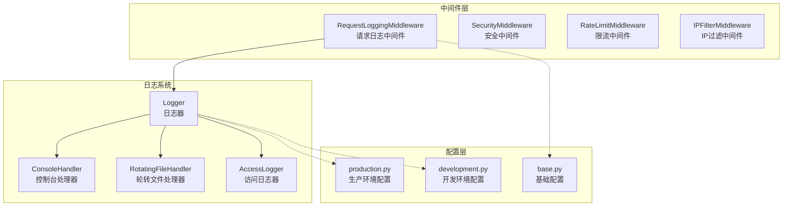
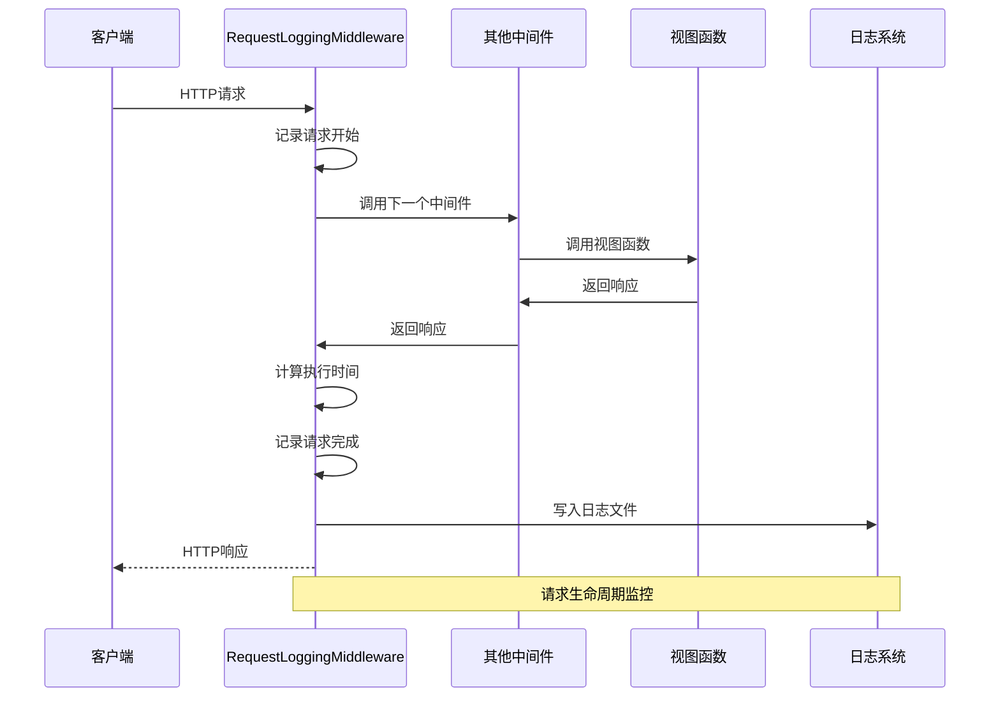
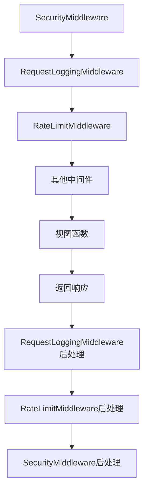
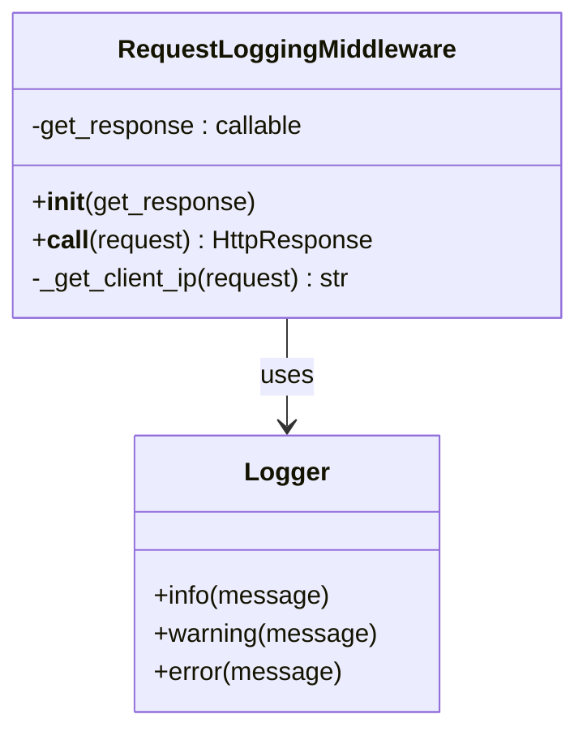
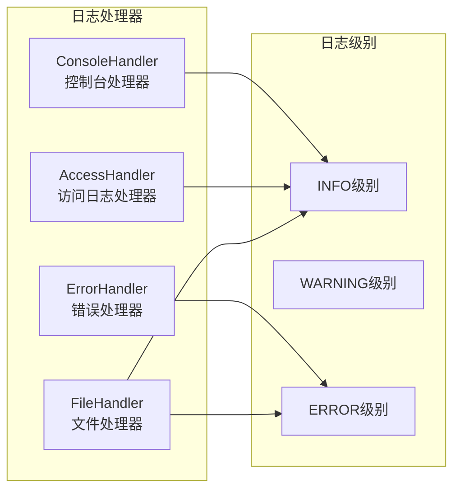
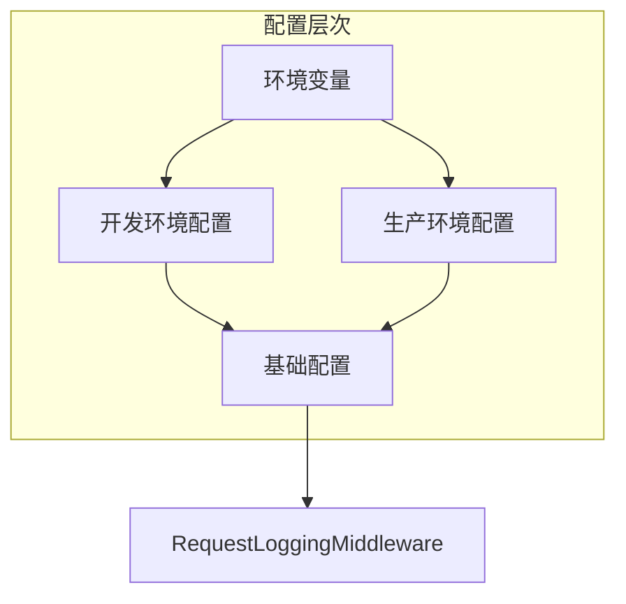
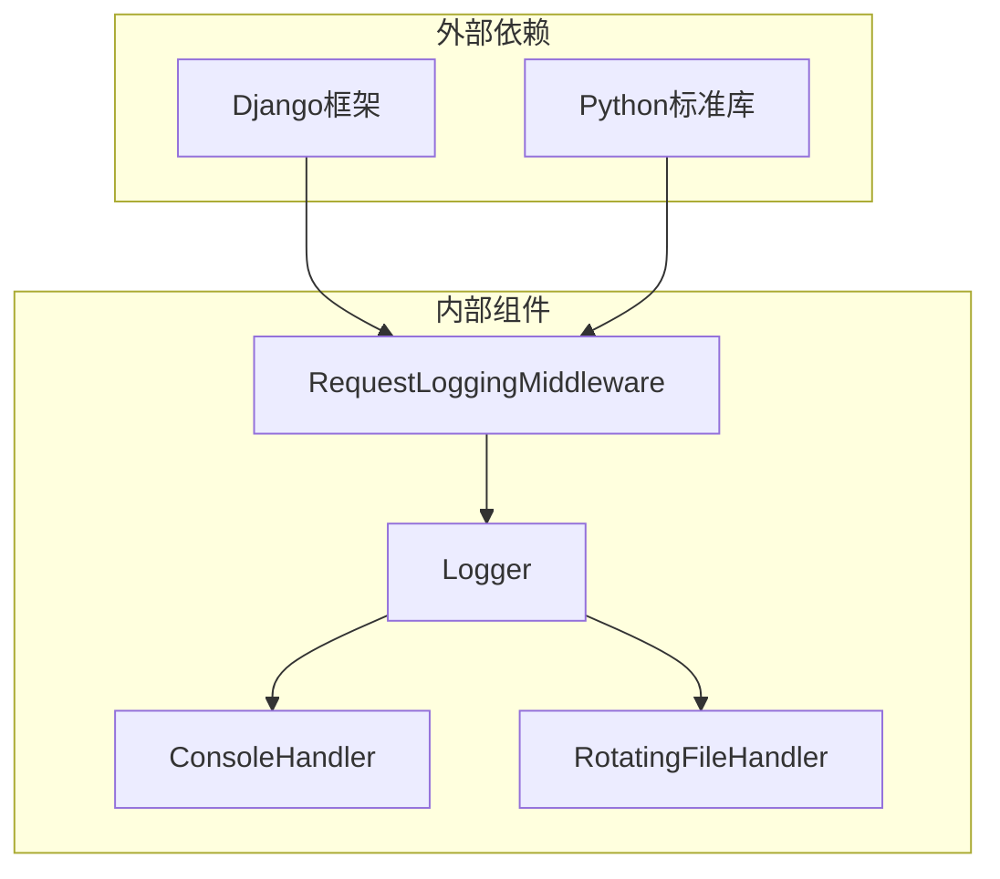

# 请求日志中间件

<cite>
**本文档引用的文件**
- [request_logging_middleware.py](file://src/core/middlewares/request_logging_middleware.py)
- [logger.py](file://src/core/logger.py)
- [base.py](file://config/settings/base.py)
- [production.py](file://config/settings/production.py)
- [development.py](file://config/settings/development.py)
- [__init__.py](file://src/core/middlewares/__init__.py)
- [operation_log.py](file://src/core/decorators/operation_log.py)
- [log_dto.py](file://src/application/dto/system/log_dto.py)
- [app.py](file://src/api/app.py)
- [test_rate_limit_middleware.py](file://tests/test_middlewares/test_rate_limit_middleware.py)
</cite>

## 目录
1. [简介](#简介)
2. [项目结构](#项目结构)
3. [核心组件](#核心组件)
4. [架构概览](#架构概览)
5. [详细组件分析](#详细组件分析)
6. [依赖关系分析](#依赖关系分析)
7. [性能考虑](#性能考虑)
8. [故障排除指南](#故障排除指南)
9. [结论](#结论)

## 简介

请求日志中间件是 Django 应用中的关键组件，负责记录所有 HTTP 请求的详细信息。该中间件提供了完整的请求生命周期监控，包括请求开始、完成状态、执行时间和用户信息追踪。通过集成多种日志处理器和格式化器，该中间件能够满足开发和生产环境的不同需求。

本中间件采用 Django 中间件的标准模式，实现了请求前后的钩子函数，确保对每个请求进行透明的监控而不影响业务逻辑。中间件支持多种日志级别，并具备良好的扩展性，可以与其他安全和性能监控组件协同工作。

## 项目结构

请求日志中间件位于项目的中间件层，与其它安全中间件共同构成了完整的请求处理管道。以下是相关的项目结构组织：



**图表来源**
- [request_logging_middleware.py:1-86](file://src/core/middlewares/request_logging_middleware.py#L1-L86)
- [logger.py:1-138](file://src/core/logger.py#L1-L138)
- [base.py:174-226](file://config/settings/base.py#L174-L226)

**章节来源**
- [request_logging_middleware.py:1-86](file://src/core/middlewares/request_logging_middleware.py#L1-L86)
- [logger.py:1-138](file://src/core/logger.py#L1-L138)
- [base.py:174-226](file://config/settings/base.py#L174-L226)

## 核心组件

### 请求日志中间件类

请求日志中间件是一个标准的 Django 中间件实现，具有以下核心特性：

- **请求生命周期监控**：自动记录请求开始和完成状态
- **性能指标收集**：计算并记录请求执行时间
- **用户信息追踪**：识别已认证用户和匿名访问
- **IP地址解析**：支持代理服务器场景下的真实IP获取

中间件的核心实现遵循 Django 中间件的标准模式，通过 `__call__` 方法拦截请求和响应。

**章节来源**
- [request_logging_middleware.py:14-86](file://src/core/middlewares/request_logging_middleware.py#L14-L86)

### 日志配置系统

日志系统采用多处理器架构，支持不同级别的日志输出：

- **控制台处理器**：用于开发环境的实时输出
- **轮转文件处理器**：用于生产环境的持久化存储
- **访问日志器**：专门用于请求访问日志的独立日志器

日志配置支持动态级别调整，根据环境变量自动选择合适的日志级别。

**章节来源**
- [logger.py:12-82](file://src/core/logger.py#L12-L82)
- [base.py:174-226](file://config/settings/base.py#L174-L226)

## 架构概览

请求日志中间件在整个请求处理流程中扮演着监控者的角色，与其它中间件形成完整的安全和性能监控体系：



**图表来源**
- [request_logging_middleware.py:34-68](file://src/core/middlewares/request_logging_middleware.py#L34-L68)
- [logger.py:92-108](file://src/core/logger.py#L92-L108)

### 中间件链路分析

请求在中间件链路中的处理顺序如下：



**图表来源**
- [base.py:39-52](file://config/settings/base.py#L39-L52)
- [__init__.py:6-16](file://src/core/middlewares/__init__.py#L6-L16)

## 详细组件分析

### 请求日志中间件实现

#### 类结构设计



**图表来源**
- [request_logging_middleware.py:14-86](file://src/core/middlewares/request_logging_middleware.py#L14-L86)

#### 核心功能实现

中间件的核心功能包括：

1. **请求开始记录**：在请求进入时记录方法、路径、IP和用户信息
2. **性能监控**：精确测量请求处理时间
3. **响应完成记录**：在请求完成后记录状态码和执行时长
4. **IP地址解析**：支持代理服务器场景下的真实IP获取

**章节来源**
- [request_logging_middleware.py:34-68](file://src/core/middlewares/request_logging_middleware.py#L34-L68)

### 日志系统架构

#### 多处理器架构



**图表来源**
- [logger.py:31-81](file://src/core/logger.py#L31-L81)

#### 日志格式配置

日志系统支持多种格式化选项：

- **简单格式**：适用于开发环境的简洁输出
- **详细格式**：包含完整的时间戳和模块信息
- **JSON格式**：便于机器解析和分析

**章节来源**
- [logger.py:26-29](file://src/core/logger.py#L26-L29)
- [base.py:178-189](file://config/settings/base.py#L178-L189)

### 配置管理系统

#### 环境特定配置



**图表来源**
- [development.py:18-20](file://config/settings/development.py#L18-L20)
- [production.py:25-27](file://config/settings/production.py#L25-L27)

#### 动态配置调整

配置系统支持运行时的动态调整：

- **日志级别**：根据环境自动调整
- **处理器选择**：开发环境仅输出到控制台
- **文件轮转**：生产环境自动文件轮转

**章节来源**
- [base.py:174-226](file://config/settings/base.py#L174-L226)
- [logger.py:36-81](file://src/core/logger.py#L36-L81)

## 依赖关系分析

### 组件间依赖

请求日志中间件的依赖关系相对简单，主要依赖于 Django 的 HTTP 请求对象和 Python 标准库：



**图表来源**
- [request_logging_middleware.py:6-11](file://src/core/middlewares/request_logging_middleware.py#L6-L11)
- [logger.py:6-9](file://src/core/logger.py#L6-L9)

### 配置依赖

中间件的配置依赖于 Django 的 settings 系统：

- **日志级别**：从 settings.LOG_LEVEL 获取
- **环境检测**：通过 settings.DEBUG 判断环境
- **路径配置**：使用 settings.BASE_DIR 确定日志目录

**章节来源**
- [request_logging_middleware.py:48-51](file://src/core/middlewares/request_logging_middleware.py#L48-L51)
- [logger.py:22-24](file://src/core/logger.py#L22-L24)

## 性能考虑

### 性能影响分析

请求日志中间件对系统性能的影响主要体现在以下几个方面：

#### I/O 操作开销

- **磁盘写入**：文件系统写入操作会增加请求处理时间
- **文件轮转**：当达到大小限制时触发轮转操作
- **缓冲区管理**：需要平衡日志刷新频率和数据完整性

#### 内存使用

- **日志缓冲**：临时存储日志消息
- **请求对象**：需要访问请求和响应对象的所有属性
- **格式化开销**：字符串格式化操作的 CPU 消耗

### 性能优化建议

#### 1. 异步日志记录

考虑使用异步日志记录机制，避免阻塞主线程：

```python
# 建议的异步日志记录模式
import asyncio
import logging

async def async_log_request(request, response):
    """异步记录请求日志"""
    loop = asyncio.get_event_loop()
    await loop.run_in_executor(None, logger.info, log_message)
```

#### 2. 批量日志处理

实现批量日志处理机制，减少磁盘 I/O 次数：

```python
# 建议的批量处理模式
class BatchLogger:
    def __init__(self, batch_size=100):
        self.batch_size = batch_size
        self.buffer = []
    
    def log(self, message):
        self.buffer.append(message)
        if len(self.buffer) >= self.batch_size:
            self.flush()
    
    def flush(self):
        # 批量写入磁盘
        pass
```

#### 3. 缓存策略优化

对于频繁访问的接口，可以考虑缓存日志记录结果：

```python
# 建议的缓存策略
from django.core.cache import cache

def cached_log_request(request, response):
    cache_key = f"log:{request.path}:{request.method}"
    if cache.get(cache_key):
        return  # 避免重复记录
    cache.set(cache_key, True, timeout=60)  # 1分钟缓存
```

## 故障排除指南

### 常见问题诊断

#### 1. 日志不输出问题

**症状**：请求日志没有出现在预期位置

**可能原因**：
- 日志级别设置过高
- 文件权限问题
- 日志目录不存在

**解决方案**：
1. 检查 `settings.LOG_LEVEL` 配置
2. 验证日志目录权限
3. 确认 `BASE_DIR/logs` 目录存在

#### 2. IP地址显示异常

**症状**：日志中显示的IP地址不是客户端真实IP

**可能原因**：
- 代理服务器配置问题
- HTTP头缺失或被修改

**解决方案**：
1. 检查 `HTTP_X_FORWARDED_FOR` 头部
2. 验证代理服务器配置
3. 实现更严格的IP解析逻辑

#### 3. 性能下降问题

**症状**：应用响应时间明显增加

**可能原因**：
- 磁盘写入速度慢
- 日志文件过大
- 频繁的文件轮转

**解决方案**：
1. 优化磁盘I/O性能
2. 调整日志轮转参数
3. 实施异步日志记录

### 调试技巧

#### 1. 开发环境调试

在开发环境中，可以利用更详细的日志输出：

```python
# 开发环境配置示例
LOGGING = {
    'version': 1,
    'disable_existing_loggers': False,
    'handlers': {
        'console': {
            'class': 'logging.StreamHandler',
            'formatter': 'verbose'
        }
    },
    'loggers': {
        'src.core.middlewares': {
            'handlers': ['console'],
            'level': 'DEBUG',
            'propagate': False
        }
    }
}
```

#### 2. 生产环境监控

生产环境应该重点关注错误日志和访问统计：

```python
# 生产环境监控配置
LOGGING = {
    'version': 1,
    'disable_existing_loggers': False,
    'handlers': {
        'file': {
            'level': 'INFO',
            'class': 'logging.FileHandler',
            'filename': 'logs/app.log',
            'formatter': 'simple'
        },
        'error_file': {
            'level': 'ERROR',
            'class': 'logging.FileHandler',
            'filename': 'logs/error.log',
            'formatter': 'simple'
        }
    }
}
```

### 监控和告警

#### 1. 日志分析工具集成

建议集成专业的日志分析工具：

- **ELK Stack**：Elasticsearch, Logstash, Kibana
- **Prometheus**：监控和告警
- **Grafana**：可视化仪表板

#### 2. 关键指标监控

需要监控的关键指标包括：

- **请求吞吐量**：每秒请求数
- **响应时间**：平均和分位数响应时间
- **错误率**：HTTP 5xx错误比例
- **日志增长**：日志文件大小和增长趋势

## 结论

请求日志中间件作为 Django 应用的重要组成部分，提供了完整的请求生命周期监控能力。通过合理的配置和优化，可以在保证监控效果的同时最小化对系统性能的影响。

该中间件的主要优势包括：

1. **透明性**：对业务逻辑无侵入性
2. **灵活性**：支持多种日志格式和级别
3. **可扩展性**：易于与其他监控组件集成
4. **性能友好**：通过合理的配置实现性能优化

在实际部署中，建议根据具体的业务需求和性能要求，选择合适的日志级别和存储策略，确保既能满足监控需求，又不会对系统的正常运行造成影响。