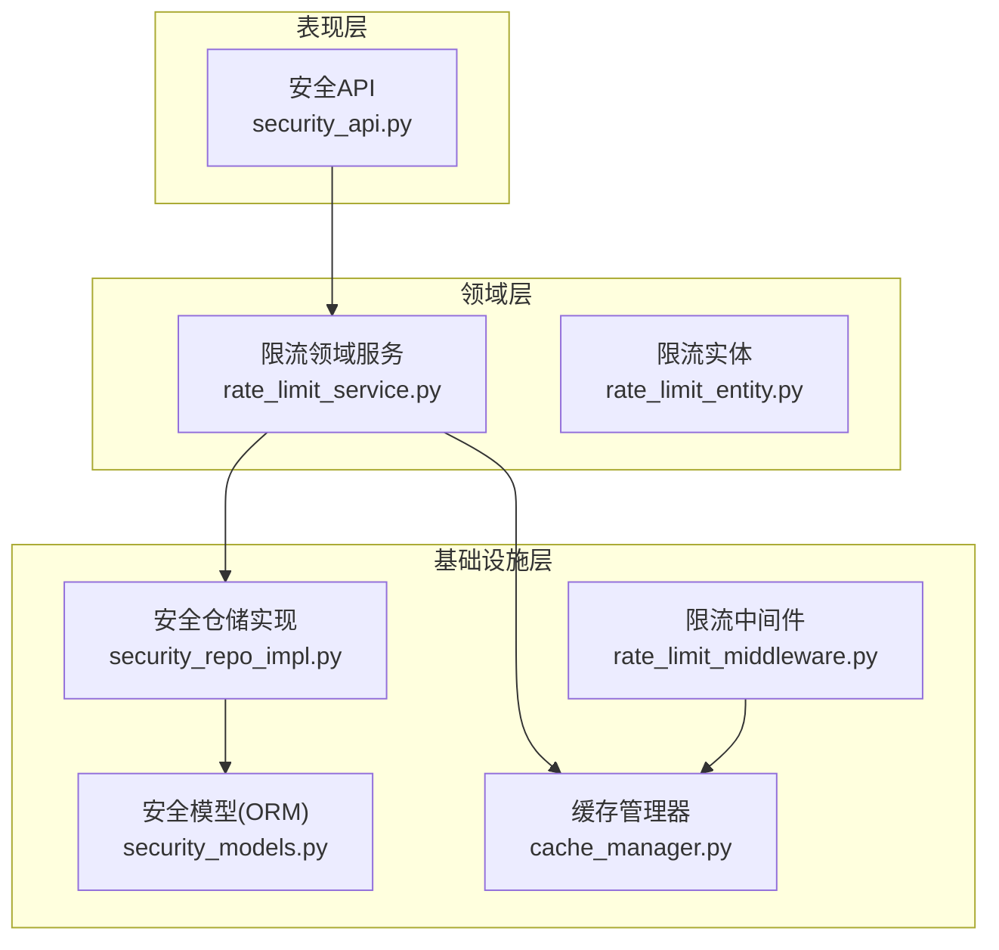
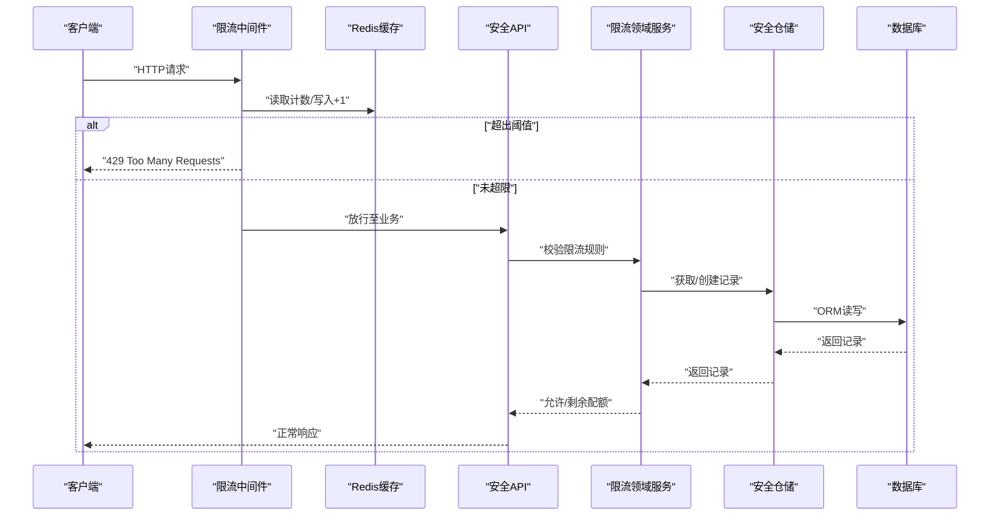
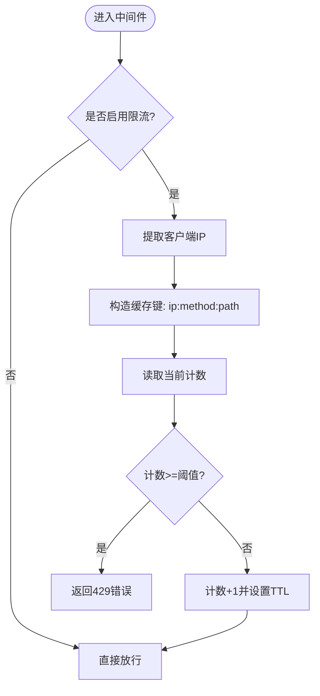
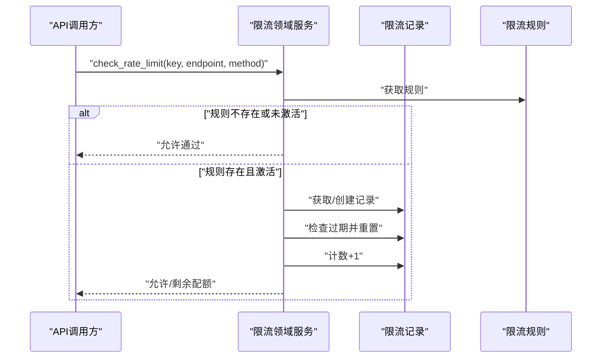
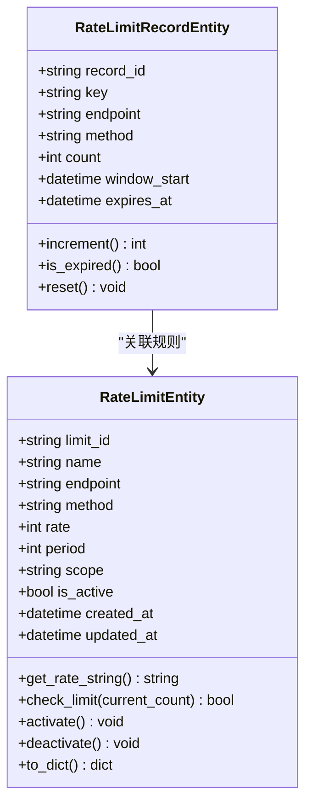
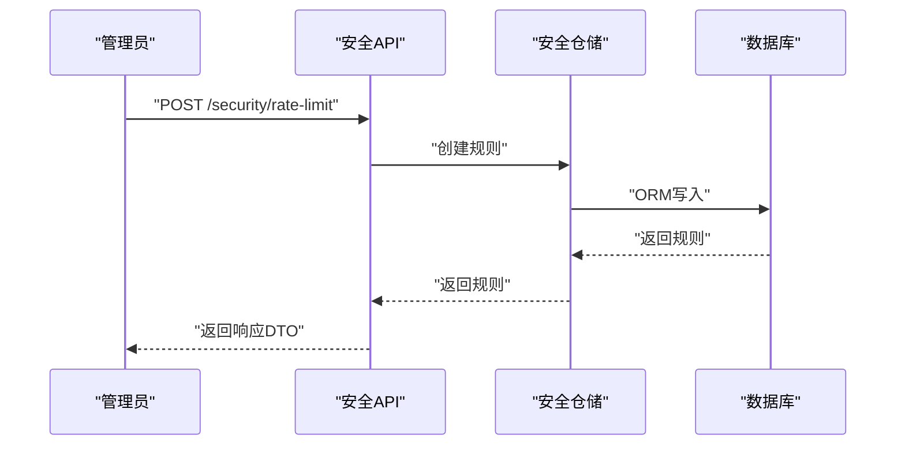
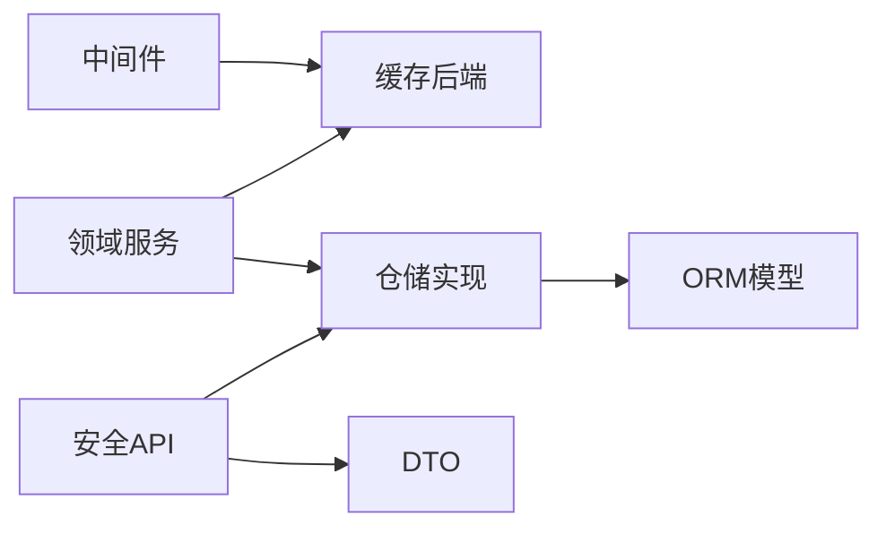

# 限流中间件

<cite>
**本文档引用的文件**
- [src/core/middlewares/rate_limit_middleware.py](file://src/core/middlewares/rate_limit_middleware.py)
- [src/domain/security/services/rate_limit_service.py](file://src/domain/security/services/rate_limit_service.py)
- [src/domain/security/entities/rate_limit_entity.py](file://src/domain/security/entities/rate_limit_entity.py)
- [src/application/dto/security/rate_limit_rule_dto.py](file://src/application/dto/security/rate_limit_rule_dto.py)
- [src/application/dto/security/rate_limit_status_dto.py](file://src/application/dto/security/rate_limit_status_dto.py)
- [src/api/v1/security_api.py](file://src/api/v1/security_api.py)
- [src/infrastructure/persistence/models/security_models.py](file://src/infrastructure/persistence/models/security_models.py)
- [src/infrastructure/repositories/security_repo_impl.py](file://src/infrastructure/repositories/security_repo_impl.py)
- [config/settings/base.py](file://config/settings/base.py)
- [src/core/exceptions/rate_limit_error.py](file://src/core/exceptions/rate_limit_error.py)
- [src/infrastructure/cache/cache_manager.py](file://src/infrastructure/cache/cache_manager.py)
- [tests/test_middlewares/test_rate_limit_middleware.py](file://tests/test_middlewares/test_rate_limit_middleware.py)
</cite>

## 目录
1. [简介](#简介)
2. [项目结构](#项目结构)
3. [核心组件](#核心组件)
4. [架构总览](#架构总览)
5. [详细组件分析](#详细组件分析)
6. [依赖分析](#依赖分析)
7. [性能考虑](#性能考虑)
8. [故障排除指南](#故障排除指南)
9. [结论](#结论)
10. [附录](#附录)

## 简介
本文件系统性阐述本项目的限流中间件与配套能力，覆盖以下方面：
- 工作原理与算法选择：对比令牌桶与漏桶，结合代码现状给出可落地的实现建议与取舍依据
- 限流规则配置：时间窗口、请求频率、IP/用户/全局维度的配置方法与最佳实践
- 限流策略示例：基于现有实体、DTO、仓储与API的组合使用方式
- 监控与统计：如何获取限流状态、剩余配额与重置时间
- 性能影响与调优：缓存、并发、Redis等对限流性能的影响与优化建议
- 常见场景与排障：典型限流场景、常见问题定位与修复

## 项目结构
限流相关能力横跨三层：
- 表现层：安全API路由，提供限流规则的增删改查与状态查询
- 领域层：限流领域服务，封装规则校验、计数与窗口管理
- 基础设施层：ORM模型、仓储实现、缓存与中间件

图表来源
- [src/api/v1/security_api.py:158-285](file://src/api/v1/security_api.py#L158-L285)
- [src/domain/security/services/rate_limit_service.py:11-126](file://src/domain/security/services/rate_limit_service.py#L11-L126)
- [src/domain/security/entities/rate_limit_entity.py:11-106](file://src/domain/security/entities/rate_limit_entity.py#L11-L106)
- [src/infrastructure/repositories/security_repo_impl.py:21-260](file://src/infrastructure/repositories/security_repo_impl.py#L21-L260)
- [src/infrastructure/persistence/models/security_models.py:82-162](file://src/infrastructure/persistence/models/security_models.py#L82-L162)
- [src/infrastructure/cache/cache_manager.py:16-149](file://src/infrastructure/cache/cache_manager.py#L16-L149)
- [src/core/middlewares/rate_limit_middleware.py:15-112](file://src/core/middlewares/rate_limit_middleware.py#L15-L112)

章节来源
- [src/api/v1/security_api.py:158-285](file://src/api/v1/security_api.py#L158-L285)
- [src/domain/security/services/rate_limit_service.py:11-126](file://src/domain/security/services/rate_limit_service.py#L11-L126)
- [src/domain/security/entities/rate_limit_entity.py:11-106](file://src/domain/security/entities/rate_limit_entity.py#L11-L106)
- [src/infrastructure/repositories/security_repo_impl.py:21-260](file://src/infrastructure/repositories/security_repo_impl.py#L21-L260)
- [src/infrastructure/persistence/models/security_models.py:82-162](file://src/infrastructure/persistence/models/security_models.py#L82-L162)
- [src/infrastructure/cache/cache_manager.py:16-149](file://src/infrastructure/cache/cache_manager.py#L16-L149)
- [src/core/middlewares/rate_limit_middleware.py:15-112](file://src/core/middlewares/rate_limit_middleware.py#L15-L112)

## 核心组件
- 限流中间件：基于IP的简单计数限流，使用Redis缓存进行计数与过期控制
- 限流领域服务：支持按端点/方法/作用域（IP/用户/全局）的精细化限流，维护内存中的计数窗口与剩余配额
- 限流实体：定义规则与记录的数据结构，包含速率、周期、作用域、有效期等
- 安全API：提供限流规则的创建、启停、删除与列表查询，以及安全状态概览
- 仓储与模型：持久化限流规则与记录，支持异步ORM操作
- 缓存管理器：统一缓存键命名与序列化，便于扩展其他缓存场景
- 异常与配置：限流异常类型与全局开关、默认限流配置

章节来源
- [src/core/middlewares/rate_limit_middleware.py:15-112](file://src/core/middlewares/rate_limit_middleware.py#L15-L112)
- [src/domain/security/services/rate_limit_service.py:11-126](file://src/domain/security/services/rate_limit_service.py#L11-L126)
- [src/domain/security/entities/rate_limit_entity.py:11-106](file://src/domain/security/entities/rate_limit_entity.py#L11-L106)
- [src/api/v1/security_api.py:158-285](file://src/api/v1/security_api.py#L158-L285)
- [src/infrastructure/repositories/security_repo_impl.py:21-260](file://src/infrastructure/repositories/security_repo_impl.py#L21-L260)
- [src/infrastructure/persistence/models/security_models.py:82-162](file://src/infrastructure/persistence/models/security_models.py#L82-L162)
- [src/infrastructure/cache/cache_manager.py:16-149](file://src/infrastructure/cache/cache_manager.py#L16-L149)
- [src/core/exceptions/rate_limit_error.py:9-26](file://src/core/exceptions/rate_limit_error.py#L9-L26)
- [config/settings/base.py:228-231](file://config/settings/base.py#L228-L231)

## 架构总览
限流方案由“中间件快速拦截 + 领域服务精细控制”双层构成：
- 中间件层：快速判断与短路，降低后续处理开销
- 领域服务层：基于规则与记录的精确计数与窗口管理，支持用户/全局维度

图表来源
- [src/core/middlewares/rate_limit_middleware.py:41-112](file://src/core/middlewares/rate_limit_middleware.py#L41-L112)
- [src/domain/security/services/rate_limit_service.py:50-105](file://src/domain/security/services/rate_limit_service.py#L50-L105)
- [src/infrastructure/repositories/security_repo_impl.py:162-203](file://src/infrastructure/repositories/security_repo_impl.py#L162-L203)
- [src/infrastructure/persistence/models/security_models.py:138-162](file://src/infrastructure/persistence/models/security_models.py#L138-L162)

## 详细组件分析

### 限流中间件（基于IP的快速限流）
- 功能要点
  - 读取配置开关与默认限流规则
  - 从请求头提取真实IP（支持代理链）
  - 使用Redis缓存进行计数与过期控制
  - 超限时返回标准错误响应
- 算法与实现
  - 当前实现采用“固定窗口 + 计数器”的简化策略，键格式包含IP、方法与路径
  - 通过缓存的TTL实现窗口过期，计数器自增
- 可扩展性
  - 可替换为令牌桶/漏桶以平滑突发流量
  - 可引入用户维度与全局维度的键空间隔离

图表来源
- [src/core/middlewares/rate_limit_middleware.py:41-112](file://src/core/middlewares/rate_limit_middleware.py#L41-L112)

章节来源
- [src/core/middlewares/rate_limit_middleware.py:15-112](file://src/core/middlewares/rate_limit_middleware.py#L15-L112)
- [config/settings/base.py:228-231](file://config/settings/base.py#L228-L231)

### 限流领域服务（精细化限流）
- 功能要点
  - 支持按端点、方法、作用域（ip/user/global）的规则管理
  - 内存中维护计数窗口与到期重置逻辑
  - 提供限流检查、剩余配额查询与规则启停
- 关键流程
  - 规则查找与激活状态判断
  - 记录过期检测与重置
  - 计数递增与阈值比较
  - 返回允许状态与剩余配额

图表来源
- [src/domain/security/services/rate_limit_service.py:50-105](file://src/domain/security/services/rate_limit_service.py#L50-L105)
- [src/domain/security/entities/rate_limit_entity.py:77-106](file://src/domain/security/entities/rate_limit_entity.py#L77-L106)

章节来源
- [src/domain/security/services/rate_limit_service.py:11-126](file://src/domain/security/services/rate_limit_service.py#L11-L126)
- [src/domain/security/entities/rate_limit_entity.py:11-106](file://src/domain/security/entities/rate_limit_entity.py#L11-L106)

### 限流实体（规则与记录）
- 规则实体
  - 字段：ID、名称、端点、方法、速率、周期、作用域、激活状态、描述、时间戳
  - 校验：名称、端点、速率、周期必须有效
  - 工具：速率字符串格式化、激活/停用、序列化
- 记录实体
  - 字段：键、端点、方法、计数、窗口起始时间、过期时间
  - 方法：计数递增、过期检查、重置

图表来源
- [src/domain/security/entities/rate_limit_entity.py:11-106](file://src/domain/security/entities/rate_limit_entity.py#L11-L106)

章节来源
- [src/domain/security/entities/rate_limit_entity.py:11-106](file://src/domain/security/entities/rate_limit_entity.py#L11-L106)

### 安全API（规则管理与状态）
- 接口能力
  - 创建限流规则：名称、端点、方法、速率、周期、作用域、描述
  - 切换规则状态：启用/禁用
  - 删除规则
  - 列出规则
  - 获取安全状态：黑名单/白名单/限流规则数量
- 数据传输对象
  - 规则DTO：包含字段校验与示例
  - 状态DTO：启用状态、限制次数、剩余次数、重置时间

图表来源
- [src/api/v1/security_api.py:161-195](file://src/api/v1/security_api.py#L161-L195)
- [src/infrastructure/repositories/security_repo_impl.py:112-145](file://src/infrastructure/repositories/security_repo_impl.py#L112-L145)
- [src/infrastructure/persistence/models/security_models.py:82-136](file://src/infrastructure/persistence/models/security_models.py#L82-L136)

章节来源
- [src/api/v1/security_api.py:158-285](file://src/api/v1/security_api.py#L158-L285)
- [src/application/dto/security/rate_limit_rule_dto.py:9-36](file://src/application/dto/security/rate_limit_rule_dto.py#L9-L36)
- [src/application/dto/security/rate_limit_status_dto.py:9-16](file://src/application/dto/security/rate_limit_status_dto.py#L9-L16)

### 仓储与模型（持久化）
- 限流规则模型
  - 唯一约束：端点+方法
  - 作用域枚举：ip/user/global
  - 速率字符串格式化
- 限流记录模型
  - 复合索引：key + endpoint + method
  - 过期时间与窗口起始时间

章节来源
- [src/infrastructure/persistence/models/security_models.py:82-162](file://src/infrastructure/persistence/models/security_models.py#L82-L162)
- [src/infrastructure/repositories/security_repo_impl.py:162-203](file://src/infrastructure/repositories/security_repo_impl.py#L162-L203)

### 缓存与配置
- 缓存管理器
  - 统一键前缀与分组
  - JSON序列化与反序列化
  - 用户缓存、权限缓存等专用方法
- 全局配置
  - 开关：RATE_LIMIT_ENABLED
  - 默认规则：RATE_LIMIT_DEFAULT
  - Redis缓存后端

章节来源
- [src/infrastructure/cache/cache_manager.py:16-149](file://src/infrastructure/cache/cache_manager.py#L16-L149)
- [config/settings/base.py:228-231](file://config/settings/base.py#L228-L231)
- [config/settings/base.py:158-163](file://config/settings/base.py#L158-L163)

## 依赖分析
- 中间件依赖缓存后端（Redis），用于快速计数与过期控制
- 领域服务依赖仓储实现，仓储依赖ORM模型
- API层依赖DTO与仓储，负责规则的增删改查与状态查询
- 异常模块提供统一的限流错误类型

图表来源
- [src/core/middlewares/rate_limit_middleware.py:15-112](file://src/core/middlewares/rate_limit_middleware.py#L15-L112)
- [src/api/v1/security_api.py:158-285](file://src/api/v1/security_api.py#L158-L285)
- [src/domain/security/services/rate_limit_service.py:11-126](file://src/domain/security/services/rate_limit_service.py#L11-L126)
- [src/infrastructure/repositories/security_repo_impl.py:21-260](file://src/infrastructure/repositories/security_repo_impl.py#L21-L260)

章节来源
- [src/core/middlewares/rate_limit_middleware.py:15-112](file://src/core/middlewares/rate_limit_middleware.py#L15-L112)
- [src/domain/security/services/rate_limit_service.py:11-126](file://src/domain/security/services/rate_limit_service.py#L11-L126)
- [src/infrastructure/repositories/security_repo_impl.py:21-260](file://src/infrastructure/repositories/security_repo_impl.py#L21-L260)

## 性能考虑
- 缓存命中与热点键
  - 固定窗口计数在边界处可能出现“双倍”突发，建议引入令牌桶或漏桶
  - 对高并发场景，建议将键拆分为更细粒度（如按端点/方法/IP），避免热点
- Redis性能
  - 使用pipeline批量操作可减少RTT
  - TTL设置需与业务峰值吞吐匹配，避免频繁过期与重建
- 中间件短路
  - 中间件应尽量轻量，避免阻塞后续处理
- 内存记录与持久化
  - 领域服务的内存记录适合低延迟场景；若需要跨实例共享，应优先依赖Redis或数据库

[本节为通用性能指导，不直接分析具体文件]

## 故障排除指南
- 429错误频繁出现
  - 检查全局开关与默认限流配置
  - 核对Redis连接与可用性
  - 确认规则是否正确下发与激活
- 白名单/黑名单未生效
  - 确认白名单/黑名单功能开关
  - 检查IP提取逻辑与代理头
- 单元测试参考
  - 测试用例覆盖了“在限内”“超限”“白名单跳过”等场景，可据此定位问题

章节来源
- [tests/test_middlewares/test_rate_limit_middleware.py:33-76](file://tests/test_middlewares/test_rate_limit_middleware.py#L33-L76)
- [config/settings/base.py:228-231](file://config/settings/base.py#L228-L231)

## 结论
本项目提供了两套限流能力：
- 中间件层：基于Redis的快速固定窗口计数，适合粗粒度的IP级限流
- 领域服务层：基于规则与记录的精细化限流，支持端点、方法与作用域的灵活配置

建议在生产环境中：
- 优先使用领域服务的精细化规则，配合中间件进行快速拦截
- 在高并发场景引入令牌桶/漏桶算法，平滑突发流量
- 合理设置Redis TTL与键空间，避免热点与过期风暴
- 通过API完善限流策略的动态调整与可观测性

[本节为总结性内容，不直接分析具体文件]

## 附录

### 限流算法选择依据
- 固定窗口（当前中间件实现）
  - 优点：实现简单、性能高
  - 缺点：边界处可能突发翻倍
  - 适用：对突发容忍度较高、实现成本优先的场景
- 令牌桶
  - 优点：平滑突发、可配置突发容量
  - 适用：对外暴露的公共API、需要削峰填谷的场景
- 漏桶
  - 优点：恒定输出速率，天然削峰
  - 适用：需要严格控制平均速率的场景

[本节为概念性说明，不直接分析具体文件]

### 限流规则配置方法
- 时间窗口与频率
  - 速率：单位时间内允许的请求数
  - 周期：时间窗口长度（秒）
- 维度区分
  - IP维度：基于客户端IP
  - 用户维度：基于认证用户ID
  - 全局维度：全局统一限额
- 配置示例（基于现有DTO）
  - 名称、端点、方法、速率、周期、作用域、描述
  - 通过安全API创建规则，或在初始化时加载预设规则

章节来源
- [src/application/dto/security/rate_limit_rule_dto.py:9-36](file://src/application/dto/security/rate_limit_rule_dto.py#L9-L36)
- [src/api/v1/security_api.py:161-195](file://src/api/v1/security_api.py#L161-L195)

### 限流状态监控与统计
- 获取限流状态
  - 领域服务提供限流信息查询，返回启用状态、限制次数、剩余次数、重置时间
- API状态概览
  - 安全API提供安全状态接口，返回黑名单/白名单/限流规则数量

章节来源
- [src/domain/security/services/rate_limit_service.py:84-105](file://src/domain/security/services/rate_limit_service.py#L84-L105)
- [src/application/dto/security/rate_limit_status_dto.py:9-16](file://src/application/dto/security/rate_limit_status_dto.py#L9-L16)
- [src/api/v1/security_api.py:267-284](file://src/api/v1/security_api.py#L267-L284)

### 常见限流场景与最佳实践
- 登录接口
  - 建议：IP维度，较低速率（如每分钟10次），周期较短
- 列表查询
  - 建议：端点维度，中等速率（如每分钟60次），避免被刷
- 文件上传/下载
  - 建议：用户维度或全局维度，结合带宽与资源限制
- 批量操作
  - 建议：用户维度，较低速率，防止滥用

[本节为通用实践建议，不直接分析具体文件]