# IP 管理

<cite>
**本文档引用的文件**
- [src/core/middlewares/ip_limit_middleware.py](file://src/core/middlewares/ip_limit_middleware.py)
- [src/domain/security/entities/ip_blacklist_entity.py](file://src/domain/security/entities/ip_blacklist_entity.py)
- [src/domain/security/entities/ip_whitelist_entity.py](file://src/domain/security/entities/ip_whitelist_entity.py)
- [src/application/services/security_service.py](file://src/application/services/security_service.py)
- [src/infrastructure/repositories/security_repo_impl.py](file://src/infrastructure/repositories/security_repo_impl.py)
- [src/infrastructure/persistence/models/security_models.py](file://src/infrastructure/persistence/models/security_models.py)
- [src/domain/security/entities/rate_limit_entity.py](file://src/domain/security/entities/rate_limit_entity.py)
- [src/api/v1/controllers/security_controller.py](file://src/api/v1/controllers/security_controller.py)
- [src/api/v1/security_api.py](file://src/api/v1/security_api.py)
- [config/settings/base.py](file://config/settings/base.py)
- [src/application/dto/security/ip_blacklist_dto.py](file://src/application/dto/security/ip_blacklist_dto.py)
- [src/application/dto/security/ip_whitelist_dto.py](file://src/application/dto/security/ip_whitelist_dto.py)
- [src/core/exceptions/ip_blocked_error.py](file://src/core/exceptions/ip_blocked_error.py)
- [src/domain/security/repositories/security_repository.py](file://src/domain/security/repositories/security_repository.py)
</cite>

## 目录
1. [引言](#引言)
2. [项目结构](#项目结构)
3. [核心组件](#核心组件)
4. [架构总览](#架构总览)
5. [详细组件分析](#详细组件分析)
6. [依赖分析](#依赖分析)
7. [性能考量](#性能考量)
8. [故障排查指南](#故障排查指南)
9. [结论](#结论)
10. [附录](#附录)

## 引言
本文件面向“IP 管理”子系统，系统性阐述基于 Django + Django Ninja 的 IP 黑名单与白名单中间件设计、实体模型、仓储实现、API 控制器、配置策略、安全考量、监控与审计以及常见攻击防护策略。文档同时覆盖限流规则与记录的实体与仓储，便于统一理解安全防护体系。

## 项目结构
IP 管理相关代码分布在以下层次：
- 中介层：IPLimitMiddleware 负责请求阶段的 IP 白名单/黑名单判定
- 应用层：SecurityService 提供业务编排与 DTO 转换
- 领域层：IP 黑名单/白名单实体与限流实体定义业务规则
- 基础设施层：ORM 模型与仓储实现负责持久化与查询
- 接口层：Ninja 控制器与路由暴露管理 API
- 配置层：settings 中的黑白名单开关与限流开关

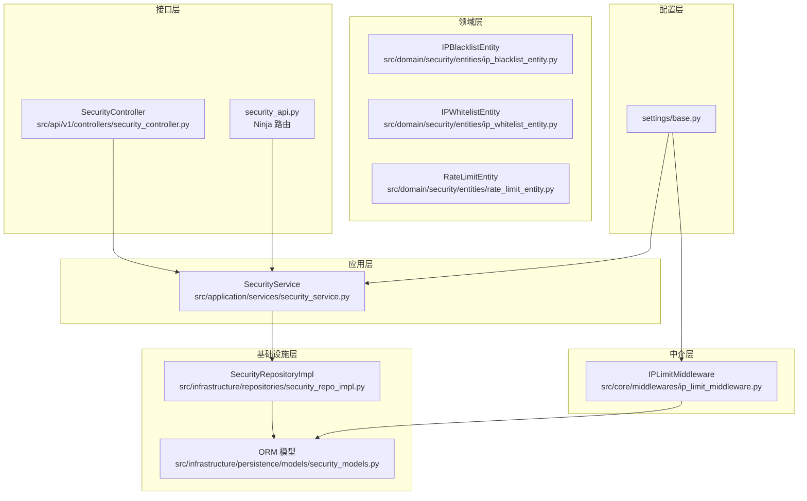

**图表来源**
- [src/api/v1/controllers/security_controller.py:21-302](file://src/api/v1/controllers/security_controller.py#L21-L302)
- [src/api/v1/security_api.py:1-285](file://src/api/v1/security_api.py#L1-L285)
- [src/application/services/security_service.py:24-225](file://src/application/services/security_service.py#L24-L225)
- [src/infrastructure/repositories/security_repo_impl.py:21-260](file://src/infrastructure/repositories/security_repo_impl.py#L21-L260)
- [src/infrastructure/persistence/models/security_models.py:13-162](file://src/infrastructure/persistence/models/security_models.py#L13-L162)
- [src/core/middlewares/ip_limit_middleware.py:15-130](file://src/core/middlewares/ip_limit_middleware.py#L15-L130)
- [config/settings/base.py:232-235](file://config/settings/base.py#L232-L235)

**章节来源**
- [src/core/middlewares/ip_limit_middleware.py:15-130](file://src/core/middlewares/ip_limit_middleware.py#L15-L130)
- [src/application/services/security_service.py:24-225](file://src/application/services/security_service.py#L24-L225)
- [src/infrastructure/repositories/security_repo_impl.py:21-260](file://src/infrastructure/repositories/security_repo_impl.py#L21-L260)
- [src/infrastructure/persistence/models/security_models.py:13-162](file://src/infrastructure/persistence/models/security_models.py#L13-L162)
- [src/api/v1/controllers/security_controller.py:21-302](file://src/api/v1/controllers/security_controller.py#L21-L302)
- [src/api/v1/security_api.py:1-285](file://src/api/v1/security_api.py#L1-L285)
- [config/settings/base.py:232-235](file://config/settings/base.py#L232-L235)

## 核心组件
- IP 限制中间件：在请求进入阶段根据配置与数据库中的黑白名单进行拦截或放行
- 安全服务：封装业务逻辑，协调 DTO、实体与仓储
- 仓储实现：提供异步 CRUD 与查询能力，屏蔽 ORM 细节
- ORM 模型：定义 IP 黑名单、白名单与限流规则/记录的表结构与索引
- 实体模型：定义 IP 黑名单/白名单与限流规则的业务行为与校验
- 控制器与路由：对外暴露管理接口，支持新增、删除、查询与状态查看

**章节来源**
- [src/core/middlewares/ip_limit_middleware.py:15-130](file://src/core/middlewares/ip_limit_middleware.py#L15-L130)
- [src/application/services/security_service.py:24-225](file://src/application/services/security_service.py#L24-L225)
- [src/infrastructure/repositories/security_repo_impl.py:21-260](file://src/infrastructure/repositories/security_repo_impl.py#L21-L260)
- [src/infrastructure/persistence/models/security_models.py:13-162](file://src/infrastructure/persistence/models/security_models.py#L13-L162)
- [src/domain/security/entities/ip_blacklist_entity.py:11-53](file://src/domain/security/entities/ip_blacklist_entity.py#L11-L53)
- [src/domain/security/entities/ip_whitelist_entity.py:11-47](file://src/domain/security/entities/ip_whitelist_entity.py#L11-L47)
- [src/domain/security/entities/rate_limit_entity.py:11-106](file://src/domain/security/entities/rate_limit_entity.py#L11-L106)
- [src/api/v1/controllers/security_controller.py:21-302](file://src/api/v1/controllers/security_controller.py#L21-L302)
- [src/api/v1/security_api.py:1-285](file://src/api/v1/security_api.py#L1-L285)

## 架构总览
IP 管理采用分层架构，请求经由中间件与限流中间件后进入控制器，控制器调用应用服务，应用服务通过仓储访问 ORM 模型完成持久化与查询；同时，中间件在请求生命周期内执行 IP 白名单/黑名单判定。

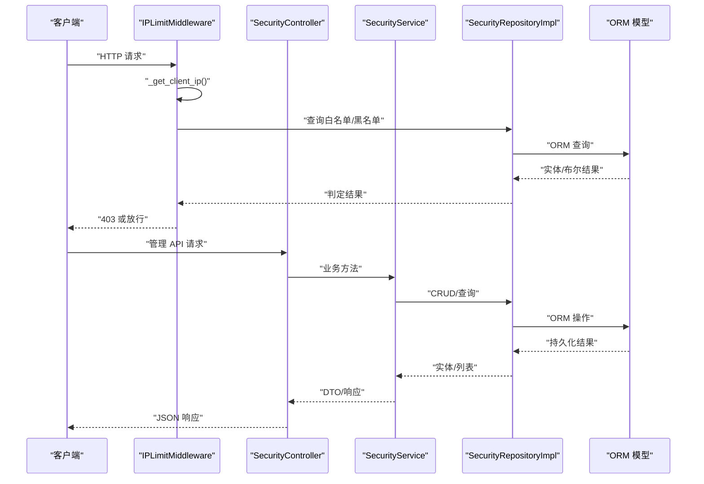

**图表来源**
- [src/core/middlewares/ip_limit_middleware.py:41-76](file://src/core/middlewares/ip_limit_middleware.py#L41-L76)
- [src/infrastructure/repositories/security_repo_impl.py:46-108](file://src/infrastructure/repositories/security_repo_impl.py#L46-L108)
- [src/infrastructure/persistence/models/security_models.py:13-80](file://src/infrastructure/persistence/models/security_models.py#L13-L80)
- [src/api/v1/controllers/security_controller.py:49-185](file://src/api/v1/controllers/security_controller.py#L49-L185)
- [src/application/services/security_service.py:35-100](file://src/application/services/security_service.py#L35-L100)

## 详细组件分析

### IP 限制中间件（IPLimitMiddleware）
- 职责：在请求进入阶段根据配置决定是否启用白名单/黑名单模式，并据此放行或返回 403
- IP 解析：优先读取代理头，回退至 REMOTE_ADDR
- 白名单模式：仅允许白名单内的 IP 访问
- 黑名单模式：对黑名单内的 IP（含永久与临时）直接拒绝
- 配置项：IP_BLACKLIST_ENABLED、IP_WHITELIST_ENABLED

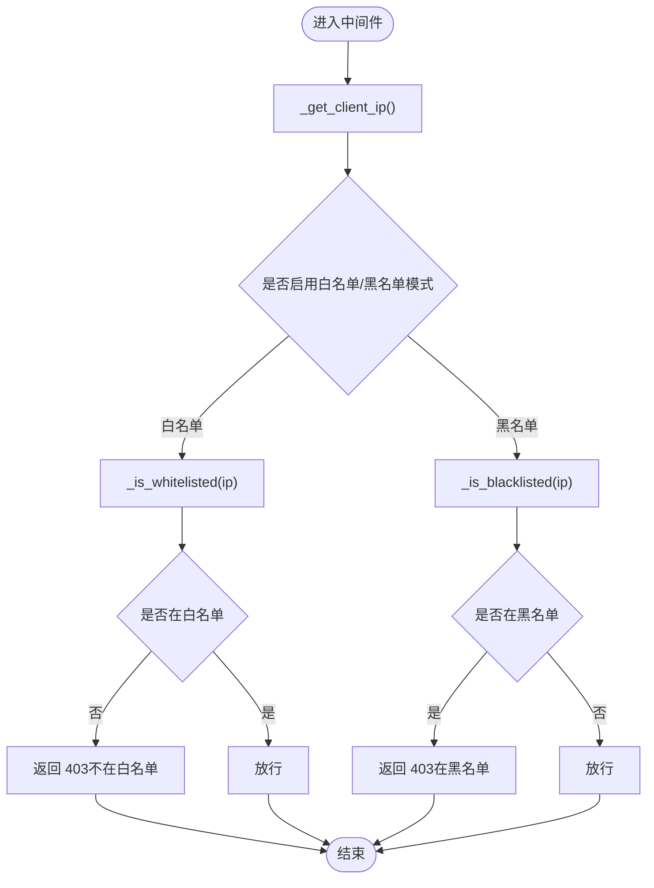

**图表来源**
- [src/core/middlewares/ip_limit_middleware.py:41-76](file://src/core/middlewares/ip_limit_middleware.py#L41-L76)
- [src/core/middlewares/ip_limit_middleware.py:78-130](file://src/core/middlewares/ip_limit_middleware.py#L78-L130)

**章节来源**
- [src/core/middlewares/ip_limit_middleware.py:15-130](file://src/core/middlewares/ip_limit_middleware.py#L15-L130)
- [config/settings/base.py:232-235](file://config/settings/base.py#L232-L235)

### IP 黑名单实体（IPBlacklistEntity）
- 字段：标识、IP 地址、原因、是否永久、过期时间、创建时间、创建人
- 行为：校验必填、判断封禁是否生效、解除封禁、序列化
- 业务规则：永久封禁优先于过期时间；未过期即生效

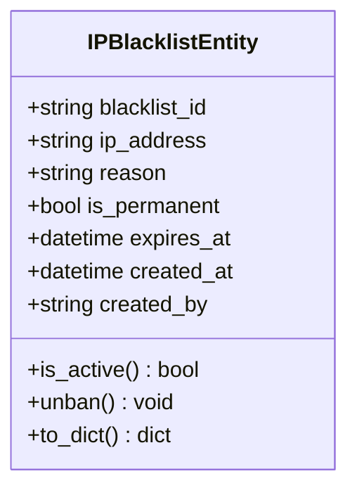

**图表来源**
- [src/domain/security/entities/ip_blacklist_entity.py:11-53](file://src/domain/security/entities/ip_blacklist_entity.py#L11-L53)

**章节来源**
- [src/domain/security/entities/ip_blacklist_entity.py:11-53](file://src/domain/security/entities/ip_blacklist_entity.py#L11-L53)

### IP 白名单实体（IPWhitelistEntity）
- 字段：标识、IP 地址、描述、是否激活、创建时间、创建人
- 行为：停用/激活、序列化
- 业务规则：仅激活状态有效

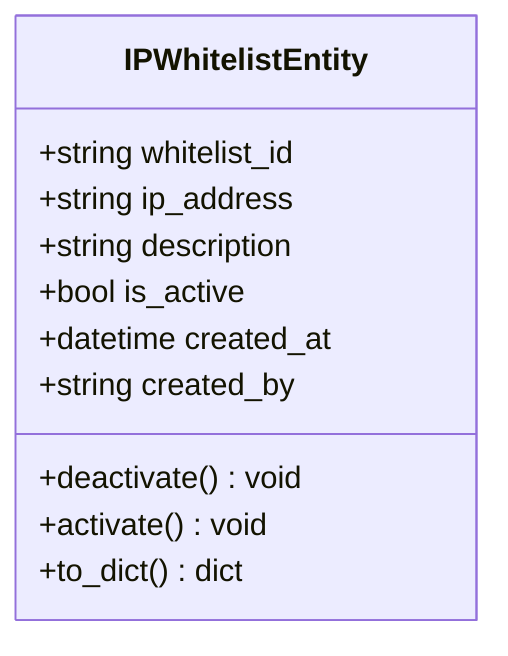

**图表来源**
- [src/domain/security/entities/ip_whitelist_entity.py:11-47](file://src/domain/security/entities/ip_whitelist_entity.py#L11-L47)

**章节来源**
- [src/domain/security/entities/ip_whitelist_entity.py:11-47](file://src/domain/security/entities/ip_whitelist_entity.py#L11-L47)

### 安全服务（SecurityService）
- 职责：封装业务逻辑，协调 DTO、实体与仓储
- 黑名单：新增前检查重复、保存后转换响应 DTO
- 白名单：新增前检查重复、保存后转换响应 DTO
- 限流：创建规则前检查唯一性、切换状态、删除、查询列表、计算剩余配额
- 安全状态：统计黑白名单与活跃限流规则数量

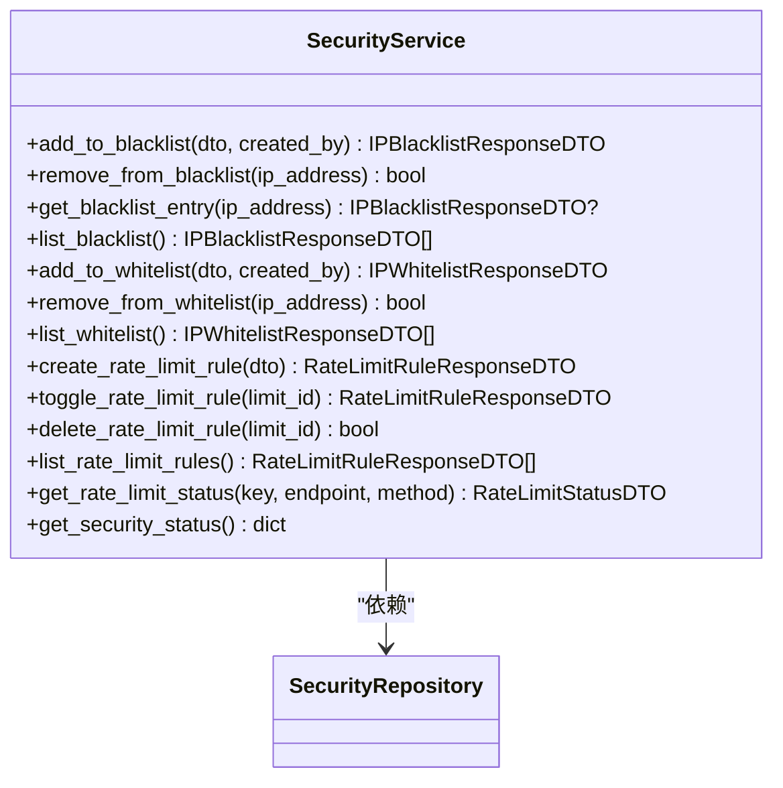

**图表来源**
- [src/application/services/security_service.py:24-225](file://src/application/services/security_service.py#L24-L225)
- [src/domain/security/repositories/security_repository.py:13-118](file://src/domain/security/repositories/security_repository.py#L13-L118)

**章节来源**
- [src/application/services/security_service.py:24-225](file://src/application/services/security_service.py#L24-L225)
- [src/domain/security/repositories/security_repository.py:13-118](file://src/domain/security/repositories/security_repository.py#L13-L118)

### 仓储实现（SecurityRepositoryImpl）
- 职责：实现 SecurityRepository 接口，提供异步 CRUD 与查询
- 黑名单：新增、删除、按 IP 查询、判断是否封禁、列出（可排除过期）
- 白名单：新增、删除、按 IP 查询、判断是否在白名单、列出（可包含未激活）
- 限流：创建规则、按端点+方法查询、更新、删除、列出、获取或创建记录、递增计数、重置记录

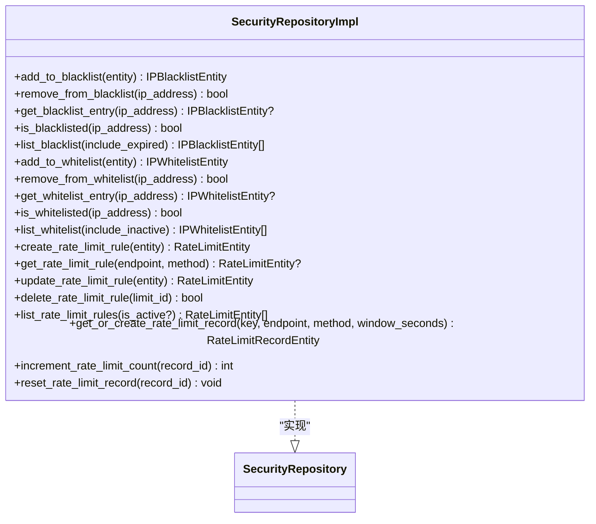

**图表来源**
- [src/infrastructure/repositories/security_repo_impl.py:21-260](file://src/infrastructure/repositories/security_repo_impl.py#L21-L260)
- [src/domain/security/repositories/security_repository.py:13-118](file://src/domain/security/repositories/security_repository.py#L13-L118)

**章节来源**
- [src/infrastructure/repositories/security_repo_impl.py:21-260](file://src/infrastructure/repositories/security_repo_impl.py#L21-L260)
- [src/domain/security/repositories/security_repository.py:13-118](file://src/domain/security/repositories/security_repository.py#L13-L118)

### ORM 模型（IPBlacklist/IPWhitelist/RateLimitRule/RateLimitRecord）
- IPBlacklist：UUID 主键、唯一 IP、原因、是否永久、过期时间、创建者外键
- IPWhitelist：UUID 主键、唯一 IP、描述、是否激活、创建者外键
- RateLimitRule：端点+方法唯一、速率、周期、作用域、是否激活
- RateLimitRecord：限流键+端点+方法复合索引、计数、窗口起始与过期时间

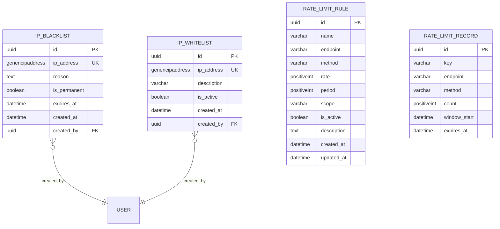

**图表来源**
- [src/infrastructure/persistence/models/security_models.py:13-162](file://src/infrastructure/persistence/models/security_models.py#L13-L162)

**章节来源**
- [src/infrastructure/persistence/models/security_models.py:13-162](file://src/infrastructure/persistence/models/security_models.py#L13-L162)

### 限流实体（RateLimitEntity/RateLimitRecordEntity）
- RateLimitEntity：规则名称、端点、方法、速率、周期、作用域、是否激活、描述、时间戳
- RateLimitRecordEntity：限流键、端点、方法、计数、窗口起始、过期时间
- 行为：生成限流字符串、检查是否超限、激活/停用、序列化、递增计数、判断过期、重置

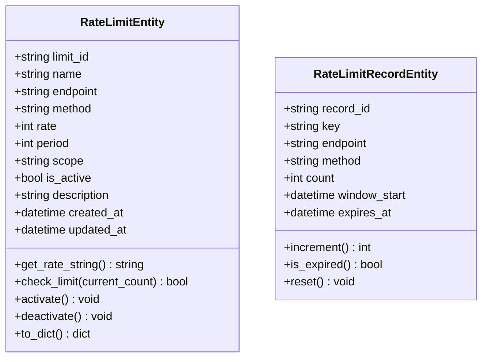

**图表来源**
- [src/domain/security/entities/rate_limit_entity.py:11-106](file://src/domain/security/entities/rate_limit_entity.py#L11-L106)

**章节来源**
- [src/domain/security/entities/rate_limit_entity.py:11-106](file://src/domain/security/entities/rate_limit_entity.py#L11-L106)

### 控制器与 API（SecurityController/security_api）
- 黑名单：新增、删除、列表查询
- 白名单：新增、删除、列表查询
- 限流：创建、切换状态、删除、列表查询
- 安全状态：统计黑白名单与活跃限流规则数量

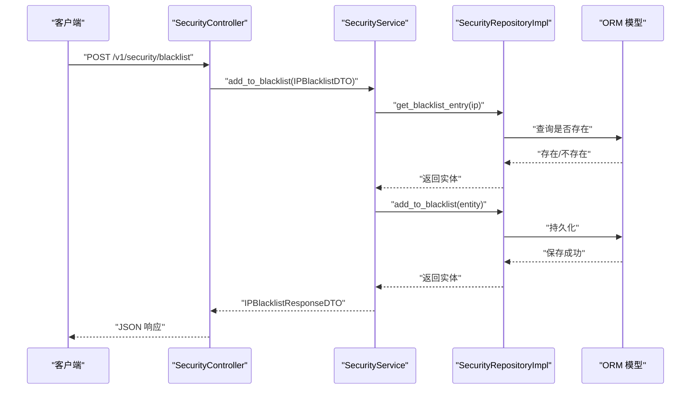

**图表来源**
- [src/api/v1/controllers/security_controller.py:43-68](file://src/api/v1/controllers/security_controller.py#L43-L68)
- [src/application/services/security_service.py:35-54](file://src/application/services/security_service.py#L35-L54)
- [src/infrastructure/repositories/security_repo_impl.py:29-39](file://src/infrastructure/repositories/security_repo_impl.py#L29-L39)
- [src/infrastructure/persistence/models/security_models.py:13-50](file://src/infrastructure/persistence/models/security_models.py#L13-L50)

**章节来源**
- [src/api/v1/controllers/security_controller.py:21-302](file://src/api/v1/controllers/security_controller.py#L21-L302)
- [src/api/v1/security_api.py:1-285](file://src/api/v1/security_api.py#L1-L285)

## 依赖分析
- 中介层依赖配置项与仓储/模型
- 应用服务依赖 DTO、实体与仓储接口
- 仓储实现依赖 ORM 模型
- 控制器依赖应用服务
- 领域实体与 DTO 之间通过服务层转换

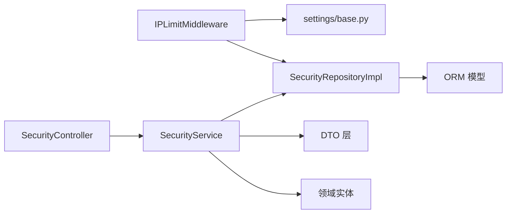

**图表来源**
- [src/core/middlewares/ip_limit_middleware.py:30-39](file://src/core/middlewares/ip_limit_middleware.py#L30-L39)
- [config/settings/base.py:232-235](file://config/settings/base.py#L232-L235)
- [src/application/services/security_service.py:24-32](file://src/application/services/security_service.py#L24-L32)
- [src/infrastructure/repositories/security_repo_impl.py:21-260](file://src/infrastructure/repositories/security_repo_impl.py#L21-L260)
- [src/infrastructure/persistence/models/security_models.py:13-162](file://src/infrastructure/persistence/models/security_models.py#L13-L162)

**章节来源**
- [src/core/middlewares/ip_limit_middleware.py:15-130](file://src/core/middlewares/ip_limit_middleware.py#L15-L130)
- [src/application/services/security_service.py:24-225](file://src/application/services/security_service.py#L24-L225)
- [src/infrastructure/repositories/security_repo_impl.py:21-260](file://src/infrastructure/repositories/security_repo_impl.py#L21-L260)
- [src/infrastructure/persistence/models/security_models.py:13-162](file://src/infrastructure/persistence/models/security_models.py#L13-L162)

## 性能考量
- 查询优化：IP 黑名单与白名单均使用唯一索引与数据库索引，降低查找成本
- 异步访问：仓储方法采用异步 ORM 接口，提升高并发下的吞吐
- 限流窗口：限流记录按键+端点+方法建立复合索引，减少锁竞争
- 缓存建议：结合 Redis 缓存热点 IP 的黑白名单状态，减少数据库压力（需在仓储层扩展）

[本节为通用性能建议，不直接分析具体文件]

## 故障排查指南
- IP 被封禁异常：当 IP 在黑名单中且未过期时触发
- 中间件未生效：确认配置项 IP_BLACKLIST_ENABLED / IP_WHITELIST_ENABLED 是否正确设置
- 白名单/黑名单重复：服务层在新增前会检查重复，避免重复条目
- 限流规则冲突：端点+方法唯一约束，创建前需确保唯一性
- 日志定位：中间件与应用层使用日志记录关键事件，便于审计与排错

**章节来源**
- [src/core/exceptions/ip_blocked_error.py:9-26](file://src/core/exceptions/ip_blocked_error.py#L9-L26)
- [config/settings/base.py:232-235](file://config/settings/base.py#L232-L235)
- [src/application/services/security_service.py:39-42](file://src/application/services/security_service.py#L39-L42)
- [src/infrastructure/persistence/models/security_models.py:126-126](file://src/infrastructure/persistence/models/security_models.py#L126-L126)

## 结论
本 IP 管理子系统通过中间件与应用服务协同，结合实体与仓储实现，提供了完善的 IP 黑名单/白名单与限流能力。配置灵活、扩展性强，适合在生产环境中部署。建议配合缓存与更细粒度的审计日志进一步增强性能与可观测性。

## 附录

### 配置策略
- 黑名单/白名单开关：通过环境变量控制
- 限流开关与默认值：通过环境变量控制
- 示例键名：
  - IP_BLACKLIST_ENABLED
  - IP_WHITELIST_ENABLED
  - RATE_LIMIT_ENABLED
  - RATE_LIMIT_DEFAULT

**章节来源**
- [config/settings/base.py:232-235](file://config/settings/base.py#L232-L235)

### 数据模型字段定义（摘要）
- IPBlacklist：ip_address（唯一）、is_permanent、expires_at、created_by
- IPWhitelist：ip_address（唯一）、is_active、description、created_by
- RateLimitRule：endpoint、method（唯一组合）、rate、period、scope、is_active
- RateLimitRecord：key、endpoint、method、count、window_start、expires_at

**章节来源**
- [src/infrastructure/persistence/models/security_models.py:13-162](file://src/infrastructure/persistence/models/security_models.py#L13-L162)

### 安全考虑与最佳实践
- IP 欺骗防护：中间件优先读取代理头并截断逗号分隔列表的第一个值，避免伪造
- CIDR 网段处理：当前模型为单 IP，若需网段匹配，可在服务层扩展为 CIDR 检查并在仓储层增加范围查询
- IPv6 支持：模型使用 GenericIPAddressField，天然支持 IPv4/IPv6
- 限流策略：按 IP/用户/全局三种作用域灵活配置，结合 Redis 缓存提升性能

**章节来源**
- [src/core/middlewares/ip_limit_middleware.py:78-93](file://src/core/middlewares/ip_limit_middleware.py#L78-L93)
- [src/infrastructure/persistence/models/security_models.py:20-20](file://src/infrastructure/persistence/models/security_models.py#L20-L20)
- [src/domain/security/entities/rate_limit_entity.py:11-106](file://src/domain/security/entities/rate_limit_entity.py#L11-L106)

### 监控与审计
- 中间件日志：对命中白名单/黑名单的 IP 记录警告日志
- 安全状态接口：提供黑名单/白名单/限流规则数量等状态信息
- 建议扩展：在仓储层增加审计记录表，记录每次变更的时间、操作人与上下文

**章节来源**
- [src/core/middlewares/ip_limit_middleware.py:56-56](file://src/core/middlewares/ip_limit_middleware.py#L56-L56)
- [src/api/v1/controllers/security_controller.py:286-302](file://src/api/v1/controllers/security_controller.py#L286-L302)