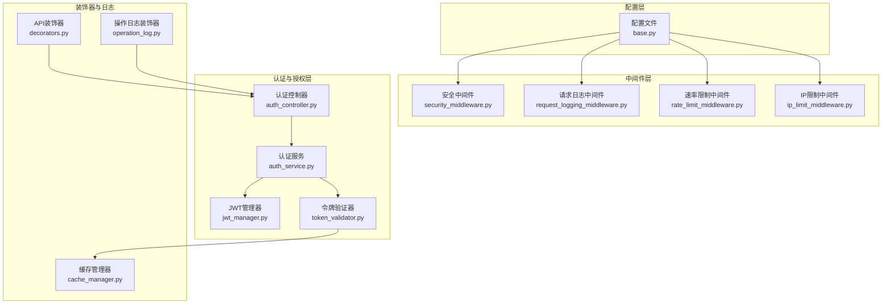
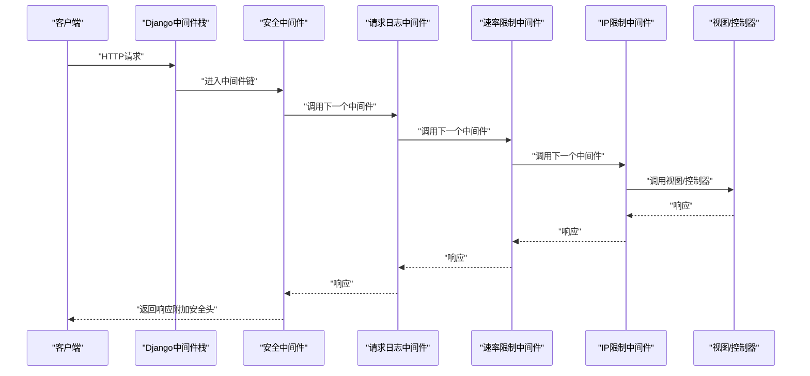
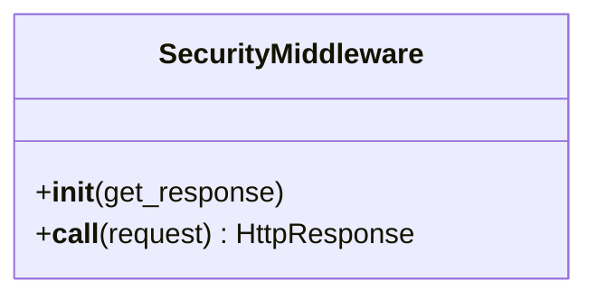
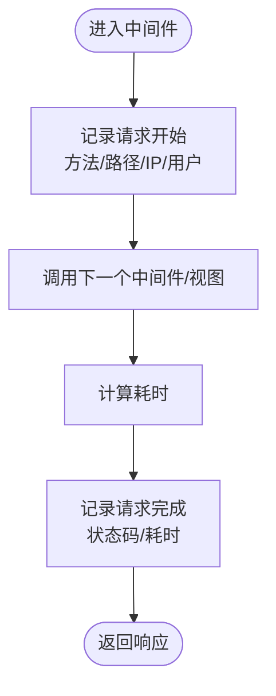
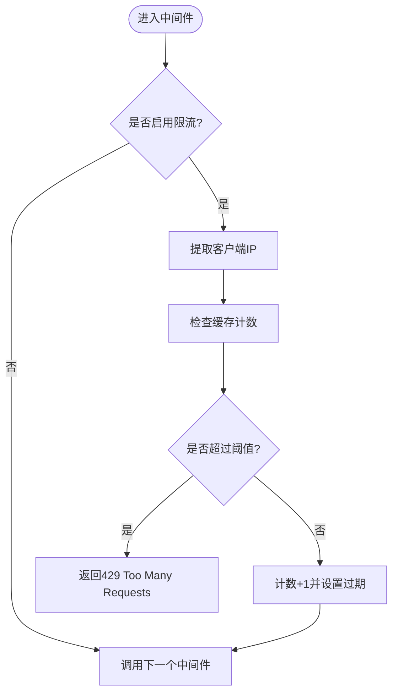
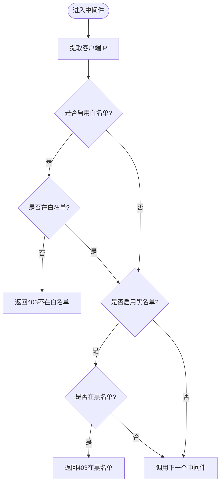
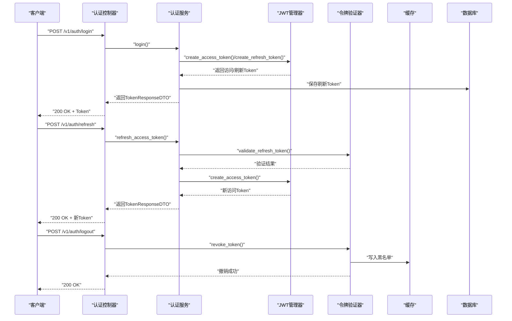
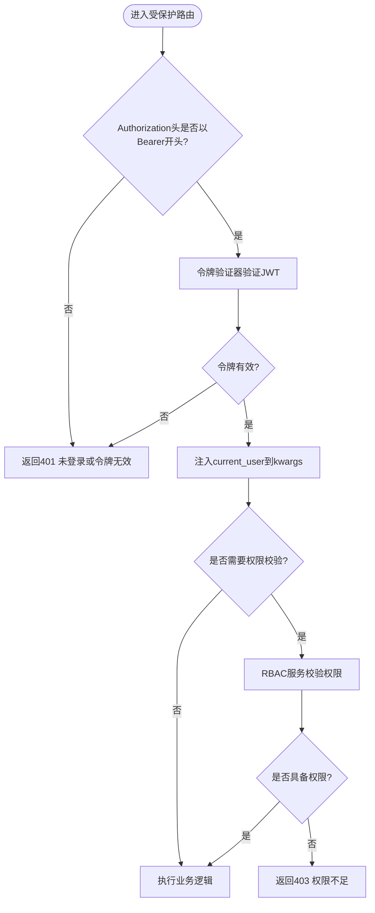
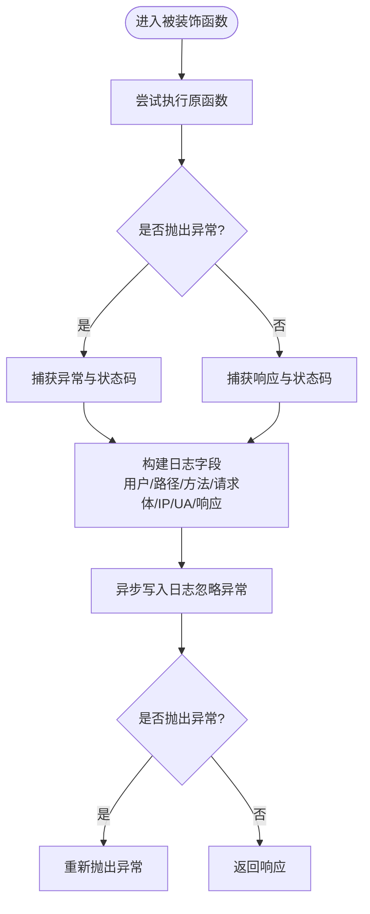
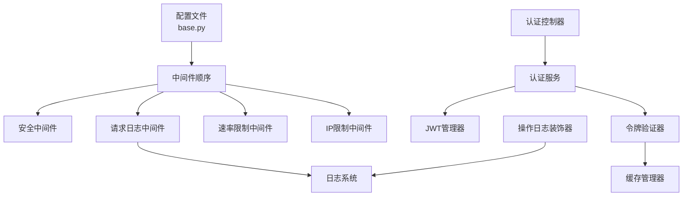

# 安全中间件

<cite>
**本文档引用的文件**
- [security_middleware.py](file://src/core/middlewares/security_middleware.py)
- [request_logging_middleware.py](file://src/core/middlewares/request_logging_middleware.py)
- [rate_limit_middleware.py](file://src/core/middlewares/rate_limit_middleware.py)
- [ip_limit_middleware.py](file://src/core/middlewares/ip_limit_middleware.py)
- [jwt_manager.py](file://src/infrastructure/auth_jwt/jwt_manager.py)
- [token_validator.py](file://src/infrastructure/auth_jwt/token_validator.py)
- [auth_service.py](file://src/application/services/auth_service.py)
- [auth_controller.py](file://src/api/v1/controllers/auth_controller.py)
- [base.py](file://config/settings/base.py)
- [decorators.py](file://src/api/common/decorators.py)
- [operation_log.py](file://src/core/decorators/operation_log.py)
- [cache_manager.py](file://src/infrastructure/cache/cache_manager.py)
- [requirements.txt](file://requirements.txt)
- [test_rate_limit_middleware.py](file://tests/test_middlewares/test_rate_limit_middleware.py)
</cite>

## 目录
1. [简介](#简介)
2. [项目结构](#项目结构)
3. [核心组件](#核心组件)
4. [架构总览](#架构总览)
5. [详细组件分析](#详细组件分析)
6. [依赖分析](#依赖分析)
7. [性能考虑](#性能考虑)
8. [故障排除指南](#故障排除指南)
9. [结论](#结论)
10. [附录](#附录)

## 简介
本文件面向安全中间件的全面技术文档，覆盖以下主题：
- 安全中间件整体架构设计：请求预处理、参数验证、SQL注入防护、XSS攻击防护等安全措施的实现思路与落地方式
- 请求日志中间件功能：请求响应日志记录、敏感信息过滤、日志格式标准化与日志存储策略
- 令牌验证中间件作用：JWT令牌验证、过期检查、权限验证与令牌刷新机制
- 安全中间件配置选项：安全头设置、CORS配置、HTTPS强制跳转与安全Cookie设置
- 性能影响与优化策略：中间件执行顺序、缓存使用与异步处理
- 常见安全威胁防护方案：CSRF攻击防护、文件上传安全、会话劫持防护等

## 项目结构
本项目采用分层架构，安全相关能力主要分布在以下层次：
- 配置层：集中定义中间件顺序、CORS、JWT、Redis缓存与日志格式
- 中间件层：提供安全响应头、请求日志、速率限制、IP黑白名单等横切关注点
- 认证与授权层：基于JWT的令牌生成、验证、刷新与撤销
- 控制器与装饰器层：统一错误处理、权限校验与操作日志记录

**图表来源**
- [base.py:39-52](file://config/settings/base.py#L39-L52)
- [security_middleware.py:14-53](file://src/core/middlewares/security_middleware.py#L14-L53)
- [request_logging_middleware.py:14-86](file://src/core/middlewares/request_logging_middleware.py#L14-L86)
- [rate_limit_middleware.py:15-112](file://src/core/middlewares/rate_limit_middleware.py#L15-L112)
- [ip_limit_middleware.py:15-130](file://src/core/middlewares/ip_limit_middleware.py#L15-L130)
- [jwt_manager.py:13-147](file://src/infrastructure/auth_jwt/jwt_manager.py#L13-L147)
- [token_validator.py:11-108](file://src/infrastructure/auth_jwt/token_validator.py#L11-L108)
- [auth_service.py:20-233](file://src/application/services/auth_service.py#L20-L233)
- [auth_controller.py:16-133](file://src/api/v1/controllers/auth_controller.py#L16-L133)
- [decorators.py:13-191](file://src/api/common/decorators.py#L13-L191)
- [operation_log.py:15-175](file://src/core/decorators/operation_log.py#L15-L175)
- [cache_manager.py:16-149](file://src/infrastructure/cache/cache_manager.py#L16-L149)

**章节来源**
- [base.py:39-52](file://config/settings/base.py#L39-L52)
- [security_middleware.py:14-53](file://src/core/middlewares/security_middleware.py#L14-L53)
- [request_logging_middleware.py:14-86](file://src/core/middlewares/request_logging_middleware.py#L14-L86)
- [rate_limit_middleware.py:15-112](file://src/core/middlewares/rate_limit_middleware.py#L15-L112)
- [ip_limit_middleware.py:15-130](file://src/core/middlewares/ip_limit_middleware.py#L15-L130)
- [jwt_manager.py:13-147](file://src/infrastructure/auth_jwt/jwt_manager.py#L13-L147)
- [token_validator.py:11-108](file://src/infrastructure/auth_jwt/token_validator.py#L11-L108)
- [auth_service.py:20-233](file://src/application/services/auth_service.py#L20-L233)
- [auth_controller.py:16-133](file://src/api/v1/controllers/auth_controller.py#L16-L133)
- [decorators.py:13-191](file://src/api/common/decorators.py#L13-L191)
- [operation_log.py:15-175](file://src/core/decorators/operation_log.py#L15-L175)
- [cache_manager.py:16-149](file://src/infrastructure/cache/cache_manager.py#L16-L149)

## 核心组件
- 安全中间件：在生产环境为响应添加安全头，增强浏览器安全防护
- 请求日志中间件：记录请求开始/完成、耗时、用户与IP等信息
- 速率限制中间件：基于Redis的IP级请求频率限制
- IP限制中间件：支持白名单/黑名单过滤，结合数据库实体进行判定
- JWT管理器与令牌验证器：负责JWT的生成、解码、验证、过期检查与撤销
- 认证服务与控制器：实现登录、刷新、登出与令牌验证的业务逻辑
- API装饰器：统一错误处理、权限校验与权限注入
- 操作日志装饰器：自动记录API操作日志，异步写入
- 缓存管理器：统一缓存键空间与用户/权限/角色缓存接口

**章节来源**
- [security_middleware.py:14-53](file://src/core/middlewares/security_middleware.py#L14-L53)
- [request_logging_middleware.py:14-86](file://src/core/middlewares/request_logging_middleware.py#L14-L86)
- [rate_limit_middleware.py:15-112](file://src/core/middlewares/rate_limit_middleware.py#L15-L112)
- [ip_limit_middleware.py:15-130](file://src/core/middlewares/ip_limit_middleware.py#L15-L130)
- [jwt_manager.py:13-147](file://src/infrastructure/auth_jwt/jwt_manager.py#L13-L147)
- [token_validator.py:11-108](file://src/infrastructure/auth_jwt/token_validator.py#L11-L108)
- [auth_service.py:20-233](file://src/application/services/auth_service.py#L20-L233)
- [auth_controller.py:16-133](file://src/api/v1/controllers/auth_controller.py#L16-L133)
- [decorators.py:13-191](file://src/api/common/decorators.py#L13-L191)
- [operation_log.py:15-175](file://src/core/decorators/operation_log.py#L15-L175)
- [cache_manager.py:16-149](file://src/infrastructure/cache/cache_manager.py#L16-L149)

## 架构总览
下图展示了安全中间件在请求生命周期中的位置与交互关系。

**图表来源**
- [base.py:39-52](file://config/settings/base.py#L39-L52)
- [security_middleware.py:33-53](file://src/core/middlewares/security_middleware.py#L33-L53)
- [request_logging_middleware.py:34-68](file://src/core/middlewares/request_logging_middleware.py#L34-L68)
- [rate_limit_middleware.py:41-68](file://src/core/middlewares/rate_limit_middleware.py#L41-L68)
- [ip_limit_middleware.py:41-76](file://src/core/middlewares/ip_limit_middleware.py#L41-L76)

## 详细组件分析

### 安全中间件
- 职责：在生产环境为响应添加安全头，包括X-Content-Type-Options、X-Frame-Options、X-XSS-Protection与Strict-Transport-Security
- 实现要点：仅在非DEBUG模式下生效，避免开发环境过度保护导致调试不便
- 配置入口：通过配置文件控制安全头策略

**图表来源**
- [security_middleware.py:14-53](file://src/core/middlewares/security_middleware.py#L14-L53)

**章节来源**
- [security_middleware.py:14-53](file://src/core/middlewares/security_middleware.py#L14-L53)
- [base.py:165-173](file://config/settings/base.py#L165-L173)

### 请求日志中间件
- 职责：记录请求开始/完成、耗时、用户与IP等信息
- 实现要点：计算请求耗时；从HTTP_X_FORWARDED_FOR或REMOTE_ADDR提取IP；区分匿名用户
- 日志格式：INFO级别，包含方法、路径、状态码、耗时等

**图表来源**
- [request_logging_middleware.py:34-68](file://src/core/middlewares/request_logging_middleware.py#L34-L68)

**章节来源**
- [request_logging_middleware.py:14-86](file://src/core/middlewares/request_logging_middleware.py#L14-L86)

### 速率限制中间件
- 职责：基于IP的请求频率限制，默认每分钟100次
- 实现要点：使用Redis缓存计数与过期时间；支持开关与默认规则配置
- 异常处理：超过限制返回429与错误信息

**图表来源**
- [rate_limit_middleware.py:41-112](file://src/core/middlewares/rate_limit_middleware.py#L41-L112)

**章节来源**
- [rate_limit_middleware.py:15-112](file://src/core/middlewares/rate_limit_middleware.py#L15-L112)
- [base.py:228-230](file://config/settings/base.py#L228-L230)

### IP限制中间件
- 职责：支持白名单/黑名单过滤，支持永久与临时封禁
- 实现要点：读取数据库实体判断；白名单优先于黑名单；记录告警日志
- 异常处理：不在白名单或在黑名单返回403

**图表来源**
- [ip_limit_middleware.py:41-76](file://src/core/middlewares/ip_limit_middleware.py#L41-L76)

**章节来源**
- [ip_limit_middleware.py:15-130](file://src/core/middlewares/ip_limit_middleware.py#L15-L130)
- [base.py:232-234](file://config/settings/base.py#L232-L234)

### 令牌验证与JWT管理
- JWT管理器：生成访问令牌与刷新令牌，设置过期时间，解码与验证
- 令牌验证器：验证令牌有效性、类型、黑名单与过期；支持撤销并写入黑名单
- 认证服务：登录生成双Token、保存刷新Token、记录登录日志；刷新与登出流程
- 控制器：提供登录、刷新、登出接口，解析Authorization头

**图表来源**
- [auth_controller.py:36-133](file://src/api/v1/controllers/auth_controller.py#L36-L133)
- [auth_service.py:26-180](file://src/application/services/auth_service.py#L26-L180)
- [jwt_manager.py:25-143](file://src/infrastructure/auth_jwt/jwt_manager.py#L25-L143)
- [token_validator.py:21-104](file://src/infrastructure/auth_jwt/token_validator.py#L21-L104)

**章节来源**
- [jwt_manager.py:13-147](file://src/infrastructure/auth_jwt/jwt_manager.py#L13-L147)
- [token_validator.py:11-108](file://src/infrastructure/auth_jwt/token_validator.py#L11-L108)
- [auth_service.py:20-233](file://src/application/services/auth_service.py#L20-L233)
- [auth_controller.py:16-133](file://src/api/v1/controllers/auth_controller.py#L16-L133)

### API装饰器与权限校验
- 统一错误处理：捕获常见异常并转换为HTTP错误
- 需要认证：校验Authorization头与JWT有效性，注入当前用户
- 需要权限：基于RBAC服务校验用户是否具备所需权限
- 验证实体存在：在执行操作前验证实体是否存在

**图表来源**
- [decorators.py:53-143](file://src/api/common/decorators.py#L53-L143)

**章节来源**
- [decorators.py:13-191](file://src/api/common/decorators.py#L13-L191)

### 操作日志装饰器
- 职责：自动记录API操作日志，包含模块、描述、请求体、响应结果、状态码、用户、IP、浏览器与系统信息
- 实现要点：异步写入，异常不影响主流程；限制请求体长度防止日志膨胀

**图表来源**
- [operation_log.py:29-72](file://src/core/decorators/operation_log.py#L29-L72)

**章节来源**
- [operation_log.py:15-175](file://src/core/decorators/operation_log.py#L15-L175)

## 依赖分析
- 中间件依赖关系：配置文件定义中间件顺序，确保安全中间件位于日志与限流之后
- 认证链路：控制器依赖认证服务，认证服务依赖JWT管理器与令牌验证器，令牌验证器依赖缓存
- 日志链路：请求日志中间件与操作日志装饰器共同提供请求与操作层面的日志
- 缓存链路：速率限制、令牌撤销与用户/权限缓存均依赖Redis缓存

**图表来源**
- [base.py:39-52](file://config/settings/base.py#L39-L52)
- [auth_controller.py:16-133](file://src/api/v1/controllers/auth_controller.py#L16-L133)
- [auth_service.py:20-233](file://src/application/services/auth_service.py#L20-L233)
- [jwt_manager.py:13-147](file://src/infrastructure/auth_jwt/jwt_manager.py#L13-L147)
- [token_validator.py:11-108](file://src/infrastructure/auth_jwt/token_validator.py#L11-L108)
- [cache_manager.py:16-149](file://src/infrastructure/cache/cache_manager.py#L16-L149)
- [request_logging_middleware.py:14-86](file://src/core/middlewares/request_logging_middleware.py#L14-L86)
- [operation_log.py:15-175](file://src/core/decorators/operation_log.py#L15-L175)

**章节来源**
- [base.py:39-52](file://config/settings/base.py#L39-L52)
- [auth_controller.py:16-133](file://src/api/v1/controllers/auth_controller.py#L16-L133)
- [auth_service.py:20-233](file://src/application/services/auth_service.py#L20-L233)
- [jwt_manager.py:13-147](file://src/infrastructure/auth_jwt/jwt_manager.py#L13-L147)
- [token_validator.py:11-108](file://src/infrastructure/auth_jwt/token_validator.py#L11-L108)
- [cache_manager.py:16-149](file://src/infrastructure/cache/cache_manager.py#L16-L149)
- [request_logging_middleware.py:14-86](file://src/core/middlewares/request_logging_middleware.py#L14-L86)
- [operation_log.py:15-175](file://src/core/decorators/operation_log.py#L15-L175)

## 性能考虑
- 中间件执行顺序：将安全中间件置于日志与限流之后，避免重复处理与额外开销
- 缓存使用：速率限制与令牌撤销依赖Redis，建议合理设置超时与内存策略
- 异步处理：操作日志装饰器采用异步写入，降低对主流程的影响
- 中间件开关：通过配置项控制限流与IP黑白名单，便于在不同环境动态启用/禁用
- 测试验证：单元测试覆盖速率限制的边界条件，确保在高并发下的稳定性

**章节来源**
- [base.py:228-234](file://config/settings/base.py#L228-L234)
- [rate_limit_middleware.py:30-40](file://src/core/middlewares/rate_limit_middleware.py#L30-L40)
- [test_rate_limit_middleware.py:29-76](file://tests/test_middlewares/test_rate_limit_middleware.py#L29-L76)

## 故障排除指南
- 速率限制触发429：检查Redis连接与键空间；确认默认限流规则与IP提取逻辑
- IP白名单/黑名单拒绝访问：确认数据库实体状态与有效期；检查中间件开关配置
- JWT验证失败：确认Authorization头格式、令牌类型、过期时间与黑名单状态
- 登录/刷新异常：查看认证服务日志与数据库刷新Token表；核对JWT配置项
- 日志缺失：检查日志配置与处理器，确认日志级别与输出目标

**章节来源**
- [rate_limit_middleware.py:51-68](file://src/core/middlewares/rate_limit_middleware.py#L51-L68)
- [ip_limit_middleware.py:54-76](file://src/core/middlewares/ip_limit_middleware.py#L54-L76)
- [token_validator.py:21-45](file://src/infrastructure/auth_jwt/token_validator.py#L21-L45)
- [auth_service.py:40-56](file://src/application/services/auth_service.py#L40-L56)
- [base.py:174-226](file://config/settings/base.py#L174-L226)

## 结论
本安全中间件体系通过中间件与装饰器协同，实现了安全头加固、请求日志、速率限制、IP黑白名单、JWT认证与权限校验等关键能力。配合Redis缓存与统一日志配置，既保证了安全性，又兼顾了性能与可观测性。建议在生产环境中启用严格安全头与HTTPS强制跳转，并结合速率限制与IP过滤策略，进一步提升抗攻击能力。

## 附录

### 安全中间件配置选项
- 安全头设置：生产环境自动添加X-Content-Type-Options、X-Frame-Options、X-XSS-Protection、Strict-Transport-Security
- CORS配置：CORS_ALLOW_ALL_ORIGINS在DEBUG模式下开启，CORS_ALLOW_CREDENTIALS始终开启
- HTTPS强制跳转：非DEBUG模式下启用SECURE_SSL_REDIRECT
- 安全Cookie：SESSION_COOKIE_SECURE与CSRF_COOKIE_SECURE在非DEBUG模式下启用
- 速率限制：RATE_LIMIT_ENABLED与RATE_LIMIT_DEFAULT可通过环境变量配置
- IP黑白名单：IP_BLACKLIST_ENABLED与IP_WHITELIST_ENABLED可通过环境变量配置

**章节来源**
- [base.py:165-173](file://config/settings/base.py#L165-L173)
- [base.py:118-121](file://config/settings/base.py#L118-L121)
- [base.py:165-173](file://config/settings/base.py#L165-L173)
- [base.py:228-234](file://config/settings/base.py#L228-L234)
- [base.py:232-234](file://config/settings/base.py#L232-L234)

### 常见安全威胁防护方案
- CSRF攻击防护：项目已启用Django内置CSRF中间件与REST Framework SimpleJWT的CSRF Cookie安全设置
- XSS攻击防护：安全中间件在生产环境添加X-XSS-Protection与X-Content-Type-Options，配置文件也启用了XSS过滤与NoSniff
- SQL注入防护：ORM层使用Django ORM，避免原生SQL拼接；参数化查询由框架保证
- 文件上传安全：建议在应用层增加文件类型白名单、大小限制与病毒扫描
- 会话劫持防护：启用HTTPS强制跳转与安全Cookie；JWT令牌支持撤销与黑名单

**章节来源**
- [base.py:40-49](file://config/settings/base.py#L40-L49)
- [security_middleware.py:46-52](file://src/core/middlewares/security_middleware.py#L46-L52)
- [base.py:165-173](file://config/settings/base.py#L165-L173)
- [requirements.txt:21-27](file://requirements.txt#L21-L27)