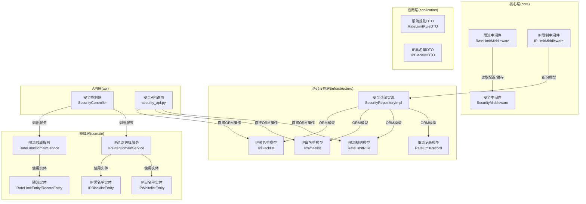
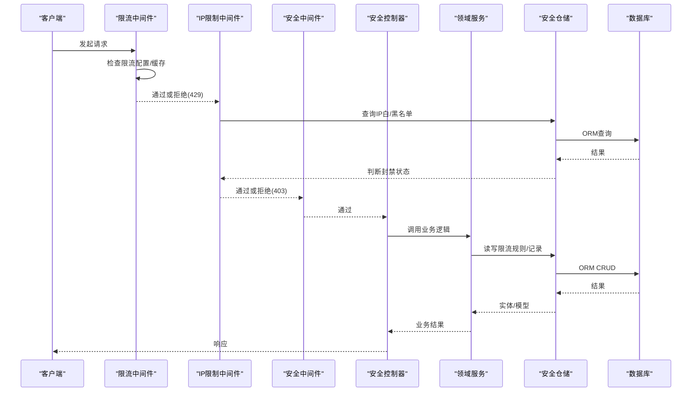
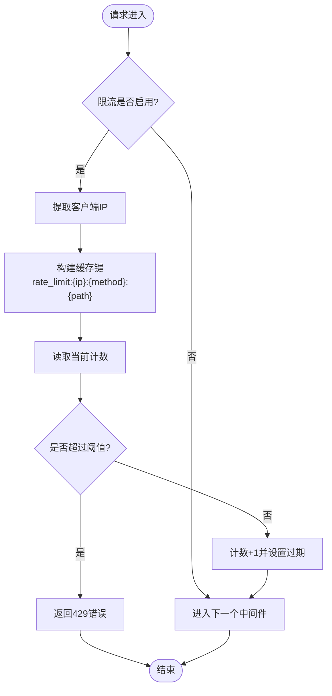
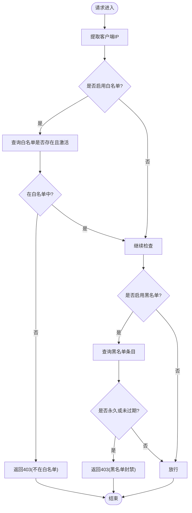
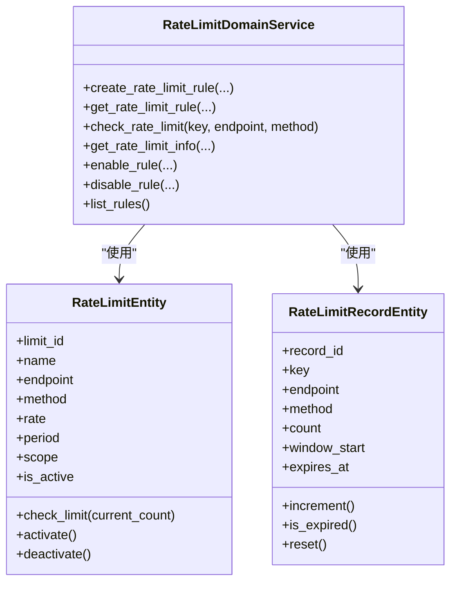
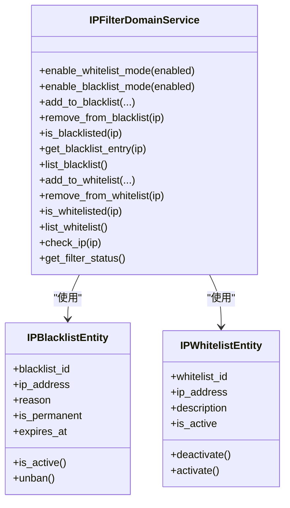
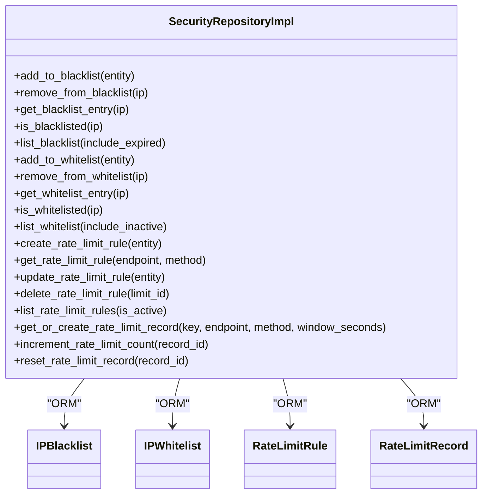
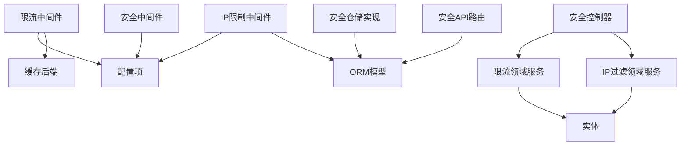

# 安全防护系统

<cite>
**本文档引用的文件**
- [src/core/middlewares/rate_limit_middleware.py](file://src/core/middlewares/rate_limit_middleware.py)
- [src/core/middlewares/ip_limit_middleware.py](file://src/core/middlewares/ip_limit_middleware.py)
- [src/core/middlewares/security_middleware.py](file://src/core/middlewares/security_middleware.py)
- [src/domain/security/entities/rate_limit_entity.py](file://src/domain/security/entities/rate_limit_entity.py)
- [src/domain/security/entities/ip_blacklist_entity.py](file://src/domain/security/entities/ip_blacklist_entity.py)
- [src/domain/security/entities/ip_whitelist_entity.py](file://src/domain/security/entities/ip_whitelist_entity.py)
- [src/domain/security/services/rate_limit_service.py](file://src/domain/security/services/rate_limit_service.py)
- [src/domain/security/services/ip_filter_service.py](file://src/domain/security/services/ip_filter_service.py)
- [src/infrastructure/persistence/models/security_models.py](file://src/infrastructure/persistence/models/security_models.py)
- [src/infrastructure/repositories/security_repo_impl.py](file://src/infrastructure/repositories/security_repo_impl.py)
- [src/application/dto/security/rate_limit_rule_dto.py](file://src/application/dto/security/rate_limit_rule_dto.py)
- [src/application/dto/security/ip_blacklist_dto.py](file://src/application/dto/security/ip_blacklist_dto.py)
- [src/api/v1/controllers/security_controller.py](file://src/api/v1/controllers/security_controller.py)
- [src/api/v1/security_api.py](file://src/api/v1/security_api.py)
- [config/settings/base.py](file://config/settings/base.py)
- [src/core/exceptions/rate_limit_error.py](file://src/core/exceptions/rate_limit_error.py)
- [src/core/exceptions/ip_blocked_error.py](file://src/core/exceptions/ip_blocked_error.py)
</cite>

## 目录
1. [简介](#简介)
2. [项目结构](#项目结构)
3. [核心组件](#核心组件)
4. [架构总览](#架构总览)
5. [详细组件分析](#详细组件分析)
6. [依赖分析](#依赖分析)
7. [性能考虑](#性能考虑)
8. [故障排查指南](#故障排查指南)
9. [结论](#结论)
10. [附录](#附录)

## 简介
本项目是一个基于 Django 的安全防护系统，围绕“中间件 + 领域服务 + 仓储 + 模型”的分层架构设计，提供以下能力：
- 限流中间件与领域服务：支持基于 IP 的简单限流与更精细的限流规则管理（含速率、周期、作用域）。
- IP 限制中间件：支持白名单与黑名单模式，具备临时/永久封禁能力。
- 安全中间件：统一添加安全响应头，提升生产环境安全性。
- 安全仓储与模型：持久化存储 IP 黑名单/白名单、限流规则与限流记录。
- 控制器与 DTO：提供 REST 接口进行安全配置与状态查询。

系统同时提供异常类型以规范错误返回，并通过配置文件集中管理限流与 IP 策略开关。

## 项目结构
系统采用按“核心层/领域层/基础设施层/应用层/API 层”分层组织，安全相关模块主要分布在 core、domain、infrastructure 和 api 四个层次。

图表来源
- [src/core/middlewares/rate_limit_middleware.py:1-112](file://src/core/middlewares/rate_limit_middleware.py#L1-L112)
- [src/core/middlewares/ip_limit_middleware.py:1-130](file://src/core/middlewares/ip_limit_middleware.py#L1-L130)
- [src/core/middlewares/security_middleware.py:1-54](file://src/core/middlewares/security_middleware.py#L1-L54)
- [src/domain/security/entities/rate_limit_entity.py:1-106](file://src/domain/security/entities/rate_limit_entity.py#L1-L106)
- [src/domain/security/entities/ip_blacklist_entity.py:1-53](file://src/domain/security/entities/ip_blacklist_entity.py#L1-L53)
- [src/domain/security/entities/ip_whitelist_entity.py:1-47](file://src/domain/security/entities/ip_whitelist_entity.py#L1-L47)
- [src/domain/security/services/rate_limit_service.py:1-126](file://src/domain/security/services/rate_limit_service.py#L1-L126)
- [src/domain/security/services/ip_filter_service.py:1-149](file://src/domain/security/services/ip_filter_service.py#L1-L149)
- [src/infrastructure/persistence/models/security_models.py:1-162](file://src/infrastructure/persistence/models/security_models.py#L1-L162)
- [src/infrastructure/repositories/security_repo_impl.py:1-260](file://src/infrastructure/repositories/security_repo_impl.py#L1-L260)
- [src/api/v1/controllers/security_controller.py:1-302](file://src/api/v1/controllers/security_controller.py#L1-L302)
- [src/api/v1/security_api.py:1-285](file://src/api/v1/security_api.py#L1-L285)

章节来源
- [config/settings/base.py:39-52](file://config/settings/base.py#L39-L52)
- [config/settings/base.py:228-235](file://config/settings/base.py#L228-L235)

## 核心组件
- 限流中间件：基于 Django 缓存实现简单 IP 级限流，默认每分钟 100 次，可通过环境变量开启/关闭与调整默认规则。
- IP 限制中间件：支持白名单/黑名单模式，结合 ORM 查询判断封禁状态，支持永久与临时封禁。
- 安全中间件：在非调试环境下统一添加安全响应头，增强浏览器安全策略。
- 限流领域服务：提供规则创建、查询、检查、剩余次数计算与启停控制，内存级规则与记录缓存。
- IP 过滤领域服务：提供白/黑名单增删查、过滤检查与状态统计，支持白名单优先策略。
- 安全仓储实现：封装 IP 黑/白名单与限流规则/记录的 CRUD 与查询逻辑，负责实体与模型的双向转换。
- 安全模型：定义数据库表结构、索引与校验逻辑。
- 控制器与 DTO：对外暴露 REST 接口，完成参数校验与数据传输。

章节来源
- [src/core/middlewares/rate_limit_middleware.py:15-112](file://src/core/middlewares/rate_limit_middleware.py#L15-L112)
- [src/core/middlewares/ip_limit_middleware.py:15-130](file://src/core/middlewares/ip_limit_middleware.py#L15-L130)
- [src/core/middlewares/security_middleware.py:14-54](file://src/core/middlewares/security_middleware.py#L14-L54)
- [src/domain/security/services/rate_limit_service.py:11-126](file://src/domain/security/services/rate_limit_service.py#L11-L126)
- [src/domain/security/services/ip_filter_service.py:12-149](file://src/domain/security/services/ip_filter_service.py#L12-L149)
- [src/infrastructure/repositories/security_repo_impl.py:21-260](file://src/infrastructure/repositories/security_repo_impl.py#L21-L260)
- [src/infrastructure/persistence/models/security_models.py:13-162](file://src/infrastructure/persistence/models/security_models.py#L13-L162)
- [src/api/v1/controllers/security_controller.py:21-302](file://src/api/v1/controllers/security_controller.py#L21-L302)
- [src/application/dto/security/rate_limit_rule_dto.py:9-36](file://src/application/dto/security/rate_limit_rule_dto.py#L9-L36)
- [src/application/dto/security/ip_blacklist_dto.py:11-27](file://src/application/dto/security/ip_blacklist_dto.py#L11-L27)

## 架构总览
系统采用“中间件前置拦截 + 领域服务处理 + 仓储持久化”的整体流程。请求进入后，先由限流与 IP 限制中间件进行快速判定；随后由安全中间件统一加固响应头；最后由控制器/路由层调用领域服务与仓储完成业务处理与数据持久化。

图表来源
- [src/core/middlewares/rate_limit_middleware.py:41-68](file://src/core/middlewares/rate_limit_middleware.py#L41-L68)
- [src/core/middlewares/ip_limit_middleware.py:41-76](file://src/core/middlewares/ip_limit_middleware.py#L41-L76)
- [src/core/middlewares/security_middleware.py:33-53](file://src/core/middlewares/security_middleware.py#L33-L53)
- [src/api/v1/controllers/security_controller.py:32-39](file://src/api/v1/controllers/security_controller.py#L32-L39)
- [src/infrastructure/repositories/security_repo_impl.py:21-260](file://src/infrastructure/repositories/security_repo_impl.py#L21-L260)
- [src/infrastructure/persistence/models/security_models.py:13-162](file://src/infrastructure/persistence/models/security_models.py#L13-L162)

## 详细组件分析

### 限流中间件（RateLimitMiddleware）
- 功能要点
  - 基于 IP 的简单限流：使用缓存键存储每分钟计数，超过阈值返回 429。
  - 配置项：开关与默认规则通过环境变量控制。
  - IP 获取：兼容代理场景，优先取第一个 X-Forwarded-For。
- 复杂度与性能
  - 单请求 O(1) 缓存读写，Redis 缓存可满足高并发。
- 错误处理
  - 超限时返回 JSON 错误与 429 状态码。
- 与领域服务的关系
  - 当前中间件为“简单限流”，领域服务提供更细粒度的规则与记录管理。

图表来源
- [src/core/middlewares/rate_limit_middleware.py:41-112](file://src/core/middlewares/rate_limit_middleware.py#L41-L112)

章节来源
- [src/core/middlewares/rate_limit_middleware.py:15-112](file://src/core/middlewares/rate_limit_middleware.py#L15-L112)
- [config/settings/base.py:228-230](file://config/settings/base.py#L228-L230)

### IP 限制中间件（IPLimitMiddleware）
- 功能要点
  - 白名单优先：若启用白名单且 IP 不在白名单，则拒绝。
  - 黑名单检查：若启用黑名单且 IP 在黑名单（永久或未过期），则拒绝。
  - IP 获取：兼容代理场景。
- 复杂度与性能
  - ORM 查询基于索引字段，查询复杂度近似 O(log N)。
- 错误处理
  - 拒绝时返回 JSON 错误与 403 状态码。

图表来源
- [src/core/middlewares/ip_limit_middleware.py:41-130](file://src/core/middlewares/ip_limit_middleware.py#L41-L130)
- [src/infrastructure/persistence/models/security_models.py:13-80](file://src/infrastructure/persistence/models/security_models.py#L13-L80)

章节来源
- [src/core/middlewares/ip_limit_middleware.py:15-130](file://src/core/middlewares/ip_limit_middleware.py#L15-L130)
- [config/settings/base.py:233-234](file://config/settings/base.py#L233-L234)

### 安全中间件（SecurityMiddleware）
- 功能要点
  - 非调试环境统一添加安全响应头，如 X-Content-Type-Options、X-Frame-Options、X-XSS-Protection、HSTS。
- 性能影响
  - 仅在响应阶段追加头，开销极低。

章节来源
- [src/core/middlewares/security_middleware.py:14-54](file://src/core/middlewares/security_middleware.py#L14-L54)

### 限流领域服务（RateLimitDomainService）
- 功能要点
  - 规则管理：创建、查询、启停。
  - 限流检查：根据规则与记录计算剩余次数与是否允许。
  - 内存缓存：规则与记录以内存字典维护，减少数据库压力。
- 复杂度
  - 规则/记录查找与更新为 O(1)，适合高并发场景。
- 与仓储协作
  - 规则与记录的持久化由仓储实现负责。

图表来源
- [src/domain/security/services/rate_limit_service.py:11-126](file://src/domain/security/services/rate_limit_service.py#L11-L126)
- [src/domain/security/entities/rate_limit_entity.py:11-106](file://src/domain/security/entities/rate_limit_entity.py#L11-L106)

章节来源
- [src/domain/security/services/rate_limit_service.py:11-126](file://src/domain/security/services/rate_limit_service.py#L11-L126)
- [src/domain/security/entities/rate_limit_entity.py:11-106](file://src/domain/security/entities/rate_limit_entity.py#L11-L106)

### IP 过滤领域服务（IPFilterDomainService）
- 功能要点
  - 白/黑名单增删查与状态统计。
  - 过滤检查：白名单优先，再检查黑名单。
- 复杂度
  - 内存字典操作 O(1)，适合高并发场景。
- 与仓储协作
  - 实际封禁状态由仓储实现与模型查询保证。

图表来源
- [src/domain/security/services/ip_filter_service.py:12-149](file://src/domain/security/services/ip_filter_service.py#L12-L149)
- [src/domain/security/entities/ip_blacklist_entity.py:11-53](file://src/domain/security/entities/ip_blacklist_entity.py#L11-L53)
- [src/domain/security/entities/ip_whitelist_entity.py:11-47](file://src/domain/security/entities/ip_whitelist_entity.py#L11-L47)

章节来源
- [src/domain/security/services/ip_filter_service.py:12-149](file://src/domain/security/services/ip_filter_service.py#L12-L149)
- [src/domain/security/entities/ip_blacklist_entity.py:11-53](file://src/domain/security/entities/ip_blacklist_entity.py#L11-L53)
- [src/domain/security/entities/ip_whitelist_entity.py:11-47](file://src/domain/security/entities/ip_whitelist_entity.py#L11-L47)

### 安全仓储实现（SecurityRepositoryImpl）
- 功能要点
  - IP 黑/白名单：新增、删除、查询、列表、封禁状态判断。
  - 限流规则：创建、查询、更新、删除、列表。
  - 限流记录：获取或创建、计数递增、重置。
  - 实体与模型转换：提供双向映射方法。
- 复杂度
  - 基于数据库索引的查询，复杂度取决于具体 SQL 执行计划。
- 与模型协作
  - 通过 ORM 模型完成持久化。

图表来源
- [src/infrastructure/repositories/security_repo_impl.py:21-260](file://src/infrastructure/repositories/security_repo_impl.py#L21-L260)
- [src/infrastructure/persistence/models/security_models.py:13-162](file://src/infrastructure/persistence/models/security_models.py#L13-L162)

章节来源
- [src/infrastructure/repositories/security_repo_impl.py:21-260](file://src/infrastructure/repositories/security_repo_impl.py#L21-L260)
- [src/infrastructure/persistence/models/security_models.py:13-162](file://src/infrastructure/persistence/models/security_models.py#L13-L162)

### 安全模型（ORM）
- IP 黑名单模型：唯一 IP、封禁原因、永久/临时封禁、创建者关联。
- IP 白名单模型：唯一 IP、描述、激活状态、创建者关联。
- 限流规则模型：端点+方法唯一、速率、周期、作用域、激活状态。
- 限流记录模型：键+端点+方法复合索引，窗口开始时间与过期时间。

章节来源
- [src/infrastructure/persistence/models/security_models.py:13-162](file://src/infrastructure/persistence/models/security_models.py#L13-L162)

### 控制器与 DTO
- 控制器：提供黑名单/白名单/限流规则的增删改查与状态查询接口，遵循依赖注入与权限控制。
- DTO：对输入输出进行结构化约束与示例展示。

章节来源
- [src/api/v1/controllers/security_controller.py:21-302](file://src/api/v1/controllers/security_controller.py#L21-L302)
- [src/application/dto/security/rate_limit_rule_dto.py:9-36](file://src/application/dto/security/rate_limit_rule_dto.py#L9-L36)
- [src/application/dto/security/ip_blacklist_dto.py:11-27](file://src/application/dto/security/ip_blacklist_dto.py#L11-L27)

## 依赖分析
- 中间件依赖
  - 限流中间件依赖缓存后端与配置项。
  - IP 限制中间件依赖 ORM 查询与配置项。
  - 安全中间件依赖配置项决定是否添加安全头。
- 领域服务依赖
  - 限流领域服务内部持有规则与记录缓存，不直接依赖数据库。
  - IP 过滤领域服务内部持有白/黑名单缓存，不直接依赖数据库。
- 仓储依赖
  - 依赖 ORM 模型与数据库连接，负责实体与模型转换。
- API 依赖
  - 控制器依赖服务层；路由层可直接使用 ORM 模型（与控制器形成互补）。

图表来源
- [config/settings/base.py:228-235](file://config/settings/base.py#L228-L235)
- [src/core/middlewares/rate_limit_middleware.py:30-40](file://src/core/middlewares/rate_limit_middleware.py#L30-L40)
- [src/core/middlewares/ip_limit_middleware.py:30-40](file://src/core/middlewares/ip_limit_middleware.py#L30-L40)
- [src/core/middlewares/security_middleware.py:24-32](file://src/core/middlewares/security_middleware.py#L24-L32)
- [src/domain/security/services/rate_limit_service.py:17-20](file://src/domain/security/services/rate_limit_service.py#L17-L20)
- [src/domain/security/services/ip_filter_service.py:18-22](file://src/domain/security/services/ip_filter_service.py#L18-L22)
- [src/infrastructure/repositories/security_repo_impl.py:12-18](file://src/infrastructure/repositories/security_repo_impl.py#L12-L18)
- [src/api/v1/controllers/security_controller.py:32-39](file://src/api/v1/controllers/security_controller.py#L32-L39)
- [src/api/v1/security_api.py:16-21](file://src/api/v1/security_api.py#L16-L21)

章节来源
- [config/settings/base.py:228-235](file://config/settings/base.py#L228-L235)
- [src/core/middlewares/rate_limit_middleware.py:30-40](file://src/core/middlewares/rate_limit_middleware.py#L30-L40)
- [src/core/middlewares/ip_limit_middleware.py:30-40](file://src/core/middlewares/ip_limit_middleware.py#L30-L40)
- [src/core/middlewares/security_middleware.py:24-32](file://src/core/middlewares/security_middleware.py#L24-L32)
- [src/domain/security/services/rate_limit_service.py:17-20](file://src/domain/security/services/rate_limit_service.py#L17-L20)
- [src/domain/security/services/ip_filter_service.py:18-22](file://src/domain/security/services/ip_filter_service.py#L18-L22)
- [src/infrastructure/repositories/security_repo_impl.py:12-18](file://src/infrastructure/repositories/security_repo_impl.py#L12-L18)
- [src/api/v1/controllers/security_controller.py:32-39](file://src/api/v1/controllers/security_controller.py#L32-L39)
- [src/api/v1/security_api.py:16-21](file://src/api/v1/security_api.py#L16-L21)

## 性能考虑
- 缓存与中间件
  - 限流中间件使用缓存键存储计数，建议使用 Redis 作为缓存后端，避免进程内缓存无法共享。
  - 设置合理的过期时间与键命名，避免缓存雪崩。
- 数据库索引
  - IP 黑/白名单与限流记录均建立必要索引，确保查询高效。
- 并发与锁
  - 中间件的计数递增非原子操作，高并发下可能出现瞬时超限。可考虑使用 Redis 原子计数或 Lua 脚本。
- 中间件顺序
  - 将限流与 IP 限制中间件置于安全中间件之前，尽早拒绝无效请求，降低后续处理压力。
- 日志与监控
  - 对限流与封禁事件进行日志记录，便于审计与告警。

## 故障排查指南
- 限流频繁触发
  - 检查环境变量配置与缓存后端可用性；确认请求路径与方法是否命中规则。
  - 参考异常类型与中间件返回。
- IP 被封禁
  - 检查白/黑名单配置与封禁状态（永久/临时）；核对控制器/路由的封禁逻辑。
- 安全头未生效
  - 确认非调试模式与安全中间件已正确加载。
- 数据不一致
  - 核对仓储实现与模型定义，确保实体与模型转换正确。

章节来源
- [src/core/exceptions/rate_limit_error.py:9-26](file://src/core/exceptions/rate_limit_error.py#L9-L26)
- [src/core/exceptions/ip_blocked_error.py:9-26](file://src/core/exceptions/ip_blocked_error.py#L9-L26)
- [src/core/middlewares/rate_limit_middleware.py:58-66](file://src/core/middlewares/rate_limit_middleware.py#L58-L66)
- [src/core/middlewares/ip_limit_middleware.py:66-74](file://src/core/middlewares/ip_limit_middleware.py#L66-L74)
- [src/core/middlewares/security_middleware.py:47-51](file://src/core/middlewares/security_middleware.py#L47-L51)

## 结论
本安全防护系统通过中间件前置拦截、领域服务抽象与仓储持久化，实现了灵活高效的限流与 IP 管控能力。建议在生产环境中：
- 使用 Redis 缓存后端支撑限流中间件；
- 明确白/黑名单策略并定期审计；
- 结合日志与监控完善安全运营；
- 持续评估限流规则与封禁策略，平衡安全与可用性。

## 附录

### 安全配置最佳实践
- 限流策略
  - 为不同端点设置差异化规则，区分 GET/POST 等方法。
  - 合理设置周期与速率，避免误伤正常用户。
  - 使用领域服务进行规则启停与动态调整。
- IP 管理策略
  - 白名单优先适用于受信任网络；黑名单适用于已知威胁。
  - 临时封禁配合自动解封机制，减少人工干预。
- 安全日志
  - 记录限流与封禁事件，保留时间窗与原因。
  - 结合安全中间件统一响应头，提升整体安全基线。

### 常见安全威胁与应对
- 暴力破解
  - 通过限流中间件与领域服务限制登录尝试频率。
- CC/爬虫攻击
  - 使用 IP 黑名单与临时封禁，结合限流规则降低带宽占用。
- 代理绕过
  - 中间件优先取 X-Forwarded-For 第一个值，结合白名单策略。

### 配置示例与建议
- 环境变量
  - 开关与默认限流：参考基础配置中的限流相关项。
  - 白/黑名单开关：参考基础配置中的 IP 相关项。
- 中间件顺序
  - 建议将限流与 IP 限制中间件置于安全中间件之前，尽早拦截异常流量。

章节来源
- [config/settings/base.py:228-235](file://config/settings/base.py#L228-L235)
- [config/settings/base.py:39-52](file://config/settings/base.py#L39-L52)