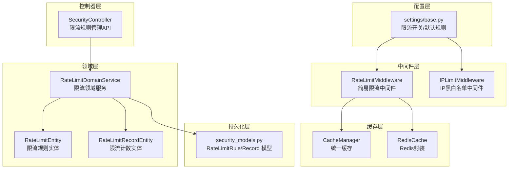
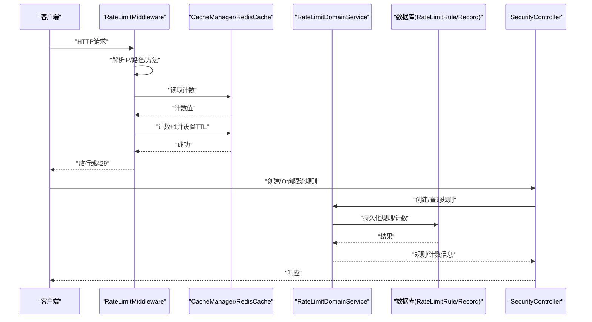
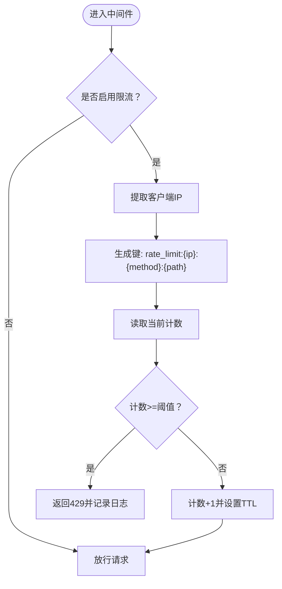
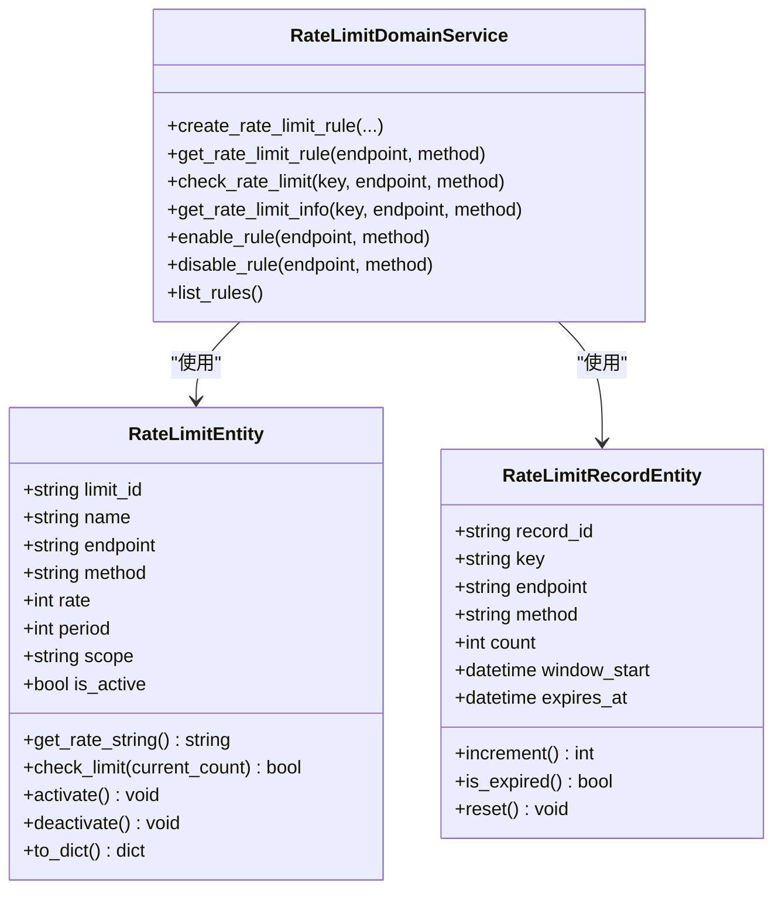
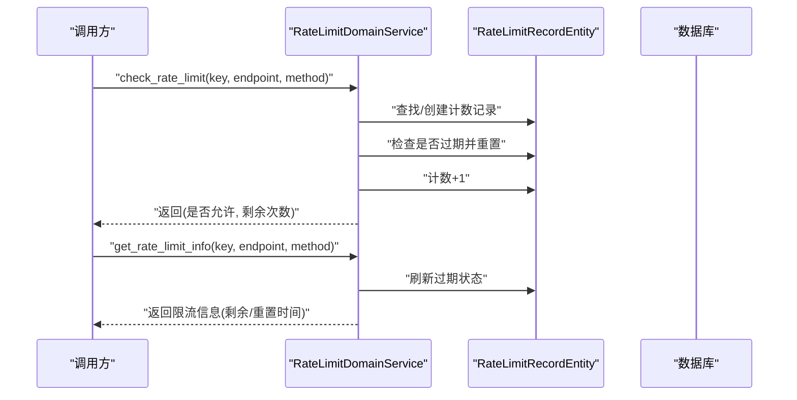
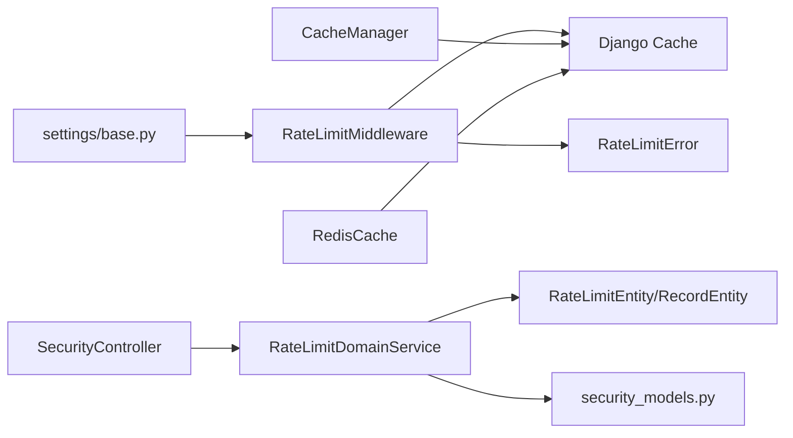

# 限流机制

<cite>
**本文档引用的文件**
- [src/core/middlewares/rate_limit_middleware.py](file://src/core/middlewares/rate_limit_middleware.py)
- [src/domain/security/entities/rate_limit_entity.py](file://src/domain/security/entities/rate_limit_entity.py)
- [src/domain/security/services/rate_limit_service.py](file://src/domain/security/services/rate_limit_service.py)
- [src/application/dto/security/rate_limit_rule_dto.py](file://src/application/dto/security/rate_limit_rule_dto.py)
- [src/infrastructure/persistence/models/security_models.py](file://src/infrastructure/persistence/models/security_models.py)
- [src/infrastructure/cache/cache_manager.py](file://src/infrastructure/cache/cache_manager.py)
- [src/infrastructure/cache/redis_cache.py](file://src/infrastructure/cache/redis_cache.py)
- [config/settings/base.py](file://config/settings/base.py)
- [src/core/exceptions/rate_limit_error.py](file://src/core/exceptions/rate_limit_error.py)
- [src/core/middlewares/ip_limit_middleware.py](file://src/core/middlewares/ip_limit_middleware.py)
- [src/api/v1/controllers/security_controller.py](file://src/api/v1/controllers/security_controller.py)
- [tests/test_middlewares/test_rate_limit_middleware.py](file://tests/test_middlewares/test_rate_limit_middleware.py)
- [requirements.txt](file://requirements.txt)
</cite>

## 目录
1. [引言](#引言)
2. [项目结构](#项目结构)
3. [核心组件](#核心组件)
4. [架构总览](#架构总览)
5. [详细组件分析](#详细组件分析)
6. [依赖分析](#依赖分析)
7. [性能考虑](#性能考虑)
8. [故障排查指南](#故障排查指南)
9. [结论](#结论)
10. [附录](#附录)

## 引言
本文件系统性阐述本项目的限流机制，覆盖中间件实现、领域模型与服务、配置参数、键值设计、策略差异与性能优化，并提供故障排查与最佳实践建议。当前仓库实现了两类限流能力：
- 基于中间件的简易限流（按IP+方法+路径聚合计数）
- 基于领域服务与持久化的精细化限流（规则+窗口+计数）

同时，项目还提供了IP白名单/黑名单中间件，作为限流前置的安全控制。

## 项目结构
围绕限流的关键模块分布如下：
- 配置层：环境变量驱动的限流开关与默认规则
- 中间件层：请求拦截与快速判定
- 领域层：规则与计数的业务逻辑
- 持久化层：规则与计数的数据库存储
- 缓存层：统一缓存与Redis封装
- 控制器层：对外暴露限流规则的管理接口

图表来源
- [config/settings/base.py:228-235](file://config/settings/base.py#L228-L235)
- [src/core/middlewares/rate_limit_middleware.py:15-112](file://src/core/middlewares/rate_limit_middleware.py#L15-L112)
- [src/core/middlewares/ip_limit_middleware.py:15-130](file://src/core/middlewares/ip_limit_middleware.py#L15-L130)
- [src/domain/security/services/rate_limit_service.py:11-126](file://src/domain/security/services/rate_limit_service.py#L11-L126)
- [src/domain/security/entities/rate_limit_entity.py:11-106](file://src/domain/security/entities/rate_limit_entity.py#L11-L106)
- [src/infrastructure/persistence/models/security_models.py:82-162](file://src/infrastructure/persistence/models/security_models.py#L82-L162)
- [src/infrastructure/cache/cache_manager.py:16-149](file://src/infrastructure/cache/cache_manager.py#L16-L149)
- [src/infrastructure/cache/redis_cache.py:15-169](file://src/infrastructure/cache/redis_cache.py#L15-L169)
- [src/api/v1/controllers/security_controller.py:187-283](file://src/api/v1/controllers/security_controller.py#L187-L283)

章节来源
- [config/settings/base.py:228-235](file://config/settings/base.py#L228-L235)
- [src/core/middlewares/rate_limit_middleware.py:15-112](file://src/core/middlewares/rate_limit_middleware.py#L15-L112)
- [src/core/middlewares/ip_limit_middleware.py:15-130](file://src/core/middlewares/ip_limit_middleware.py#L15-L130)
- [src/domain/security/services/rate_limit_service.py:11-126](file://src/domain/security/services/rate_limit_service.py#L11-L126)
- [src/domain/security/entities/rate_limit_entity.py:11-106](file://src/domain/security/entities/rate_limit_entity.py#L11-L106)
- [src/infrastructure/persistence/models/security_models.py:82-162](file://src/infrastructure/persistence/models/security_models.py#L82-L162)
- [src/infrastructure/cache/cache_manager.py:16-149](file://src/infrastructure/cache/cache_manager.py#L16-L149)
- [src/infrastructure/cache/redis_cache.py:15-169](file://src/infrastructure/cache/redis_cache.py#L15-L169)
- [src/api/v1/controllers/security_controller.py:187-283](file://src/api/v1/controllers/security_controller.py#L187-L283)

## 核心组件
- 限流中间件（简易版）：基于IP+方法+路径聚合计数，使用缓存进行计数与过期控制，支持开关与默认规则配置。
- 限流领域服务：提供规则创建、查询、检查与剩余次数计算，支持按IP/用户/全局作用域。
- 限流实体与记录：定义规则与计数的数据结构，包含有效期与重置逻辑。
- 持久化模型：将规则与计数映射到数据库表，支持索引与唯一约束。
- 缓存管理：统一键前缀、分组与序列化，提供Redis封装的增量与批量操作。
- 控制器API：提供限流规则的增删改查与启停接口。
- IP黑白名单中间件：在限流之前进行IP准入控制。

章节来源
- [src/core/middlewares/rate_limit_middleware.py:15-112](file://src/core/middlewares/rate_limit_middleware.py#L15-L112)
- [src/domain/security/services/rate_limit_service.py:11-126](file://src/domain/security/services/rate_limit_service.py#L11-L126)
- [src/domain/security/entities/rate_limit_entity.py:11-106](file://src/domain/security/entities/rate_limit_entity.py#L11-L106)
- [src/infrastructure/persistence/models/security_models.py:82-162](file://src/infrastructure/persistence/models/security_models.py#L82-L162)
- [src/infrastructure/cache/cache_manager.py:16-149](file://src/infrastructure/cache/cache_manager.py#L16-L149)
- [src/infrastructure/cache/redis_cache.py:15-169](file://src/infrastructure/cache/redis_cache.py#L15-L169)
- [src/api/v1/controllers/security_controller.py:187-283](file://src/api/v1/controllers/security_controller.py#L187-L283)
- [src/core/middlewares/ip_limit_middleware.py:15-130](file://src/core/middlewares/ip_limit_middleware.py#L15-L130)

## 架构总览
整体流程分为两条主线：
- 简易限流（中间件）：请求进入中间件，按IP+方法+路径生成键，读取计数并递增，超过阈值返回429。
- 精细化限流（领域服务）：由控制器创建规则，领域服务按规则与计数实体执行检查，支持更细粒度的窗口与作用域。

图表来源
- [src/core/middlewares/rate_limit_middleware.py:41-112](file://src/core/middlewares/rate_limit_middleware.py#L41-L112)
- [src/infrastructure/cache/cache_manager.py:42-82](file://src/infrastructure/cache/cache_manager.py#L42-L82)
- [src/infrastructure/cache/redis_cache.py:135-148](file://src/infrastructure/cache/redis_cache.py#L135-L148)
- [src/domain/security/services/rate_limit_service.py:50-82](file://src/domain/security/services/rate_limit_service.py#L50-L82)
- [src/infrastructure/persistence/models/security_models.py:82-162](file://src/infrastructure/persistence/models/security_models.py#L82-L162)
- [src/api/v1/controllers/security_controller.py:187-283](file://src/api/v1/controllers/security_controller.py#L187-L283)

## 详细组件分析

### 限流中间件（简易版）
- 功能要点
  - 读取配置开关与默认规则
  - 从请求头或远端地址提取真实IP
  - 生成键：rate_limit:{ip}:{method}:{path}
  - 读取计数并递增，设置TTL；超过阈值返回429
- 配置参数
  - RATE_LIMIT_ENABLED：是否启用限流（默认True）
  - RATE_LIMIT_DEFAULT：默认限流规则字符串（如“100/minute”）
- 错误处理
  - 记录告警日志
  - 返回标准错误响应（429）

图表来源
- [src/core/middlewares/rate_limit_middleware.py:41-112](file://src/core/middlewares/rate_limit_middleware.py#L41-L112)
- [config/settings/base.py:228-235](file://config/settings/base.py#L228-L235)

章节来源
- [src/core/middlewares/rate_limit_middleware.py:15-112](file://src/core/middlewares/rate_limit_middleware.py#L15-L112)
- [config/settings/base.py:228-235](file://config/settings/base.py#L228-L235)

### 限流领域服务与实体
- 限流规则实体
  - 字段：id、名称、端点、方法、速率、周期、作用域、是否激活、描述、时间戳
  - 方法：生成速率字符串、检查是否超限、启停、转字典
- 限流计数实体
  - 字段：记录id、键、端点、方法、计数、窗口起始、过期时间
  - 方法：计数递增、检查过期、重置
- 领域服务
  - 创建/查询规则
  - 检查是否超限并返回剩余次数
  - 获取限流信息（剩余/重置时间）
  - 启用/禁用规则
  - 列出规则

图表来源
- [src/domain/security/entities/rate_limit_entity.py:11-106](file://src/domain/security/entities/rate_limit_entity.py#L11-L106)
- [src/domain/security/services/rate_limit_service.py:11-126](file://src/domain/security/services/rate_limit_service.py#L11-L126)

章节来源
- [src/domain/security/entities/rate_limit_entity.py:11-106](file://src/domain/security/entities/rate_limit_entity.py#L11-L106)
- [src/domain/security/services/rate_limit_service.py:11-126](file://src/domain/security/services/rate_limit_service.py#L11-L126)

### 限流键值设计与时序
- 键生成规则
  - 简易中间件：rate_limit:{ip}:{method}:{path}
  - 领域服务：{key}:{method}:{endpoint}（key可为ip/user/global）
- 时间窗口管理
  - 简易中间件：固定60秒TTL
  - 领域服务：按规则周期维护窗口起始与过期时间
- 计数器实现
  - 简易中间件：cache.get/ set 实现计数+1
  - 领域服务：内存字典维护计数，必要时持久化

图表来源
- [src/domain/security/services/rate_limit_service.py:50-105](file://src/domain/security/services/rate_limit_service.py#L50-L105)
- [src/domain/security/entities/rate_limit_entity.py:78-106](file://src/domain/security/entities/rate_limit_entity.py#L78-L106)

章节来源
- [src/domain/security/services/rate_limit_service.py:50-105](file://src/domain/security/services/rate_limit_service.py#L50-L105)
- [src/domain/security/entities/rate_limit_entity.py:78-106](file://src/domain/security/entities/rate_limit_entity.py#L78-L106)

### 限流策略配置与差异化
- 配置参数
  - RATE_LIMIT_ENABLED：全局开关
  - RATE_LIMIT_DEFAULT：默认规则字符串（如“60/minute”）
- 规则DTO
  - 字段：name、endpoint、method、rate、period、scope、description
- 控制器API
  - 创建规则、启停规则、删除规则、列出规则
- 差异化限流
  - 不同端点与方法可配置不同rate/period
  - 作用域支持ip/user/global，便于针对用户或全局进行限流

章节来源
- [config/settings/base.py:228-235](file://config/settings/base.py#L228-L235)
- [src/application/dto/security/rate_limit_rule_dto.py:9-36](file://src/application/dto/security/rate_limit_rule_dto.py#L9-L36)
- [src/api/v1/controllers/security_controller.py:187-283](file://src/api/v1/controllers/security_controller.py#L187-L283)

### 缓存与Redis集成
- CacheManager
  - 统一键前缀与分组
  - 支持JSON序列化复杂对象
  - 提供用户/权限等专用缓存方法
- RedisCache
  - 封装常用操作：get/set/delete/exists/get_many/set_many/increment
  - 增量操作适合计数场景
- 集成方式
  - 中间件直接使用Django cache
  - RedisCache通过相同接口适配

章节来源
- [src/infrastructure/cache/cache_manager.py:16-149](file://src/infrastructure/cache/cache_manager.py#L16-L149)
- [src/infrastructure/cache/redis_cache.py:15-169](file://src/infrastructure/cache/redis_cache.py#L15-L169)

### IP白名单/黑名单中间件
- 功能
  - 白名单：仅允许白名单IP访问
  - 黑名单：封禁黑名单IP（永久或到期）
- 配置
  - IP_BLACKLIST_ENABLED、IP_WHITELIST_ENABLED
- 与限流的关系
  - 在限流中间件之前执行，优先放行白名单或阻断黑名单

章节来源
- [src/core/middlewares/ip_limit_middleware.py:15-130](file://src/core/middlewares/ip_limit_middleware.py#L15-L130)
- [config/settings/base.py:232-235](file://config/settings/base.py#L232-L235)

### 错误处理与异常
- 中间件返回429并记录告警日志
- RateLimitError异常类继承BaseAPIError，便于统一处理
- 控制器对规则不存在/状态异常进行明确响应

章节来源
- [src/core/middlewares/rate_limit_middleware.py:58-66](file://src/core/middlewares/rate_limit_middleware.py#L58-L66)
- [src/core/exceptions/rate_limit_error.py:9-26](file://src/core/exceptions/rate_limit_error.py#L9-L26)

## 依赖分析
- 中间件依赖
  - settings：读取限流开关与默认规则
  - cache：计数与过期控制
- 领域服务依赖
  - 实体：规则与计数
  - 模型：持久化规则与计数
- 控制器依赖
  - 领域服务：业务编排
- 缓存依赖
  - Django cache后端（Redis）

图表来源
- [config/settings/base.py:228-235](file://config/settings/base.py#L228-L235)
- [src/core/middlewares/rate_limit_middleware.py:30-40](file://src/core/middlewares/rate_limit_middleware.py#L30-L40)
- [src/core/exceptions/rate_limit_error.py:6-26](file://src/core/exceptions/rate_limit_error.py#L6-L26)
- [src/api/v1/controllers/security_controller.py:18-40](file://src/api/v1/controllers/security_controller.py#L18-L40)
- [src/domain/security/services/rate_limit_service.py:8-126](file://src/domain/security/services/rate_limit_service.py#L8-L126)
- [src/infrastructure/cache/cache_manager.py:11-149](file://src/infrastructure/cache/cache_manager.py#L11-L149)
- [src/infrastructure/cache/redis_cache.py:10-169](file://src/infrastructure/cache/redis_cache.py#L10-L169)

章节来源
- [config/settings/base.py:228-235](file://config/settings/base.py#L228-L235)
- [src/core/middlewares/rate_limit_middleware.py:30-40](file://src/core/middlewares/rate_limit_middleware.py#L30-L40)
- [src/core/exceptions/rate_limit_error.py:6-26](file://src/core/exceptions/rate_limit_error.py#L6-L26)
- [src/api/v1/controllers/security_controller.py:18-40](file://src/api/v1/controllers/security_controller.py#L18-L40)
- [src/domain/security/services/rate_limit_service.py:8-126](file://src/domain/security/services/rate_limit_service.py#L8-L126)
- [src/infrastructure/cache/cache_manager.py:11-149](file://src/infrastructure/cache/cache_manager.py#L11-L149)
- [src/infrastructure/cache/redis_cache.py:10-169](file://src/infrastructure/cache/redis_cache.py#L10-L169)

## 性能考虑
- 缓存策略
  - 使用Redis作为Django缓存后端，提升高并发下的计数性能
  - 对计数键设置合理TTL，避免长期驻留内存
- 内存使用优化
  - 领域服务中的计数记录仅在内存中维护，定期过期重置
  - 复杂对象自动序列化，减少内存碎片
- Redis集群配置
  - 通过环境变量配置Redis连接（主机、端口、DB），便于横向扩展
  - 使用增量操作（如自增）降低网络往返与序列化开销
- 中间件性能
  - 简易中间件采用最小实现，避免复杂逻辑带来的延迟
  - 优先在白名单/黑名单中间件阶段进行快速放行/阻断

章节来源
- [config/settings/base.py:153-163](file://config/settings/base.py#L153-L163)
- [src/infrastructure/cache/redis_cache.py:135-148](file://src/infrastructure/cache/redis_cache.py#L135-L148)
- [src/infrastructure/cache/cache_manager.py:65-71](file://src/infrastructure/cache/cache_manager.py#L65-L71)

## 故障排查指南
- 常见问题
  - 429错误：确认限流开关与默认规则；检查键是否正确生成；核对TTL是否过短
  - 白名单/黑名单不生效：确认对应开关已开启；检查数据库中条目是否激活
  - 计数异常：检查缓存后端连通性；查看日志中缓存读写错误
- 日志记录
  - 中间件在限流触发时记录告警日志
  - 缓存读写异常会记录错误日志
- 单元测试
  - 测试用例覆盖请求在限制内、超过限制、白名单IP等场景

章节来源
- [src/core/middlewares/rate_limit_middleware.py:58-66](file://src/core/middlewares/rate_limit_middleware.py#L58-L66)
- [src/infrastructure/cache/cache_manager.py:56-71](file://src/infrastructure/cache/cache_manager.py#L56-L71)
- [tests/test_middlewares/test_rate_limit_middleware.py:33-76](file://tests/test_middlewares/test_rate_limit_middleware.py#L33-L76)

## 结论
本项目提供了两套限流方案：轻量级中间件与精细化领域服务。前者适合快速部署与通用限流，后者适合复杂场景与可运维的规则治理。配合IP黑白名单中间件与Redis缓存，可在保证性能的同时满足多样化的安全与容量需求。

## 附录
- 配置项速览
  - RATE_LIMIT_ENABLED：是否启用限流
  - RATE_LIMIT_DEFAULT：默认限流规则字符串
  - IP_BLACKLIST_ENABLED/IP_WHITELIST_ENABLED：黑白名单开关
  - REDIS_HOST/REDIS_PORT/REDIS_DB：Redis连接配置
- 依赖版本参考
  - django-redis、redis、django-ratelimit、django-ipware

章节来源
- [config/settings/base.py:228-235](file://config/settings/base.py#L228-L235)
- [config/settings/base.py:153-163](file://config/settings/base.py#L153-L163)
- [requirements.txt:17-26](file://requirements.txt#L17-L26)