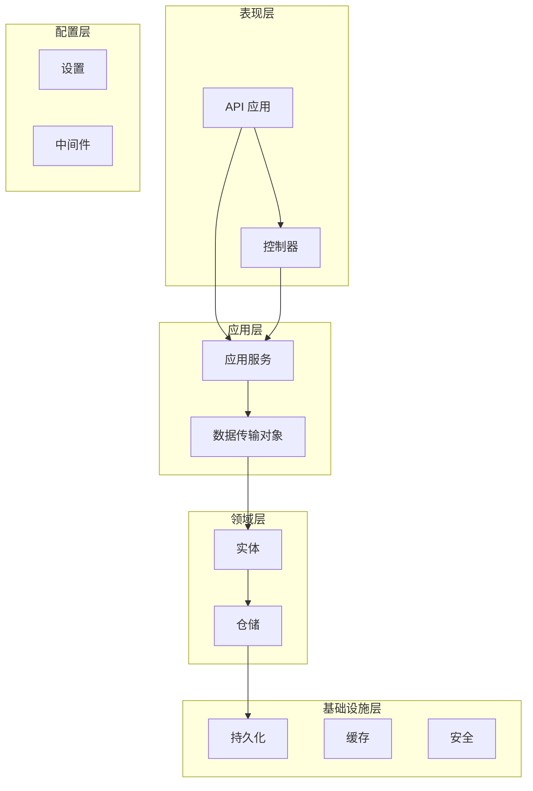
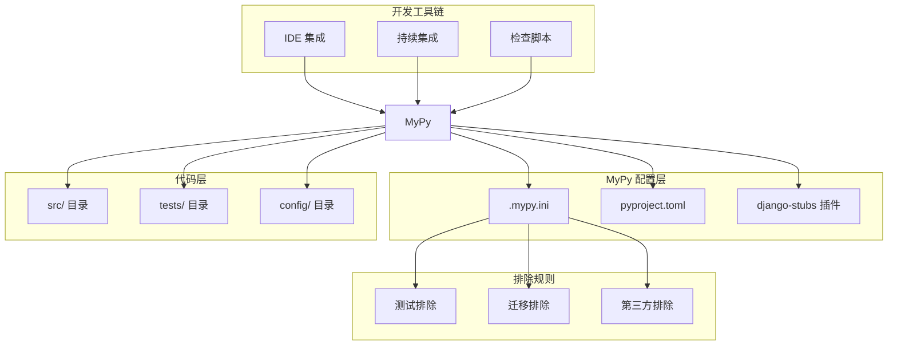
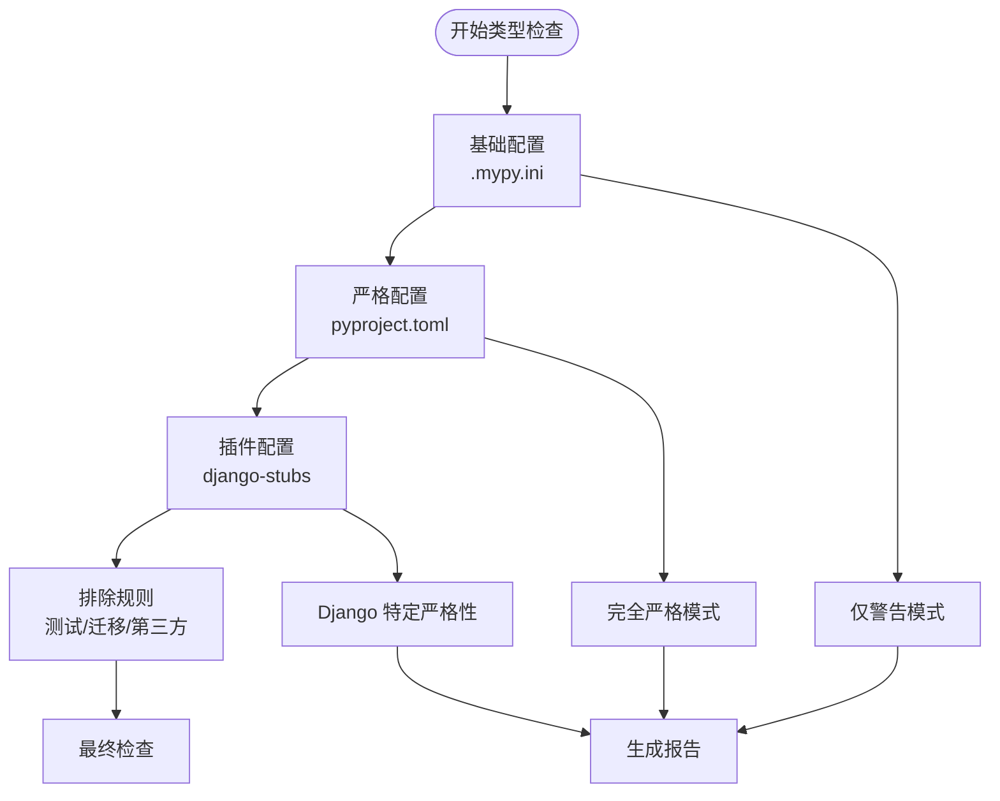
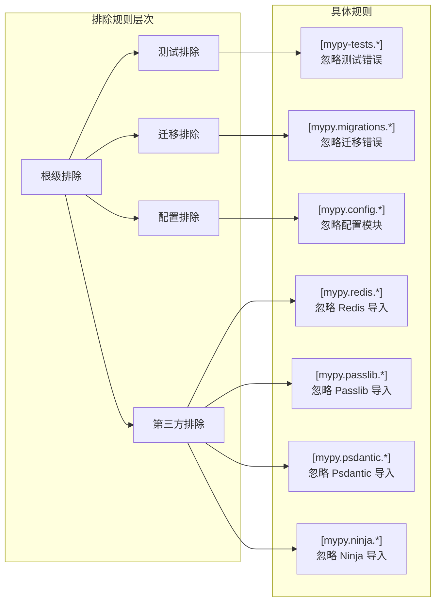
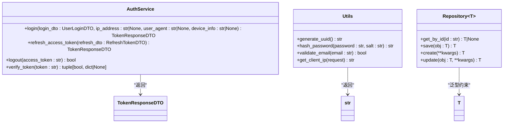
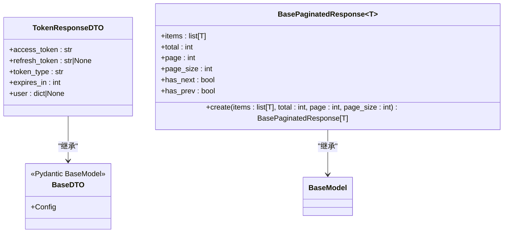
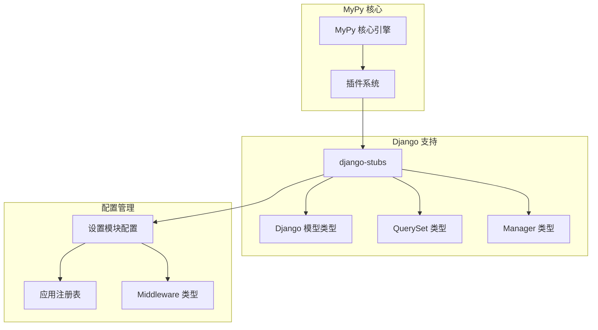
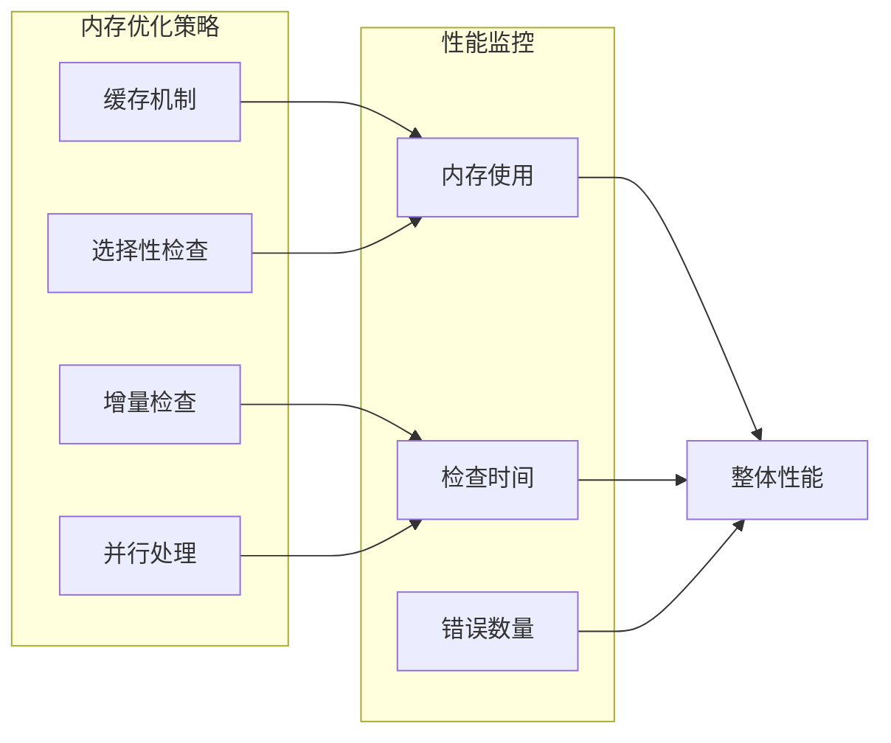

# MyPy 类型检查工具

<cite>
**本文档引用的文件**
- [.mypy.ini](file://.mypy.ini)
- [pyproject.toml](file://pyproject.toml)
- [scripts/lint.sh](file://scripts/lint.sh)
- [scripts/check_and_fix.py](file://scripts/check_and_fix.py)
- [scripts/simple_check.py](file://scripts/simple_check.py)
- [src/api/app.py](file://src/api/app.py)
- [src/application/services/auth_service.py](file://src/application/services/auth_service.py)
- [src/core/utils.py](file://src/core/utils.py)
- [src/domain/rbac/entities/role_entity.py](file://src/domain/rbac/entities/role_entity.py)
- [src/application/dto/auth/token_response_dto.py](file://src/application/dto/auth/token_response_dto.py)
- [src/application/dto/common/base.py](file://src/application/dto/common/base.py)
- [src/infrastructure/repositories/base_repository.py](file://src/infrastructure/repositories/base_repository.py)
- [config/settings/base.py](file://config/settings/base.py)
- [tests/test_api/test_auth_api.py](file://tests/test_api/test_auth_api.py)
- [tests/conftest.py](file://tests/conftest.py)
</cite>

## 目录
1. [简介](#简介)
2. [项目结构](#项目结构)
3. [核心组件](#核心组件)
4. [架构概览](#架构概览)
5. [详细组件分析](#详细组件分析)
6. [依赖分析](#依赖分析)
7. [性能考虑](#性能考虑)
8. [故障排除指南](#故障排除指南)
9. [结论](#结论)
10. [附录](#附录)

## 简介

MyPy 是一个静态类型检查工具，它能够帮助开发者在运行代码之前发现类型相关的错误。在本 Django Ninja API 项目中，MyPy 被配置为开发流程的重要组成部分，用于确保代码的类型安全性和可维护性。

该项目采用了现代的 Python 开发实践，结合了 Django、Django-Ninja 和 Pydantic 等技术栈，通过 MyPy 的静态类型检查来提升代码质量。项目中的类型注解涵盖了从基础数据类型到复杂泛型的各个方面。

## 项目结构

项目采用分层架构设计，主要包含以下层次：



**图表来源**
- [src/api/app.py:1-48](file://src/api/app.py#L1-L48)
- [src/application/services/auth_service.py:1-233](file://src/application/services/auth_service.py#L1-L233)
- [src/domain/rbac/entities/role_entity.py:1-80](file://src/domain/rbac/entities/role_entity.py#L1-L80)

**章节来源**
- [src/api/app.py:1-48](file://src/api/app.py#L1-L48)
- [src/application/services/auth_service.py:1-233](file://src/application/services/auth_service.py#L1-L233)
- [src/domain/rbac/entities/role_entity.py:1-80](file://src/domain/rbac/entities/role_entity.py#L1-L80)

## 核心组件

### MyPy 配置系统

项目使用了两种配置方式来管理 MyPy 设置：

1. **传统配置文件 (.mypy.ini)**：提供基础的类型检查规则
2. **现代配置 (pyproject.toml)**：通过工具特定的配置段提供更精细的控制

#### 配置文件对比

| 配置项 | .mypy.ini | pyproject.toml |
|--------|-----------|----------------|
| Python 版本 | 3.10 | 3.10 |
| 未注解定义检查 | 启用 | 关闭 |
| 未注解函数检查 | 启用 | 关闭 |
| 未注解导入忽略 | 启用 | 启用 |
| 可选类型严格性 | 启用 | 关闭 |
| 明确包基础 | 启用 | 启用 |

**章节来源**
- [.mypy.ini:1-45](file://.mypy.ini#L1-L45)
- [pyproject.toml:72-86](file://pyproject.toml#L72-L86)

### 类型注解规范

项目中的类型注解遵循以下规范：

1. **函数参数注解**：所有公共函数都包含完整的参数类型注解
2. **返回值注解**：明确标注函数的返回类型
3. **泛型使用**：合理使用 TypeVar 和 Generic 来实现类型安全
4. **联合类型**：使用 `|` 操作符表示可选类型

**章节来源**
- [src/application/services/auth_service.py:26-32](file://src/application/services/auth_service.py#L26-L32)
- [src/core/utils.py:24-32](file://src/core/utils.py#L24-L32)
- [src/infrastructure/repositories/base_repository.py:30-36](file://src/infrastructure/repositories/base_repository.py#L30-L36)

## 架构概览

MyPy 在项目中的集成架构如下：



**图表来源**
- [.mypy.ini:19-45](file://.mypy.ini#L19-L45)
- [pyproject.toml:33-36](file://pyproject.toml#L33-L36)
- [scripts/lint.sh:18-21](file://scripts/lint.sh#L18-L21)

**章节来源**
- [.mypy.ini:19-45](file://.mypy.ini#L19-L45)
- [pyproject.toml:33-36](file://pyproject.toml#L33-L36)
- [scripts/lint.sh:18-21](file://scripts/lint.sh#L18-L21)

## 详细组件分析

### 类型检查策略

#### 严格性级别分析

项目采用了渐进式的严格性策略：



**图表来源**
- [.mypy.ini:3-17](file://.mypy.ini#L3-L17)
- [pyproject.toml:72-86](file://pyproject.toml#L72-L86)

#### 配置选项详解

| 配置选项 | .mypy.ini 值 | pyproject.toml 值 | 作用描述 |
|----------|-------------|-------------------|----------|
| python_version | 3.10 | 3.10 | 指定 Python 版本兼容性 |
| check_untyped_defs | true | false | 检查未注解的函数定义 |
| disallow_any_generics | false | false | 禁止使用 Any 泛型 |
| disallow_incomplete_defs | false | false | 禁止不完整定义 |
| disallow_untyped_defs | false | false | 禁止未注解函数 |
| ignore_missing_imports | true | true | 忽略缺失的导入 |
| no_implicit_optional | true | false | 不允许隐式可选类型 |
| strict_optional | true | false | 严格可选类型检查 |
| warn_redundant_casts | true | false | 警告冗余类型转换 |
| warn_return_any | true | false | 警告返回 Any 类型 |

**章节来源**
- [.mypy.ini:4-16](file://.mypy.ini#L4-L16)
- [pyproject.toml:73-84](file://pyproject.toml#L73-L84)

### 排除文件配置

项目实现了多层次的排除策略：



**图表来源**
- [.mypy.ini:22-45](file://.mypy.ini#L22-L45)

**章节来源**
- [.mypy.ini:22-45](file://.mypy.ini#L22-L45)

### 集成点分析

#### 命令行使用方法

项目提供了多种 MyPy 使用方式：

1. **直接命令行调用**
   ```bash
   mypy src/
   ```

2. **通过脚本执行**
   ```bash
   ./scripts/lint.sh
   python scripts/check_and_fix.py
   ```

3. **在 CI/CD 流程中使用**
   ```bash
   .venv/Scripts/python.exe -m mypy src/
   ```

**章节来源**
- [scripts/lint.sh:20](file://scripts/lint.sh#L20)
- [scripts/check_and_fix.py:61](file://scripts/check_and_fix.py#L61)
- [scripts/simple_check.py:30](file://scripts/simple_check.py#L30)

#### IDE 集成

项目支持多种 IDE 的 MyPy 集成：

1. **VS Code 配置**
   - 安装 Python 扩展
   - 配置 Python 解释器指向虚拟环境
   - 启用内置的 Python 类型检查

2. **PyCharm 配置**
   - 打开 Settings → Project → Python Interpreter
   - 添加 MyPy 作为外部工具
   - 配置运行参数为 `mypy src/`

3. **Vim/Neovim 配置**
   - 使用 ALE 或 coc.nvim
   - 配置 mypy 作为语言服务器

### 类型注解最佳实践

#### 函数参数和返回值类型注解

项目中的函数注解体现了良好的类型安全实践：



**图表来源**
- [src/application/services/auth_service.py:26-189](file://src/application/services/auth_service.py#L26-L189)
- [src/core/utils.py:14-84](file://src/core/utils.py#L14-L84)
- [src/infrastructure/repositories/base_repository.py:19-89](file://src/infrastructure/repositories/base_repository.py#L19-L89)

**章节来源**
- [src/application/services/auth_service.py:26-189](file://src/application/services/auth_service.py#L26-L189)
- [src/core/utils.py:14-84](file://src/core/utils.py#L14-L84)
- [src/infrastructure/repositories/base_repository.py:19-89](file://src/infrastructure/repositories/base_repository.py#L19-L89)

#### 泛型使用

项目广泛使用泛型来实现类型安全的抽象：

1. **基础仓储泛型**
   ```python
   T = TypeVar("T", bound=models.Model)
   class BaseRepository(Generic[T]):
       def get_by_id(self, id: str) -> T | None:
           # 实现
   ```

2. **DTO 泛型**
   ```python
   class BasePaginatedResponse(BaseModel, Generic[T]):
       items: list[T]
   ```

**章节来源**
- [src/infrastructure/repositories/base_repository.py:10](file://src/infrastructure/repositories/base_repository.py#L10)
- [src/application/dto/common/base.py:29](file://src/application/dto/common/base.py#L29)

#### 协议定义

项目使用 Pydantic 模型进行数据验证和序列化：



**图表来源**
- [src/application/dto/auth/token_response_dto.py:9-31](file://src/application/dto/auth/token_response_dto.py#L9-L31)
- [src/application/dto/common/base.py:14](file://src/application/dto/common/base.py#L14)
- [src/application/dto/common/base.py:29](file://src/application/dto/common/base.py#L29)

**章节来源**
- [src/application/dto/auth/token_response_dto.py:9-31](file://src/application/dto/auth/token_response_dto.py#L9-L31)
- [src/application/dto/common/base.py:14](file://src/application/dto/common/base.py#L14)
- [src/application/dto/common/base.py:29](file://src/application/dto/common/base.py#L29)

## 依赖分析

### MyPy 插件生态系统

项目使用了 django-stubs 插件来增强 Django 应用的类型检查能力：



**图表来源**
- [.mypy.ini:19-21](file://.mypy.ini#L19-L21)
- [pyproject.toml:89-91](file://pyproject.toml#L89-L91)

**章节来源**
- [.mypy.ini:19-21](file://.mypy.ini#L19-L21)
- [pyproject.toml:89-91](file://pyproject.toml#L89-L91)

### 外部依赖集成

项目与多个第三方库的类型检查集成：

| 第三方库 | 类型检查需求 | 解决方案 |
|----------|-------------|----------|
| Django | 模型、查询集、管理器 | django-stubs 插件 |
| Django-Ninja | API 路由、请求响应 | 内置类型支持 |
| Pydantic | 数据验证、序列化 | BaseModel 类型 |
| Redis | 缓存操作 | 忽略导入错误 |
| Passlib | 密码哈希 | 忽略导入错误 |

**章节来源**
- [.mypy.ini:34-44](file://.mypy.ini#L34-L44)
- [pyproject.toml:11-24](file://pyproject.toml#L11-L24)

## 性能考虑

### 类型检查性能优化

1. **增量检查**
   - 使用 `--incremental` 参数启用增量检查
   - 配置 `cache_dir` 指定缓存目录

2. **并行检查**
   - 使用 `--jobs N` 参数启用多进程检查
   - 根据 CPU 核心数调整并发度

3. **选择性检查**
   - 使用 `--package` 参数只检查特定包
   - 使用 `--module` 参数检查特定模块

### 内存使用优化



## 故障排除指南

### 常见类型检查问题

#### 1. 未注解函数警告

**问题描述**：函数缺少类型注解导致警告

**解决方案**：
```python
# 错误示例
def process_data(data):
    return data.upper()

# 正确示例
def process_data(data: str) -> str:
    return data.upper()
```

#### 2. 可选类型处理

**问题描述**：可选参数或返回值处理不当

**解决方案**：
```python
# 使用联合类型
def get_user(id: str) -> User | None:
    # 实现

# 使用类型别名
UserId = str | None
def process_user(user_id: UserId) -> bool:
    return user_id is not None
```

#### 3. 泛型类型错误

**问题描述**：泛型约束不匹配

**解决方案**：
```python
# 正确的泛型约束
T = TypeVar("T", bound=BaseModel)

class GenericRepository(Generic[T]):
    def get_by_id(self, id: str) -> T | None:
        # 实现
        pass
```

**章节来源**
- [src/application/services/auth_service.py:29](file://src/application/services/auth_service.py#L29)
- [src/core/utils.py:24](file://src/core/utils.py#L24)
- [src/infrastructure/repositories/base_repository.py:10](file://src/infrastructure/repositories/base_repository.py#L10)

### 调试技巧

#### 1. 详细错误信息

使用 `--show-error-context` 和 `--show-error-code-links` 获取更多上下文信息

#### 2. 逐步排除

```bash
# 从简单开始
mypy --strict src/core/utils.py

# 逐步增加严格性
mypy --strict --warn-return-any src/core/utils.py
```

#### 3. 配置验证

```bash
# 验证配置文件
mypy --config-file .mypy.ini --help

# 检查特定模块
mypy --package src.core.utils
```

## 结论

MyPy 在本项目中的集成体现了现代 Python 开发的最佳实践。通过合理的配置策略、严格的类型注解规范和完善的排除规则，项目实现了高质量的静态类型检查。

### 主要成就

1. **全面的配置覆盖**：同时使用 .mypy.ini 和 pyproject.toml 提供灵活的配置选项
2. **多层次排除策略**：针对测试、迁移和第三方库的专门排除规则
3. **插件生态集成**：通过 django-stubs 插件增强 Django 应用的类型检查能力
4. **自动化集成**：通过脚本和 CI/CD 流程实现 MyPy 的自动化执行

### 未来改进建议

1. **逐步提高严格性**：从当前的宽松配置逐步过渡到更严格的配置
2. **完善类型注解覆盖率**：确保所有公共 API 都有完整的类型注解
3. **性能优化**：实施增量检查和并行处理来提高检查效率
4. **IDE 集成优化**：改进开发环境中的类型检查体验

## 附录

### 配置文件参考

#### .mypy.ini 完整配置
- [配置文件路径:1-45](file://.mypy.ini#L1-L45)

#### pyproject.toml 配置
- [MyPy 配置段:72-86](file://pyproject.toml#L72-L86)
- [Django Stubs 配置:89-91](file://pyproject.toml#L89-L91)

### 脚本使用参考

#### Lint 脚本
- [Shell 脚本:1-23](file://scripts/lint.sh#L1-L23)

#### Python 检查脚本
- [综合检查脚本:1-67](file://scripts/check_and_fix.py#L1-L67)
- [简单检查脚本:1-46](file://scripts/simple_check.py#L1-L46)

### 代码示例参考

#### 类型注解示例
- [认证服务:26-189](file://src/application/services/auth_service.py#L26-L189)
- [工具函数:14-84](file://src/core/utils.py#L14-L84)
- [仓储基类:19-89](file://src/infrastructure/repositories/base_repository.py#L19-L89)

#### DTO 定义示例
- [Token 响应 DTO:9-31](file://src/application/dto/auth/token_response_dto.py#L9-L31)
- [基础 DTO 类:14-27](file://src/application/dto/common/base.py#L14-L27)