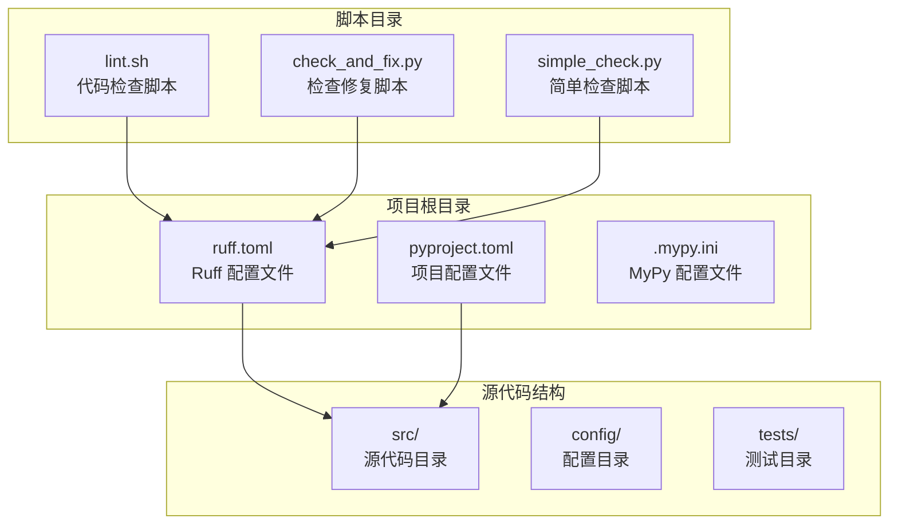
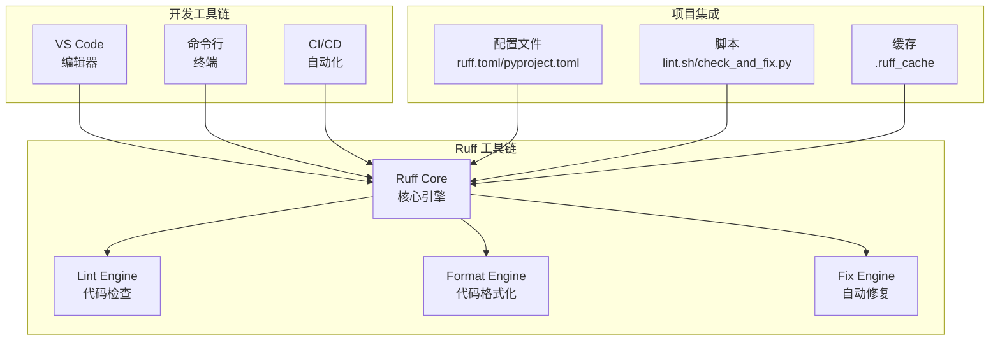
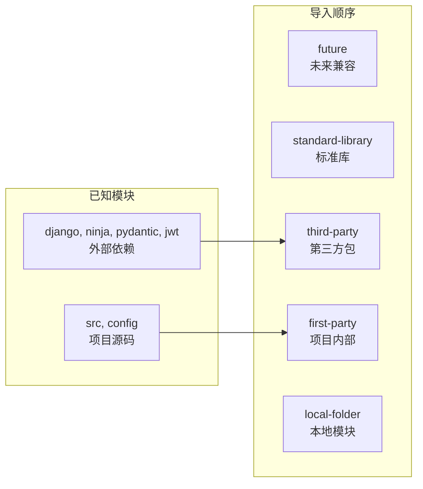
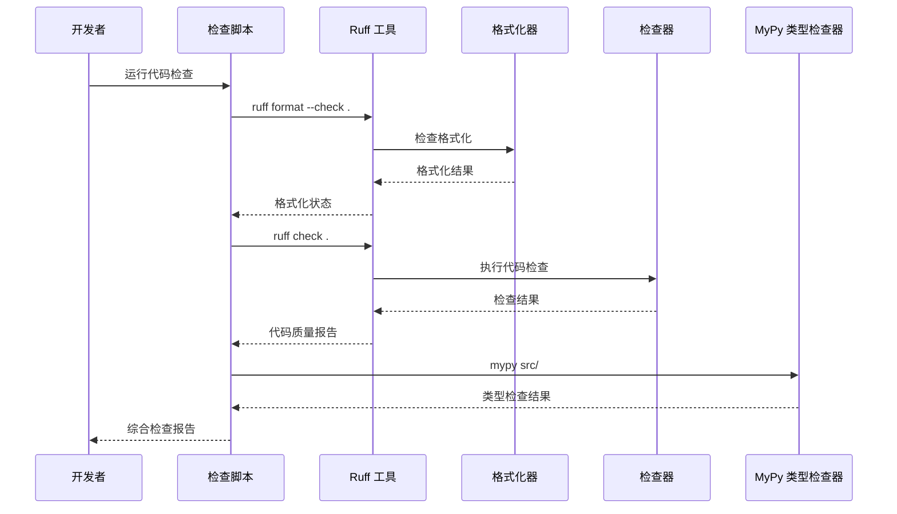
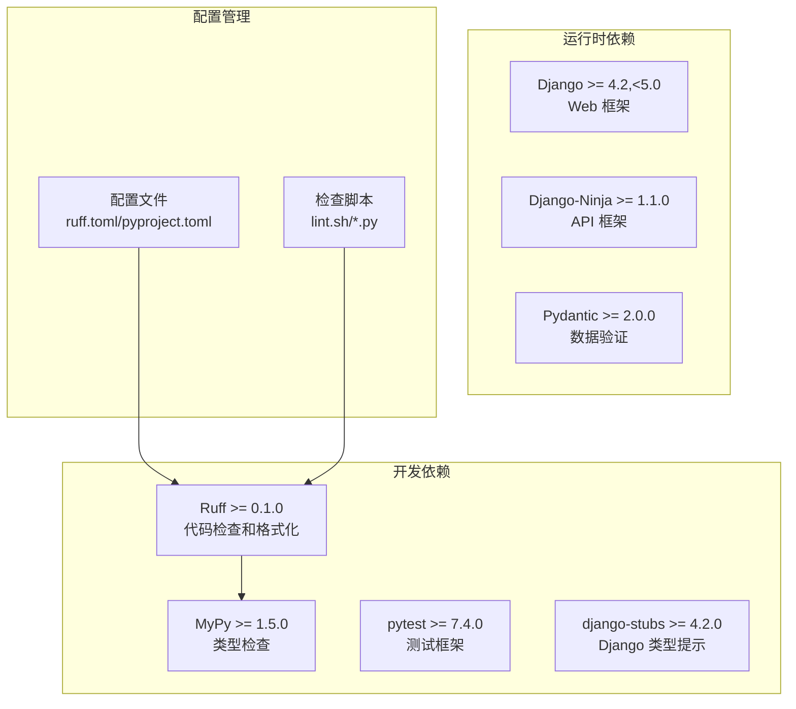

# Ruff 代码格式化工具

<cite>
**本文档引用的文件**
- [ruff.toml](file://ruff.toml)
- [pyproject.toml](file://pyproject.toml)
- [lint.sh](file://scripts/lint.sh)
- [check_and_fix.py](file://scripts/check_and_fix.py)
- [simple_check.py](file://scripts/simple_check.py)
- [.mypy.ini](file://.mypy.ini)
- [requirements.txt](file://requirements.txt)
- [app.py](file://src/api/app.py)
- [base.py](file://config/settings/base.py)
</cite>

## 目录
1. [简介](#简介)
2. [项目结构](#项目结构)
3. [核心组件](#核心组件)
4. [架构概览](#架构概览)
5. [详细组件分析](#详细组件分析)
6. [依赖分析](#依赖分析)
7. [性能考虑](#性能考虑)
8. [故障排除指南](#故障排除指南)
9. [结论](#结论)

## 简介

Ruff 是一个快速的 Python 代码检查和格式化工具，专为现代 Python 开发工作流设计。它结合了多个静态分析工具的功能，提供了统一的接口来执行代码质量检查、格式化和重构建议。

在本 Django 项目中，Ruff 被配置为代码质量保证的核心工具，与 MyPy 类型检查器配合使用，确保代码的一致性和可维护性。该项目采用了严格的代码规范，包括 100 字符行长限制、双引号字符串风格、空格缩进等标准。

## 项目结构

该项目采用分层架构设计，包含以下主要组件：



**图表来源**
- [ruff.toml:1-54](file://ruff.toml#L1-L54)
- [pyproject.toml:1-131](file://pyproject.toml#L1-L131)

**章节来源**
- [ruff.toml:1-54](file://ruff.toml#L1-L54)
- [pyproject.toml:1-131](file://pyproject.toml#L1-L131)

## 核心组件

### Ruff 配置系统

Ruff 在项目中通过两个主要配置文件进行管理：

#### 主配置文件 (ruff.toml)
这是专门针对 Ruff 工具的配置文件，提供了详细的规则集和格式化设置。

#### 项目配置文件 (pyproject.toml)
这是标准的 Python 项目配置文件，包含了开发依赖和工具配置。

### 规则集配置

项目启用了以下核心规则集：
- **E/W**: pycodestyle 错误和警告检查
- **F**: pyflakes 语法检查
- **I**: isort 导入排序
- **N**: pep8-naming 命名约定
- **UP**: pyupgrade 语法升级
- **B**: flake8-bugbear 常见错误检测
- **C4**: flake8-comprehensions 推导式优化
- **SIM**: flake8-simplify 代码简化
- **ARG**: flake8-unused-arguments 未使用参数检测
- **PTH**: flake8-use-pathlib pathlib 使用建议
- **PERF**: flake8-perf 性能优化

### 格式化设置

项目采用统一的格式化标准：
- **行长度**: 100 字符
- **目标版本**: Python 3.10
- **引号风格**: 双引号
- **缩进风格**: 空格缩进
- **行结尾**: 自动检测

**章节来源**
- [ruff.toml:4-52](file://ruff.toml#L4-L52)
- [pyproject.toml:42-71](file://pyproject.toml#L42-L71)

## 架构概览

Ruff 在项目中的集成架构如下：



**图表来源**
- [ruff.toml:1-54](file://ruff.toml#L1-L54)
- [pyproject.toml:27-36](file://pyproject.toml#L27-L36)

## 详细组件分析

### 导入排序配置 (isort)

项目使用 isort 进行导入排序，配置了明确的模块分类：



**图表来源**
- [ruff.toml:41-45](file://ruff.toml#L41-L45)

**章节来源**
- [ruff.toml:41-45](file://ruff.toml#L41-L45)

### 项目特定规则忽略配置

项目实现了精细的规则忽略策略，针对不同文件类型设置了特殊的处理规则：

| 文件模式 | 忽略规则 | 说明 |
|---------|---------|------|
| `__init__.py` | `F401` | 允许未使用的导入，支持包初始化 |
| `*/migrations/*` | `F401`, `N806` | 迁移文件特殊处理 |
| `*/tests/*` | `S101`, `BLE001`, `B017`, `E402` | 测试文件放宽限制 |
| `config/*` | `F403`, `F405` | 配置文件特殊处理 |

### 代码检查流程



**图表来源**
- [lint.sh:10-20](file://scripts/lint.sh#L10-L20)
- [check_and_fix.py:31-47](file://scripts/check_and_fix.py#L31-L47)

**章节来源**
- [lint.sh:1-23](file://scripts/lint.sh#L1-L23)
- [check_and_fix.py:1-67](file://scripts/check_and_fix.py#L1-L67)

### 实际使用示例

#### 基础检查命令
```bash
# 检查格式化
ruff format --check .

# 执行代码检查
ruff check .

# 自动修复可修复的问题
ruff check --fix
```

#### 高级使用场景
```bash
# 检查特定目录
ruff check src/ tests/ config/

# 显示详细信息
ruff check --show-source --show-error-codes

# 输出 JSON 格式
ruff check --output-format json
```

**章节来源**
- [simple_check.py:11-17](file://scripts/simple_check.py#L11-L17)
- [check_and_fix.py:32-46](file://scripts/check_and_fix.py#L32-L46)

## 依赖分析

### 开发依赖配置

项目使用 pyproject.toml 管理开发依赖，其中包含了 Ruff 的配置：



**图表来源**
- [pyproject.toml:27-36](file://pyproject.toml#L27-L36)
- [requirements.txt:11-24](file://requirements.txt#L11-L24)

### 版本兼容性

项目确保了与 Python 3.10+ 的兼容性，并选择了稳定的依赖版本组合：

- **Python 版本**: >= 3.10.11
- **Django**: 4.2.x 系列
- **Django-Ninja**: 1.x 系列
- **Ruff**: >= 0.1.0

**章节来源**
- [pyproject.toml:6](file://pyproject.toml#L6)
- [pyproject.toml:32](file://pyproject.toml#L32)
- [requirements.txt:2-8](file://requirements.txt#L2-L8)

## 性能考虑

### 缓存机制

Ruff 实现了智能缓存机制来提高检查性能：

- **缓存目录**: `.ruff_cache/`
- **缓存内容**: 编译后的 AST 和检查结果
- **缓存清理**: 自动失效和手动清理

### 并行处理

Ruff 支持并行处理多个文件，提高了大型项目的检查速度：

- **线程池**: 自动管理的工作线程
- **文件扫描**: 并行文件读取和解析
- **规则执行**: 并行规则检查

### 内存优化

项目配置了合理的内存使用策略：

- **默认内存**: 通常不需要额外配置
- **大文件处理**: 自动降级到单线程模式
- **缓存大小**: 可配置的缓存上限

## 故障排除指南

### 常见问题及解决方案

#### 格式化冲突
当格式化器和检查器产生冲突时，优先遵循格式化器的规则，因为格式化器负责代码风格一致性。

#### 规则忽略问题
如果某些规则被过度忽略，建议逐步减少忽略列表中的规则，以提高代码质量。

#### 性能问题
对于大型项目，可以考虑：
- 使用 `--ignore` 参数排除不相关的文件
- 配置缓存目录到更快的存储设备
- 调整并发线程数

### 调试技巧

```bash
# 查看详细的错误信息
ruff check --show-source --show-error-codes

# 指定输出格式便于解析
ruff check --output-format json

# 仅检查特定类型的文件
ruff check --extend-select F401,F403

# 显示修复建议
ruff check --fix --diff
```

**章节来源**
- [check_and_fix.py:13-23](file://scripts/check_and_fix.py#L13-L23)

## 结论

本项目成功地将 Ruff 集成为代码质量保证的核心工具，通过精心配置的规则集和格式化标准，确保了代码的一致性和可维护性。项目的主要优势包括：

1. **全面的规则覆盖**: 包含了从语法检查到性能优化的全方位规则
2. **灵活的配置系统**: 支持针对不同文件类型的特殊处理
3. **高效的执行流程**: 通过缓存和并行处理提升性能
4. **完善的开发工具链**: 与 MyPy 等其他工具形成互补

通过遵循这些配置和最佳实践，开发者可以确保代码质量的一致性，减少潜在的错误，并提高团队协作效率。建议在新项目中直接参考本项目的配置作为起点，根据具体需求进行微调。