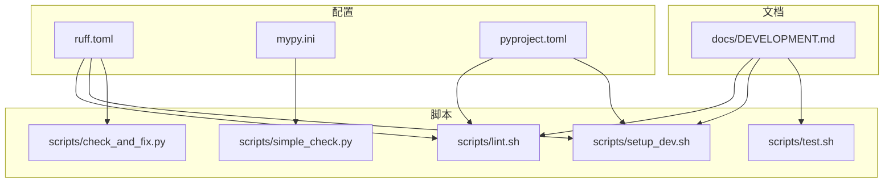
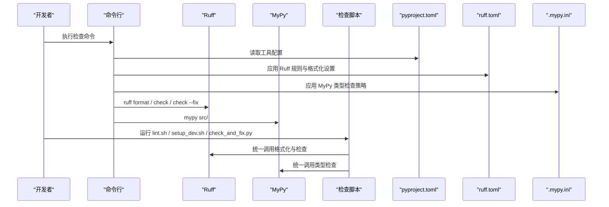
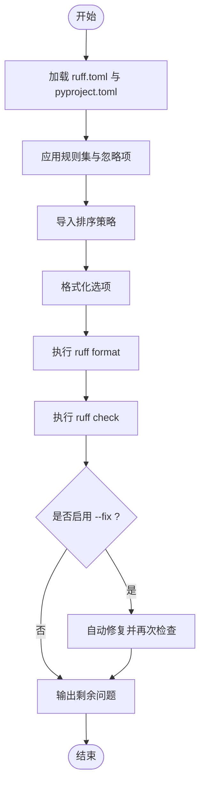
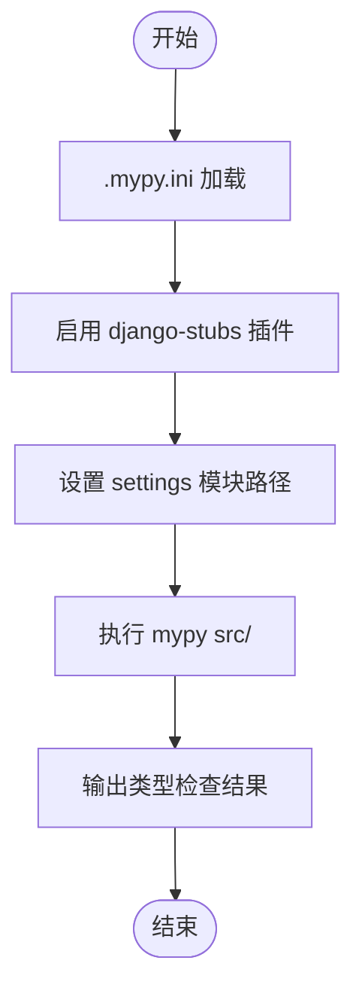
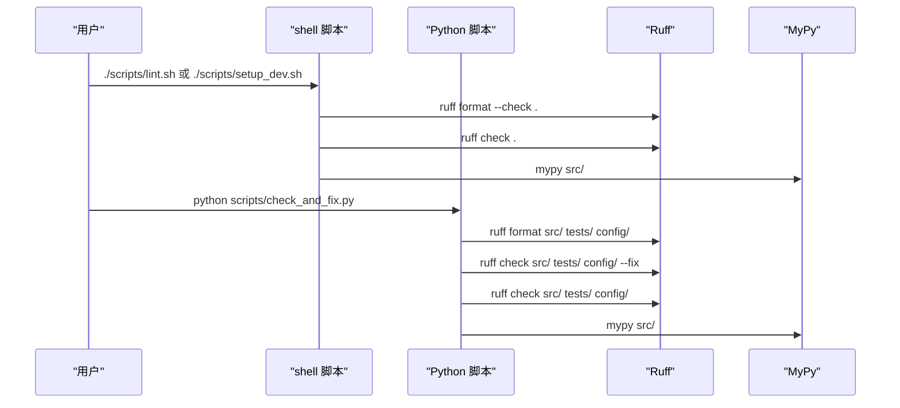
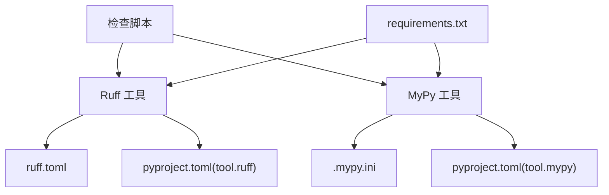

# 代码质量工具

<cite>
**本文引用的文件**
- [ruff.toml](file://ruff.toml)
- [.mypy.ini](file://.mypy.ini)
- [pyproject.toml](file://pyproject.toml)
- [check_and_fix.py](file://scripts/check_and_fix.py)
- [simple_check.py](file://scripts/simple_check.py)
- [lint.sh](file://scripts/lint.sh)
- [setup_dev.sh](file://scripts/setup_dev.sh)
- [test.sh](file://scripts/test.sh)
- [DEVELOPMENT.md](file://docs/DEVELOPMENT.md)
- [requirements.txt](file://requirements.txt)
- [base.py](file://config/settings/base.py)
- [app.py](file://src/api/app.py)
- [user_service.py](file://src/application/services/user_service.py)
- [utils.py](file://src/core/utils.py)
</cite>

## 目录
1. [简介](#简介)
2. [项目结构](#项目结构)
3. [核心组件](#核心组件)
4. [架构总览](#架构总览)
5. [详细组件分析](#详细组件分析)
6. [依赖分析](#依赖分析)
7. [性能考虑](#性能考虑)
8. [故障排查指南](#故障排查指南)
9. [结论](#结论)
10. [附录](#附录)

## 简介
本文件面向开发者与技术团队，系统性介绍本项目中使用的代码质量工具链，包括 Ruff（格式化与静态检查）、MyPy（类型检查），以及配套的检查脚本与自动化流程。文档覆盖配置要点、命令使用、自动修复机制、类型注解策略、CI/CD 集成建议与 IDE 实时检查配置，帮助团队统一风格、提升可维护性与稳定性。

## 项目结构
本项目围绕“配置文件 + 脚本 + 文档”的方式组织质量工具：
- 配置文件：ruff.toml、.mypy.ini、pyproject.toml
- 脚本：lint.sh、setup_dev.sh、test.sh、check_and_fix.py、simple_check.py
- 文档：DEVELOPMENT.md 提供快速上手与命令参考
- 示例代码：src 下的服务与工具模块体现类型注解与风格实践

图表来源
- [ruff.toml:1-54](file://ruff.toml#L1-L54)
- [.mypy.ini:1-45](file://.mypy.ini#L1-L45)
- [pyproject.toml:1-131](file://pyproject.toml#L1-L131)
- [lint.sh:1-23](file://scripts/lint.sh#L1-L23)
- [setup_dev.sh:1-47](file://scripts/setup_dev.sh#L1-L47)
- [test.sh:1-14](file://scripts/test.sh#L1-L14)
- [check_and_fix.py:1-67](file://scripts/check_and_fix.py#L1-L67)
- [simple_check.py:1-46](file://scripts/simple_check.py#L1-L46)
- [DEVELOPMENT.md:1-227](file://docs/DEVELOPMENT.md#L1-L227)

章节来源
- [DEVELOPMENT.md:1-227](file://docs/DEVELOPMENT.md#L1-L227)
- [pyproject.toml:1-131](file://pyproject.toml#L1-L131)

## 核心组件
- Ruff 配置与命令
  - 格式化：ruff format
  - 检查：ruff check
  - 自动修复：ruff check --fix
  - 针对项目源码、测试与配置目录的批量检查
- MyPy 配置与命令
  - 针对 src 的类型检查
  - 集成 Django stubs 插件，支持 settings 模块路径
- 检查脚本
  - lint.sh：Linux/Mac 平台的统一检查流程
  - setup_dev.sh：开发环境初始化与一键检查
  - check_and_fix.py：Windows 下的全流程检查与修复
  - simple_check.py：最小化检查流程示例
- CI/CD 集成
  - 在流水线中顺序执行：格式化检查、代码检查、类型检查、测试与覆盖率
- IDE 实时检查
  - VS Code/PyCharm 等编辑器可直接读取 ruff.toml 与 .mypy.ini，实现保存即检

章节来源
- [ruff.toml:1-54](file://ruff.toml#L1-L54)
- [.mypy.ini:1-45](file://.mypy.ini#L1-L45)
- [pyproject.toml:1-131](file://pyproject.toml#L1-L131)
- [DEVELOPMENT.md:70-113](file://docs/DEVELOPMENT.md#L70-L113)
- [lint.sh:1-23](file://scripts/lint.sh#L1-L23)
- [setup_dev.sh:1-47](file://scripts/setup_dev.sh#L1-L47)
- [check_and_fix.py:1-67](file://scripts/check_and_fix.py#L1-L67)
- [simple_check.py:1-46](file://scripts/simple_check.py#L1-L46)

## 架构总览
下图展示从命令到工具再到脚本的整体工作流，以及配置文件对工具行为的影响。

图表来源
- [pyproject.toml:42-85](file://pyproject.toml#L42-L85)
- [ruff.toml:1-54](file://ruff.toml#L1-L54)
- [.mypy.ini:1-45](file://.mypy.ini#L1-L45)
- [lint.sh:1-23](file://scripts/lint.sh#L1-L23)
- [setup_dev.sh:1-47](file://scripts/setup_dev.sh#L1-L47)
- [check_and_fix.py:1-67](file://scripts/check_and_fix.py#L1-L67)

## 详细组件分析

### Ruff 配置与使用
- 规则选择与忽略
  - 启用 pycodestyle、pyflakes、isort、pep8-naming、flake8-bugbear、flake8-comprehensions、flake8-simplify、pyupgrade、flake8-perf 等规则集
  - 对行长度、复杂度、裸异常等进行策略性忽略，以适配 API 参数默认值、测试场景与迁移文件
- 文件级忽略
  - 对 __init__.py、migrations、tests、config 等目录设置差异化规则，平衡一致性与实用性
- 导入排序
  - 指定 first-party 与 third-party 包，按标准库、第三方、本地包顺序排列
- 格式化选项
  - 双引号、空格缩进、保留尾随逗号、自动换行符
- 命令与用途
  - 格式化：ruff format src/ tests/ config/
  - 检查：ruff check src/ tests/ config/
  - 自动修复：ruff check src/ tests/ config/ --fix
- 与 pyproject.toml 的协同
  - pyproject.toml 中的 [tool.ruff] 与 [tool.ruff.format] 与 ruff.toml 内容保持一致，便于跨平台与工具链统一

图表来源
- [ruff.toml:7-53](file://ruff.toml#L7-L53)
- [pyproject.toml:42-71](file://pyproject.toml#L42-L71)
- [DEVELOPMENT.md:70-81](file://docs/DEVELOPMENT.md#L70-L81)

章节来源
- [ruff.toml:1-54](file://ruff.toml#L1-L54)
- [pyproject.toml:42-71](file://pyproject.toml#L42-L71)
- [DEVELOPMENT.md:70-81](file://docs/DEVELOPMENT.md#L70-L81)

### MyPy 配置与使用
- 基本策略
  - Python 版本 3.10；宽松的未类型化检查策略，避免过度严格导致阻塞
  - 启用严格可选与冗余转换告警，兼顾安全性与可演进性
  - 忽略缺失导入，适配部分第三方库与 Django 插件
- Django 集成
  - 通过插件与 settings 模块路径，使 MyPy 能理解 Django 模型与 ORM
- 文件级忽略
  - tests、migrations、config 等目录放宽类型检查，聚焦核心业务代码
- 命令与用途
  - 类型检查：mypy src/

图表来源
- [.mypy.ini:1-45](file://.mypy.ini#L1-L45)
- [pyproject.toml:89-91](file://pyproject.toml#L89-L91)
- [DEVELOPMENT.md:83-88](file://docs/DEVELOPMENT.md#L83-L88)

章节来源
- [.mypy.ini:1-45](file://.mypy.ini#L1-L45)
- [pyproject.toml:72-85](file://pyproject.toml#L72-L85)
- [DEVELOPMENT.md:83-88](file://docs/DEVELOPMENT.md#L83-L88)

### 检查脚本与自动化流程
- lint.sh（Linux/Mac）
  - 激活虚拟环境后依次执行：格式化检查、代码检查、类型检查
- setup_dev.sh（Linux/Mac）
  - 初始化虚拟环境与依赖，执行格式化、检查、类型检查，并运行测试
- check_and_fix.py（Windows）
  - 顺序执行：格式化 → 检查并自动修复 → 再次检查 → 类型检查
- simple_check.py（最小化）
  - 直接调用 ruff check 与 mypy，适合快速验证

图表来源
- [lint.sh:1-23](file://scripts/lint.sh#L1-L23)
- [setup_dev.sh:1-47](file://scripts/setup_dev.sh#L1-L47)
- [check_and_fix.py:1-67](file://scripts/check_and_fix.py#L1-L67)
- [simple_check.py:1-46](file://scripts/simple_check.py#L1-L46)

章节来源
- [lint.sh:1-23](file://scripts/lint.sh#L1-L23)
- [setup_dev.sh:1-47](file://scripts/setup_dev.sh#L1-L47)
- [check_and_fix.py:1-67](file://scripts/check_and_fix.py#L1-L67)
- [simple_check.py:1-46](file://scripts/simple_check.py#L1-L46)
- [DEVELOPMENT.md:103-113](file://docs/DEVELOPMENT.md#L103-L113)

### 类型注解规范与最佳实践
- 核心原则
  - 优先为函数参数、返回值与类属性添加明确类型注解
  - 使用 Optional、Union、List、Dict 等标准泛型容器
  - 利用 Pydantic DTO 作为接口契约，减少类型歧义
- 实践示例
  - 服务层：方法参数与返回值使用明确类型，如字符串 ID、DTO、可选值
  - 工具层：输入输出类型清晰，避免 Any
- 与 MyPy 协同
  - 通过 django-stubs 与 settings 路径，MyPy 能识别 Django 模型与查询行为
  - 对第三方库缺失类型定义的模块，采用忽略缺失导入策略

章节来源
- [user_service.py:1-172](file://src/application/services/user_service.py#L1-L172)
- [utils.py:1-184](file://src/core/utils.py#L1-L184)
- [.mypy.ini:19-44](file://.mypy.ini#L19-L44)
- [pyproject.toml:89-91](file://pyproject.toml#L89-L91)

### 代码风格与 PEP 8 统一
- 导入排序与分组
  - 依据 ruff.toml 的 known-* 与 section-order，将标准库、第三方、本地包有序排列
- 字符串与缩进
  - 双引号、空格缩进、保留尾随逗号，确保跨编辑器一致性
- 文件级差异
  - __init__.py、migrations、tests、config 等目录采用差异化规则，兼顾可用性与一致性

章节来源
- [ruff.toml:41-53](file://ruff.toml#L41-L53)
- [DEVELOPMENT.md:223-227](file://docs/DEVELOPMENT.md#L223-L227)

### CI/CD 集成建议
- 推荐流水线步骤
  - 安装依赖（含 dev 依赖）
  - Ruff 格式化检查
  - Ruff 代码检查与自动修复（可选）
  - MyPy 类型检查
  - pytest 测试与覆盖率生成
- 与现有脚本配合
  - 使用 lint.sh 与 test.sh 作为流水线步骤
  - 在 Windows 环境使用 check_and_fix.py

章节来源
- [setup_dev.sh:21-43](file://scripts/setup_dev.sh#L21-L43)
- [test.sh:1-14](file://scripts/test.sh#L1-L14)
- [DEVELOPMENT.md:103-113](file://docs/DEVELOPMENT.md#L103-L113)

### IDE 实时检查配置
- VS Code
  - 安装 Python 与相关扩展，确保解释器指向项目虚拟环境
  - 打开工作区后，VS Code 会自动读取 ruff.toml 与 .mypy.ini
  - 可配置保存时运行格式化与检查
- PyCharm
  - 在设置中指定外部工具：ruff 与 mypy
  - 配置代码检查触发时机（打开文件、保存、手动）

章节来源
- [DEVELOPMENT.md:68-88](file://docs/DEVELOPMENT.md#L68-L88)

## 依赖分析
- 工具依赖
  - Ruff 与 MyPy 通过 pyproject.toml 的 dev 依赖声明
  - requirements.txt 中包含 Django、Django-Ninja、Pydantic 等运行期依赖
- 配置耦合
  - ruff.toml 与 pyproject.toml 的 [tool.ruff] 配置保持一致，避免冲突
  - .mypy.ini 与 pyproject.toml 的 django-stubs 插件配置保持一致

图表来源
- [pyproject.toml:26-36](file://pyproject.toml#L26-L36)
- [requirements.txt:1-38](file://requirements.txt#L1-L38)
- [ruff.toml:1-54](file://ruff.toml#L1-L54)
- [.mypy.ini:1-45](file://.mypy.ini#L1-L45)

章节来源
- [pyproject.toml:26-36](file://pyproject.toml#L26-L36)
- [requirements.txt:1-38](file://requirements.txt#L1-L38)

## 性能考虑
- Ruff 的高性能特性
  - 以 Rust 实现，检查速度快，适合大型项目
  - 通过 per-file-ignores 与规则选择，减少不必要的检查开销
- MyPy 的渐进式改进
  - 当前策略偏向宽松，有助于快速落地；可逐步收紧策略以获得更高收益
- 脚本化批处理
  - 将格式化、检查、修复、类型检查整合为脚本，减少重复劳动与误操作

## 故障排查指南
- Ruff 报错但无法自动修复
  - 使用二次检查命令定位剩余问题
  - 检查 per-file-ignores 是否过于宽松
- MyPy 对 Django 模型报错
  - 确认 django-stubs 插件与 settings 路径配置正确
  - 对第三方缺失类型定义的模块，采用忽略缺失导入策略
- 脚本执行失败
  - 确保虚拟环境已激活且工具已安装
  - 在 Windows 上使用 check_and_fix.py，在 Linux/Mac 使用 lint.sh 或 setup_dev.sh

章节来源
- [check_and_fix.py:44-54](file://scripts/check_and_fix.py#L44-L54)
- [.mypy.ini:19-44](file://.mypy.ini#L19-L44)
- [pyproject.toml:89-91](file://pyproject.toml#L89-L91)
- [DEVELOPMENT.md:103-113](file://docs/DEVELOPMENT.md#L103-L113)

## 结论
本项目通过 ruff.toml 与 .mypy.ini 的合理配置，结合多平台检查脚本，构建了高效、可扩展的代码质量保障体系。建议团队在日常开发中坚持“保存即格式化、提交前检查与修复、合并前类型检查”的流程，并在 CI/CD 中强制执行，持续提升代码一致性与可维护性。

## 附录
- 常用命令速查
  - Ruff：格式化、检查、自动修复
  - MyPy：类型检查
  - 测试：pytest 与覆盖率
- 示例代码参考
  - API 应用与控制器注册
  - 业务服务与工具函数的类型注解实践

章节来源
- [DEVELOPMENT.md:70-113](file://docs/DEVELOPMENT.md#L70-L113)
- [app.py:1-48](file://src/api/app.py#L1-L48)
- [user_service.py:1-172](file://src/application/services/user_service.py#L1-L172)
- [utils.py:1-184](file://src/core/utils.py#L1-L184)