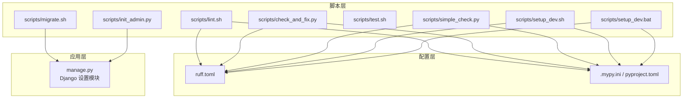
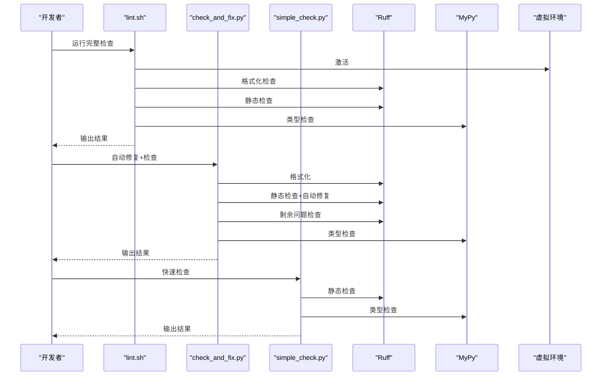
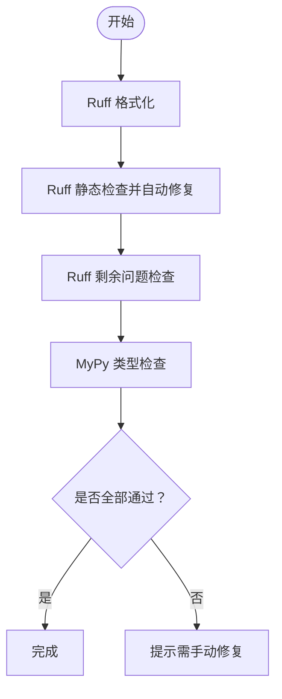
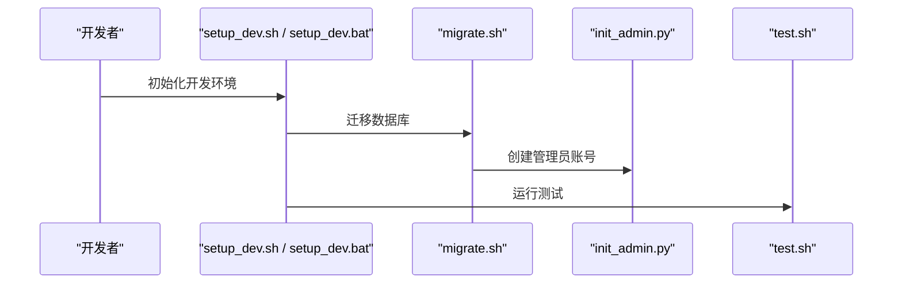
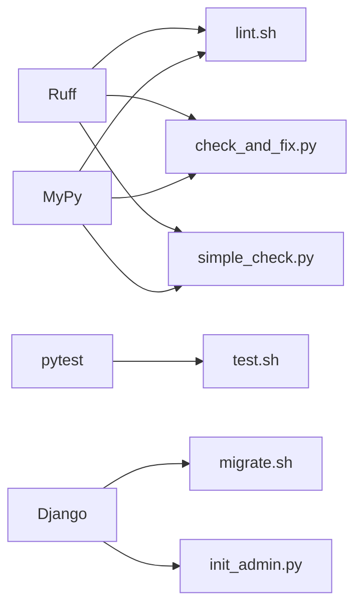

# 自动化检查脚本

<cite>
**本文引用的文件**
- [scripts/lint.sh](file://scripts/lint.sh)
- [scripts/check_and_fix.py](file://scripts/check_and_fix.py)
- [scripts/simple_check.py](file://scripts/simple_check.py)
- [scripts/migrate.sh](file://scripts/migrate.sh)
- [scripts/test.sh](file://scripts/test.sh)
- [scripts/setup_dev.sh](file://scripts/setup_dev.sh)
- [scripts/setup_dev.bat](file://scripts/setup_dev.bat)
- [scripts/init_admin.py](file://scripts/init_admin.py)
- [ruff.toml](file://ruff.toml)
- [.mypy.ini](file://.mypy.ini)
- [pyproject.toml](file://pyproject.toml)
- [requirements.txt](file://requirements.txt)
- [manage.py](file://manage.py)
</cite>

## 目录
1. [简介](#简介)
2. [项目结构](#项目结构)
3. [核心组件](#核心组件)
4. [架构总览](#架构总览)
5. [详细组件分析](#详细组件分析)
6. [依赖分析](#依赖分析)
7. [性能考虑](#性能考虑)
8. [故障排查指南](#故障排查指南)
9. [结论](#结论)
10. [附录](#附录)

## 简介
本文件面向开发者，系统性介绍项目中的自动化检查脚本体系，包括：
- lint.sh：一次性执行格式化、静态检查与类型检查的流水线脚本
- check_and_fix.py：自动修复优先的全流程检查与修复脚本
- simple_check.py：轻量级快速检查脚本，聚焦 Ruff 与 MyPy 的快速验证

文档将说明各脚本的功能、参数、执行流程、输出解读、在开发工作流中的定位，以及与 Git Hooks、CI/CD 的集成方式；并提供定制与扩展建议及常见问题排查。

## 项目结构
自动化检查脚本位于 scripts/ 目录，配合 Ruff 与 MyPy 的配置文件实现统一的代码质量保障。关键文件如下：
- scripts/lint.sh：Linux/macOS 平台的完整检查流水线
- scripts/check_and_fix.py：跨平台自动修复脚本
- scripts/simple_check.py：Windows/Linux 快速检查脚本
- ruff.toml：Ruff 规则与格式化策略
- .mypy.ini 或 pyproject.toml 中的 [tool.mypy] 配置：MyPy 类型检查策略
- scripts/test.sh、scripts/migrate.sh：测试与迁移辅助脚本
- scripts/setup_dev.sh、scripts/setup_dev.bat：开发环境初始化脚本（含检查步骤）
- scripts/init_admin.py：初始化管理员账号（依赖数据库迁移）

图表来源
- [scripts/lint.sh:1-23](file://scripts/lint.sh#L1-L23)
- [scripts/check_and_fix.py:1-67](file://scripts/check_and_fix.py#L1-L67)
- [scripts/simple_check.py:1-46](file://scripts/simple_check.py#L1-L46)
- [scripts/migrate.sh:1-12](file://scripts/migrate.sh#L1-L12)
- [scripts/test.sh:1-14](file://scripts/test.sh#L1-L14)
- [scripts/setup_dev.sh:1-47](file://scripts/setup_dev.sh#L1-L47)
- [scripts/setup_dev.bat:1-48](file://scripts/setup_dev.bat#L1-L48)
- [scripts/init_admin.py:1-84](file://scripts/init_admin.py#L1-L84)
- [ruff.toml:1-54](file://ruff.toml#L1-L54)
- [.mypy.ini:1-45](file://.mypy.ini#L1-L45)
- [pyproject.toml:42-86](file://pyproject.toml#L42-L86)
- [manage.py:1-23](file://manage.py#L1-L23)

章节来源
- [scripts/lint.sh:1-23](file://scripts/lint.sh#L1-L23)
- [scripts/check_and_fix.py:1-67](file://scripts/check_and_fix.py#L1-L67)
- [scripts/simple_check.py:1-46](file://scripts/simple_check.py#L1-L46)
- [ruff.toml:1-54](file://ruff.toml#L1-L54)
- [.mypy.ini:1-45](file://.mypy.ini#L1-L45)
- [pyproject.toml:42-86](file://pyproject.toml#L42-L86)
- [scripts/migrate.sh:1-12](file://scripts/migrate.sh#L1-L12)
- [scripts/test.sh:1-14](file://scripts/test.sh#L1-L14)
- [scripts/setup_dev.sh:1-47](file://scripts/setup_dev.sh#L1-L47)
- [scripts/setup_dev.bat:1-48](file://scripts/setup_dev.bat#L1-L48)
- [scripts/init_admin.py:1-84](file://scripts/init_admin.py#L1-L84)
- [manage.py:1-23](file://manage.py#L1-L23)

## 核心组件
- lint.sh（Linux/macOS）
  - 功能：激活虚拟环境后，依次执行 Ruff 格式化检查、Ruff 静态检查、MyPy 类型检查
  - 适用场景：本地完整检查、CI/CD 步骤
- check_and_fix.py（跨平台）
  - 功能：自动格式化 → 自动修复 → 剩余问题检查 → MyPy 类型检查
  - 适用场景：提交前自动修复、IDE 集成
- simple_check.py（快速检查）
  - 功能：直接调用 Ruff 与 MyPy，输出结果
  - 适用场景：快速验证、调试

章节来源
- [scripts/lint.sh:1-23](file://scripts/lint.sh#L1-L23)
- [scripts/check_and_fix.py:1-67](file://scripts/check_and_fix.py#L1-L67)
- [scripts/simple_check.py:1-46](file://scripts/simple_check.py#L1-L46)

## 架构总览
下图展示三个检查脚本与工具链的交互关系，以及它们在开发流程中的位置。

图表来源
- [scripts/lint.sh:1-23](file://scripts/lint.sh#L1-L23)
- [scripts/check_and_fix.py:1-67](file://scripts/check_and_fix.py#L1-L67)
- [scripts/simple_check.py:1-46](file://scripts/simple_check.py#L1-L46)
- [ruff.toml:1-54](file://ruff.toml#L1-L54)
- [.mypy.ini:1-45](file://.mypy.ini#L1-L45)

## 详细组件分析

### lint.sh（Linux/macOS 完整检查）
- 执行流程
  - 激活虚拟环境
  - Ruff 格式化检查（仅检查，不写入）
  - Ruff 静态检查（仅检查）
  - MyPy 类型检查（对 src/ 执行）
  - 输出完成提示
- 关键点
  - 严格区分“格式化检查”和“静态检查”，确保格式与逻辑问题分离
  - 适用于 CI/CD 的“只报告不修复”模式
- 参数与行为
  - 无命令行参数，固定检查范围为根目录
  - 返回码遵循各工具标准：0 成功，非 0 失败
- 输出解读
  - 成功：无错误信息，返回码 0
  - 失败：输出 Ruff/MyPy 报错详情，返回码非 0

章节来源
- [scripts/lint.sh:1-23](file://scripts/lint.sh#L1-L23)
- [ruff.toml:1-54](file://ruff.toml#L1-L54)
- [.mypy.ini:1-45](file://.mypy.ini#L1-L45)

### check_and_fix.py（自动修复优先）
- 执行流程
  - 自动格式化（ruff format）
  - 静态检查并自动修复（ruff check --fix）
  - 再次静态检查（ruff check），用于发现仍需人工处理的问题
  - MyPy 类型检查（对 src/ 执行）
- 关键点
  - 优先自动修复，减少人工干预
  - 最后一次检查用于暴露无法自动修复的问题
- 参数与行为
  - 无命令行参数，固定检查范围为 src/、tests/、config/
  - 返回码遵循各工具标准
- 输出解读
  - 成功：最后一次 Ruff 检查返回 0
  - 失败：输出剩余问题，提示需手动修复

图表来源
- [scripts/check_and_fix.py:1-67](file://scripts/check_and_fix.py#L1-L67)
- [ruff.toml:1-54](file://ruff.toml#L1-L54)
- [.mypy.ini:1-45](file://.mypy.ini#L1-L45)

章节来源
- [scripts/check_and_fix.py:1-67](file://scripts/check_and_fix.py#L1-L67)
- [ruff.toml:1-54](file://ruff.toml#L1-L54)
- [.mypy.ini:1-45](file://.mypy.ini#L1-L45)

### simple_check.py（快速检查）
- 执行流程
  - 调用 Ruff 对 src/、tests/、config/ 执行静态检查
  - 调用 MyPy 对 src/ 执行类型检查
- 关键点
  - 适合快速验证，便于 IDE 集成或本地调试
  - Windows 路径硬编码，需根据实际路径调整
- 参数与行为
  - 无命令行参数，固定检查范围
  - 返回码遵循各工具标准
- 输出解读
  - 成功：输出“通过”提示
  - 失败：输出 Ruff/MyPy 错误详情

章节来源
- [scripts/simple_check.py:1-46](file://scripts/simple_check.py#L1-L46)
- [ruff.toml:1-54](file://ruff.toml#L1-L54)
- [.mypy.ini:1-45](file://.mypy.ini#L1-L45)

### 配置文件与规则
- ruff.toml
  - 规则选择：启用 pycodestyle、pyflakes、isort、pep8-naming、pyupgrade、flake8-* 等
  - 忽略规则：针对行长、复杂度等进行策略性忽略
  - per-file-ignores：对 __init__.py、migrations、tests、config 等文件放宽规则
  - 格式化：双引号、空格缩进、换行符等
- .mypy.ini / pyproject.toml
  - MyPy 版本与严格程度控制
  - Django 插件与 settings 模块配置
  - 测试与迁移目录的忽略策略

章节来源
- [ruff.toml:1-54](file://ruff.toml#L1-L54)
- [.mypy.ini:1-45](file://.mypy.ini#L1-L45)
- [pyproject.toml:72-86](file://pyproject.toml#L72-L86)

### 与其他脚本的协作
- scripts/migrate.sh：数据库迁移与超级用户创建，为 init_admin.py 提供基础数据环境
- scripts/test.sh：测试执行，通常在检查通过后再运行
- scripts/setup_dev.sh / scripts/setup_dev.bat：开发环境初始化，内置 Ruff 格式化、检查与 MyPy 类型检查
- scripts/init_admin.py：通过 Django shell 创建初始管理员账号，内部先执行迁移

图表来源
- [scripts/setup_dev.sh:1-47](file://scripts/setup_dev.sh#L1-L47)
- [scripts/setup_dev.bat:1-48](file://scripts/setup_dev.bat#L1-L48)
- [scripts/migrate.sh:1-12](file://scripts/migrate.sh#L1-L12)
- [scripts/init_admin.py:1-84](file://scripts/init_admin.py#L1-L84)
- [scripts/test.sh:1-14](file://scripts/test.sh#L1-L14)

章节来源
- [scripts/migrate.sh:1-12](file://scripts/migrate.sh#L1-L12)
- [scripts/init_admin.py:1-84](file://scripts/init_admin.py#L1-L84)
- [scripts/test.sh:1-14](file://scripts/test.sh#L1-L14)
- [scripts/setup_dev.sh:1-47](file://scripts/setup_dev.sh#L1-L47)
- [scripts/setup_dev.bat:1-48](file://scripts/setup_dev.bat#L1-L48)

## 依赖分析
- 工具依赖
  - Ruff：格式化与静态检查
  - MyPy：类型检查（结合 Django 插件）
  - pytest：测试（与覆盖率报告）
- 项目依赖
  - requirements.txt：生产与开发依赖
  - pyproject.toml：工具链配置与可选依赖
- 环境要求
  - Python 3.10.11（setup_dev 脚本指定）
  - 虚拟环境 .venv

图表来源
- [scripts/lint.sh:1-23](file://scripts/lint.sh#L1-L23)
- [scripts/check_and_fix.py:1-67](file://scripts/check_and_fix.py#L1-L67)
- [scripts/simple_check.py:1-46](file://scripts/simple_check.py#L1-L46)
- [scripts/test.sh:1-14](file://scripts/test.sh#L1-L14)
- [scripts/migrate.sh:1-12](file://scripts/migrate.sh#L1-L12)
- [scripts/init_admin.py:1-84](file://scripts/init_admin.py#L1-L84)
- [requirements.txt:1-38](file://requirements.txt#L1-L38)
- [pyproject.toml:26-36](file://pyproject.toml#L26-L36)

章节来源
- [requirements.txt:1-38](file://requirements.txt#L1-L38)
- [pyproject.toml:26-36](file://pyproject.toml#L26-L36)
- [scripts/lint.sh:1-23](file://scripts/lint.sh#L1-L23)
- [scripts/check_and_fix.py:1-67](file://scripts/check_and_fix.py#L1-L67)
- [scripts/simple_check.py:1-46](file://scripts/simple_check.py#L1-L46)
- [scripts/test.sh:1-14](file://scripts/test.sh#L1-L14)
- [scripts/migrate.sh:1-12](file://scripts/migrate.sh#L1-L12)
- [scripts/init_admin.py:1-84](file://scripts/init_admin.py#L1-L84)

## 性能考虑
- 检查范围控制
  - lint.sh 与 check_and_fix.py 默认检查 src/、tests/、config/，避免不必要的扫描
- 工具并行化
  - 当前脚本串行执行，可在 CI 中将不同工具并行化以缩短总时长
- 缓存与增量
  - Ruff 支持缓存与增量检查，建议在 CI 中开启相应选项
- 虚拟环境隔离
  - 脚本均通过虚拟环境调用工具，避免全局污染与版本冲突

## 故障排查指南
- 虚拟环境未激活或路径错误
  - 症状：找不到 ruff、mypy 或 Python
  - 解决：确认 .venv 存在且路径正确；在 Windows 上使用 .venv\Scripts\activate.bat
- Windows 路径问题（simple_check.py）
  - 症状：脚本路径硬编码导致执行失败
  - 解决：修改脚本中的绝对路径为相对路径或根据实际路径调整
- Ruff 规则冲突
  - 症状：某些文件被 per-file-ignores 放宽，导致问题未被发现
  - 解决：根据业务需求调整 ruff.toml 中的规则与忽略项
- MyPy 配置差异
  - 症状：.mypy.ini 与 pyproject.toml 的配置不一致
  - 解决：统一使用 .mypy.ini 或 pyproject.toml 的 [tool.mypy] 配置
- Django 设置模块
  - 症状：MyPy/Django 插件报错
  - 解决：确保 django-stubs 的 settings 模块与 manage.py 中一致

章节来源
- [scripts/simple_check.py:1-46](file://scripts/simple_check.py#L1-L46)
- [ruff.toml:34-38](file://ruff.toml#L34-L38)
- [.mypy.ini:19-21](file://.mypy.ini#L19-L21)
- [pyproject.toml:89-91](file://pyproject.toml#L89-L91)
- [manage.py:9-9](file://manage.py#L9-L9)

## 结论
本项目提供了三类检查脚本，覆盖从“快速验证”到“自动修复”的完整场景，并通过 ruff.toml 与 MyPy 配置实现统一的质量标准。建议在本地开发中使用 check_and_fix.py 进行提交前修复，在 CI/CD 中使用 lint.sh 进行严格审查，并结合 setup_dev.sh / setup_dev.bat 实现一键初始化与检查。

## 附录

### 运行方式与最佳实践
- 本地运行
  - Linux/macOS：使用 lint.sh 或 check_and_fix.py
  - Windows：使用 check_and_fix.py 或调整 simple_check.py 路径后运行
- CI/CD 集成
  - 将 lint.sh 作为“静态检查”阶段任务
  - 在 PR 中使用 check_and_fix.py 的“自动修复+剩余问题检查”流程
- Git Hooks 集成
  - pre-commit：可绑定 check_and_fix.py 或 Ruff/Mypy 单独命令
  - commit-msg：可增加自定义校验（如提交信息规范）

### 定制与扩展建议
- 规则定制
  - 在 ruff.toml 中增减规则集，或调整 per-file-ignores
- 检查范围扩展
  - 在脚本中添加新的目录或文件模式
- 输出格式化
  - 可引入 JSON 或 JUnit 报告，便于 CI 展示
- 多语言支持
  - 如需支持多语言，可在脚本中加入对应工具链