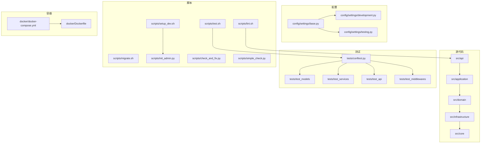
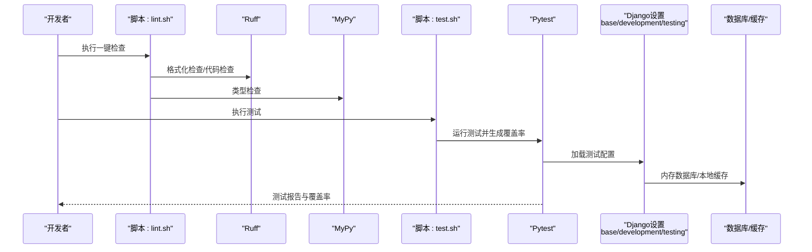
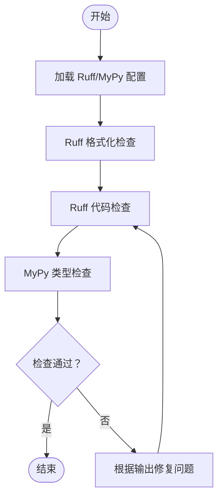
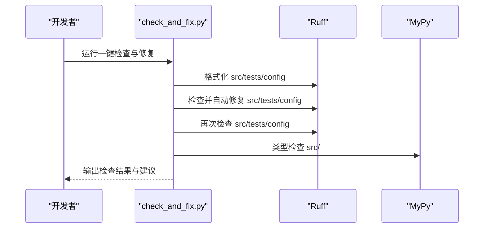
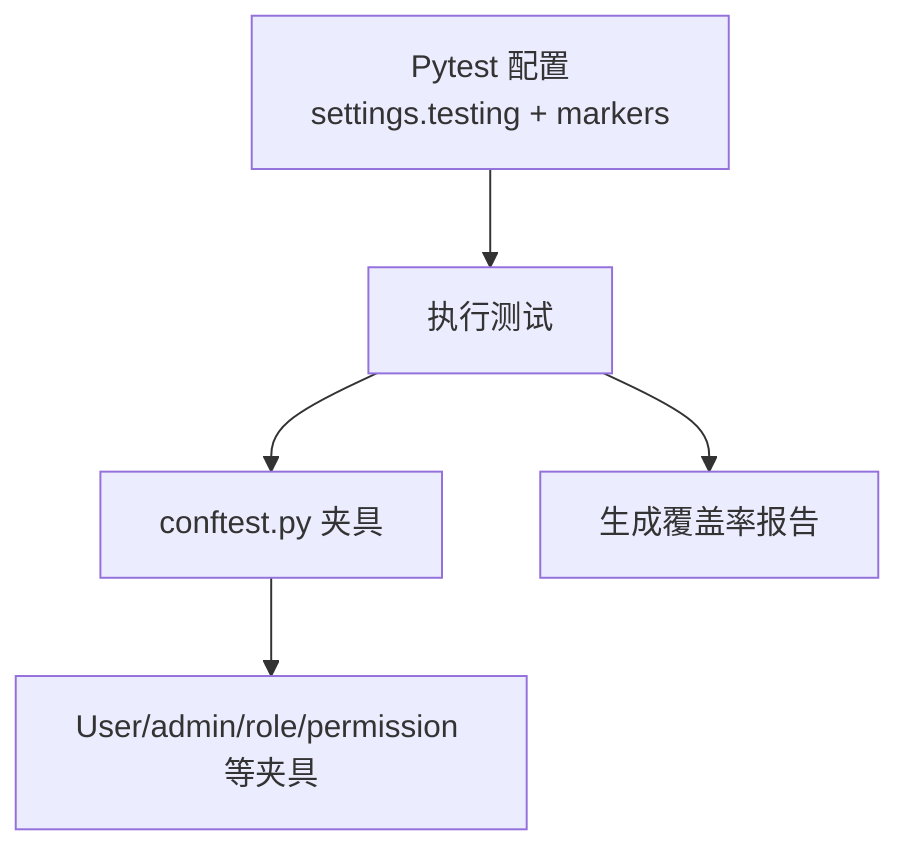
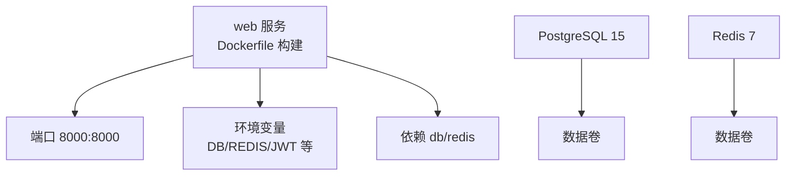
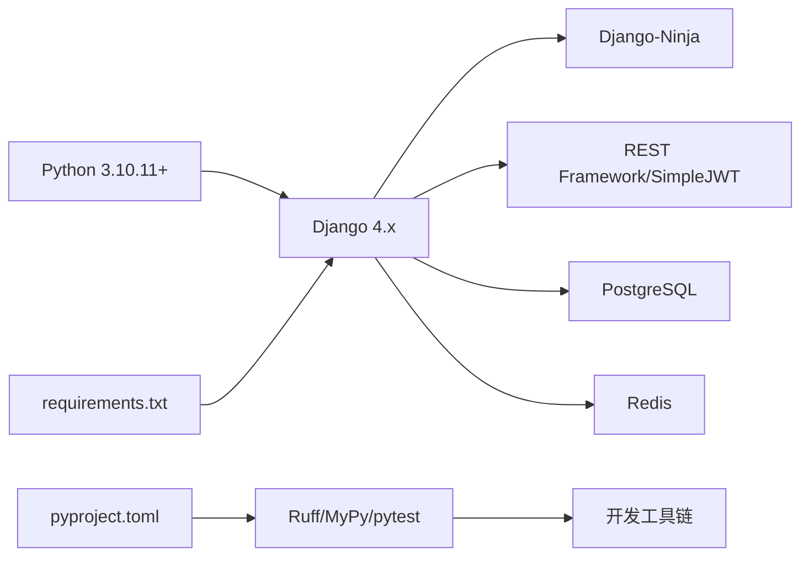

# 开发工作流

<cite>
**本文引用的文件**
- [docs/DEVELOPMENT.md](file://docs/DEVELOPMENT.md)
- [scripts/lint.sh](file://scripts/lint.sh)
- [scripts/test.sh](file://scripts/test.sh)
- [scripts/check_and_fix.py](file://scripts/check_and_fix.py)
- [scripts/simple_check.py](file://scripts/simple_check.py)
- [scripts/setup_dev.sh](file://scripts/setup_dev.sh)
- [scripts/migrate.sh](file://scripts/migrate.sh)
- [scripts/init_admin.py](file://scripts/init_admin.py)
- [pyproject.toml](file://pyproject.toml)
- [ruff.toml](file://ruff.toml)
- [.mypy.ini](file://.mypy.ini)
- [docker/docker-compose.yml](file://docker/docker-compose.yml)
- [docker/Dockerfile](file://docker/Dockerfile)
- [tests/conftest.py](file://tests/conftest.py)
- [config/settings/base.py](file://config/settings/base.py)
- [config/settings/development.py](file://config/settings/development.py)
- [config/settings/testing.py](file://config/settings/testing.py)
- [requirements.txt](file://requirements.txt)
</cite>

## 目录
1. [简介](#简介)
2. [项目结构](#项目结构)
3. [核心组件](#核心组件)
4. [架构总览](#架构总览)
5. [详细组件分析](#详细组件分析)
6. [依赖分析](#依赖分析)
7. [性能考虑](#性能考虑)
8. [故障排除指南](#故障排除指南)
9. [结论](#结论)
10. [附录](#附录)

## 简介
本文件面向开发者，系统性梳理从代码编写到提交与部署的完整开发工作流，覆盖本地测试、代码检查、自动化脚本使用、版本控制最佳实践、IDE 效率提升、贡献流程以及持续集成与部署的基础概念与配置方法。内容以仓库现有脚本、配置与文档为依据，确保可操作、可落地。

## 项目结构
项目采用分层架构与功能模块划分，核心目录与职责如下：
- config/settings：Django 多环境配置（基础、开发、测试）
- src：业务分层（API、应用、领域、基础设施、核心）
- tests：单元/集成测试与夹具
- scripts：开发与运维自动化脚本
- docker：容器化与编排
- docs：开发与质量文档
- requirements.txt/pyproject.toml/ruff.toml/.mypy.ini：依赖与质量工具配置

图表来源
- [config/settings/base.py:1-235](file://config/settings/base.py#L1-L235)
- [config/settings/development.py:1-24](file://config/settings/development.py#L1-L24)
- [config/settings/testing.py:1-32](file://config/settings/testing.py#L1-L32)
- [scripts/lint.sh:1-23](file://scripts/lint.sh#L1-L23)
- [scripts/test.sh:1-14](file://scripts/test.sh#L1-L14)
- [scripts/setup_dev.sh:1-47](file://scripts/setup_dev.sh#L1-L47)
- [scripts/migrate.sh:1-12](file://scripts/migrate.sh#L1-L12)
- [scripts/init_admin.py:1-84](file://scripts/init_admin.py#L1-L84)
- [scripts/check_and_fix.py:1-67](file://scripts/check_and_fix.py#L1-L67)
- [scripts/simple_check.py:1-46](file://scripts/simple_check.py#L1-L46)
- [docker/docker-compose.yml:1-47](file://docker/docker-compose.yml#L1-L47)
- [docker/Dockerfile:1-33](file://docker/Dockerfile#L1-L33)

章节来源
- [docs/DEVELOPMENT.md:115-163](file://docs/DEVELOPMENT.md#L115-L163)

## 核心组件
- 代码质量工具链
  - Ruff：格式化与静态检查，支持 per-file 规则与导入排序
  - MyPy：类型检查，配合 django-stubs 插件
- 测试体系
  - Pytest：统一测试入口与夹具；测试环境使用内存数据库与禁用缓存
- 自动化脚本
  - 一键检查与修复：check_and_fix.py、simple_check.py
  - 一键检查：lint.sh、test.sh
  - 开发环境初始化：setup_dev.sh
  - 数据库迁移与管理员初始化：migrate.sh、init_admin.py
- 容器化
  - docker-compose.yml：Web、PostgreSQL、Redis 三服务编排
  - Dockerfile：Python 3.10 基础镜像、系统依赖、复制与启动

章节来源
- [pyproject.toml:42-131](file://pyproject.toml#L42-L131)
- [ruff.toml:1-54](file://ruff.toml#L1-L54)
- [.mypy.ini:1-45](file://.mypy.ini#L1-L45)
- [tests/conftest.py:1-66](file://tests/conftest.py#L1-L66)
- [scripts/lint.sh:1-23](file://scripts/lint.sh#L1-L23)
- [scripts/test.sh:1-14](file://scripts/test.sh#L1-L14)
- [scripts/check_and_fix.py:1-67](file://scripts/check_and_fix.py#L1-L67)
- [scripts/simple_check.py:1-46](file://scripts/simple_check.py#L1-L46)
- [scripts/setup_dev.sh:1-47](file://scripts/setup_dev.sh#L1-L47)
- [scripts/migrate.sh:1-12](file://scripts/migrate.sh#L1-L12)
- [scripts/init_admin.py:1-84](file://scripts/init_admin.py#L1-L84)
- [docker/docker-compose.yml:1-47](file://docker/docker-compose.yml#L1-L47)
- [docker/Dockerfile:1-33](file://docker/Dockerfile#L1-L33)

## 架构总览
下图展示开发工作流的关键交互：开发者通过脚本驱动质量检查与测试，Pytest 在测试环境中执行，Django 配置按环境切换，容器化提供一致的运行时。

图表来源
- [scripts/lint.sh:1-23](file://scripts/lint.sh#L1-L23)
- [scripts/test.sh:1-14](file://scripts/test.sh#L1-L14)
- [pyproject.toml:92-109](file://pyproject.toml#L92-L109)
- [config/settings/base.py:1-235](file://config/settings/base.py#L1-L235)
- [config/settings/development.py:1-24](file://config/settings/development.py#L1-L24)
- [config/settings/testing.py:1-32](file://config/settings/testing.py#L1-L32)

## 详细组件分析

### 代码质量工具链（Ruff + MyPy）
- Ruff 配置要点
  - 规则集合：pycodestyle、pyflakes、isort、pep8-naming、flake8-* 等
  - per-file-ignore：对 __init__.py、migrations、tests、config 等文件放宽规则
  - 导入排序：区分 first-party/third-party/local
  - 格式化：双引号、空格缩进、换行符自动
- MyPy 配置要点
  - django-stubs 插件启用，指定 settings 模块
  - 对 migrations、config、第三方模块忽略缺失导入
  - 严格可选与冗余告警，便于早期发现类型问题

图表来源
- [ruff.toml:1-54](file://ruff.toml#L1-L54)
- [.mypy.ini:1-45](file://.mypy.ini#L1-L45)

章节来源
- [pyproject.toml:42-131](file://pyproject.toml#L42-L131)
- [ruff.toml:1-54](file://ruff.toml#L1-L54)
- [.mypy.ini:1-45](file://.mypy.ini#L1-L45)

### 自动化脚本使用
- 一键检查脚本
  - Linux/Mac：scripts/lint.sh
  - Windows：scripts\lint.bat（对应文档中描述）
  - 功能：激活虚拟环境、Ruff 格式化检查、Ruff 代码检查、MyPy 类型检查
- 一键测试脚本
  - Linux/Mac：scripts/test.sh
  - Windows：scripts\test.bat（对应文档中描述）
  - 功能：激活虚拟环境、pytest 运行并生成 HTML+终端缺失覆盖率报告
- 一键检查与修复脚本
  - scripts/check_and_fix.py：顺序执行 Ruff 格式化、检查并自动修复、再次检查、MyPy
  - scripts/simple_check.py：简化版 Ruff+MyPy 检查
- 开发环境初始化脚本
  - scripts/setup_dev.sh：安装 UV、创建虚拟环境、安装 dev 依赖、Ruff 格式化/检查、MyPy、初始化管理员、运行测试
- 数据库迁移与管理员初始化
  - scripts/migrate.sh：迁移与创建超级用户
  - scripts/init_admin.py：通过 Django shell 创建管理员账号，避免导入链问题

图表来源
- [scripts/check_and_fix.py:1-67](file://scripts/check_and_fix.py#L1-L67)
- [scripts/simple_check.py:1-46](file://scripts/simple_check.py#L1-L46)
- [scripts/setup_dev.sh:1-47](file://scripts/setup_dev.sh#L1-L47)

章节来源
- [docs/DEVELOPMENT.md:103-113](file://docs/DEVELOPMENT.md#L103-L113)
- [scripts/lint.sh:1-23](file://scripts/lint.sh#L1-L23)
- [scripts/test.sh:1-14](file://scripts/test.sh#L1-L14)
- [scripts/check_and_fix.py:1-67](file://scripts/check_and_fix.py#L1-L67)
- [scripts/simple_check.py:1-46](file://scripts/simple_check.py#L1-L46)
- [scripts/setup_dev.sh:1-47](file://scripts/setup_dev.sh#L1-L47)
- [scripts/migrate.sh:1-12](file://scripts/migrate.sh#L1-L12)
- [scripts/init_admin.py:1-84](file://scripts/init_admin.py#L1-L84)

### 测试与夹具
- Pytest 配置
  - DJANGO_SETTINGS_MODULE 指向 testing 环境
  - 测试路径、文件/类/函数命名模式、严格模式与短回溯
  - 覆盖率源与忽略路径
- 测试夹具
  - 会话级数据库迁移
  - User、admin_user、role、permission 等常用数据夹具

图表来源
- [pyproject.toml:92-131](file://pyproject.toml#L92-L131)
- [tests/conftest.py:1-66](file://tests/conftest.py#L1-L66)
- [config/settings/testing.py:1-32](file://config/settings/testing.py#L1-L32)

章节来源
- [pyproject.toml:92-131](file://pyproject.toml#L92-L131)
- [tests/conftest.py:1-66](file://tests/conftest.py#L1-L66)
- [config/settings/testing.py:1-32](file://config/settings/testing.py#L1-L32)

### 容器化与部署
- docker-compose.yml
  - web 服务：构建上下文与 Dockerfile、端口映射、环境变量（数据库、Redis）、依赖 db/redis
  - db：PostgreSQL 15，数据卷
  - redis：Redis 7，数据卷
- Dockerfile
  - Python 3.10 slim 基础镜像
  - 安装系统依赖（gcc、postgresql-client、libpq-dev）
  - 复制 requirements.txt 并安装依赖
  - 复制应用代码，暴露 8000 端口，CMD 启动 Django

图表来源
- [docker/docker-compose.yml:1-47](file://docker/docker-compose.yml#L1-L47)
- [docker/Dockerfile:1-33](file://docker/Dockerfile#L1-L33)

章节来源
- [docker/docker-compose.yml:1-47](file://docker/docker-compose.yml#L1-L47)
- [docker/Dockerfile:1-33](file://docker/Dockerfile#L1-L33)

## 依赖分析
- 语言与框架
  - Python 3.10.11+，Django 4.x，Django-Ninja，Pydantic，JWT，Redis，PostgreSQL
- 开发工具
  - Ruff（格式化/检查），MyPy（类型检查），pytest（测试），pytest-cov（覆盖率）
- 依赖来源
  - requirements.txt：生产与开发依赖清单
  - pyproject.toml：项目元数据、可选 dev 依赖、Ruff/MyPy/Pytest 配置

图表来源
- [requirements.txt:1-38](file://requirements.txt#L1-L38)
- [pyproject.toml:1-131](file://pyproject.toml#L1-L131)

章节来源
- [requirements.txt:1-38](file://requirements.txt#L1-L38)
- [pyproject.toml:1-131](file://pyproject.toml#L1-L131)

## 性能考虑
- 代码质量前置：通过 Ruff 格式化与检查减少后期返工，降低维护成本
- 类型检查：MyPy 提前发现潜在类型问题，提升稳定性
- 测试隔离：测试环境使用内存数据库与禁用缓存，缩短测试周期
- 容器化一致性：docker-compose 统一开发与部署环境，减少“在我机子上能跑”的差异

## 故障排除指南
- 数据库迁移失败
  - 清理迁移文件后重新生成迁移，再执行 migrate
- Redis 连接失败
  - 确保 Redis 服务运行（Windows：redis-server；Linux/Mac：systemctl start redis）
- 端口被占用
  - 更改 runserver 端口
- 初始化管理员失败
  - 使用 scripts/init_admin.py 或 scripts/migrate.sh 确保迁移先执行

章节来源
- [docs/DEVELOPMENT.md:190-219](file://docs/DEVELOPMENT.md#L190-L219)
- [scripts/init_admin.py:1-84](file://scripts/init_admin.py#L1-L84)
- [scripts/migrate.sh:1-12](file://scripts/migrate.sh#L1-L12)

## 结论
本开发工作流以脚本与配置为中心，形成“编写—检查—测试—初始化—部署”的闭环。通过统一的工具链与容器化，既保证了开发效率，也降低了协作与运维成本。建议团队在日常工作中坚持格式化先行、类型检查与测试覆盖，逐步完善 CI/CD 流水线。

## 附录

### 版本控制最佳实践
- 分支管理策略
  - 主分支保护：仅允许通过 PR 合并
  - 功能分支：按特性或任务创建短期分支，完成后合并并删除
  - 发布分支：发布前创建，修复紧急问题在该分支处理后再合并回主分支
- 提交信息规范
  - 类型：feat/fix/docs/style/refactor/perf/test/build/ci/chore
  - 格式：type(scope): subject（不超过 100 字）
  - 示例：feat(api): 添加用户认证接口
- 代码审查流程
  - PR 描述清晰，关联 Issue
  - 至少一名 reviewer 通过，无修改请求
  - 通过自动化检查与测试后再合并

### 开发效率提升
- IDE 配置
  - 启用 Ruff/MyPy 插件，实时提示
  - 配置 pytest 集成，右键直接运行测试
- 快捷键与模板
  - 使用模板快速生成 DTO/Service/Repository
  - 命令行一键检查与修复
- 调试技巧
  - 在 development.py 中开启更详细日志
  - 使用 Docker 快速复现生产环境问题

### 参与项目贡献
- Fork 与 PR
  - Fork 仓库 → 新建功能分支 → 提交并推送 → 创建 PR → 代码审查 → 合并
- 提交前准备
  - 运行一键检查与修复脚本
  - 执行测试并生成覆盖率报告
  - 格式化代码（Ruff）
  - 编写清晰的提交信息与 PR 描述

### 持续集成与持续部署（CI/CD）
- 概念
  - CI：每次提交触发自动化检查与测试
  - CD：通过流水线自动部署到测试/生产环境
- 建议配置
  - 触发条件：push 到分支/PR
  - 步骤：安装依赖（UV/requirements）、Ruff 格式化检查、MyPy、pytest + 覆盖率、Docker 构建镜像
  - 结果：报告检查与测试结果，成功后部署（可选）

章节来源
- [docs/DEVELOPMENT.md:221-227](file://docs/DEVELOPMENT.md#L221-L227)
- [scripts/lint.sh:1-23](file://scripts/lint.sh#L1-L23)
- [scripts/test.sh:1-14](file://scripts/test.sh#L1-L14)
- [scripts/setup_dev.sh:1-47](file://scripts/setup_dev.sh#L1-L47)
- [pyproject.toml:92-131](file://pyproject.toml#L92-L131)