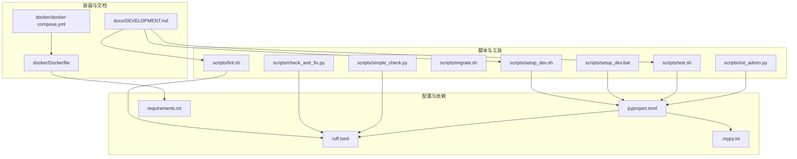
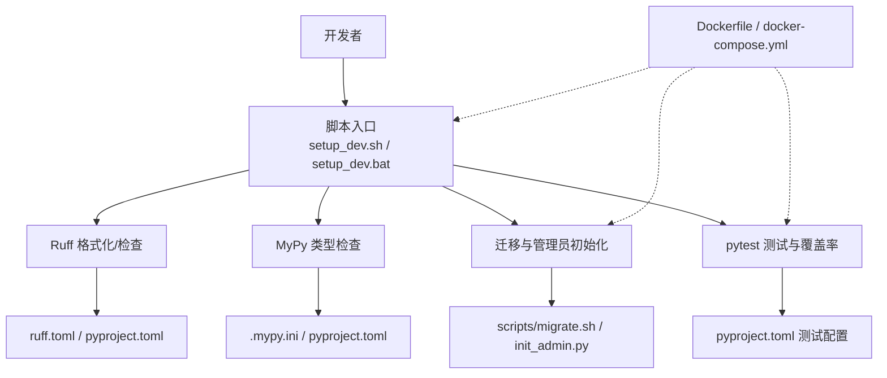
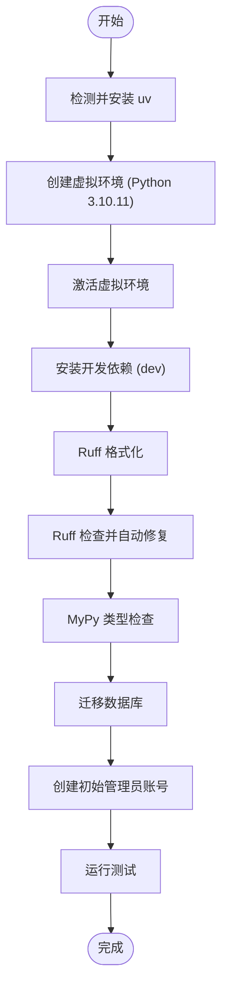
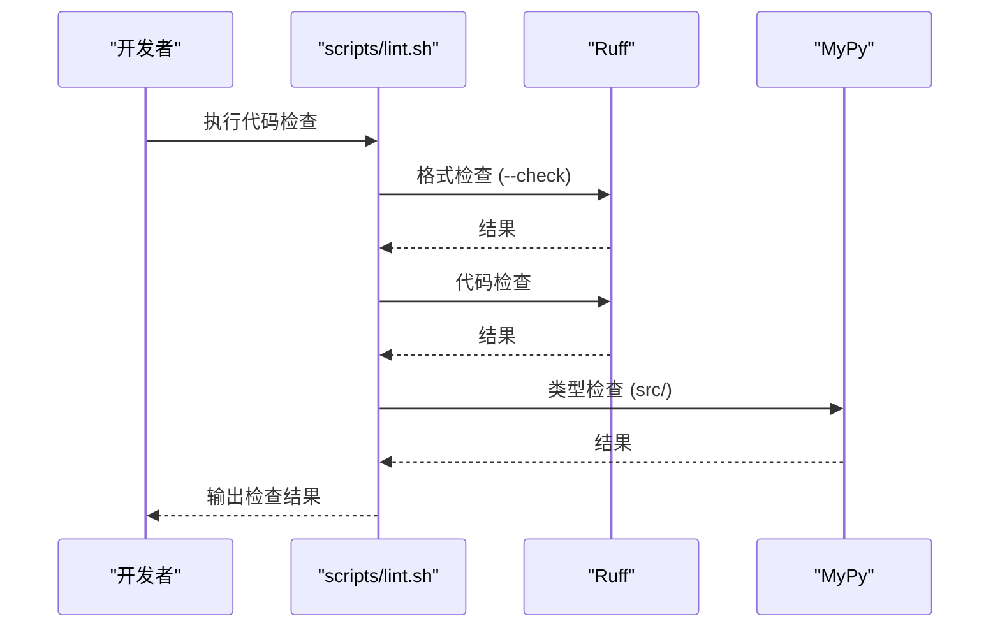
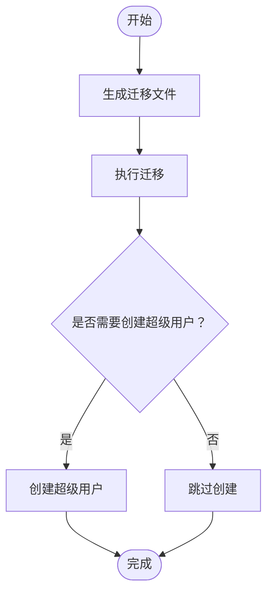
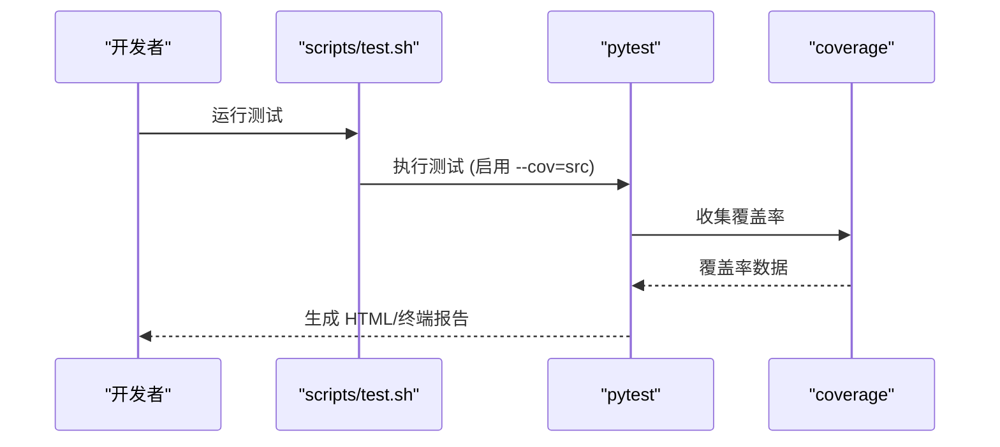
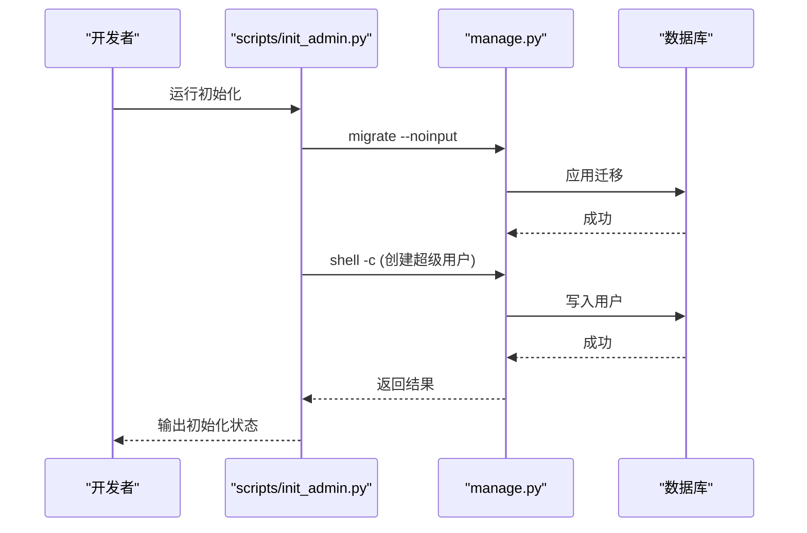
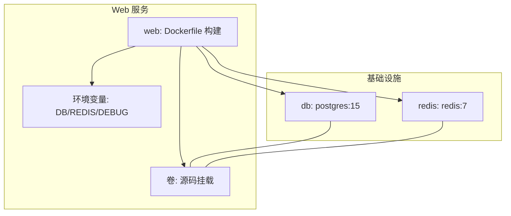
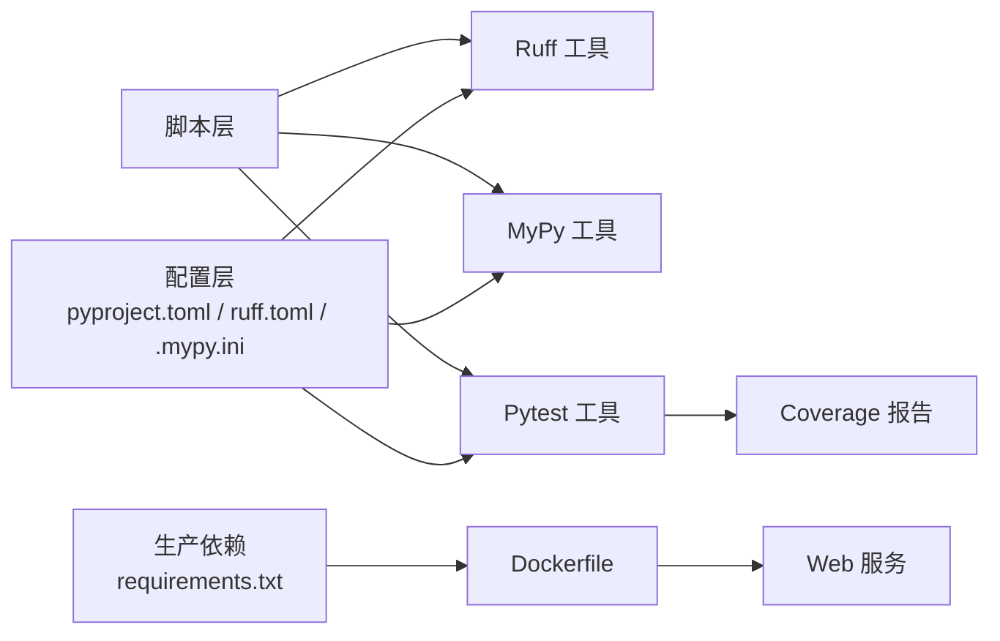

# 开发工具与脚本

<cite>
**本文引用的文件**
- [scripts/setup_dev.sh](file://scripts/setup_dev.sh)
- [scripts/setup_dev.bat](file://scripts/setup_dev.bat)
- [scripts/lint.sh](file://scripts/lint.sh)
- [scripts/migrate.sh](file://scripts/migrate.sh)
- [scripts/test.sh](file://scripts/test.sh)
- [scripts/check_and_fix.py](file://scripts/check_and_fix.py)
- [scripts/simple_check.py](file://scripts/simple_check.py)
- [scripts/init_admin.py](file://scripts/init_admin.py)
- [pyproject.toml](file://pyproject.toml)
- [ruff.toml](file://ruff.toml)
- [.mypy.ini](file://.mypy.ini)
- [requirements.txt](file://requirements.txt)
- [docker/Dockerfile](file://docker/Dockerfile)
- [docker/docker-compose.yml](file://docker/docker-compose.yml)
- [docs/DEVELOPMENT.md](file://docs/DEVELOPMENT.md)
</cite>

## 目录
1. [简介](#简介)
2. [项目结构](#项目结构)
3. [核心组件](#核心组件)
4. [架构总览](#架构总览)
5. [详细组件分析](#详细组件分析)
6. [依赖分析](#依赖分析)
7. [性能考虑](#性能考虑)
8. [故障排查指南](#故障排查指南)
9. [结论](#结论)
10. [附录](#附录)

## 简介
本文件面向开发者，系统性梳理项目提供的各类开发辅助脚本与质量工具配置，覆盖环境搭建、数据库迁移、测试执行、代码检查与格式化、类型检查、覆盖率分析、Docker 开发容器、以及常见问题排查。同时给出开发工作流最佳实践与质量保证流程建议，帮助团队快速上手并保持高质量交付。

## 项目结构
围绕“开发工具与脚本”的主题，项目的关键位置如下：
- scripts/：集中存放开发辅助脚本（环境初始化、代码检查、迁移、测试、管理员初始化等）
- config/settings/：多环境配置（development、testing、production），配合 pytest 的测试配置
- pyproject.toml：项目元数据、可选开发依赖、Ruff 与 MyPy、Pytest、Coverage 等工具配置
- ruff.toml 与 .mypy.ini：代码风格与类型检查的细粒度规则
- docker/：Dockerfile 与 docker-compose.yml，支持本地一体化开发与联调
- docs/DEVELOPMENT.md：开发指南与常用命令参考
- tests/：测试用例与 pytest 配置

图表来源
- [scripts/setup_dev.sh:1-47](file://scripts/setup_dev.sh#L1-L47)
- [scripts/setup_dev.bat:1-48](file://scripts/setup_dev.bat#L1-L48)
- [scripts/lint.sh:1-23](file://scripts/lint.sh#L1-L23)
- [scripts/migrate.sh:1-12](file://scripts/migrate.sh#L1-L12)
- [scripts/test.sh:1-14](file://scripts/test.sh#L1-L14)
- [scripts/check_and_fix.py:1-67](file://scripts/check_and_fix.py#L1-L67)
- [scripts/simple_check.py:1-46](file://scripts/simple_check.py#L1-L46)
- [scripts/init_admin.py:1-84](file://scripts/init_admin.py#L1-L84)
- [pyproject.toml:1-131](file://pyproject.toml#L1-L131)
- [ruff.toml:1-54](file://ruff.toml#L1-L54)
- [.mypy.ini:1-45](file://.mypy.ini#L1-L45)
- [requirements.txt:1-38](file://requirements.txt#L1-L38)
- [docker/Dockerfile:1-33](file://docker/Dockerfile#L1-L33)
- [docker/docker-compose.yml:1-47](file://docker/docker-compose.yml#L1-L47)
- [docs/DEVELOPMENT.md:1-227](file://docs/DEVELOPMENT.md#L1-L227)

章节来源
- [docs/DEVELOPMENT.md:115-163](file://docs/DEVELOPMENT.md#L115-L163)

## 核心组件
- 环境初始化脚本（跨平台）
  - Linux/macOS：scripts/setup_dev.sh，负责安装/激活虚拟环境、安装开发依赖、格式化、检查、类型检查、初始化管理员、运行测试
  - Windows：scripts/setup_dev.bat，功能同上，兼容 Windows 调用方式
- 代码检查与修复脚本
  - scripts/lint.sh：在已激活的虚拟环境中执行 Ruff 格式检查、Ruff 代码检查、MyPy 类型检查
  - scripts/check_and_fix.py：统一驱动 Ruff 格式化、检查与修复、二次检查、MyPy 类型检查，适合 CI 或批量修复场景
  - scripts/simple_check.py：最小化封装的 Ruff 与 MyPy 检查流程，便于快速验证
- 数据库迁移脚本：scripts/migrate.sh，封装 makemigrations 与 migrate，并尝试创建超级用户
- 测试脚本：scripts/test.sh，以 pytest 运行测试并生成 HTML 与终端缺失覆盖率报告
- 管理员初始化脚本：scripts/init_admin.py，先迁移再通过 Django shell 创建超级用户，避免导入链问题
- 工具配置
  - pyproject.toml：定义项目依赖、可选 dev 依赖、Ruff 规则与格式化策略、MyPy 插件与 Django 支持、Pytest 严格模式与标记、Coverage 源与忽略项
  - ruff.toml：Ruff 详细规则集、按文件忽略、导入分组与第三方/本地包识别、格式化偏好
  - .mypy.ini：MyPy 严格选项、Django 插件配置、对测试与迁移等目录的宽松策略
  - requirements.txt：生产依赖清单
- 容器化开发：docker/Dockerfile 与 docker/docker-compose.yml，一键拉起 Web、Postgres、Redis，挂载源码，便于联调

章节来源
- [scripts/setup_dev.sh:1-47](file://scripts/setup_dev.sh#L1-L47)
- [scripts/setup_dev.bat:1-48](file://scripts/setup_dev.bat#L1-L48)
- [scripts/lint.sh:1-23](file://scripts/lint.sh#L1-L23)
- [scripts/migrate.sh:1-12](file://scripts/migrate.sh#L1-L12)
- [scripts/test.sh:1-14](file://scripts/test.sh#L1-L14)
- [scripts/check_and_fix.py:1-67](file://scripts/check_and_fix.py#L1-L67)
- [scripts/simple_check.py:1-46](file://scripts/simple_check.py#L1-L46)
- [scripts/init_admin.py:1-84](file://scripts/init_admin.py#L1-L84)
- [pyproject.toml:26-131](file://pyproject.toml#L26-L131)
- [ruff.toml:1-54](file://ruff.toml#L1-L54)
- [.mypy.ini:1-45](file://.mypy.ini#L1-L45)
- [requirements.txt:1-38](file://requirements.txt#L1-L38)
- [docker/Dockerfile:1-33](file://docker/Dockerfile#L1-L33)
- [docker/docker-compose.yml:1-47](file://docker/docker-compose.yml#L1-L47)

## 架构总览
下图展示从“开发脚本”到“质量工具与容器”的整体关系，体现开发流程闭环：环境准备 → 代码检查 → 类型检查 → 迁移与初始化 → 测试与覆盖率 → 容器化运行。

图表来源
- [scripts/setup_dev.sh:1-47](file://scripts/setup_dev.sh#L1-L47)
- [scripts/setup_dev.bat:1-48](file://scripts/setup_dev.bat#L1-L48)
- [scripts/lint.sh:1-23](file://scripts/lint.sh#L1-L23)
- [scripts/test.sh:1-14](file://scripts/test.sh#L1-L14)
- [scripts/migrate.sh:1-12](file://scripts/migrate.sh#L1-L12)
- [scripts/init_admin.py:1-84](file://scripts/init_admin.py#L1-L84)
- [pyproject.toml:42-131](file://pyproject.toml#L42-L131)
- [ruff.toml:1-54](file://ruff.toml#L1-L54)
- [.mypy.ini:1-45](file://.mypy.ini#L1-L45)
- [docker/Dockerfile:1-33](file://docker/Dockerfile#L1-L33)
- [docker/docker-compose.yml:1-47](file://docker/docker-compose.yml#L1-L47)

## 详细组件分析

### 环境初始化脚本（跨平台）
- 功能要点
  - 检测并安装 uv（跨平台安装脚本），创建指定 Python 版本的虚拟环境
  - 激活虚拟环境后安装开发依赖（含 dev 可选依赖）
  - 统一执行 Ruff 格式化、Ruff 检查（带自动修复）、MyPy 类型检查
  - 初始化管理员账号（先迁移，再通过 Django shell 创建）
  - 最终提示如何启动开发服务器
- 使用建议
  - 首次克隆后优先运行该脚本，确保本地环境一致
  - 如需自定义管理员账号信息，可通过环境变量传入

图表来源
- [scripts/setup_dev.sh:1-47](file://scripts/setup_dev.sh#L1-L47)
- [scripts/setup_dev.bat:1-48](file://scripts/setup_dev.bat#L1-L48)

章节来源
- [scripts/setup_dev.sh:1-47](file://scripts/setup_dev.sh#L1-L47)
- [scripts/setup_dev.bat:1-48](file://scripts/setup_dev.bat#L1-L48)

### 代码检查与修复脚本
- scripts/lint.sh
  - 在已激活的虚拟环境中执行：Ruff 格式检查、Ruff 代码检查、MyPy 类型检查
  - 适合在 CI 或本地快速校验
- scripts/check_and_fix.py
  - 封装 Ruff 格式化、检查与修复、二次检查、MyPy 类型检查
  - 适合批量修复与 CI 场景，输出详细日志并区分成功/警告
- scripts/simple_check.py
  - 最小封装，直接调用 .venv 下的 Python 执行器，快速验证 Ruff 与 MyPy
  - 适合临时验证或嵌入其他流程

图表来源
- [scripts/lint.sh:1-23](file://scripts/lint.sh#L1-L23)

章节来源
- [scripts/lint.sh:1-23](file://scripts/lint.sh#L1-L23)
- [scripts/check_and_fix.py:1-67](file://scripts/check_and_fix.py#L1-L67)
- [scripts/simple_check.py:1-46](file://scripts/simple_check.py#L1-L46)

### 数据库迁移脚本
- 功能要点
  - 自动执行 makemigrations 与 migrate
  - 尝试创建超级用户（若不存在）
- 使用建议
  - 新环境首次运行或新增模型后运行
  - 生产环境建议结合备份与回滚策略

图表来源
- [scripts/migrate.sh:1-12](file://scripts/migrate.sh#L1-L12)

章节来源
- [scripts/migrate.sh:1-12](file://scripts/migrate.sh#L1-L12)

### 测试脚本与覆盖率
- 功能要点
  - 使用 pytest 运行测试，启用严格模式与短错误栈
  - 生成 HTML 与终端缺失覆盖率报告，覆盖源码目录
- 使用建议
  - 本地开发时关注终端报告；CI 中保留 HTML 报告以便审阅
  - 可按需指定测试文件或目录进行定向执行

图表来源
- [scripts/test.sh:1-14](file://scripts/test.sh#L1-L14)
- [pyproject.toml:111-131](file://pyproject.toml#L111-L131)

章节来源
- [scripts/test.sh:1-14](file://scripts/test.sh#L1-L14)
- [pyproject.toml:92-131](file://pyproject.toml#L92-L131)

### 管理员初始化脚本
- 功能要点
  - 先迁移数据库，再通过 Django shell 执行创建超级用户逻辑
  - 支持通过环境变量定制用户名、邮箱、密码
  - 避免在业务模块中直接导入导致的循环依赖
- 使用建议
  - 首次部署或新环境初始化时运行
  - 生产环境务必修改默认密码

图表来源
- [scripts/init_admin.py:1-84](file://scripts/init_admin.py#L1-L84)

章节来源
- [scripts/init_admin.py:1-84](file://scripts/init_admin.py#L1-L84)

### 代码质量工具配置
- Ruff（pyproject.toml 与 ruff.toml）
  - 规则集：pycodestyle、pyflakes、isort、pep8-naming、pyupgrade、flake8-bugbear、comprehensions、simplify 等
  - 格式化：双引号、空格缩进、自动换行、保留尾随逗号
  - 文件级忽略：__init__.py、migrations、tests、config 等目录的特殊规则
- MyPy（pyproject.toml 与 .mypy.ini）
  - Django 插件：mypy_django_plugin.main
  - 严格选项：可按需调整，测试与迁移目录放宽
  - 路径与插件：显式 package 基座、忽略缺失导入等
- Pytest（pyproject.toml）
  - 严格标记与配置、短错误栈、异步模式、测试路径与标记
- Coverage（pyproject.toml）
  - 源码目录与忽略项、排除行规则

章节来源
- [pyproject.toml:42-131](file://pyproject.toml#L42-L131)
- [ruff.toml:1-54](file://ruff.toml#L1-L54)
- [.mypy.ini:1-45](file://.mypy.ini#L1-L45)

### 容器化开发环境
- Dockerfile
  - 基于 python:3.10-slim，安装系统依赖与 Python 依赖，复制源码，暴露 8000 端口，启动开发服务器
- docker-compose.yml
  - web 服务：构建镜像、映射端口、注入环境变量（数据库、Redis）、依赖 db 与 redis、挂载源码
  - db 服务：Postgres 15，持久化数据卷
  - redis 服务：Redis 7，持久化数据卷

图表来源
- [docker/Dockerfile:1-33](file://docker/Dockerfile#L1-L33)
- [docker/docker-compose.yml:1-47](file://docker/docker-compose.yml#L1-L47)

章节来源
- [docker/Dockerfile:1-33](file://docker/Dockerfile#L1-L33)
- [docker/docker-compose.yml:1-47](file://docker/docker-compose.yml#L1-L47)

## 依赖分析
- 工具链耦合
  - Ruff 与 MyPy 通过 pyproject.toml 与独立配置文件共同约束代码质量
  - Pytest 与 Coverage 通过 pyproject.toml 集成，测试脚本仅需调用 pytest 即可产出报告
  - 脚本层（bash/bat/python）与工具层（Ruff/MyPy/pytest）解耦，便于替换与扩展
- 外部依赖
  - 生产依赖集中在 requirements.txt，容器镜像按此清单安装
  - 开发依赖集中在 pyproject.toml 的 dev 可选组，供脚本与本地开发使用

图表来源
- [pyproject.toml:26-131](file://pyproject.toml#L26-L131)
- [ruff.toml:1-54](file://ruff.toml#L1-L54)
- [.mypy.ini:1-45](file://.mypy.ini#L1-L45)
- [requirements.txt:1-38](file://requirements.txt#L1-L38)
- [docker/Dockerfile:1-33](file://docker/Dockerfile#L1-L33)

章节来源
- [pyproject.toml:26-131](file://pyproject.toml#L26-L131)
- [requirements.txt:1-38](file://requirements.txt#L1-L38)

## 性能考虑
- 代码检查性能
  - Ruff 作为单二进制工具，启动快、检查快，建议在本地与 CI 并行执行格式检查与类型检查
  - 对大型项目，可按目录拆分检查任务，减少单次耗时
- 测试与覆盖率
  - 使用 pytest 的并发与标记能力，按需选择测试子集
  - 覆盖率报告生成会增加时间成本，可在 PR 验证阶段关闭 HTML 报告，仅保留终端报告
- 容器化
  - 初次构建镜像较慢，建议缓存依赖层；开发阶段挂载源码可显著提升迭代速度

## 故障排查指南
- 数据库迁移失败
  - 清理迁移文件后重新生成并迁移
- Redis 连接失败
  - 确认 Redis 服务已启动（Windows 使用 redis-server，Linux/Mac 使用系统服务）
- 端口被占用
  - 更改 runserver 端口
- 管理员初始化失败
  - 检查数据库连接与迁移状态，确认 Django shell 可正常执行
- 代码检查失败
  - 使用 scripts/lint.sh 或 scripts/check_and_fix.py 逐项修复；必要时放宽局部规则或补充类型注解

章节来源
- [docs/DEVELOPMENT.md:188-227](file://docs/DEVELOPMENT.md#L188-L227)
- [scripts/migrate.sh:1-12](file://scripts/migrate.sh#L1-L12)
- [scripts/init_admin.py:1-84](file://scripts/init_admin.py#L1-L84)

## 结论
本项目通过统一的脚本与完善的工具配置，实现了从环境准备到质量保障再到容器化的一体化开发体验。建议团队在日常工作中坚持：先运行脚本初始化环境，再执行代码检查与类型检查，最后运行测试并生成覆盖率报告；在 CI 中复用相同流程，确保质量门槛不降低。

## 附录
- 开发工作流最佳实践
  - 分支管理：采用功能分支，合并前必须通过脚本与测试
  - 提交规范：遵循清晰的提交信息，关联问题编号
  - 版本发布：打标签并生成变更日志，配合容器镜像发布
- 代码审查与质量保证
  - PR 必须通过 Ruff、MyPy、pytest 与覆盖率检查
  - 关键模块增加单元测试与集成测试
- 持续集成与持续部署
  - CI 阶段：安装依赖 → 格式检查 → 代码检查 → 类型检查 → 测试与覆盖率 → 构建镜像
  - CD 阶段：推送镜像至仓库，编排服务更新
- 性能分析与调试
  - 使用 Django Profiling 工具或 gunicorn + py-spy 进行性能分析
  - 在 docker-compose 中开启调试端口与日志级别，便于定位问题