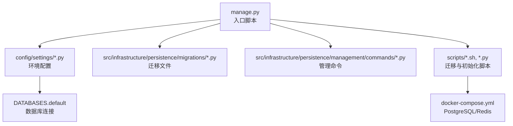
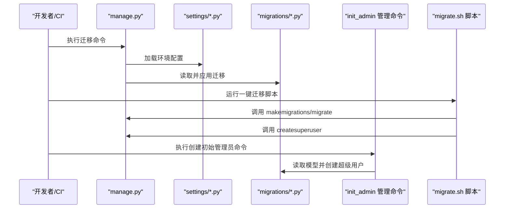
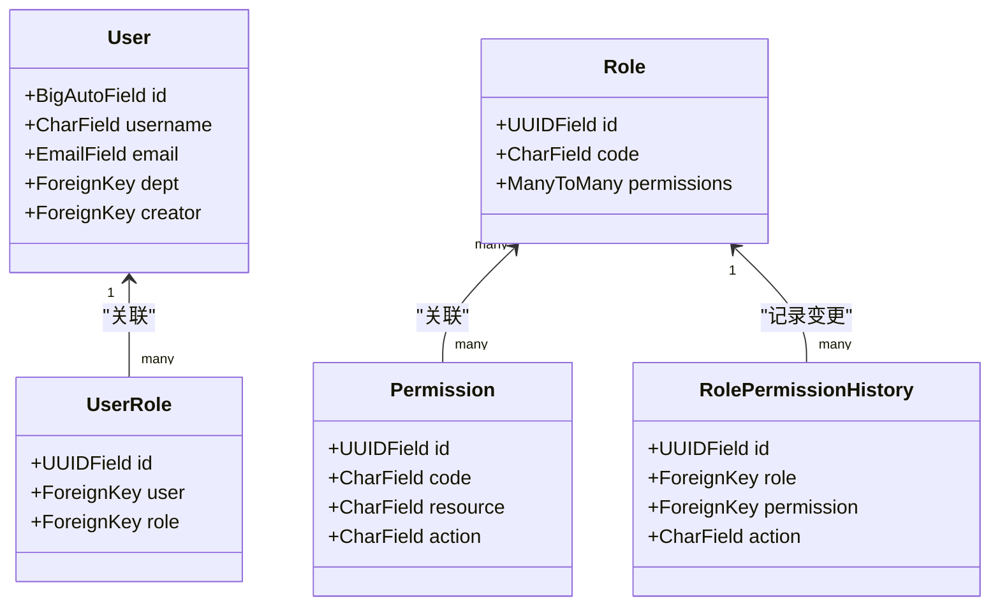
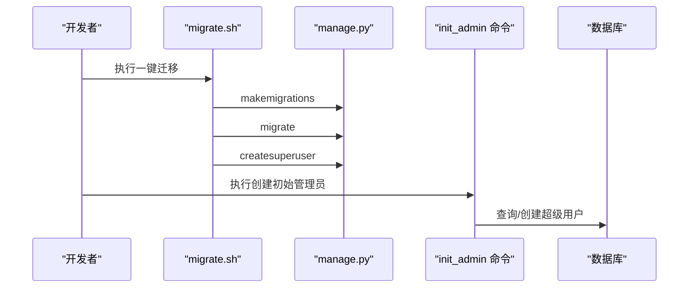
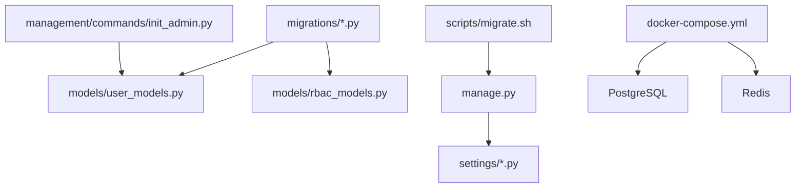

# 数据库迁移

<cite>
**本文引用的文件**
- [manage.py](file://manage.py)
- [migrate.sh](file://scripts/migrate.sh)
- [init_admin.py](file://scripts/init_admin.py)
- [init_admin.py](file://src/infrastructure/persistence/management/commands/init_admin.py)
- [0001_initial.py](file://src/infrastructure/persistence/migrations/0001_initial.py)
- [0002_auto_20260314_0921.py](file://src/infrastructure/persistence/migrations/0002_auto_20260314_0921.py)
- [base.py](file://config/settings/base.py)
- [development.py](file://config/settings/development.py)
- [production.py](file://config/settings/production.py)
- [testing.py](file://config/settings/testing.py)
- [user_models.py](file://src/infrastructure/persistence/models/user_models.py)
- [rbac_models.py](file://src/infrastructure/persistence/models/rbac_models.py)
- [system_models.py](file://src/infrastructure/persistence/models/system_models.py)
- [docker-compose.yml](file://docker/docker-compose.yml)
- [rbac.sql](file://sql/rbac.sql)
- [migrate_database.py](file://scripts/migrate_database.py)
</cite>

## 目录
1. [引言](#引言)
2. [项目结构](#项目结构)
3. [核心组件](#核心组件)
4. [架构总览](#架构总览)
5. [详细组件分析](#详细组件分析)
6. [依赖分析](#依赖分析)
7. [性能考虑](#性能考虑)
8. [故障排查指南](#故障排查指南)
9. [结论](#结论)
10. [附录](#附录)

## 引言
本文件系统性梳理本项目的数据库迁移流程与最佳实践，覆盖迁移文件生成、应用与回滚、批量与定向迁移、初始数据导入与权限初始化、跨环境迁移策略、以及数据库版本管理与备份恢复建议。文档以仓库现有实现为依据，结合配置与脚本，帮助开发者在开发、测试、生产环境中安全高效地管理数据库演进。

## 项目结构
项目采用分层与按功能域划分的组织方式，数据库迁移相关的关键位置如下：
- 迁移文件位于持久化层的 migrations 目录，包含初始迁移与后续自动迁移占位文件
- 管理命令与脚本位于 scripts 目录，提供一键迁移与管理员初始化能力
- Django 设置按环境拆分，分别定义数据库连接、缓存、日志等
- Docker Compose 提供 PostgreSQL 与 Redis 的容器化支撑

图表来源
- [manage.py:1-23](file://manage.py#L1-L23)
- [base.py:77-88](file://config/settings/base.py#L77-L88)
- [development.py:10-16](file://config/settings/development.py#L10-L16)
- [production.py:12-23](file://config/settings/production.py#L12-L23)
- [docker-compose.yml:1-47](file://docker/docker-compose.yml#L1-L47)

章节来源
- [manage.py:1-23](file://manage.py#L1-L23)
- [base.py:77-88](file://config/settings/base.py#L77-L88)
- [development.py:10-16](file://config/settings/development.py#L10-L16)
- [production.py:12-23](file://config/settings/production.py#L12-L23)
- [docker-compose.yml:1-47](file://docker/docker-compose.yml#L1-L47)

## 核心组件
- 迁移文件
  - 初始迁移：定义用户、权限、角色、令牌、黑白名单、限流等核心表结构
  - 后续迁移：当前为占位文件，便于后续增量演进
- 管理命令与脚本
  - 一键迁移脚本：封装生成与应用迁移、创建超级用户
  - 管理命令：提供可复用的“创建初始管理员”命令
  - 初始化脚本：通过子进程调用 Django 命令行，确保环境隔离
- 配置与环境
  - 基础配置：定义数据库连接、用户模型、缓存、日志、JWT 等
  - 环境配置：开发、测试、生产三套配置，差异在于数据库引擎与日志级别
- 模型与索引
  - 用户与 RBAC 模型：涵盖权限、角色、用户角色、权限变更历史等
  - 系统日志模型：记录操作日志与审计信息

章节来源
- [0001_initial.py:13-180](file://src/infrastructure/persistence/migrations/0001_initial.py#L13-L180)
- [0002_auto_20260314_0921.py:6-12](file://src/infrastructure/persistence/migrations/0002_auto_20260314_0921.py#L6-L12)
- [migrate.sh:1-12](file://scripts/migrate.sh#L1-L12)
- [init_admin.py:1-36](file://src/infrastructure/persistence/management/commands/init_admin.py#L1-L36)
- [init_admin.py:1-84](file://scripts/init_admin.py#L1-L84)
- [base.py:77-88](file://config/settings/base.py#L77-L88)
- [development.py:10-16](file://config/settings/development.py#L10-L16)
- [production.py:12-23](file://config/settings/production.py#L12-L23)
- [user_models.py:12-84](file://src/infrastructure/persistence/models/user_models.py#L12-L84)
- [rbac_models.py:13-114](file://src/infrastructure/persistence/models/rbac_models.py#L13-L114)
- [system_models.py:235-271](file://src/infrastructure/persistence/models/system_models.py#L235-L271)

## 架构总览
下图展示迁移与初始化的整体流程，包括命令行入口、环境配置、迁移文件、管理命令与脚本之间的交互关系。

图表来源
- [manage.py:7-18](file://manage.py#L7-L18)
- [base.py:77-88](file://config/settings/base.py#L77-L88)
- [migrate.sh:4-11](file://scripts/migrate.sh#L4-L11)
- [init_admin.py:15-35](file://src/infrastructure/persistence/management/commands/init_admin.py#L15-L35)

## 详细组件分析

### 迁移文件与模型映射
- 初始迁移文件定义了用户、权限、角色、令牌、黑白名单、限流等核心表结构，包含字段、索引与外键约束
- 后续迁移文件为占位，便于后续增量演进
- 模型层面，用户模型与 RBAC 模型清晰表达权限与角色关系，系统日志模型提供审计能力

图表来源
- [user_models.py:12-84](file://src/infrastructure/persistence/models/user_models.py#L12-L84)
- [rbac_models.py:13-114](file://src/infrastructure/persistence/models/rbac_models.py#L13-L114)
- [0001_initial.py:21-180](file://src/infrastructure/persistence/migrations/0001_initial.py#L21-L180)

章节来源
- [0001_initial.py:13-180](file://src/infrastructure/persistence/migrations/0001_initial.py#L13-L180)
- [0002_auto_20260314_0921.py:6-12](file://src/infrastructure/persistence/migrations/0002_auto_20260314_0921.py#L6-L12)
- [user_models.py:12-84](file://src/infrastructure/persistence/models/user_models.py#L12-L84)
- [rbac_models.py:13-114](file://src/infrastructure/persistence/models/rbac_models.py#L13-L114)
- [system_models.py:235-271](file://src/infrastructure/persistence/models/system_models.py#L235-L271)

### 迁移脚本与命令
- 一键迁移脚本：先生成迁移，再应用迁移；随后尝试创建超级用户
- 管理命令：提供可复用的“创建初始管理员”命令，支持环境变量注入
- 初始化脚本：通过子进程调用 Django 命令行，避免导入链问题，先迁移后创建管理员

图表来源
- [migrate.sh:4-11](file://scripts/migrate.sh#L4-L11)
- [init_admin.py:15-35](file://src/infrastructure/persistence/management/commands/init_admin.py#L15-L35)
- [init_admin.py:30-75](file://scripts/init_admin.py#L30-L75)

章节来源
- [migrate.sh:1-12](file://scripts/migrate.sh#L1-L12)
- [init_admin.py:1-36](file://src/infrastructure/persistence/management/commands/init_admin.py#L1-L36)
- [init_admin.py:1-84](file://scripts/init_admin.py#L1-L84)

### 初始数据与管理员账户
- 管理员初始化通过管理命令与脚本两种方式实现，均支持环境变量注入用户名、邮箱、密码
- 命令执行前会检查用户是否存在，避免重复创建
- 建议在生产环境修改默认密码

章节来源
- [init_admin.py:15-35](file://src/infrastructure/persistence/management/commands/init_admin.py#L15-L35)
- [init_admin.py:19-75](file://scripts/init_admin.py#L19-L75)

### 环境配置与数据库连接
- 基础配置定义了数据库连接、用户模型、缓存、日志、JWT 等
- 开发环境使用 SQLite 文件数据库
- 测试环境使用内存数据库，禁用缓存与速率限制，加速测试
- 生产环境使用 PostgreSQL，启用安全与 HSTS 等安全设置
- Docker Compose 提供 PostgreSQL 与 Redis 的容器化支撑

章节来源
- [base.py:77-88](file://config/settings/base.py#L77-L88)
- [development.py:10-16](file://config/settings/development.py#L10-L16)
- [testing.py:10-16](file://config/settings/testing.py#L10-L16)
- [production.py:12-23](file://config/settings/production.py#L12-L23)
- [docker-compose.yml:12-22](file://docker/docker-compose.yml#L12-L22)

### 数据库版本管理与备份恢复
- 版本管理
  - 迁移文件即版本证据，遵循“不可逆修改原则”，新增字段与索引时应使用非破坏性操作
  - 在团队协作中，确保迁移顺序与依赖关系正确，避免冲突
- 备份与恢复
  - 开发与测试环境可直接复制 SQLite 文件进行备份
  - 生产环境使用 PostgreSQL，建议通过数据库导出工具进行定期备份
  - 仓库提供了 MySQL 结构示例文件，可用于理解历史结构或迁移对照

章节来源
- [migrate_database.py:14-44](file://scripts/migrate_database.py#L14-L44)
- [rbac.sql:120-152](file://sql/rbac.sql#L120-L152)

## 依赖分析
- 组件耦合
  - 迁移文件依赖 Django 的 migrations 模块与模型定义
  - 管理命令依赖模型模块，避免循环导入
  - 脚本通过子进程调用 Django 命令行，降低耦合度
- 环境依赖
  - 不同环境下的数据库引擎与参数差异明显，需在部署时正确设置环境变量
- 外部依赖
  - PostgreSQL 与 Redis 由 Docker Compose 提供

图表来源
- [0001_initial.py:13-180](file://src/infrastructure/persistence/migrations/0001_initial.py#L13-L180)
- [user_models.py:12-84](file://src/infrastructure/persistence/models/user_models.py#L12-L84)
- [rbac_models.py:13-114](file://src/infrastructure/persistence/models/rbac_models.py#L13-L114)
- [init_admin.py:17-29](file://src/infrastructure/persistence/management/commands/init_admin.py#L17-L29)
- [migrate.sh:4-11](file://scripts/migrate.sh#L4-L11)
- [base.py:77-88](file://config/settings/base.py#L77-L88)
- [docker-compose.yml:26-42](file://docker/docker-compose.yml#L26-L42)

章节来源
- [0001_initial.py:13-180](file://src/infrastructure/persistence/migrations/0001_initial.py#L13-L180)
- [user_models.py:12-84](file://src/infrastructure/persistence/models/user_models.py#L12-L84)
- [rbac_models.py:13-114](file://src/infrastructure/persistence/models/rbac_models.py#L13-L114)
- [init_admin.py:1-36](file://src/infrastructure/persistence/management/commands/init_admin.py#L1-L36)
- [migrate.sh:1-12](file://scripts/migrate.sh#L1-L12)
- [base.py:77-88](file://config/settings/base.py#L77-L88)
- [docker-compose.yml:1-47](file://docker/docker-compose.yml#L1-L47)

## 性能考虑
- 迁移性能
  - 避免在大表上执行耗时的重建索引或列类型变更
  - 使用 Django 的非破坏性迁移选项，减少锁表时间
- 缓存与日志
  - 开发与测试环境适当放宽日志级别，提升迁移速度
  - 生产环境启用缓存与连接池，减少数据库压力
- 并发与回滚
  - 在 CI/CD 中串行执行迁移，避免并发写入导致的锁竞争
  - 准备回滚计划，必要时回退到最近一次稳定迁移

## 故障排查指南
- 迁移冲突
  - 症状：多个分支同时生成迁移，出现冲突
  - 处理：合并迁移，调整依赖关系，确保顺序正确
- 数据不一致
  - 症状：迁移后数据缺失或索引异常
  - 处理：检查迁移文件中的字段与索引定义，必要时补充数据修复脚本
- 迁移失败
  - 症状：命令执行中断或报错
  - 处理：查看日志输出，确认数据库连接与权限；在开发环境使用 SQLite 快速定位问题
- 管理员初始化失败
  - 症状：无法创建或查询管理员账户
  - 处理：确认模型导入路径与环境变量；优先使用管理命令而非直接脚本

章节来源
- [migrate.sh:4-11](file://scripts/migrate.sh#L4-L11)
- [init_admin.py:15-35](file://src/infrastructure/persistence/management/commands/init_admin.py#L15-L35)
- [init_admin.py:30-75](file://scripts/init_admin.py#L30-L75)

## 结论
本项目通过规范化的迁移文件、可复用的管理命令与脚本、清晰的环境配置，构建了可维护的数据库演进体系。建议在团队中坚持“不可逆修改、最小破坏”的迁移原则，配合完善的备份与回滚策略，确保在开发、测试、生产各环境的安全演进。

## 附录
- 常用命令参考
  - 生成迁移：通过脚本自动执行
  - 应用迁移：通过脚本自动执行
  - 创建超级用户：通过脚本或命令执行
- 环境变量参考
  - 数据库：DB_ENGINE、DB_NAME、DB_USER、DB_PASSWORD、DB_HOST、DB_PORT
  - 缓存：REDIS_HOST、REDIS_PORT、REDIS_DB
  - 安全与日志：DEBUG、ALLOWED_HOSTS、SECRET_KEY、LOGGING 等

章节来源
- [migrate.sh:4-11](file://scripts/migrate.sh#L4-L11)
- [base.py:77-88](file://config/settings/base.py#L77-L88)
- [production.py:12-23](file://config/settings/production.py#L12-L23)
- [development.py:10-16](file://config/settings/development.py#L10-L16)
- [testing.py:10-16](file://config/settings/testing.py#L10-L16)