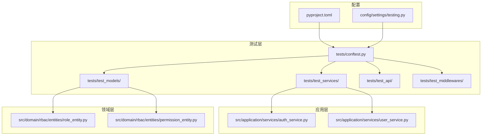
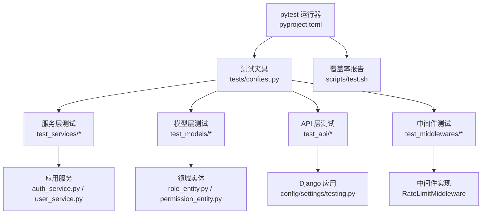
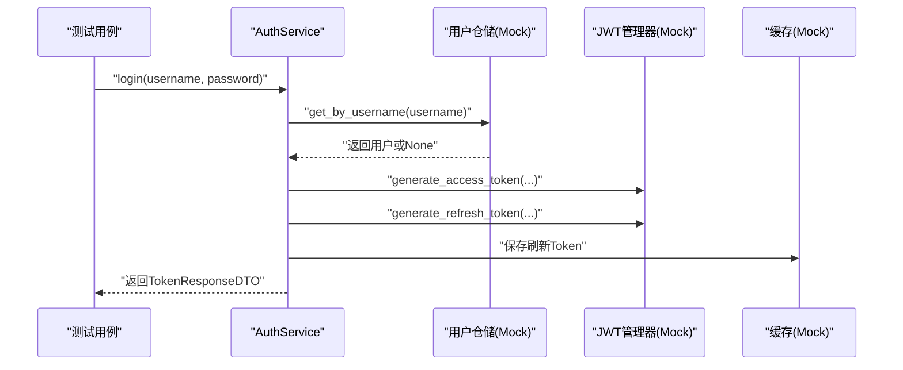
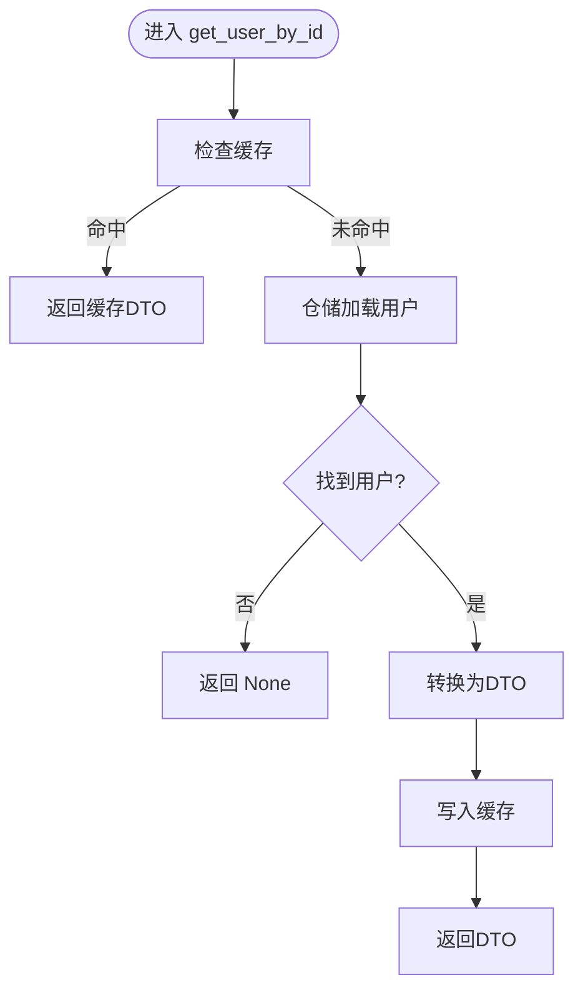
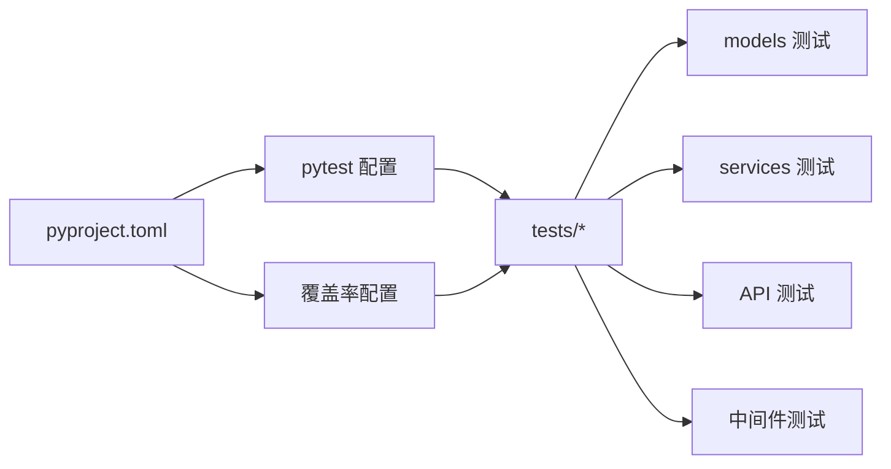

# 单元测试

<cite>
**本文引用的文件**
- [tests/conftest.py](file://tests/conftest.py)
- [tests/test_services/test_auth_service.py](file://tests/test_services/test_auth_service.py)
- [tests/test_services/test_user_service.py](file://tests/test_services/test_user_service.py)
- [tests/test_models/test_user_models.py](file://tests/test_models/test_user_models.py)
- [tests/test_models/test_rbac_models.py](file://tests/test_models/test_rbac_models.py)
- [tests/test_api/test_auth_api.py](file://tests/test_api/test_auth_api.py)
- [tests/test_middlewares/test_rate_limit_middleware.py](file://tests/test_middlewares/test_rate_limit_middleware.py)
- [scripts/test.sh](file://scripts/test.sh)
- [pyproject.toml](file://pyproject.toml)
- [config/settings/testing.py](file://config/settings/testing.py)
- [src/application/services/auth_service.py](file://src/application/services/auth_service.py)
- [src/application/services/user_service.py](file://src/application/services/user_service.py)
- [src/domain/rbac/entities/role_entity.py](file://src/domain/rbac/entities/role_entity.py)
- [src/domain/rbac/entities/permission_entity.py](file://src/domain/rbac/entities/permission_entity.py)
</cite>

## 目录
1. [引言](#引言)
2. [项目结构](#项目结构)
3. [核心组件](#核心组件)
4. [架构总览](#架构总览)
5. [详细组件分析](#详细组件分析)
6. [依赖分析](#依赖分析)
7. [性能考虑](#性能考虑)
8. [故障排查指南](#故障排查指南)
9. [结论](#结论)
10. [附录](#附录)

## 引言
本文件面向开发者与测试工程师，系统化阐述本项目的单元测试体系与最佳实践，涵盖服务层测试、模型层测试、API 层测试与中间件测试。重点说明如何使用 pytest.fixture 组织测试数据与依赖注入，如何进行测试隔离、断言策略、异常处理与覆盖率分析，并提供可直接参考的测试示例路径与调试技巧。

## 项目结构
测试相关目录与文件组织如下：
- tests/
  - conftest.py：全局测试夹具与数据库初始化
  - test_services/：服务层单元测试（认证、用户）
  - test_models/：模型层单元测试（用户、RBAC）
  - test_api/：API 接口测试（认证）
  - test_middlewares/：中间件测试（速率限制）
- scripts/test.sh：一键运行测试与覆盖率生成
- pyproject.toml：pytest、覆盖率与 Django 设置
- config/settings/testing.py：测试环境配置（内存数据库、禁用缓存等）

图表来源
- [tests/conftest.py:1-66](file://tests/conftest.py#L1-L66)
- [tests/test_services/test_auth_service.py:1-143](file://tests/test_services/test_auth_service.py#L1-L143)
- [tests/test_services/test_user_service.py:1-112](file://tests/test_services/test_user_service.py#L1-L112)
- [tests/test_models/test_user_models.py:1-82](file://tests/test_models/test_user_models.py#L1-L82)
- [tests/test_models/test_rbac_models.py:1-99](file://tests/test_models/test_rbac_models.py#L1-L99)
- [tests/test_api/test_auth_api.py:1-87](file://tests/test_api/test_auth_api.py#L1-L87)
- [tests/test_middlewares/test_rate_limit_middleware.py:1-76](file://tests/test_middlewares/test_rate_limit_middleware.py#L1-L76)
- [pyproject.toml:92-131](file://pyproject.toml#L92-L131)
- [config/settings/testing.py:1-32](file://config/settings/testing.py#L1-L32)

章节来源
- [pyproject.toml:92-131](file://pyproject.toml#L92-L131)
- [config/settings/testing.py:1-32](file://config/settings/testing.py#L1-L32)

## 核心组件
- 测试夹具（fixtures）：通过 tests/conftest.py 提供数据库迁移、用户数据、角色与权限数据等通用夹具，确保测试隔离与可重复性。
- 服务层测试：覆盖 AuthService 与 UserService 的核心业务流程，包括登录、注册、刷新、登出、用户增删改查等。
- 模型层测试：验证用户模型、用户档案模型以及 RBAC 角色与权限模型的创建、约束与关联。
- API 层测试：使用 Django Client 对认证接口进行端到端验证。
- 中间件测试：验证速率限制中间件在不同请求频率与白名单场景下的行为。
- 覆盖率与运行：通过 scripts/test.sh 一键运行 pytest 并生成 HTML 与终端缺失报告。

章节来源
- [tests/conftest.py:10-66](file://tests/conftest.py#L10-L66)
- [tests/test_services/test_auth_service.py:10-21](file://tests/test_services/test_auth_service.py#L10-L21)
- [tests/test_services/test_user_service.py:10-21](file://tests/test_services/test_user_service.py#L10-L21)
- [tests/test_models/test_user_models.py:17-82](file://tests/test_models/test_user_models.py#L17-L82)
- [tests/test_models/test_rbac_models.py:17-99](file://tests/test_models/test_rbac_models.py#L17-L99)
- [tests/test_api/test_auth_api.py:11-87](file://tests/test_api/test_auth_api.py#L11-L87)
- [tests/test_middlewares/test_rate_limit_middleware.py:13-76](file://tests/test_middlewares/test_rate_limit_middleware.py#L13-L76)
- [scripts/test.sh:10-14](file://scripts/test.sh#L10-L14)

## 架构总览
下图展示了测试金字塔与各层职责：测试夹具负责基础设施准备；服务层与模型层分别验证业务逻辑与数据模型；API 层与中间件层验证集成行为；覆盖率工具贯穿整个测试生命周期。

图表来源
- [pyproject.toml:92-131](file://pyproject.toml#L92-L131)
- [tests/conftest.py:10-66](file://tests/conftest.py#L10-L66)
- [tests/test_services/test_auth_service.py:10-21](file://tests/test_services/test_auth_service.py#L10-L21)
- [tests/test_services/test_user_service.py:10-21](file://tests/test_services/test_user_service.py#L10-L21)
- [tests/test_models/test_user_models.py:17-82](file://tests/test_models/test_user_models.py#L17-L82)
- [tests/test_models/test_rbac_models.py:17-99](file://tests/test_models/test_rbac_models.py#L17-L99)
- [tests/test_api/test_auth_api.py:11-87](file://tests/test_api/test_auth_api.py#L11-L87)
- [tests/test_middlewares/test_rate_limit_middleware.py:13-76](file://tests/test_middlewares/test_rate_limit_middleware.py#L13-L76)
- [scripts/test.sh:10-14](file://scripts/test.sh#L10-L14)

## 详细组件分析

### 测试夹具与环境准备
- 会话级数据库迁移：在测试会话开始前执行迁移，保证模型与表结构就绪。
- 用户与管理员数据夹具：提供标准用户与管理员用户的数据模板，便于快速创建测试对象。
- 角色与权限数据夹具：提供角色与权限的标准数据模板，支持 RBAC 相关测试。
- 测试环境配置：使用内存数据库、本地缓存与快速密码哈希器，提升测试速度与稳定性。

章节来源
- [tests/conftest.py:10-66](file://tests/conftest.py#L10-L66)
- [config/settings/testing.py:10-32](file://config/settings/testing.py#L10-L32)

### 服务层测试：认证服务（AuthService）
- 关键场景
  - 登录成功：校验凭据、生成访问与刷新 Token、记录登录日志与最后登录时间。
  - 登录失败（密码错误/用户不存在/非活跃用户）：返回 None 或抛出异常。
  - 注册成功：去重校验、密码哈希、持久化与返回 DTO。
  - 刷新 Token：校验刷新 Token、重新生成访问 Token。
  - 登出：撤销 Token、清理用户相关缓存。
- 测试要点
  - 使用 Mock 注入依赖（用户仓储、JWT 管理器、缓存），确保测试隔离。
  - 断言返回值结构与调用次数，验证外部依赖交互。
  - 异常场景通过断言 None 或异常类型进行验证。

图表来源
- [tests/test_services/test_auth_service.py:27-52](file://tests/test_services/test_auth_service.py#L27-L52)
- [src/application/services/auth_service.py:26-112](file://src/application/services/auth_service.py#L26-L112)

章节来源
- [tests/test_services/test_auth_service.py:23-143](file://tests/test_services/test_auth_service.py#L23-L143)
- [src/application/services/auth_service.py:20-200](file://src/application/services/auth_service.py#L20-L200)

### 服务层测试：用户服务（UserService）
- 关键场景
  - 根据 ID 获取用户：缓存命中与未命中分支、DTO 转换。
  - 获取用户列表：分页与总数统计。
  - 更新用户：字段更新、缓存清理。
  - 删除用户：软/硬删除后的缓存清理。
  - 修改密码：旧密码校验、新密码哈希与保存。
- 测试要点
  - 使用 Mock 仓储与缓存，验证 DTO 映射与缓存一致性。
  - 断言异常场景（用户不存在、原密码错误）。
  - 验证缓存读写与清理的正确性。

图表来源
- [tests/test_services/test_user_service.py:52-62](file://tests/test_services/test_user_service.py#L52-L62)
- [src/application/services/user_service.py:52-66](file://src/application/services/user_service.py#L52-L66)

章节来源
- [tests/test_services/test_user_service.py:23-112](file://tests/test_services/test_user_service.py#L23-L112)
- [src/application/services/user_service.py:15-172](file://src/application/services/user_service.py#L15-L172)

### 模型层测试：用户与用户档案
- 用户模型
  - 创建普通用户与超级用户：字段校验、默认值与权限位。
  - 无邮箱用户：邮箱为空字符串的边界情况。
  - 字符串表示：str 返回用户名。
- 用户档案模型
  - 创建档案、自动创建、字符串表示。
- 测试要点
  - 使用 @pytest.mark.django_db 标记数据库操作。
  - 使用夹具 user_data 与 admin_user_data 提供测试数据。

章节来源
- [tests/test_models/test_user_models.py:8-82](file://tests/test_models/test_user_models.py#L8-L82)

### 模型层测试：RBAC 角色与权限
- 角色模型
  - 创建角色、字符串表示、唯一性约束（重复创建应触发异常）。
- 权限模型
  - 创建权限、字符串表示。
- 角色-权限关联
  - 分配与撤销权限，验证多对多关系。
- 测试要点
  - 使用夹具 role_data 与 permission_data。
  - 唯一性测试通过捕获异常进行断言。

章节来源
- [tests/test_models/test_rbac_models.py:8-99](file://tests/test_models/test_rbac_models.py#L8-L99)

### API 层测试：认证接口
- 关键场景
  - 登录成功：返回 access_token 与 refresh_token。
  - 登录失败（错误密码）：返回服务器错误状态码。
  - 刷新 Token：先登录获取 refresh_token，再请求刷新接口。
- 测试要点
  - 使用 Django Client 发送 JSON 请求。
  - 断言状态码与响应体字段。

章节来源
- [tests/test_api/test_auth_api.py:11-87](file://tests/test_api/test_auth_api.py#L11-L87)

### 中间件测试：速率限制中间件
- 关键场景
  - 请求在限制内：正常放行。
  - 请求超过限制：返回 429 并包含提示信息。
  - 白名单 IP：绕过速率限制。
- 测试要点
  - 使用 RequestFactory 构造请求，模拟 REMOTE_ADDR。
  - Mock 缓存以控制计数与白名单判定。

章节来源
- [tests/test_middlewares/test_rate_limit_middleware.py:29-76](file://tests/test_middlewares/test_rate_limit_middleware.py#L29-L76)

## 依赖分析
- 测试与实现的耦合
  - 服务层测试通过 Mock 与夹具解耦仓储、缓存与 JWT 管理器，降低耦合并提高可维护性。
  - 模型层测试依赖 Django ORM 与测试数据库，确保真实约束与关系行为被验证。
  - API 与中间件测试依赖 Django 测试客户端与请求工厂，覆盖集成路径。
- 外部依赖与配置
  - pytest、pytest-django、pytest-cov、pytest-asyncio 在 pyproject.toml 中声明。
  - 测试环境使用 SQLite 内存数据库与本地缓存，禁用速率限制，加速测试执行。

图表来源
- [pyproject.toml:92-131](file://pyproject.toml#L92-L131)

章节来源
- [pyproject.toml:92-131](file://pyproject.toml#L92-L131)

## 性能考虑
- 测试数据库与缓存
  - 测试环境使用内存数据库与本地缓存，避免磁盘 IO 与网络延迟。
- 依赖注入与 Mock
  - 使用 Mock 替代真实外部系统（仓储、缓存、JWT），减少等待与副作用。
- 覆盖率与并行
  - 覆盖率仅针对 src 源码，忽略 migrations 与 tests，避免污染结果。
  - pytest 支持并发标记与异步模式，可在 CI 中按需启用。

章节来源
- [config/settings/testing.py:10-32](file://config/settings/testing.py#L10-L32)
- [pyproject.toml:111-131](file://pyproject.toml#L111-L131)

## 故障排查指南
- 测试无法连接数据库
  - 确认测试夹具已执行数据库迁移；检查测试环境配置 DATABASES 与 CACHES。
- 速率限制导致 429
  - 检查缓存计数与白名单逻辑；确认 RequestFactory 设置了正确的 REMOTE_ADDR。
- 登录失败但期望成功
  - 核对用户状态（is_active）、密码哈希算法与 DTO 字段映射。
- 覆盖率报告为空或不准确
  - 确认覆盖率源指向 src，且未被忽略；检查脚本中的 --cov 参数。
- 异步测试报错
  - 确认使用 asyncio_mode 与正确的测试装饰器；避免在同步测试中混用异步实现。

章节来源
- [tests/conftest.py:10-16](file://tests/conftest.py#L10-L16)
- [tests/test_middlewares/test_rate_limit_middleware.py:46-58](file://tests/test_middlewares/test_rate_limit_middleware.py#L46-L58)
- [tests/test_api/test_auth_api.py:44-56](file://tests/test_api/test_auth_api.py#L44-L56)
- [scripts/test.sh:10-14](file://scripts/test.sh#L10-L14)
- [pyproject.toml:109-110](file://pyproject.toml#L109-L110)

## 结论
本项目的单元测试体系以 pytest 为核心，结合夹具与 Mock 实现高隔离度与高可重复性的测试。通过服务层、模型层、API 层与中间件层的全面覆盖，配合覆盖率与测试脚本，能够有效保障业务逻辑正确性与系统稳定性。建议持续补充边界与异常场景测试，并在 CI 中开启覆盖率阈值与异步模式，进一步提升质量与效率。

## 附录
- 运行测试与生成覆盖率
  - 使用脚本一键运行：[scripts/test.sh:10-14](file://scripts/test.sh#L10-L14)
  - pytest 配置与标记：[pyproject.toml:92-108](file://pyproject.toml#L92-L108)
  - 覆盖率源与忽略规则：[pyproject.toml:111-131](file://pyproject.toml#L111-L131)
- 测试夹具清单
  - 数据库迁移与会话设置：[tests/conftest.py:10-16](file://tests/conftest.py#L10-L16)
  - 用户与管理员数据：[tests/conftest.py:33-53](file://tests/conftest.py#L33-L53)
  - 角色与权限数据：[tests/conftest.py:57-66](file://tests/conftest.py#L57-L66)
- 服务层测试示例路径
  - 认证服务登录/注册/刷新/登出：[tests/test_services/test_auth_service.py:27-143](file://tests/test_services/test_auth_service.py#L27-L143)
  - 用户服务增删改查与密码修改：[tests/test_services/test_user_service.py:27-112](file://tests/test_services/test_user_service.py#L27-L112)
- 模型层测试示例路径
  - 用户与档案模型：[tests/test_models/test_user_models.py:18-82](file://tests/test_models/test_user_models.py#L18-L82)
  - RBAC 角色与权限模型：[tests/test_models/test_rbac_models.py:18-99](file://tests/test_models/test_rbac_models.py#L18-L99)
- API 层测试示例路径
  - 认证接口登录/刷新：[tests/test_api/test_auth_api.py:23-87](file://tests/test_api/test_auth_api.py#L23-L87)
- 中间件测试示例路径
  - 速率限制中间件：[tests/test_middlewares/test_rate_limit_middleware.py:33-76](file://tests/test_middlewares/test_rate_limit_middleware.py#L33-L76)
- 领域实体参考
  - 角色实体与权限实体：[src/domain/rbac/entities/role_entity.py:11-80](file://src/domain/rbac/entities/role_entity.py#L11-L80), [src/domain/rbac/entities/permission_entity.py:11-85](file://src/domain/rbac/entities/permission_entity.py#L11-L85)