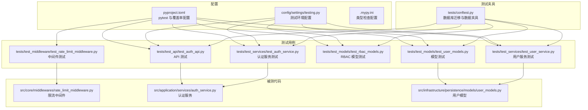
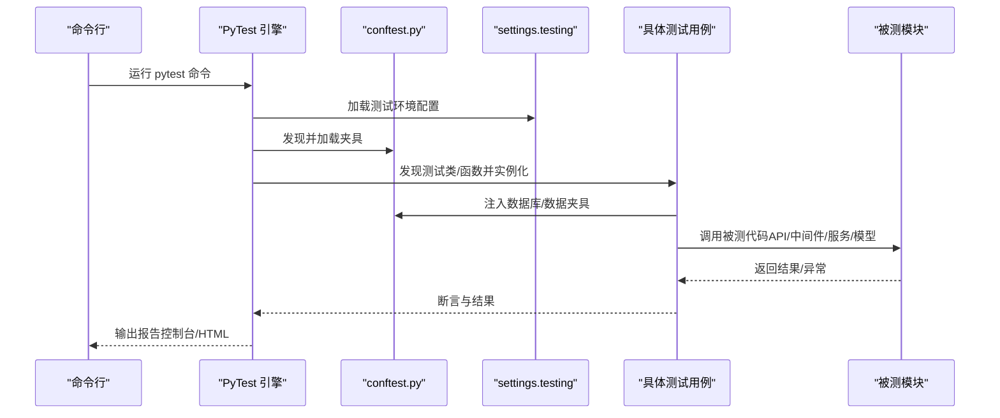
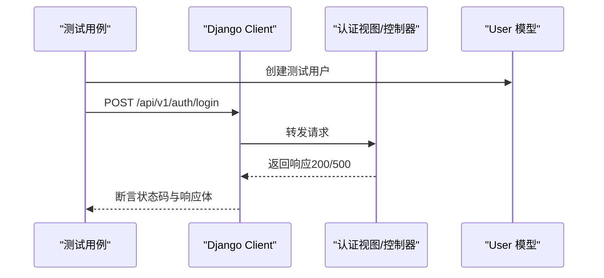
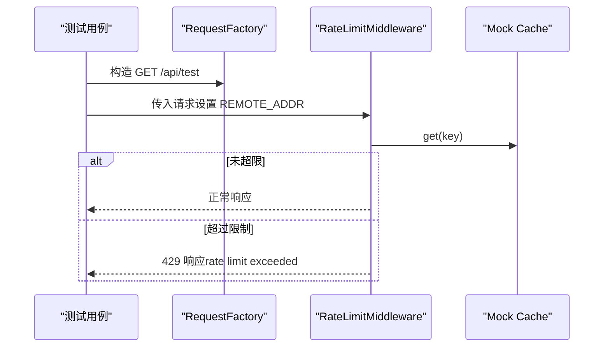
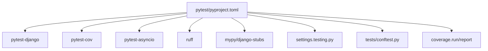

# 测试框架

<cite>
**本文引用的文件**
- [pyproject.toml](file://pyproject.toml)
- [scripts/test.sh](file://scripts/test.sh)
- [config/settings/testing.py](file://config/settings/testing.py)
- [.mypy.ini](file://.mypy.ini)
- [tests/conftest.py](file://tests/conftest.py)
- [tests/test_api/test_auth_api.py](file://tests/test_api/test_auth_api.py)
- [tests/test_middleware/test_rate_limit_middleware.py](file://tests/test_middleware/test_rate_limit_middleware.py)
- [tests/test_models/test_user_models.py](file://tests/test_models/test_user_models.py)
- [tests/test_models/test_rbac_models.py](file://tests/test_models/test_rbac_models.py)
- [tests/test_services/test_auth_service.py](file://tests/test_services/test_auth_service.py)
- [tests/test_services/test_user_service.py](file://tests/test_services/test_user_service.py)
- [src/core/middlewares/rate_limit_middleware.py](file://src/core/middlewares/rate_limit_middleware.py)
- [src/application/services/auth_service.py](file://src/application/services/auth_service.py)
- [src/infrastructure/persistence/models/user_models.py](file://src/infrastructure/persistence/models/user_models.py)
</cite>

## 目录
1. [引言](#引言)
2. [项目结构](#项目结构)
3. [核心组件](#核心组件)
4. [架构总览](#架构总览)
5. [详细组件分析](#详细组件分析)
6. [依赖分析](#依赖分析)
7. [性能考虑](#性能考虑)
8. [故障排除指南](#故障排除指南)
9. [结论](#结论)
10. [附录](#附录)

## 引言
本文件系统性梳理并说明本项目的测试框架与实践，覆盖 PyTest 配置与使用、测试组织结构、夹具（fixtures）、参数化与标记（markers）、覆盖率分析、不同层次测试（单元、集成、API、中间件）的编写方法、最佳实践、运行与调试技巧。内容以仓库现有实现为依据，避免臆测，帮助开发者快速上手并规范化测试流程。

## 项目结构
测试相关的关键位置与职责如下：
- 配置层
  - pytest 配置与选项：位于 [pyproject.toml] 的 [tool.pytest.ini_options] 区域，定义 Django 设置模块、测试文件/类/函数匹配规则、严格模式、默认测试路径、自定义标记等。
  - 覆盖率配置：位于 [pyproject.toml] 的 [tool.coverage.run] 与 [tool.coverage.report]，指定源码目录、忽略路径与排除行规则。
  - 测试环境配置：位于 [config/settings/testing.py]，使用内存数据库、禁用缓存、简化密码哈希器、关闭速率限制等，提升测试速度与可重复性。
  - 类型检查与测试隔离：位于 [.mypy.ini]，为测试模块放宽类型检查，避免影响测试开发效率。
- 测试夹具与通用设置
  - 会话级数据库迁移与模型夹具：位于 [tests/conftest.py]，提供用户、角色、权限等常用数据夹具，以及会话级数据库初始化。
- 测试用例
  - API 测试：位于 [tests/test_api/test_auth_api.py]，使用 Django Client 发起请求，验证认证接口行为。
  - 中间件测试：位于 [tests/test_middleware/test_rate_limit_middleware.py]，使用 RequestFactory 与 Mock 对限流中间件进行单元测试。
  - 模型测试：位于 [tests/test_models/test_user_models.py] 与 [tests/test_models/test_rbac_models.py]，验证模型创建、约束与关系。
  - 服务层测试：位于 [tests/test_services/test_auth_service.py] 与 [tests/test_services/test_user_service.py]，通过 Mock 隔离外部依赖，验证业务逻辑。
- 运行脚本
  - 一键测试与覆盖率生成：位于 [scripts/test.sh]，调用 pytest 并输出 HTML 报告。

图表来源
- [pyproject.toml:92-131](file://pyproject.toml#L92-L131)
- [config/settings/testing.py:1-32](file://config/settings/testing.py#L1-L32)
- [tests/conftest.py:1-66](file://tests/conftest.py#L1-L66)
- [tests/test_api/test_auth_api.py:1-87](file://tests/test_api/test_auth_api.py#L1-L87)
- [tests/test_middleware/test_rate_limit_middleware.py:1-76](file://tests/test_middleware/test_rate_limit_middleware.py#L1-L76)
- [tests/test_models/test_user_models.py:1-82](file://tests/test_models/test_user_models.py#L1-L82)
- [tests/test_models/test_rbac_models.py:1-99](file://tests/test_models/test_rbac_models.py#L1-L99)
- [tests/test_services/test_auth_service.py:1-143](file://tests/test_services/test_auth_service.py#L1-L143)
- [tests/test_services/test_user_service.py:1-112](file://tests/test_services/test_user_service.py#L1-L112)
- [src/core/middlewares/rate_limit_middleware.py:1-112](file://src/core/middlewares/rate_limit_middleware.py#L1-L112)
- [src/application/services/auth_service.py:1-233](file://src/application/services/auth_service.py#L1-L233)
- [src/infrastructure/persistence/models/user_models.py:1-147](file://src/infrastructure/persistence/models/user_models.py#L1-L147)

章节来源
- [pyproject.toml:92-131](file://pyproject.toml#L92-L131)
- [config/settings/testing.py:1-32](file://config/settings/testing.py#L1-L32)
- [tests/conftest.py:1-66](file://tests/conftest.py#L1-L66)

## 核心组件
- PyTest 配置与标记
  - 通过 [pyproject.toml] 的 [tool.pytest.ini_options] 定义：
    - DJANGO_SETTINGS_MODULE 指向测试环境配置。
    - python_files/python_classes/python_functions 控制测试发现规则。
    - addopts 启用严格模式、短回溯、显示未捕获异常等。
    - markers 定义 unit/integration/slow 等标记，便于分组运行与过滤。
    - testpaths 指定测试目录。
    - asyncio_mode 自动模式适配异步测试。
- 覆盖率配置
  - [tool.coverage.run] 指定覆盖率源码目录与忽略路径。
  - [tool.coverage.report] 提供排除行规则，如抽象方法、特殊魔术方法等。
- 测试环境
  - [config/settings/testing.py] 使用内存数据库、本地缓存、MD5密码哈希器、关闭速率限制，确保测试快速稳定。
- 类型检查
  - [.mypy.ini] 为测试模块放宽类型要求，并忽略迁移与配置模块的类型错误，提升开发体验。
- 测试夹具
  - [tests/conftest.py] 提供会话级数据库迁移、User 模型夹具、用户/管理员/角色/权限数据夹具，统一测试数据来源。

章节来源
- [pyproject.toml:92-131](file://pyproject.toml#L92-L131)
- [config/settings/testing.py:1-32](file://config/settings/testing.py#L1-L32)
- [.mypy.ini:1-45](file://.mypy.ini#L1-L45)
- [tests/conftest.py:1-66](file://tests/conftest.py#L1-L66)

## 架构总览
下图展示测试运行时的总体交互：测试发现与加载、夹具注入、被测代码执行、断言与覆盖率收集。

图表来源
- [pyproject.toml:92-131](file://pyproject.toml#L92-L131)
- [config/settings/testing.py:1-32](file://config/settings/testing.py#L1-L32)
- [tests/conftest.py:1-66](file://tests/conftest.py#L1-L66)
- [tests/test_api/test_auth_api.py:1-87](file://tests/test_api/test_auth_api.py#L1-L87)
- [tests/test_middleware/test_rate_limit_middleware.py:1-76](file://tests/test_middleware/test_rate_limit_middleware.py#L1-L76)
- [tests/test_services/test_auth_service.py:1-143](file://tests/test_services/test_auth_service.py#L1-L143)
- [tests/test_models/test_user_models.py:1-82](file://tests/test_models/test_user_models.py#L1-L82)

## 详细组件分析

### 测试夹具（Fixtures）与数据准备
- 会话级数据库迁移：在 [tests/conftest.py] 中，通过会话级夹具确保迁移在测试前完成，避免每次测试重复迁移带来的开销。
- 模型与数据夹具：
  - User 模型夹具：返回 Django User 类型，便于在测试中直接使用。
  - user_data/admin_user_data：提供标准用户与管理员用户的数据字典，用于创建测试用户。
  - role_data/permission_data：提供角色与权限的基础数据，便于 RBAC 相关测试。
- 使用建议：
  - 在需要数据库的测试中使用 @pytest.mark.django_db 标记，确保数据库可用。
  - 将公共数据封装到夹具，减少重复代码，提高可维护性。

章节来源
- [tests/conftest.py:10-66](file://tests/conftest.py#L10-L66)

### API 测试（认证接口）
- 测试目标：验证认证 API 的登录、刷新 Token 等行为。
- 关键点：
  - 使用 Django Client 发起 JSON 请求，构造登录数据。
  - 通过断言状态码与响应体字段（如 access_token、refresh_token）验证接口行为。
  - 在测试前创建用户并设置为激活状态，确保登录成功路径可验证。
- 最佳实践：
  - 将用户数据通过夹具传入，避免硬编码。
  - 对错误场景（如错误密码）进行断言，确保服务端返回合理状态码。

图表来源
- [tests/test_api/test_auth_api.py:23-87](file://tests/test_api/test_auth_api.py#L23-L87)

章节来源
- [tests/test_api/test_auth_api.py:1-87](file://tests/test_api/test_auth_api.py#L1-L87)

### 中间件测试（速率限制中间件）
- 测试目标：验证限流中间件在不同请求量与白名单 IP 下的行为。
- 关键点：
  - 使用 RequestFactory 构造请求，模拟 REMOTE_ADDR。
  - 通过 Mock 替换缓存，控制请求计数与白名单判断。
  - 断言在超限时返回 429，并包含限流提示；在限额内放行。
- 最佳实践：
  - 将中间件实例化与缓存 Mock 解耦为夹具，复用到多个测试用例。
  - 对白名单逻辑进行独立断言，确保缓存调用路径正确。

图表来源
- [tests/test_middleware/test_rate_limit_middleware.py:33-76](file://tests/test_middleware/test_rate_limit_middleware.py#L33-L76)
- [src/core/middlewares/rate_limit_middleware.py:41-112](file://src/core/middlewares/rate_limit_middleware.py#L41-L112)

章节来源
- [tests/test_middleware/test_rate_limit_middleware.py:1-76](file://tests/test_middleware/test_rate_limit_middleware.py#L1-L76)
- [src/core/middlewares/rate_limit_middleware.py:1-112](file://src/core/middlewares/rate_limit_middleware.py#L1-L112)

### 模型测试（用户与 RBAC）
- 用户模型测试：
  - 验证创建普通用户/超级用户、无邮箱用户、字符串表示等。
  - 验证用户档案模型的创建、自动创建与字符串表示。
- RBAC 模型测试：
  - 验证角色与权限的创建、唯一性约束、角色与权限的关联与解绑。
- 最佳实践：
  - 使用 @pytest.mark.django_db 标记数据库相关测试。
  - 对约束（如唯一性）使用异常断言，确保数据库约束生效。

章节来源
- [tests/test_models/test_user_models.py:1-82](file://tests/test_models/test_user_models.py#L1-L82)
- [tests/test_models/test_rbac_models.py:1-99](file://tests/test_models/test_rbac_models.py#L1-L99)
- [src/infrastructure/persistence/models/user_models.py:1-147](file://src/infrastructure/persistence/models/user_models.py#L1-L147)

### 服务层测试（认证与用户服务）
- 认证服务测试：
  - 使用 Mock 隔离用户仓储、JWT 管理器与缓存，验证登录、注册、刷新 Token、登出等流程。
  - 对异常场景（无效密码、用户不存在、非活跃用户）进行断言。
- 用户服务测试：
  - 验证按 ID 查询、列表查询、更新、删除等操作，断言仓储调用次数与参数。
- 最佳实践：
  - 将外部依赖 Mock 化，聚焦业务逻辑断言。
  - 对关键调用使用 assert_called_once_with 等断言，确保调用契约。

章节来源
- [tests/test_services/test_auth_service.py:1-143](file://tests/test_services/test_auth_service.py#L1-L143)
- [tests/test_services/test_user_service.py:1-112](file://tests/test_services/test_user_service.py#L1-L112)
- [src/application/services/auth_service.py:1-233](file://src/application/services/auth_service.py#L1-L233)

### 覆盖率分析与报告
- 配置入口：
  - 源码目录与忽略路径：[pyproject.toml] 的 [tool.coverage.run]。
  - 排除行规则：[pyproject.toml] 的 [tool.coverage.report]。
- 运行方式：
  - 一键脚本：[scripts/test.sh] 使用 --cov=src 与 --cov-report=html/term-missing 生成 HTML 报告与终端缺失行报告。
- 使用建议：
  - 在 CI 中结合覆盖率阈值策略，逐步提升覆盖度。
  - 结合 HTML 报告定位未覆盖分支与路径，补充针对性测试。

章节来源
- [pyproject.toml:111-131](file://pyproject.toml#L111-L131)
- [scripts/test.sh:10-14](file://scripts/test.sh#L10-L14)

### 参数化测试与标记（markers）
- 标记使用：
  - 在 [pyproject.toml] 中定义 unit/integration/slow 标记，测试中通过 pytest.mark.<marker> 应用。
  - 示例：在中间件测试中使用 @pytest.mark.unit 标记该用例为单元测试。
- 参数化建议：
  - 可使用 @pytest.mark.parametrize 为同一断言场景提供多组输入，提升覆盖面。
  - 与夹具配合，将参数化数据集中管理，便于扩展与维护。

章节来源
- [pyproject.toml:104-108](file://pyproject.toml#L104-L108)
- [tests/test_middleware/test_rate_limit_middleware.py:29](file://tests/test_middleware/test_rate_limit_middleware.py#L29)

### 不同类型测试的编写方法
- 单元测试（unit）：面向服务层与中间件，使用 Mock 隔离外部依赖，断言内部逻辑与调用契约。
- 集成测试（integration）：面向 API 与数据库交互，使用 Django Client 与 @pytest.mark.django_db，验证端到端流程。
- API 测试：重点验证接口行为、状态码与响应结构，结合用户/权限等夹具准备数据。
- 中间件测试：使用 RequestFactory 与 Mock 缓存，验证限流、安全头等中间件功能。

章节来源
- [tests/test_api/test_auth_api.py:11-87](file://tests/test_api/test_auth_api.py#L11-L87)
- [tests/test_middleware/test_rate_limit_middleware.py:29-76](file://tests/test_middleware/test_rate_limit_middleware.py#L29-L76)
- [tests/test_services/test_auth_service.py:23-143](file://tests/test_services/test_auth_service.py#L23-L143)
- [tests/test_models/test_user_models.py:17-82](file://tests/test_models/test_user_models.py#L17-L82)

## 依赖分析
- 测试框架与工具
  - pytest、pytest-django、pytest-cov、pytest-asyncio、ruff、mypy、django-stubs 等作为开发依赖，分别负责测试执行、Django 集成、覆盖率、类型检查与标注。
- 配置耦合
  - PyTest 通过 DJANGO_SETTINGS_MODULE 与测试环境配置耦合，确保测试数据库与缓存策略一致。
  - 覆盖率配置与源码目录耦合，保证统计范围可控。
- 夹具与被测模块
  - 夹具提供统一数据与环境，降低测试对具体实现细节的耦合。
  - 中间件与服务层测试通过 Mock 与 RequestFactory 降低对外部系统的依赖。

图表来源
- [pyproject.toml:26-36](file://pyproject.toml#L26-L36)
- [pyproject.toml:92-131](file://pyproject.toml#L92-L131)
- [config/settings/testing.py:1-32](file://config/settings/testing.py#L1-L32)
- [tests/conftest.py:1-66](file://tests/conftest.py#L1-L66)

章节来源
- [pyproject.toml:26-36](file://pyproject.toml#L26-L36)
- [pyproject.toml:92-131](file://pyproject.toml#L92-L131)

## 性能考虑
- 测试环境优化
  - 内存数据库与本地缓存：测试环境使用内存数据库与本地缓存，显著提升测试执行速度。
  - 简化密码哈希器：使用 MD5 哈希器，避免加密成本。
  - 关闭速率限制：避免限流对测试并发造成干扰。
- 覆盖率与报告
  - 使用 --tb=short 与 --strict-config 减少冗余输出，提升反馈速度。
  - HTML 报告仅在需要时生成，CI 中可按需开启。
- 并发与标记
  - 通过 markers（unit/integration/slow）分组运行，避免不必要的慢测试阻塞快速迭代。

章节来源
- [config/settings/testing.py:10-32](file://config/settings/testing.py#L10-L32)
- [pyproject.toml:97-109](file://pyproject.toml#L97-L109)

## 故障排除指南
- 测试无法连接数据库
  - 确认已应用会话级数据库迁移夹具，且测试环境配置正确。
  - 检查 DJANGO_SETTINGS_MODULE 是否指向测试配置。
- 速率限制导致测试失败
  - 检查测试环境是否关闭速率限制，或在测试中使用 Mock 缓存重置计数。
- 覆盖率报告为空或不准确
  - 确认覆盖率源码目录与忽略规则配置正确，确保被测模块在源码范围内。
- 类型检查干扰测试开发
  - 测试模块类型检查放宽，避免因类型注解问题阻碍测试编写。

章节来源
- [tests/conftest.py:10-29](file://tests/conftest.py#L10-L29)
- [config/settings/testing.py:30-32](file://config/settings/testing.py#L30-L32)
- [pyproject.toml:111-131](file://pyproject.toml#L111-L131)
- [.mypy.ini:22-28](file://.mypy.ini#L22-L28)

## 结论
本项目以 PyTest 为核心，结合 pytest-django、pytest-cov 等插件，构建了覆盖 API、中间件、模型与服务层的完整测试体系。通过测试环境配置、夹具与标记机制，实现了高效、可维护、可扩展的测试流程。建议在日常开发中遵循本文的最佳实践，持续完善覆盖率与测试质量。

## 附录

### 运行与调试
- 运行全部测试与生成覆盖率报告：参考 [scripts/test.sh]。
- 运行特定测试文件/类/函数：
  - 文件：pytest tests/test_api/test_auth_api.py
  - 类：pytest tests/test_api/test_auth_api.py::TestAuthAPI
  - 函数：pytest tests/test_api/test_auth_api.py::TestAuthAPI::test_login_success
- 分组运行与过滤：
  - 运行单元测试：pytest -m unit
  - 运行集成测试：pytest -m integration
  - 排除慢测试：pytest -m "not slow"
- 调试技巧：
  - 使用 -v 与 --tb=short 获取详细回溯。
  - 在测试中临时打印变量或使用断点（IDE 支持），定位问题。

章节来源
- [scripts/test.sh:10-14](file://scripts/test.sh#L10-L14)
- [pyproject.toml:94-109](file://pyproject.toml#L94-L109)