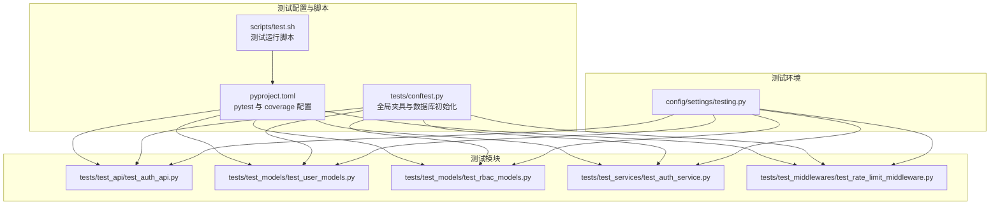
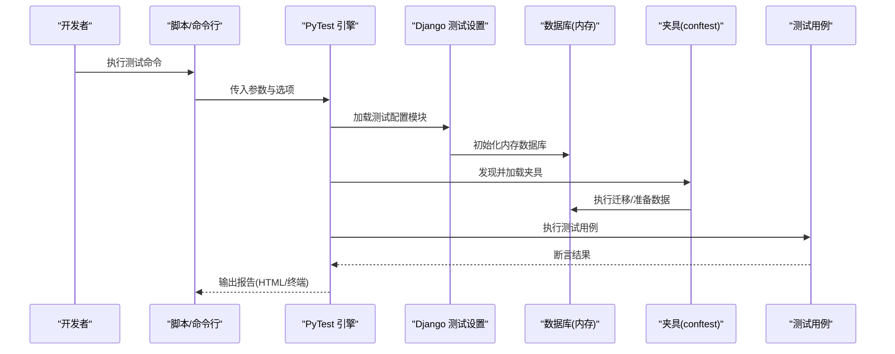
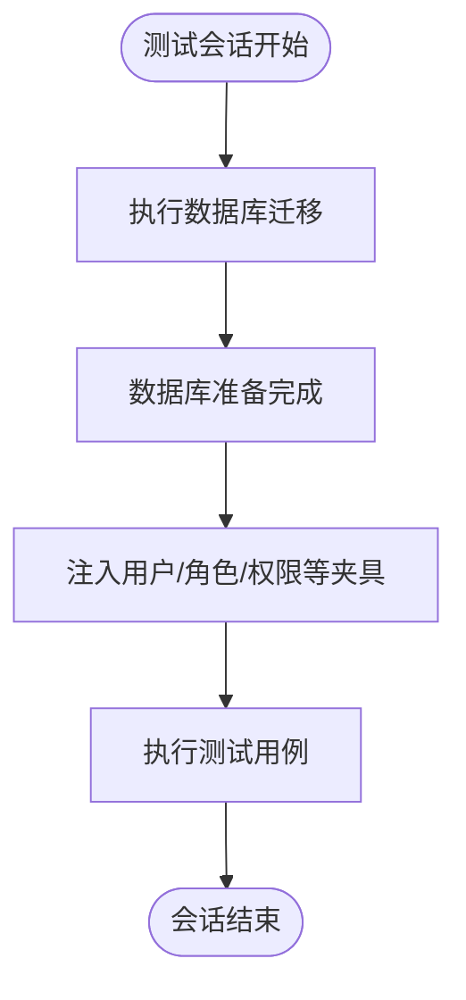
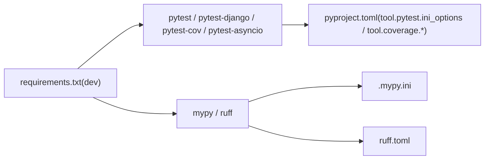

# 测试配置

<cite>
**本文引用的文件**
- [pyproject.toml](file://pyproject.toml)
- [scripts/test.sh](file://scripts/test.sh)
- [tests/conftest.py](file://tests/conftest.py)
- [config/settings/testing.py](file://config/settings/testing.py)
- [tests/test_api/test_auth_api.py](file://tests/test_api/test_auth_api.py)
- [tests/test_models/test_user_models.py](file://tests/test_models/test_user_models.py)
- [tests/test_models/test_rbac_models.py](file://tests/test_models/test_rbac_models.py)
- [tests/test_services/test_auth_service.py](file://tests/test_services/test_auth_service.py)
- [tests/test_middlewares/test_rate_limit_middleware.py](file://tests/test_middlewares/test_rate_limit_middleware.py)
- [.mypy.ini](file://.mypy.ini)
- [ruff.toml](file://ruff.toml)
- [requirements.txt](file://requirements.txt)
</cite>

## 目录
1. [简介](#简介)
2. [项目结构](#项目结构)
3. [核心组件](#核心组件)
4. [架构总览](#架构总览)
5. [详细组件分析](#详细组件分析)
6. [依赖分析](#依赖分析)
7. [性能考虑](#性能考虑)
8. [故障排查指南](#故障排查指南)
9. [结论](#结论)
10. [附录](#附录)

## 简介
本文件系统性梳理本项目的测试配置与实践，覆盖以下主题：
- PyTest 测试框架配置：包括 pytest.ini 与 pyproject.toml 中的测试配置项
- 测试夹具（fixtures）的定义与使用：数据库设置、测试数据准备、用户数据夹具等
- 测试运行脚本与命令行用法：单文件运行、按类运行、过滤标记等
- 测试覆盖率配置与报告生成：HTML 报告与终端缺失行报告
- 测试环境变量与测试数据库设置
- 与测试相关的工具链配置：Mypy、Ruff

## 项目结构
本项目采用分层与功能混合的组织方式，测试相关目录与文件如下：
- 测试入口与夹具：tests/conftest.py
- 测试模块：tests/test_api、tests/test_models、tests/test_middlewares、tests/test_services
- 测试配置：pyproject.toml（包含 pytest 与 coverage 配置）
- 测试脚本：scripts/test.sh
- 测试环境配置：config/settings/testing.py
- 开发工具配置：.mypy.ini、ruff.toml
- 依赖声明：requirements.txt（开发依赖包含 pytest 及其生态）

图表来源
- [pyproject.toml:92-131](file://pyproject.toml#L92-L131)
- [scripts/test.sh:1-14](file://scripts/test.sh#L1-L14)
- [tests/conftest.py:1-66](file://tests/conftest.py#L1-L66)
- [config/settings/testing.py:1-32](file://config/settings/testing.py#L1-L32)

章节来源
- [pyproject.toml:92-131](file://pyproject.toml#L92-L131)
- [scripts/test.sh:1-14](file://scripts/test.sh#L1-L14)
- [tests/conftest.py:1-66](file://tests/conftest.py#L1-L66)
- [config/settings/testing.py:1-32](file://config/settings/testing.py#L1-L32)

## 核心组件
- PyTest 配置（pyproject.toml）
  - 设置 Django 测试配置模块、文件/类/函数匹配模式、严格模式、回溯风格、测试路径、自定义标记、异步模式等
  - 覆盖率源与忽略列表、报告排除行规则
- 测试夹具（tests/conftest.py）
  - 会话级数据库迁移与初始化
  - 用户模型、用户数据、管理员数据、角色数据、权限数据等常用夹具
- 测试环境（config/settings/testing.py）
  - SQLite 内存数据库、本地缓存、快速密码哈希器、禁用速率限制
- 测试脚本（scripts/test.sh）
  - 激活虚拟环境后运行 pytest 并生成 HTML 与终端缺失行覆盖率报告

章节来源
- [pyproject.toml:92-131](file://pyproject.toml#L92-L131)
- [tests/conftest.py:10-66](file://tests/conftest.py#L10-L66)
- [config/settings/testing.py:10-32](file://config/settings/testing.py#L10-L32)
- [scripts/test.sh:10-14](file://scripts/test.sh#L10-L14)

## 架构总览
下图展示测试配置与运行的整体流程：从命令行到 PyTest、Django 测试设置、数据库初始化、夹具注入、测试执行与覆盖率生成。

图表来源
- [scripts/test.sh:10-14](file://scripts/test.sh#L10-L14)
- [pyproject.toml:92-109](file://pyproject.toml#L92-L109)
- [config/settings/testing.py:10-32](file://config/settings/testing.py#L10-L32)
- [tests/conftest.py:10-29](file://tests/conftest.py#L10-L29)

## 详细组件分析

### PyTest 配置（pyproject.toml）
- 关键配置点
  - DJANGO_SETTINGS_MODULE：指向测试环境配置模块
  - python_files/python_classes/python_functions：测试文件/类/函数命名规范
  - addopts：严格标记、严格配置、短回溯、显示未通过原因
  - testpaths：测试目录
  - markers：unit/integration/slow 等自定义标记
  - asyncio_mode：异步支持
  - 覆盖率：source、omit、report.exclude_lines
- 影响范围
  - 控制 PyTest 发现策略、执行行为、报告输出与覆盖率统计

章节来源
- [pyproject.toml:92-131](file://pyproject.toml#L92-L131)

### 测试夹具（tests/conftest.py）
- 会话级数据库初始化
  - 在会话开始时执行迁移，确保数据库结构就绪
- 常用夹具
  - User：返回 Django 用户模型
  - user_data/admin_user_data：标准用户与管理员用户数据字典
  - role_data/permission_data：角色与权限数据字典
- 作用域与生命周期
  - session 级别用于数据库初始化；其他夹具按默认作用域注入到测试函数

图表来源
- [tests/conftest.py:10-29](file://tests/conftest.py#L10-L29)

章节来源
- [tests/conftest.py:10-66](file://tests/conftest.py#L10-L66)

### 测试环境（config/settings/testing.py）
- 数据库：使用 SQLite 内存数据库，速度快且隔离性好
- 缓存：本地内存缓存，避免持久化影响
- 密码哈希：使用快速哈希器以提升测试速度
- 速率限制：禁用，避免干扰测试稳定性

章节来源
- [config/settings/testing.py:10-32](file://config/settings/testing.py#L10-L32)

### 测试脚本（scripts/test.sh）
- 功能：激活虚拟环境、运行 pytest、生成 HTML 与终端缺失行覆盖率报告
- 输出：htmlcov/ 目录下生成 HTML 报告

章节来源
- [scripts/test.sh:10-14](file://scripts/test.sh#L10-L14)

### 测试用例示例与夹具使用
- API 层测试（认证接口）
  - 使用 user_data 夹具创建用户，验证登录与刷新 Token
- 模型层测试（用户与 RBAC）
  - 使用 user_data、role_data、permission_data 夹具进行模型创建与断言
- 服务层测试（认证服务）
  - 使用 Mock 注入依赖，验证登录、注册、刷新 Token、登出逻辑
- 中间件测试（速率限制）
  - 使用 RequestFactory 与 Mock 缓存，验证限流与白名单逻辑

章节来源
- [tests/test_api/test_auth_api.py:23-87](file://tests/test_api/test_auth_api.py#L23-L87)
- [tests/test_models/test_user_models.py:17-82](file://tests/test_models/test_user_models.py#L17-L82)
- [tests/test_models/test_rbac_models.py:17-99](file://tests/test_models/test_rbac_models.py#L17-L99)
- [tests/test_services/test_auth_service.py:23-143](file://tests/test_services/test_auth_service.py#L23-L143)
- [tests/test_middlewares/test_rate_limit_middleware.py:29-76](file://tests/test_middlewares/test_rate_limit_middleware.py#L29-L76)

## 依赖分析
- 开发依赖（requirements.txt 中的 dev 组）
  - pytest、pytest-django、pytest-cov、pytest-asyncio、faker 等
- 工具链配置
  - .mypy.ini：类型检查配置，含 Django stubs 设置
  - ruff.toml：代码风格与静态检查规则，含测试文件特殊规则

图表来源
- [requirements.txt:26-36](file://requirements.txt#L26-L36)
- [pyproject.toml:92-131](file://pyproject.toml#L92-L131)
- [.mypy.ini:19-21](file://.mypy.ini#L19-L21)
- [ruff.toml:1-54](file://ruff.toml#L1-L54)

章节来源
- [requirements.txt:26-36](file://requirements.txt#L26-L36)
- [pyproject.toml:92-131](file://pyproject.toml#L92-L131)
- [.mypy.ini:19-21](file://.mypy.ini#L19-L21)
- [ruff.toml:1-54](file://ruff.toml#L1-L54)

## 性能考虑
- 测试数据库：使用内存数据库，显著降低 I/O 开销
- 密码哈希器：使用快速哈希器，缩短测试执行时间
- 缓存：本地内存缓存，避免外部依赖带来的不确定性
- 覆盖率：仅对 src 目录统计，忽略 migrations/tests/config/manage.py，减少无关统计

章节来源
- [config/settings/testing.py:10-32](file://config/settings/testing.py#L10-L32)
- [pyproject.toml:111-131](file://pyproject.toml#L111-L131)

## 故障排查指南
- 测试无法发现或执行
  - 检查命名规范：文件名需匹配 python_files，类名需匹配 python_classes，函数名需匹配 python_functions
  - 检查 addopts 与严格模式是否导致失败
- 数据库相关问题
  - 确认会话级夹具已执行迁移；如仍失败，检查数据库连接与迁移命令
- 覆盖率报告为空或不准确
  - 确认覆盖率源与忽略列表配置；检查是否正确安装 pytest-cov
- 速率限制干扰测试
  - 确认测试环境禁用了速率限制

章节来源
- [pyproject.toml:92-109](file://pyproject.toml#L92-L109)
- [tests/conftest.py:10-29](file://tests/conftest.py#L10-L29)
- [config/settings/testing.py:30-32](file://config/settings/testing.py#L30-L32)
- [pyproject.toml:111-131](file://pyproject.toml#L111-L131)

## 结论
本项目通过 pyproject.toml 将 PyTest 与覆盖率配置集中管理，配合 tests/conftest.py 提供稳定的数据库初始化与常用夹具，结合 config/settings/testing.py 的轻量测试环境，实现了高效、可维护的测试体系。配合 scripts/test.sh 一键生成 HTML 与终端覆盖率报告，便于持续集成与质量把控。

## 附录

### 测试运行脚本与命令行用法
- 一键运行（生成 HTML 与终端缺失行报告）
  - 路径：scripts/test.sh
  - 命令：bash scripts/test.sh
- 常见命令行选项
  - 单文件运行：pytest tests/test_api/test_auth_api.py -v
  - 按类运行：pytest tests/test_models/test_user_models.py::TestUserModel -v
  - 按标记过滤：pytest -m "unit" -v
  - 显示未覆盖行：pytest --cov-report=term-missing
  - 生成 HTML 报告：pytest --cov-report=html

章节来源
- [scripts/test.sh:10-14](file://scripts/test.sh#L10-L14)
- [pyproject.toml:92-109](file://pyproject.toml#L92-L109)

### 测试夹具清单与用途
- django_db_setup：会话级数据库初始化
- User：获取 Django 用户模型
- user_data/admin_user_data：用户与管理员数据字典
- role_data/permission_data：角色与权限数据字典

章节来源
- [tests/conftest.py:10-66](file://tests/conftest.py#L10-L66)

### 覆盖率配置要点
- 源目录：src
- 忽略路径：migrations、tests、config、manage.py
- 报告排除行：装饰器、抽象方法、主入口等

章节来源
- [pyproject.toml:111-131](file://pyproject.toml#L111-L131)

### 测试环境变量与数据库设置
- 环境变量：通过 DJANGO_SETTINGS_MODULE 指向测试配置模块
- 数据库：SQLite 内存数据库
- 缓存：本地内存缓存
- 密码哈希器：快速哈希器
- 速率限制：禁用

章节来源
- [pyproject.toml:92-94](file://pyproject.toml#L92-L94)
- [config/settings/testing.py:10-32](file://config/settings/testing.py#L10-L32)