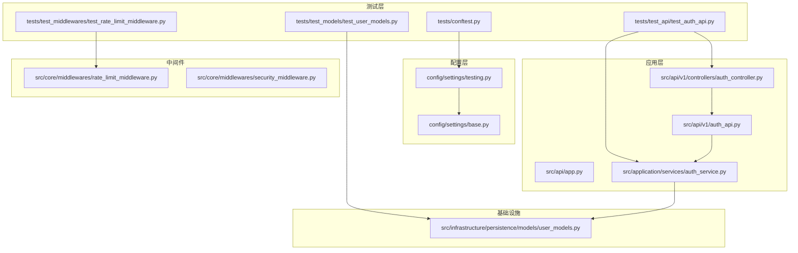
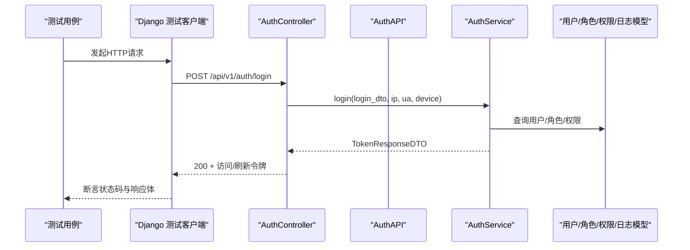
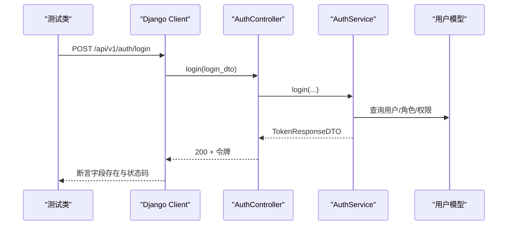
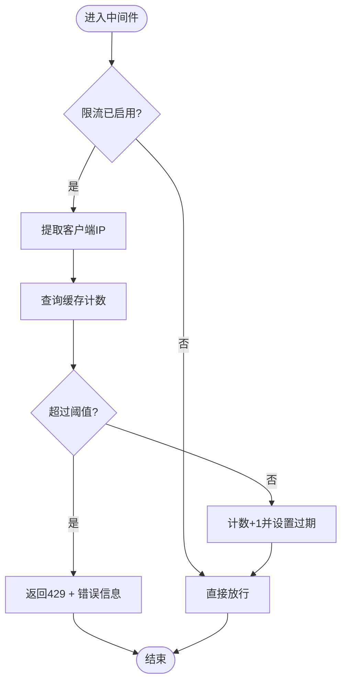
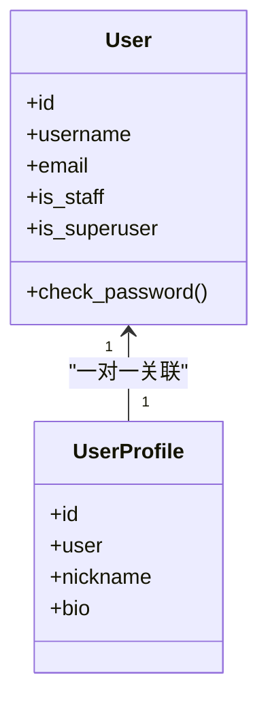
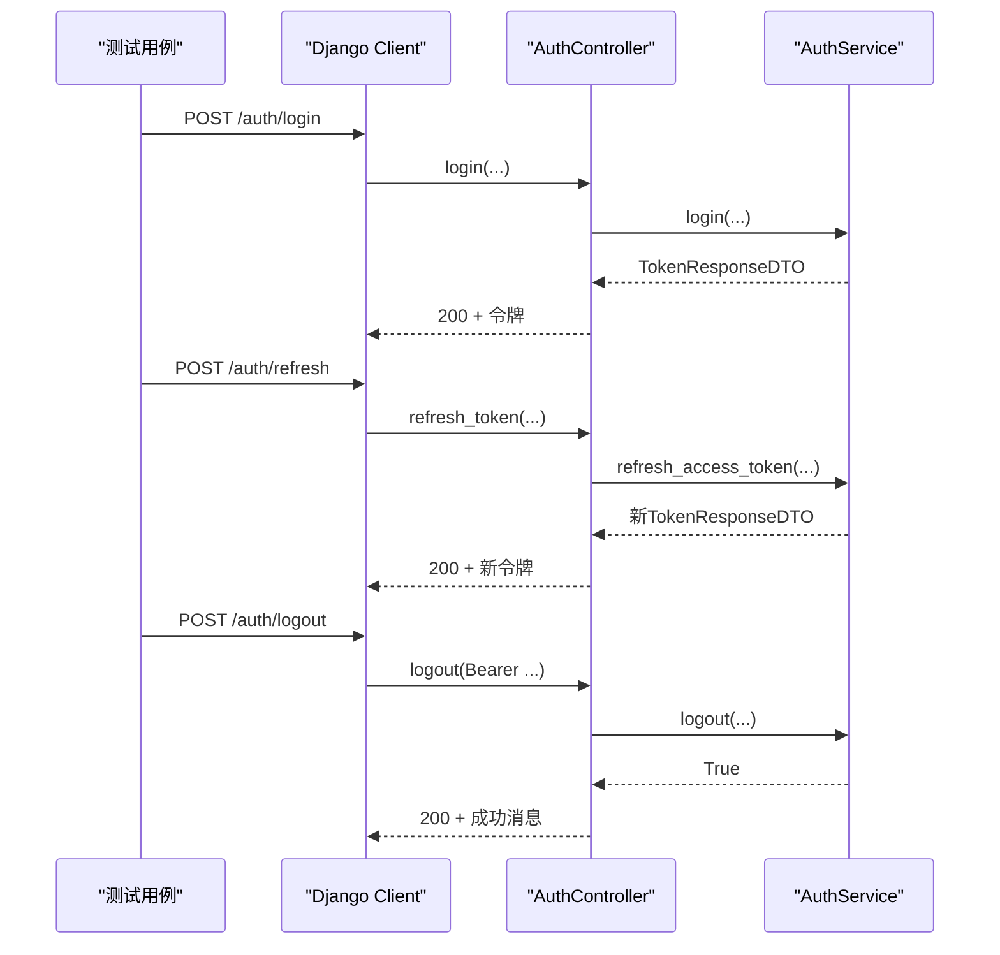
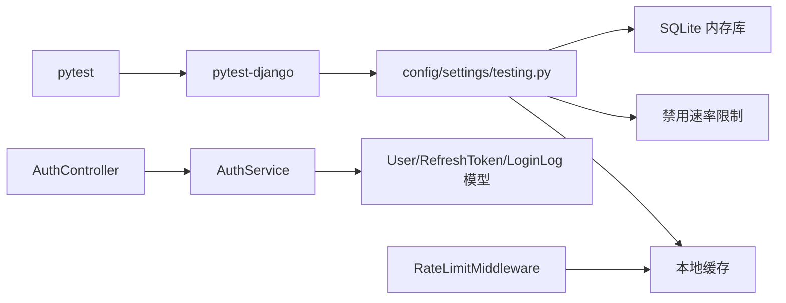

# 集成测试

<cite>
**本文引用的文件**
- [tests/conftest.py](file://tests/conftest.py)
- [tests/test_api/test_auth_api.py](file://tests/test_api/test_auth_api.py)
- [tests/test_middlewares/test_rate_limit_middleware.py](file://tests/test_middlewares/test_rate_limit_middleware.py)
- [tests/test_models/test_user_models.py](file://tests/test_models/test_user_models.py)
- [config/settings/testing.py](file://config/settings/testing.py)
- [config/settings/base.py](file://config/settings/base.py)
- [src/api/app.py](file://src/api/app.py)
- [src/api/v1/auth_api.py](file://src/api/v1/auth_api.py)
- [src/api/v1/controllers/auth_controller.py](file://src/api/v1/controllers/auth_controller.py)
- [src/application/services/auth_service.py](file://src/application/services/auth_service.py)
- [src/core/middlewares/rate_limit_middleware.py](file://src/core/middlewares/rate_limit_middleware.py)
- [src/core/middlewares/security_middleware.py](file://src/core/middlewares/security_middleware.py)
- [src/infrastructure/persistence/models/user_models.py](file://src/infrastructure/persistence/models/user_models.py)
- [scripts/test.sh](file://scripts/test.sh)
- [manage.py](file://manage.py)
- [pyproject.toml](file://pyproject.toml)
</cite>

## 目录
1. [引言](#引言)
2. [项目结构](#项目结构)
3. [核心组件](#核心组件)
4. [架构总览](#架构总览)
5. [详细组件分析](#详细组件分析)
6. [依赖分析](#依赖分析)
7. [性能考虑](#性能考虑)
8. [故障排查指南](#故障排查指南)
9. [结论](#结论)
10. [附录](#附录)

## 引言
本文件面向希望在本项目中开展“集成测试”的工程师与测试人员，系统性阐述如何编写与运行集成测试，覆盖以下方面：
- API 接口测试：从 Django 测试客户端发起请求，验证认证流程、权限链路、数据持久化等端到端场景
- 中间件测试：对速率限制、安全中间件进行行为验证
- 数据库集成测试：结合 Django ORM 与测试夹具，验证模型与业务服务的协同
- 测试环境与数据管理：基于测试配置与夹具，确保测试隔离与可重复性
- 实战示例：给出可直接参考的测试用例路径与断言要点，帮助快速落地复杂业务流程的验证

## 项目结构
本项目采用分层架构与 Django+Ninja 组合，测试主要集中在 tests 目录下，按功能域划分：
- tests/test_api：API 层集成测试（如认证）
- tests/test_middlewares：中间件行为测试
- tests/test_models：模型层测试（与数据库集成）
- tests/test_services：应用服务层测试（与数据库/缓存/外部组件集成）

图表来源
- [tests/test_api/test_auth_api.py:1-87](file://tests/test_api/test_auth_api.py#L1-L87)
- [tests/test_middlewares/test_rate_limit_middleware.py:1-76](file://tests/test_middlewares/test_rate_limit_middleware.py#L1-L76)
- [tests/test_models/test_user_models.py:1-82](file://tests/test_models/test_user_models.py#L1-L82)
- [config/settings/testing.py:1-32](file://config/settings/testing.py#L1-L32)
- [config/settings/base.py:1-235](file://config/settings/base.py#L1-L235)
- [src/api/app.py:1-48](file://src/api/app.py#L1-L48)
- [src/api/v1/controllers/auth_controller.py:1-133](file://src/api/v1/controllers/auth_controller.py#L1-L133)
- [src/api/v1/auth_api.py:1-74](file://src/api/v1/auth_api.py#L1-L74)
- [src/application/services/auth_service.py:1-233](file://src/application/services/auth_service.py#L1-L233)
- [src/core/middlewares/rate_limit_middleware.py:1-112](file://src/core/middlewares/rate_limit_middleware.py#L1-L112)
- [src/core/middlewares/security_middleware.py:1-54](file://src/core/middlewares/security_middleware.py#L1-L54)
- [src/infrastructure/persistence/models/user_models.py:1-147](file://src/infrastructure/persistence/models/user_models.py#L1-L147)

章节来源
- [tests/conftest.py:1-66](file://tests/conftest.py#L1-L66)
- [pyproject.toml:92-110](file://pyproject.toml#L92-L110)

## 核心组件
- 测试客户端与夹具
  - 使用 Django 测试客户端发起 HTTP 请求，模拟真实请求-响应流程
  - 通过 pytest 夹具提供用户、管理员、角色、权限等测试数据，确保测试隔离与可复用
- 认证与授权链路
  - 控制器 → 应用服务 → JWT 管理与校验 → RBAC 查询 → 数据持久化
  - 验证登录、刷新、登出的完整端到端流程
- 中间件链路
  - 速率限制中间件：基于 IP 的请求频率控制，返回 429 或放行
  - 安全中间件：生产环境注入安全响应头
- 数据模型与持久化
  - 用户模型、用户档案、设备模型等，验证创建、关联与约束

章节来源
- [tests/test_api/test_auth_api.py:11-87](file://tests/test_api/test_auth_api.py#L11-L87)
- [tests/test_middlewares/test_rate_limit_middleware.py:29-76](file://tests/test_middlewares/test_rate_limit_middleware.py#L29-L76)
- [tests/test_models/test_user_models.py:8-82](file://tests/test_models/test_user_models.py#L8-L82)
- [src/api/v1/controllers/auth_controller.py:16-133](file://src/api/v1/controllers/auth_controller.py#L16-L133)
- [src/application/services/auth_service.py:20-233](file://src/application/services/auth_service.py#L20-L233)
- [src/core/middlewares/rate_limit_middleware.py:15-112](file://src/core/middlewares/rate_limit_middleware.py#L15-L112)
- [src/core/middlewares/security_middleware.py:14-54](file://src/core/middlewares/security_middleware.py#L14-L54)
- [src/infrastructure/persistence/models/user_models.py:12-147](file://src/infrastructure/persistence/models/user_models.py#L12-L147)

## 架构总览
下图展示了从测试客户端到后端服务、中间件与数据层的调用链，体现一次典型集成测试的请求-响应流程。

图表来源
- [src/api/v1/controllers/auth_controller.py:36-78](file://src/api/v1/controllers/auth_controller.py#L36-L78)
- [src/api/v1/auth_api.py:22-48](file://src/api/v1/auth_api.py#L22-L48)
- [src/application/services/auth_service.py:26-112](file://src/application/services/auth_service.py#L26-L112)
- [src/infrastructure/persistence/models/user_models.py:12-147](file://src/infrastructure/persistence/models/user_models.py#L12-L147)

## 详细组件分析

### API 接口测试：认证模块
- 测试目标
  - 登录成功：返回访问/刷新令牌
  - 登录失败（错误密码）：返回服务端错误
  - 刷新令牌：使用有效刷新令牌换取新访问令牌
- 关键断言
  - HTTP 状态码：200/500
  - 响应体字段：access_token、refresh_token
- 测试夹具
  - 使用 Django 测试客户端与用户数据夹具，确保每次测试独立且可重复

图表来源
- [tests/test_api/test_auth_api.py:23-43](file://tests/test_api/test_auth_api.py#L23-L43)
- [src/api/v1/controllers/auth_controller.py:42-78](file://src/api/v1/controllers/auth_controller.py#L42-L78)
- [src/application/services/auth_service.py:26-112](file://src/application/services/auth_service.py#L26-L112)

章节来源
- [tests/test_api/test_auth_api.py:11-87](file://tests/test_api/test_auth_api.py#L11-L87)
- [src/api/v1/controllers/auth_controller.py:16-133](file://src/api/v1/controllers/auth_controller.py#L16-L133)
- [src/application/services/auth_service.py:20-233](file://src/application/services/auth_service.py#L20-L233)

### 中间件测试：速率限制中间件
- 测试目标
  - 请求在限流阈值内：正常放行
  - 请求超过限流阈值：返回 429 并包含限流提示
  - 白名单 IP：绕过限流检查
- 关键断言
  - 响应状态码：200/429
  - 响应内容包含限流提示关键字
- 测试夹具
  - 使用 RequestFactory 构造请求，Mock 缓存以控制计数

图表来源
- [tests/test_middlewares/test_rate_limit_middleware.py:33-58](file://tests/test_middlewares/test_rate_limit_middleware.py#L33-L58)
- [src/core/middlewares/rate_limit_middleware.py:41-112](file://src/core/middlewares/rate_limit_middleware.py#L41-L112)

章节来源
- [tests/test_middlewares/test_rate_limit_middleware.py:29-76](file://tests/test_middlewares/test_rate_limit_middleware.py#L29-L76)
- [src/core/middlewares/rate_limit_middleware.py:15-112](file://src/core/middlewares/rate_limit_middleware.py#L15-L112)

### 数据库集成测试：用户模型与档案
- 测试目标
  - 创建普通用户与超级用户，验证字段与权限位
  - 用户档案创建与自动关联
  - 字符串表示与外键约束
- 关键断言
  - 字段一致性、权限位、关联存在性
- 测试夹具
  - 使用 Django ORM 与测试数据库，确保事务隔离

图表来源
- [tests/test_models/test_user_models.py:17-82](file://tests/test_models/test_user_models.py#L17-L82)
- [src/infrastructure/persistence/models/user_models.py:12-147](file://src/infrastructure/persistence/models/user_models.py#L12-L147)

章节来源
- [tests/test_models/test_user_models.py:8-82](file://tests/test_models/test_user_models.py#L8-L82)
- [src/infrastructure/persistence/models/user_models.py:12-147](file://src/infrastructure/persistence/models/user_models.py#L12-L147)

### 完整端到端场景示例：登录-刷新-登出
- 场景描述
  - 创建用户并激活
  - 登录获取访问/刷新令牌
  - 使用刷新令牌换取新访问令牌
  - 登出撤销令牌并清理缓存
- 关键断言
  - 登录/刷新 200 且包含令牌字段
  - 登出后缓存清理与令牌撤销

图表来源
- [tests/test_api/test_auth_api.py:23-87](file://tests/test_api/test_auth_api.py#L23-L87)
- [src/api/v1/controllers/auth_controller.py:42-133](file://src/api/v1/controllers/auth_controller.py#L42-L133)
- [src/application/services/auth_service.py:113-181](file://src/application/services/auth_service.py#L113-L181)

章节来源
- [tests/test_api/test_auth_api.py:11-87](file://tests/test_api/test_auth_api.py#L11-L87)
- [src/api/v1/controllers/auth_controller.py:16-133](file://src/api/v1/controllers/auth_controller.py#L16-L133)
- [src/application/services/auth_service.py:113-181](file://src/application/services/auth_service.py#L113-L181)

## 依赖分析
- 测试框架与配置
  - pytest + pytest-django：自动加载测试配置，执行迁移，支持数据库隔离
  - 测试设置：SQLite 内存库、禁用缓存、禁用速率限制，加速测试执行
- 应用与中间件
  - 中间件注册顺序影响请求处理链，需关注限流与安全中间件的组合行为
- 服务与模型
  - 认证服务依赖 JWT 管理器、令牌校验器、缓存与模型层，测试时需关注异步操作与并发场景

图表来源
- [pyproject.toml:92-110](file://pyproject.toml#L92-L110)
- [config/settings/testing.py:10-32](file://config/settings/testing.py#L10-L32)
- [config/settings/base.py:39-52](file://config/settings/base.py#L39-L52)
- [src/api/v1/controllers/auth_controller.py:16-35](file://src/api/v1/controllers/auth_controller.py#L16-L35)
- [src/application/services/auth_service.py:10-18](file://src/application/services/auth_service.py#L10-L18)
- [src/core/middlewares/rate_limit_middleware.py:30-40](file://src/core/middlewares/rate_limit_middleware.py#L30-L40)

章节来源
- [pyproject.toml:92-110](file://pyproject.toml#L92-L110)
- [config/settings/base.py:39-52](file://config/settings/base.py#L39-L52)
- [config/settings/testing.py:10-32](file://config/settings/testing.py#L10-L32)

## 性能考虑
- 测试数据库与缓存
  - 测试环境使用内存数据库与本地缓存，避免磁盘 IO 与网络延迟
- 速率限制与并发
  - 测试中禁用速率限制，避免干扰；若需验证限流，建议使用缓存 Mock 与可控计数
- 异步服务
  - 认证服务为异步实现，测试时注意事件循环与并发安全

## 故障排查指南
- 测试无法启动或找不到设置
  - 确认 pytest 配置中的测试设置模块指向正确
  - 参考：[pyproject.toml:92-110](file://pyproject.toml#L92-L110)
- 数据库迁移问题
  - 使用会话级夹具确保迁移在测试前完成
  - 参考：[tests/conftest.py:10-16](file://tests/conftest.py#L10-L16)
- 中间件行为异常
  - 检查中间件注册顺序与配置开关
  - 参考：[config/settings/base.py:39-52](file://config/settings/base.py#L39-L52)
- 速率限制误判
  - 确认测试中禁用速率限制或正确 Mock 缓存计数
  - 参考：[config/settings/testing.py:30-32](file://config/settings/testing.py#L30-L32)
- 登录失败或令牌无效
  - 核对用户状态、密码哈希、JWT 配置与服务层逻辑
  - 参考：[src/application/services/auth_service.py:26-112](file://src/application/services/auth_service.py#L26-L112)

章节来源
- [tests/conftest.py:10-16](file://tests/conftest.py#L10-L16)
- [config/settings/testing.py:30-32](file://config/settings/testing.py#L30-L32)
- [config/settings/base.py:39-52](file://config/settings/base.py#L39-L52)
- [src/application/services/auth_service.py:26-112](file://src/application/services/auth_service.py#L26-L112)

## 结论
本项目的集成测试围绕“测试客户端 + 控制器 + 应用服务 + 中间件 + 数据模型”构建，既覆盖了端到端的请求-响应流程，也针对中间件与模型进行了专项验证。通过合理的测试夹具与测试配置，能够在保证速度的同时，稳定地验证认证、权限、限流与数据持久化等关键能力。

## 附录
- 运行测试
  - 使用提供的脚本一键运行测试并生成覆盖率报告
  - 参考：[scripts/test.sh:10-11](file://scripts/test.sh#L10-L11)
- 设置模块
  - 开发/测试/生产设置分别位于 config/settings 下，测试设置已优化为内存数据库与禁用限流
  - 参考：[config/settings/base.py:1-235](file://config/settings/base.py#L1-235)，[config/settings/testing.py:1-32](file://config/settings/testing.py#L1-32)
- Django 启动
  - manage.py 默认加载开发设置，便于本地调试
  - 参考：[manage.py:9](file://manage.py#L9)