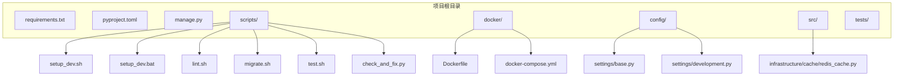
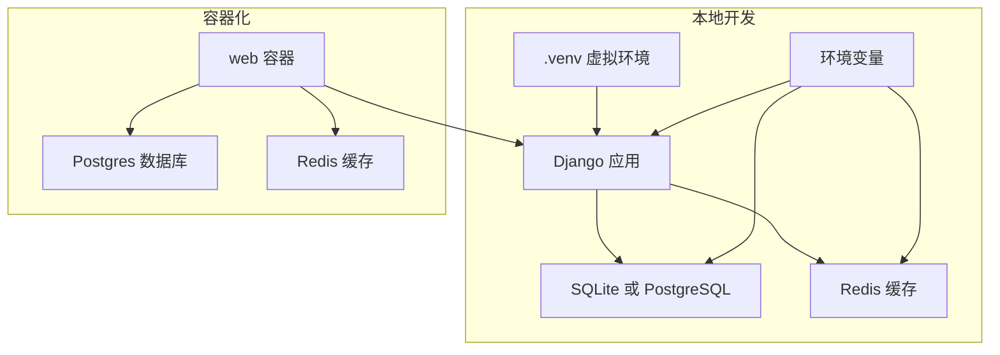
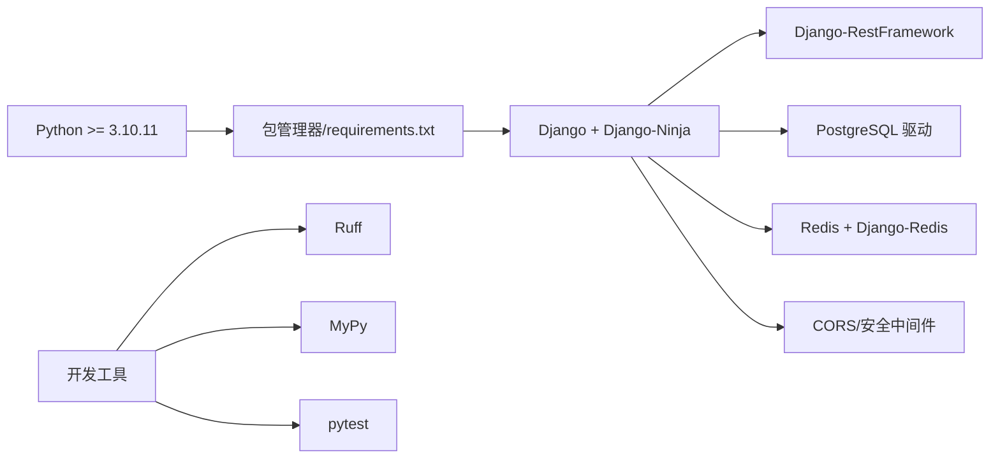

# 环境配置

<cite>
**本文引用的文件**
- [requirements.txt](file://requirements.txt)
- [pyproject.toml](file://pyproject.toml)
- [scripts/setup_dev.sh](file://scripts/setup_dev.sh)
- [scripts/setup_dev.bat](file://scripts/setup_dev.bat)
- [docker/Dockerfile](file://docker/Dockerfile)
- [docker/docker-compose.yml](file://docker/docker-compose.yml)
- [config/settings/base.py](file://config/settings/base.py)
- [config/settings/development.py](file://config/settings/development.py)
- [.mypy.ini](file://.mypy.ini)
- [ruff.toml](file://ruff.toml)
- [scripts/lint.sh](file://scripts/lint.sh)
- [scripts/migrate.sh](file://scripts/migrate.sh)
- [scripts/test.sh](file://scripts/test.sh)
- [scripts/check_and_fix.py](file://scripts/check_and_fix.py)
- [manage.py](file://manage.py)
</cite>

## 目录
1. [简介](#简介)
2. [项目结构](#项目结构)
3. [核心组件](#核心组件)
4. [架构总览](#架构总览)
5. [详细组件分析](#详细组件分析)
6. [依赖关系分析](#依赖关系分析)
7. [性能考虑](#性能考虑)
8. [故障排查指南](#故障排查指南)
9. [结论](#结论)
10. [附录](#附录)

## 简介
本文件面向开发者，提供从零搭建与维护该 Django + Django-Ninja API 项目的开发环境指南。内容涵盖：
- Python 版本要求与虚拟环境创建
- 依赖安装方式（requirements.txt 与现代包管理器方式）
- 环境变量配置与示例文件使用
- 跨平台（Windows/Linux/macOS）脚本与批处理使用
- 可选的 Docker 环境与 Redis 缓存服务配置
- 常见环境问题排查（端口冲突、权限、路径等）

## 项目结构
该仓库采用“分层+特性”混合组织方式：核心业务位于 src，配置集中在 config，脚本与容器化位于 scripts 与 docker，测试位于 tests，依赖清单位于 requirements.txt 与 pyproject.toml。

图表来源
- [requirements.txt:1-38](file://requirements.txt#L1-L38)
- [pyproject.toml:1-131](file://pyproject.toml#L1-L131)
- [scripts/setup_dev.sh:1-47](file://scripts/setup_dev.sh#L1-L47)
- [scripts/setup_dev.bat:1-48](file://scripts/setup_dev.bat#L1-L48)
- [docker/Dockerfile:1-33](file://docker/Dockerfile#L1-L33)
- [docker/docker-compose.yml:1-47](file://docker/docker-compose.yml#L1-L47)
- [config/settings/base.py:1-235](file://config/settings/base.py#L1-L235)
- [config/settings/development.py:1-24](file://config/settings/development.py#L1-L24)

章节来源
- [requirements.txt:1-38](file://requirements.txt#L1-L38)
- [pyproject.toml:1-131](file://pyproject.toml#L1-L131)
- [scripts/setup_dev.sh:1-47](file://scripts/setup_dev.sh#L1-L47)
- [scripts/setup_dev.bat:1-48](file://scripts/setup_dev.bat#L1-L48)
- [docker/Dockerfile:1-33](file://docker/Dockerfile#L1-L33)
- [docker/docker-compose.yml:1-47](file://docker/docker-compose.yml#L1-L47)
- [config/settings/base.py:1-235](file://config/settings/base.py#L1-L235)
- [config/settings/development.py:1-24](file://config/settings/development.py#L1-L24)

## 核心组件
- Python 版本与包管理
  - Python 最低版本要求：>= 3.10.11
  - 推荐使用现代包管理器进行依赖安装与虚拟环境管理
- 依赖清单
  - requirements.txt：集中列出项目依赖
  - pyproject.toml：声明项目元数据、依赖与开发工具链（Ruff、MyPy、pytest 等）
- 环境变量与配置
  - 基础配置读取环境变量（数据库、Redis、JWT、限流、CORS 等）
  - 开发环境默认 SQLite 与宽松 CORS
- 脚本与自动化
  - 跨平台初始化脚本（Shell/Batch）
  - Lint、类型检查、迁移、测试等辅助脚本
- 容器化与缓存
  - Dockerfile 与 docker-compose.yml 提供可选的容器化运行方案
  - Redis 缓存配置可通过环境变量启用

章节来源
- [pyproject.toml:6](file://pyproject.toml#L6)
- [requirements.txt:1-38](file://requirements.txt#L1-L38)
- [config/settings/base.py:16-235](file://config/settings/base.py#L16-L235)
- [config/settings/development.py:1-24](file://config/settings/development.py#L1-L24)
- [scripts/setup_dev.sh:1-47](file://scripts/setup_dev.sh#L1-L47)
- [scripts/setup_dev.bat:1-48](file://scripts/setup_dev.bat#L1-L48)
- [docker/Dockerfile:1-33](file://docker/Dockerfile#L1-L33)
- [docker/docker-compose.yml:1-47](file://docker/docker-compose.yml#L1-L47)

## 架构总览
下图展示本地与容器两种运行模式的关键组件与交互：

图表来源
- [config/settings/base.py:77-163](file://config/settings/base.py#L77-L163)
- [docker/docker-compose.yml:1-47](file://docker/docker-compose.yml#L1-L47)
- [docker/Dockerfile:1-33](file://docker/Dockerfile#L1-L33)

## 详细组件分析

### Python 环境与虚拟环境
- 版本要求
  - 项目要求 Python >= 3.10.11
- 虚拟环境创建与激活
  - 推荐使用现代包管理器创建并激活虚拟环境
  - 初始化脚本会自动检测并安装包管理器，随后创建指定版本的虚拟环境
- 依赖安装
  - 支持 requirements.txt 与现代包管理器方式
  - 开发依赖通过可选组统一管理

章节来源
- [pyproject.toml:6](file://pyproject.toml#L6)
- [scripts/setup_dev.sh:7-16](file://scripts/setup_dev.sh#L7-L16)
- [scripts/setup_dev.bat:6-15](file://scripts/setup_dev.bat#L6-L15)

### 跨平台初始化脚本
- Linux/macOS
  - 自动安装包管理器、创建虚拟环境、安装依赖、格式化与检查、创建管理员、运行测试
- Windows
  - 对应批处理脚本提供相同流程，包含 PowerShell 安装包管理器与暂停提示

章节来源
- [scripts/setup_dev.sh:1-47](file://scripts/setup_dev.sh#L1-L47)
- [scripts/setup_dev.bat:1-48](file://scripts/setup_dev.bat#L1-L48)

### 依赖安装方法
- requirements.txt
  - 适用于传统 pip 安装场景
- 现代包管理器方式
  - 通过可选组安装开发工具链（Ruff、MyPy、pytest 等）
  - 更快、更一致的依赖解析体验

章节来源
- [requirements.txt:1-38](file://requirements.txt#L1-L38)
- [pyproject.toml:26-36](file://pyproject.toml#L26-L36)

### 环境变量与配置
- 基础配置项（来自基础设置）
  - 安全相关：密钥、调试开关、允许主机
  - 数据库：引擎、名称、用户、密码、主机、端口
  - 缓存：Redis 主机、端口、数据库索引
  - JWT：访问/刷新令牌生命周期
  - CORS、日志、限流、IP 黑白名单等
- 开发环境默认行为
  - 使用 SQLite
  - 开启调试与宽松 CORS
- 环境变量优先级
  - 通过环境变量覆盖默认值，便于不同环境差异化配置

章节来源
- [config/settings/base.py:16-235](file://config/settings/base.py#L16-L235)
- [config/settings/development.py:1-24](file://config/settings/development.py#L1-L24)

### Docker 环境与 Redis 缓存
- Dockerfile
  - 基于 Python 3.10 slim 镜像，安装系统依赖与 Python 依赖，暴露 8000 端口
- docker-compose.yml
  - 启动 web、db（Postgres）、redis 服务，并映射端口与持久化卷
  - 通过环境变量传递数据库与 Redis 连接参数
- Redis 缓存
  - 通过环境变量启用 Redis 缓存后，Django 将使用 Redis 作为默认缓存后端

章节来源
- [docker/Dockerfile:1-33](file://docker/Dockerfile#L1-L33)
- [docker/docker-compose.yml:1-47](file://docker/docker-compose.yml#L1-L47)
- [config/settings/base.py:153-163](file://config/settings/base.py#L153-L163)

### 代码质量与测试脚本
- Lint 脚本
  - Ruff 格式化检查、代码检查、MyPy 类型检查
- 测试脚本
  - 运行 pytest 并生成覆盖率报告
- 一键修复脚本
  - 自动执行 Ruff 格式化与检查、MyPy 类型检查，并输出结果

章节来源
- [scripts/lint.sh:1-23](file://scripts/lint.sh#L1-L23)
- [scripts/test.sh:1-14](file://scripts/test.sh#L1-L14)
- [scripts/check_and_fix.py:1-67](file://scripts/check_and_fix.py#L1-L67)

### 项目入口与默认设置模块
- manage.py
  - 默认设置模块指向开发配置
- WSGI
  - 默认设置模块同样指向开发配置

章节来源
- [manage.py:9](file://manage.py#L9)
- [config/wsgi.py:9](file://config/wsgi.py#L9)

## 依赖关系分析
- 语言与工具链
  - Python >= 3.10.11
  - 包管理器（现代方式）与 pip（requirements.txt）
  - 代码质量：Ruff（格式化与检查）、MyPy（类型检查）
  - 测试：pytest
- 运行时依赖
  - Web 框架：Django、Django-Ninja、Django-RestFramework
  - 数据库：PostgreSQL（二进制驱动）
  - 缓存：Redis 与 Django-Redis
  - 安全：CORS、Defender、RateLimit、IP 管理
  - 工具：Pillow、python-decouple、python-dotenv

图表来源
- [pyproject.toml:11-24](file://pyproject.toml#L11-L24)
- [requirements.txt:1-38](file://requirements.txt#L1-L38)
- [ruff.toml:1-54](file://ruff.toml#L1-L54)
- [.mypy.ini:1-45](file://.mypy.ini#L1-L45)

章节来源
- [pyproject.toml:11-24](file://pyproject.toml#L11-L24)
- [requirements.txt:1-38](file://requirements.txt#L1-L38)
- [ruff.toml:1-54](file://ruff.toml#L1-L54)
- [.mypy.ini:1-45](file://.mypy.ini#L1-L45)

## 性能考虑
- 使用现代包管理器安装依赖，提升解析与安装速度
- 在开发阶段启用 SQLite，减少外部依赖开销；生产使用 PostgreSQL
- Redis 缓存可显著降低数据库压力，需合理设置过期策略与连接池
- 代码质量工具（Ruff、MyPy）在 CI/本地预检，避免低效的运行时错误

## 故障排查指南
- 端口冲突
  - 本地默认端口为 8000；若冲突，请修改运行命令或容器映射
  - 容器模式下检查 docker-compose 映射与宿主机占用
- 权限问题
  - Linux/macOS：确保脚本具备可执行权限；必要时使用 chmod
  - Windows：以管理员身份运行终端，确保包管理器安装成功
- 路径配置
  - 脚本中涉及相对路径与虚拟环境路径，确保在项目根目录执行
  - Docker 模式下注意卷挂载与数据持久化目录权限
- 环境变量未生效
  - 确认已在当前 Shell/终端中正确导出环境变量
  - Docker 模式下检查 docker-compose 环境变量是否正确传递
- 数据库连接失败
  - 本地使用 SQLite 无需额外配置；使用 PostgreSQL 时核对主机、端口、凭据
- Redis 连接失败
  - 确认 Redis 服务可用且端口开放；检查环境变量中的主机与端口

章节来源
- [docker/docker-compose.yml:8-19](file://docker/docker-compose.yml#L8-L19)
- [config/settings/base.py:77-88](file://config/settings/base.py#L77-L88)
- [config/settings/base.py:153-163](file://config/settings/base.py#L153-L163)

## 结论
本指南提供了从 Python 版本、虚拟环境、依赖安装到环境变量、Docker 与 Redis 缓存的完整配置路径，并配套跨平台脚本与常见问题排查建议。建议优先使用现代包管理器与容器化方案，结合代码质量工具，确保开发效率与一致性。

## 附录
- 快速开始（推荐）
  - 安装包管理器 → 创建并激活虚拟环境 → 安装开发依赖 → 运行初始化脚本 → 启动服务
- 常用命令参考
  - 本地运行：python manage.py runserver
  - 容器运行：docker-compose up
  - 代码检查：ruff check . --fix；mypy src/
  - 运行测试：pytest -v --tb=short --cov=src