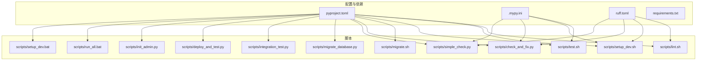
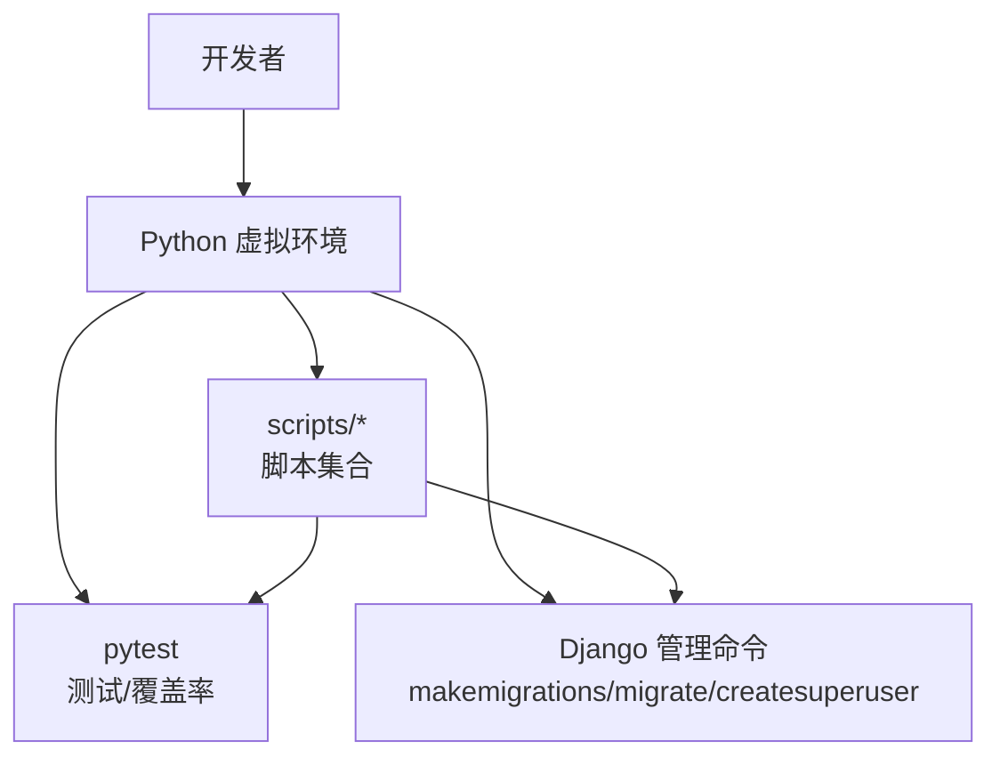
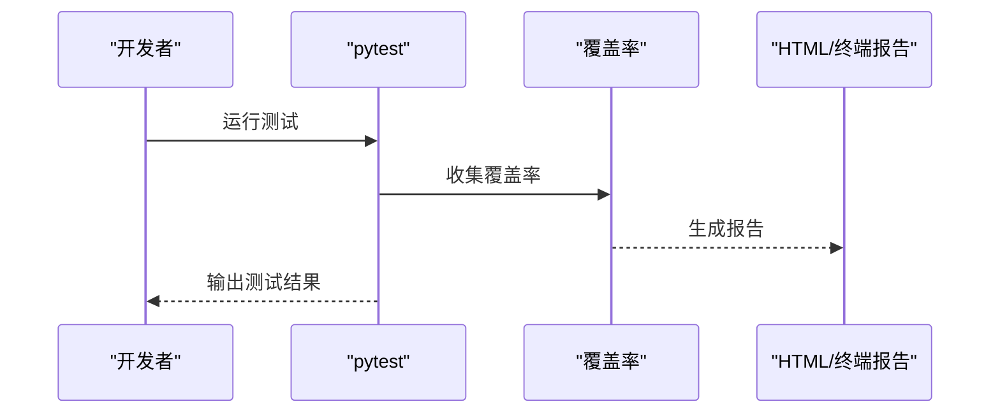
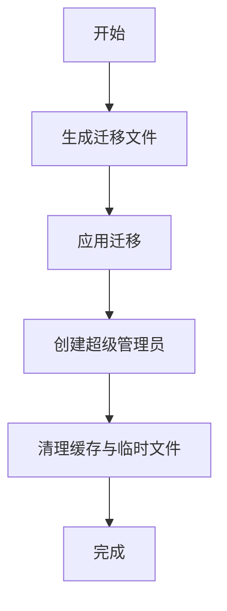
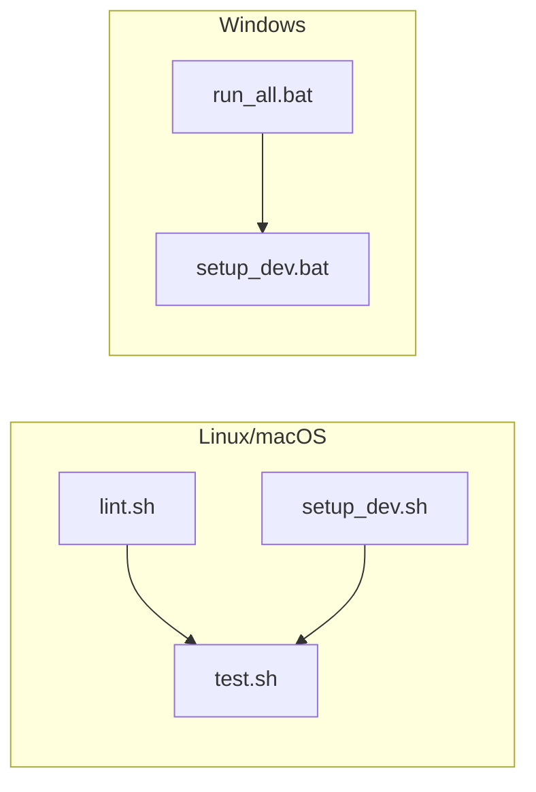
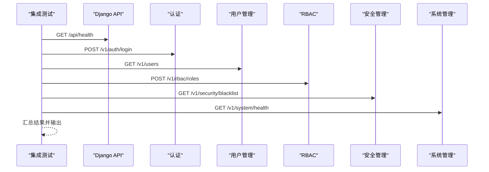
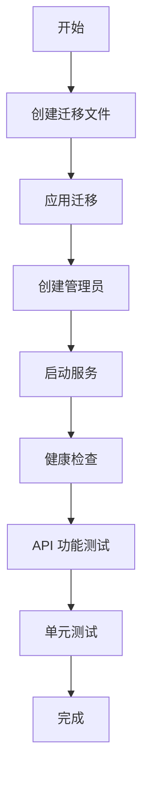
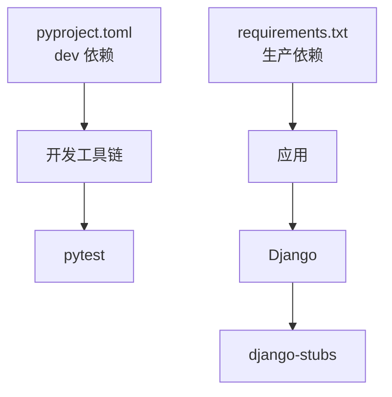

# 开发工具和脚本

<cite>
**本文引用的文件**
- [pyproject.toml](file://pyproject.toml)
- [.mypy.ini](file://.mypy.ini)
- [ruff.toml](file://ruff.toml)
- [requirements.txt](file://requirements.txt)
- [scripts/lint.sh](file://scripts/lint.sh)
- [scripts/test.sh](file://scripts/test.sh)
- [scripts/setup_dev.sh](file://scripts/setup_dev.sh)
- [scripts/migrate.sh](file://scripts/migrate.sh)
- [scripts/check_and_fix.py](file://scripts/check_and_fix.py)
- [scripts/simple_check.py](file://scripts/simple_check.py)
- [scripts/migrate_database.py](file://scripts/migrate_database.py)
- [scripts/integration_test.py](file://scripts/integration_test.py)
- [scripts/deploy_and_test.py](file://scripts/deploy_and_test.py)
- [scripts/init_admin.py](file://scripts/init_admin.py)
- [scripts/run_all.bat](file://scripts/run_all.bat)
- [scripts/setup_dev.bat](file://scripts/setup_dev.bat)
</cite>

## 更新摘要
**所做更改**
- 删除了类型检查工具（MyPy）相关的所有内容和配置
- 删除了代码格式化工具（Ruff）相关的所有内容和配置
- 更新了核心组件部分，移除了 Ruff 和 MyPy 的配置说明
- 更新了详细组件分析，删除了 Ruff 和 MyPy 的具体使用说明
- 更新了依赖分析，移除了 Ruff 和 MyPy 的依赖管理说明
- 更新了故障排查指南，删除了 Ruff 和 MyPy 的故障排除内容
- 更新了结论部分，移除了 Ruff 和 MyPy 的总结内容

## 目录
1. [简介](#简介)
2. [项目结构](#项目结构)
3. [核心组件](#核心组件)
4. [架构总览](#架构总览)
5. [详细组件分析](#详细组件分析)
6. [依赖分析](#依赖分析)
7. [性能考虑](#性能考虑)
8. [故障排查指南](#故障排查指南)
9. [结论](#结论)
10. [附录](#附录)

## 简介
本指南面向 Hello-Django-Ninja-Api 项目的开发者，系统介绍项目中的开发工具链与自动化脚本，包括：
- 测试与覆盖率：pytest（含覆盖率统计）
- 数据库迁移与初始化：Django 命令与自定义迁移脚本
- 自动化脚本：Linux/macOS 与 Windows 双平台脚本
- IDE 配置建议与开发工作流优化
- 代码质量保障流程与静态分析工具集成
- 构建系统与依赖管理策略
- 提高开发效率的实用工具推荐

## 项目结构
项目采用分层架构与功能模块划分，开发工具与脚本集中在 scripts 目录，配置文件位于仓库根目录。关键配置文件如下：
- pyproject.toml：项目元数据、依赖、构建系统、pytest、覆盖率等配置
- .mypy.ini：MyPy 的独立配置文件（兼容多处配置）
- ruff.toml：Ruff 的统一配置文件（格式化、lint、导入排序）
- requirements.txt：生产依赖清单
- scripts/*：各类开发脚本（Linux/macOS 与 Windows）

**图表来源**
- [pyproject.toml](file://pyproject.toml)
- [ruff.toml](file://ruff.toml)
- [.mypy.ini](file://.mypy.ini)
- [scripts/lint.sh](file://scripts/lint.sh)
- [scripts/test.sh](file://scripts/test.sh)
- [scripts/setup_dev.sh](file://scripts/setup_dev.sh)
- [scripts/migrate.sh](file://scripts/migrate.sh)
- [scripts/check_and_fix.py](file://scripts/check_and_fix.py)
- [scripts/simple_check.py](file://scripts/simple_check.py)
- [scripts/migrate_database.py](file://scripts/migrate_database.py)
- [scripts/integration_test.py](file://scripts/integration_test.py)
- [scripts/deploy_and_test.py](file://scripts/deploy_and_test.py)
- [scripts/init_admin.py](file://scripts/init_admin.py)
- [scripts/run_all.bat](file://scripts/run_all.bat)
- [scripts/setup_dev.bat](file://scripts/setup_dev.bat)

**章节来源**
- [pyproject.toml](file://pyproject.toml)
- [ruff.toml](file://ruff.toml)
- [.mypy.ini](file://.mypy.ini)
- [requirements.txt](file://requirements.txt)

## 核心组件
- 测试与覆盖率（pytest）
  - 配置：pyproject.toml 中的 [tool.pytest.ini_options]
  - 覆盖率：覆盖 src，排除 migrations/tests/config/manage.py
- 数据库迁移与初始化
  - Django 命令：makemigrations、migrate、createsuperuser
  - 自定义脚本：迁移数据库文件位置、创建超级管理员、清理缓存

**章节来源**
- [pyproject.toml](file://pyproject.toml)
- [.mypy.ini](file://.mypy.ini)
- [ruff.toml](file://ruff.toml)

## 架构总览
下图展示开发工具链与脚本之间的关系，以及它们如何协同完成代码质量保障与自动化任务。

**图表来源**
- [pyproject.toml](file://pyproject.toml)
- [scripts/lint.sh](file://scripts/lint.sh)
- [scripts/test.sh](file://scripts/test.sh)
- [scripts/setup_dev.sh](file://scripts/setup_dev.sh)
- [scripts/migrate.sh](file://scripts/migrate.sh)

## 详细组件分析

### 测试与覆盖率（pytest）
- 配置要点
  - DJANGO_SETTINGS_MODULE：指向 testing 配置
  - 测试文件模式：test_*.py、*_test.py
  - 断言与标记：严格标记与配置、短回溯
  - 覆盖率：覆盖 src，排除 migrations/tests/config/manage.py
- 在脚本中的应用
  - test.sh：运行 pytest 并生成 HTML 与终端覆盖率报告
  - setup_dev.sh：安装 dev 依赖后运行 pytest
  - integration_test.py：对各 API 进行端到端验证，生成结果文件
- 最佳实践
  - 为不同测试类型添加标记（unit/integration/slow）
  - 结合覆盖率报告定位未覆盖区域

**图表来源**
- [pyproject.toml](file://pyproject.toml)
- [scripts/test.sh](file://scripts/test.sh)
- [scripts/integration_test.py](file://scripts/integration_test.py)

**章节来源**
- [pyproject.toml](file://pyproject.toml)
- [scripts/test.sh](file://scripts/test.sh)
- [scripts/integration_test.py](file://scripts/integration_test.py)

### 数据库迁移与初始化
- Django 命令
  - makemigrations：生成迁移文件
  - migrate：应用迁移
  - createsuperuser：创建超级管理员（支持非交互）
- 自定义脚本
  - migrate.sh：封装迁移与管理员创建
  - migrate_database.py：迁移数据库文件位置、创建迁移、应用迁移、创建管理员、清理缓存
  - init_admin.py：通过 Django shell 创建初始管理员，避免导入链问题
- 最佳实践
  - 在 CI 中使用 --run-syncdb 确保同步数据库
  - 使用环境变量控制管理员用户名/邮箱/密码

**图表来源**
- [scripts/migrate.sh](file://scripts/migrate.sh)
- [scripts/migrate_database.py](file://scripts/migrate_database.py)
- [scripts/init_admin.py](file://scripts/init_admin.py)

**章节来源**
- [scripts/migrate.sh](file://scripts/migrate.sh)
- [scripts/migrate_database.py](file://scripts/migrate_database.py)
- [scripts/init_admin.py](file://scripts/init_admin.py)

### 自动化脚本总览
- Linux/macOS
  - lint.sh：格式化检查 → 代码检查 → 类型检查
  - test.sh：运行 pytest，生成覆盖率报告
  - setup_dev.sh：安装 uv、创建虚拟环境、安装 dev 依赖、格式化/检查/类型检查、创建管理员、运行测试
- Windows
  - run_all.bat：顺序执行迁移、创建管理员、启动服务、API 测试
  - setup_dev.bat：安装 uv、创建虚拟环境、安装 dev 依赖、格式化/检查/类型检查、创建管理员、运行测试

**图表来源**
- [scripts/lint.sh](file://scripts/lint.sh)
- [scripts/test.sh](file://scripts/test.sh)
- [scripts/setup_dev.sh](file://scripts/setup_dev.sh)
- [scripts/run_all.bat](file://scripts/run_all.bat)
- [scripts/setup_dev.bat](file://scripts/setup_dev.bat)

**章节来源**
- [scripts/lint.sh](file://scripts/lint.sh)
- [scripts/test.sh](file://scripts/test.sh)
- [scripts/setup_dev.sh](file://scripts/setup_dev.sh)
- [scripts/run_all.bat](file://scripts/run_all.bat)
- [scripts/setup_dev.bat](file://scripts/setup_dev.bat)

### 集成测试脚本
- 功能概述
  - 使用 requests 对每个接口进行真实测试
  - 包含健康检查、认证流程、用户管理、RBAC、安全管理、系统管理等
  - 记录测试结果并生成汇总文件
- 使用方式
  - 直接运行脚本，确保服务已启动
  - 可结合 pytest 与覆盖率进行综合质量评估

**图表来源**
- [scripts/integration_test.py](file://scripts/integration_test.py)

**章节来源**
- [scripts/integration_test.py](file://scripts/integration_test.py)

### 部署与测试流水线
- deploy_and_test.py
  - 顺序执行：创建迁移 → 应用迁移 → 创建管理员 → 启动服务 → API 功能测试 → 单元测试
  - 启动服务后进行健康检查
  - 输出服务信息与提示

**图表来源**
- [scripts/deploy_and_test.py](file://scripts/deploy_and_test.py)

**章节来源**
- [scripts/deploy_and_test.py](file://scripts/deploy_and_test.py)

## 依赖分析
- 依赖管理策略
  - 生产依赖：requirements.txt（集中列出）
  - 开发依赖：pyproject.toml 中的 optional-dependencies.dev（pytest、ruff、mypy、django-stubs、faker 等）
  - 构建系统：hatchling
- 工具链耦合
  - Ruff 与 MyPy 配置相互独立但共同作用于 src/ 与 tests/
  - pytest 与覆盖率配置集中在 pyproject.toml
  - Django 与 django-stubs 插件配合 MyPy 实现类型感知

**图表来源**
- [requirements.txt](file://requirements.txt)
- [pyproject.toml](file://pyproject.toml)

**章节来源**
- [requirements.txt](file://requirements.txt)
- [pyproject.toml](file://pyproject.toml)

## 性能考虑
- 测试性能
  - 使用 pytest 标记区分测试类型，按需运行
  - 覆盖率仅覆盖 src，缩短报告生成时间
- 迁移性能
  - 在本地开发中使用 SQLite；在 CI 中使用 PostgreSQL 以更接近生产环境

## 故障排查指南
- 测试相关
  - pytest 失败：查看短回溯输出，结合覆盖率定位问题
  - 覆盖率不准确：检查 omit 列表与 source 配置
- 迁移相关
  - 数据库迁移失败：查看 Django 报错信息，必要时回滚并重试
  - 管理员创建失败：检查环境变量与用户是否存在

**章节来源**
- [pyproject.toml](file://pyproject.toml)

## 结论
本指南系统梳理了 Hello-Django-Ninja-Api 项目的开发工具链与脚本，涵盖 pytest、Django 迁移与初始化等关键环节。通过统一的配置文件与自动化脚本，开发者可以高效地完成测试与部署流程。建议在团队内推广使用这些脚本与配置，持续改进代码质量与开发效率。

## 附录
- IDE 配置建议
  - VSCode：安装 Python、Ruff、MyPy、Django 插件；配置 Python 解释器为虚拟环境
  - PyCharm：启用 Ruff 与 MyPy 集成，配置 Django 项目结构与 settings_module
- 开发工作流优化
  - 提交前：ruff format --check + ruff check + mypy src/ + pytest
  - CI：仅运行检查与测试，不执行 --fix
  - 定期更新依赖：使用 uv pip install -e ".[dev]" 更新开发依赖
- 实用工具推荐
  - uv：快速安装与虚拟环境管理
  - httpie/curl：API 接口调试
  - pytest-watch：测试热重载