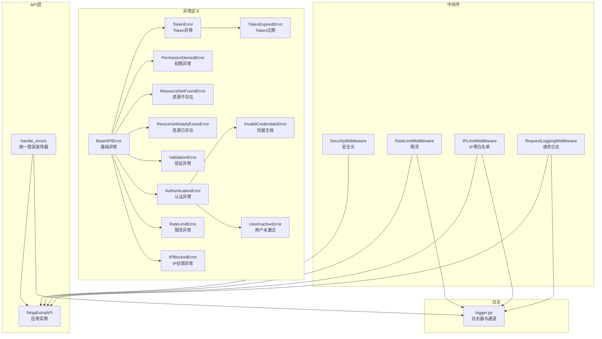
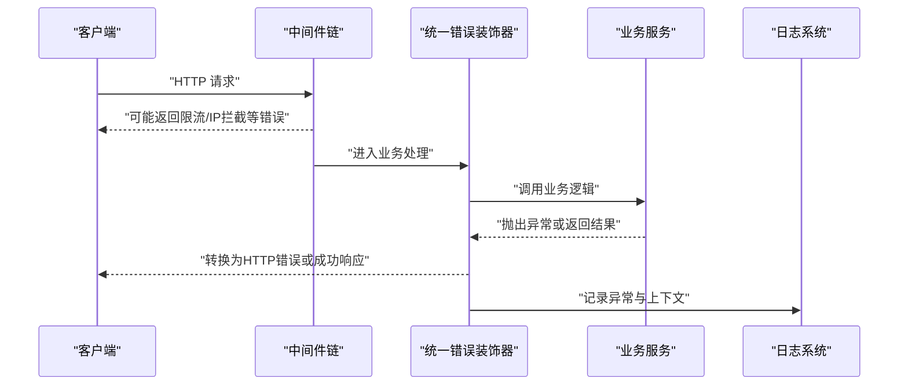
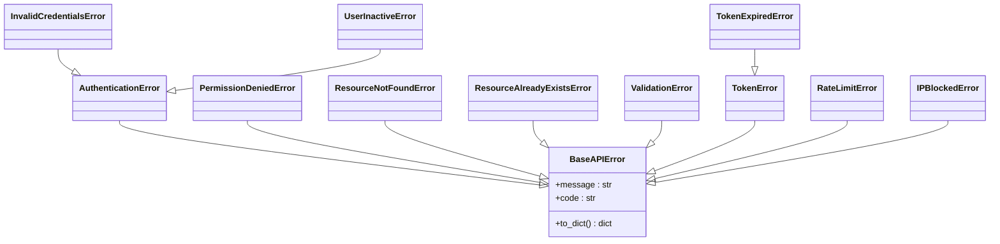
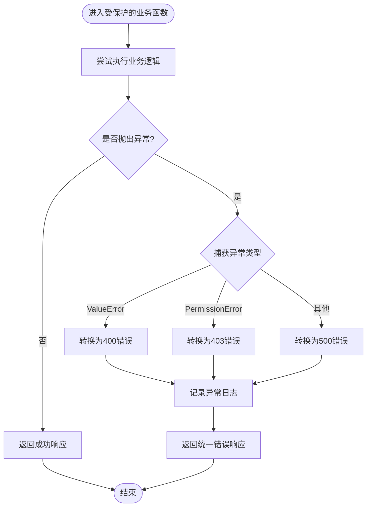
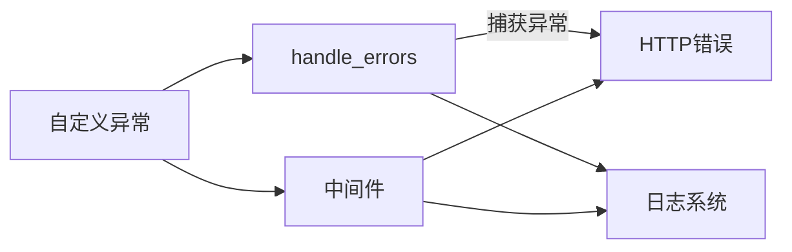

# 异常处理系统

<cite>
**本文引用的文件**
- [src/core/exceptions/base.py](file://src/core/exceptions/base.py)
- [src/core/exceptions/__init__.py](file://src/core/exceptions/__init__.py)
- [src/core/exceptions/authentication_error.py](file://src/core/exceptions/authentication_error.py)
- [src/core/exceptions/validation_error.py](file://src/core/exceptions/validation_error.py)
- [src/core/exceptions/resource_not_found_error.py](file://src/core/exceptions/resource_not_found_error.py)
- [src/core/exceptions/permission_denied_error.py](file://src/core/exceptions/permission_denied_error.py)
- [src/core/exceptions/token_error.py](file://src/core/exceptions/token_error.py)
- [src/core/exceptions/rate_limit_error.py](file://src/core/exceptions/rate_limit_error.py)
- [src/core/exceptions/ip_blocked_error.py](file://src/core/exceptions/ip_blocked_error.py)
- [src/core/exceptions/invalid_credentials_error.py](file://src/core/exceptions/invalid_credentials_error.py)
- [src/core/exceptions/user_inactive_error.py](file://src/core/exceptions/user_inactive_error.py)
- [src/core/exceptions.py](file://src/core/exceptions.py)
- [src/api/common/decorators.py](file://src/api/common/decorators.py)
- [src/core/middlewares/__init__.py](file://src/core/middlewares/__init__.py)
- [src/core/middlewares/security_middleware.py](file://src/core/middlewares/security_middleware.py)
- [src/core/middlewares/rate_limit_middleware.py](file://src/core/middlewares/rate_limit_middleware.py)
- [src/core/middlewares/request_logging_middleware.py](file://src/core/middlewares/request_logging_middleware.py)
- [src/core/middlewares/ip_limit_middleware.py](file://src/core/middlewares/ip_limit_middleware.py)
- [src/core/logger.py](file://src/core/logger.py)
- [src/api/app.py](file://src/api/app.py)
</cite>

## 目录
1. [简介](#简介)
2. [项目结构](#项目结构)
3. [核心组件](#核心组件)
4. [架构总览](#架构总览)
5. [详细组件分析](#详细组件分析)
6. [依赖分析](#依赖分析)
7. [性能考量](#性能考量)
8. [故障排查指南](#故障排查指南)
9. [结论](#结论)
10. [附录](#附录)

## 简介
本文件系统性梳理了项目的异常处理体系，涵盖自定义异常类的设计与分类、异常与 HTTP 状态码的映射、统一异常捕获与转换机制、异常日志记录策略、与中间件的集成方式、常见异常场景的处理示例、监控与告警配置建议以及性能优化策略。目标是帮助开发者在保持 API 响应一致性的同时，提升系统的可维护性与可观测性。

## 项目结构
异常处理相关的核心位置集中在以下模块：
- 自定义异常类：位于 src/core/exceptions 及其子模块，统一导出于 src/core/exceptions/__init__.py
- 中间件层：src/core/middlewares 提供安全、限流、IP 过滤、请求日志等中间件
- API 装饰器：src/api/common/decorators.py 提供统一错误处理装饰器
- 日志系统：src/core/logger.py 提供日志器与预定义日志通道
- API 实例：src/api/app.py 注册控制器并暴露健康检查接口

图表来源
- [src/core/exceptions/base.py:1-40](file://src/core/exceptions/base.py#L1-L40)
- [src/core/exceptions/__init__.py:1-33](file://src/core/exceptions/__init__.py#L1-L33)
- [src/core/middlewares/__init__.py:1-17](file://src/core/middlewares/__init__.py#L1-L17)
- [src/api/common/decorators.py:1-47](file://src/api/common/decorators.py#L1-L47)
- [src/core/logger.py:1-138](file://src/core/logger.py#L1-L138)
- [src/api/app.py:1-48](file://src/api/app.py#L1-L48)

章节来源
- [src/core/exceptions/__init__.py:1-33](file://src/core/exceptions/__init__.py#L1-L33)
- [src/core/middlewares/__init__.py:1-17](file://src/core/middlewares/__init__.py#L1-L17)
- [src/api/app.py:1-48](file://src/api/app.py#L1-L48)

## 核心组件
- 基础异常 BaseAPIError：提供统一的 message 与 code 字段，支持 to_dict 输出一致的错误结构
- 业务异常族：
  - 认证异常：AuthenticationError、InvalidCredentialsError、UserInactiveError、TokenError、TokenExpiredError
  - 权限异常：PermissionDeniedError
  - 验证异常：ValidationError
  - 资源异常：ResourceNotFoundError、ResourceAlreadyExistsError
  - 限流异常：RateLimitError
  - IP 异常：IPBlockedError
- 统一错误处理装饰器 handle_errors：对常见异常进行捕获与转换，记录异常日志
- 中间件层：安全头注入、限流、IP 黑白名单、请求日志
- 日志系统：多通道日志器（应用、访问、安全、认证），支持开发/生产环境差异化输出

章节来源
- [src/core/exceptions/base.py:1-40](file://src/core/exceptions/base.py#L1-L40)
- [src/core/exceptions.py:1-92](file://src/core/exceptions.py#L1-L92)
- [src/api/common/decorators.py:1-47](file://src/api/common/decorators.py#L1-L47)
- [src/core/logger.py:1-138](file://src/core/logger.py#L1-L138)

## 架构总览
异常处理在系统中的流转路径如下：
- 业务层抛出自定义异常或标准异常
- 统一装饰器 handle_errors 捕获并转换为 HTTP 错误
- 中间件在请求前后执行，可能提前返回错误响应（如限流、IP 拦截）
- 日志系统记录请求、错误与安全事件，便于审计与排障

图表来源
- [src/api/common/decorators.py:13-47](file://src/api/common/decorators.py#L13-L47)
- [src/core/middlewares/rate_limit_middleware.py:41-68](file://src/core/middlewares/rate_limit_middleware.py#L41-L68)
- [src/core/middlewares/ip_limit_middleware.py:41-76](file://src/core/middlewares/ip_limit_middleware.py#L41-L76)
- [src/core/logger.py:92-138](file://src/core/logger.py#L92-L138)

## 详细组件分析

### 自定义异常类设计与分类
- 设计原则
  - 统一继承自 BaseAPIError，具备 message 与 code 字段
  - to_dict 方法输出一致的错误结构，便于前端解析
  - 子类按业务域细分，继承关系体现语义层级（如 TokenError -> TokenExpiredError；AuthenticationError -> InvalidCredentialsError/UserInactiveError）

图表来源
- [src/core/exceptions/base.py:7-40](file://src/core/exceptions/base.py#L7-L40)
- [src/core/exceptions/authentication_error.py:9-26](file://src/core/exceptions/authentication_error.py#L9-L26)
- [src/core/exceptions/permission_denied_error.py:9-26](file://src/core/exceptions/permission_denied_error.py#L9-L26)
- [src/core/exceptions/resource_not_found_error.py:9-26](file://src/core/exceptions/resource_not_found_error.py#L9-L26)
- [src/core/exceptions/validation_error.py:9-26](file://src/core/exceptions/validation_error.py#L9-L26)
- [src/core/exceptions/token_error.py:9-46](file://src/core/exceptions/token_error.py#L9-L46)
- [src/core/exceptions/rate_limit_error.py:9-26](file://src/core/exceptions/rate_limit_error.py#L9-L26)
- [src/core/exceptions/ip_blocked_error.py:9-26](file://src/core/exceptions/ip_blocked_error.py#L9-L26)
- [src/core/exceptions/invalid_credentials_error.py:1-26](file://src/core/exceptions/invalid_credentials_error.py#L1-L26)
- [src/core/exceptions/user_inactive_error.py:1-26](file://src/core/exceptions/user_inactive_error.py#L1-L26)

章节来源
- [src/core/exceptions/base.py:1-40](file://src/core/exceptions/base.py#L1-L40)
- [src/core/exceptions/__init__.py:1-33](file://src/core/exceptions/__init__.py#L1-L33)
- [src/core/exceptions.py:1-92](file://src/core/exceptions.py#L1-L92)

### 异常与 HTTP 状态码映射
- 统一装饰器 handle_errors 将常见异常映射为 HTTP 错误：
  - ValueError → 400 Bad Request
  - PermissionError → 403 Forbidden
  - 其他异常 → 500 Internal Server Error
- 中间件层在特定场景直接返回 HTTP 响应：
  - 限流中间件：429 Too Many Requests
  - IP 黑名单/白名单：403 Forbidden

章节来源
- [src/api/common/decorators.py:13-47](file://src/api/common/decorators.py#L13-L47)
- [src/core/middlewares/rate_limit_middleware.py:60-66](file://src/core/middlewares/rate_limit_middleware.py#L60-L66)
- [src/core/middlewares/ip_limit_middleware.py:57-74](file://src/core/middlewares/ip_limit_middleware.py#L57-L74)

### 统一异常捕获与转换流程
- 流程要点
  - 在业务函数上使用 @handle_errors 装饰器
  - 捕获 ValueError、PermissionError 与其它异常
  - 对已知业务异常，结合中间件与装饰器输出一致的错误结构
  - 使用日志系统记录异常堆栈与上下文信息

图表来源
- [src/api/common/decorators.py:31-47](file://src/api/common/decorators.py#L31-L47)
- [src/core/logger.py:92-108](file://src/core/logger.py#L92-L108)

章节来源
- [src/api/common/decorators.py:1-47](file://src/api/common/decorators.py#L1-L47)
- [src/core/logger.py:1-138](file://src/core/logger.py#L1-L138)

### 异常日志记录策略
- 日志通道
  - 应用日志：记录 API 请求与错误
  - 访问日志：独立通道记录访问行为
  - 安全日志：记录安全事件（如 IP 黑名单触发）
  - 认证日志：记录认证事件（成功/失败）
- 日志内容
  - 请求日志：方法、路径、IP、用户、状态码
  - 错误日志：错误信息与堆栈（exc_info=True）
  - 安全日志：事件类型、IP、详情
- 环境差异
  - 开发环境：仅输出到控制台
  - 生产环境：输出到轮转文件，区分应用日志与错误日志

章节来源
- [src/core/logger.py:12-82](file://src/core/logger.py#L12-L82)
- [src/core/logger.py:92-138](file://src/core/logger.py#L92-L138)

### 与中间件的集成方式
- 安全中间件：在生产环境为响应添加安全头
- 限流中间件：基于 IP 的请求频率限制，超限返回 429
- IP 限制中间件：白名单/黑名单校验，不匹配返回 403
- 请求日志中间件：记录请求开始与完成信息、耗时与用户/IP

章节来源
- [src/core/middlewares/security_middleware.py:14-54](file://src/core/middlewares/security_middleware.py#L14-L54)
- [src/core/middlewares/rate_limit_middleware.py:15-112](file://src/core/middlewares/rate_limit_middleware.py#L15-L112)
- [src/core/middlewares/ip_limit_middleware.py:15-130](file://src/core/middlewares/ip_limit_middleware.py#L15-L130)
- [src/core/middlewares/request_logging_middleware.py:14-86](file://src/core/middlewares/request_logging_middleware.py#L14-L86)

### 常见异常场景与处理示例
- 认证失败
  - 抛出 InvalidCredentialsError 或 UserInactiveError
  - 统一装饰器转换为 400/403
  - 记录认证事件日志
- 权限不足
  - 抛出 PermissionDeniedError
  - 装饰器转换为 403
- 资源不存在/已存在
  - 抛出 ResourceNotFoundError/ResourceAlreadyExistsError
  - 装饰器转换为 404/409（若扩展映射）
- 验证失败
  - 抛出 ValidationError
  - 装饰器转换为 400
- 限流触发
  - 限流中间件直接返回 429
- IP 被封禁
  - IP 限制中间件直接返回 403

章节来源
- [src/core/exceptions/invalid_credentials_error.py:1-26](file://src/core/exceptions/invalid_credentials_error.py#L1-L26)
- [src/core/exceptions/user_inactive_error.py:1-26](file://src/core/exceptions/user_inactive_error.py#L1-L26)
- [src/core/exceptions/permission_denied_error.py:1-26](file://src/core/exceptions/permission_denied_error.py#L1-L26)
- [src/core/exceptions/resource_not_found_error.py:1-26](file://src/core/exceptions/resource_not_found_error.py#L1-L26)
- [src/core/exceptions/validation_error.py:1-26](file://src/core/exceptions/validation_error.py#L1-L26)
- [src/core/middlewares/rate_limit_middleware.py:58-66](file://src/core/middlewares/rate_limit_middleware.py#L58-L66)
- [src/core/middlewares/ip_limit_middleware.py:66-74](file://src/core/middlewares/ip_limit_middleware.py#L66-L74)
- [src/core/logger.py:111-127](file://src/core/logger.py#L111-L127)

### 异常监控与告警配置指南
- 建议采集指标
  - 错误率（按异常类型与 HTTP 状态码分组）
  - 429/403 触发次数（限流与 IP 拦截）
  - 请求耗时分布（结合请求日志中间件）
- 告警阈值
  - 错误率超过阈值持续 N 分钟
  - 429/403 触发次数在窗口内超过阈值
- 日志采集
  - 将错误日志与访问日志导入集中式日志系统
  - 对敏感字段进行脱敏（如用户凭证、Token）

章节来源
- [src/core/middlewares/rate_limit_middleware.py:58-66](file://src/core/middlewares/rate_limit_middleware.py#L58-L66)
- [src/core/middlewares/ip_limit_middleware.py:66-74](file://src/core/middlewares/ip_limit_middleware.py#L66-L74)
- [src/core/logger.py:92-138](file://src/core/logger.py#L92-L138)

## 依赖分析
- 异常类之间的继承关系清晰，便于按业务域扩展
- 中间件与异常处理解耦，通过 HTTP 状态码与 JSON 响应进行交互
- 统一装饰器作为横切关注点，减少控制器中的重复错误处理代码

图表来源
- [src/api/common/decorators.py:13-47](file://src/api/common/decorators.py#L13-L47)
- [src/core/middlewares/rate_limit_middleware.py:41-68](file://src/core/middlewares/rate_limit_middleware.py#L41-L68)
- [src/core/middlewares/ip_limit_middleware.py:41-76](file://src/core/middlewares/ip_limit_middleware.py#L41-L76)
- [src/core/logger.py:92-138](file://src/core/logger.py#L92-L138)

章节来源
- [src/core/exceptions/__init__.py:1-33](file://src/core/exceptions/__init__.py#L1-L33)
- [src/core/middlewares/__init__.py:1-17](file://src/core/middlewares/__init__.py#L1-L17)

## 性能考量
- 中间件开销
  - 限流与 IP 校验使用缓存与数据库查询，需评估并发与延迟
  - 建议将热点数据放入缓存，合理设置过期时间
- 日志开销
  - 生产环境采用轮转文件，避免磁盘写入阻塞
  - 仅在错误路径记录完整堆栈，普通路径记录必要字段
- 异常转换成本
  - 统一装饰器尽量减少异常捕获层级，避免深层嵌套
  - 对高频异常类型（如 429/403）优先在中间件层快速返回

章节来源
- [src/core/middlewares/rate_limit_middleware.py:87-112](file://src/core/middlewares/rate_limit_middleware.py#L87-L112)
- [src/core/middlewares/ip_limit_middleware.py:109-130](file://src/core/middlewares/ip_limit_middleware.py#L109-L130)
- [src/core/logger.py:42-82](file://src/core/logger.py#L42-L82)

## 故障排查指南
- 如何定位异常
  - 查看 API 错误日志通道，确认异常堆栈与上下文
  - 结合请求日志中间件查看请求耗时与用户/IP
- 常见问题
  - 429 频繁出现：检查限流配置与缓存可用性
  - 403 白名单/黑名单：核对 IP 列表与有效期
  - 认证失败：检查认证日志通道与凭据有效性
- 安全与合规
  - 对敏感信息进行脱敏处理
  - 仅在必要时记录完整堆栈，避免泄露内部细节

章节来源
- [src/core/logger.py:92-138](file://src/core/logger.py#L92-L138)
- [src/core/middlewares/rate_limit_middleware.py:58-66](file://src/core/middlewares/rate_limit_middleware.py#L58-L66)
- [src/core/middlewares/ip_limit_middleware.py:66-74](file://src/core/middlewares/ip_limit_middleware.py#L66-L74)

## 结论
该异常处理系统通过“基础异常 + 业务异常族 + 统一装饰器 + 中间件 + 日志系统”的组合，实现了高内聚、低耦合的错误处理机制。配合明确的 HTTP 状态码映射与一致的错误响应格式，既保证了 API 的一致性，也为运维与监控提供了良好的基础。建议在生产环境中进一步完善监控告警与缓存策略，以获得更佳的稳定性与性能表现。

## 附录
- 最佳实践清单
  - 使用统一装饰器包裹所有业务函数
  - 明确异常与状态码映射，避免歧义
  - 在日志中记录必要上下文，但避免泄露敏感信息
  - 对高频异常在中间件层快速拦截，降低后端压力
  - 为异常类型建立指标与告警，实现可观测性闭环